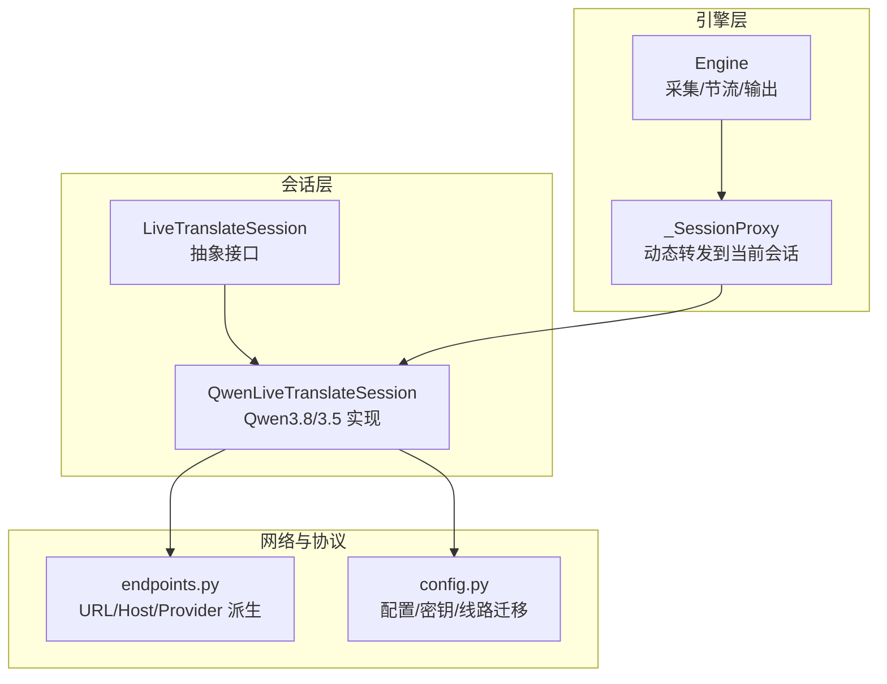
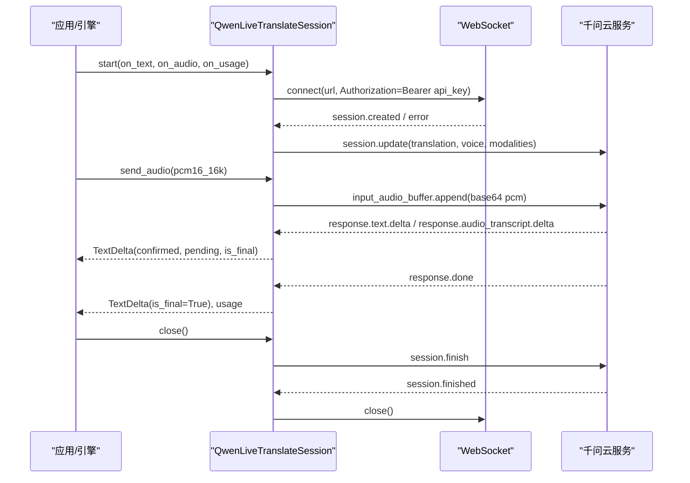
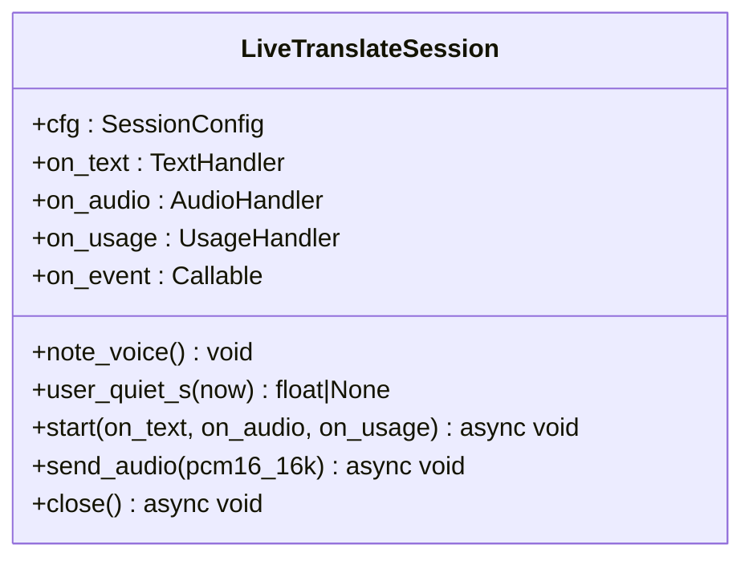
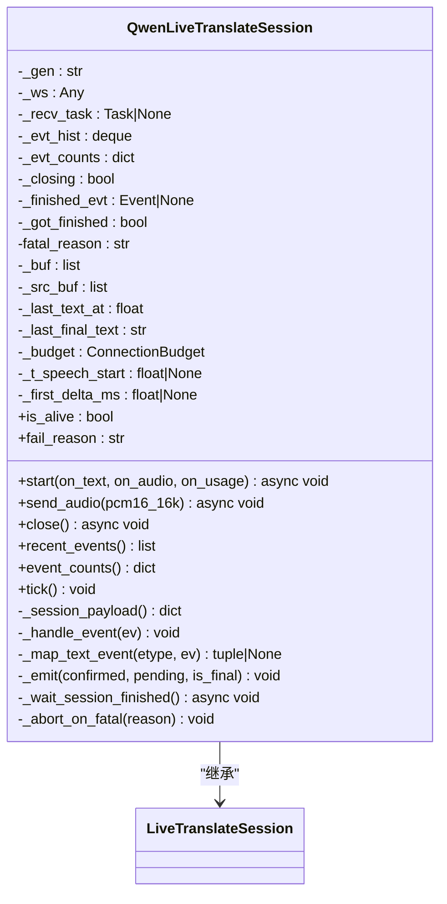
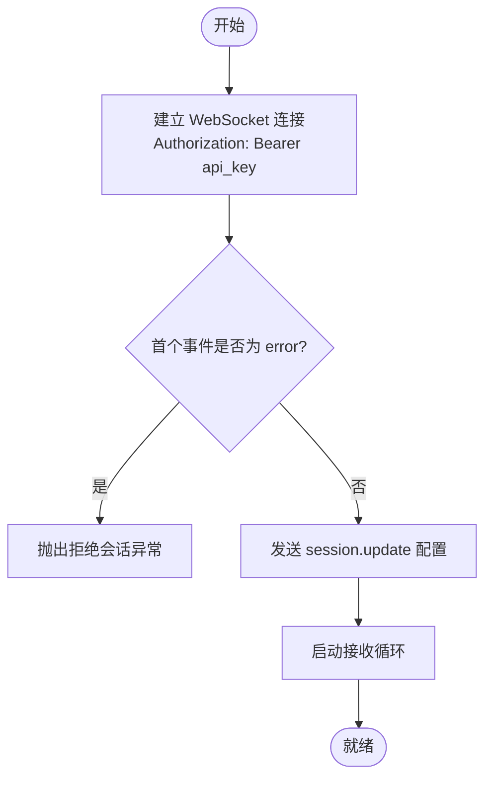
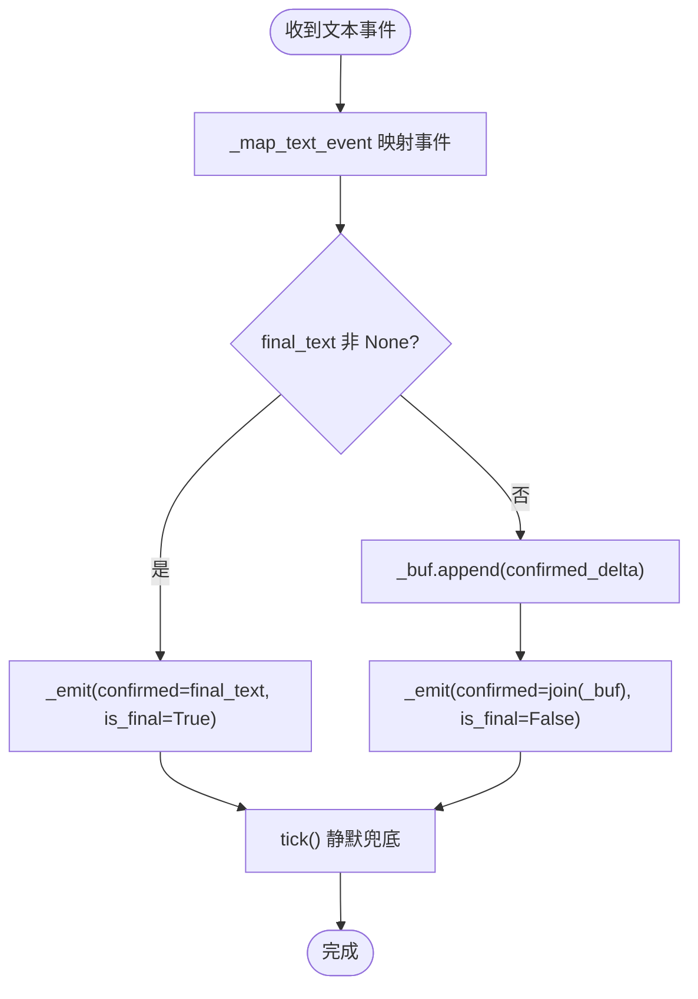
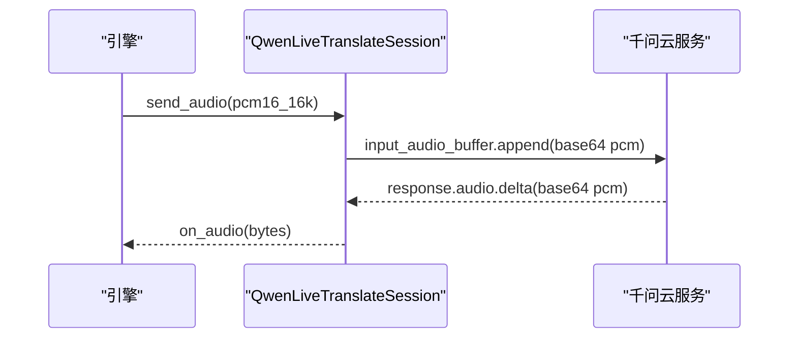
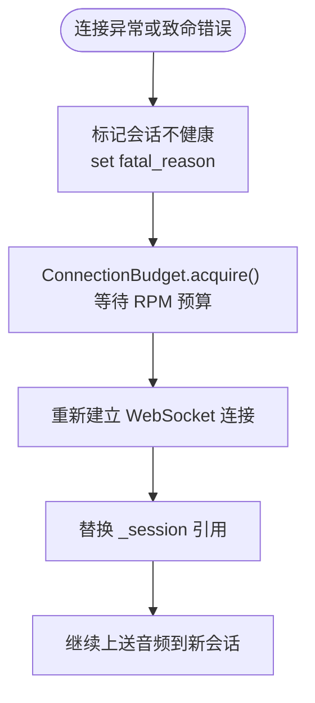
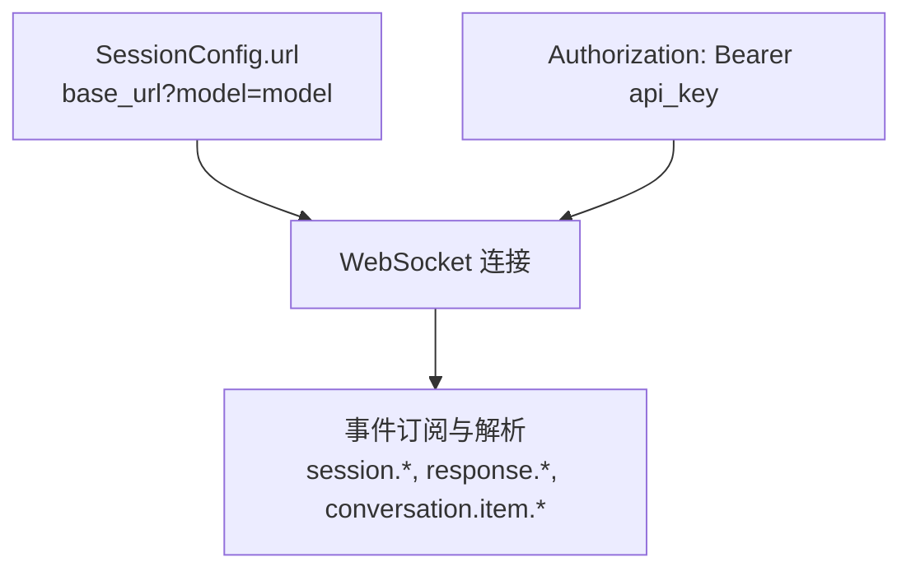
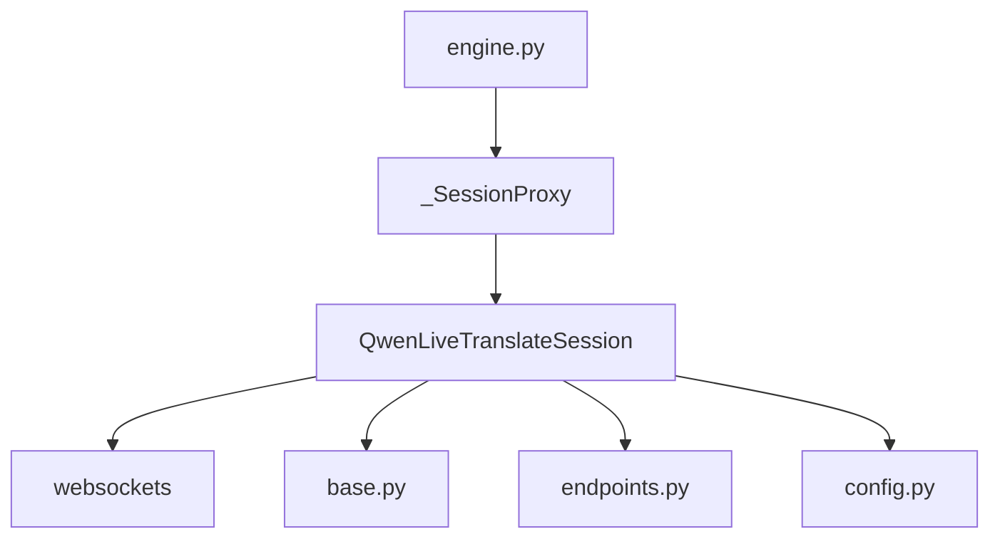

# Qwen3.8 会话实现

<cite>
**本文引用的文件**   
- [base.py](file://vlt/session/base.py)
- [qwen38.py](file://vlt/session/qwen38.py)
- [engine.py](file://vlt/engine.py)
- [config.py](file://vlt/config.py)
- [endpoints.py](file://vlt/endpoints.py)
- [test_reconnect.py](file://tests/test_reconnect.py)
- [test_fast_finalize.py](file://tests/test_fast_finalize.py)
- [test_stop_freeze.py](file://tests/test_stop_freeze.py)
- [config.example.yaml](file://config.example.yaml)
</cite>

## 目录
1. [简介](#简介)
2. [项目结构](#项目结构)
3. [核心组件](#核心组件)
4. [架构总览](#架构总览)
5. [详细组件分析](#详细组件分析)
6. [依赖关系分析](#依赖关系分析)
7. [性能与延迟特性](#性能与延迟特性)
8. [调试与监控](#调试与监控)
9. [常见问题与排障](#常见问题与排障)
10. [结论](#结论)

## 简介
本文面向 Qwen3.8 实时翻译会话的技术文档，重点围绕 `QwenLiveTranslateSession` 对 `LiveTranslateSession` 接口的具体实现展开。内容覆盖：
- WebSocket 连接建立、认证、消息格式转换
- 增量文本处理机制，包括 `response.text.done`、`response.done` 等事件解析
- 文本确认与预测状态管理
- 重连机制与错误恢复策略
- 音频流处理方式（PCM 传输、采样率约定）
- 与千问云服务的协议细节（URL 构建、请求头、事件订阅、响应解析）
- 调试与监控方法（日志、指标、故障诊断）
- 实际使用示例与常见问题解决方案

## 项目结构
本项目采用“会话抽象 + 代次实现”的分层设计：
- `session/base.py` 定义跨代次的统一接口与归一化事件模型
- `session/qwen38.py` 实现 Qwen3.8 / Qwen3.5 的实时会话逻辑
- `engine.py` 负责采集、节流、会话代理、看门狗重连、输出合成
- `config.py` 负责配置加载、密钥来源、线路迁移与默认值校验
- `endpoints.py` 是出网端点的单一真相源，负责两条服务线路的地址派生

**图表来源**
- [base.py:130-181](file://vlt/session/base.py#L130-L181)
- [qwen38.py:82-138](file://vlt/session/qwen38.py#L82-L138)
- [engine.py:356-500](file://vlt/engine.py#L356-L500)
- [endpoints.py:162-197](file://vlt/endpoints.py#L162-L197)
- [config.py:258-336](file://vlt/config.py#L258-L336)

**章节来源**
- [base.py:1-181](file://vlt/session/base.py#L1-181)
- [qwen38.py:1-138](file://vlt/session/qwen38.py#L1-L138)
- [engine.py:1-500](file://vlt/engine.py#L1-L500)
- [config.py:1-336](file://vlt/config.py#L1-L336)
- [endpoints.py:1-197](file://vlt/endpoints.py#L1-L197)

## 核心组件
- `LiveTranslateSession`：定义双工实时翻译会话的统一接口，包含文本回调、音频回调、用量回调、原始事件钩子、语音电平上报与静默判断工具。
- `QwenLiveTranslateSession`：实现 WebSocket 连接、认证、事件循环、文本增量合并、音频增量解码、源语言识别、响应结束处理、优雅关闭与致命错误处理。
- `_SessionProxy`：将采集循环的音频发送转发到当前会话，支持重连后自动落到新会话，避免旧引用继续往死连接上发数据。
- `ConnectionBudget`：RPM 预算控制，限制每分钟新建连接数，防止快速重连撞掉服务端。
- `endpoints`：提供两条服务线路（国内千问云、海外千问云·海外版）的 URL 派生、host 解析、密钥槽名与线路描述。
- `config`：加载 YAML 配置与环境变量，处理 API key 来源、线路迁移、默认值校验与非法值回落。

**章节来源**
- [base.py:18-181](file://vlt/session/base.py#L18-L181)
- [qwen38.py:62-138](file://vlt/session/qwen38.py#L62-L138)
- [engine.py:356-500](file://vlt/engine.py#L356-L500)
- [endpoints.py:53-197](file://vlt/endpoints.py#L53-L197)
- [config.py:68-336](file://vlt/config.py#L68-L336)

## 架构总览
Qwen3.8 会话的整体流程如下：
- 引擎启动后创建 `SessionConfig`，通过 `create_session` 分发到 `QwenLiveTranslateSession`
- 会话建立 WebSocket 连接，携带 Bearer Token 认证，发送 `session.update` 配置
- 接收循环持续解析服务端事件，归一化为 `TextDelta` 与 PCM 音频字节
- 引擎侧通过 `_SessionProxy` 转发音频，结合静音闸门与输入门限优化上送
- 当检测到致命错误或连接异常时，标记会话不健康，由看门狗触发重连

**图表来源**
- [qwen38.py:113-138](file://vlt/session/qwen38.py#L113-L138)
- [qwen38.py:161-168](file://vlt/session/qwen38.py#L161-L168)
- [qwen38.py:307-405](file://vlt/session/qwen38.py#L307-L405)
- [qwen38.py:204-243](file://vlt/session/qwen38.py#L204-L243)

## 详细组件分析

### LiveTranslateSession 抽象接口
- 定义统一的文本、音频、用量回调接口
- 提供 `note_voice()` 用于上游电平信号上报，辅助快封句逻辑
- 提供 `user_quiet_s()` 计算距上次有人说话的时间，用于静默兜底判断
- 抽象方法 `start`、`send_audio`、`close` 强制实现类提供连接、音频上送与优雅关闭能力

**图表来源**
- [base.py:130-181](file://vlt/session/base.py#L130-L181)

**章节来源**
- [base.py:130-181](file://vlt/session/base.py#L130-L181)

### QwenLiveTranslateSession 实现
- 继承 `LiveTranslateSession`，实现 WebSocket 连接、认证、事件循环、文本增量合并、音频增量解码、源语言识别、响应结束处理、优雅关闭与致命错误处理
- 通过 `_map_text_event` 按代次分派事件字段差异（3.8 与 3.5 的事件名与字段不同）
- 使用 `_buf` 累加已确认文本，`_src_buf` 累积源语言识别结果
- 通过 `tick()` 实现静默兜底，结合 `should_finalize()` 判断是否发出最终版文本
- 通过 `_emit()` 去重最终版文本，避免下游重复刷新

**图表来源**
- [qwen38.py:82-491](file://vlt/session/qwen38.py#L82-L491)
- [base.py:130-181](file://vlt/session/base.py#L130-L181)

**章节来源**
- [qwen38.py:82-491](file://vlt/session/qwen38.py#L82-L491)

### WebSocket 连接与认证
- 使用 `websockets.connect` 建立连接，传入 `Authorization: Bearer {api_key}` 作为认证头
- 连接超时设为 15 秒，ping 间隔与超时均为 20 秒，关闭握手超时为 1.5 秒
- 连接成功后读取首个事件，若为 `error` 则抛出拒绝会话异常
- 发送 `session.update` 配置，包含目标语言、音色、模态、热词、断句策略等

**图表来源**
- [qwen38.py:113-138](file://vlt/session/qwen38.py#L113-L138)

**章节来源**
- [qwen38.py:113-138](file://vlt/session/qwen38.py#L113-L138)

### 增量文本处理机制
- 服务端返回多种文本事件：
  - Qwen3.8：`response.text.delta`（增量）、`response.text.done`（全文）
  - Qwen3.5：`response.text.text`（含预测 stash）、`response.text.done`（全文）
- `_map_text_event` 根据代次映射事件字段，返回 `(confirmed_delta, pending, final_text)`
- `_buf` 累加已确认文本，`_src_buf` 累积源语言识别结果
- `tick()` 周期检查静默时长，调用 `should_finalize()` 决定是否发出最终版文本
- `_emit()` 去重最终版文本，避免下游重复刷新

**图表来源**
- [qwen38.py:343-405](file://vlt/session/qwen38.py#L343-L405)
- [qwen38.py:407-443](file://vlt/session/qwen38.py#L407-L443)
- [qwen38.py:445-491](file://vlt/session/qwen38.py#L445-L491)

**章节来源**
- [qwen38.py:343-491](file://vlt/session/qwen38.py#L343-L491)

### 音频流处理
- 客户端发送 16kHz 单声道 s16le PCM 音频，Base64 编码后通过 `input_audio_buffer.append` 上送
- 服务端返回 `response.audio.delta`，包含 Base64 编码的 PCM 音频片段
- 会话层解码 Base64 后通过 `on_audio` 回调输出原始 PCM 字节
- 引擎层负责采样率转换、TTS 合成与虚拟声卡输出（不在本文件内）

**图表来源**
- [qwen38.py:161-168](file://vlt/session/qwen38.py#L161-L168)
- [qwen38.py:379-384](file://vlt/session/qwen38.py#L379-L384)

**章节来源**
- [qwen38.py:161-168](file://vlt/session/qwen38.py#L161-L168)
- [qwen38.py:379-384](file://vlt/session/qwen38.py#L379-L384)

### 重连机制与错误恢复
- `ConnectionBudget` 限制每分钟新建连接数，防止快速重连撞掉服务端
- 会话标记 `fatal_reason` 表示服务端判定致命错误（如 `model repeat output happened`），主动放弃会话
- 引擎侧 `_SessionProxy` 捕获发送异常，丢弃该块并等待看门狗重连
- 看门狗检测会话不健康时安排重连，重连成功后音频自动发到新会话

**图表来源**
- [qwen38.py:62-80](file://vlt/session/qwen38.py#L62-L80)
- [qwen38.py:281-304](file://vlt/session/qwen38.py#L281-L304)
- [engine.py:421-443](file://vlt/engine.py#L421-L443)

**章节来源**
- [qwen38.py:62-80](file://vlt/session/qwen38.py#L62-L80)
- [qwen38.py:281-304](file://vlt/session/qwen38.py#L281-L304)
- [engine.py:421-443](file://vlt/engine.py#L421-L443)

### 与千问云服务的协议细节
- URL 构建：`SessionConfig.url` 拼接 `base_url?model={model}`，`base_url` 来自 `endpoints.default_base_url`
- 请求头：`Authorization: Bearer {api_key}`
- 事件订阅：接收 `session.created`、`session.update`、`response.*`、`conversation.item.*`、`session.finished` 等事件
- 响应解析：`_handle_event` 分派生命周期、文本、音频、源语言识别、响应结束等事件

**图表来源**
- [base.py:116-121](file://vlt/session/base.py#L116-L121)
- [qwen38.py:113-138](file://vlt/session/qwen38.py#L113-L138)
- [qwen38.py:307-405](file://vlt/session/qwen38.py#L307-L405)
- [endpoints.py:162-197](file://vlt/endpoints.py#L162-L197)

**章节来源**
- [base.py:116-121](file://vlt/session/base.py#L116-L121)
- [qwen38.py:113-138](file://vlt/session/qwen38.py#L113-L138)
- [qwen38.py:307-405](file://vlt/session/qwen38.py#L307-L405)
- [endpoints.py:162-197](file://vlt/endpoints.py#L162-L197)

## 依赖关系分析
- `QwenLiveTranslateSession` 依赖 `websockets` 库进行 WebSocket 通信
- 依赖 `base.py` 中的 `LiveTranslateSession`、`SessionConfig`、`TextDelta`、`should_finalize`
- 依赖 `endpoints.py` 提供 URL 派生与线路描述
- 依赖 `config.py` 提供配置加载与密钥来源
- 引擎层 `engine.py` 通过 `_SessionProxy` 与会话解耦，支持重连后自动切换

**图表来源**
- [qwen38.py:13-25](file://vlt/session/qwen38.py#L13-L25)
- [engine.py:356-500](file://vlt/engine.py#L356-L500)

**章节来源**
- [qwen38.py:13-25](file://vlt/session/qwen38.py#L13-L25)
- [engine.py:356-500](file://vlt/engine.py#L356-L500)

## 性能与延迟特性
- 首文本增量延迟约 1.0 秒，首音频增量延迟约 1.2~1.5 秒
- 快封句逻辑可将终版从“说完后 +2.1s”提前到“+0.3s”，节省约 1.8 秒
- RPM 限制为 10，每次 WebSocket 连接算一次请求
- 关闭握手超时为 1.5 秒，避免服务端不回 close 帧导致界面卡顿

**章节来源**
- [qwen38.py:6-12](file://vlt/session/qwen38.py#L6-L12)
- [qwen38.py:27-39](file://vlt/session/qwen38.py#L27-L39)
- [qwen38.py:407-443](file://vlt/session/qwen38.py#L407-L443)

## 调试与监控
- 原始事件钩子：`on_event(event_type, full_event)` 可用于埋点与调试
- 黑匣子事件历史：`recent_events()` 返回最近事件类型与相对时间，用于断线诊断
- 事件计数：`event_counts()` 统计各事件类型出现次数
- 失败原因：`fail_reason` 返回接收循环异常或致命错误原因
- 首次增量延迟：`first_delta_ms` 暴露首个文本增量延迟（以 `speech_started` 为基准）

**章节来源**
- [qwen38.py:177-202](file://vlt/session/qwen38.py#L177-L202)
- [qwen38.py:485-491](file://vlt/session/qwen38.py#L485-L491)

## 常见问题与排障
- **API Key 未配置**：程序启动时会提示设置 `DASHSCOPE_API_KEY` 或通过界面保存
- **Voice 未指定**：必须显式指定音色，否则服务端抛 `Voice 'Chelsie' is not supported.`
- **连接预算不足**：RPM 限制下，频繁重连会被拒绝，需等待预算释放
- **服务端致命错误**：如 `model repeat output happened`，会话主动放弃并重连
- **关闭握手超时**：服务端不回 close 帧时，会话会记录降级路径并强制断连

**章节来源**
- [config.py:68-104](file://vlt/config.py#L68-L104)
- [qwen38.py:6-12](file://vlt/session/qwen38.py#L6-L12)
- [qwen38.py:62-80](file://vlt/session/qwen38.py#L62-L80)
- [qwen38.py:204-243](file://vlt/session/qwen38.py#L204-L243)

## 结论
Qwen3.8 会话实现通过清晰的抽象接口与代次适配，实现了稳定的实时翻译功能。其核心优势包括：
- 统一的会话接口与归一化事件模型，便于扩展新代次
- 健壮的 WebSocket 连接管理与错误恢复机制
- 高效的增量文本处理与静默兜底逻辑
- 灵活的音频流处理与传输优化
- 完善的调试与监控能力，便于问题定位与性能调优

在实际使用中，建议关注 RPM 限制、音色配置、API Key 来源与连接超时等关键点，以确保会话稳定运行。