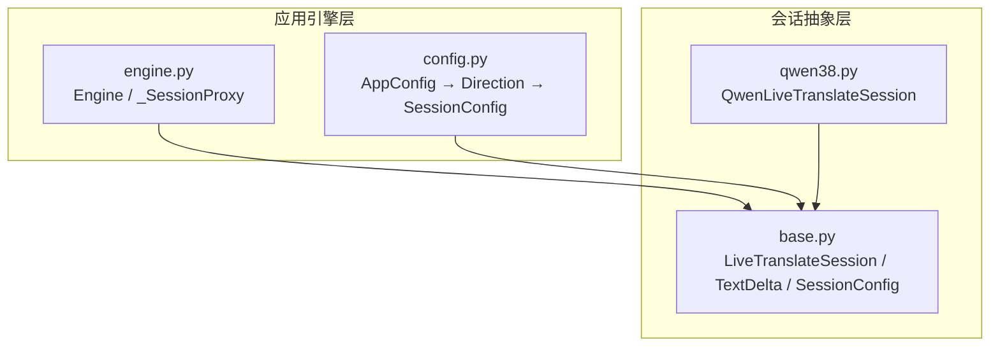
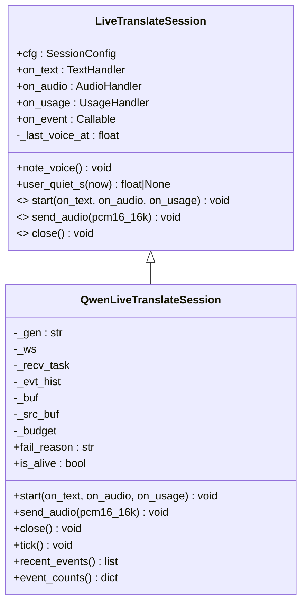
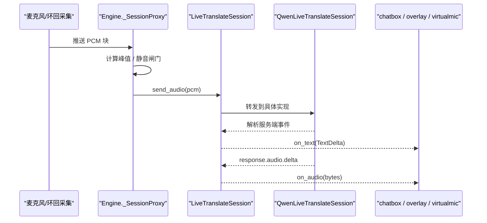
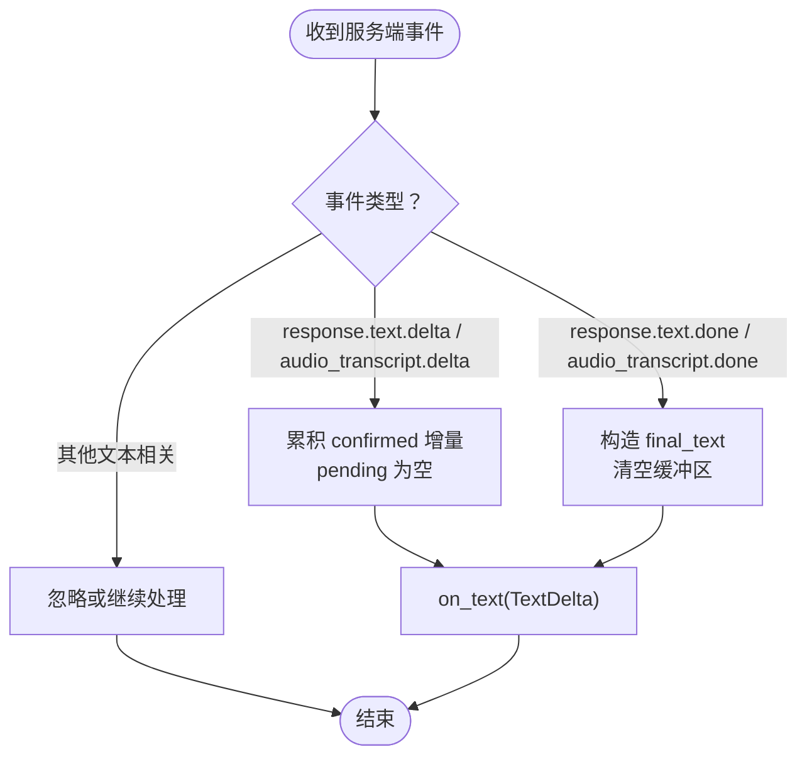
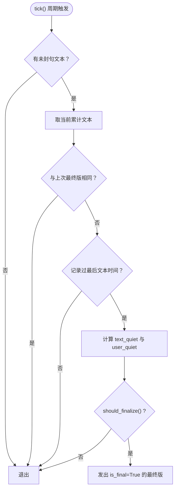
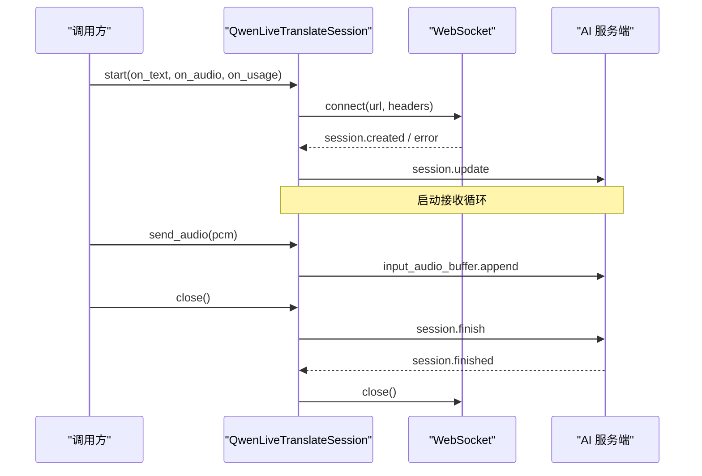
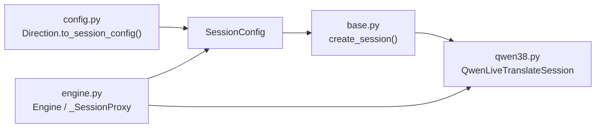

# 会话抽象接口

<cite>
**本文引用的文件**   
- [vlt/session/base.py](file://vlt/session/base.py)
- [vlt/session/qwen38.py](file://vlt/session/qwen38.py)
- [vlt/config.py](file://vlt/config.py)
- [vlt/engine.py](file://vlt/engine.py)
</cite>

## 目录
1. [引言](#引言)
2. [项目结构](#项目结构)
3. [核心组件](#核心组件)
4. [架构总览](#架构总览)
5. [详细组件分析](#详细组件分析)
6. [依赖关系分析](#依赖关系分析)
7. [性能与稳定性](#性能与稳定性)
8. [故障排查指南](#故障排查指南)
9. [扩展新模型实现指南](#扩展新模型实现指南)
10. [结论](#结论)

## 引言
本文件围绕“会话抽象接口”展开，目标是解释如何通过 `LiveTranslateSession` 抽象类统一不同 AI 模型的通信差异，并给出数据模型、配置、生命周期、事件回调、错误处理与扩展实践的系统性说明。读者无需了解底层 WebSocket 协议细节，也能理解如何接入新的 AI 模型。

## 项目结构
与“会话抽象接口”直接相关的代码集中在以下模块：
- `vlt/session/base.py`：定义会话抽象、归一化数据模型、静默策略与工厂方法。
- `vlt/session/qwen38.py`：提供 qwen3.8 / qwen3.5-livetranslate-flash-realtime 的具体实现。
- `vlt/config.py`：把 YAML/环境变量等来源的配置转换为 `SessionConfig`。
- `vlt/engine.py`：引擎层负责采集、节流、静音闸门、重连看门狗，并通过 `_SessionProxy` 调用会话。

**图示来源**
- [vlt/session/base.py:130-181](file://vlt/session/base.py#L130-L181)
- [vlt/session/qwen38.py:82-111](file://vlt/session/qwen38.py#L82-L111)
- [vlt/config.py:121-154](file://vlt/config.py#L121-L154)
- [vlt/engine.py:356-444](file://vlt/engine.py#L356-L444)

**章节来源**
- [vlt/session/base.py:1-181](file://vlt/session/base.py#L1-L181)
- [vlt/session/qwen38.py:1-492](file://vlt/session/qwen38.py#L1-L492)
- [vlt/config.py:1-406](file://vlt/config.py#L1-L406)
- [vlt/engine.py:1-800](file://vlt/engine.py#L1-L800)

## 核心组件
本节聚焦三个关键对象：
- `TextDelta`：归一化的文本增量事件。
- `SessionConfig`：一条会话的全部可配置项。
- `LiveTranslateSession`：双工实时翻译会话的抽象接口。

### TextDelta 数据模型
`TextDelta` 是下游（聊天框、叠加窗、虚拟麦）消费的统一文本事件，屏蔽了不同模型的事件字段差异。

| 字段 | 类型 | 含义与使用场景 |
|---|---|---|
| `confirmed` | `str` | 已确认的累计译文片段；用于拼接完整句子。 |
| `pending` | `str` | 尚未确认的预测文本；会被后续事件替换，不能累加显示。 |
| `is_final` | `bool` | 表示当前响应结束；触发最终版输出逻辑。 |
| `source` | `str` | 源语言识别结果；可用于“原文+译文”双行展示。 |
| `display` | `str`（属性） | 给用户的显示文本：`confirmed + pending` 去空白后拼接。 |

设计要点：
- 下游永远只消费 `TextDelta`，不感知背后是 qwen3.8 还是 qwen3.5。
- `pending` 的存在是为了兼容旧代次模型的“预测缓存”语义；新代次通常为空串。
- `is_final=True` 时，应视为一段话的终结，但要注意重复终结的去重。

**章节来源**
- [vlt/session/base.py:18-37](file://vlt/session/base.py#L18-L37)

### SessionConfig 配置类
`SessionConfig` 集中管理模型选择、语言设置、连接参数和静默检测配置。它由 `Direction.to_session_config()` 从应用配置转换而来。

关键字段分组如下：

| 分组 | 字段 | 默认值或取值说明 | 作用 |
|---|---|---|---|
| 模型与线路 | `model` | `"qwen3.8-livetranslate-flash-realtime"` | 决定具体实现类与事件映射。 |
| 语言 | `target_lang` | `"en"` | 目标翻译语言。 |
| 语言 | `source_lang` | `None`（自动识别） | 源语言；为 None 时服务端自动识别。 |
| 音频输出 | `output_audio` | `False` | True 时同时返回译音。 |
| 语音音色 | `voice` | `"Tina"` | 必须显式指定，否则部分服务端会报错。 |
| 热词 | `hotwords` | `{}` | 专有词库短语映射。 |
| 轮转检测 | `turn_detection` | `None`（服务端默认） | 传入服务端 turn detection 类型。 |
| 地址与提供商 | `base_url` | 由 endpoints 派生 | 唯一真实连接地址。 |
| 提供商 | `provider` | `endpoints.DEFAULT_PROVIDER` | 日志与诊断用途。 |
| 鉴权 | `api_key` | `""` | 实际连接时通过 Authorization 头携带。 |
| 连接预算 | `reconnect_backoff` | `(2, 5, 10, 30)` | 重连退避序列。 |
| 连接预算 | `max_new_sessions_per_minute` | `4` | RPM 限制：每次 WS 连接算一次请求。 |
| 静默兜底 | `final_silence_s` | `DEFAULT_FINAL_SILENCE_S` | 文字静默超过该值封句。 |
| 快封句 | `fast_final_silence_s` | `DEFAULT_FAST_FINAL_SILENCE_S` 或 `None` | 用户也静了之后，按此值提前封句。 |
| 快封句 | `fast_final_user_quiet_s` | `DEFAULT_FAST_FINAL_USER_QUIET_S` | 上游无声音的最小时长阈值。 |

辅助属性：
- `url`：在 `base_url` 后拼接 `?model=`，作为 WebSocket 连接地址。

**章节来源**
- [vlt/session/base.py:86-120](file://vlt/session/base.py#L86-L120)
- [vlt/config.py:121-154](file://vlt/config.py#L121-L154)

### LiveTranslateSession 抽象接口
`LiveTranslateSession` 定义了双工实时翻译会话的统一契约。实现类负责把不同代次的 WebSocket 事件名、字段名、断句配置映射到统一的 `TextDelta` 和 PCM 字节流。

核心职责：
- 持有 `SessionConfig`。
- 暴露四个回调钩子：`on_text`、`on_audio`、`on_usage`、`on_event`。
- 维护“最近有人说话”的时间戳，供静默兜底的快路径判断。
- 定义生命周期方法：`start()`、`send_audio()`、`close()`。

**图示来源**
- [vlt/session/base.py:130-172](file://vlt/session/base.py#L130-L172)
- [vlt/session/qwen38.py:82-111](file://vlt/session/qwen38.py#L82-L111)

**章节来源**
- [vlt/session/base.py:123-181](file://vlt/session/base.py#L123-L181)

## 架构总览
下图展示“引擎 → 会话抽象 → 具体模型实现”的调用链，以及事件回流的反向路径。

**图示来源**
- [vlt/engine.py:375-444](file://vlt/engine.py#L375-L444)
- [vlt/session/qwen38.py:161-168](file://vlt/session/qwen38.py#L161-L168)
- [vlt/session/qwen38.py:380-384](file://vlt/session/qwen38.py#L380-L384)

## 详细组件分析

### 文本事件归一化流程
服务端可能返回多种事件类型，`QwenLiveTranslateSession` 通过 `_map_text_event()` 按代次分派，再交给 `_emit()` 生成 `TextDelta`。

**图示来源**
- [vlt/session/qwen38.py:445-472](file://vlt/session/qwen38.py#L445-L472)
- [vlt/session/qwen38.py:474-492](file://vlt/session/qwen38.py#L474-L492)

**章节来源**
- [vlt/session/qwen38.py:343-405](file://vlt/session/qwen38.py#L343-L405)
- [vlt/session/qwen38.py:445-492](file://vlt/session/qwen38.py#L445-L492)

### 静默兜底与快封句
当持续上送音频时，服务端可能长时间不发 `response.text.done` 或 `response.done`。系统通过“慢路径 + 快路径”保证句末最终版必达。

- 慢路径：文字静默 ≥ `final_silence_s`。
- 快路径：用户也静了 ≥ `fast_final_user_quiet_s`，且文字静默 ≥ `fast_final_silence_s`。

**图示来源**
- [vlt/session/qwen38.py:407-443](file://vlt/session/qwen38.py#L407-L443)
- [vlt/session/base.py:60-84](file://vlt/session/base.py#L60-L84)

**章节来源**
- [vlt/session/base.py:39-84](file://vlt/session/base.py#L39-L84)
- [vlt/session/qwen38.py:407-443](file://vlt/session/qwen38.py#L407-L443)

### 生命周期管理：start / send_audio / close
- `start()`：建立 WebSocket 连接、发送 `session.update`、启动接收循环。
- `send_audio()`：将 16kHz 单声道 s16le PCM 编码为 base64 后上送。
- `close()`：按官方结束序列发 `session.finish`，等待 `session.finished`，再有界关闭 WebSocket。

**图示来源**
- [vlt/session/qwen38.py:113-137](file://vlt/session/qwen38.py#L113-L137)
- [vlt/session/qwen38.py:161-168](file://vlt/session/qwen38.py#L161-L168)
- [vlt/session/qwen38.py:204-243](file://vlt/session/qwen38.py#L204-L243)

**章节来源**
- [vlt/session/qwen38.py:113-137](file://vlt/session/qwen38.py#L113-L137)
- [vlt/session/qwen38.py:204-243](file://vlt/session/qwen38.py#L204-L243)

### 事件回调机制
| 回调 | 类型 | 用途 | 调用时机 |
|---|---|---|---|
| `on_text` | `Callable[[TextDelta], None]` | 向下游推送归一化文本事件。 | 每次文本增量、预测文本更新、最终版输出。 |
| `on_audio` | `Callable[[bytes], None]` | 推送 24kHz 单声道 s16le PCM 音频增量。 | 收到 `response.audio.delta` 时。 |
| `on_usage` | `Callable[[dict], None]` | 上报用量统计。 | 收到 `response.done` 且包含 usage 时。 |
| `on_event` | `Callable[[str, dict], None]` | 原始服务端事件钩子，用于调试或埋点。 | 每个服务端事件进入 `_handle_event()` 时。 |

注意：
- `on_event` 异常被吞掉，避免影响主流程。
- `on_usage` 只在 `response.done` 带 usage 时触发。
- `on_audio` 仅在启用音频输出时有效。

**章节来源**
- [vlt/session/base.py:125-139](file://vlt/session/base.py#L125-L139)
- [vlt/session/qwen38.py:343-405](file://vlt/session/qwen38.py#L343-L405)

## 依赖关系分析
- `Engine` 通过 `_SessionProxy` 调用 `LiveTranslateSession.send_audio()`，并把“有人说话”的电平信号通过 `note_voice()` 上报给会话。
- `create_session()` 根据 `SessionConfig.model` 前缀分发到具体实现类。
- `Direction.to_session_config()` 把 YAML 配置转换为 `SessionConfig`，并合并热词、语音、静默阈值等。

**图示来源**
- [vlt/config.py:121-154](file://vlt/config.py#L121-L154)
- [vlt/session/base.py:175-181](file://vlt/session/base.py#L175-L181)
- [vlt/engine.py:356-444](file://vlt/engine.py#L356-L444)

**章节来源**
- [vlt/session/base.py:175-181](file://vlt/session/base.py#L175-L181)
- [vlt/config.py:121-154](file://vlt/config.py#L121-L154)
- [vlt/engine.py:356-444](file://vlt/engine.py#L356-L444)

## 性能与稳定性

### 连接预算与重连保护
- `ConnectionBudget` 用滑动窗口限制每分钟新建连接数，防止快速重连撞坏服务端的 RPM 限制。
- `reconnect_backoff` 提供退避序列，配合引擎看门狗实现稳健重连。

### 关闭握手优化
- 服务端可能不回 `close` 帧，因此实现中设置了 `close_timeout` 与外层 `wait_for` 双重上限，避免“停止翻译”卡住界面。
- 如果没收到 `session.finished`，也会强制断连并留痕，保证收尾有界。

### 输入侧静音与响度门限
- `_SilenceGate`：长静音时暂停上送，保留 preroll，恢复时补发句首低能量块。
- `_LevelGate`：只对 loopback 腿生效，按 RMS 判断响度，低于门限不上送，减少无效流量。

**章节来源**
- [vlt/session/qwen38.py:62-79](file://vlt/session/qwen38.py#L62-L79)
- [vlt/session/qwen38.py:204-243](file://vlt/session/qwen38.py#L204-L243)
- [vlt/engine.py:204-267](file://vlt/engine.py#L204-L267)
- [vlt/engine.py:269-347](file://vlt/engine.py#L269-L347)

## 故障排查指南

### 致命错误与主动重建
当服务端返回特定致命错误（例如“model repeat output happened”），会话会主动放弃并标记 `fatal_reason`，让看门狗走重连路径，而不是干等 1011 掐线。

排查建议：
- 查看 `recent_events()` 和 `event_counts()`，定位服务端最后行为。
- 检查 `fail_reason`，区分“正常结束”“连接断开”“致命错误”。

**章节来源**
- [vlt/session/qwen38.py:42-59](file://vlt/session/qwen38.py#L42-L59)
- [vlt/session/qwen38.py:177-202](file://vlt/session/qwen38.py#L177-L202)
- [vlt/session/qwen38.py:281-304](file://vlt/session/qwen38.py#L281-L304)

### 文本重复终结去重
`_emit()` 对 `is_final=True` 的情况做了去重，避免静默兜底、`response.done`、`response.text.done` 三条路径重复下发同一段最终译文。

排查建议：
- 如果下游出现重复句子，优先检查是否绕过 `TextDelta` 直接消费内部状态。
- 确认 `tick()` 与 `response.done` 路径都经过 `_emit()`。

**章节来源**
- [vlt/session/qwen38.py:474-492](file://vlt/session/qwen38.py#L474-L492)

### API Key 与端点问题
- `load_api_key()` 支持界面保存、环境变量、CLI 配置等多种来源。
- `endpoints` 模块负责从 `base_url` 派生出 chat/tts 端点；若 host 与 provider 不一致，会留 WARN 但不改地址。

排查建议：
- 确认 `DASHSCOPE_API_KEY` 或界面保存 key 是否正确。
- 检查 `session.base_url` 是否与所选 provider 一致。

**章节来源**
- [vlt/config.py:68-104](file://vlt/config.py#L68-L104)
- [vlt/config.py:237-255](file://vlt/config.py#L237-L255)

## 扩展新模型实现指南

### 必须实现的抽象方法
要接入新 AI 模型，需要实现 `LiveTranslateSession` 的三个抽象方法：

| 方法 | 职责 | 注意事项 |
|---|---|---|
| `start(on_text, on_audio, on_usage)` | 建立连接、下发会话配置、启动事件循环 | 需处理首次事件、认证头、超时。 |
| `send_audio(pcm16_16k)` | 推送 16kHz 单声道 s16le PCM | 需做协议编码（如 base64）。 |
| `close()` | 优雅关闭，遵循服务端结束序列 | 必须有界等待，避免阻塞 UI。 |

### 推荐实现模式
1. **继承 `LiveTranslateSession`**，复用 `SessionConfig`、`TextDelta`、`should_finalize()`。
2. **在 `start()` 中**：
   - 建立 WebSocket 或 HTTP 流式连接。
   - 发送 `session.update` 或等价初始化消息。
   - 启动接收协程，解析服务端事件。
3. **在接收循环中**：
   - 统一映射到 `TextDelta`：`confirmed`、`pending`、`is_final`、`source`。
   - 可选推送 `on_audio` 与 `on_usage`。
   - 通过 `on_event` 暴露原始事件，便于调试。
4. **在 `close()` 中**：
   - 先发结束事件（如 `session.finish`）。
   - 等待服务端确认（如有）。
   - 关闭连接并取消接收任务。

### 最佳实践
- 不要直接修改下游消费逻辑；所有模型差异收敛在会话实现层。
- 对服务端错误分类：可重试错误 vs 致命错误。
- 对关闭流程做有界等待，避免“停止翻译”卡死。
- 对文本终版做去重，避免重复输出。
- 对连接创建做 RPM 预算控制。

**章节来源**
- [vlt/session/base.py:130-181](file://vlt/session/base.py#L130-L181)
- [vlt/session/qwen38.py:82-111](file://vlt/session/qwen38.py#L82-L111)
- [vlt/session/qwen38.py:113-137](file://vlt/session/qwen38.py#L113-L137)
- [vlt/session/qwen38.py:204-243](file://vlt/session/qwen38.py#L204-L243)

## 结论
`LiveTranslateSession` 抽象接口成功把不同 AI 模型的通信差异收敛在会话层，使下游组件只需消费 `TextDelta` 与 PCM 字节流。`TextDelta` 明确区分已确认文本、预测文本、最终版标志与源语言；`SessionConfig` 集中管理模型、语言、连接与静默策略；`start/send_audio/close` 构成清晰的生命周期；`on_text/on_audio/on_usage/on_event` 提供可扩展的事件通道。结合引擎层的静音闸门、输入门限、连接预算与有界关闭，系统在实时性与稳定性之间取得平衡。扩展新模型时，只需实现抽象接口并按约定映射事件，即可无缝接入。