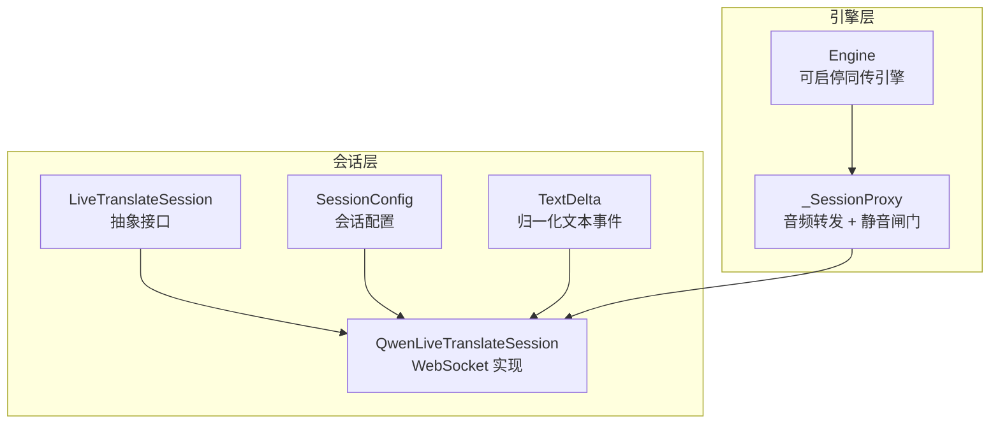
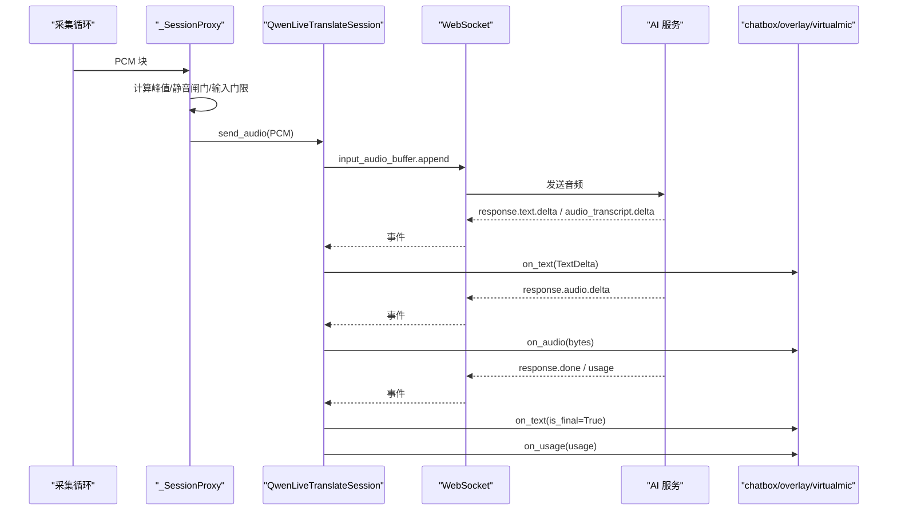
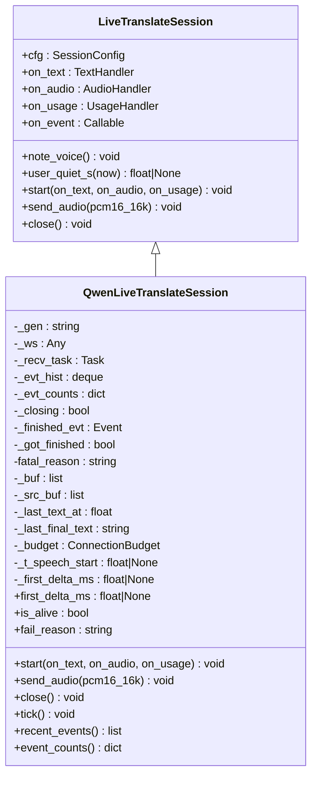
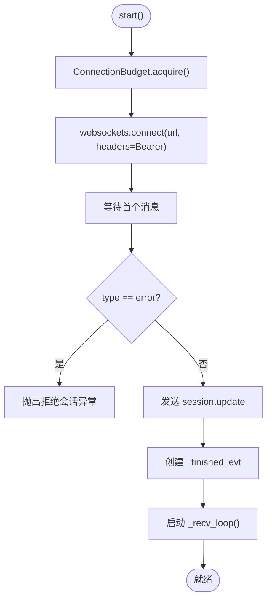
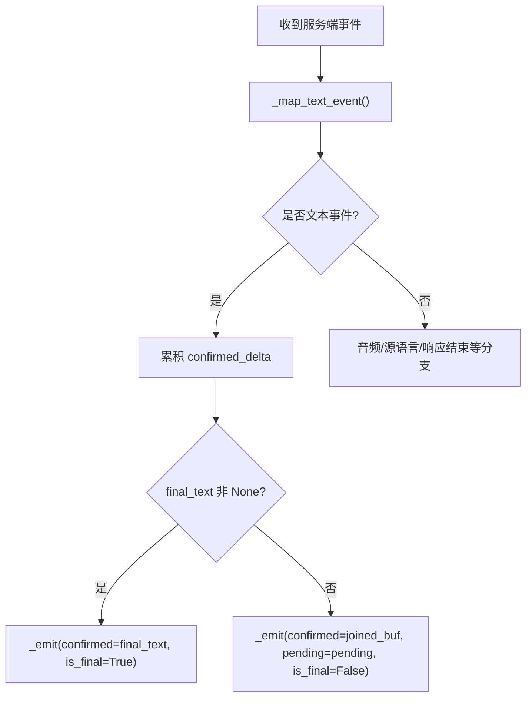
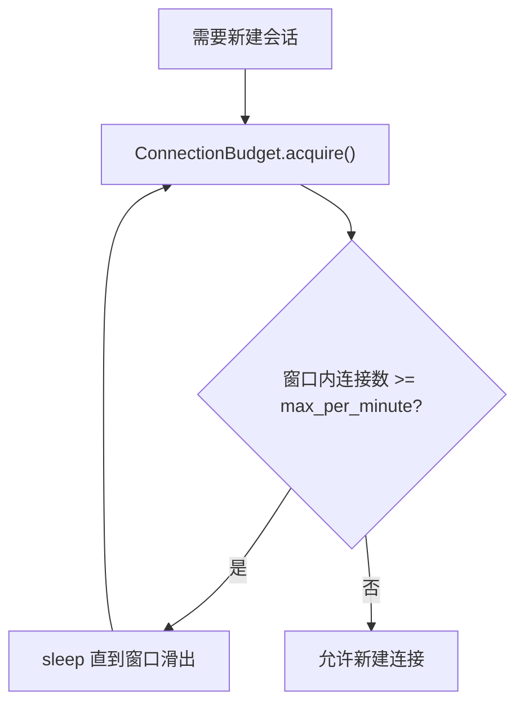
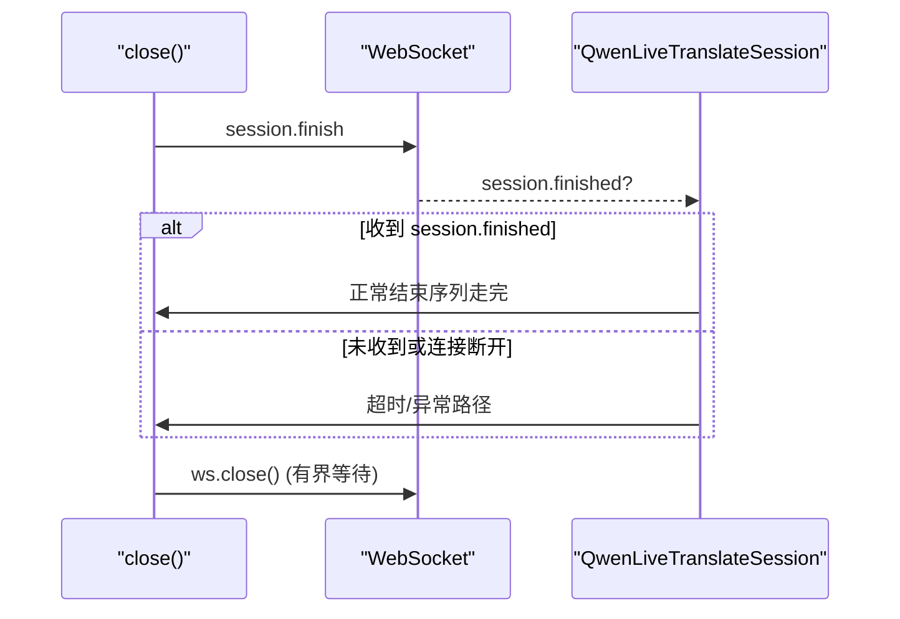
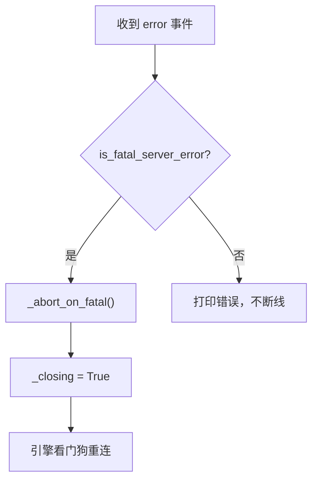
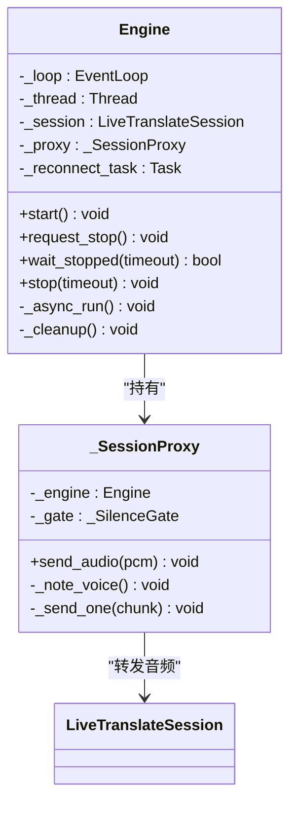
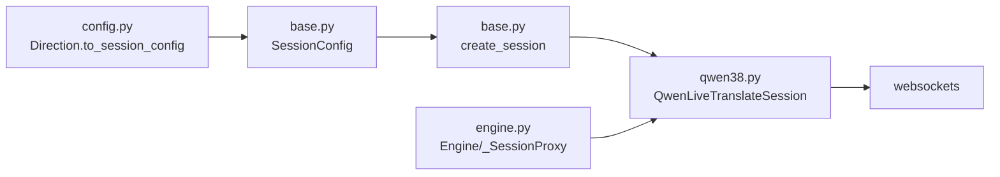

# 会话管理模块

<cite>
**本文引用的文件**   
- [vlt/session/base.py](file://vlt/session/base.py)
- [vlt/session/qwen38.py](file://vlt/session/qwen38.py)
- [vlt/engine.py](file://vlt/engine.py)
- [vlt/config.py](file://vlt/config.py)
</cite>

## 目录
1. [引言](#引言)
2. [项目结构](#项目结构)
3. [核心组件](#核心组件)
4. [架构总览](#架构总览)
5. [详细组件分析](#详细组件分析)
6. [依赖关系分析](#依赖关系分析)
7. [性能与监控](#性能与监控)
8. [故障排查指南](#故障排查指南)
9. [扩展新 AI 模型](#扩展新-ai-模型)
10. [结论](#结论)

## 引言
本模块负责实时翻译的“会话层”：屏蔽不同代次 AI 模型（如 qwen3.8、qwen3.5）在事件名、字段和连接行为上的差异，向上游统一暴露 `LiveTranslateSession` 抽象接口。上游（采集循环、节流合并器、聊天框、叠加窗口、虚拟麦克风）只消费归一化的文本增量 `TextDelta` 与音频字节流，无需关心后端是哪家模型。

重点包括：
- 抽象接口设计与实现边界
- WebSocket 连接建立、认证、消息格式与增量处理
- 会话生命周期：初始化、认证、数据传输、清理
- 错误处理与重连策略
- 性能监控与优化建议
- 如何扩展新的 AI 模型实现

## 项目结构
会话相关代码集中在 `vlt/session/` 下：
- `base.py`：定义抽象接口 `LiveTranslateSession`、配置 `SessionConfig`、归一化事件 `TextDelta`、静默封句策略 `should_finalize`，以及按模型前缀创建会话的工厂函数 `create_session`。
- `qwen38.py`：实现 qwen3.8 / qwen3.5-livetranslate-flash-realtime 的具体会话逻辑，包括 WebSocket 握手、事件分发、增量文本拼接、音频增量、源语言识别、结束序列、致命错误判定、RPM 预算等。

引擎侧通过 `Engine` 与 `_SessionProxy` 把采集线程的音频块转发到当前会话，并负责静音闸门、输入门限、重复抑制、看门狗重连等。

**图表来源**
- [vlt/session/base.py:130-181](file://vlt/session/base.py#L130-L181)
- [vlt/session/qwen38.py:82-137](file://vlt/session/qwen38.py#L82-L137)
- [vlt/engine.py:356-443](file://vlt/engine.py#L356-L443)

**章节来源**
- [vlt/session/base.py:1-182](file://vlt/session/base.py#L1-L182)
- [vlt/session/qwen38.py:1-492](file://vlt/session/qwen38.py#L1-L492)
- [vlt/engine.py:356-443](file://vlt/engine.py#L356-L443)

## 核心组件
本节聚焦会话层的三个关键概念：抽象接口、配置对象、归一化事件。

### LiveTranslateSession 抽象接口
- 职责：定义一条双工实时翻译会话的统一契约，包括启动、发送音频、关闭、语音电平上报、用户静默时长查询。
- 关键方法：
  - `start(on_text, on_audio, on_usage)`：建立连接、下发 session.update、启动接收循环。
  - `send_audio(pcm16_16k)`：推送 16kHz 单声道 s16le PCM。
  - `close()`：优雅结束，发 session.finish 并断连。
  - `note_voice()`：上游告诉会话“这块音频有人说话”，用于快路径封句判断。
  - `user_quiet_s(now)`：距上次“有人说话”的时间；若从未收到声音则返回 None。
- 回调：
  - `on_text(TextDelta)`：文本增量或最终版。
  - `on_audio(bytes)`：可选的音频增量。
  - `on_usage(dict)`：可选的使用量统计。
  - `on_event(event_type, full_event)`：原始服务端事件钩子，用于调试与埋点。

**章节来源**
- [vlt/session/base.py:130-172](file://vlt/session/base.py#L130-L172)

### SessionConfig 会话配置
- 包含模型、目标语言、源语言、是否输出音频、音色、热词、轮转检测、base_url、provider、API key、重连退避、每分钟新建连接上限、静默兜底阈值等。
- `url` 属性：以 base_url 为唯一真相源，拼接 model 参数形成可直接连接的 WebSocket URL。
- provider 仅用于日志与诊断，实际连接地址永远以 base_url 为准。

**章节来源**
- [vlt/session/base.py:86-120](file://vlt/session/base.py#L86-L120)

### TextDelta 归一化文本事件
- 字段：
  - `confirmed`：已确认累计译文。
  - `pending`：尚未确认的预测文本（qwen3.5 的 stash；qwen3.8 恒为空串）。
  - `is_final`：本段响应结束。
  - `source`：源语言识别结果（3.8 默认返回，可做原文+译文双行）。
- `display` 属性：给用户看的文本，即 confirmed + pending，且会 strip。

**章节来源**
- [vlt/session/base.py:18-37](file://vlt/session/base.py#L18-L37)

### should_finalize 静默封句策略
- 两条路径：
  - 慢路径：文字静默 ≥ `silence_s`（默认 3.0s），任何时候都成立，但用户说完后要白等一段时间。
  - 快路径：需要 `fast_silence_s` 非 None、上游已无人在说话 ≥ `fast_user_quiet_s`、且文字静默 ≥ `fast_silence_s`。
- 设计要点：
  - 慢阈值必须大于服务端增量间隔（实测最大 2.3s），否则会在句子中间抢跑。
  - 判据必须是“电平”信号（由 `_SessionProxy.send_audio` 按峰值过门限后调用 `note_voice()`），不能用“距上次上送音频的间隔”。

**章节来源**
- [vlt/session/base.py:39-84](file://vlt/session/base.py#L39-L84)

## 架构总览
从端到端视角，实时翻译链路如下：
1. 引擎线程启动 asyncio 事件循环。
2. 采集循环（麦克风或 VRChat 输出环回）读取 PCM 块。
3. `_SessionProxy` 计算峰值、判断是否有人说话、记录 `note_voice()`，并通过静音闸门与输入门限过滤。
4. 音频块经 `session.send_audio` 转为 WebSocket 消息发送给 AI 服务。
5. 服务端返回文本增量、音频增量、源语言识别、使用量等事件。
6. `QwenLiveTranslateSession._recv_loop` 解析事件，归一化为 `TextDelta` 与音频字节，回调给上游。
7. 引擎侧根据 `TextDelta` 更新聊天框、叠加窗口、虚拟麦克风，并在停止时排空队列。

**图表来源**
- [vlt/engine.py:375-443](file://vlt/engine.py#L375-L443)
- [vlt/session/qwen38.py:113-168](file://vlt/session/qwen38.py#L113-L168)
- [vlt/session/qwen38.py:307-405](file://vlt/session/qwen38.py#L307-L405)

## 详细组件分析

### LiveTranslateSession 抽象接口设计与实现边界
- 抽象接口把“代次差异”全部关在实现类里，下游零改动换模型。
- 接口不关心 WebSocket、JSON、Base64、事件名，只关心：
  - 何时推音频
  - 何时收到文本增量或最终版
  - 何时收到音频增量
  - 何时收到使用量
  - 何时优雅关闭
- `note_voice` 与 `user_quiet_s` 提供“上游是否还在说话”的电平信号，供快路径封句使用。

**图表来源**
- [vlt/session/base.py:130-172](file://vlt/session/base.py#L130-L172)
- [vlt/session/qwen38.py:82-110](file://vlt/session/qwen38.py#L82-L110)

**章节来源**
- [vlt/session/base.py:130-181](file://vlt/session/base.py#L130-L181)
- [vlt/session/qwen38.py:82-110](file://vlt/session/qwen38.py#L82-L110)

### QwenLiveTranslateSession 具体实现
#### 连接建立与认证
- `start` 中通过 `websockets.connect` 连接 `self.cfg.url`，并携带 Authorization Bearer token。
- 连接成功后等待首个消息，若为 error 则抛出拒绝会话异常。
- 随后发送 `session.update`，载荷由 `_session_payload` 构造，必须包含 translation，否则服务端整体拒绝。
- 创建 `_finished_evt` 与接收任务 `_recv_task`。

**图表来源**
- [vlt/session/qwen38.py:113-137](file://vlt/session/qwen38.py#L113-L137)

**章节来源**
- [vlt/session/qwen38.py:113-137](file://vlt/session/qwen38.py#L113-L137)

#### 消息格式与增量文本处理
- 上行音频：`input_audio_buffer.append`，audio 字段为 Base64 编码的 PCM。
- 下行文本事件：
  - qwen3.8：`response.text.delta`（增量）、`response.text.done`（全文）、`response.audio_transcript.delta`、`response.audio_transcript.done`。
  - qwen3.5：`response.text.text`（含 stash 预测）、`response.text.done`、`response.audio_transcript.text`、`response.audio_transcript.done`。
- `_map_text_event` 将不同事件映射为 `(confirmed_delta, pending, final_text)`，再由 `_emit` 统一发出 `TextDelta`。
- `_emit` 负责：
  - 终版去重：避免静默兜底、done 事件、text.done 三条路径重复下发。
  - 首次增量延迟埋点：以 `speech_started` 为基准，记录首条 delta 时间。
  - 设置 `_last_text_at` 用于静默兜底计时。

**图表来源**
- [vlt/session/qwen38.py:343-405](file://vlt/session/qwen38.py#L343-L405)
- [vlt/session/qwen38.py:445-491](file://vlt/session/qwen38.py#L445-L491)

**章节来源**
- [vlt/session/qwen38.py:343-405](file://vlt/session/qwen38.py#L343-L405)
- [vlt/session/qwen38.py:445-491](file://vlt/session/qwen38.py#L445-L491)

#### 重连机制与 RPM 预算
- `ConnectionBudget`：滑动窗口限制每分钟新建连接数，防止快速重连撞掉服务端（实测 RPM 10）。
- `acquire()`：若窗口内已达上限，则等待至窗口滑出后再允许新建。
- 引擎侧看门狗：当会话 `is_alive=False` 或发送失败时，触发重连；重连前需先 `await budget.acquire()`。

**图表来源**
- [vlt/session/qwen38.py:62-79](file://vlt/session/qwen38.py#L62-L79)

**章节来源**
- [vlt/session/qwen38.py:62-79](file://vlt/session/qwen38.py#L62-L79)

#### 生命周期管理与清理
- `close()` 遵循官方结束序列：client 发 `session.finish` → server 回 `session.finished` → client 断连。
- 若服务端不回 close 帧，`ws.close()` 会走 websockets 的 `close_timeout`，这里用两层有界等待避免界面“未响应”。
- `_wait_session_finished`：等待 `session.finished`，超时则强制断连并留痕。
- `_abort_on_fatal`：对服务端致命错误主动放弃会话，不发 session.finish，直接断连，交给引擎看门狗重连。

**图表来源**
- [vlt/session/qwen38.py:204-280](file://vlt/session/qwen38.py#L204-L280)

**章节来源**
- [vlt/session/qwen38.py:204-280](file://vlt/session/qwen38.py#L204-L280)

#### 错误处理与重试策略
- 致命错误判定：`is_fatal_server_error` 针对特定 message/code（如 “model repeat output happened”），这类错误后服务端必跟 1011 掐线，应主动重建。
- 接收循环 `_recv_loop`：捕获异常并打印，finally 中唤醒 `_finished_evt`，避免 `close()` 白等。
- 引擎侧 `_SessionProxy.send_audio`：发送失败不中断采集循环，只留痕并丢弃该块，等待看门狗重连。

**图表来源**
- [vlt/session/qwen38.py:42-59](file://vlt/session/qwen38.py#L42-L59)
- [vlt/session/qwen38.py:343-359](file://vlt/session/qwen38.py#L343-L359)
- [vlt/engine.py:421-443](file://vlt/engine.py#L421-L443)

**章节来源**
- [vlt/session/qwen38.py:42-59](file://vlt/session/qwen38.py#L42-L59)
- [vlt/session/qwen38.py:343-359](file://vlt/session/qwen38.py#L343-L359)
- [vlt/engine.py:421-443](file://vlt/engine.py#L421-L443)

### 引擎侧协作：_SessionProxy 与 Engine
- `_SessionProxy`：
  - 每次 `send_audio` 计算峰值，超过 `SILENCE_PEAK` 则调用 `session.note_voice()`。
  - 通过 `_SilenceGate` 长静音闸门：连续静音超阈值暂停上送，保留 preroll，声音恢复时补发 preroll。
  - 通过 `_LevelGate` 输入门限：只作用于 loopback 腿，低于 RMS 门限不上送，开闸时补发 preroll。
  - 发送失败只留痕并丢弃该块，不中断采集循环。
- `Engine`：
  - 管理 asyncio 事件循环、采集循环、chatbox、overlay、虚拟麦克风。
  - 提供 `start/request_stop/wait_stopped/stop` 等公开接口。
  - `_cleanup` 中依次关闭 pump_task、chatbox、overlay、virtualmic、session。

**图表来源**
- [vlt/engine.py:356-443](file://vlt/engine.py#L356-L443)
- [vlt/engine.py:446-520](file://vlt/engine.py#L446-L520)

**章节来源**
- [vlt/engine.py:356-443](file://vlt/engine.py#L356-L443)
- [vlt/engine.py:446-520](file://vlt/engine.py#L446-L520)

## 依赖关系分析
- `LiveTranslateSession` 被 `QwenLiveTranslateSession` 继承。
- `QwenLiveTranslateSession` 依赖 `websockets` 进行 WebSocket 通信。
- `Engine` 通过 `_SessionProxy` 间接依赖 `LiveTranslateSession`。
- `config.py` 中的 `Direction.to_session_config` 生成 `SessionConfig`，注入到 `create_session`。

**图表来源**
- [vlt/config.py:121-154](file://vlt/config.py#L121-L154)
- [vlt/session/base.py:175-181](file://vlt/session/base.py#L175-L181)
- [vlt/session/qwen38.py:113-137](file://vlt/session/qwen38.py#L113-L137)
- [vlt/engine.py:356-443](file://vlt/engine.py#L356-L443)

**章节来源**
- [vlt/config.py:121-154](file://vlt/config.py#L121-L154)
- [vlt/session/base.py:175-181](file://vlt/session/base.py#L175-L181)
- [vlt/session/qwen38.py:113-137](file://vlt/session/qwen38.py#L113-L137)
- [vlt/engine.py:356-443](file://vlt/engine.py#L356-L443)

## 性能与监控
- 首增量延迟埋点：`QwenLiveTranslateSession` 在 `_emit` 中记录从 `speech_started` 到首条 delta 的毫秒数，对外暴露 `first_delta_ms`。
- 静默兜底优化：
  - 慢路径：`final_silence_s` 默认 3.0s，保证不会在句子中间抢跑。
  - 快路径：`fast_final_silence_s` 默认 1.1s，配合 `fast_final_user_quiet_s` 默认 0.5s，实测可将终版从“说完后 +2.1s”提升到“+0.3s”，节省约 1.8s。
- RPM 预算：`ConnectionBudget` 限制每分钟新建连接数，避免快速重连撞掉服务端。
- 输入门限与静音闸门：
  - `_LevelGate` 按 RMS 判断响度，低于门限不上送，减少无效请求。
  - `_SilenceGate` 在长静音时暂停上送，保留 preroll，防服务端进入 repeat 状态导致 1011 断线。
- 黑匣子：
  - `recent_events()` 返回最近事件类型与相对时间，便于断线诊断。
  - `event_counts()` 统计各事件出现次数。
  - `fail_reason` 提供接收循环异常原因。

**章节来源**
- [vlt/session/qwen38.py:107-110](file://vlt/session/qwen38.py#L107-L110)
- [vlt/session/qwen38.py:407-443](file://vlt/session/qwen38.py#L407-L443)
- [vlt/session/qwen38.py:62-79](file://vlt/session/qwen38.py#L62-L79)
- [vlt/engine.py:204-267](file://vlt/engine.py#L204-L267)
- [vlt/engine.py:269-347](file://vlt/engine.py#L269-L347)
- [vlt/session/qwen38.py:177-202](file://vlt/session/qwen38.py#L177-L202)

## 故障排查指南
常见场景与定位方式：
- 服务端拒绝会话：检查 `start` 中首个消息是否为 error，查看 `api_key` 与 `base_url` 是否正确。
- 停止翻译卡顿：检查 `close()` 是否收到 `session.finished`，若未收到，查看 `_wait_session_finished` 的超时日志。
- 频繁断线：查看 `recent_events()` 与 `event_counts()`，确认是否在重复发送相同 delta 或收到 fatal error。
- 发送音频失败：查看 `_SessionProxy.send_audio` 的失败计数与日志，确认是否因连接已断而丢弃块。
- API key 未配置：`config.load_api_key` 会提示从环境变量或 bl CLI 配置读取，若缺失则抛出 SystemExit。

**章节来源**
- [vlt/session/qwen38.py:113-137](file://vlt/session/qwen38.py#L113-L137)
- [vlt/session/qwen38.py:204-280](file://vlt/session/qwen38.py#L204-L280)
- [vlt/session/qwen38.py:177-202](file://vlt/session/qwen38.py#L177-L202)
- [vlt/engine.py:421-443](file://vlt/engine.py#L421-L443)
- [vlt/config.py:68-104](file://vlt/config.py#L68-L104)

## 扩展新 AI 模型
要支持新的 AI 模型，需在 `create_session` 中登记新实现，并实现 `LiveTranslateSession` 接口。

步骤：
1. 新建实现类，继承 `LiveTranslateSession`。
2. 实现 `start`、`send_audio`、`close` 方法。
3. 在 `start` 中建立连接、认证、下发 session.update、启动接收循环。
4. 在接收循环中解析服务端事件，归一化为 `TextDelta` 与音频字节，回调 `on_text`、`on_audio`、`on_usage`。
5. 在 `create_session` 中按模型名前缀分发到新实现。
6. 如需调整静默兜底策略，复用 `should_finalize` 与 `SessionConfig` 的配置项。

最佳实践：
- 保持接口契约不变：下游只消费 `TextDelta` 与音频字节。
- 明确事件映射：不同模型的事件名与字段可能不同，应在实现类内部做映射。
- 错误处理：区分致命错误与非致命错误，致命错误应主动放弃会话，交由引擎看门狗重连。
- 性能监控：记录首增量延迟、事件计数、失败原因等，便于诊断。
- 配置外置：所有可调参数放入 `SessionConfig`，由 `config.py` 加载 YAML 与环境变量。

**章节来源**
- [vlt/session/base.py:175-181](file://vlt/session/base.py#L175-L181)
- [vlt/session/base.py:130-172](file://vlt/session/base.py#L130-L172)
- [vlt/session/qwen38.py:82-137](file://vlt/session/qwen38.py#L82-L137)

## 结论
会话管理模块通过 `LiveTranslateSession` 抽象接口屏蔽了不同 AI 模型的差异，提供了统一的文本增量与音频流接口。`QwenLiveTranslateSession` 实现了 qwen3.8/qwen3.5 的具体细节，包括 WebSocket 连接、消息格式、增量文本处理、重连机制与错误处理。引擎侧通过 `_SessionProxy` 与 `Engine` 管理采集、静音闸门、输入门限、重复抑制与看门狗重连。整体设计清晰、可扩展性强，适合继续接入新的 AI 模型。