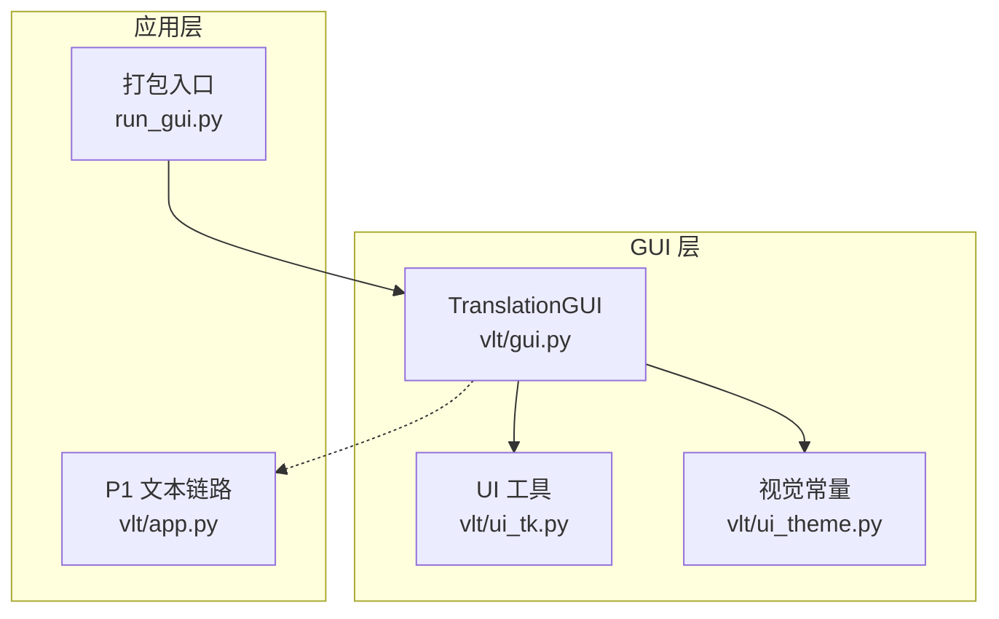
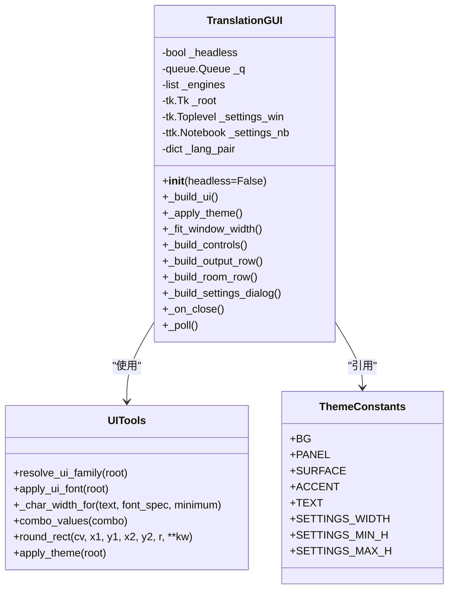
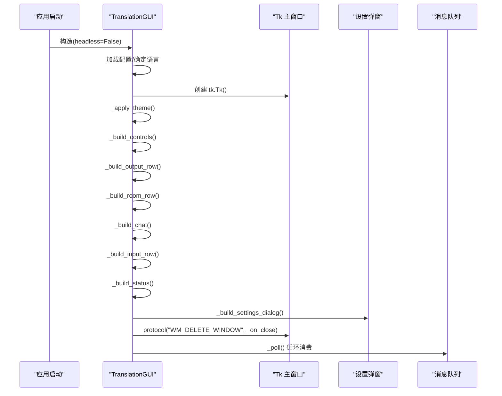
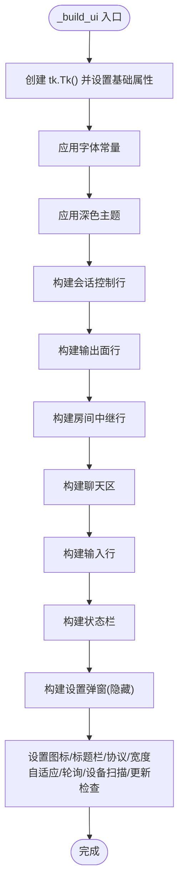
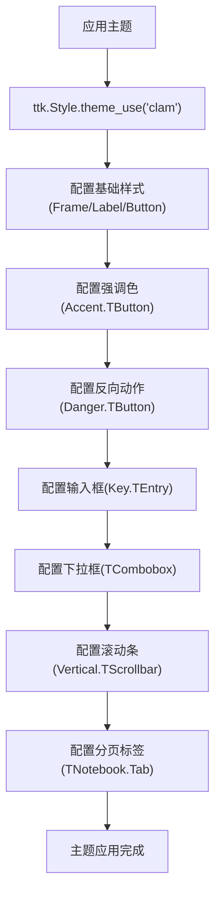
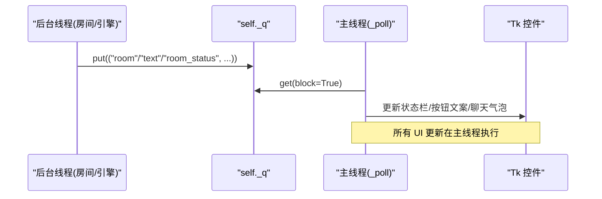
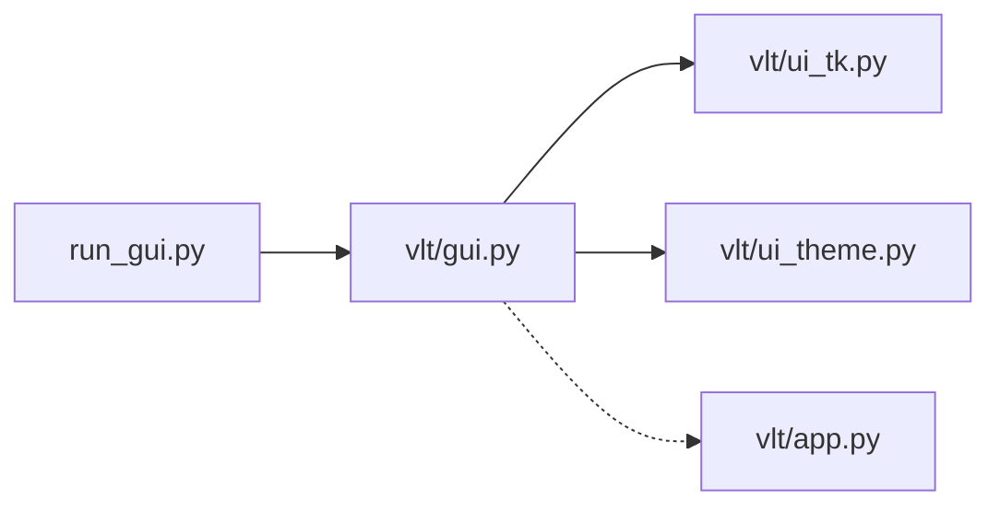

# Tkinter 界面架构

<cite>
**本文引用的文件**   
- [gui.py](file://vlt/gui.py)
- [ui_tk.py](file://vlt/ui_tk.py)
- [ui_theme.py](file://vlt/ui_theme.py)
- [app.py](file://vlt/app.py)
- [run_gui.py](file://run_gui.py)
</cite>

## 目录
1. [简介](#简介)
2. [项目结构](#项目结构)
3. [核心组件](#核心组件)
4. [架构总览](#架构总览)
5. [详细组件分析](#详细组件分析)
6. [依赖关系分析](#依赖关系分析)
7. [性能与线程安全](#性能与线程安全)
8. [故障排查指南](#故障排查指南)
9. [结论](#结论)
10. [附录：扩展与自定义指南](#附录扩展与自定义指南)

## 简介
本文面向希望理解或扩展 VRChat 实时同传项目的 Tkinter 图形界面。文档聚焦以下目标：
- 解释基于 Tkinter 的界面设计模式，包括主窗口初始化、控件层次结构与事件处理机制。
- 详细说明 TranslationGUI 类的架构设计，包括生命周期管理、状态管理与线程安全处理。
- 阐述界面构建流程，特别是 _build_ui 方法中的组件构建顺序与依赖关系。
- 说明窗口布局策略，包括响应式设计与多语言适配。
- 解释主题系统的应用，包括深色主题实现与样式定制。
- 提供界面扩展点与自定义指南，并总结性能优化技巧与最佳实践。

## 项目结构
本项目的 GUI 相关代码集中在 vlt 包内，采用“业务聚合 + 工具拆分”的组织方式：
- vlt/gui.py：Tkinter 主界面入口，集中封装 TranslationGUI 类与 UI 构建逻辑。
- vlt/ui_tk.py：Tkinter 底层工具（字体解析、字符宽度换算、控件读取、圆角矩形绘制）。
- vlt/ui_theme.py：纯数据视觉常量（配色、字号占位、尺寸与布局常量），不依赖 tkinter。
- vlt/app.py：P1 文本链路命令行程序，非 GUI，但用于理解引擎与输出端集成。
- run_gui.py：PyInstaller 打包入口，负责 stdout/stderr 兜底与验证开关拦截。

图表来源
- [gui.py:194-357](file://vlt/gui.py#L194-L357)
- [ui_tk.py:1-311](file://vlt/ui_tk.py#L1-L311)
- [ui_theme.py:1-102](file://vlt/ui_theme.py#L1-L102)
- [app.py:1-166](file://vlt/app.py#L1-L166)
- [run_gui.py:1-38](file://run_gui.py#L1-L38)

章节来源
- [gui.py:1-170](file://vlt/gui.py#L1-L170)
- [ui_tk.py:1-311](file://vlt/ui_tk.py#L1-L311)
- [ui_theme.py:1-102](file://vlt/ui_theme.py#L1-L102)
- [app.py:1-166](file://vlt/app.py#L1-L166)
- [run_gui.py:1-38](file://run_gui.py#L1-L38)

## 核心组件
- TranslationGUI：主界面控制器，负责窗口创建、主题应用、控件构建、事件绑定、状态刷新、后台任务调度与资源清理。
- ui_tk：Tkinter 工具模块，提供字体族解析、字符宽度换算、控件值读取、圆角矩形绘制与主题应用。
- ui_theme：纯数据视觉常量，定义深灰+蓝配色体系、按钮/标签样式、设置弹窗尺寸等。
- app：P1 文本链路命令行程序，展示 Engine 的使用方式与事件回调，便于理解 GUI 中引擎集成的上下文。
- run_gui：打包入口脚本，确保冻结产物下 print 可用，并拦截 --verify-* 参数走自检查验。

章节来源
- [gui.py:194-357](file://vlt/gui.py#L194-L357)
- [ui_tk.py:1-311](file://vlt/ui_tk.py#L1-L311)
- [ui_theme.py:1-102](file://vlt/ui_theme.py#L1-L102)
- [app.py:1-166](file://vlt/app.py#L1-L166)
- [run_gui.py:1-38](file://run_gui.py#L1-L38)

## 架构总览
TranslationGUI 作为 Tk 主窗口的控制器，遵循“主线程唯一 UI 操作”的原则：
- 所有 Tk 控件创建与更新都在主线程执行。
- 后台线程（房间收发、引擎回调、更新检查）通过队列将消息投递到主线程。
- 主题与字体在控件创建前统一应用，避免样式漂移。
- 设置弹窗分页滚动，保证不同语言文案长度差异下的可用性。

图表来源
- [gui.py:194-357](file://vlt/gui.py#L194-L357)
- [ui_tk.py:1-311](file://vlt/ui_tk.py#L1-L311)
- [ui_theme.py:1-102](file://vlt/ui_theme.py#L1-L102)

## 详细组件分析

### TranslationGUI 类架构设计
TranslationGUI 是 Tkinter 界面的核心控制器，职责包括：
- 生命周期管理：构造时加载配置、确定界面语言、初始化状态；_build_ui 创建主窗口与控件；_on_close 负责关闭时的资源回收与等待。
- 状态管理：维护方向、语言对、输出勾选、房间连接态、设备列表、输入门限、设置页状态等。
- 线程安全：后台线程仅向队列投递消息，主线程通过 _poll 消费并更新 UI。

图表来源
- [gui.py:194-357](file://vlt/gui.py#L194-L357)
- [gui.py:321-357](file://vlt/gui.py#L321-L357)

章节来源
- [gui.py:194-357](file://vlt/gui.py#L194-L357)

### 界面构建流程与依赖关系
_build_ui 是界面构建的总入口，按固定顺序调用各子构建器，确保依赖正确：
1. 创建 tk.Tk() 并设置标题、几何尺寸、最小尺寸、背景色。
2. 应用字体与主题（必须先于任何控件创建）。
3. 构建第一行会话控制（开/停、方向、语言对）。
4. 构建第二行输出面（chatbox、手腕屏、译音输出、桌面字幕）。
5. 构建第三行房间中继（连接/断开 + 状态）。
6. 构建聊天区与输入行。
7. 构建状态栏与设置弹窗（先建好再隐藏）。
8. 设置窗口图标、深色标题栏、协议处理、初始宽度自适应、API key 检查、轮询、设备扫描、更新检查调度。

图表来源
- [gui.py:321-357](file://vlt/gui.py#L321-L357)

章节来源
- [gui.py:321-357](file://vlt/gui.py#L321-L357)

### 窗口布局策略与多语言适配
- 响应式设计：_fit_window_width 根据当前界面语言的实际需求宽度调整窗口初始尺寸与最小宽度，同时限制不超过屏幕可用宽度，避免右侧控件被裁切。
- 多语言适配：控件文案通过 i18n.t() 获取；下拉框宽度通过 _combo_width 计算，考虑中日韩文字平均字符宽与 Tk width 单位的差异；设置弹窗高度按页面内容实测并受上限保护。
- 分割与分组：使用 1px 深色分割线与 ttk.Separator 表达层次，避免 3D 边框；组间用垂直分隔线明确分组边界。

章节来源
- [gui.py:361-392](file://vlt/gui.py#L361-L392)
- [gui.py:445-454](file://vlt/gui.py#L445-L454)
- [ui_tk.py:111-145](file://vlt/ui_tk.py#L111-L145)

### 主题系统与深色主题实现
- 主题应用：apply_theme 切换 ttk 主题为 clam，统一配置 Frame、Label、Button、Combobox、Scrollbar、Notebook 等样式，确保深色背景下控件可读且交互反馈清晰。
- 视觉常量：ui_theme.py 定义 BG/PANEL/SURFACE/BORDER/ACCENT/TEXT 等常量，形成明度阶梯，避免写死颜色导致漂移。
- 字体与字号：ui_tk.py 提供 resolve_ui_family 与 apply_ui_font，按平台真实可用字体族重绑 FONT_* 常量，避免 Linux 上回落到 fixed 导致的渲染卡顿。

图表来源
- [ui_tk.py:173-311](file://vlt/ui_tk.py#L173-L311)
- [ui_theme.py:29-57](file://vlt/ui_theme.py#L29-L57)

章节来源
- [ui_tk.py:173-311](file://vlt/ui_tk.py#L173-L311)
- [ui_theme.py:29-57](file://vlt/ui_theme.py#L29-L57)

### 事件处理机制与线程安全
- 事件绑定：按钮点击、单选/复选框变化、下拉选择、右键菜单等均绑定到 TranslationGUI 的方法，方法内部通常只更新状态或调度后台任务。
- 线程安全：后台线程（房间收发、引擎回调、更新检查）通过 self._q 队列投递消息，主线程通过 _poll 消费并更新 UI，避免跨线程直接操作 Tk 控件。
- 防抖与节流：滑块拖动使用 after 延迟落盘；状态栏文案刷新有节流；设备扫描与更新检查有守护线程与防连点标志。

图表来源
- [gui.py:771-791](file://vlt/gui.py#L771-L791)

章节来源
- [gui.py:771-791](file://vlt/gui.py#L771-L791)

### 设置弹窗与分页滚动
- 分页设计：常规/音频/手腕屏/桌面字幕/词库/房间/关于，每页独立 Canvas + Frame + Scrollbar，保证长说明可滚动且不裁字。
- 尺寸自适应：弹窗宽度固定（SETTINGS_WIDTH），高度按页面内容实测并受 SETTINGS_MAX_H 与屏高上限保护。
- 滚轮支持：弹窗绑定 MouseWheel/Button-4/5，针对 Text/Listbox 特殊处理，避免与控件自身滚动冲突。

章节来源
- [gui.py:1176-1336](file://vlt/gui.py#L1176-L1336)

### 手腕屏与桌面字幕微调
- 手腕屏微调：锚点、位置/旋转、大小/弯曲/透明度、字号、面板高、底板/原文不透明度，拖动后延迟落盘并热重载。
- 桌面字幕微调：译文字号/原文字号、面板宽高、透明度、拖动解锁，改动即时生效并防抖落盘。
- 配置写入：使用 _yaml_set_in_text/_yaml_set_or_create 就地修改 YAML，保留注释与键顺序，避免整文件重写破坏用户配置。

章节来源
- [gui.py:813-1174](file://vlt/gui.py#L813-L1174)

## 依赖关系分析
- TranslationGUI 依赖 ui_tk 与 ui_theme 提供的工具与常量，但不反向依赖它们（无循环导入）。
- run_gui 作为 PyInstaller 入口，先兜底 stdout/stderr，再导入 vlt.gui.main，确保冻结产物下 print 可用。
- app.py 展示 Engine 的使用方式，便于理解 GUI 中引擎与输出端的集成上下文。

图表来源
- [run_gui.py:1-38](file://run_gui.py#L1-L38)
- [gui.py:1-170](file://vlt/gui.py#L1-L170)
- [app.py:1-166](file://vlt/app.py#L1-L166)

章节来源
- [run_gui.py:1-38](file://run_gui.py#L1-L38)
- [gui.py:1-170](file://vlt/gui.py#L1-L170)
- [app.py:1-166](file://vlt/app.py#L1-L166)

## 性能与线程安全
- 字体测量缓存：_char_width_for 对字体规格与文本进行缓存，避免重复 measure() 导致的卡顿。
- 主题应用前置：apply_theme 在控件创建前调用，避免样式重建与重绘开销。
- 队列驱动 UI 更新：后台线程仅投递消息，主线程消费并更新 UI，避免跨线程访问 Tk 控件。
- 防抖落盘：手腕屏/桌面字幕滑块拖动使用 after 延迟落盘，减少频繁 I/O。
- 窗口宽度自适应：_fit_window_width 仅在启动时计算一次，避免每次 resize 都重算。

章节来源
- [ui_tk.py:111-145](file://vlt/ui_tk.py#L111-L145)
- [gui.py:321-357](file://vlt/gui.py#L321-L357)
- [gui.py:1099-1107](file://vlt/gui.py#L1099-L1107)

## 故障排查指南
- 窗口图标缺失：_set_window_icon 失败只留痕，不影响启动；检查 assets/app.ico 或 assets/app.png 是否存在。
- 深色标题栏失败：_apply_dark_titlebar 在非 Windows 或旧系统上静默跳过；不影响功能。
- 右键菜单失败：_attach_edit_menu 捕获异常并留痕，避免影响输入；检查控件是否已销毁。
- OSC 端口保存失败：就地红字提示 + 状态栏留痕；检查 config.yaml 是否存在与端口范围。
- 服务线路保存失败：就地红字提示 + 状态栏留痕；检查 DEFAULT_CONFIG 路径与权限。
- 房间连接失败：_start_room 捕获异常并重置 _room，状态栏提示；检查房间码与网络。

章节来源
- [gui.py:398-443](file://vlt/gui.py#L398-L443)
- [gui.py:456-488](file://vlt/gui.py#L456-L488)
- [gui.py:1434-1479](file://vlt/gui.py#L1434-L1479)
- [gui.py:1537-1576](file://vlt/gui.py#L1537-L1576)
- [gui.py:741-767](file://vlt/gui.py#L741-L767)

## 结论
TranslationGUI 以 Tkinter 为基础，采用“主线程唯一 UI 操作 + 队列驱动后台任务”的架构，结合 ui_tk 与 ui_theme 的工具与常量，实现了深色主题、多语言适配、响应式布局与分页设置弹窗。其设计注重用户体验（防裁字、防卡顿、防误操作）与可维护性（纯数据常量、工具拆分、错误降级留痕）。对于扩展者，建议遵循现有模式：新增控件前先确认主题与字体，新增后台任务务必通过队列投递，新增配置项需保持 YAML 注释与键顺序。

## 附录：扩展与自定义指南
- 新增控件：
  - 在对应构建方法（如 _build_controls / _build_output_row）中添加控件，确保 pack 顺序符合“右侧控件先打包”原则，避免空间不足时被裁切。
  - 使用 t() 包裹文案，确保多语言支持。
  - 使用 ui_theme 中的常量定义颜色与尺寸，避免写死。
- 新增后台任务：
  - 在后台线程中通过 self._q.put((kind, payload)) 投递消息。
  - 在 _poll 中消费并更新 UI，确保所有 Tk 操作在主线程执行。
- 新增配置项：
  - 使用 _yaml_set_in_text/_yaml_set_or_create 就地修改 YAML，保留注释与键顺序。
  - 同步内存中的 self._cfg，避免本轮运行中使用旧值。
- 主题定制：
  - 在 ui_theme.py 中新增常量，并在 ui_tk.py 的 apply_theme 中配置样式。
  - 确保 clam 主题下所有状态（pressed/active/disabled）均有对应映射，避免回落默认样式。
- 字体与字号：
  - 使用 ui_tk.apply_ui_font 在控件创建前应用字体。
  - 使用 _char_width_for 计算控件 width，避免中日韩文字截断。

章节来源
- [gui.py:490-598](file://vlt/gui.py#L490-L598)
- [gui.py:1099-1174](file://vlt/gui.py#L1099-L1174)
- [ui_tk.py:173-311](file://vlt/ui_tk.py#L173-L311)
- [ui_theme.py:29-57](file://vlt/ui_theme.py#L29-L57)