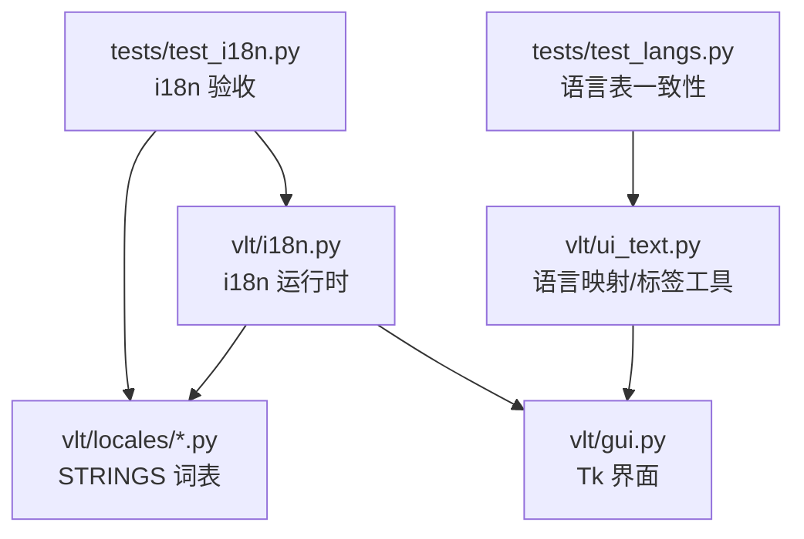
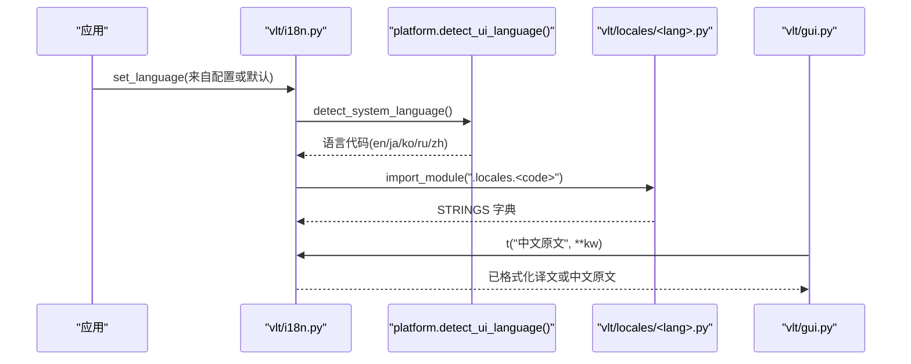
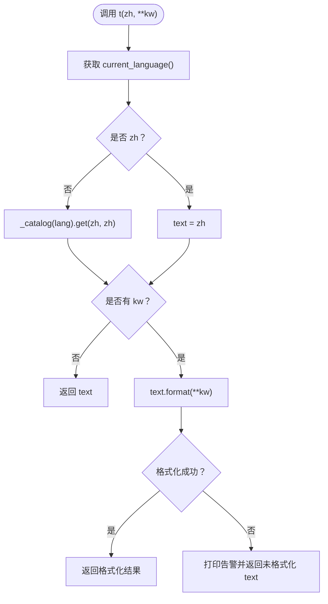
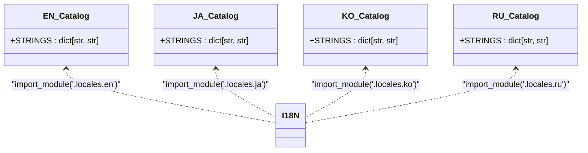
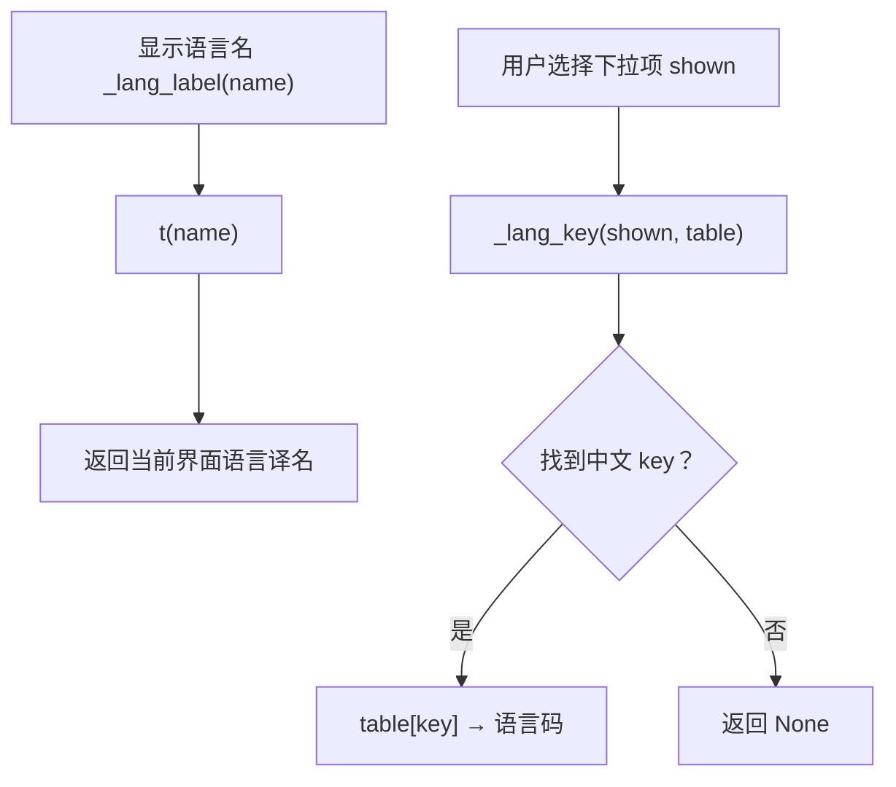
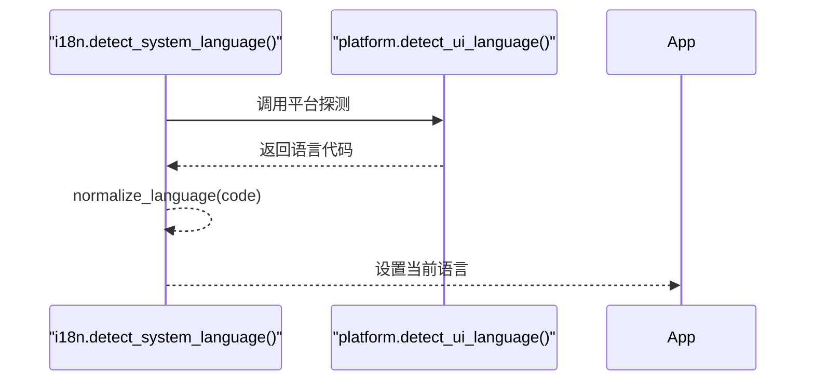
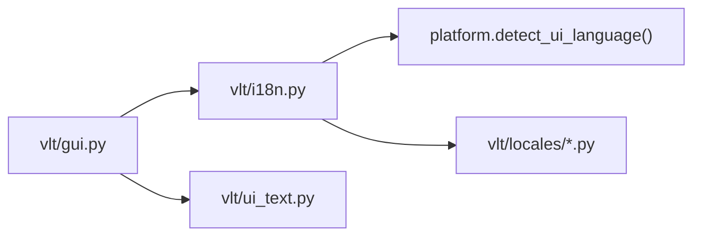

# 国际化支持系统

<cite>
**本文引用的文件**   
- [vlt/i18n.py](file://vlt/i18n.py)
- [vlt/locales/__init__.py](file://vlt/locales/__init__.py)
- [vlt/locales/en.py](file://vlt/locales/en.py)
- [vlt/locales/ja.py](file://vlt/locales/ja.py)
- [vlt/locales/ko.py](file://vlt/locales/ko.py)
- [vlt/locales/ru.py](file://vlt/locales/ru.py)
- [tests/test_i18n.py](file://tests/test_i18n.py)
- [tests/test_langs.py](file://tests/test_langs.py)
- [vlt/ui_text.py](file://vlt/ui_text.py)
- [vlt/gui.py](file://vlt/gui.py)
</cite>

## 目录
1. [引言](#引言)
2. [项目结构](#项目结构)
3. [核心组件](#核心组件)
4. [架构总览](#架构总览)
5. [详细组件分析](#详细组件分析)
6. [依赖关系分析](#依赖关系分析)
7. [性能与扩展性](#性能与扩展性)
8. [故障排查指南](#故障排查指南)
9. [结论](#结论)
10. [附录：添加新语言与字体字符集最佳实践](#附录添加新语言与字体字符集最佳实践)

## 引言
本文件系统性地说明 VRChat 实时同传工具的界面国际化（i18n）实现。文档覆盖多语言资源管理机制、语言检测与切换逻辑、翻译键值组织方式、动态加载原理，以及英语、日语、韩语、俄语等语言的本地化现状。同时给出添加新语言的操作步骤、文本格式化与回退策略，并总结字体和字符集处理的最佳实践。

## 项目结构
国际化相关代码集中在 `vlt` 包内，采用“模块 + 词表”的轻量方案：
- `vlt/i18n.py`：i18n 运行时，提供语言列表、当前语言、归一化、系统语言探测、动态加载词表和 `t()` 函数。
- `vlt/locales/`：每种语言一个 Python 模块，暴露 `STRINGS: dict[str, str]`，key 为中文原文，value 为目标语言文案。
- `vlt/ui_text.py`：界面纯文本逻辑，包含源/目标语言映射、语言名显示与反查工具。
- `vlt/gui.py`：Tkinter 主界面，负责把 i18n 与 UI 控件、配置、下拉框联动起来。
- `tests/test_i18n.py`、`tests/test_langs.py`：覆盖词表完整性、格式化回退、系统语言委派、Windows LANGID 映射、语言下拉翻译与配置写入等验收用例。

**图表来源**
- [vlt/i18n.py:1-107](file://vlt/i18n.py#L1-L107)
- [vlt/locales/__init__.py:1-6](file://vlt/locales/__init__.py#L1-L6)
- [vlt/ui_text.py:103-181](file://vlt/ui_text.py#L103-L181)
- [vlt/gui.py:28-39](file://vlt/gui.py#L28-L39)
- [tests/test_i18n.py:119-172](file://tests/test_i18n.py#L119-L172)
- [tests/test_langs.py:45-60](file://tests/test_langs.py#L45-L60)

**章节来源**
- [vlt/i18n.py:1-107](file://vlt/i18n.py#L1-L107)
- [vlt/locales/__init__.py:1-6](file://vlt/locales/__init__.py#L1-L6)
- [vlt/ui_text.py:103-181](file://vlt/ui_text.py#L103-L181)
- [vlt/gui.py:28-39](file://vlt/gui.py#L28-L39)
- [tests/test_i18n.py:119-172](file://tests/test_i18n.py#L119-L172)
- [tests/test_langs.py:45-60](file://tests/test_langs.py#L45-L60)

## 核心组件
- i18n 运行时：维护当前语言、可用语言列表、语言代码归一化、系统语言探测委托、词表缓存与 `t()` 翻译接口。
- 语言词表：按语言分模块，统一以中文原文作为 key，保证“漏翻即回落中文”，并通过 AST 扫描做机械守卫。
- 界面语言映射：源/目标语言表、语言名显示与反查工具，确保方向下拉在不同界面语言下显示正确且可逆。
- GUI 集成：将 i18n 与 Tk 控件、设置弹窗、日志导出、语言下拉写配置等功能串联。

**章节来源**
- [vlt/i18n.py:15-106](file://vlt/i18n.py#L15-L106)
- [vlt/locales/__init__.py:1-6](file://vlt/locales/__init__.py#L1-L6)
- [vlt/ui_text.py:103-181](file://vlt/ui_text.py#L103-L181)
- [vlt/gui.py:28-39](file://vlt/gui.py#L28-L39)

## 架构总览
i18n 采用“中文原文为 key”的轻量设计：
- 所有可见文案在调用点使用 `t("中文原文", ...)`。
- 非中文界面下，从对应语言的 `STRINGS` 中查找；找不到则返回中文原文。
- 语言由 `set_language(code)` 设置，启动时通过平台层探测系统语言，再结合用户配置确定最终语言。
- 词表通过 `importlib` 动态导入，失败时打印告警并回退为空词表，不拖垮界面。

**图表来源**
- [vlt/i18n.py:52-66](file://vlt/i18n.py#L52-L66)
- [vlt/i18n.py:74-86](file://vlt/i18n.py#L74-L86)
- [vlt/i18n.py:89-106](file://vlt/i18n.py#L89-L106)
- [vlt/gui.py:28-39](file://vlt/gui.py#L28-L39)

## 详细组件分析

### i18n 运行时（vlt/i18n.py）
- 语言列表 `_LANGS`：定义支持的界面语言代码与母语写法，顺序决定下拉显示顺序。
- 当前语言 `_current`：未设置时按基准语言 `zh` 处理。
- 语言归一化 `normalize_language`：容错处理 `en-US`、`EN`、`zh_CN` 等，未知一律落到 `zh`。
- 系统语言探测 `detect_system_language`：委派给平台层，避免跨平台硬编码。
- 词表加载 `_catalog`：惰性导入 `<lang>.py`，取 `STRINGS`，失败时打印告警并返回空字典。
- 翻译接口 `t(zh, **kw)`：非中文语言下查词表；若存在占位符则尝试格式化，失败时返回未格式化文本并打印告警。

**图表来源**
- [vlt/i18n.py:30-49](file://vlt/i18n.py#L30-L49)
- [vlt/i18n.py:74-106](file://vlt/i18n.py#L74-L106)

**章节来源**
- [vlt/i18n.py:15-106](file://vlt/i18n.py#L15-L106)

### 语言词表（vlt/locales/*）
- 每个语言模块暴露 `STRINGS: dict[str, str]`，key 为中文原文，value 为目标语言文案。
- 词表注释约定语气、术语和产品名处理方式，带 `{占位符}` 的条目需与调用点一致。
- 测试用 AST 扫描确保所有 `t("字面量")` 在各语言词表中都有对应词条，且各语言词表条数一致、无重复 key。

**图表来源**
- [vlt/i18n.py:74-86](file://vlt/i18n.py#L74-L86)
- [vlt/locales/en.py:1-440](file://vlt/locales/en.py#L1-L440)
- [vlt/locales/ja.py:1-445](file://vlt/locales/ja.py#L1-L445)
- [vlt/locales/ko.py:1-436](file://vlt/locales/ko.py#L1-L436)
- [vlt/locales/ru.py:1-448](file://vlt/locales/ru.py#L1-L448)
- [tests/test_i18n.py:119-172](file://tests/test_i18n.py#L119-L172)

**章节来源**
- [vlt/locales/__init__.py:1-6](file://vlt/locales/__init__.py#L1-L6)
- [vlt/locales/en.py:1-440](file://vlt/locales/en.py#L1-L440)
- [vlt/locales/ja.py:1-445](file://vlt/locales/ja.py#L1-L445)
- [vlt/locales/ko.py:1-436](file://vlt/locales/ko.py#L1-L436)
- [vlt/locales/ru.py:1-448](file://vlt/locales/ru.py#L1-L448)
- [tests/test_i18n.py:119-172](file://tests/test_i18n.py#L119-L172)

### 界面语言映射与下拉（vlt/ui_text.py 与 vlt/gui.py）
- `SOURCE_LANGS`、`TARGET_LANGS`：源/目标语言中文名到语言码的映射。
- `_source_name`、`_target_name`：语言码反查为中文名，缺失时分别回落到“自动检测”和“英语”。
- `_lang_label`：中文名 → 当前界面语言译名，走 `t()`。
- `_lang_key`：下拉显示的译名 → 中文 key，用于选择后还原语言码。
- GUI 中将语言下拉的值与译名联动，并在设置弹窗中写回 `ui.lang`。

**图表来源**
- [vlt/ui_text.py:103-181](file://vlt/ui_text.py#L103-L181)
- [tests/test_i18n.py:467-536](file://tests/test_i18n.py#L467-L536)
- [tests/test_langs.py:45-60](file://tests/test_langs.py#L45-L60)

**章节来源**
- [vlt/ui_text.py:103-181](file://vlt/ui_text.py#L103-L181)
- [tests/test_i18n.py:467-536](file://tests/test_i18n.py#L467-L536)
- [tests/test_langs.py:45-60](file://tests/test_langs.py#L45-L60)

### 语言检测与切换
- `detect_system_language`：委派给平台层，统一口径为“探测不到或不支持的语言一律 en”。
- `set_language`：经过 `normalize_language` 容错后设置当前语言。
- 测试验证 Windows LANGID 映射与 Linux 环境变量的平台差异由平台层处理，i18n 不再直接读取系统 API。

**图表来源**
- [vlt/i18n.py:52-71](file://vlt/i18n.py#L52-L71)
- [tests/test_i18n.py:216-241](file://tests/test_i18n.py#L216-L241)
- [tests/test_i18n.py:244-285](file://tests/test_i18n.py#L244-L285)

**章节来源**
- [vlt/i18n.py:52-71](file://vlt/i18n.py#L52-L71)
- [tests/test_i18n.py:216-285](file://tests/test_i18n.py#L216-L285)

### 文本本地化处理
- 格式化字符串：`t()` 支持 `str.format(**kw)`，占位符对不上时打印告警并返回未格式化文本，绝不抛异常。
- 复数处理：当前实现未内置复数规则；如需复数，应在词表中按不同 key 区分或使用外部库扩展。
- 上下文敏感翻译：当前以中文原文为 key，语义上下文由调用点位置体现；如需更细粒度，可在词表中增加带上下文的 key。

**章节来源**
- [vlt/i18n.py:89-106](file://vlt/i18n.py#L89-L106)
- [tests/test_i18n.py:178-201](file://tests/test_i18n.py#L178-L201)

## 依赖关系分析
- i18n 运行时依赖平台层进行系统语言探测，避免跨平台硬编码。
- 词表通过 `importlib` 动态加载，失败时不影响界面运行。
- GUI 依赖 i18n 与 ui_text 提供的语言映射工具，将界面文案与配置持久化联动。

**图表来源**
- [vlt/i18n.py:52-66](file://vlt/i18n.py#L52-L66)
- [vlt/i18n.py:74-86](file://vlt/i18n.py#L74-L86)
- [vlt/gui.py:28-39](file://vlt/gui.py#L28-L39)
- [vlt/ui_text.py:103-181](file://vlt/ui_text.py#L103-L181)

**章节来源**
- [vlt/i18n.py:52-86](file://vlt/i18n.py#L52-L86)
- [vlt/gui.py:28-39](file://vlt/gui.py#L28-L39)
- [vlt/ui_text.py:103-181](file://vlt/ui_text.py#L103-L181)

## 性能与扩展性
- 词表缓存：`_catalog` 对已加载语言词表进行缓存，避免重复导入。
- 动态加载：按需导入语言模块，减少启动开销。
- 可扩展性：新增语言只需在 `vlt/locales/<code>.py` 中添加 `STRINGS`，并在 `_LANGS` 登记一行。

[本节为通用指导，不涉及具体文件分析]

## 故障排查指南
- 词表缺失：AST 扫描会报告 `t()` 字面量在各语言词表中缺词条的情况，优先补全词表。
- 格式化失败：检查 `t()` 调用的占位符名称是否与词表中的 `{name}` 一致。
- 语言下拉不生效：确认 `SOURCE_LANGS`/`TARGET_LANGS` 对称且 `_lang_label`/`_lang_key` 能正确翻译与反查。
- 系统语言探测异常：检查平台层实现，确保 `detect_ui_language()` 返回受支持语言代码。

**章节来源**
- [tests/test_i18n.py:119-172](file://tests/test_i18n.py#L119-L172)
- [tests/test_i18n.py:178-201](file://tests/test_i18n.py#L178-L201)
- [tests/test_i18n.py:467-536](file://tests/test_i18n.py#L467-L536)
- [tests/test_i18n.py:216-285](file://tests/test_i18n.py#L216-L285)

## 结论
该国际化系统以“中文原文为 key”的轻量方案实现了稳定的多语言界面支持。通过 AST 机械守卫、平台层语言探测委派、词表动态加载与格式化回退机制，保证了界面健壮性与可维护性。现有英语、日语、韩语、俄语词表覆盖了主要界面场景，测试用例确保了词表完整性、语言映射一致性与界面书写系统正确性。

[本节为总结性内容，不涉及具体文件分析]

## 附录：添加新语言与字体字符集最佳实践

### 添加新语言步骤
1. 在 `vlt/locales/<code>.py` 创建新词表模块，定义 `STRINGS: dict[str, str]`，key 为中文原文，value 为目标语言文案。
2. 在 `vlt/i18n.py` 的 `_LANGS` 列表中登记一行 `(code, 母语写法)`。
3. 在 `vlt/ui_text.py` 的 `SOURCE_LANGS`/`TARGET_LANGS` 中补充语言映射（如需要）。
4. 在 `vlt/tts.py` 的 `LANG_NAMES` 中补充 TTS 语种名（如需要）。
5. 运行 `tests/test_i18n.py` 与 `tests/test_langs.py` 确保词表完整性和语言表对称性。

**章节来源**
- [vlt/i18n.py:15-23](file://vlt/i18n.py#L15-L23)
- [vlt/ui_text.py:103-128](file://vlt/ui_text.py#L103-L128)
- [tests/test_i18n.py:119-172](file://tests/test_i18n.py#L119-L172)
- [tests/test_langs.py:45-60](file://tests/test_langs.py#L45-L60)

### 字体与字符集最佳实践
- 界面字体：确保所选字体包含目标语言字形（如泰语、阿拉伯语），否则会出现豆腐块。
- 固定宽度控件：避免使用过小的 `width=N`，以免长文案被截断；建议使用动态宽度计算。
- 书写系统守卫：测试用例中对英文、日文、韩文、俄文界面的汉字、假名、谚文出现情况进行断言，防止串词表。
- 窗口尺寸：确保窗口能容纳最长文案，避免右侧按钮被裁掉。

**章节来源**
- [tests/test_i18n.py:337-461](file://tests/test_i18n.py#L337-L461)
- [vlt/gui.py:174-192](file://vlt/gui.py#L174-L192)