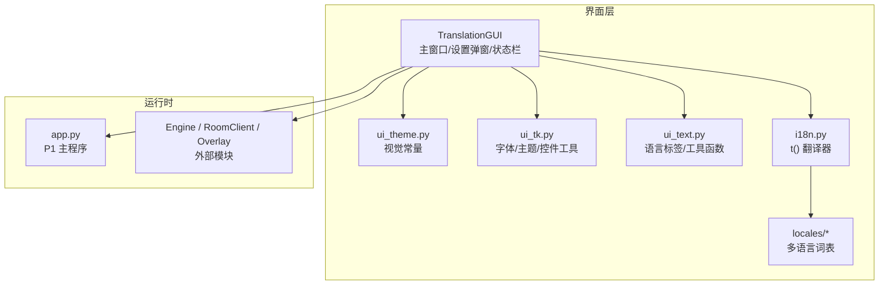
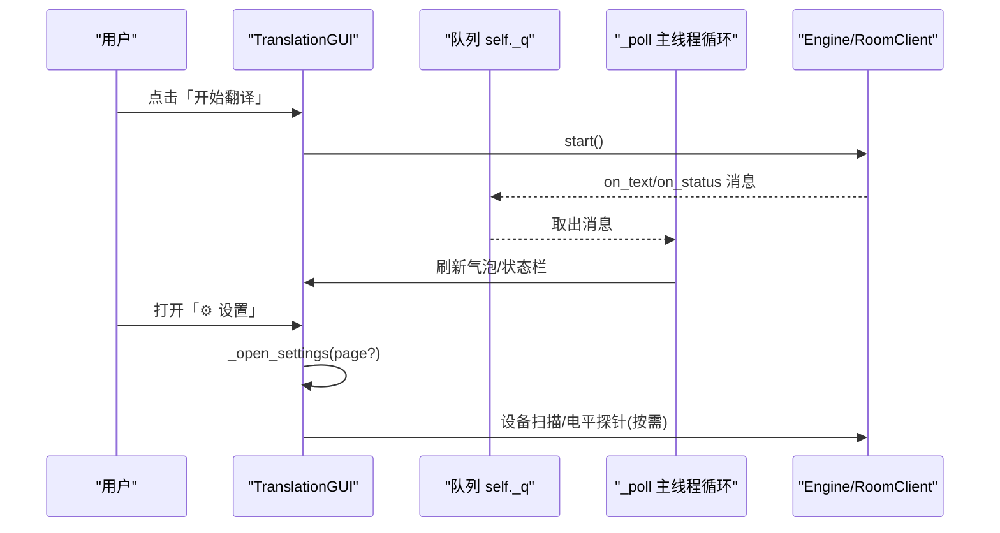
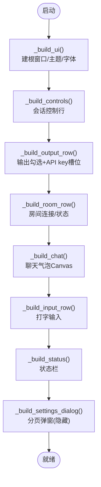
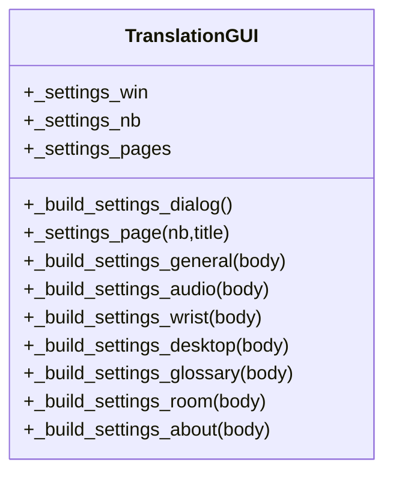
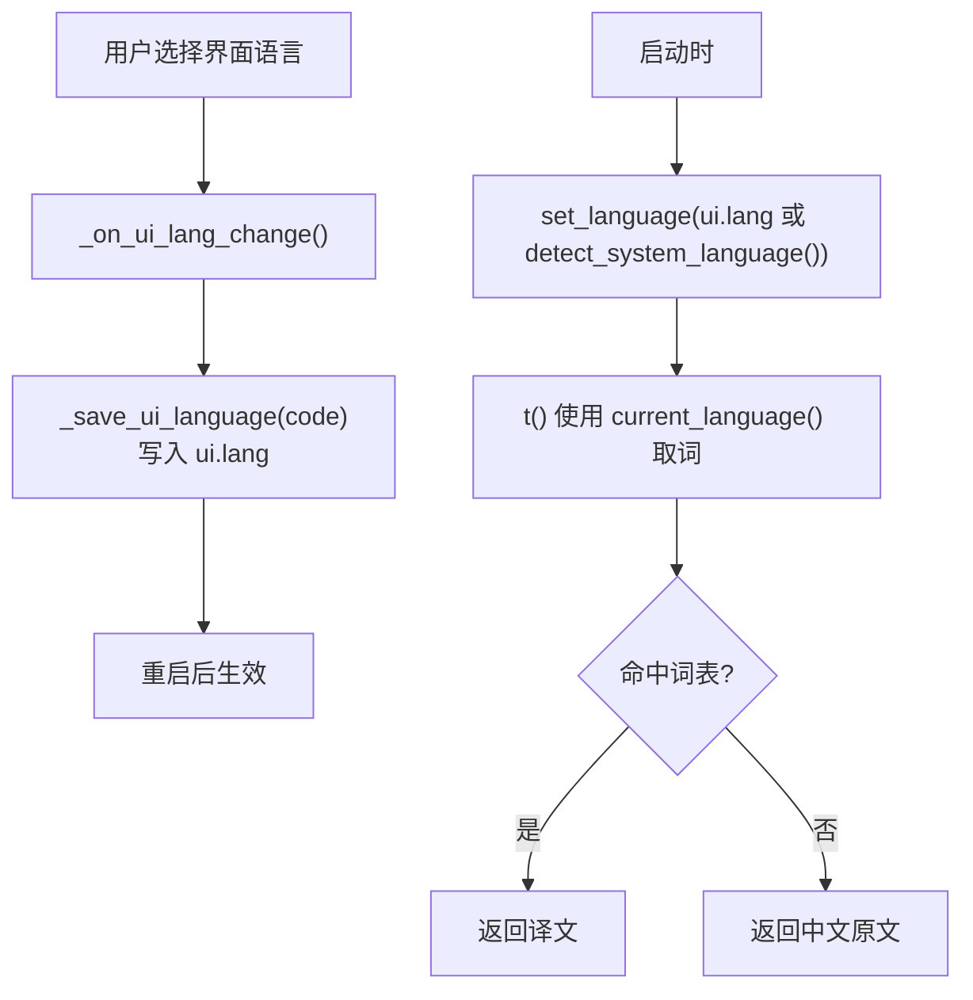
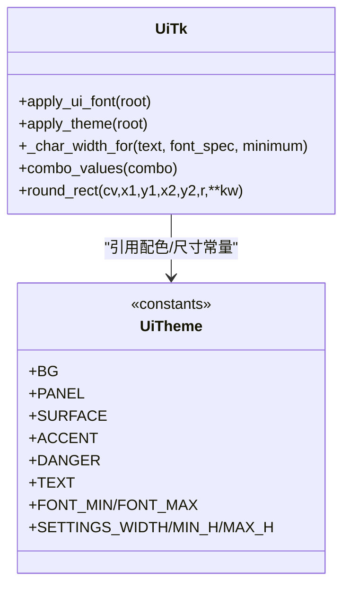
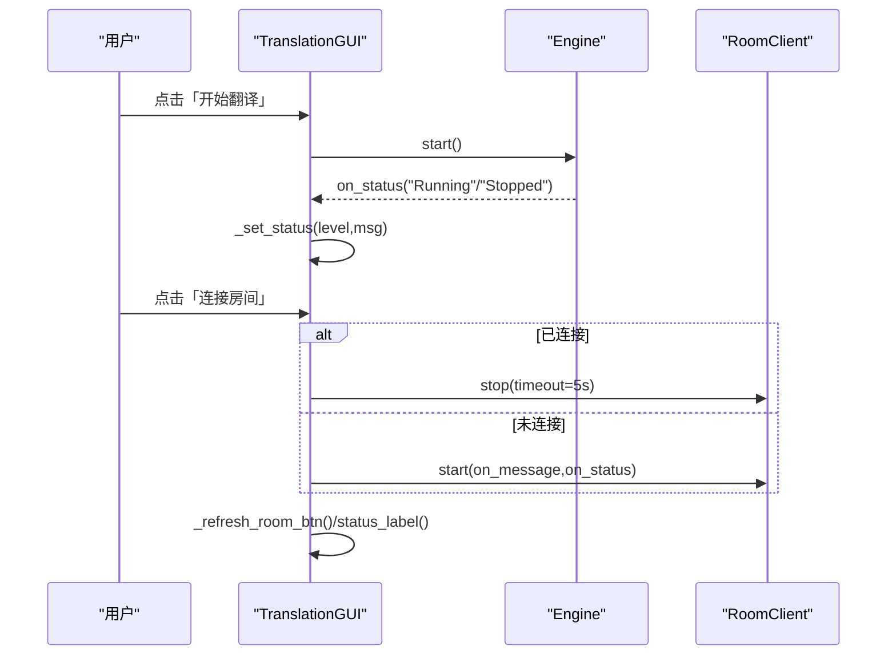
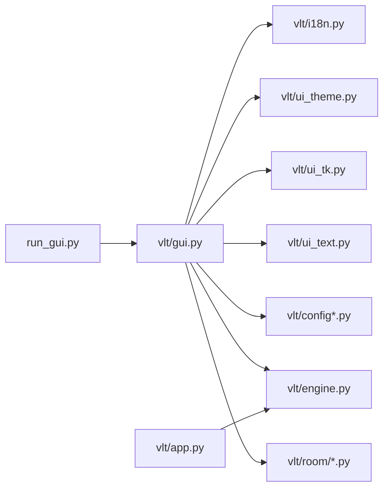

# 图形用户界面

<cite>
**本文引用的文件**   
- [gui.py](file://vlt/gui.py)
- [i18n.py](file://vlt/i18n.py)
- [ui_theme.py](file://vlt/ui_theme.py)
- [ui_tk.py](file://vlt/ui_tk.py)
- [ui_text.py](file://vlt/ui_text.py)
- [en.py](file://vlt/locales/en.py)
- [ja.py](file://vlt/locales/ja.py)
- [ko.py](file://vlt/locales/ko.py)
- [ru.py](file://vlt/locales/ru.py)
- [app.py](file://vlt/app.py)
- [run_gui.py](file://run_gui.py)
</cite>

## 目录
1. [简介](#简介)
2. [项目结构](#项目结构)
3. [核心组件](#核心组件)
4. [架构总览](#架构总览)
5. [详细组件分析](#详细组件分析)
6. [依赖关系分析](#依赖关系分析)
7. [性能与响应式设计](#性能与响应式设计)
8. [可访问性与无障碍](#可访问性与无障碍)
9. [故障排查指南](#故障排查指南)
10. [结论](#结论)
11. [附录：扩展与自定义指南](#附录扩展与自定义指南)

## 简介
本文件面向基于 Tkinter 的图形用户界面，系统性说明主窗口布局、控件组织、事件处理机制，以及设置对话框、状态监控面板、语言切换器等功能区域的实现。文档还覆盖国际化支持（多语言资源管理、动态语言切换、本地化文本处理）、主题系统与样式定制、用户交互流程与状态管理，并给出界面扩展与自定义指导，同时包含响应式设计与可访问性考虑。

## 项目结构
界面代码集中在 `vlt/gui.py`，并通过以下模块解耦：
- `vlt/i18n.py`：多语言系统，以中文原文为 key 的轻量翻译器。
- `vlt/ui_theme.py`：纯数据视觉常量（配色、字号占位、尺寸与布局常量）。
- `vlt/ui_tk.py`：需要 Tk 的底层工具（字体族解析、字符宽度换算、控件读取、圆角矩形、主题应用）。
- `vlt/ui_text.py`：纯字符串逻辑（语言标签映射、YAML 标量引号、可写性探测、试听等）。
- `vlt/locales/*.py`：各语言词表（en/ja/ko/ru），key 为中文原文。
- `run_gui.py`：PyInstaller 打包入口，兜底 stdout/stderr，拦截验证参数后调用 `vlt.gui.main`。
- `vlt/app.py`：命令行主程序（音频源→会话→节流合并→chatbox），与 GUI 共享引擎与配置模型。

**图表来源** 
- [gui.py:194-358](file://vlt/gui.py#L194-L358)
- [ui_theme.py:1-102](file://vlt/ui_theme.py#L1-L102)
- [ui_tk.py:1-311](file://vlt/ui_tk.py#L1-L311)
- [ui_text.py:1-241](file://vlt/ui_text.py#L1-L241)
- [i18n.py:1-107](file://vlt/i18n.py#L1-L107)
- [en.py:1-439](file://vlt/locales/en.py#L1-L439)
- [ja.py:1-444](file://vlt/locales/ja.py#L1-L444)
- [ko.py:1-435](file://vlt/locales/ko.py#L1-L435)
- [ru.py:1-447](file://vlt/locales/ru.py#L1-L447)
- [app.py:1-166](file://vlt/app.py#L1-L166)
- [run_gui.py:1-38](file://run_gui.py#L1-L38)

**章节来源**
- [gui.py:194-358](file://vlt/gui.py#L194-L358)
- [run_gui.py:1-38](file://run_gui.py#L1-L38)

## 核心组件
- TranslationGUI：主界面类，负责构建主窗口、行级控件（会话控制、输出选择、房间中继、聊天区、输入行、状态栏）、设置弹窗（分页）、手腕屏/桌面字幕微调、更新检查与下载进度窗、赞助弹窗等。
- i18n.t()：以中文原文为 key 的翻译接口；未命中时回落到中文原文，避免界面崩溃或空白。
- ui_theme：集中定义深色主题配色、按钮风格色阶、赞助链接、设置弹窗尺寸常量、桌面字幕滑块范围等。
- ui_tk：提供 apply_ui_font、apply_theme、_char_width_for、combo_values、round_rect 等 Tk 相关工具。
- ui_text：提供 _provider_choices、_persist_provider、SOURCE_LANGS/TARGET_LANGS、_Bubble、_DownloadCancelled、_play_pcm_local 等纯逻辑工具。
- locales/*：各语言 STRINGS 字典，key 与 t() 调用点逐字一致。

**章节来源**
- [gui.py:194-358](file://vlt/gui.py#L194-L358)
- [i18n.py:1-107](file://vlt/i18n.py#L1-L107)
- [ui_theme.py:1-102](file://vlt/ui_theme.py#L1-L102)
- [ui_tk.py:1-311](file://vlt/ui_tk.py#L1-L311)
- [ui_text.py:1-241](file://vlt/ui_text.py#L1-L241)
- [en.py:1-439](file://vlt/locales/en.py#L1-L439)

## 架构总览
界面采用“主窗口 + 设置弹窗”的双层结构：高频操作在主窗口第一/二/三行完成，低频设置收进分页弹窗。所有 UI 构建在 `_build_ui` 中按顺序装配，主题和字体先于控件创建。事件通过 Tk 的事件循环与队列（self._q）协作，后台线程只入队，主线程统一刷新 UI。

**图表来源**
- [gui.py:321-358](file://vlt/gui.py#L321-L358)
- [gui.py:490-545](file://vlt/gui.py#L490-L545)
- [gui.py:1176-1229](file://vlt/gui.py#L1176-L1229)

## 详细组件分析

### 主窗口布局与控件组织
- 第一行（会话控制）：开始/停止、方向（我说/别人说/双向同时）、语言对（源→目标）。
- 第二行（输出面）：chatbox、手腕屏、译音输出、桌面字幕；右上角 API key 状态槽位（已配置显示标签，未配置显示跳转按钮）。
- 第三行（房间文本中继）：连接/断开按钮 + 状态文案；房间码/昵称在设置弹窗的「房间」页。
- 聊天区：Canvas 上绘制气泡，支持流式刷新、自动滚动、最大气泡数限制。
- 打字输入行：回车发送、Esc 清空，替代麦克风输入。
- 状态栏：运行态、统计信息、错误/警告提示。

**图表来源**
- [gui.py:321-358](file://vlt/gui.py#L321-L358)
- [gui.py:490-545](file://vlt/gui.py#L490-L545)
- [gui.py:546-598](file://vlt/gui.py#L546-L598)
- [gui.py:602-640](file://vlt/gui.py#L602-L640)
- [gui.py:1176-1229](file://vlt/gui.py#L1176-L1229)

**章节来源**
- [gui.py:321-358](file://vlt/gui.py#L321-L358)
- [gui.py:490-545](file://vlt/gui.py#L490-L545)
- [gui.py:546-598](file://vlt/gui.py#L546-L598)
- [gui.py:602-640](file://vlt/gui.py#L602-L640)

### 设置对话框（分页）
- 常规页：API key 输入/保存/清除、服务线路选择（千问云/海外版互斥）、界面语言切换、VRChat OSC 端口保存。
- 音频页：设备选择（麦克风/loopback/译音输出，Linux 固定处理）、输入门限（实时电平可视化）、音色（说话译音/打字译音）及试听。
- 手腕屏页：锚点、tracker 序号、位置/旋转/大小/弯曲/透明度、字号、面板高、底板/原文不透明度；拖动落盘热重载。
- 桌面字幕页：独立于手腕屏的尺寸/字号/透明度/拖动解锁；即时生效。
- 词库页：全局/方向级专有名词编辑，保存后重建会话生效。
- 房间页：房间码/昵称生成与保存，连接时重连。
- 关于页：软件更新检查、日志导出/打开、开发者署名、赞助者名单。

**图表来源**
- [gui.py:1176-1229](file://vlt/gui.py#L1176-L1229)
- [gui.py:1338-1426](file://vlt/gui.py#L1338-L1426)
- [gui.py:1606-1764](file://vlt/gui.py#L1606-L1764)
- [gui.py:1766-1782](file://vlt/gui.py#L1766-L1782)
- [gui.py:1784-1847](file://vlt/gui.py#L1784-L1847)
- [gui.py:1849-1892](file://vlt/gui.py#L1849-L1892)
- [gui.py:1894-1985](file://vlt/gui.py#L1894-L1985)

**章节来源**
- [gui.py:1176-1229](file://vlt/gui.py#L1176-L1229)
- [gui.py:1338-1426](file://vlt/gui.py#L1338-L1426)
- [gui.py:1606-1764](file://vlt/gui.py#L1606-L1764)
- [gui.py:1766-1782](file://vlt/gui.py#L1766-L1782)
- [gui.py:1784-1847](file://vlt/gui.py#L1784-L1847)
- [gui.py:1849-1892](file://vlt/gui.py#L1849-L1892)
- [gui.py:1894-1985](file://vlt/gui.py#L1894-L1985)

### 语言切换器与国际化系统
- 语言列表：`available_languages()` 返回 (code, 母语名称)，下拉显示母语写法。
- 当前语言：`current_language()` 默认 zh，启动时根据 `ui.lang` 或系统语言设置。
- 归一化：`normalize_language()` 容错处理 en-US/zh_CN 等，不认识一律回落 zh。
- 系统语言探测：委派给平台层，保证跨平台一致性。
- 翻译接口：`t(zh, **kw)` 查当前语言词表，未命中返回中文原文；格式化失败打印告警并返回未格式化文本。
- 词表加载：`_catalog(lang)` 懒加载 `vlt/locales/<lang>.py` 的 STRINGS，失败回空词表（即中文原文）。

**图表来源**
- [i18n.py:30-66](file://vlt/i18n.py#L30-L66)
- [i18n.py:68-107](file://vlt/i18n.py#L68-L107)
- [gui.py:2131-2158](file://vlt/gui.py#L2131-L2158)

**章节来源**
- [i18n.py:1-107](file://vlt/i18n.py#L1-L107)
- [gui.py:2131-2158](file://vlt/gui.py#L2131-L2158)

### 主题系统与样式定制
- 主题应用：`apply_theme(root)` 使用 ttk clam 主题，统一背景、前景、边框、按钮、下拉、滚动条、Notebook 标签等样式。
- 颜色体系：深灰 + 蓝，明度阶梯清晰；区分强调色（Accent）、危险动作（Danger）、文本层级（TEXT/TEXT_DIM/TEXT_MUTED）。
- 字体策略：`apply_ui_font(root)` 按平台真实可用字体族重绑 FONT_* 常量，避免 Linux 下 fallback fixed 导致的测量卡顿。
- 控件样式：Key.TEntry、ChipWarn.TButton、TNotebook.Tab 等均深度定制，确保深色主题一致体验。

**图表来源**
- [ui_theme.py:1-102](file://vlt/ui_theme.py#L1-L102)
- [ui_tk.py:49-86](file://vlt/ui_tk.py#L49-L86)
- [ui_tk.py:173-311](file://vlt/ui_tk.py#L173-L311)

**章节来源**
- [ui_theme.py:1-102](file://vlt/ui_theme.py#L1-L102)
- [ui_tk.py:49-86](file://vlt/ui_tk.py#L49-L86)
- [ui_tk.py:173-311](file://vlt/ui_tk.py#L173-L311)

### 用户交互流程与状态管理
- 会话控制：开始/停止按钮切换引擎运行态，状态栏反馈“正在启动/运行中/已停止”。
- 方向与语言对：单选/复选框驱动引擎方向，语言对变更触发引擎重建。
- 输出勾选：chatbox/手腕屏/译音输出/桌面字幕组合开关，影响引擎 sink 与 overlay/desktop 行为。
- 房间中继：连接/断开按钮驱动 RoomClient 生命周期，状态文案与按钮文案同步刷新。
- 设备与电平：设备扫描结果回填下拉，输入门限启用后实时电平可视化，阈值变化立即生效。
- 更新检查：后台线程检查版本，主线程弹出三按钮窗（立即更新/下次再说/不再提示），下载进度窗支持取消与重试。

**图表来源**
- [gui.py:490-545](file://vlt/gui.py#L490-L545)
- [gui.py:642-700](file://vlt/gui.py#L642-L700)
- [gui.py:741-770](file://vlt/gui.py#L741-L770)

**章节来源**
- [gui.py:490-545](file://vlt/gui.py#L490-L545)
- [gui.py:642-700](file://vlt/gui.py#L642-L700)
- [gui.py:741-770](file://vlt/gui.py#L741-L770)

## 依赖关系分析
- gui.py 依赖：
  - i18n.t：所有可见文案走 t()。
  - ui_theme/ui_tk：主题与字体、控件工具。
  - ui_text：语言标签、YAML 工具、语音试听、下载取消异常等。
  - config/config_io：配置读写、YAML 就地修改。
  - engine/devices/output/room：引擎、设备枚举、叠加层、房间客户端。
  - paths/platform：路径与平台特性。
- run_gui.py：顶层脚本，兜底 stdout/stderr，拦截 --verify-* 后导入 vlt.gui.main。
- app.py：命令行入口，与 GUI 共享 Engine/Config 模型。

**图表来源**
- [run_gui.py:1-38](file://run_gui.py#L1-L38)
- [gui.py:1-158](file://vlt/gui.py#L1-L158)
- [app.py:1-166](file://vlt/app.py#L1-L166)

**章节来源**
- [run_gui.py:1-38](file://run_gui.py#L1-L38)
- [gui.py:1-158](file://vlt/gui.py#L1-L158)
- [app.py:1-166](file://vlt/app.py#L1-L166)

## 性能与响应式设计
- 字体测量缓存：`_char_width_for` 对字体规格与文本做缓存，避免频繁 measure 导致卡顿。
- 窗口宽度自适应：`_fit_window_width` 实测需求宽度，结合屏幕宽度上限调整初始几何与最小尺寸。
- 设置弹窗尺寸：`_size_settings_window` 按内容高度 + 两道上限（SETTINGS_MAX_H/屏高-90）定高，内容超限时页面滚动兜底。
- 滚动条显隐：`_sync_page_scrollbar` 仅在内容高于可视区域时显示滚动条，保持界面整洁。
- 滑块落盘节流：手腕屏/桌面字幕拖动时延时 200ms 写盘，避免频繁 IO。
- 设备扫描与电平探针：只在设置窗可见且启用时采集，关闭设置窗立刻释放声卡资源。

**章节来源**
- [ui_tk.py:111-146](file://vlt/ui_tk.py#L111-L146)
- [gui.py:361-397](file://vlt/gui.py#L361-L397)
- [gui.py:1313-1336](file://vlt/gui.py#L1313-L1336)
- [gui.py:1266-1286](file://vlt/gui.py#L1266-L1286)
- [gui.py:1099-1107](file://vlt/gui.py#L1099-L1107)
- [gui.py:2125-2129](file://vlt/gui.py#L2125-L2129)

## 可访问性与无障碍
- 右键菜单：为 Entry/Text 绑定剪切/复制/粘贴/全选虚拟事件，解决 Windows 无右键菜单问题。
- 键盘导航：回车发送、Esc 清空、Escape 关闭弹窗，默认按钮聚焦（如更新弹窗“立即更新”）。
- 颜色对比：深色主题下文本/背景对比度充足，危险动作用独立色系（非亮红）降低误判。
- 图片降级：收款码加载失败降级为文字提示，不抛异常拖垮主窗口。
- 状态提示：错误/警告/成功状态栏提示，配合日志留痕，便于辅助技术读取。

**章节来源**
- [gui.py:456-489](file://vlt/gui.py#L456-L489)
- [gui.py:2342-2385](file://vlt/gui.py#L2342-L2385)
- [gui.py:2243-2262](file://vlt/gui.py#L2243-L2262)

## 故障排查指南
- 窗口图标缺失：记录警告但不影响启动；Linux 走 iconphoto(png)。
- 标题栏变深色失败：Windows 老系统不支持则静默跳过。
- 右键菜单失败：记录警告，不影响输入。
- 房间连接失败：捕获异常，重置 room 引用，状态栏提示“房间出错（翻译不受影响）”。
- 设备扫描失败：提示建议停止翻译后再刷新。
- 端口保存失败：就地红字 + 状态栏错误，配置保持原样。
- 更新检查失败：自动检查仅留日志；手动检查在设置区显示原因。
- 日志导出失败：状态栏错误 + 日志记录。

**章节来源**
- [gui.py:398-443](file://vlt/gui.py#L398-L443)
- [gui.py:456-489](file://vlt/gui.py#L456-L489)
- [gui.py:741-770](file://vlt/gui.py#L741-L770)
- [gui.py:1434-1479](file://vlt/gui.py#L1434-L1479)
- [gui.py:2274-2341](file://vlt/gui.py#L2274-L2341)
- [gui.py:2008-2067](file://vlt/gui.py#L2008-L2067)

## 结论
该图形用户界面以 TranslationGUI 为核心，围绕 Tkinter 构建了清晰的层次化布局与模块化依赖：主题与字体解耦、国际化以中文原文为 key、设置弹窗分页承载低频配置、状态栏与队列保障主线程安全刷新。系统在响应式布局、可访问性、错误容忍方面做了充分加固，并为扩展（新语言、新控件、新设置页）提供了稳定契约。

## 附录：扩展与自定义指南
- 新增语言：
  - 在 `vlt/locales/<code>.py` 新增 STRINGS，key 与现有 t() 调用点逐字一致。
  - 在 `i18n._LANGS` 登记 (code, 母语名称)。
  - 重启后生效（界面语言切换持久化到 ui.lang）。
- 新增设置页：
  - 在 `_build_settings_dialog` 中增加一页 `_settings_page(nb, title)`。
  - 在 `_SETTINGS_PAGE_TAB` 登记 page→title 映射，以便 `_open_settings(page=...)` 跳转。
- 自定义主题：
  - 修改 `ui_theme.py` 中的配色常量。
  - 在 `ui_tk.apply_theme` 中补充 ttk style 映射。
- 扩展控件：
  - 使用 `ui_tk._char_width_for` 计算 width，避免中日韩文字截断。
  - 使用 `ui_tk.combo_values` 安全读取 Combobox 值。
- 响应式优化：
  - 使用 `_fit_window_width` 与 `_size_settings_window` 保证不同语言与屏幕下的可用性。
  - 使用 `_sync_page_scrollbar` 控制滚动条显隐。

**章节来源**
- [i18n.py:15-23](file://vlt/i18n.py#L15-L23)
- [gui.py:2069-2124](file://vlt/gui.py#L2069-L2124)
- [ui_theme.py:1-102](file://vlt/ui_theme.py#L1-L102)
- [ui_tk.py:111-163](file://vlt/ui_tk.py#L111-L163)
- [gui.py:361-397](file://vlt/gui.py#L361-L397)
- [gui.py:1313-1336](file://vlt/gui.py#L1313-L1336)
- [gui.py:1266-1286](file://vlt/gui.py#L1266-L1286)