# 用户交互流程

<cite>
**本文引用的文件**   
- [README.md](file://README.md)
- [run_gui.py](file://run_gui.py)
- [vlt/app.py](file://vlt/app.py)
- [vlt/config.py](file://vlt/config.py)
- [vlt/engine.py](file://vlt/engine.py)
- [vlt/gui.py](file://vlt/gui.py)
- [vlt/room/model.py](file://vlt/room/model.py)
</cite>

## 目录
1. [引言](#引言)
2. [项目结构](#项目结构)
3. [核心组件](#核心组件)
4. [架构总览](#架构总览)
5. [详细组件分析](#详细组件分析)
6. [依赖关系分析](#依赖关系分析)
7. [性能与体验优化建议](#性能与体验优化建议)
8. [故障排查指南](#故障排查指南)
9. [结论](#结论)

## 引言
本文件面向“VRChat 实时同传”的用户交互流程，覆盖从启动应用、配置设置、开始翻译、停止翻译到房间协作的完整路径；同时说明界面状态与业务状态的同步、持久化与恢复、事件处理机制（含异步与错误处理）、设置对话框的参数验证与即时预览、房间协作的连接管理与状态显示，并给出用户体验优化与可访问性建议。

## 项目结构
- 顶层入口：`run_gui.py` 负责打包环境下的标准输出兜底、自检参数拦截，再调用 `vlt.gui.main`。
- 图形界面：`vlt/gui.py` 实现 Tkinter 主窗口、设置弹窗、引擎启停、手腕屏/桌面字幕、房间协作、更新检查等。
- 引擎层：`vlt/engine.py` 封装音频采集、会话管理、聊天气泡、叠加渲染、虚拟声卡、打字翻译、断线重连等。
- 配置层：`vlt/config.py` 负责 YAML 配置加载、API Key 来源、方向与词库合并、默认值与非法值回退。
- 命令行辅助：`vlt/app.py` 提供 CLI 模式，便于测试链路和调试。
- 房间模型：`vlt/room/model.py` 定义房间连接状态、成员、消息与状态摘要。

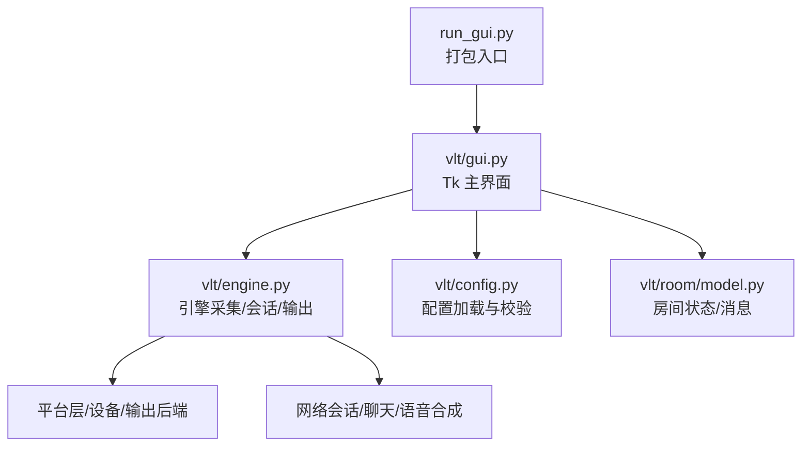

**图表来源**
- [run_gui.py:1-38](file://run_gui.py#L1-L38)
- [vlt/gui.py:194-350](file://vlt/gui.py#L194-L350)
- [vlt/engine.py:446-545](file://vlt/engine.py#L446-L545)
- [vlt/config.py:258-406](file://vlt/config.py#L258-L406)
- [vlt/room/model.py:97-120](file://vlt/room/model.py#L97-L120)

**章节来源**
- [run_gui.py:1-38](file://run_gui.py#L1-L38)
- [README.md:1-114](file://README.md#L1-L114)

## 核心组件
- 图形界面（TranslationGUI）
  - 负责构建 UI、绑定用户操作、维护界面状态、驱动引擎启停、刷新状态栏与气泡、打开设置弹窗、管理房间连接。
- 引擎（Engine）
  - 负责音频源接入（麦克风/系统回放/PCM）、会话建立与重连、文本增量与终版分发、聊天气泡限流、手腕屏/桌面字幕更新、虚拟声卡输出、打字翻译与 TTS。
- 配置（AppConfig/Direction）
  - 负责读取 config.yaml、环境变量与凭据存储，合并全局与方向级热词，提供运行时语言切换与词库热更新接口。
- 房间模型（RoomClient/RoomState/RoomMessage）
  - 负责多人房间的连接、成员列表、消息收发、连接状态与在线人数统计。

**章节来源**
- [vlt/gui.py:194-350](file://vlt/gui.py#L194-L350)
- [vlt/engine.py:446-545](file://vlt/engine.py#L446-L545)
- [vlt/config.py:121-188](file://vlt/config.py#L121-L188)
- [vlt/room/model.py:97-120](file://vlt/room/model.py#L97-L120)

## 架构总览
下图展示用户从点击“开始翻译”到译文到达各输出的端到端流程，以及设置与房间协作的交互点。

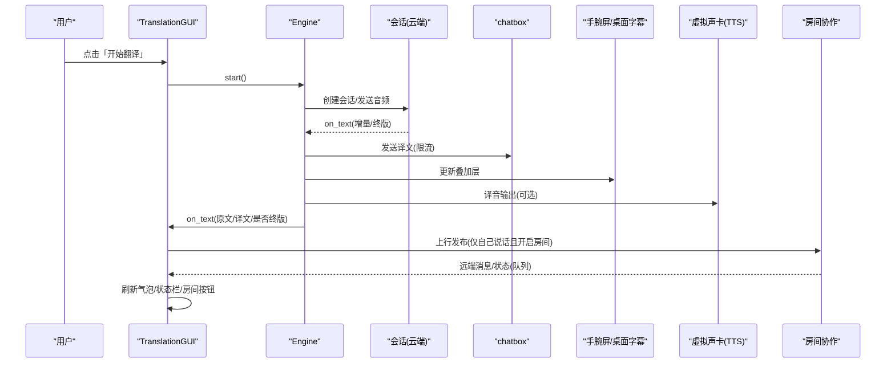

**图表来源**
- [vlt/gui.py:490-545](file://vlt/gui.py#L490-L545)
- [vlt/engine.py:820-889](file://vlt/engine.py#L820-L889)
- [vlt/engine.py:1059-1074](file://vlt/engine.py#L1059-L1074)
- [vlt/gui.py:787-810](file://vlt/gui.py#L787-L810)

## 详细组件分析

### 启动应用与主界面初始化
- 打包入口 `run_gui.py` 在导入 GUI 前兜住 stdout/stderr，避免冻结产物下 print 崩溃；拦截 `--verify-*` 走自检逻辑。
- GUI 构造时加载配置、确定界面语言、初始化引擎列表、手腕屏/桌面字幕对象、房间客户端与发布者、UI 控件树、主题与字体、设备扫描与更新检查任务。
- 主界面首行放置“开始翻译/停止翻译”、方向选择（我说/别人说/双向同时）、语言对（A→B），第二行放置输出勾选（chatbox/手腕屏/译音输出/桌面字幕），第三行放置房间协作连接按钮与状态。

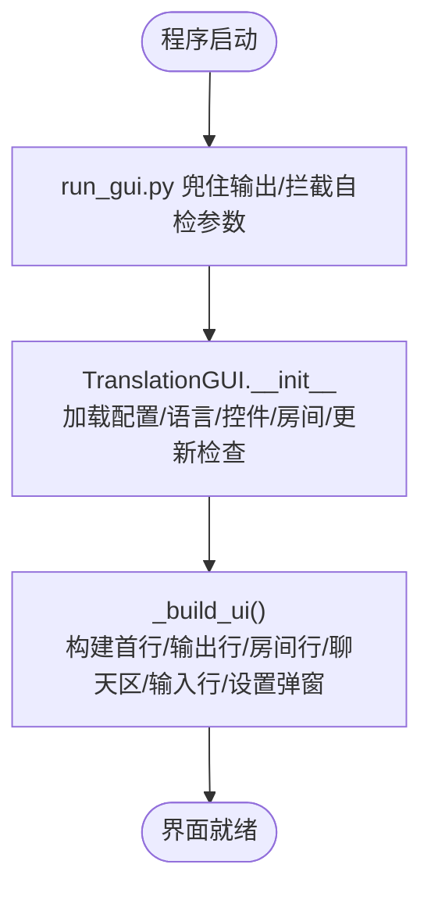

**图表来源**
- [run_gui.py:1-38](file://run_gui.py#L1-L38)
- [vlt/gui.py:194-350](file://vlt/gui.py#L194-L350)

**章节来源**
- [run_gui.py:1-38](file://run_gui.py#L1-L38)
- [vlt/gui.py:194-350](file://vlt/gui.py#L194-L350)

### 配置设置与持久化
- API Key 来源优先级：显式传入 → 界面保存（按线路分槽）→ 环境变量 → bl CLI 配置；日志中只打码不打明文。
- 服务线路（千问云/千问云·海外版）互斥，保存时同步 base_url 与 provider，并在运行中提示需重启翻译生效。
- VRChat OSC 端口校验范围 1–65535，就地写入 config.yaml，内存同步；若正在翻译则提示重开翻译后生效。
- 界面语言选择写 ui.lang，重启后生效；所有保存均使用“就地改文本”，保留注释与键顺序。

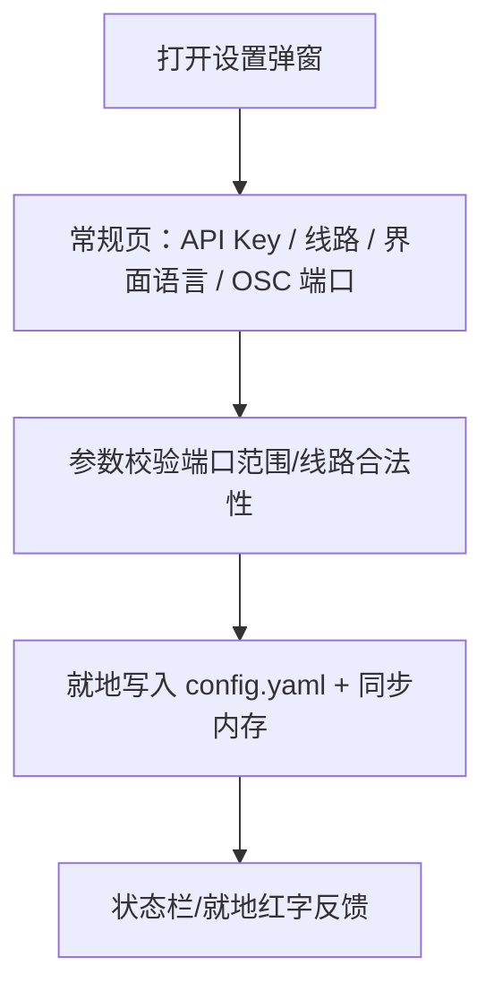

**图表来源**
- [vlt/config.py:68-104](file://vlt/config.py#L68-L104)
- [vlt/gui.py:1337-1479](file://vlt/gui.py#L1337-L1479)
- [vlt/gui.py:1480-1576](file://vlt/gui.py#L1480-L1576)
- [vlt/gui.py:2131-2158](file://vlt/gui.py#L2131-L2158)

**章节来源**
- [vlt/config.py:68-104](file://vlt/config.py#L68-L104)
- [vlt/config.py:258-406](file://vlt/config.py#L258-L406)
- [vlt/gui.py:1337-1576](file://vlt/gui.py#L1337-L1576)
- [vlt/gui.py:2131-2158](file://vlt/gui.py#L2131-L2158)

### 开始翻译（音频采集与输出）
- 用户点击“开始翻译”后，GUI 根据方向与输出勾选创建 Engine 实例并启动；Engine 内部起守护线程运行 asyncio 事件循环。
- 音频源：
  - “我说”：麦克风或 PCM 文件，直接上送会话。
  - “别人说”：系统回放（loopback），带输入门限（RMS 阈值 + hold/preroll）过滤远处小声玩家。
- 文本输出：
  - chatbox：增量立即发，之后每 2 秒刷快照，句末必发最终版；停止时优先排空最新一条。
  - 手腕屏/桌面字幕：每次 on_text 即更新。
- 译音输出：
  - 实时模型直出译音或打字翻译后 TTS，经虚拟声卡输出；句子边界由终版文本或静音间隔触发。

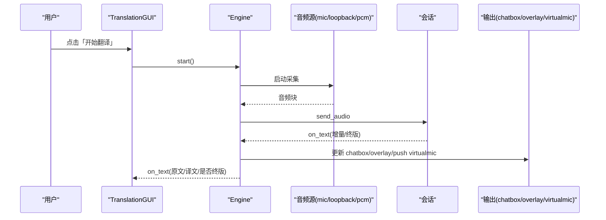

**图表来源**
- [vlt/engine.py:548-592](file://vlt/engine.py#L548-L592)
- [vlt/engine.py:820-889](file://vlt/engine.py#L820-L889)
- [vlt/engine.py:1019-1055](file://vlt/engine.py#L1019-L1055)
- [vlt/engine.py:1059-1074](file://vlt/engine.py#L1059-L1074)
- [vlt/engine.py:1134-1150](file://vlt/engine.py#L1134-L1150)

**章节来源**
- [vlt/engine.py:548-592](file://vlt/engine.py#L548-L592)
- [vlt/engine.py:820-889](file://vlt/engine.py#L820-L889)
- [vlt/engine.py:1019-1055](file://vlt/engine.py#L1019-L1055)
- [vlt/engine.py:1059-1074](file://vlt/engine.py#L1059-L1074)
- [vlt/engine.py:1134-1150](file://vlt/engine.py#L1134-L1150)

### 停止翻译与收尾
- 界面先对所有引擎并发下发 `request_stop()`，后台线程等待每个引擎 `wait_stopped(timeout)`，避免 UI 阻塞。
- Engine 停止时：打断采集循环、排空 chatbox（优先最新一条）、关闭 overlay/virtualmic/session/chatbox。
- 若收尾超时，状态栏如实显示“正在停止…”，不静默丢弃。

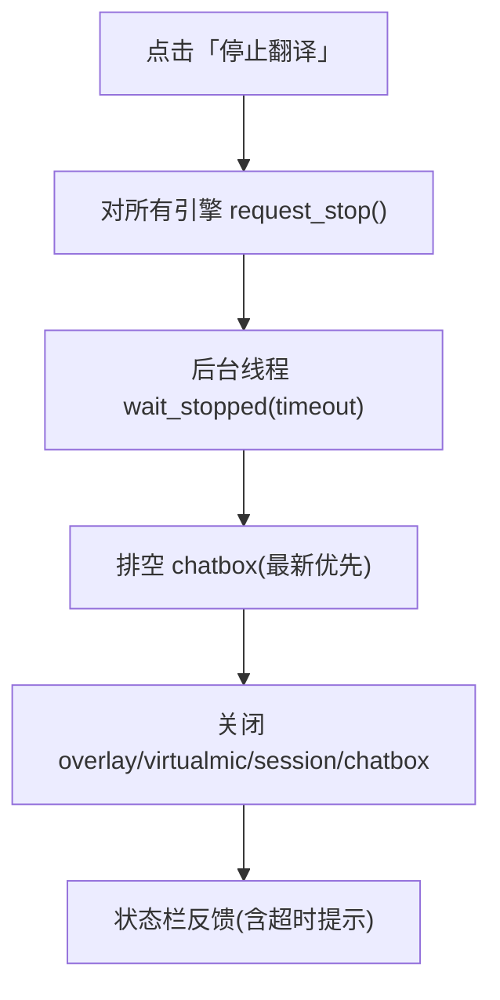

**图表来源**
- [vlt/engine.py:558-592](file://vlt/engine.py#L558-L592)
- [vlt/engine.py:705-786](file://vlt/engine.py#L705-L786)
- [vlt/engine.py:787-818](file://vlt/engine.py#L787-L818)

**章节来源**
- [vlt/engine.py:558-592](file://vlt/engine.py#L558-L592)
- [vlt/engine.py:705-786](file://vlt/engine.py#L705-L786)
- [vlt/engine.py:787-818](file://vlt/engine.py#L787-L818)

### 设置对话框交互流程（参数验证、即时预览、保存）
- 分页设计：常规/音频/手腕屏/桌面字幕/词库/房间/关于，固定宽度、内容滚动。
- 参数验证：端口范围、线路合法性、词库格式、滑块取值范围；非法值留痕并回落默认值。
- 即时预览：
  - 手腕屏/桌面字幕：拖动滑块即时热重载，落盘节流（200ms）。
  - 音色试听：本地播放固定样例，失败明确提示。
- 保存策略：就地修改 config.yaml，保留注释与键顺序；内存同步，必要时提示重开翻译生效。

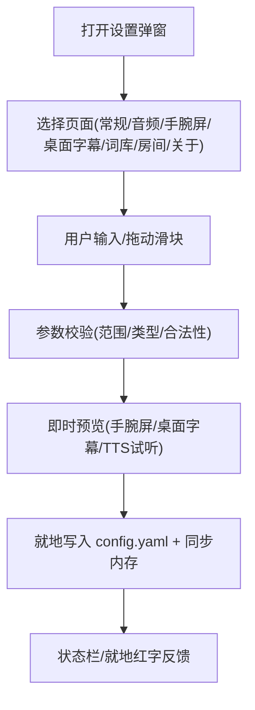

**图表来源**
- [vlt/gui.py:1175-1229](file://vlt/gui.py#L1175-L1229)
- [vlt/gui.py:1605-1764](file://vlt/gui.py#L1605-L1764)
- [vlt/gui.py:812-1174](file://vlt/gui.py#L812-L1174)
- [vlt/gui.py:1784-1847](file://vlt/gui.py#L1784-L1847)

**章节来源**
- [vlt/gui.py:1175-1229](file://vlt/gui.py#L1175-L1229)
- [vlt/gui.py:1605-1764](file://vlt/gui.py#L1605-L1764)
- [vlt/gui.py:812-1174](file://vlt/gui.py#L812-L1174)
- [vlt/gui.py:1784-1847](file://vlt/gui.py#L1784-L1847)

### 房间协作功能（连接管理、状态显示、用户提示）
- 主界面第三行提供“连接房间/断开连接”按钮，文案与样式随连接态变化。
- 点击连接前校验房间码；为空则提示并跳转“设置 → 房间”。
- 连接成功后显示“已连接 · N 人”，掉线自动重连，致命错误不再重连。
- 远端消息通过队列入队，主线程刷新气泡；自身说话通过 SourcePublisher 切片上行。

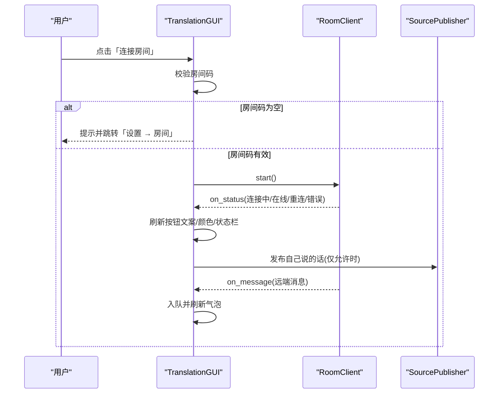

**图表来源**
- [vlt/gui.py:602-786](file://vlt/gui.py#L602-L786)
- [vlt/room/model.py:97-120](file://vlt/room/model.py#L97-L120)
- [vlt/room/model.py:303-367](file://vlt/room/model.py#L303-L367)

**章节来源**
- [vlt/gui.py:602-786](file://vlt/gui.py#L602-L786)
- [vlt/room/model.py:97-120](file://vlt/room/model.py#L97-L120)
- [vlt/room/model.py:303-367](file://vlt/room/model.py#L303-L367)

### 状态管理机制（界面状态与业务状态同步、持久化与恢复）
- 界面状态：方向、语言对、输出勾选、房间开关、OSC 端口、界面语言等保存在 config.yaml 的对应段；启动时恢复。
- 业务状态：Engine 持有 session/chatbox/overlay/virtualmic 等运行时对象；GUI 通过 `_engines` 列表与 `_pending_starts` 协调多引擎生命周期。
- 同步策略：
  - 设置项变更 → 就地写盘 → 同步内存 → 必要时提示重开翻译生效。
  - 引擎回调（on_text/on_status/on_stats）→ 主线程队列 → _poll 刷新 UI。
- 恢复策略：损坏配置备份并重生成模板；API Key 缺失时仍可启动界面以引导填写。

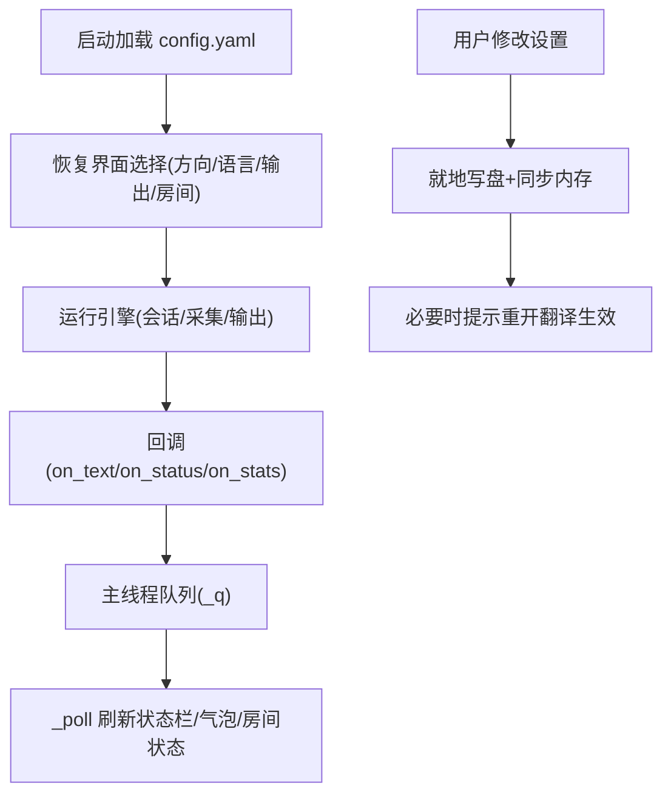

**图表来源**
- [vlt/config.py:258-406](file://vlt/config.py#L258-L406)
- [vlt/gui.py:194-350](file://vlt/gui.py#L194-L350)
- [vlt/engine.py:1008-1017](file://vlt/engine.py#L1008-L1017)

**章节来源**
- [vlt/config.py:258-406](file://vlt/config.py#L258-L406)
- [vlt/gui.py:194-350](file://vlt/gui.py#L194-L350)
- [vlt/engine.py:1008-1017](file://vlt/engine.py#L1008-L1017)

### 事件处理机制（用户操作、异步处理、错误处理）
- 用户操作：按钮/下拉/复选框/滑块/文本输入均绑定回调，统一通过 GUI 方法转发到引擎或配置层。
- 异步处理：Engine 在守护线程运行 asyncio 事件循环；采集/会话/网络 IO 均为异步；UI 通过队列与 after 调度在主线程刷新。
- 错误处理：
  - 配置非法值：留痕并回落默认值。
  - 网络异常：断线诊断日志 + 自动重连（带退避）。
  - 设备枚举失败：节流留痕，避免刷屏。
  - 辅助功能（赞助弹窗/浏览器打开）失败：降级为文字提示，不拖垮主功能。

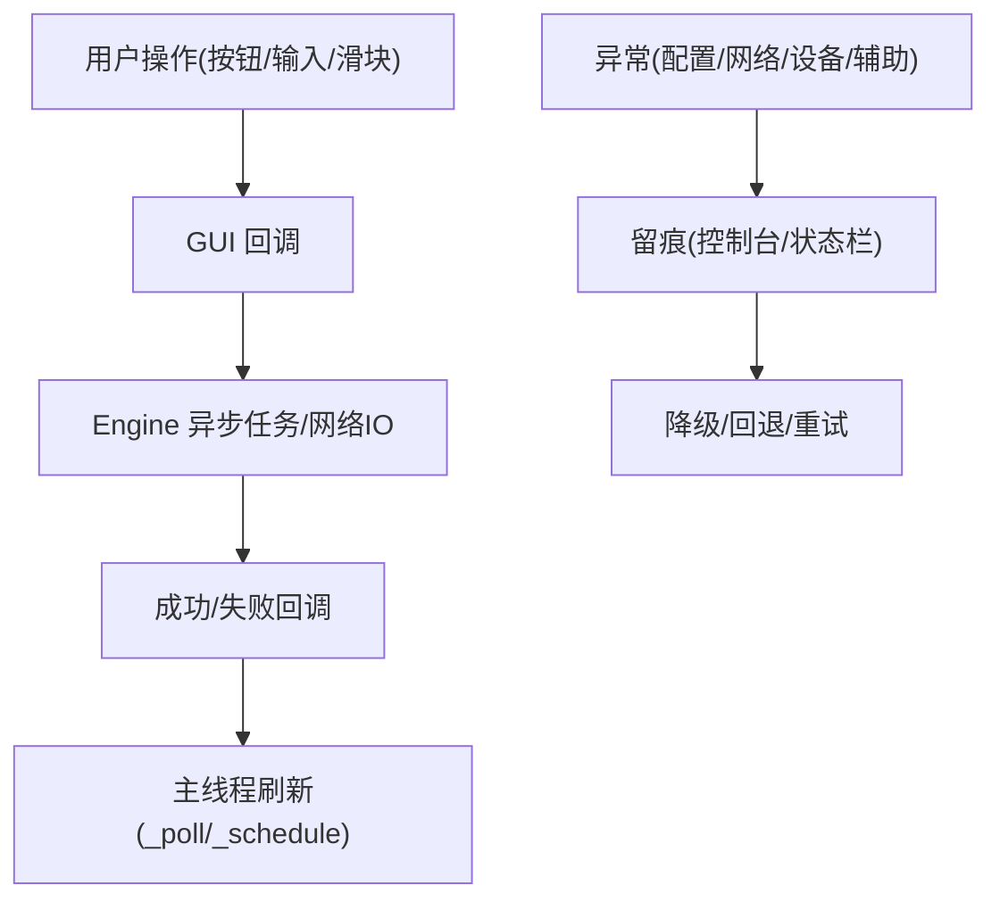

**图表来源**
- [vlt/engine.py:1290-1394](file://vlt/engine.py#L1290-L1394)
- [vlt/engine.py:1559-1584](file://vlt/engine.py#L1559-L1584)
- [vlt/gui.py:2160-2262](file://vlt/gui.py#L2160-L2262)

**章节来源**
- [vlt/engine.py:1290-1394](file://vlt/engine.py#L1290-L1394)
- [vlt/engine.py:1559-1584](file://vlt/engine.py#L1559-L1584)
- [vlt/gui.py:2160-2262](file://vlt/gui.py#L2160-L2262)

### 打字替代说话与 TTS
- 用户在底部输入框回车发送，引擎将译文作为“我说的一句终版”进入下游（气泡/手腕屏），并通过 VirtualMic 输出 TTS。
- TTS 支持流式（SSE）与整段两种模式；流式首段 ~0.4s 起播，显著降低开口延迟。
- 多条 TTS 串行锁防止分片交错导致听感重复。

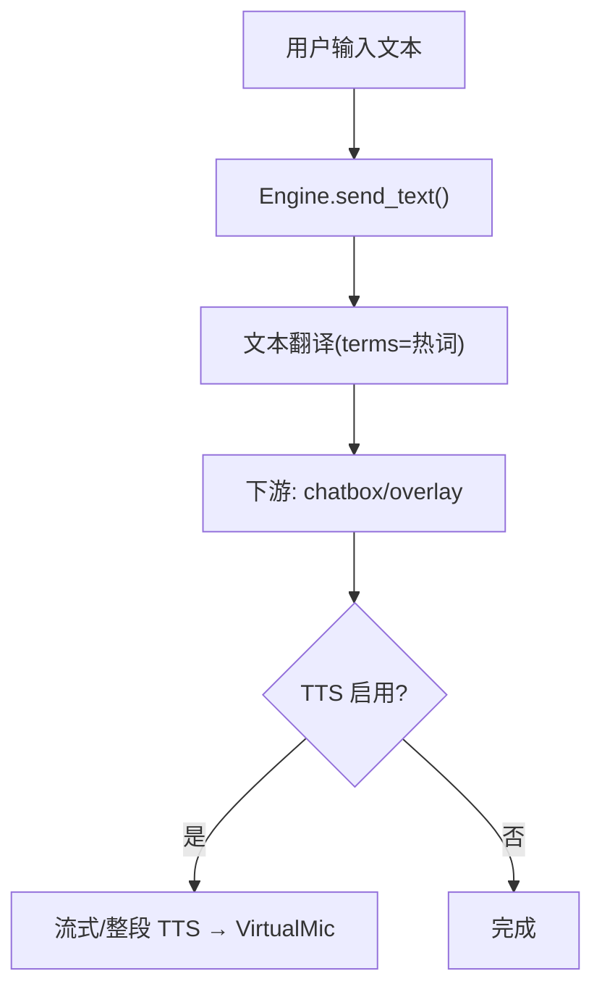

**图表来源**
- [vlt/engine.py:1157-1250](file://vlt/engine.py#L1157-L1250)

**章节来源**
- [vlt/engine.py:1157-1250](file://vlt/engine.py#L1157-L1250)

## 依赖关系分析
- GUI 依赖 Engine 进行音频采集与会话管理；依赖 config 提供配置与热词；依赖 room.model 提供房间状态与消息。
- Engine 依赖 platform 抽象音频设备与输出后端；依赖 endpoints 派生网络地址；依赖 output.chatbox/overlay/virtualmic 与 session.base。
- 配置层独立于 GUI/Engine，提供统一的 Direction/AppConfig 与热词合并口径。

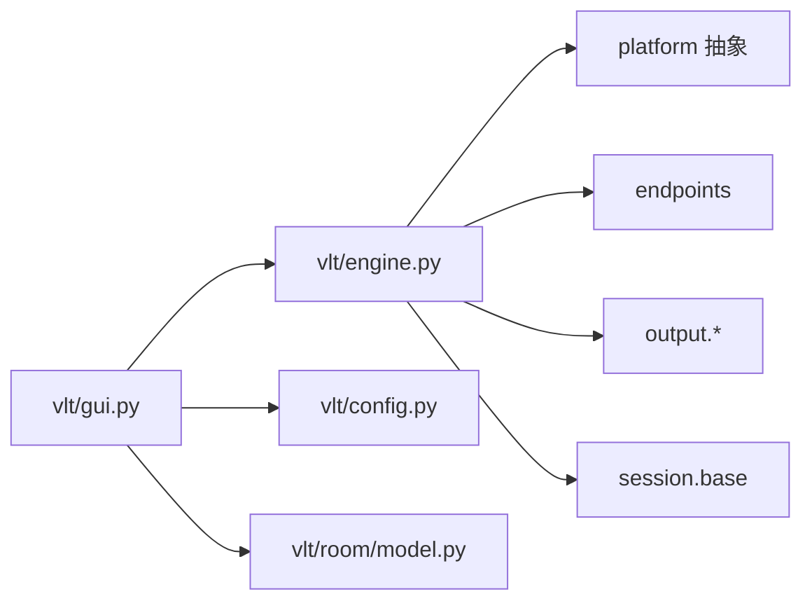

**图表来源**
- [vlt/gui.py:28-63](file://vlt/gui.py#L28-L63)
- [vlt/engine.py:21-38](file://vlt/engine.py#L21-L38)
- [vlt/config.py:14-18](file://vlt/config.py#L14-L18)

**章节来源**
- [vlt/gui.py:28-63](file://vlt/gui.py#L28-L63)
- [vlt/engine.py:21-38](file://vlt/engine.py#L21-L38)
- [vlt/config.py:14-18](file://vlt/config.py#L14-L18)

## 性能与体验优化建议
- 减少不必要的 UI 重绘：设置项保存采用节流（手腕屏/桌面字幕 200ms），避免频繁写盘与重绘。
- 优先保证核心链路稳定：引擎停止时优先排空最新一条译文，避免用户刚说完的句子被丢弃。
- 降低误判与噪音：输入门限（RMS）与长静音闸门结合，既过滤远处小声玩家，又防服务端 repeat 掉线。
- 提升可读性：状态栏与就地红字双通道反馈，确保关键错误不被忽略。
- 可访问性与键盘导航：
  - 右键菜单统一支持剪切/复制/粘贴/全选，弥补 Windows 原生行为差异。
  - 设置弹窗支持滚轮滚动当前页，Tab 顺序合理，Escape 关闭弹窗。
  - 输入框默认焦点落在主要操作按钮（如“立即更新”），提升键盘效率。

[本节为通用建议，不直接分析具体文件]

## 故障排查指南
- 配置损坏：自动备份 `.broken` 并从模板重建，提示用户重新设置设备/语言。
- API Key 缺失：界面照常启动，状态栏提示前往设置填写；日志中只打码。
- 设备枚举失败：节流留痕，同一理由只打印一次；恢复后补一行确认。
- 断线诊断：打印会话存活时长、输入音频占比、最近译文与服务端事件，辅助定位服务端掐线原因。
- 日志导出：一键导出脱敏日志压缩包，方便提交问题。

**章节来源**
- [vlt/config.py:258-305](file://vlt/config.py#L258-L305)
- [vlt/config.py:217-235](file://vlt/config.py#L217-L235)
- [vlt/engine.py:1559-1584](file://vlt/engine.py#L1559-L1584)
- [vlt/engine.py:1307-1361](file://vlt/engine.py#L1307-L1361)
- [vlt/gui.py:2008-2067](file://vlt/gui.py#L2008-L2067)

## 结论
本项目的用户交互围绕“低门槛启动、清晰的状态反馈、稳定的核心链路、灵活的设置与协作”展开。GUI 与 Engine 解耦，配置与业务分离，事件驱动与异步处理保障流畅体验；房间协作与手腕屏/桌面字幕提供多场景输出。通过节流、就地写盘、就地校验与双通道反馈，系统在易用性与健壮性之间取得平衡。后续可在可访问性（屏幕阅读器标签、更多键盘快捷键）与可视化诊断（更丰富的状态面板）方面继续增强。