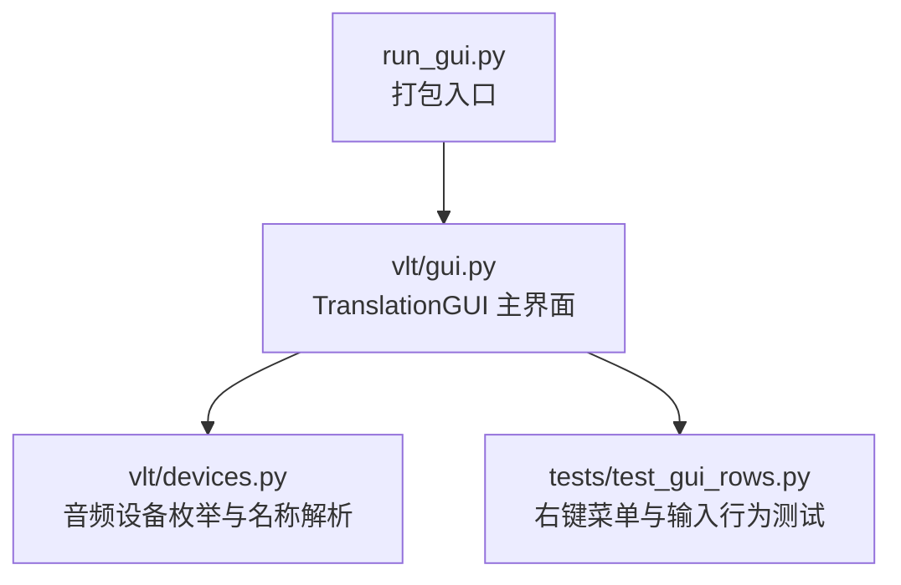
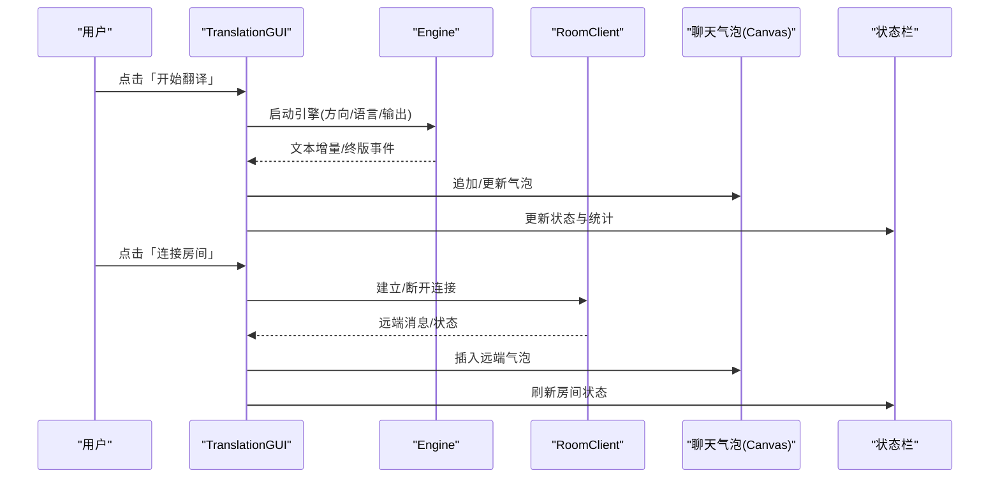
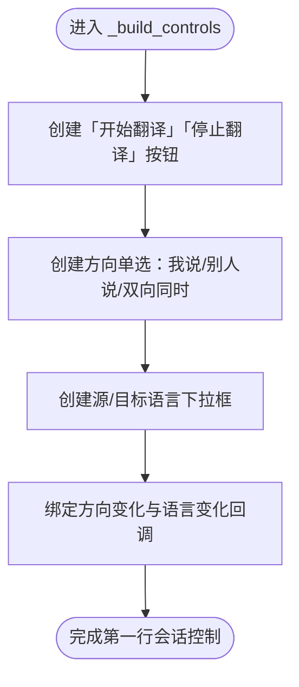
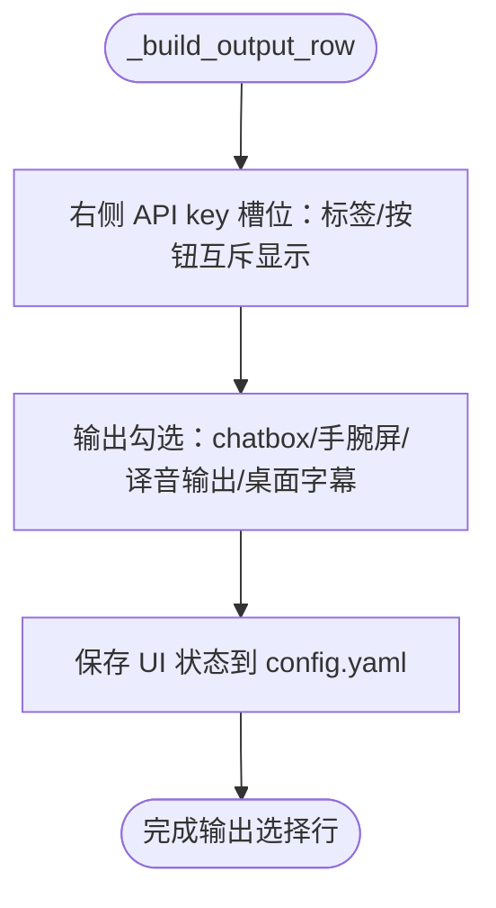
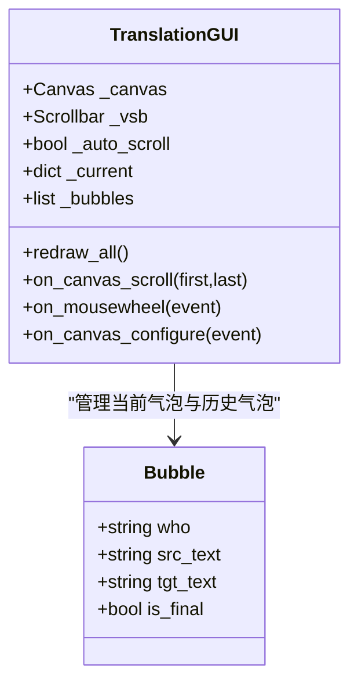
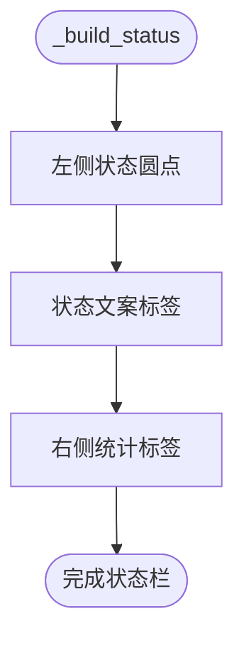
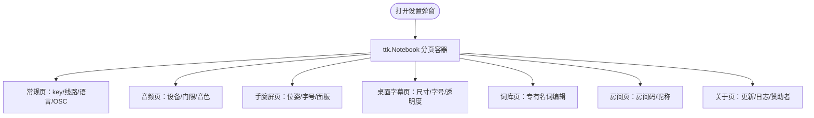
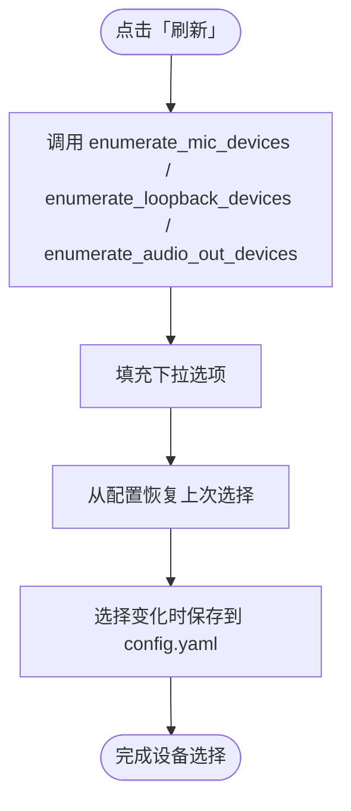
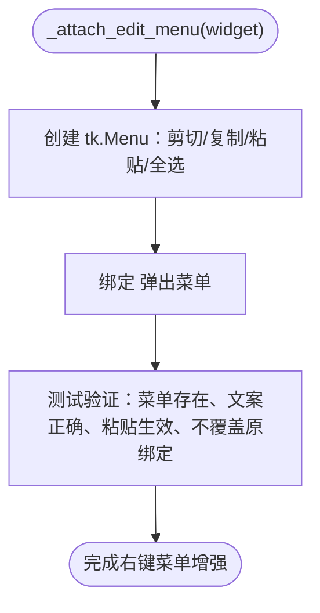
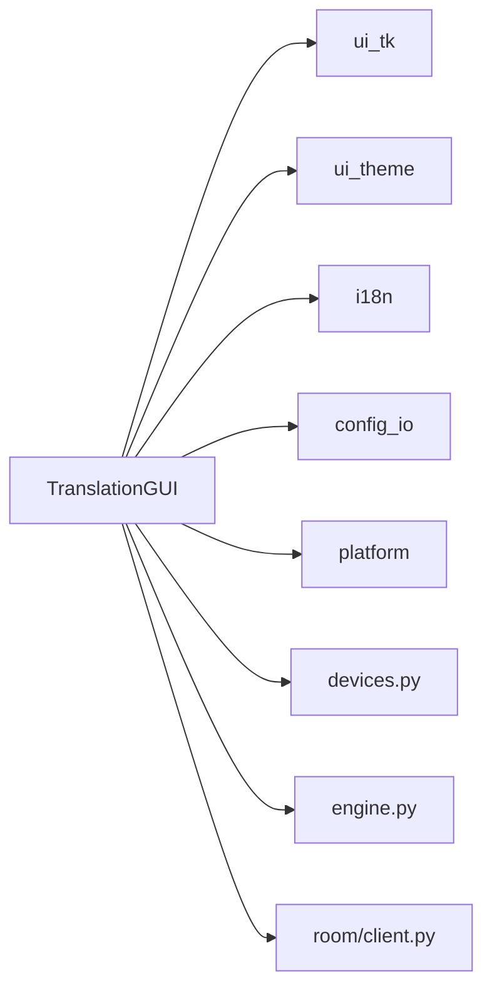

# 界面组件与布局

<cite>
**本文引用的文件**   
- [vlt/gui.py](file://vlt/gui.py)
- [run_gui.py](file://run_gui.py)
- [vlt/devices.py](file://vlt/devices.py)
- [tests/test_gui_rows.py](file://tests/test_gui_rows.py)
</cite>

## 目录
1. [简介](#简介)
2. [项目结构](#项目结构)
3. [核心组件](#核心组件)
4. [架构总览](#架构总览)
5. [详细组件分析](#详细组件分析)
6. [依赖关系分析](#依赖关系分析)
7. [性能与交互特性](#性能与交互特性)
8. [故障排查指南](#故障排查指南)
9. [结论](#结论)
10. [附录：组件复用与响应式布局要点](#附录组件复用与响应式布局要点)

## 简介
本文面向 VRChat 实时同传应用的图形界面，聚焦“界面组件与布局”的实现说明。内容覆盖：
- 控制按钮、下拉选择框、复选框、标签等控件的使用与定制方式；
- 主界面布局：顶部控制区、输出选择区、聊天显示区、状态栏的组织；
- 对话气泡系统：实时文本更新、滚动控制与视觉反馈；
- 设置对话框的分页设计及各页面功能与交互逻辑；
- 设备选择器：音频设备的枚举与动态更新；
- 组件复用与自定义建议；
- 响应式布局与自适应设计的实现细节。

## 项目结构
本项目的图形界面由顶层入口脚本启动，实际 UI 逻辑集中在 `vlt/gui.py`，并通过 `run_gui.py` 作为 PyInstaller 打包入口。音频设备枚举在 `vlt/devices.py` 中提供，测试用例位于 `tests/` 下。

**图表来源**
- [run_gui.py:1-38](file://run_gui.py#L1-L38)
- [vlt/gui.py:194-350](file://vlt/gui.py#L194-L350)
- [vlt/devices.py:1-22](file://vlt/devices.py#L1-L22)
- [tests/test_gui_rows.py:368-403](file://tests/test_gui_rows.py#L368-L403)

**章节来源**
- [run_gui.py:1-38](file://run_gui.py#L1-L38)
- [vlt/gui.py:194-350](file://vlt/gui.py#L194-L350)

## 核心组件
- TranslationGUI：主窗口类，负责构建所有 UI 区域、主题、事件循环、设置弹窗、更新检查、下载进度窗等。
- 控件层：tk.Tk/ttk.Frame/ttk.Button/ttk.Combobox/tk.Checkbutton/tk.Label/tk.Canvas/tk.Text 等 Tk/Ttk 控件组合。
- 设备枚举：devices.py 提供麦克风、VRChat 音频（loopback）、译音输出的设备列表与名称解析。
- 辅助模块：ui_tk、ui_theme、i18n、config_io、platform 等被 gui.py 统一接入。

**章节来源**
- [vlt/gui.py:194-350](file://vlt/gui.py#L194-L350)
- [vlt/devices.py:30-168](file://vlt/devices.py#L30-L168)

## 架构总览
下图展示主界面各区域的组织关系与数据流向：用户操作进入 TranslationGUI，触发引擎或房间链路，结果通过队列回到主线程刷新聊天气泡与状态栏。

**图表来源**
- [vlt/gui.py:490-545](file://vlt/gui.py#L490-L545)
- [vlt/gui.py:602-700](file://vlt/gui.py#L602-L700)
- [vlt/gui.py:771-810](file://vlt/gui.py#L771-L810)
- [vlt/gui.py:3042-3125](file://vlt/gui.py#L3042-L3125)

## 详细组件分析

### 控制按钮与会话控制行
- 开始/停止翻译按钮：高可见性强调色，禁用态用于防止重复操作。
- 方向单选：我说 / 别人说 / 双向同时，使用经典 tk.Radiobutton 保证指示器颜色可控。
- 语言对下拉：源语言 → 目标语言，根据方向切换可选值集合。

**图表来源**
- [vlt/gui.py:490-545](file://vlt/gui.py#L490-L545)

**章节来源**
- [vlt/gui.py:490-545](file://vlt/gui.py#L490-L545)

### 输出选择区
- 输出勾选：chatbox、手腕屏、译音输出、桌面字幕。
- API key 状态槽位：已配置时显示打码状态；未配置时显示可点按钮跳转开通页。
- 右侧优先打包策略：空间不足时先压缩左侧留白，避免关键控件被裁掉。

**图表来源**
- [vlt/gui.py:546-598](file://vlt/gui.py#L546-L598)

**章节来源**
- [vlt/gui.py:546-598](file://vlt/gui.py#L546-L598)

### 聊天显示区与对话气泡系统
- 聊天区使用 Canvas 手绘圆角矩形气泡，支持多行换行与不同说话者样式。
- 滚动条与自动跟随：当用户滚到底部时自动跟随新消息；手动上翻则不抢滚动位置。
- 实时文本更新：引擎每来一条文本，入队后主线程刷新对应方向的当前气泡，最终版到来时合并为单条。

**图表来源**
- [vlt/gui.py:3042-3125](file://vlt/gui.py#L3042-L3125)

**章节来源**
- [vlt/gui.py:3042-3125](file://vlt/gui.py#L3042-L3125)

### 状态栏
- 左侧：彩色圆点 + 最新状态文案；右侧：统计汇总（如已翻译条数、首增量）。
- 状态文案按级别着色（就绪/警告/错误），并随房间、引擎状态刷新。

**图表来源**
- [vlt/gui.py:3113-3125](file://vlt/gui.py#L3113-L3125)

**章节来源**
- [vlt/gui.py:3113-3125](file://vlt/gui.py#L3113-L3125)

### 设置对话框分页设计
设置弹窗采用 ttk.Notebook 分页，每页独立可滚动，固定宽度、高度自适应内容但受上限限制。

- 常规页：API key 输入/清除/保存、服务线路选择、界面语言、VRChat OSC 端口。
- 音频页：设备选择（麦克风/VRChat 音频/译音输出）、输入门限与电平可视化、音色试听。
- 手腕屏页：锚点、位置/旋转、大小/弯曲/透明度、字号、面板高度、底板/原文不透明度。
- 桌面字幕页：译文字号/原文字号、面板宽高、透明度、拖动解锁。
- 词库页：全局/方向级专有名词编辑，保存即时落盘。
- 房间页：房间码/昵称输入、随机生成、即时保存与重连。
- 关于页：软件更新检查、日志导出/打开文件夹、开发者与赞助者名单。

**图表来源**
- [vlt/gui.py:1176-1229](file://vlt/gui.py#L1176-L1229)
- [vlt/gui.py:1338-1426](file://vlt/gui.py#L1338-L1426)
- [vlt/gui.py:1606-1764](file://vlt/gui.py#L1606-L1764)
- [vlt/gui.py:1766-1783](file://vlt/gui.py#L1766-L1783)
- [vlt/gui.py:1784-1848](file://vlt/gui.py#L1784-L1848)
- [vlt/gui.py:1849-1893](file://vlt/gui.py#L1849-L1893)
- [vlt/gui.py:1894-1985](file://vlt/gui.py#L1894-L1985)

**章节来源**
- [vlt/gui.py:1176-1229](file://vlt/gui.py#L1176-L1229)
- [vlt/gui.py:1338-1426](file://vlt/gui.py#L1338-L1426)
- [vlt/gui.py:1606-1764](file://vlt/gui.py#L1606-L1764)
- [vlt/gui.py:1766-1783](file://vlt/gui.py#L1766-L1783)
- [vlt/gui.py:1784-1848](file://vlt/gui.py#L1784-L1848)
- [vlt/gui.py:1849-1893](file://vlt/gui.py#L1849-L1893)
- [vlt/gui.py:1894-1985](file://vlt/gui.py#L1894-L1985)

### 设备选择器与动态更新
- 设备枚举：麦克风、VRChat 音频（loopback）、译音输出三类设备，平台后端返回原始 dict，本模块转换为 DeviceInfo 并做名称解析。
- 界面下拉：默认显示“自动检测”，从配置恢复上次选择；Linux 下隐藏 VRChat 音频与译音输出下拉（自动处理）。
- 动态刷新：点击“刷新”重新枚举设备；选择变化时保存到 config.yaml。

**图表来源**
- [vlt/gui.py:1606-1663](file://vlt/gui.py#L1606-L1663)
- [vlt/devices.py:39-103](file://vlt/devices.py#L39-L103)
- [vlt/devices.py:105-168](file://vlt/devices.py#L105-L168)

**章节来源**
- [vlt/gui.py:1606-1663](file://vlt/gui.py#L1606-L1663)
- [vlt/devices.py:39-168](file://vlt/devices.py#L39-L168)

### 右键菜单与输入体验
- 所有文本输入控件（Entry/Text）统一挂载右键菜单（剪切/复制/粘贴/全选），避免 Windows 原生缺失右键菜单的问题。
- 测试验证了右键菜单存在、条目文案正确、真实剪贴板粘贴生效、以及 add="+" 不会覆盖原有绑定（如 Return/Escape）。

**图表来源**
- [vlt/gui.py:456-488](file://vlt/gui.py#L456-L488)
- [tests/test_gui_rows.py:368-403](file://tests/test_gui_rows.py#L368-L403)

**章节来源**
- [vlt/gui.py:456-488](file://vlt/gui.py#L456-L488)
- [tests/test_gui_rows.py:368-403](file://tests/test_gui_rows.py#L368-L403)

## 依赖关系分析
- TranslationGUI 依赖 ui_tk/ui_theme/i18n/config_io/platform 等模块提供字体、主题、多语言、配置写入、平台能力。
- 设备选择依赖 devices.py 的枚举与名称解析，再结合 platform 后端获取真实设备。
- 房间与引擎通过队列与主线程解耦，避免阻塞 UI。

**图表来源**
- [vlt/gui.py:28-63](file://vlt/gui.py#L28-L63)
- [vlt/devices.py:1-22](file://vlt/devices.py#L1-L22)

**章节来源**
- [vlt/gui.py:28-63](file://vlt/gui.py#L28-L63)
- [vlt/devices.py:1-22](file://vlt/devices.py#L1-L22)

## 性能与交互特性
- 滚动节流：聊天区 Configure 事件合并 120ms 重排，避免频繁重绘。
- 滑块落盘节流：手腕屏/桌面字幕参数拖动时 200ms 防抖写盘，减少 IO 频率。
- 更新检查与下载：后台线程执行网络任务，进度回调节流至 ~100ms 一次，主线程仅更新 UI。
- 设备扫描与枚举：仅在需要时刷新，Linux 下固定音频路径避免无意义枚举。

[本节为通用性能讨论，不直接分析具体文件]

## 故障排查指南
- 右键菜单失效：确认控件是否调用了 `_attach_edit_menu`，且未被其他绑定覆盖。
- 设备下拉为空：检查平台后端是否正常返回设备列表，必要时点击“刷新”。
- 设置弹窗内容不可见：确认弹窗尺寸计算正常，滚动条在内容溢出时出现。
- 聊天气泡不滚动：检查 `_auto_scroll` 是否在底部恢复，鼠标滚轮事件是否被拦截。

**章节来源**
- [vlt/gui.py:456-488](file://vlt/gui.py#L456-L488)
- [vlt/gui.py:1606-1663](file://vlt/gui.py#L1606-L1663)
- [vlt/gui.py:1313-1336](file://vlt/gui.py#L1313-L1336)
- [vlt/gui.py:3136-3156](file://vlt/gui.py#L3136-L3156)

## 结论
本界面以 TranslationGUI 为核心，通过分层构建控制区、输出区、聊天区与状态栏，配合设置弹窗分页与设备选择器，实现了高可用、易扩展的实时同传 UI。组件复用（如右键菜单、滑块模板）与响应式布局（窗口宽度自适应、设置页滚动兜底）保障了多语言与小屏可用性。

[本节为总结性内容，不直接分析具体文件]

## 附录：组件复用与响应式布局要点
- 组件复用
  - 右键菜单：通过 `_attach_edit_menu` 统一为 Entry/Text 添加剪切/复制/粘贴/全选。
  - 滑块模板：手腕屏/桌面字幕使用统一的 `_slider` 或 `_build_tune_grid` 构造“标签+滑块+值”单元。
  - 主题常量：ACCENT/SURFACE/PANEL/TEXT 等颜色与字体常量集中管理，确保深色主题一致。
- 响应式布局
  - 窗口宽度自适应：`_fit_window_width` 根据当前语言文案实测需求调整最小宽度。
  - 设置弹窗高度自适应：`_size_settings_window` 按内容需求 + 屏幕上限定高，内容溢出时启用滚动。
  - 控件打包顺序：右侧控件先 pack，避免空间不足时被裁掉。

**章节来源**
- [vlt/gui.py:456-488](file://vlt/gui.py#L456-L488)
- [vlt/gui.py:925-945](file://vlt/gui.py#L925-L945)
- [vlt/gui.py:969-980](file://vlt/gui.py#L969-L980)
- [vlt/gui.py:361-392](file://vlt/gui.py#L361-L392)
- [vlt/gui.py:1313-1336](file://vlt/gui.py#L1313-L1336)