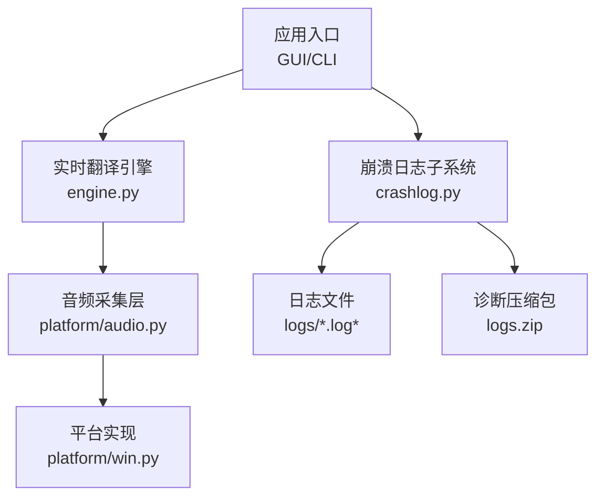
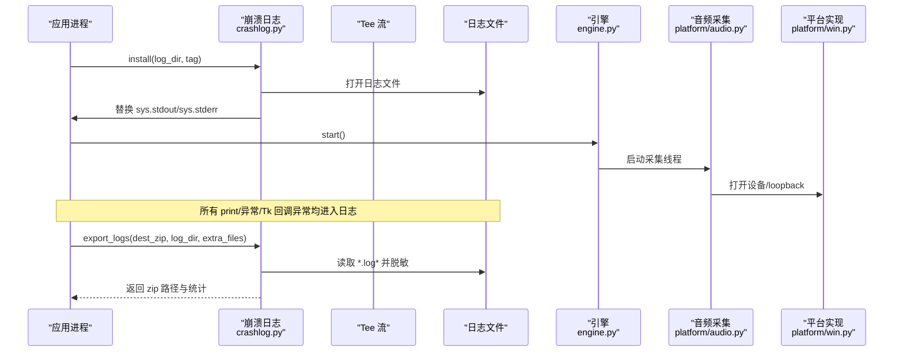
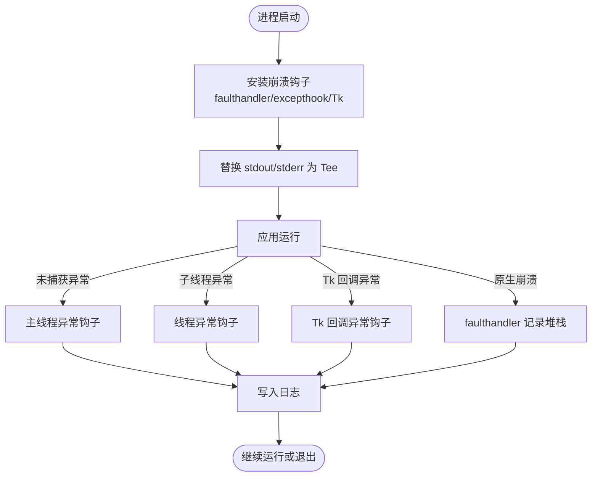
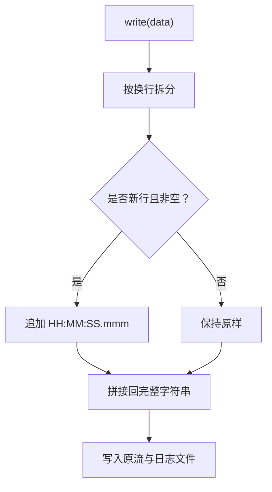
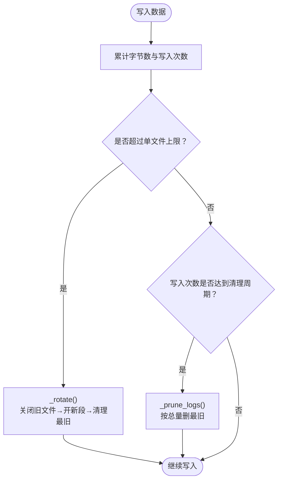
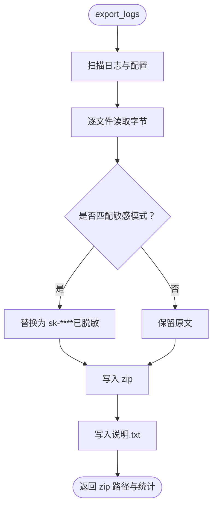
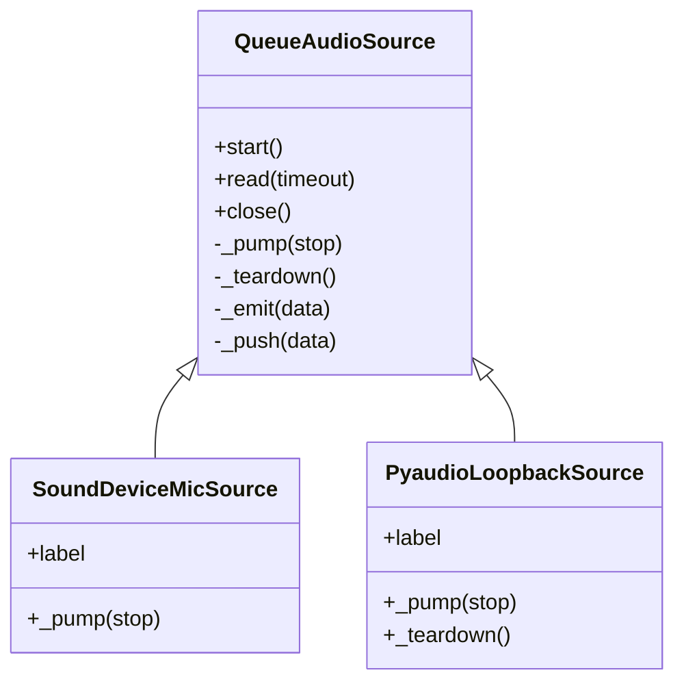
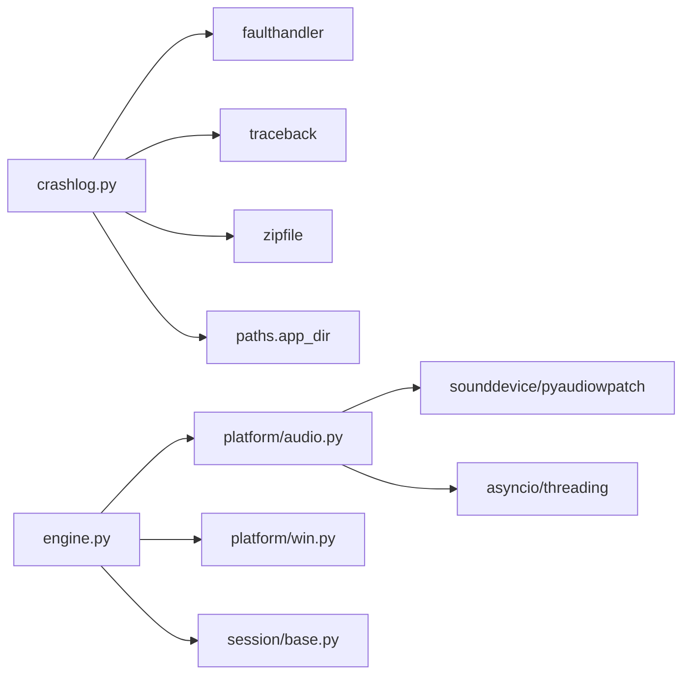

# 崩溃日志与诊断

<cite>
**本文引用的文件**   
- [vlt/crashlog.py](file://vlt/crashlog.py)
- [tests/test_crashlog_stamp.py](file://tests/test_crashlog_stamp.py)
- [tests/test_log_rotation.py](file://tests/test_log_rotation.py)
- [vlt/engine.py](file://vlt/engine.py)
- [vlt/platform/audio.py](file://vlt/platform/audio.py)
- [vlt/platform/win.py](file://vlt/platform/win.py)
</cite>

## 目录
1. [引言](#引言)
2. [项目结构](#项目结构)
3. [核心组件](#核心组件)
4. [架构总览](#架构总览)
5. [详细组件分析](#详细组件分析)
6. [依赖关系分析](#依赖关系分析)
7. [性能考量](#性能考量)
8. [故障排查指南](#故障排查指南)
9. [结论](#结论)

## 引言
本文件面向“崩溃日志与诊断系统”，围绕以下目标展开：
- 崩溃报告收集机制：异常捕获、堆栈跟踪、原生崩溃记录、Tk 回调异常。
- 日志轮转管理：文件大小限制、总量控制、切段策略与存储空间清理。
- 诊断信息导出：打包压缩、脱敏规则、配置与说明文件输出。
- 日志级别与过滤：标准 logging 的使用位置与行为，以及 crashlog 对 stdout/stderr 的接管方式。
- 分析方法论：如何从时间戳、黑匣子统计、闸门/门限日志中定位问题。
- 性能影响评估与优化建议：I/O、线程、事件循环、音频采集路径上的开销与风险。

## 项目结构
与崩溃日志和诊断直接相关的代码主要分布在以下模块：
- `vlt/crashlog.py`：崩溃钩子、stdout/stderr Tee、时间戳、日志滚动、导出 zip、启动信息。
- `tests/test_crashlog_stamp.py`：验证每行行首时间戳的正确性。
- `tests/test_log_rotation.py`：验证总量清理、单文件切段、zip 导出与密钥脱敏。
- `vlt/engine.py`：引擎主流程、输入门限、静音闸门、会话代理、黑匣子统计。
- `vlt/platform/audio.py`：音频采集共享实现（队列 + 后台泵），关闭顺序约束。
- `vlt/platform/win.py`：Windows 平台设备、loopback 采集、日志打印风格说明。

**图示来源**
- [vlt/crashlog.py:256-318](file://vlt/crashlog.py#L256-L318)
- [vlt/engine.py:446-500](file://vlt/engine.py#L446-L500)
- [vlt/platform/audio.py:30-119](file://vlt/platform/audio.py#L30-L119)
- [vlt/platform/win.py:214-294](file://vlt/platform/win.py#L214-L294)

**章节来源**
- [vlt/crashlog.py:1-410](file://vlt/crashlog.py#L1-L410)
- [tests/test_crashlog_stamp.py:1-96](file://tests/test_crashlog_stamp.py#L1-L96)
- [tests/test_log_rotation.py:1-106](file://tests/test_log_rotation.py#L1-L106)
- [vlt/engine.py:1-800](file://vlt/engine.py#L1-L800)
- [vlt/platform/audio.py:1-247](file://vlt/platform/audio.py#L1-L247)
- [vlt/platform/win.py:1-700](file://vlt/platform/win.py#L1-L700)

## 核心组件
- 崩溃钩子与输出重定向：通过安装 excepthook、faulthandler、Tk 回调异常处理器，把标准输出与错误输出同时写入日志文件。
- 时间戳 Tee：为每条非空行首自动添加本地时间戳，保证崩溃后仍可判断“何时断”“间隔多久”。
- 日志滚动与总量清理：单文件超过阈值切段；总量超过阈值删除最旧日志；当前正在写的日志永不删。
- 诊断导出：将 logs 目录下的日志、配置文件、额外文件打包成 zip，并在打包前按正则脱敏敏感字段。
- 引擎黑匣子：在引擎内部维护输入/输出块计数、静音比例、最近文本历史等，用于断线或异常时辅助定位。
- 音频采集与关闭顺序：后台线程泵数据到 asyncio 队列，close 必须遵循“停止位 → join 线程 → teardown”的顺序，避免原生崩溃。

**章节来源**
- [vlt/crashlog.py:40-128](file://vlt/crashlog.py#L40-L128)
- [vlt/crashlog.py:131-253](file://vlt/crashlog.py#L131-L253)
- [vlt/crashlog.py:256-318](file://vlt/crashlog.py#L256-L318)
- [vlt/engine.py:503-527](file://vlt/engine.py#L503-L527)
- [vlt/platform/audio.py:30-119](file://vlt/platform/audio.py#L30-L119)

## 架构总览
崩溃日志与诊断系统的整体交互如下：

**图示来源**
- [vlt/crashlog.py:256-318](file://vlt/crashlog.py#L256-L318)
- [vlt/crashlog.py:70-128](file://vlt/crashlog.py#L70-L128)
- [vlt/engine.py:548-556](file://vlt/engine.py#L548-L556)
- [vlt/platform/audio.py:59-119](file://vlt/platform/audio.py#L59-L119)
- [vlt/platform/win.py:214-294](file://vlt/platform/win.py#L214-L294)

## 详细组件分析

### 崩溃报告收集机制
- 原生崩溃：启用 faulthandler，把所有线程的 Python 堆栈写进当前日志文件；切段后重新绑定到新文件，确保崩溃落盘。
- 未捕获异常：覆盖主线程 excepthook 与 threading.excepthook，打印异常类型、值、回溯，并加标题分隔。
- Tk 回调异常：接管 root.report_callback_exception，避免 Tk 默认“只打印不退出”导致静默带病运行。
- 输出重定向：stdout 与 stderr 都经过 Tee，既保留控制台显示，又写入日志文件。

**图示来源**
- [vlt/crashlog.py:289-318](file://vlt/crashlog.py#L289-L318)
- [vlt/crashlog.py:321-336](file://vlt/crashlog.py#L321-L336)
- [vlt/crashlog.py:289-293](file://vlt/crashlog.py#L289-L293)

**章节来源**
- [vlt/crashlog.py:289-336](file://vlt/crashlog.py#L289-L336)

### 时间戳与可观测性
- 每行行首自动添加 `HH:MM:SS.mmm` 本地时间戳，便于判断“跑多久断的”“两次事件间隔多少”。
- 半行写入不会被戳打断：先累积直到换行，再统一加戳，避免内容被切碎。
- 测试覆盖单行、多行、半行、空行、诊断块形状等场景。

**图示来源**
- [vlt/crashlog.py:153-163](file://vlt/crashlog.py#L153-L163)
- [vlt/crashlog.py:165-202](file://vlt/crashlog.py#L165-L202)
- [tests/test_crashlog_stamp.py:34-85](file://tests/test_crashlog_stamp.py#L34-L85)

**章节来源**
- [vlt/crashlog.py:131-202](file://vlt/crashlog.py#L131-L202)
- [tests/test_crashlog_stamp.py:1-96](file://tests/test_crashlog_stamp.py#L1-L96)

### 日志轮转与存储管理
- 单文件上限：达到 `MAX_LOG_FILE_BYTES` 后关闭旧文件、打开新段，并记录“已切段”。
- 总量上限：达到 `MAX_LOG_TOTAL_BYTES` 后删除最旧的 `.log*` 文件，但当前正在写的日志永远保留。
- 切段策略：优先保留“日志末尾”的关键证据，而不是直接停止写入。
- 定期清理：每次写一定次数后调用 `_prune_logs`，按修改时间排序删除最旧文件。

**图示来源**
- [vlt/crashlog.py:46-67](file://vlt/crashlog.py#L46-L67)
- [vlt/crashlog.py:185-235](file://vlt/crashlog.py#L185-L235)
- [tests/test_log_rotation.py:25-67](file://tests/test_log_rotation.py#L25-L67)

**章节来源**
- [vlt/crashlog.py:40-67](file://vlt/crashlog.py#L40-L67)
- [vlt/crashlog.py:185-235](file://vlt/crashlog.py#L185-L235)
- [tests/test_log_rotation.py:1-106](file://tests/test_log_rotation.py#L1-L106)

### 诊断信息导出与脱敏
- 导出范围：日志目录下的 `.log*` 文件、可选额外文件、`config.yaml`、`config.yaml.broken`。
- 脱敏规则：扫描 `sk-[A-Za-z0-9_\-]{10,}` 模式，替换为打码形式，并记录哪些文件被脱敏。
- 输出产物：zip 包内包含日志、配置、说明文件；说明中包含导出时间、目录、文件数、原始字节数、脱敏文件列表。
- 安全要求：测试明确断言 zip 中不能出现完整密钥，且正常日志内容不被破坏。

**图示来源**
- [vlt/crashlog.py:70-128](file://vlt/crashlog.py#L70-L128)
- [tests/test_log_rotation.py:70-97](file://tests/test_log_rotation.py#L70-L97)

**章节来源**
- [vlt/crashlog.py:70-128](file://vlt/crashlog.py#L70-L128)
- [tests/test_log_rotation.py:70-97](file://tests/test_log_rotation.py#L70-L97)

### 引擎黑匣子与诊断指标
引擎内部维护一系列黑匣子指标，用于断线或异常时辅助定位：
- 输入侧：发送的 PCM 块数、静音块数、最近有声音的时间点。
- 输出侧：收到的 TTS 音频块数、译文本条数、最近文本历史。
- 会话状态：会话开始时间、连接时间戳列表。
- 闸门统计：输入门限拦截块数、开闸次数、补发 preroll 次数；静音闸门拦截块数、补发次数。

这些指标配合日志中的 `[engine]`、`[gate]`、`[session]` 等前缀，能帮助判断：
- 是否真的在说话。
- 是否被静音闸门或输入门限拦截。
- 是否发生发送失败、服务端断线、重复输出。

**章节来源**
- [vlt/engine.py:503-527](file://vlt/engine.py#L503-L527)
- [vlt/engine.py:356-443](file://vlt/engine.py#L356-L443)
- [vlt/engine.py:204-347](file://vlt/engine.py#L204-L347)

### 音频采集与崩溃防护
- 采集模型：后台线程 `_pump` 不断从底层设备读 PCM，通过 `_emit` 放入 asyncio 队列；消费端 `read()` 异步取块。
- 关闭顺序：`close()` 必须先置 stop 事件，join 后台线程，再 teardown 底层资源；否则 Windows 上可能出现访问违规。
- 平台差异：Windows loopback 使用非阻塞轮询，避免阻塞读导致收尾卡死；麦克风走 sounddevice。
- 日志风格：平台层大量使用 `print(..., flush=True)`，因为 crashlog 接管了 stdout/stderr，这样能稳定进入日志文件。

**图示来源**
- [vlt/platform/audio.py:30-119](file://vlt/platform/audio.py#L30-L119)
- [vlt/platform/audio.py:121-180](file://vlt/platform/audio.py#L121-L180)
- [vlt/platform/win.py:214-294](file://vlt/platform/win.py#L214-L294)

**章节来源**
- [vlt/platform/audio.py:1-247](file://vlt/platform/audio.py#L1-L247)
- [vlt/platform/win.py:214-294](file://vlt/platform/win.py#L214-L294)

## 依赖关系分析
- crashlog 依赖：
  - faulthandler：记录原生崩溃堆栈。
  - traceback：格式化未捕获异常。
  - zipfile：打包诊断日志。
  - paths.app_dir：获取应用目录以定位 logs 与 config.yaml。
- engine 依赖：
  - platform.audio：统一音频采集接口。
  - platform.win：Windows 设备枚举、loopback 采集。
  - session/base：会话创建、音频发送、语音提示。
- platform.audio 依赖：
  - sounddevice/pyaudiowpatch：底层音频 I/O。
  - asyncio/threading：异步队列与后台线程。

**图示来源**
- [vlt/crashlog.py:26-32](file://vlt/crashlog.py#L26-L32)
- [vlt/crashlog.py:80-84](file://vlt/crashlog.py#L80-L84)
- [vlt/engine.py:21-38](file://vlt/engine.py#L21-L38)
- [vlt/platform/audio.py:22-27](file://vlt/platform/audio.py#L22-L27)
- [vlt/platform/win.py:12-19](file://vlt/platform/win.py#L12-L19)

**章节来源**
- [vlt/crashlog.py:26-32](file://vlt/crashlog.py#L26-L32)
- [vlt/engine.py:21-38](file://vlt/engine.py#L21-L38)
- [vlt/platform/audio.py:22-27](file://vlt/platform/audio.py#L22-L27)
- [vlt/platform/win.py:12-19](file://vlt/platform/win.py#L12-L19)

## 性能考量
- I/O 开销：
  - Tee 每次 write 都会尝试加戳、写入多个流、累计字节数并可能触发滚动清理。
  - 单文件滚动会关闭旧文件、打开新文件、再次启用 faulthandler，并调用 `_prune_logs` 遍历日志目录。
  - 建议：在高吞吐场景下关注日志量，必要时调大 `MAX_LOG_FILE_BYTES`，减少切段频率。
- 线程与事件循环：
  - 音频采集使用后台线程 + asyncio 队列，close 顺序严格，避免阻塞或竞争。
  - 引擎主逻辑在独立线程的事件循环中运行，stop 走 request_stop + wait_stopped，避免界面卡顿。
- 日志级别与过滤：
  - 引擎与平台层多处使用标准 logging.getLogger(__name__)，但 crashlog 接管的是 stdout/stderr，因此很多关键诊断仍通过 print 输出。
  - 若需要更细粒度过滤，应在 logging 配置处设置 level，并注意部分关键日志仍走 print。
- 内存与磁盘：
  - 日志总量上限防止磁盘爆满；当前日志永不删，保证崩溃现场完整。
  - 导出 zip 前逐文件读取并解码，注意大日志包时的内存峰值。

**章节来源**
- [vlt/crashlog.py:185-235](file://vlt/crashlog.py#L185-L235)
- [vlt/platform/audio.py:100-119](file://vlt/platform/audio.py#L100-L119)
- [vlt/engine.py:548-592](file://vlt/engine.py#L548-L592)
- [vlt/platform/win.py:214-294](file://vlt/platform/win.py#L214-L294)

## 故障排查指南
推荐按以下步骤分析崩溃与诊断日志：

1. 确认日志时间戳有效：
   - 检查每行是否以 `HH:MM:SS.mmm ` 开头。
   - 若缺失时间戳，优先怀疑 Tee 加戳失败或日志文件句柄异常。

2. 查看启动信息：
   - 查找 `[startup]` 段落，确认版本、Python 版本、平台、程序路径、git HEAD、API 密钥长度。
   - 若程序路径含非 ASCII 字符，注意手腕屏初始化可能失败。

3. 定位崩溃点：
   - 搜索 `!!! 未捕获异常`、`!!! Tk 回调异常`、faulthandler 堆栈。
   - 结合时间戳判断最后一次成功操作与崩溃之间的间隔。

4. 分析音频与网络：
   - 查看 `[engine]`、`[gate]`、`[session]` 日志，判断是否被静音闸门或输入门限拦截。
   - 关注发送失败次数、静音块比例、最近文本历史。

5. 检查日志轮转：
   - 确认是否出现“日志已切段”提示。
   - 检查 logs 目录下是否有多个分段文件，总量是否接近上限。

6. 导出诊断包：
   - 使用 `export_logs` 生成 zip，确认包含日志、配置、说明文件。
   - 检查说明文件中脱敏文件列表，确认密钥已被替换。

7. 复现与修复：
   - 根据时间戳与黑匣子指标缩小问题范围。
   - 调整闸门/门限参数、设备选择、路径命名，避免已知陷阱。

**章节来源**
- [vlt/crashlog.py:339-385](file://vlt/crashlog.py#L339-L385)
- [vlt/crashlog.py:289-336](file://vlt/crashlog.py#L289-L336)
- [vlt/engine.py:356-443](file://vlt/engine.py#L356-L443)
- [vlt/engine.py:204-347](file://vlt/engine.py#L204-L347)
- [vlt/crashlog.py:70-128](file://vlt/crashlog.py#L70-L128)

## 结论
该项目的崩溃日志与诊断系统以 crashlog 为核心，通过异常钩子、faulthandler、Tk 回调接管、stdout/stderr Tee、时间戳、日志滚动与 zip 导出，形成一套面向真实用户环境的“黑匣子”方案。引擎层提供丰富的黑匣子指标与闸门/门限日志，平台层保证音频采集的稳定性和关闭顺序。整体设计强调“崩溃也要留证据”“日志末尾才是关键”“导出要脱敏”，并通过测试覆盖时间戳、滚动、导出等关键路径。

在实际使用中，建议：
- 始终启用 crashlog.install 与 install_tk。
- 定期清理 logs 目录或使用 export_logs 归档。
- 结合时间戳、引擎黑匣子、闸门日志进行问题定位。
- 对高吞吐场景评估日志 I/O 开销，必要时调整阈值。
- 对 Windows 环境特别注意程序路径非 ASCII、设备采样率、loopback 关闭顺序等问题。