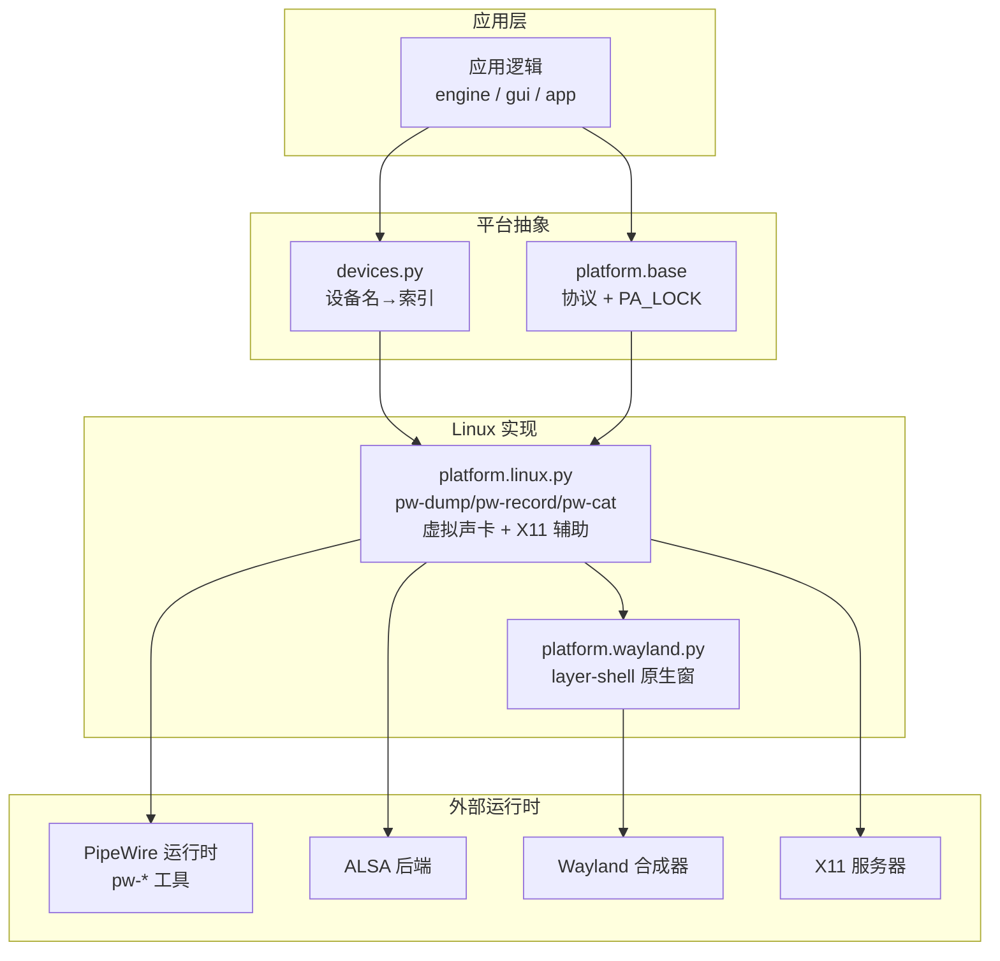
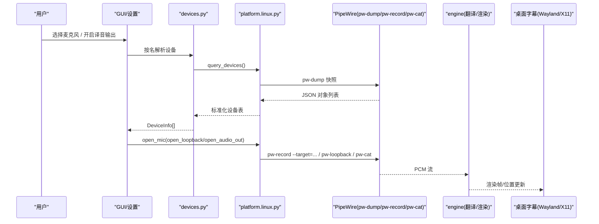
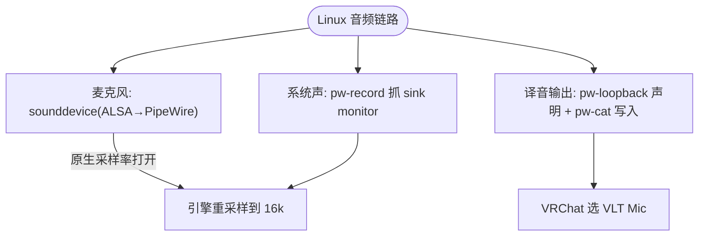
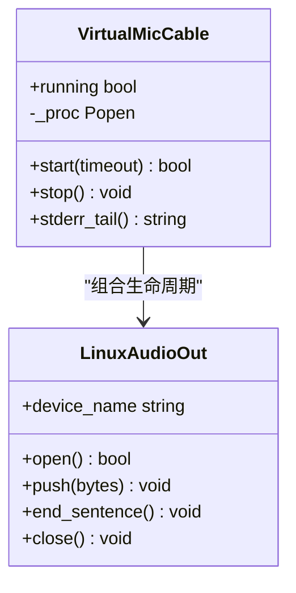
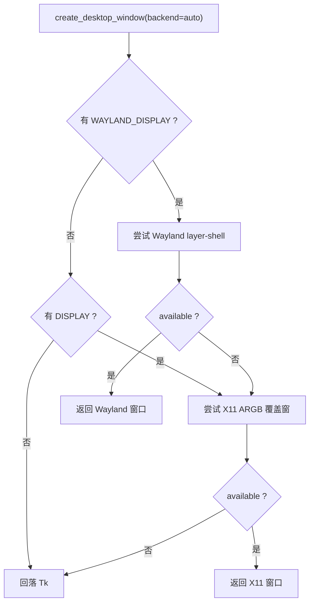
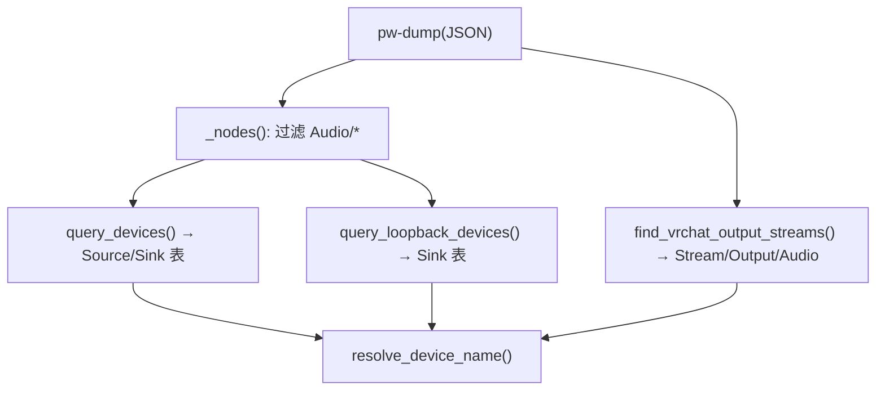
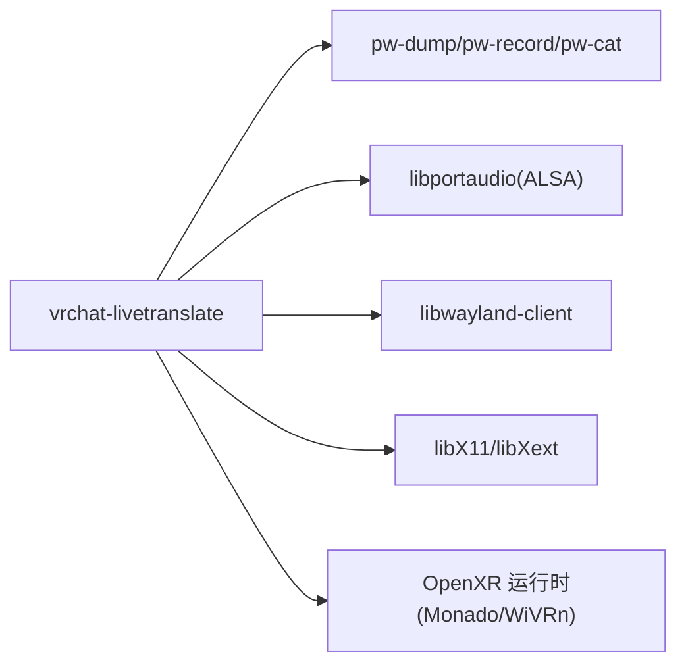

# Linux 平台实现

<cite>
**本文引用的文件**   
- [README.md](file://README.md)
- [GUIDE.linux.md](file://docs/GUIDE.linux.md)
- [vlt/platform/base.py](file://vlt/platform/base.py)
- [vlt/platform/linux.py](file://vlt/platform/linux.py)
- [vlt/platform/wayland.py](file://vlt/platform/wayland.py)
- [vlt/devices.py](file://vlt/devices.py)
- [setup.sh](file://setup.sh)
- [requirements.txt](file://requirements.txt)
- [config.example.yaml](file://config.example.yaml)
- [scripts/check_platform_purity.py](file://scripts/check_platform_purity.py)
- [tests/test_mic_rate.py](file://tests/test_mic_rate.py)
- [tests/test_virtualmic.py](file://tests/test_virtualmic.py)
</cite>

## 目录
1. [引言](#引言)
2. [项目结构](#项目结构)
3. [核心组件](#核心组件)
4. [架构总览](#架构总览)
5. [详细组件分析](#详细组件分析)
6. [依赖关系分析](#依赖关系分析)
7. [性能与优化建议](#性能与优化建议)
8. [故障排除指南](#故障排除指南)
9. [结论](#结论)
10. [附录：发行版与权限要点](#附录发行版与权限要点)

## 引言
本文件聚焦 Linux 平台的实现，目标是把 VRChat 实时同传在 Linux 上的音频、桌面叠加窗、虚拟声卡、运行时声明机制以及 Wayland/X11 差异化处理讲清楚。重点包括：
- ALSA → PipeWire → PulseAudio 的兼容边界与取舍
- 使用 `pw-record` 采集系统声音与 sink monitor 语义
- PipeWire 运行时节点声明（虚拟麦克风）与 `pw-cat` 写入集成
- Wayland 原生 layer-shell 与 X11 ARGB 覆盖窗两条原生路径，以及 Tk 回落
- 安装、依赖、权限、服务与常见发行版的兼容性
- 性能优化与最佳实践

## 项目结构
Linux 相关能力集中在 `vlt/platform/` 下：
- `base.py`：平台抽象协议（设备形状、采集/播放接口、窗口契约）
- `linux.py`：Linux 专属实现（PipeWire 工具、虚拟声卡、X11 辅助、桌面窗口门面）
- `wayland.py`：Wayland 原生 overlay 窗口（layer-shell、指针拖动、多屏输出）
- `devices.py`：跨平台设备枚举与名称解析（不直接依赖底层库）



**图表来源**
- [vlt/platform/base.py:1-41](file://vlt/platform/base.py#L1-L41)
- [vlt/platform/linux.py:1-33](file://vlt/platform/linux.py#L1-L33)
- [vlt/platform/wayland.py:1-57](file://vlt/platform/wayland.py#L1-L57)
- [vlt/devices.py:1-22](file://vlt/devices.py#L1-L22)

**章节来源**
- [README.md:38-49](file://README.md#L38-L49)
- [GUIDE.linux.md:27-50](file://docs/GUIDE.linux.md#L27-L50)

## 核心组件
- 平台抽象协议：统一 AudioSource/AudioSink/DeviceBackend/CaptureBackend/DesktopWindow 等接口，屏蔽 Windows/Linux 差异。
- Linux 平台实现：通过 `pw-dump` 构建干净的设备表；通过 `pw-record` 抓 sink monitor；通过 `pw-loopback` 声明虚拟声卡；通过 `pw-cat` 写译音；提供 X11 辅助函数和桌面窗口门面。
- Wayland 原生窗口：ctypes 直调 libwayland-client，实现 layer-shell overlay、鼠标穿透、相对指针/本地坐标双源拖动、多屏定位。
- 设备枚举与名称解析：只负责把平台原始 dict 转成 DeviceInfo，并做名称匹配与回退链。

**章节来源**
- [vlt/platform/base.py:42-182](file://vlt/platform/base.py#L42-L182)
- [vlt/platform/linux.py:55-336](file://vlt/platform/linux.py#L55-L336)
- [vlt/platform/wayland.py:77-218](file://vlt/platform/wayland.py#L77-L218)
- [vlt/devices.py:30-161](file://vlt/devices.py#L30-L161)

## 架构总览
下图展示从“用户选择设备”到“音频流进入翻译引擎”，再到“译音写出虚拟麦”的端到端流程，以及桌面字幕在 Wayland/X11 的路径选择。



**图表来源**
- [vlt/devices.py:39-102](file://vlt/devices.py#L39-L102)
- [vlt/platform/linux.py:67-96](file://vlt/platform/linux.py#L67-L96)
- [vlt/platform/linux.py:750-883](file://vlt/platform/linux.py#L750-L883)
- [vlt/platform/linux.py:577-728](file://vlt/platform/linux.py#L577-L728)

## 详细组件分析

### ALSA → PipeWire → PulseAudio 兼容性与取舍
- 本项目在 Linux 上**优先使用 PipeWire 原生工具**（`pw-dump`/`pw-record`/`pw-cat`），而不是 PulseAudio 兼容层的 `pactl`/`parec`/`pacat`。原因是某些环境里 PulseAudio 套接字不可达，但 PipeWire 原生工具可用。
- 麦克风采集仍走 sounddevice（底层为 ALSA → PipeWire）。Linux 上 PortAudio 的 ALSA 后端**不做采样率转换**，因此必须按设备原生采样率打开，再在引擎侧重采样到 16kHz。
- 系统声音采集使用 `pw-record --target=<sink>`，语义等价于 Windows 的 WASAPI loopback，即抓取 sink 的 monitor（输出内容的副本）。



**图表来源**
- [vlt/platform/linux.py:7-23](file://vlt/platform/linux.py#L7-L23)
- [vlt/platform/linux.py:833-869](file://vlt/platform/linux.py#L833-L869)
- [vlt/platform/linux.py:750-783](file://vlt/platform/linux.py#L750-L783)
- [vlt/platform/linux.py:478-518](file://vlt/platform/linux.py#L478-L518)

**章节来源**
- [vlt/platform/linux.py:7-23](file://vlt/platform/linux.py#L7-L23)
- [vlt/platform/linux.py:833-869](file://vlt/platform/linux.py#L833-L869)
- [tests/test_mic_rate.py:1-13](file://tests/test_mic_rate.py#L1-L13)

### 使用 pw-record 进行系统声捕获与 sink monitor
- `PwRecordSource` 启动 `pw-record` 子进程，以 `--raw` 输出 s16le PCM，避免容器格式魔数导致的静默错误。
- `--target` 支持 sink 名或序列号；对 VRChat 的多路输出，程序会逐路各开一条 `pw-record` 并混音，避免丢声。
- 目标节点消失后 `pw-record` 不会自动退出，可能回落到默认源，因此需要上层检测与重建策略。

```mermaid
sequenceDiagram
participant Loop as "loopback 采集"
participant PR as "pw-record 子进程"
participant PW as "PipeWire 图"
participant Eng as "引擎"
Loop->>PR : 启动 argv(--target, --format=s16, --rate=16000, --channels=1, --raw, -)
PR->>PW : 连接 sink monitor
PW-->>PR : 裸 PCM 流
PR-->>Loop : stdout.read(block)
Loop->>Eng : 推入队列/重采样
```

**图表来源**
- [vlt/platform/linux.py:750-800](file://vlt/platform/linux.py#L750-L800)
- [vlt/platform/linux.py:229-289](file://vlt/platform/linux.py#L229-L289)

**章节来源**
- [vlt/platform/linux.py:741-800](file://vlt/platform/linux.py#L741-L800)
- [vlt/platform/linux.py:229-289](file://vlt/platform/linux.py#L229-L289)

### PipeWire 运行时声明机制与虚拟声卡
- 程序运行时会拉起 `pw-loopback`，声明一对节点：
  - `vlt_mic_sink`：可写入端（类 `Audio/Sink/Internal`，不参与默认输出选举）
  - `vlt_mic_source`：虚拟麦克风（类 `Audio/Source`，供 VRChat 选择）
- 写入端通过 `pw-cat --playback --target=<sink_name>` 显式指定目标，确保音频只进自己的节点，不会落到用户默认输出。
- 启动后会校验 sink 的 media.class 不在默认输出候选类中，防止误抢默认输出。



**图表来源**
- [vlt/platform/linux.py:478-518](file://vlt/platform/linux.py#L478-L518)
- [vlt/platform/linux.py:577-728](file://vlt/platform/linux.py#L577-L728)

**章节来源**
- [vlt/platform/linux.py:445-551](file://vlt/platform/linux.py#L445-L551)
- [vlt/platform/linux.py:577-728](file://vlt/platform/linux.py#L577-L728)

### Wayland 与 X11 桌面环境的差异化处理
- Wayland 原生层：
  - 使用 layer-shell overlay，获得置顶、精确锚点定位、协议级鼠标穿透。
  - 通过 ctypes 手写 wayland 协议绑定，避免引入额外依赖。
  - 拖动采用“相对指针 + 本地坐标”双源：sway/wlroots 系用 relative-pointer；niri 不发相对位移事件时改用本地坐标差。
  - 多屏定位读 xdg-output 的逻辑位置，而非 wl_output.geometry（后者在 wlroots 系恒为 0）。
- X11 原生层：
  - 使用 32 位 ARGB 覆盖窗，配合预乘 alpha 出图，实现逐像素透明。
  - 通过 X Shape 输入区置空实现鼠标穿透；通过 XMoveWindow 精确定位。
  - 若没有合适的 visual 或合成器不支持，则自动降级到 Tk 路径。
- 门面选择顺序：
  - `auto`：有 `WAYLAND_DISPLAY` → 尝试 Wayland；否则有 `DISPLAY` → 尝试 X11。
  - 任一失败均回落 Tk，并在日志中打印具体原因。



**图表来源**
- [vlt/platform/linux.py:1421-1471](file://vlt/platform/linux.py#L1421-L1471)
- [vlt/platform/wayland.py:1-57](file://vlt/platform/wayland.py#L1-L57)

**章节来源**
- [vlt/platform/linux.py:899-923](file://vlt/platform/linux.py#L899-L923)
- [vlt/platform/linux.py:1421-1471](file://vlt/platform/linux.py#L1421-L1471)
- [vlt/platform/wayland.py:1-57](file://vlt/platform/wayland.py#L1-L57)

### 设备枚举与名称解析（Linux 视角）
- `query_devices()` 从 `pw-dump` 构建设备表，仅取 `Audio/Source` 与 `Audio/Sink`，并按 `node.name` 排序保证稳定。
- `query_loopback_devices()` 列出所有 `Audio/Sink`，作为“系统输出”候选（Windows 对应 WASAPI loopback）。
- `find_vrchat_output_streams()` 专门查找 VRChat 的 `Stream/Output/Audio` 节点，按 serial 精确连接，避免同名 node.name 无法区分的问题。
- `resolve_device_name()` 提供全名/大小写/子串三级匹配，配置只存纯名字符串，不存易变的 index。



**图表来源**
- [vlt/platform/linux.py:105-181](file://vlt/platform/linux.py#L105-L181)
- [vlt/platform/linux.py:229-289](file://vlt/platform/linux.py#L229-L289)
- [vlt/devices.py:105-153](file://vlt/devices.py#L105-L153)

**章节来源**
- [vlt/platform/linux.py:152-211](file://vlt/platform/linux.py#L152-L211)
- [vlt/platform/linux.py:229-289](file://vlt/platform/linux.py#L229-L289)
- [vlt/devices.py:39-102](file://vlt/devices.py#L39-L102)

## 依赖关系分析
- 运行时依赖：
  - PipeWire 原生工具：`pw-dump`、`pw-record`、`pw-cat`
  - ALSA/portaudio（麦克风）
  - Wayland/X11 基础库（overlay 与窗口管理）
  - OpenXR 运行时（手腕屏）
- 构建期隔离：
  - Windows 产物剔除 `vlt.platform.linux`，Linux 产物剔除 `vlt.platform.win`
  - 二进制字节码检查脚本禁止 Windows 包出现 pipewire 字样



**图表来源**
- [setup.sh:62-64](file://setup.sh#L62-L64)
- [requirements.txt:15-16](file://requirements.txt#L15-L16)
- [scripts/check_platform_purity.py:68-78](file://scripts/check_platform_purity.py#L68-L78)

**章节来源**
- [setup.sh:62-64](file://setup.sh#L62-L64)
- [requirements.txt:15-16](file://requirements.txt#L15-L16)
- [scripts/check_platform_purity.py:68-78](file://scripts/check_platform_purity.py#L68-L78)

## 性能与优化建议
- 设备扫描缓存：`pw-dump` 结果带 TTL 缓存，避免 GUI 多次扫描造成重复开销。
- 采集块大小：`pw-record` 以约 100ms 为一块读取，降低 Python 侧缓冲压力。
- 采样率处理：Linux 麦克风按设备原生采样率打开，引擎侧统一重采样到 16kHz，减少 ALSA 后端重采样缺失带来的问题。
- 多路混音：VRChat 多路输出逐路采集并相加，避免单路漏声。
- 虚拟声卡安全：sink 使用 `Audio/Sink/Internal`，不参与默认输出选举，避免误改用户系统声音。
- 字体探测：CJK/泰文字体分别探测，避免缺字形导致豆腐块。

[本节为通用指导，不直接分析具体文件]

## 故障排除指南
- 手腕屏：
  - 无活跃 OpenXR 运行时：启用 Monado 或 WiVRn，并确保头显已连接。
  - GL 上下文失败：Wayland 确认 `WAYLAND_DISPLAY`；X11 确认 `DISPLAY` 且 GLX 可用。
- 音频：
  - 一直等待 VRChat 音频输出：先启动 VRChat；日志出现检测到 VRChat 音频即已接入。
  - 采不到别人说话：用 `pw-dump` 确认 VRChat 存在 `Stream/Output/Audio` 节点。
  - `pactl: Connection refused`：不影响我们，全程用 `pw-*` 原生工具；用 `pw-dump` 验证 PipeWire。
  - 对方听不到译音：勾选译音输出，并在 VRChat 中选择 `VLT Mic`。
- 桌面字幕：
  - 找不到字幕窗：看日志是否贴到 VRChat 或退化到绝对定位；解锁拖动拖回。
  - 圆角外黑边/底板不透明：走了 Tk 回落；确认合成器支持 layer-shell。
  - 泰文方块：安装含泰文字形的字体（AppImage 不自带字体）。

**章节来源**
- [GUIDE.linux.md:284-322](file://docs/GUIDE.linux.md#L284-L322)

## 结论
Linux 平台实现以 PipeWire 为核心，结合 ALSA 麦克风、Wayland/X11 原生窗口与 OpenXR 手腕屏，形成一套自洽的音频与 UI 栈。通过 `pw-dump`/`pw-record`/`pw-cat`/`pw-loopback` 的组合，既保证了设备枚举与采集的稳定性，又避免了 PulseAudio 兼容层的不确定性。Wayland 原生 layer-shell 与 X11 ARGB 覆盖窗两条原生路径，配合 Tk 回落，使桌面字幕在不同合成器下都能工作。虚拟声卡的运行时声明机制在不干扰用户默认输出的前提下，提供了可靠的译音输出通道。

[本节为总结性内容，不直接分析具体文件]

## 附录：发行版与权限要点
- 前置条件：
  - Wayland 或 X11 会话均可；手腕屏 Wayland 走 EGL_MNDX，X11 走 GLX。
  - PipeWire 原生工具（`pw-dump`/`pw-record`/`pw-cat`）。
  - OpenXR 运行时（Monado 或 WiVRn）+ 头显已连接。
  - Python 3.11、libportaudio、中日韩字体。
- 安装方式：
  - AppImage：自带 Python 与依赖，仍需宿主机提供 PipeWire、portaudio、X11 基础库与字体。
  - 源码安装：`./setup.sh` 会创建虚拟环境、安装依赖、体检系统依赖。
- 配置差异：
  - Linux 上 `capture.loopback_device` 与 `output.audio.device_name` 被忽略；译音输出固定写到自建虚拟麦。
  - 桌面字幕后端 `desktop_overlay.backend` 可强制 `auto/native/tk/wayland/x11`。
- 权限与服务：
  - 不修改用户配置文件，不重启 PipeWire/WirePlumber。
  - 虚拟声卡仅在程序运行期间存在；退出自动销毁。
  - 测试进程拒绝真实声明虚拟声卡或建原生窗，避免影响用户会话。

**章节来源**
- [GUIDE.linux.md:27-50](file://docs/GUIDE.linux.md#L27-L50)
- [GUIDE.linux.md:54-96](file://docs/GUIDE.linux.md#L54-L96)
- [GUIDE.linux.md:256-279](file://docs/GUIDE.linux.md#L256-L279)
- [config.example.yaml:76-76](file://config.example.yaml#L76-L76)
- [config.example.yaml:291-291](file://config.example.yaml#L291-L291)