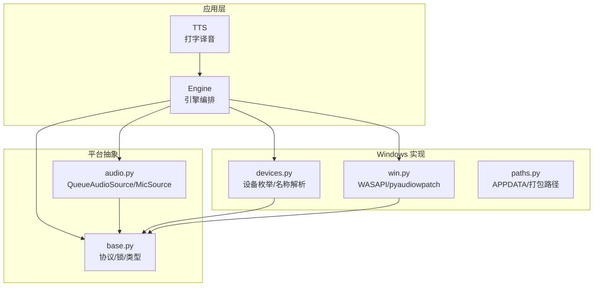
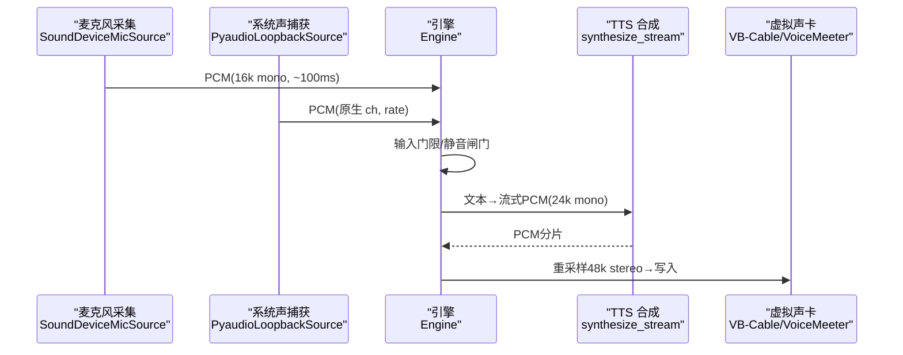
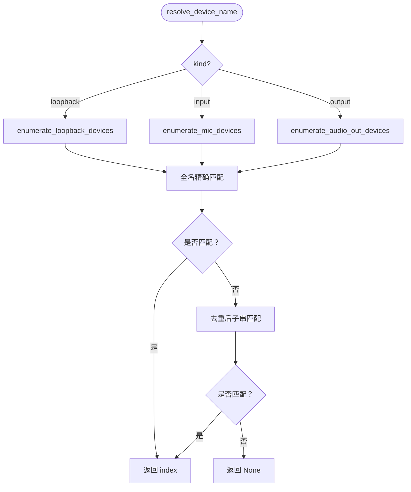
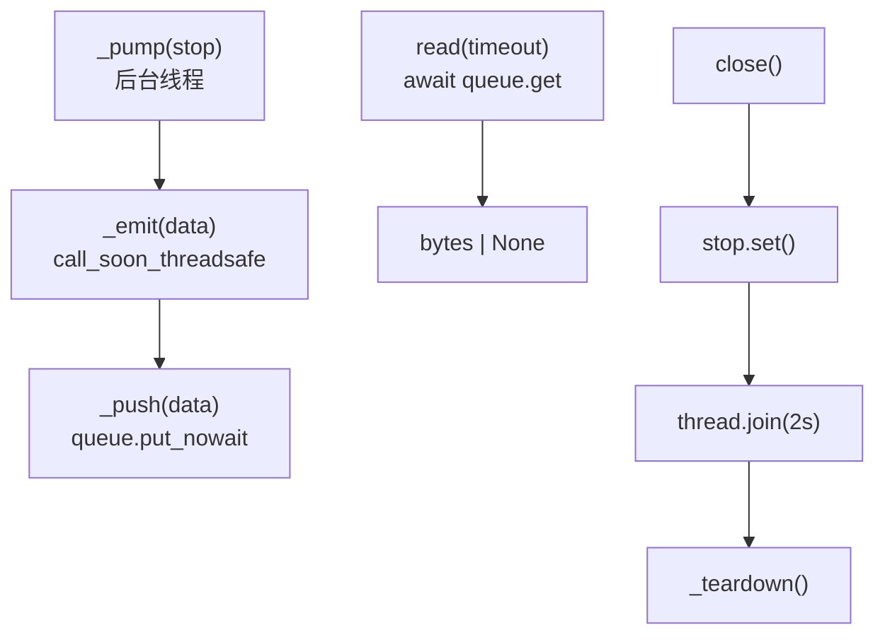
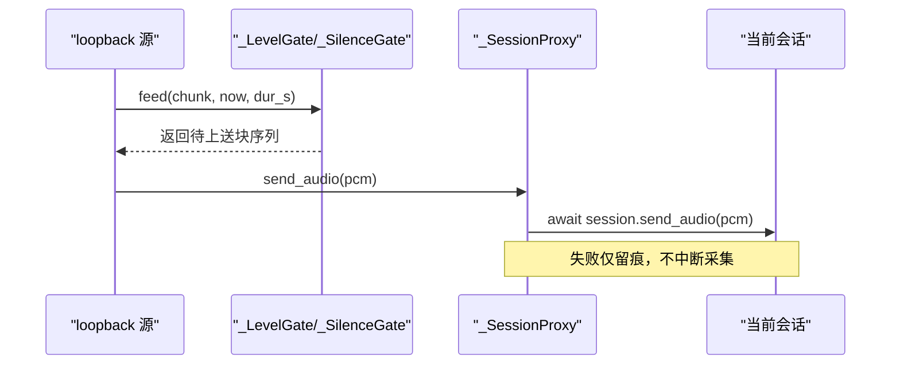
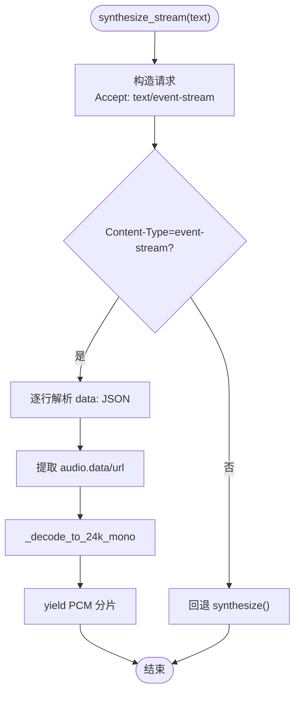
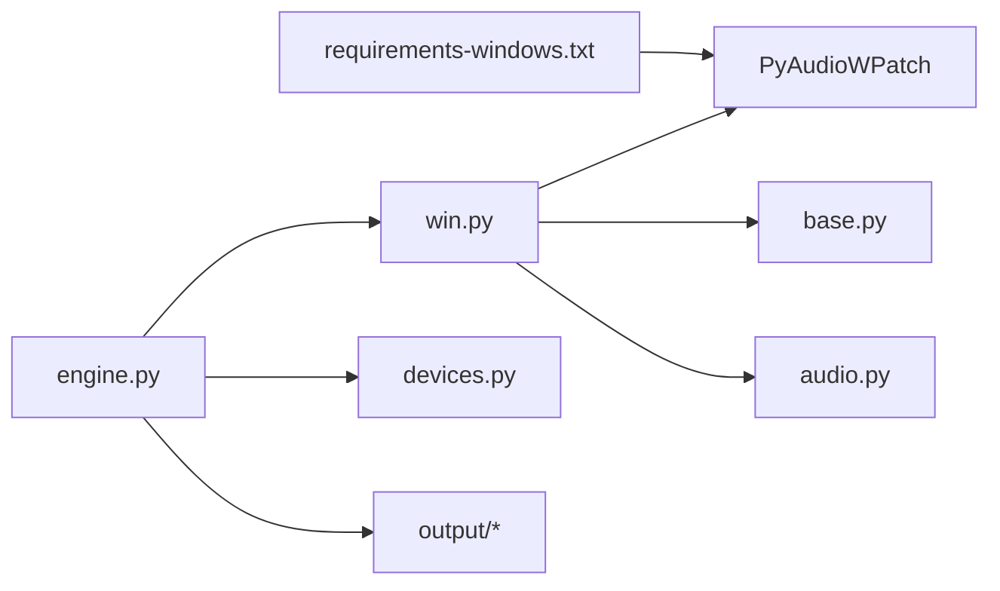

# Windows 平台实现

<cite>
**本文引用的文件**   
- [vlt/platform/win.py](file://vlt/platform/win.py)
- [vlt/platform/base.py](file://vlt/platform/base.py)
- [vlt/platform/audio.py](file://vlt/platform/audio.py)
- [vlt/devices.py](file://vlt/devices.py)
- [vlt/engine.py](file://vlt/engine.py)
- [vlt/tts.py](file://vlt/tts.py)
- [vlt/paths.py](file://vlt/paths.py)
- [requirements-windows.txt](file://requirements-windows.txt)
</cite>

## 目录
1. [引言](#引言)
2. [项目结构](#项目结构)
3. [核心组件](#核心组件)
4. [架构总览](#架构总览)
5. [详细组件分析](#详细组件分析)
6. [依赖关系分析](#依赖关系分析)
7. [性能考量](#性能考量)
8. [故障排查指南](#故障排查指南)
9. [结论](#结论)
10. [附录](#附录)

## 引言
本文面向 Windows 平台的音频子系统，系统性解释基于 WASAPI 与 PortAudio 的采集、系统声捕获（loopback）与虚拟声卡输出方案；说明 pyaudiowpatch 的使用方式、PortAudio 回调到异步队列的适配、Windows 路径与进程集成细节，以及虚拟声卡（VB-Cable/VoiceMeeter）的配置与检测。文档同时覆盖 COM 单元管理、线程绑定和资源清理等 Windows 特有逻辑，并给出调试技巧与常见问题解决方案。

## 项目结构
Windows 平台实现集中在 `vlt/platform/win.py`，并通过平台抽象层 `vlt/platform/base.py` 暴露统一协议；通用音频采集底座在 `vlt/platform/audio.py`；设备枚举与名称解析在 `vlt/devices.py`；引擎编排与输入门限在 `vlt/engine.py`；打字译音合成在 `vlt/tts.py`；运行期路径在 `vlt/paths.py`；Windows 独占依赖在 `requirements-windows.txt`。



**图表来源**
- [vlt/platform/base.py:48-59](file://vlt/platform/base.py#L48-L59)
- [vlt/platform/audio.py:30-119](file://vlt/platform/audio.py#L30-L119)
- [vlt/platform/win.py:23-128](file://vlt/platform/win.py#L23-L128)
- [vlt/devices.py:39-102](file://vlt/devices.py#L39-L102)
- [vlt/engine.py:446-599](file://vlt/engine.py#L446-L599)
- [vlt/tts.py:142-198](file://vlt/tts.py#L142-L198)
- [vlt/paths.py:71-106](file://vlt/paths.py#L71-L106)

**章节来源**
- [vlt/platform/win.py:1-10](file://vlt/platform/win.py#L1-L10)
- [vlt/platform/base.py:1-41](file://vlt/platform/base.py#L1-L41)
- [vlt/platform/audio.py:1-19](file://vlt/platform/audio.py#L1-L19)
- [vlt/devices.py:1-22](file://vlt/devices.py#L1-L22)
- [vlt/engine.py:1-39](file://vlt/engine.py#L1-L39)
- [vlt/tts.py:1-20](file://vlt/tts.py#L1-L20)
- [vlt/paths.py:1-17](file://vlt/paths.py#L1-L17)

## 核心组件
- 平台抽象层：定义 `PA_LOCK`、`LoopbackTarget`、`AudioSource`/`AudioSink` 协议，确保 Windows/Linux 共享代码无感知差异。
- Windows 平台实现：提供 sounddevice 设备表收敛（仅 WASAPI）、pyaudiowpatch loopback 枚举、默认输出设备索引、麦克风与 loopback 打开函数。
- 通用音频采集底座：将 PortAudio 回调或子进程 stdout 统一为异步队列，供引擎以协程拉取 PCM。
- 设备枚举与名称解析：把平台原始 dict 转为 `DeviceInfo`，按全名/大小写/子串匹配解析出索引。
- 引擎：组装采集、翻译、TTS、虚拟声卡输出，并处理输入门限、静音闸门、会话代理与停止流程。
- 打字译音：调用 Qwen TTS 接口，支持流式 SSE 与非流式回退，统一输出 24kHz 单声道 s16le PCM。
- 路径模块：区分源码运行与 PyInstaller 打包，定位可写 APPDATA 目录与只读资源目录。

**章节来源**
- [vlt/platform/base.py:48-134](file://vlt/platform/base.py#L48-L134)
- [vlt/platform/win.py:23-128](file://vlt/platform/win.py#L23-L128)
- [vlt/platform/audio.py:30-180](file://vlt/platform/audio.py#L30-L180)
- [vlt/devices.py:30-161](file://vlt/devices.py#L30-L161)
- [vlt/engine.py:446-599](file://vlt/engine.py#L446-L599)
- [vlt/tts.py:142-331](file://vlt/tts.py#L142-L331)
- [vlt/paths.py:71-106](file://vlt/paths.py#L71-L106)

## 架构总览
Windows 端音频数据流分为三条腿：
- 麦克风采集（输入）：sounddevice → PortAudio/WASAPI → QueueAudioSource → 引擎。
- 系统声捕获（loopback）：pyaudiowpatch WASAPI loopback → PyaudioLoopbackSource → 引擎。
- 译音输出（输出）：TTS 合成 → 重采样至 48kHz 立体声 → 写入虚拟声卡（VB-Cable/VoiceMeeter）。



**图表来源**
- [vlt/platform/audio.py:121-180](file://vlt/platform/audio.py#L121-L180)
- [vlt/platform/win.py:214-294](file://vlt/platform/win.py#L214-L294)
- [vlt/engine.py:124-167](file://vlt/engine.py#L124-L167)
- [vlt/tts.py:201-331](file://vlt/tts.py#L201-L331)

## 详细组件分析

### 设备枚举与名称解析（devices.py）
- 三类设备：麦克风（input）、VRChat 音频（loopback）、译音输出（output）。
- 平台返回原始 dict，本模块负责转成 `DeviceInfo`、名称解析与回退链。
- 名称解析顺序：全名精确匹配 → 不区分大小写 → 去重后的子串匹配 → 未命中返回 None。
- 测试通过注入假设备列表，保证离线可测、不碰硬件。



**图表来源**
- [vlt/devices.py:105-153](file://vlt/devices.py#L105-L153)

**章节来源**
- [vlt/devices.py:39-102](file://vlt/devices.py#L39-L102)
- [vlt/devices.py:105-161](file://vlt/devices.py#L105-L161)

### Windows 平台实现（win.py）
- 设备表收敛：仅保留 WASAPI host API 的设备，避免 MME/DirectSound/WDM-KS 重复项与幽灵端点干扰。
- Loopback 设备枚举：通过 pyaudiowpatch 获取每个输出设备的“录音副本”。
- 默认输出设备索引：用于优先选择 VRChat 当前播放输出的 loopback 条目。
- 麦克风打开：按 PortAudio 索引打开，自动使用设备原生采样率，并提供同名回落候选。
- Loopback 打开：创建 `PyaudioLoopbackSource`，按原生声道数打开，失败时尝试立体声回退。

```mermaid
classDiagram
class PyaudioLoopbackSource {
+label = "loopback"
+__init__(loop, device_index, name, rate, channels)
-_pump(stop)
-_teardown()
}
class SoundDeviceMicSource {
+label = "mic"
+__init__(loop, device, rate, channels, blocksize, fallbacks)
-_pump(stop)
}
class DeviceBackend {
<<protocol>>
+query_devices() list[dict]
+query_loopback_devices() list[dict]
}
PyaudioLoopbackSource <|-- AudioSource : "实现"
SoundDeviceMicSource <|-- AudioSource : "实现"
DeviceBackend <|.. "被 win.py 实现"
```

**图表来源**
- [vlt/platform/win.py:214-294](file://vlt/platform/win.py#L214-L294)
- [vlt/platform/audio.py:121-180](file://vlt/platform/audio.py#L121-L180)
- [vlt/platform/base.py:107-134](file://vlt/platform/base.py#L107-L134)

**章节来源**
- [vlt/platform/win.py:23-128](file://vlt/platform/win.py#L23-L128)
- [vlt/platform/win.py:351-422](file://vlt/platform/win.py#L351-L422)

### 通用音频采集底座（audio.py）
- `QueueAudioSource`：后台线程 `_pump` 喂数据，事件循环侧 `read()` 拉取；关闭顺序严格为“置 stop → join 线程 → teardown”，避免访问违规。
- `SoundDeviceMicSource`：跨平台麦克风采集，回调中 `_emit` 入队；支持同名设备回退候选。
- `MixedAudioSource`：多路采集并发读取，逐样本相加限幅混成一路。



**图表来源**
- [vlt/platform/audio.py:30-119](file://vlt/platform/audio.py#L30-L119)
- [vlt/platform/audio.py:121-180](file://vlt/platform/audio.py#L121-L180)

**章节来源**
- [vlt/platform/audio.py:30-119](file://vlt/platform/audio.py#L30-L119)
- [vlt/platform/audio.py:121-180](file://vlt/platform/audio.py#L121-L180)
- [vlt/platform/audio.py:204-247](file://vlt/platform/audio.py#L204-L247)

### 引擎与输入门限（engine.py）
- 引擎生命周期：非阻塞启动、幂等停止、后台 asyncio 事件循环、采集循环靠事件退出。
- 输入门限：按块 RMS 判断响度，低于阈值暂停上送，开闸补发 preroll，hold 期内继续送以防句中断裂。
- 长静音闸门：连续静音超阈值暂停上送，保留 preroll，声音恢复先补发再正常上送。
- 会话代理：动态转发 send_audio，重连后自动落到新会话；发送失败不计入静音统计，仅留痕。



**图表来源**
- [vlt/engine.py:124-167](file://vlt/engine.py#L124-L167)
- [vlt/engine.py:204-347](file://vlt/engine.py#L204-L347)
- [vlt/engine.py:356-444](file://vlt/engine.py#L356-L444)

**章节来源**
- [vlt/engine.py:446-599](file://vlt/engine.py#L446-L599)
- [vlt/engine.py:124-167](file://vlt/engine.py#L124-L167)
- [vlt/engine.py:204-347](file://vlt/engine.py#L204-L347)
- [vlt/engine.py:356-444](file://vlt/engine.py#L356-L444)

### 打字译音（tts.py）
- 同步合成：请求 Qwen TTS 接口，优先 base64 data，否则 URL 下载；统一解码为 24kHz 单声道 s16le PCM。
- 流式合成：SSE 分片 yield，丢弃末尾“整段汇总”；协议不支持时回退整段；中途断流抛 `TtsStreamTruncated` 但保留已发出分片。
- Omni 音色试听：走 chat/completions，拼接 delta.audio.data 后一次解码。



**图表来源**
- [vlt/tts.py:201-331](file://vlt/tts.py#L201-L331)
- [vlt/tts.py:93-103](file://vlt/tts.py#L93-L103)
- [vlt/tts.py:114-139](file://vlt/tts.py#L114-L139)

**章节来源**
- [vlt/tts.py:142-198](file://vlt/tts.py#L142-L198)
- [vlt/tts.py:201-331](file://vlt/tts.py#L201-L331)
- [vlt/tts.py:334-424](file://vlt/tts.py#L334-L424)

### 路径与系统集成（paths.py）
- APP_DIR：源码运行指向仓库根；打包后指向 `%APPDATA%\vrchat-livetranslate`；绿色版模式用 exe 所在目录。
- BUNDLE_DIR：只读资源目录，打包后为 `_MEIPASS`，源码为仓库根。
- 迁移旧配置：从 exe 旁搬到新位置，目标存在则不覆盖。

**章节来源**
- [vlt/paths.py:71-106](file://vlt/paths.py#L71-L106)
- [vlt/paths.py:109-141](file://vlt/paths.py#L109-L141)

## 依赖关系分析
- Windows 独占依赖：`PyAudioWPatch>=0.2.12.8`，用于 WASAPI loopback 采集。
- 平台隔离：Windows 产物不含 Linux 相关库（如 pipewire/openxr），通过构建排除保证。
- 模块耦合：engine 依赖 platform、devices、output；platform.win 依赖 base、audio；devices 通过门面间接调用 platform。



**图表来源**
- [requirements-windows.txt:1-13](file://requirements-windows.txt#L1-L13)
- [vlt/platform/win.py:1-10](file://vlt/platform/win.py#L1-L10)
- [vlt/platform/base.py:1-41](file://vlt/platform/base.py#L1-L41)
- [vlt/platform/audio.py:1-19](file://vlt/platform/audio.py#L1-L19)
- [vlt/engine.py:1-39](file://vlt/engine.py#L1-L39)

**章节来源**
- [requirements-windows.txt:1-13](file://requirements-windows.txt#L1-L13)
- [vlt/platform/win.py:1-10](file://vlt/platform/win.py#L1-L10)

## 性能考量
- 采集块大小：约 100ms 一块，随采样率调整，平衡延迟与 CPU 开销。
- 输入门限与静音闸门：减少无效上送，降低模型负载与网络抖动。
- 流式 TTS：首包 0.36~0.42s，显著降低打字译音“开口”延迟。
- 队列满策略：丢最旧的块，避免阻塞采集线程。

[本节为通用指导，不直接分析具体文件]

## 故障排查指南
- 设备列表异常：检查 WASAPI 收敛日志，确认是否回落完整设备表；查看是否有 MME/DirectSound 重复项。
- Loopback 打不开：确认按原生声道数打开，必要时尝试立体声回退；查看 `[loopback]` 日志。
- 麦克风无声：检查是否按 PortAudio 索引打开，是否使用设备原生采样率；查看同名回落候选。
- 停止闪退：确认关闭顺序（stop → join → teardown），避免阻塞读与销毁竞争。
- 路径问题：确认 APPDATA 可写，绿色版模式是否正确识别 portable.txt。

**章节来源**
- [vlt/platform/win.py:23-85](file://vlt/platform/win.py#L23-L85)
- [vlt/platform/win.py:214-294](file://vlt/platform/win.py#L214-L294)
- [vlt/platform/audio.py:100-119](file://vlt/platform/audio.py#L100-L119)
- [vlt/paths.py:71-106](file://vlt/paths.py#L71-L106)

## 结论
Windows 平台实现通过平台抽象层屏蔽差异，以 WASAPI 与 pyaudiowpatch 为核心，完成麦克风采集、系统声捕获与虚拟声卡输出；通过设备收敛、名称解析、输入门限与流式 TTS，兼顾稳定性与低延迟；路径与进程集成遵循 Windows 惯例，确保打包与绿色版可用。整体设计强调可测试性、可维护性与健壮性。

[本节为总结，不直接分析具体文件]

## 附录
- 虚拟声卡配置建议：
  - 安装 VB-Cable 或 VoiceMeeter，并在物理控制台验证通路。
  - 在配置中指定虚拟声卡设备名，程序会按名称解析索引。
  - 若 WASAPI 下 KS 属性查询失败，可回退到 MME 同名设备。
- COM 单元与线程绑定：
  - PortAudio 初始化/销毁为进程级且线程绑定，枚举在主线程同步进行。
  - 所有 PyAudio()/terminate() 调用受 `PA_LOCK` 保护，避免并发崩溃。

**章节来源**
- [vlt/platform/base.py:48-59](file://vlt/platform/base.py#L48-L59)
- [vlt/platform/win.py:320-348](file://vlt/platform/win.py#L320-L348)