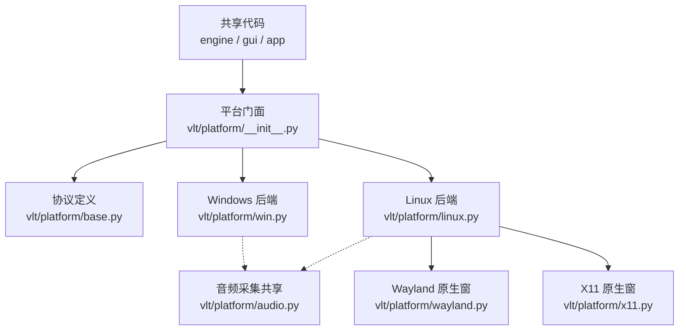
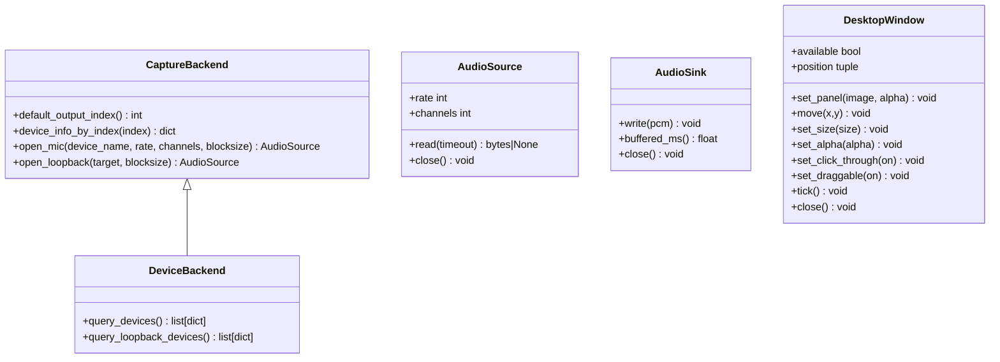
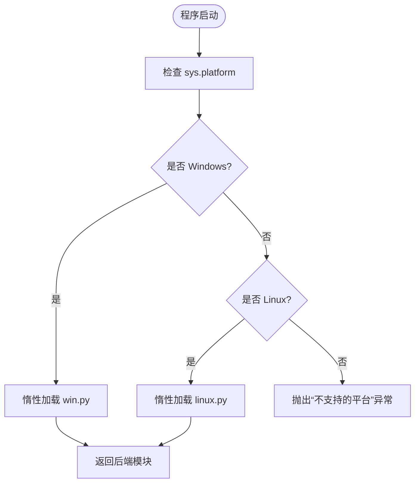
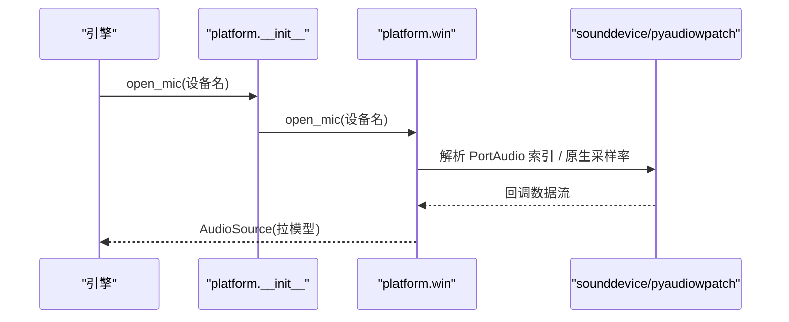
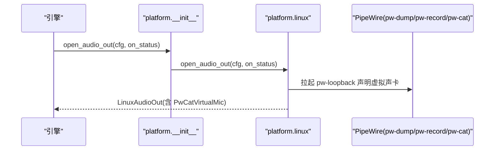
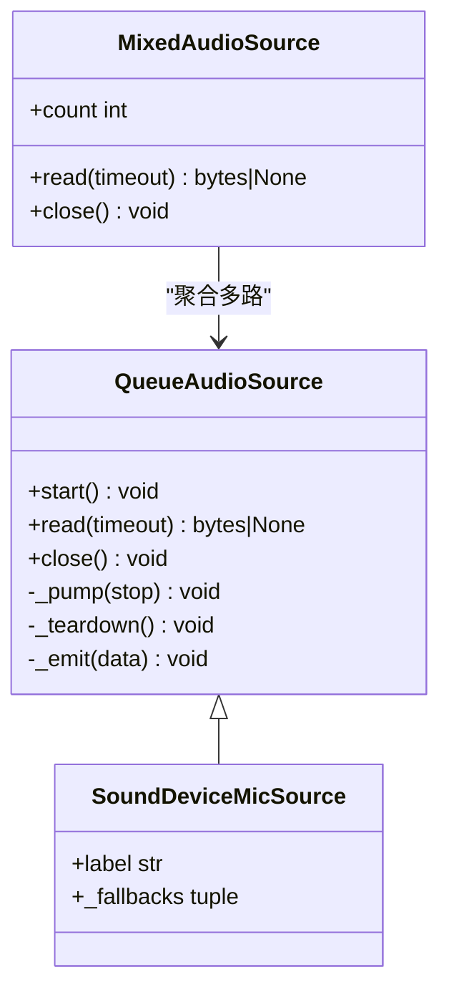
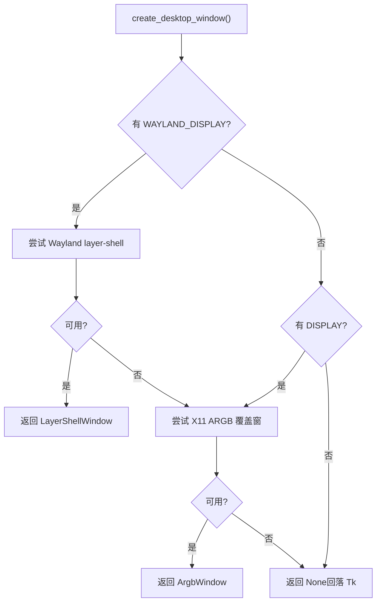
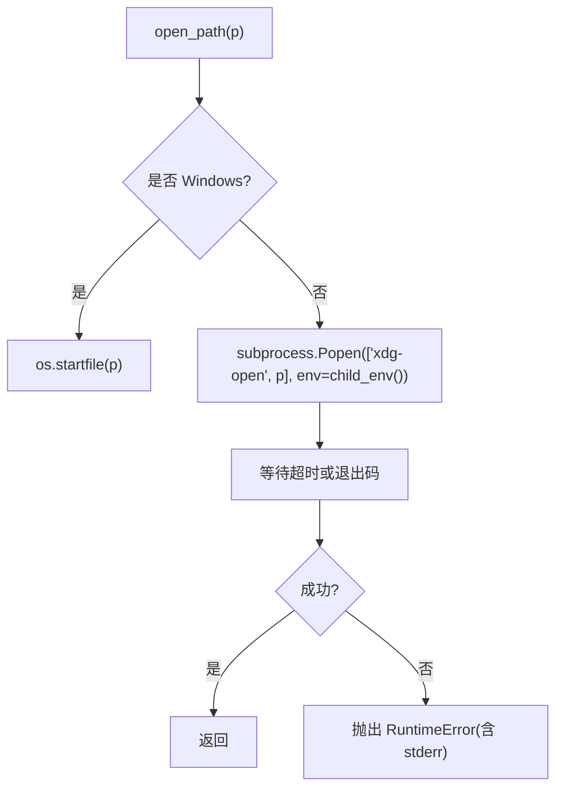
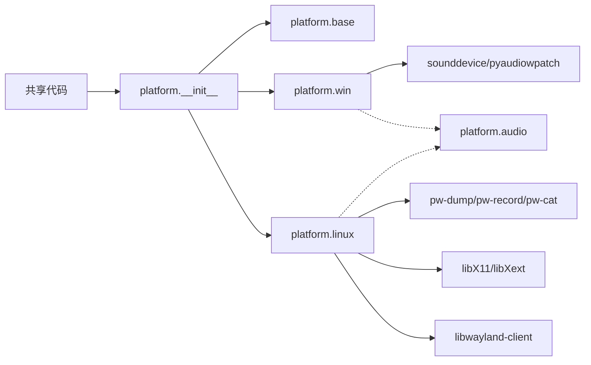

# 平台适配层

<cite>
**本文引用的文件**   
- [README.md](file://README.md)
- [vlt/platform/__init__.py](file://vlt/platform/__init__.py)
- [vlt/platform/base.py](file://vlt/platform/base.py)
- [vlt/platform/win.py](file://vlt/platform/win.py)
- [vlt/platform/linux.py](file://vlt/platform/linux.py)
- [vlt/platform/audio.py](file://vlt/platform/audio.py)
- [vlt/platform/wayland.py](file://vlt/platform/wayland.py)
- [vlt/platform/x11.py](file://vlt/platform/x11.py)
- [tests/test_virtualmic.py](file://tests/test_virtualmic.py)
</cite>

## 目录
1. [引言](#引言)
2. [项目结构](#项目结构)
3. [核心组件](#核心组件)
4. [架构总览](#架构总览)
5. [详细组件分析](#详细组件分析)
6. [依赖关系分析](#依赖关系分析)
7. [性能考量](#性能考量)
8. [故障排查指南](#故障排查指南)
9. [结论](#结论)
10. [附录：新平台适配开发指南](#附录新平台适配开发指南)

## 引言
本文件面向“平台适配层”，系统性解释跨平台抽象设计、Windows 与 Linux 的差异化实现、系统 API 调用、路径与进程管理、设备枚举、虚拟声卡与桌面叠加窗，以及平台检测与条件编译策略。目标是让共享代码（引擎、GUI、应用）不感知平台差异，同时保证 Windows 产物不含 Linux 专有符号、Linux 产物不含 Windows 专有符号。

## 项目结构
平台适配层位于 `vlt/platform`，采用“门面 + 后端”的结构：
- 门面模块 `__init__.py` 暴露统一接口，惰性加载具体平台后端。
- 协议定义在 `base.py`，纯协议、无副作用，禁止导入平台库。
- Windows 专属实现在 `win.py`，Linux 专属实现在 `linux.py`。
- 音频采集共享逻辑在 `audio.py`，两个平台共用。
- Linux 原生桌面叠加窗分别由 Wayland 后端 `wayland.py` 与 X11 后端 `x11.py` 提供。

**图示来源**
- [vlt/platform/__init__.py:1-14](file://vlt/platform/__init__.py#L1-L14)
- [vlt/platform/base.py:1-41](file://vlt/platform/base.py#L1-L41)
- [vlt/platform/win.py:1-9](file://vlt/platform/win.py#L1-L9)
- [vlt/platform/linux.py:1-33](file://vlt/platform/linux.py#L1-L33)
- [vlt/platform/audio.py:1-19](file://vlt/platform/audio.py#L1-L19)

**章节来源**
- [README.md:38-49](file://README.md#L38-L49)
- [vlt/platform/__init__.py:1-14](file://vlt/platform/__init__.py#L1-L14)
- [vlt/platform/base.py:1-41](file://vlt/platform/base.py#L1-L41)

## 核心组件
- 平台检测与后端选择：通过 `IS_WINDOWS` / `IS_LINUX` 与 `backend()` 惰性加载对应模块；不支持的平台抛出明确错误。
- 设备与采集后端：`device_backend()` / `capture_backend()` 返回同一模块，但语义区分“枚举设备”和“打开采集流”。
- 译音输出：`open_audio_out()` 在 Linux 上运行时声明 PipeWire 虚拟声卡并返回写入端；Windows 侧走 PortAudio 打开用户已安装的虚拟声卡。
- 桌面叠加窗：`create_desktop_window()` 在 Linux 上优先 Wayland layer-shell，再回落到 X11 ARGB 覆盖窗；失败则返回 None 让上层回落 Tk。
- 字体与语言探测：`find_cjk_font()` / `find_thai_font()` / `detect_ui_language()` 按平台实现，共享层只调门面。

**章节来源**
- [vlt/platform/__init__.py:24-25](file://vlt/platform/__init__.py#L24-L25)
- [vlt/platform/__init__.py:41-59](file://vlt/platform/__init__.py#L41-L59)
- [vlt/platform/__init__.py:62-73](file://vlt/platform/__init__.py#L62-L73)
- [vlt/platform/__init__.py:137-146](file://vlt/platform/__init__.py#L137-L146)
- [vlt/platform/__init__.py:231-251](file://vlt/platform/__init__.py#L231-L251)
- [vlt/platform/__init__.py:254-264](file://vlt/platform/__init__.py#L254-L264)
- [vlt/platform/__init__.py:410-429](file://vlt/platform/__init__.py#L410-L429)

## 架构总览
平台适配层的核心思想是“协议在前、实现在后”：
- 协议层（`base.py`）定义 `AudioSource` / `AudioSink` / `DeviceBackend` / `CaptureBackend` / `DesktopWindow` 等契约。
- 门面（`__init__.py`）负责平台检测、惰性加载、安全默认值与异常隔离。
- 后端（`win.py` / `linux.py`）实现平台相关能力，并通过共享音频基类（`audio.py`）统一采集模型。
- Linux 原生 UI 能力拆分为 Wayland 与 X11 两条腿，由 `linux.py` 的工厂函数按环境自动选择。

**图示来源**
- [vlt/platform/base.py:62-134](file://vlt/platform/base.py#L62-L134)
- [vlt/platform/base.py:137-182](file://vlt/platform/base.py#L137-L182)

**章节来源**
- [vlt/platform/base.py:1-41](file://vlt/platform/base.py#L1-L41)
- [vlt/platform/base.py:62-182](file://vlt/platform/base.py#L62-L182)

## 详细组件分析

### 平台检测与条件编译策略
- 使用 `sys.platform == "win32"` 与 `sys.platform.startswith("linux")` 判定当前平台。
- `backend()` 惰性加载 `vlt.platform.win` 或 `vlt.platform.linux`，不支持的平台抛错。
- 打包时通过构建脚本排除另一侧模块，确保 Windows 产物不含 Linux 专有内容，反之亦然。
- 共享代码一律从门面导入，避免直接 import 平台独占模块导致启动期 ImportError。

**图示来源**
- [vlt/platform/__init__.py:24-25](file://vlt/platform/__init__.py#L24-L25)
- [vlt/platform/__init__.py:41-59](file://vlt/platform/__init__.py#L41-L59)

**章节来源**
- [vlt/platform/__init__.py:1-14](file://vlt/platform/__init__.py#L1-L14)
- [vlt/platform/__init__.py:24-59](file://vlt/platform/__init__.py#L24-L59)

### Windows 平台差异化处理
- 设备枚举：仅保留 WASAPI host API 的设备，收敛重复项与未启用端点；必要时回落到完整设备表。
- loopback 采集：使用 pyaudiowpatch 的 loopback 设备，按端点原生声道数打开，避免阻塞式 read 导致的线程竞争崩溃。
- 麦克风采集：通过 sounddevice 的 PortAudio 索引打开，支持同名设备在不同 host API 下的回落候选。
- 桌面窗口：用 Win32 扩展样式实现鼠标穿透、工具窗、工作区查询等。
- 手腕屏：通过 pyopenvr 的 IVROverlay 实现。

**图示来源**
- [vlt/platform/win.py:23-85](file://vlt/platform/win.py#L23-L85)
- [vlt/platform/win.py:361-411](file://vlt/platform/win.py#L361-L411)
- [vlt/platform/audio.py:121-179](file://vlt/platform/audio.py#L121-L179)

**章节来源**
- [vlt/platform/win.py:23-129](file://vlt/platform/win.py#L23-L129)
- [vlt/platform/win.py:214-294](file://vlt/platform/win.py#L214-L294)
- [vlt/platform/win.py:320-358](file://vlt/platform/win.py#L320-L358)
- [vlt/platform/win.py:427-434](file://vlt/platform/win.py#L427-L434)
- [vlt/platform/win.py:450-700](file://vlt/platform/win.py#L450-L700)

### Linux 平台差异化处理
- 设备枚举：从 `pw-dump` 构建设备表，避免 sounddevice 在 Linux 上把每个播放应用流暴露为输入设备。
- loopback 采集：通过 `pw-record --target=<sink>` 抓取 sink 的 monitor，等价于 Windows 的 loopback。
- 麦克风采集：使用 sounddevice 按名字打开，并取设备原生采样率（ALSA 后端不做重采样）。
- 虚拟声卡：运行时声明一对 PipeWire 节点（可写入端 + 虚拟麦），通过 `pw-loopback` 拉起，并用 WirePlumber 规则避免抢默认输出。
- 桌面叠加窗：优先 Wayland layer-shell，其次 X11 ARGB 覆盖窗；失败回落 Tk。

**图示来源**
- [vlt/platform/linux.py:154-211](file://vlt/platform/linux.py#L154-L211)
- [vlt/platform/linux.py:706-728](file://vlt/platform/linux.py#L706-L728)
- [vlt/platform/linux.py:750-830](file://vlt/platform/linux.py#L750-L830)

**章节来源**
- [vlt/platform/linux.py:1-33](file://vlt/platform/linux.py#L1-L33)
- [vlt/platform/linux.py:67-96](file://vlt/platform/linux.py#L67-L96)
- [vlt/platform/linux.py:154-211](file://vlt/platform/linux.py#L154-L211)
- [vlt/platform/linux.py:445-550](file://vlt/platform/linux.py#L445-L550)
- [vlt/platform/linux.py:577-728](file://vlt/platform/linux.py#L577-L728)
- [vlt/platform/linux.py:833-883](file://vlt/platform/linux.py#L833-L883)

### 音频采集共享实现
- `QueueAudioSource` 统一后台线程喂数据到 asyncio 队列，对外提供协程 `read()`。
- `SoundDeviceMicSource` 复用 sounddevice 回调，两端平台共用；Windows 传 PortAudio 索引，Linux 传设备名。
- `MixedAudioSource` 将多路采集源混音成一路，用于 VRChat 多个播放流的合并。

**图示来源**
- [vlt/platform/audio.py:30-119](file://vlt/platform/audio.py#L30-L119)
- [vlt/platform/audio.py:121-179](file://vlt/platform/audio.py#L121-L179)
- [vlt/platform/audio.py:204-247](file://vlt/platform/audio.py#L204-L247)

**章节来源**
- [vlt/platform/audio.py:1-19](file://vlt/platform/audio.py#L1-L19)
- [vlt/platform/audio.py:30-119](file://vlt/platform/audio.py#L30-L119)
- [vlt/platform/audio.py:121-179](file://vlt/platform/audio.py#L121-L179)
- [vlt/platform/audio.py:182-247](file://vlt/platform/audio.py#L182-L247)

### 桌面叠加窗与原生窗口
- Linux Wayland 后端：手写 libwayland-client 绑定，使用 layer-shell 创建 overlay 面，支持鼠标穿透、拖动、多屏定位。
- Linux X11 后端：ctypes 直调 libX11/libXext，创建 32 位 ARGB 覆盖窗，支持合成器存在与否的降级（形状蒙版裁透明区）。
- 门面 `create_desktop_window()` 根据环境变量选择 Wayland 或 X11，失败返回 None 让上层回落 Tk。

**图示来源**
- [vlt/platform/__init__.py:410-429](file://vlt/platform/__init__.py#L410-L429)
- [vlt/platform/linux.py:1421-1471](file://vlt/platform/linux.py#L1421-L1471)
- [vlt/platform/wayland.py:596-670](file://vlt/platform/wayland.py#L596-L670)
- [vlt/platform/x11.py:238-289](file://vlt/platform/x11.py#L238-L289)

**章节来源**
- [vlt/platform/wayland.py:1-57](file://vlt/platform/wayland.py#L1-L57)
- [vlt/platform/wayland.py:596-720](file://vlt/platform/wayland.py#L596-L720)
- [vlt/platform/x11.py:1-48](file://vlt/platform/x11.py#L1-L48)
- [vlt/platform/x11.py:238-433](file://vlt/platform/x11.py#L238-L433)
- [vlt/platform/x11.py:440-629](file://vlt/platform/x11.py#L440-L629)

### 进程与环境变量管理
- `child_env()`：为子进程还原 PyInstaller 修改的库搜索路径，避免宿主程序加载包内旧库。
- `open_path()`：Windows 用 `os.startfile`，Linux 用 `xdg-open`，失败时带 stderr 信息抛出异常。

**图示来源**
- [vlt/platform/__init__.py:149-183](file://vlt/platform/__init__.py#L149-L183)
- [vlt/platform/__init__.py:192-228](file://vlt/platform/__init__.py#L192-L228)

**章节来源**
- [vlt/platform/__init__.py:149-183](file://vlt/platform/__init__.py#L149-L183)
- [vlt/platform/__init__.py:192-228](file://vlt/platform/__init__.py#L192-L228)

## 依赖关系分析
- 共享代码只依赖门面 `vlt.platform`，不直接 import 平台独占模块。
- Windows 后端依赖 sounddevice / pyaudiowpatch / Win32 API。
- Linux 后端依赖 PipeWire 原生工具（pw-dump / pw-record / pw-cat）、libX11 / libXext、libwayland-client。
- 音频采集共享层不引入平台专有库，降低耦合。

**图示来源**
- [vlt/platform/__init__.py:1-14](file://vlt/platform/__init__.py#L1-L14)
- [vlt/platform/win.py:1-9](file://vlt/platform/win.py#L1-L9)
- [vlt/platform/linux.py:1-33](file://vlt/platform/linux.py#L1-L33)
- [vlt/platform/audio.py:1-19](file://vlt/platform/audio.py#L1-L19)

**章节来源**
- [vlt/platform/__init__.py:1-14](file://vlt/platform/__init__.py#L1-L14)
- [vlt/platform/win.py:1-9](file://vlt/platform/win.py#L1-L9)
- [vlt/platform/linux.py:1-33](file://vlt/platform/linux.py#L1-L33)
- [vlt/platform/audio.py:1-19](file://vlt/platform/audio.py#L1-L19)

## 性能考量
- 设备枚举在主线程同步进行，避免 PortAudio 并发 init/terminate 导致的段错误；实测冷启动约 348ms、预热后约 23ms。
- Linux 设备快照 `pw-dump` 结果带 2 秒 TTL 缓存，减少频繁扫描开销。
- 采集侧统一为异步拉模型，后台线程喂数据到队列，避免阻塞 GUI 主循环。
- 多路 VRChat 输出流混音使用纯 Python 数组运算，单路常见情形下无需混音，降低开销。

**章节来源**
- [vlt/platform/base.py:48-59](file://vlt/platform/base.py#L48-L59)
- [vlt/platform/linux.py:55-58](file://vlt/platform/linux.py#L55-L58)
- [vlt/platform/audio.py:30-119](file://vlt/platform/audio.py#L30-L119)
- [vlt/platform/audio.py:182-247](file://vlt/platform/audio.py#L182-L247)

## 故障排查指南
- 虚拟声卡测试保护：单元测试中若只桩住 Windows 侧，Linux 分支可能真的拉起 `pw-loopback` 污染用户音频图；应两侧都桩住或使用 `_stub_audio_out()`。
- 采集线程关闭顺序：必须先置停止位、join 喂数据线程，再关底层资源，否则 Windows 上可能出现访问违规闪退。
- Wayland 会话原生窗不可用时：会打印提示并回落 Tk；若无 layer-shell 的合成器（GNOME/Weston），XWayland 下仍可能走 X11 ARGB 覆盖窗。
- 没有合成器的 X11 环境：逐像素 alpha 无人混合，会自动改用 1 位形状蒙版裁掉透明区，避免黑框。

**章节来源**
- [tests/test_virtualmic.py:1-14](file://tests/test_virtualmic.py#L1-L14)
- [tests/test_virtualmic.py:34-40](file://tests/test_virtualmic.py#L34-L40)
- [tests/test_virtualmic.py:255-260](file://tests/test_virtualmic.py#L255-L260)
- [vlt/platform/audio.py:1-19](file://vlt/platform/audio.py#L1-L19)
- [vlt/platform/linux.py:1096-1108](file://vlt/platform/linux.py#L1096-L1108)
- [vlt/platform/x11.py:344-364](file://vlt/platform/x11.py#L344-L364)

## 结论
平台适配层通过清晰的协议边界、惰性加载的门面、严格的模块隔离与构建期排除，实现了 Windows 与 Linux 的统一抽象。Windows 侧重 WASAPI / PortAudio / Win32 API，Linux 侧重 PipeWire / libX11 / libwayland-client。共享代码无需关心平台细节，新增平台只需实现协议并提供后端模块，即可无缝接入。

## 附录：新平台适配开发指南
- 实现要求：
  - 在 `vlt/platform/<new>.py` 中实现 `query_devices` / `query_loopback_devices` / `open_mic` / `open_loopback` / `open_audio_out`（如需要）/ `create_wrist_overlay` / `create_desktop_window` 等函数。
  - 所有返回值必须与现有平台保持一致的形状（设备 dict、AudioSource/AudioSink 对象、DesktopWindow 契约）。
  - 不要直接 import 其他平台模块；共享代码一律通过门面调用。
- 测试方法：
  - 对设备枚举与名称解析使用离线测试（参考 `tests/test_devices.py`）。
  - 对虚拟声卡与译音输出，需同时桩住 Windows 与 Linux 入口，避免真实硬件操作（参考 `tests/test_virtualmic.py` 的 `_stub_audio_out`）。
  - 对桌面叠加窗，分别在 Wayland 与 X11 环境下验证原生窗可用性，并确认 Tk 回落路径。
- 兼容性建议：
  - 保持“失败即降级”的策略：无法提供某项能力时返回安全默认值（None / False / 空列表），并在日志中说明原因。
  - 对系统 API 调用做健壮性处理（句柄失效、库缺失、权限不足等），避免打断翻译主流程。