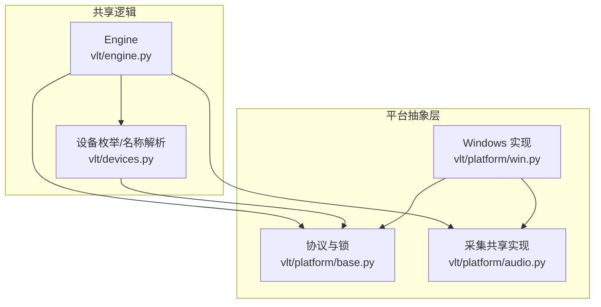
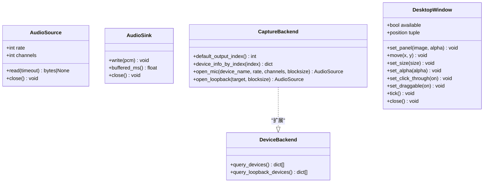
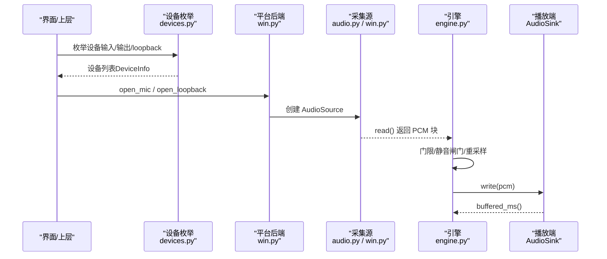
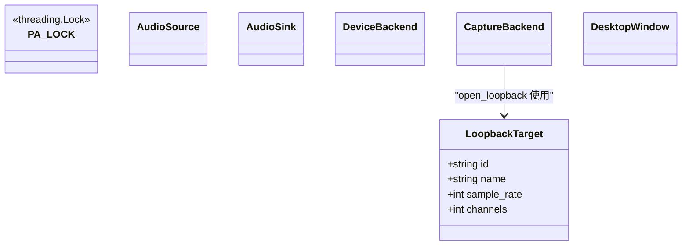
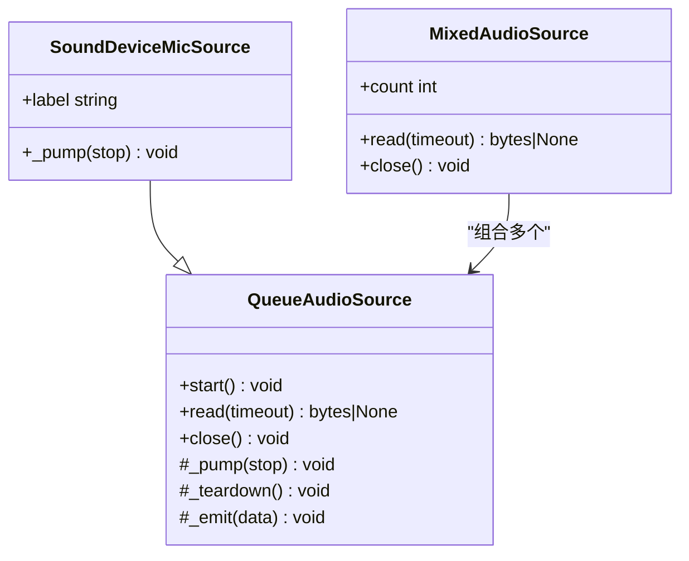
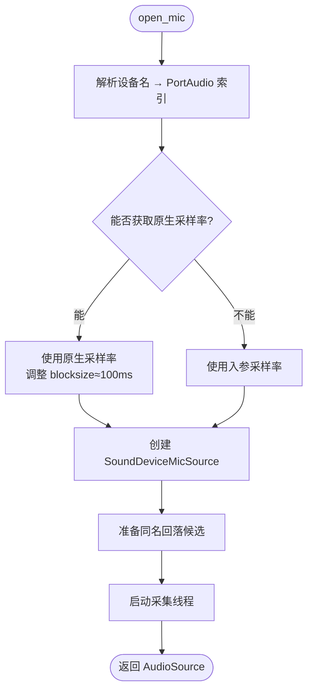
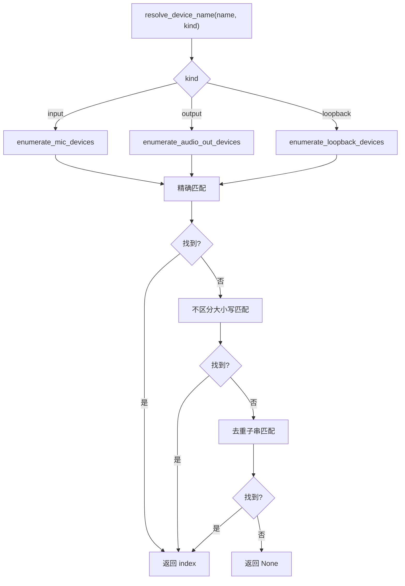
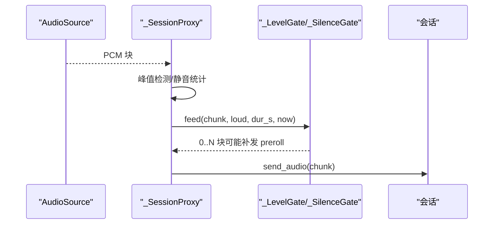
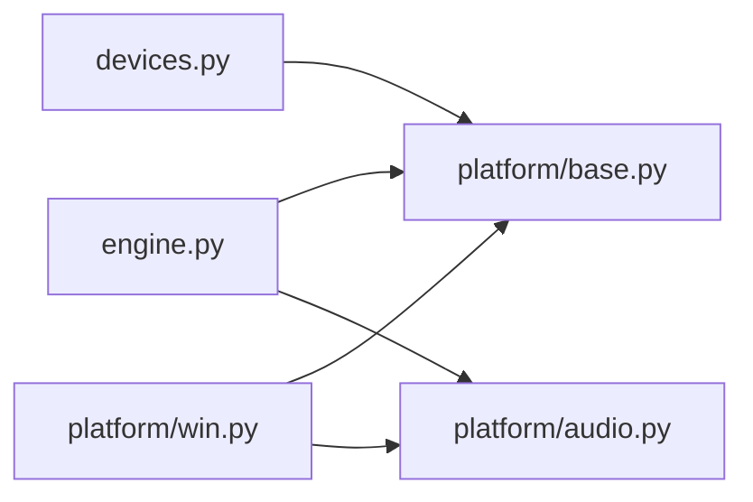

# 抽象接口定义

<cite>
**本文引用的文件**   
- [vlt/platform/base.py](file://vlt/platform/base.py)
- [vlt/platform/audio.py](file://vlt/platform/audio.py)
- [vlt/platform/win.py](file://vlt/platform/win.py)
- [vlt/devices.py](file://vlt/devices.py)
- [vlt/engine.py](file://vlt/engine.py)
</cite>

## 目录
1. [引言](#引言)
2. [项目结构](#项目结构)
3. [核心接口与契约](#核心接口与契约)
4. [架构总览](#架构总览)
5. [详细组件分析](#详细组件分析)
6. [依赖关系分析](#依赖关系分析)
7. [性能与线程安全](#性能与线程安全)
8. [实现指南](#实现指南)
9. [故障排查](#故障排查)
10. [结论](#结论)

## 引言
本文面向“平台抽象接口”的设计与实现，聚焦以下目标：
- 解释 Protocol 接口设计模式在音频采集、播放、设备枚举和桌面窗口中的职责边界。
- 明确统一数据流格式（PCM、采样率、声道数）以及 LoopbackTarget 的数据模型。
- 说明线程安全机制，尤其是 PortAudio 锁的使用场景与原因。
- 给出接口实现指南：方法签名规范、错误处理约定、性能要求与示例路径。

## 项目结构
本项目将“平台差异”收敛到 `vlt/platform` 层，共享代码通过门面函数访问具体能力，避免直接导入平台独占模块。关键文件分工如下：
- `vlt/platform/base.py`：纯协议定义（Protocol）、全局锁、统一数据结构。
- `vlt/platform/audio.py`：跨平台的采集基类与混音器，屏蔽回调/子进程差异。
- `vlt/platform/win.py`：Windows 具体实现（WASAPI loopback、PortAudio 索引、Win32 辅助）。
- `vlt/devices.py`：设备枚举与名称解析（把平台原始 dict 转成业务对象）。
- `vlt/engine.py`：引擎编排，消费 AudioSource/AudioSink，负责上送、TTS、UI 等。

**图示来源**
- [vlt/platform/base.py:48-182](file://vlt/platform/base.py#L48-L182)
- [vlt/platform/audio.py:30-247](file://vlt/platform/audio.py#L30-L247)
- [vlt/platform/win.py:21-423](file://vlt/platform/win.py#L21-L423)
- [vlt/devices.py:1-161](file://vlt/devices.py#L1-L161)
- [vlt/engine.py:21-39](file://vlt/engine.py#L21-L39)

**章节来源**
- [vlt/platform/base.py:1-41](file://vlt/platform/base.py#L1-L41)
- [vlt/platform/__init__.py:1-14](file://vlt/platform/__init__.py#L1-L14)

## 核心接口与契约
本节围绕 Protocol 接口展开，说明每个接口的职责、参数约定与返回值语义。

### 统一音频数据流
- 采集侧为“异步拉模型”：`AudioSource.read()` 阻塞到凑够字节或超时；超时返回 `None`。
- 播放侧为“推模型”：`AudioSink.write()` 推入即返回，内部缓冲。
- PCM 格式约定：
  - 采样率：由 `AudioSource.rate` 描述，供调用方做重采样（例如统一到 16kHz）。
  - 声道数：由 `AudioSource.channels` 描述，下游可降混为单声道。
  - 块大小：约 100ms 一块（例如 16kHz × 1ch × 2 字节 = 3200 字节），便于实时性与延迟平衡。

**章节来源**
- [vlt/platform/base.py:33-41](file://vlt/platform/base.py#L33-L41)
- [vlt/platform/base.py:76-104](file://vlt/platform/base.py#L76-L104)
- [vlt/engine.py:41-49](file://vlt/engine.py#L41-L49)

### 接口清单
- `AudioSource`：一路采集流（麦克风或系统声）。
- `AudioSink`：一路播放流（译音写往虚拟声卡）。
- `DeviceBackend`：设备枚举（输入/输出）。
- `CaptureBackend`：采集流工厂（麦克风 + loopback）。
- `DesktopWindow`：原生桌面叠加窗的窗口契约。

**图示来源**
- [vlt/platform/base.py:76-182](file://vlt/platform/base.py#L76-L182)

**章节来源**
- [vlt/platform/base.py:76-182](file://vlt/platform/base.py#L76-L182)

## 架构总览
下图展示从“设备枚举 → 打开采集 → 引擎消费 → 输出”的整体流程，体现接口之间的协作关系。

**图示来源**
- [vlt/devices.py:39-102](file://vlt/devices.py#L39-L102)
- [vlt/platform/win.py:361-422](file://vlt/platform/win.py#L361-L422)
- [vlt/platform/audio.py:30-119](file://vlt/platform/audio.py#L30-L119)
- [vlt/engine.py:446-528](file://vlt/engine.py#L446-L528)

## 详细组件分析

### 协议与数据结构（base.py）
- `PA_LOCK`：进程级且线程绑定的 PortAudio 串行锁，防止并发初始化/销毁导致段错误或崩溃。
- `LoopbackTarget`：统一“抓哪个系统输出”的平台内标识，Windows 用 index 字符串，Linux 用 sink 名。
- `AudioSource` / `AudioSink` / `DeviceBackend` / `CaptureBackend` / `DesktopWindow`：统一的鸭子类型契约，保证共享代码不感知平台差异。

**图示来源**
- [vlt/platform/base.py:48-74](file://vlt/platform/base.py#L48-L74)
- [vlt/platform/base.py:76-182](file://vlt/platform/base.py#L76-L182)

**章节来源**
- [vlt/platform/base.py:48-182](file://vlt/platform/base.py#L48-L182)

### 采集共享实现（audio.py）
- `QueueAudioSource`：后台线程喂数据 → asyncio 队列 → `await read()` 取；提供统一的关闭顺序（停止位 → join 线程 → 关底层资源）。
- `SoundDeviceMicSource`：麦克风采集（sounddevice），两个平台共用；支持候选设备回退链。
- `MixedAudioSource`：多路采集合并为一路（相加+限幅），用于 Linux 多流场景。

**图示来源**
- [vlt/platform/audio.py:30-119](file://vlt/platform/audio.py#L30-L119)
- [vlt/platform/audio.py:121-180](file://vlt/platform/audio.py#L121-L180)
- [vlt/platform/audio.py:204-247](file://vlt/platform/audio.py#L204-L247)

**章节来源**
- [vlt/platform/audio.py:1-19](file://vlt/platform/audio.py#L1-L19)
- [vlt/platform/audio.py:30-119](file://vlt/platform/audio.py#L30-L119)
- [vlt/platform/audio.py:121-180](file://vlt/platform/audio.py#L121-L180)
- [vlt/platform/audio.py:204-247](file://vlt/platform/audio.py#L204-L247)

### Windows 实现（win.py）
- `query_devices`：只保留 WASAPI host API 的设备，避免重复项与未启用端点干扰。
- `query_loopback_devices`：WASAPI loopback 设备表。
- `open_mic`：按 PortAudio 索引打开麦克风，优先设备原生采样率，带同名回落候选。
- `open_loopback`：打开一路 WASAPI loopback 采集，按设备原生声道数打开，再在下游降混。
- `PyaudioLoopbackSource`：基于 pyaudiowpatch 的非阻塞轮询采集，严格遵循关闭顺序。

**图示来源**
- [vlt/platform/win.py:361-411](file://vlt/platform/win.py#L361-L411)
- [vlt/platform/win.py:320-358](file://vlt/platform/win.py#L320-L358)

**章节来源**
- [vlt/platform/win.py:23-100](file://vlt/platform/win.py#L23-L100)
- [vlt/platform/win.py:214-294](file://vlt/platform/win.py#L214-L294)
- [vlt/platform/win.py:361-422](file://vlt/platform/win.py#L361-L422)

### 设备枚举与名称解析（devices.py）
- `enumerate_mic_devices` / `enumerate_audio_out_devices`：过滤出可用输入/输出设备，构造 `DeviceInfo`。
- `enumerate_loopback_devices`：枚举 loopback 设备（Windows WASAPI loopback / Linux PipeWire sink）。
- `resolve_device_name`：按“全名精确匹配 → 不区分大小写 → 去重子串匹配”的顺序解析索引。

**图示来源**
- [vlt/devices.py:39-102](file://vlt/devices.py#L39-L102)
- [vlt/devices.py:105-153](file://vlt/devices.py#L105-L153)

**章节来源**
- [vlt/devices.py:1-22](file://vlt/devices.py#L1-L22)
- [vlt/devices.py:39-102](file://vlt/devices.py#L39-L102)
- [vlt/devices.py:105-153](file://vlt/devices.py#L105-L153)

### 引擎消费与数据流（engine.py）
- 引擎通过 `_SessionProxy.send_audio` 对输入 PCM 进行峰值检测、静音闸门、长静音闸门处理，再发送到会话。
- 输入门限（LevelGate）仅作用于 loopback 腿，避免远处玩家小声被误翻。
- 引擎统一在下游做重采样（如 `to_16k_mono`），与 loopback 腿口径一致。

**图示来源**
- [vlt/engine.py:356-443](file://vlt/engine.py#L356-L443)
- [vlt/engine.py:269-347](file://vlt/engine.py#L269-L347)
- [vlt/engine.py:204-267](file://vlt/engine.py#L204-L267)

**章节来源**
- [vlt/engine.py:356-443](file://vlt/engine.py#L356-L443)
- [vlt/engine.py:269-347](file://vlt/engine.py#L269-L347)
- [vlt/engine.py:204-267](file://vlt/engine.py#L204-L267)

## 依赖关系分析
- 共享代码（engine/gui/app）通过 `platform` 门面访问能力，避免直接导入平台独占模块。
- `devices.py` 依赖 `platform.device_backend()` 获取原始设备 dict，再做业务解释。
- `win.py` 依赖 `base.PA_LOCK` 确保 PortAudio 串行化，避免并发 init/destroy 引发崩溃。
- `audio.py` 提供跨平台采集基类，Windows/Linux 共用 `SoundDeviceMicSource`。

**图示来源**
- [vlt/platform/__init__.py:1-14](file://vlt/platform/__init__.py#L1-L14)
- [vlt/devices.py:1-22](file://vlt/devices.py#L1-L22)
- [vlt/platform/base.py:48-59](file://vlt/platform/base.py#L48-L59)

**章节来源**
- [vlt/platform/__init__.py:1-14](file://vlt/platform/__init__.py#L1-L14)
- [vlt/devices.py:1-22](file://vlt/devices.py#L1-L22)
- [vlt/platform/base.py:48-59](file://vlt/platform/base.py#L48-L59)

## 性能与线程安全
- PortAudio 串行锁：
  - 原因：PortAudio 的初始化/销毁是进程级且线程绑定资源；并发调用可能导致段错误或崩溃。
  - 范围：设备枚举、loopback 设备查询、默认输出设备等涉及 PortAudio 初始化的操作均需加锁。
- 采集线程安全：
  - `QueueAudioSource` 保证关闭顺序：置停止位 → join 喂数据线程 → 才真正关闭底层资源。
  - 采集线程异常不会冒泡到主线程，仅记录日志。
- 性能要点：
  - 块大小约 100ms，兼顾实时性与 CPU 占用。
  - 混音采用轻量算法（逐样本相加+限幅），避免引入重型依赖。

**章节来源**
- [vlt/platform/base.py:48-59](file://vlt/platform/base.py#L48-L59)
- [vlt/platform/audio.py:10-19](file://vlt/platform/audio.py#L10-L19)
- [vlt/platform/audio.py:60-119](file://vlt/platform/audio.py#L60-L119)
- [vlt/platform/win.py:58-65](file://vlt/platform/win.py#L58-L65)

## 实现指南
本节给出实现这些接口的实践建议，包括方法签名、错误处理和性能要求。

### 实现 AudioSource
- 必须实现：
  - `rate` / `channels`：描述 PCM 格式。
  - `read(timeout)`：协程，阻塞到数据或超时；超时返回 `None`。
  - `close()`：幂等，严格按“停止位 → join 线程 → 关底层资源”顺序。
- 推荐做法：
  - 继承 `QueueAudioSource`，实现 `_pump` 与可选的 `_teardown`。
  - 使用 `_emit` 线程安全地推送 PCM 到队列。
- 参考路径：
  - [vlt/platform/audio.py:30-119](file://vlt/platform/audio.py#L30-L119)
  - [vlt/platform/audio.py:121-180](file://vlt/platform/audio.py#L121-L180)

### 实现 AudioSink
- 必须实现：
  - `write(pcm)`：推入即返回，内部缓冲。
  - `buffered_ms()`：返回当前缓冲时长（毫秒）。
  - `close()`：幂等。
- 参考路径：
  - [vlt/platform/base.py:96-104](file://vlt/platform/base.py#L96-L104)

### 实现 DeviceBackend / CaptureBackend
- `DeviceBackend`：
  - `query_devices()`：返回与 sounddevice/pyaudiowpatch 同形状的 dict 列表。
  - `query_loopback_devices()`：返回 loopback 设备列表。
- `CaptureBackend`：
  - `open_mic(device_name, rate, channels, blocksize)`：返回 `AudioSource`。
  - `open_loopback(target, blocksize)`：使用 `LoopbackTarget` 抹平平台差异。
- 参考路径：
  - [vlt/platform/base.py:107-135](file://vlt/platform/base.py#L107-L135)
  - [vlt/platform/win.py:23-100](file://vlt/platform/win.py#L23-L100)
  - [vlt/platform/win.py:361-422](file://vlt/platform/win.py#L361-L422)

### 实现 DesktopWindow
- 必须实现：
  - `available`：建窗失败时为 False。
  - `set_panel` / `move` / `set_size` / `set_alpha` / `set_click_through` / `set_draggable` / `tick` / `position` / `close`。
- 约束：
  - 所有方法在 GUI 线程高频调用，不得阻塞。
  - `close()` 幂等。
- 参考路径：
  - [vlt/platform/base.py:137-182](file://vlt/platform/base.py#L137-L182)

### 错误处理约定
- 设备枚举失败：返回空列表并留痕，不抛异常（见 `devices.py` 的 try/except 包裹）。
- 采集线程异常：记录日志，不冒泡到主线程（见 `QueueAudioSource._run`）。
- 关闭资源异常：忽略并留痕，确保收尾不阻塞（见 `QueueAudioSource.close`）。

**章节来源**
- [vlt/devices.py:39-102](file://vlt/devices.py#L39-L102)
- [vlt/platform/audio.py:60-119](file://vlt/platform/audio.py#L60-L119)
- [vlt/platform/base.py:137-182](file://vlt/platform/base.py#L137-L182)

## 故障排查
- 麦克风无声：
  - 检查是否命中 WASAPI 原生采样率限制；确认 `open_mic` 使用了设备原生采样率。
  - 查看同名回落候选是否生效（MME/DirectSound）。
- loopback 无声：
  - 确认按设备原生声道数打开；若失败，尝试立体声回落。
  - 检查非阻塞轮询是否正常工作（`get_read_available`）。
- 端口冲突/崩溃：
  - 确认 PortAudio 串行锁已加（设备枚举、loopback 查询等）。
  - 确认关闭顺序正确（stop → join → teardown）。

**章节来源**
- [vlt/platform/win.py:361-411](file://vlt/platform/win.py#L361-L411)
- [vlt/platform/win.py:214-294](file://vlt/platform/win.py#L214-L294)
- [vlt/platform/base.py:48-59](file://vlt/platform/base.py#L48-L59)
- [vlt/platform/audio.py:10-19](file://vlt/platform/audio.py#L10-L19)

## 结论
通过 Protocol 接口与平台抽象层，本项目实现了：
- 统一的音频数据流格式（PCM、采样率、声道数）。
- 跨平台的设备枚举与采集/播放抽象。
- 严格的线程安全与关闭顺序，避免 PortAudio 相关崩溃。
- 可扩展的实现方式：新增平台只需实现对应后端，共享代码无需改动。