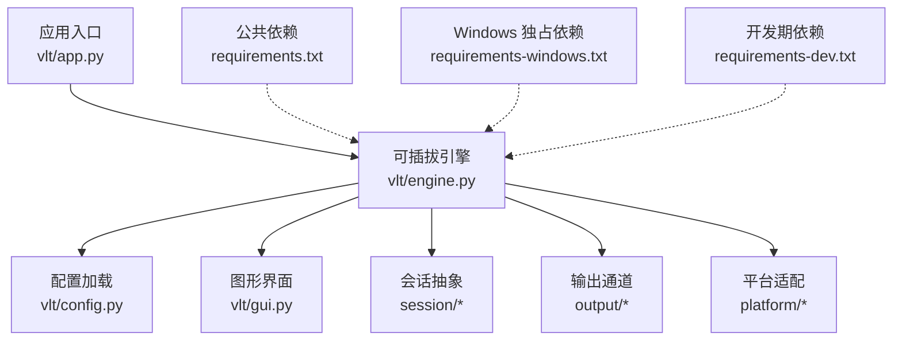
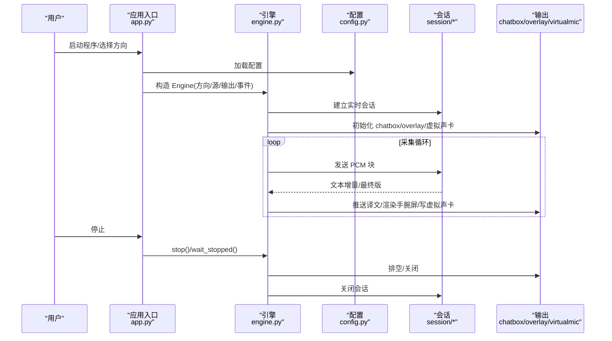
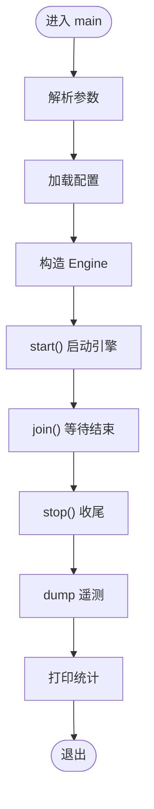
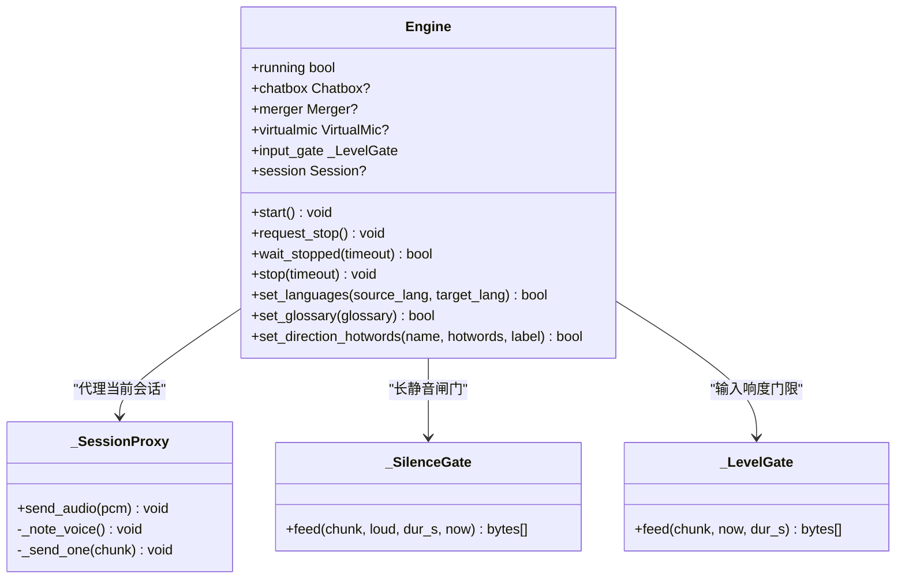
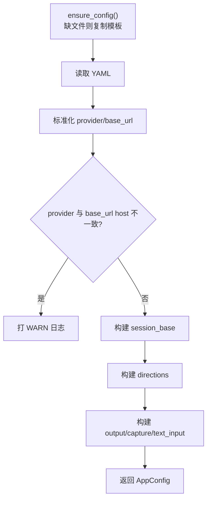
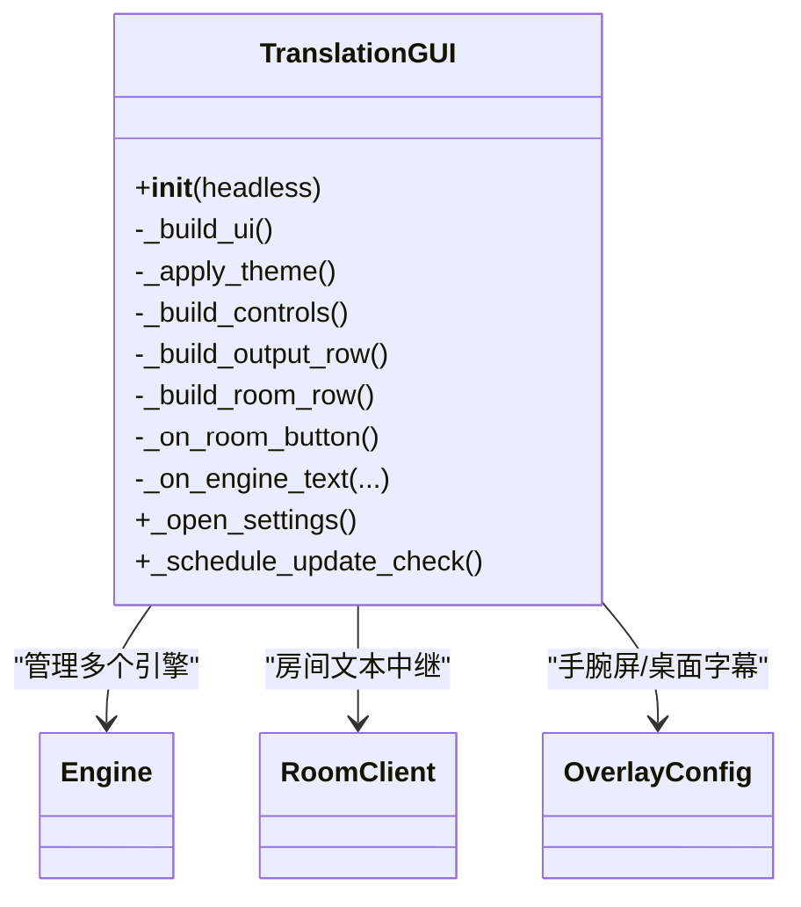
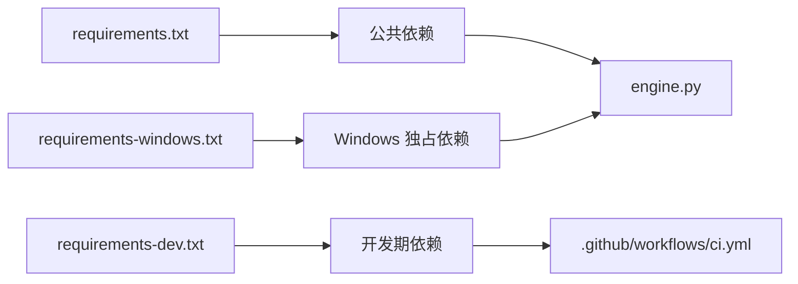
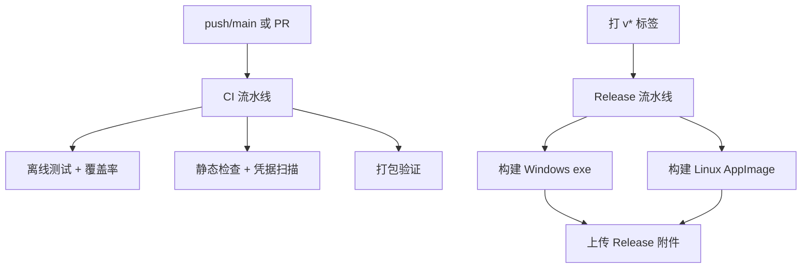

# 开发指南

<cite>
**本文引用的文件**   
- [README.md](file://README.md)
- [requirements.txt](file://requirements.txt)
- [requirements-dev.txt](file://requirements-dev.txt)
- [requirements-windows.txt](file://requirements-windows.txt)
- [setup.bat](file://setup.bat)
- [.github/workflows/ci.yml](file://.github/workflows/ci.yml)
- [.github/workflows/release.yml](file://.github/workflows/release.yml)
- [vlt/__init__.py](file://vlt/__init__.py)
- [vlt/app.py](file://vlt/app.py)
- [vlt/config.py](file://vlt/config.py)
- [vlt/engine.py](file://vlt/engine.py)
- [vlt/gui.py](file://vlt/gui.py)
</cite>

## 目录
1. [简介](#简介)
2. [项目结构](#项目结构)
3. [核心组件](#核心组件)
4. [架构总览](#架构总览)
5. [详细组件分析](#详细组件分析)
6. [依赖与耦合分析](#依赖与耦合分析)
7. [性能与调试](#性能与调试)
8. [贡献流程](#贡献流程)
9. [CI/CD 与发布](#cicd-与发布)
10. [开发工具与脚本](#开发工具与脚本)
11. [常见问题排查](#常见问题排查)
12. [结语](#结语)

## 简介
本指南面向希望参与 VRChat 实时同传项目的开发者，覆盖从环境搭建、代码规范、调试定位到贡献流程与 CI/CD 的完整链路。项目目标是在 VRChat 中实现“采集音频 → 实时翻译 → 输出到聊天气泡 / 手腕屏 / 虚拟麦克风”的端到端能力，并支持 Windows 与 Linux 双平台。

## 项目结构
仓库采用“功能模块 + 平台适配 + 测试 + 脚本 + 工作流”的分层组织方式：
- vlt：核心业务逻辑（配置、引擎、GUI、会话、输出、平台适配等）
- tests：离线单元测试与覆盖率收集
- scripts：辅助脚本（凭据扫描、OSC 监听、探测接口等）
- .github/workflows：CI 与 Release 流水线
- 根目录批处理与安装脚本：setup.bat、run_*.bat、build_exe.bat 等

**图表来源**
- [vlt/app.py:1-166](file://vlt/app.py#L1-L166)
- [vlt/engine.py:1-120](file://vlt/engine.py#L1-L120)
- [vlt/config.py:1-60](file://vlt/config.py#L1-L60)
- [vlt/gui.py:1-120](file://vlt/gui.py#L1-L120)
- [requirements.txt:1-20](file://requirements.txt#L1-L20)
- [requirements-windows.txt:1-17](file://requirements-windows.txt#L1-L17)
- [requirements-dev.txt:1-14](file://requirements-dev.txt#L1-L14)

**章节来源**
- [README.md:1-60](file://README.md#L1-L60)

## 核心组件
- 应用入口 app：解析参数、组装 Engine、统计遥测、控制生命周期。
- 引擎 engine：统一调度采集、会话、节流合并、chatbox、overlay、虚拟声卡；提供启停、重连、事件回调。
- 配置 config：YAML + 环境变量 + CLI/界面保存的 API key；负责默认值、回退、校验与迁移提示。
- GUI gui：Tkinter 主界面，封装 Engine 调用、设备枚举、设置弹窗、房间中继、更新检查等。

关键职责边界：
- app 只负责“启动与编排”，engine 负责“运行时行为”。
- config 是单一真相源，所有路径都通过它读取配置。
- gui 是用户交互层，不直接操作底层音频或网络协议。

**章节来源**
- [vlt/app.py:1-166](file://vlt/app.py#L1-L166)
- [vlt/engine.py:1-120](file://vlt/engine.py#L1-L120)
- [vlt/config.py:1-60](file://vlt/config.py#L1-L60)
- [vlt/gui.py:1-120](file://vlt/gui.py#L1-L120)

## 架构总览
系统按“采集 → 会话 → 输出”三层展开，模型差异收敛在 session 内部，下游看不到具体模型细节。

**图表来源**
- [vlt/app.py:55-130](file://vlt/app.py#L55-L130)
- [vlt/engine.py:446-520](file://vlt/engine.py#L446-L520)
- [vlt/config.py:258-336](file://vlt/config.py#L258-L336)

## 详细组件分析

### 应用入口 app
- 作用：解析命令行参数、根据 direction 取配置、创建 Engine、记录 Telemetry、打印统计。
- 关键点：
  - 支持 --pcm/--mic/--loopback 三种音频源。
  - sink 支持 chatbox/overlay/both。
  - 支持 dry-run、overlay-dry-run、no-realtime 等调试开关。
  - 结束时输出 chatbox 发送量、token 用量、首个增量延迟等指标。

**图表来源**
- [vlt/app.py:133-166](file://vlt/app.py#L133-L166)
- [vlt/app.py:55-130](file://vlt/app.py#L55-L130)

**章节来源**
- [vlt/app.py:1-166](file://vlt/app.py#L1-L166)

### 引擎 engine
- 作用：把采集、会话、节流合并、chatbox、overlay、虚拟声卡串成可启停的引擎。
- 关键特性：
  - start() 非阻塞，stop() 幂等且有超时。
  - 输入侧有长静音闸门和输入响度门限，避免白花钱与掉线。
  - 本地 repeat 抑制：对高度雷同的最终译文进行抑制并重建会话。
  - 事件回调 on_text/on_status/on_stats 供 GUI/CLI 消费。
  - 黑匣子字段用于断线诊断（输入块数、静音块数、TTS 音频块数等）。

**图表来源**
- [vlt/engine.py:349-520](file://vlt/engine.py#L349-L520)
- [vlt/engine.py:204-347](file://vlt/engine.py#L204-L347)

**章节来源**
- [vlt/engine.py:1-120](file://vlt/engine.py#L1-L120)
- [vlt/engine.py:349-520](file://vlt/engine.py#L349-L520)

### 配置 config
- 作用：YAML 配置 + 环境变量 + 界面保存的 API key；负责默认值、回退、非法值留痕、老配置迁移。
- 关键点：
  - ensure_config：不存在则从模板生成，保证开箱即用。
  - load_api_key：显式参数 > 界面保存 > 环境变量 > bl CLI 配置。
  - merge_hotwords：全局词库与方向级热词的唯一合并口径。
  - Direction.to_session_config：把方向配置转为会话配置，统一 provider/base_url/api_key 等。
  - load_config：集中解析 session/directions/output/capture/text_input/room 等段，并对非法值留痕回落。

**图表来源**
- [vlt/config.py:51-65](file://vlt/config.py#L51-L65)
- [vlt/config.py:258-336](file://vlt/config.py#L258-L336)
- [vlt/config.py:337-406](file://vlt/config.py#L337-L406)

**章节来源**
- [vlt/config.py:1-60](file://vlt/config.py#L1-L60)
- [vlt/config.py:258-406](file://vlt/config.py#L258-L406)

### 图形界面 gui
- 作用：Tkinter 主界面，封装 Engine 调用、设备枚举、设置弹窗、房间中继、更新检查、主题与字体。
- 关键点：
  - TranslationGUI 持有多个 Engine（mine/theirs/dual），以及手腕屏/桌面字幕实例。
  - 语言切换、方向切换、输出勾选、API key 状态、房间连接/断开。
  - 设置弹窗分页：常规、手腕屏、桌面字幕、房间等。
  - 更新检查走守护线程，下载进度窗与替换入口。

**图表来源**
- [vlt/gui.py:194-318](file://vlt/gui.py#L194-L318)
- [vlt/gui.py:490-590](file://vlt/gui.py#L490-L590)
- [vlt/gui.py:602-740](file://vlt/gui.py#L602-L740)

**章节来源**
- [vlt/gui.py:1-120](file://vlt/gui.py#L1-L120)
- [vlt/gui.py:194-318](file://vlt/gui.py#L194-L318)
- [vlt/gui.py:490-590](file://vlt/gui.py#L490-L590)
- [vlt/gui.py:602-740](file://vlt/gui.py#L602-L740)

## 依赖与耦合分析
- 公共依赖 requirements.txt：跨平台通用库（OSC、Pillow、websockets、numpy、sounddevice、miniaudio、PyYAML）。
- Windows 独占依赖 requirements-windows.txt：PyAudioWPatch（WASAPI loopback）、openvr（SteamVR overlay）。
- 开发期依赖 requirements-dev.txt：ruff、coverage，仅用于静态检查与覆盖率。

**图表来源**
- [requirements.txt:1-20](file://requirements.txt#L1-L20)
- [requirements-windows.txt:1-17](file://requirements-windows.txt#L1-L17)
- [requirements-dev.txt:1-14](file://requirements-dev.txt#L1-L14)
- [.github/workflows/ci.yml:32-57](file://.github/workflows/ci.yml#L32-L57)

**章节来源**
- [requirements.txt:1-20](file://requirements.txt#L1-L20)
- [requirements-windows.txt:1-17](file://requirements-windows.txt#L1-L17)
- [requirements-dev.txt:1-14](file://requirements-dev.txt#L1-L14)

## 性能与调试
- 性能关注点：
  - 首个增量延迟：app 会打印自 speech_started 的首个文本增量时间。
  - chatbox 限流：使用令牌桶，避免刷屏；停止时优先排空最新一条。
  - 输入门限与长静音闸门：减少无效上送，降低服务端压力与掉线风险。
  - TTS 流式合成：首段音频快速起播，降低打字替代说话时的听感延迟。
- 调试技巧：
  - 使用 --dry-run 与 --overlay-dry-run 在不真正发 OSC/接管 SteamVR 的情况下验证链路。
  - 使用 --pcm 指定测试 PCM 文件，绕过麦克风/VRChat。
  - 查看 logs 下的 telemetry JSONL 与引擎日志，结合黑匣子字段定位断线原因。
  - 使用 scripts/osc_listen.py 观察 OSC 报文。
  - 使用 coverage 统计覆盖率，配合 ruff 做静态检查。

**章节来源**
- [vlt/app.py:55-130](file://vlt/app.py#L55-L130)
- [vlt/engine.py:44-70](file://vlt/engine.py#L44-L70)
- [vlt/engine.py:787-800](file://vlt/engine.py#L787-L800)

## 贡献流程
- 分支策略：
  - 日常开发在 feature 分支提交，PR 合并到 main。
  - 每次 push main 与 PR 都会触发 CI。
- 代码审查：
  - 必须通过静态检查（ruff F,E9）与凭据扫描。
  - 新增功能需补充测试用例，确保离线可跑。
- 提交规范：
  - 提交信息应清晰描述改动范围与动机。
  - 不要引入敏感信息（API key、账号信息等），由 check_no_secrets.py 拦截。

**章节来源**
- [.github/workflows/ci.yml:1-20](file://.github/workflows/ci.yml#L1-L20)
- [.github/workflows/ci.yml:45-57](file://.github/workflows/ci.yml#L45-L57)

## CI/CD 与发布
- CI（ci.yml）：
  - 语法检查（compileall）、静态检查（ruff F,E9）、凭据扫描。
  - 全仓离线测试（跳过需要真实 API key 的用例），累积覆盖率摘要。
  - Windows 与 Linux 双平台测试；Linux 使用 xvfb 运行 Tk 测试。
  - 打包验证：PyInstaller 构建 exe，断言产物存在且体积合理，平台隔离检查。
- Release（release.yml）：
  - 打 tag 后构建 Windows exe 与 Linux AppImage，上传 Release 附件。
  - 校验 tag 与包内 __version__ 一致。
  - 生成 SHA256SUMS.txt 兼容老客户端更新检查。

**图表来源**
- [.github/workflows/ci.yml:22-134](file://.github/workflows/ci.yml#L22-L134)
- [.github/workflows/release.yml:19-158](file://.github/workflows/release.yml#L19-L158)

**章节来源**
- [.github/workflows/ci.yml:1-253](file://.github/workflows/ci.yml#L1-L253)
- [.github/workflows/release.yml:1-158](file://.github/workflows/release.yml#L1-L158)

## 开发工具与脚本
- 环境安装：
  - Windows：运行 setup.bat，自动创建 .venv、升级 pip、安装依赖。
  - Linux：参考 README 中的 Linux 指南（setup.sh、run_gui.sh）。
- 启动方式：
  - run_chatbox.bat / run_overlay.bat / run_gui.py 等批处理或 Python 入口。
  - 命令行模式：python -m vlt.app --direction mine --mic/--pcm/--loopback。
- 开发依赖：
  - 安装 requirements-dev.txt 以启用 ruff 与 coverage。
- 常用脚本：
  - scripts/check_no_secrets.py：凭据扫描。
  - scripts/osc_listen.py：监听 OSC 报文。
  - scripts/probe_*.py：探测接口与会话更新。

**章节来源**
- [setup.bat:1-46](file://setup.bat#L1-L46)
- [requirements-dev.txt:1-14](file://requirements-dev.txt#L1-L14)
- [README.md:55-61](file://README.md#L55-L61)

## 常见问题排查
- 找不到 API key：
  - 通过环境变量 DASHSCOPE_API_KEY 或 bl auth login --api-key 设置。
  - 界面保存的 key 优先级高于环境变量与 bl CLI 配置。
- 配置文件损坏：
  - 程序会自动备份损坏的 config.yaml 并重新生成默认配置，同时打印错误信息。
- 端口不一致：
  - 可在「设置 → 常规」中修改 VRChat OSC 端口，无需手改 config.yaml。
- 手腕屏/桌面字幕调整：
  - 调整面板已移入「设置」，各自独立配置，互不影响。
- 版本更新：
  - 启动后自动检查更新，下载完成后提供替换入口；强杀/关机后可复核是否残留待替换。

**章节来源**
- [vlt/config.py:68-104](file://vlt/config.py#L68-L104)
- [vlt/config.py:265-283](file://vlt/config.py#L265-L283)
- [README.md:131-152](file://README.md#L131-L152)

## 结语
本指南梳理了项目的开发环境、代码结构、核心组件、调试方法与贡献流程。建议新贡献者先完成环境搭建与离线测试，再逐步理解引擎与 GUI 的协作关系，最后参与功能扩展与问题修复。遇到异常时优先查看日志与覆盖率报告，并结合 CI 门禁规则进行自检。