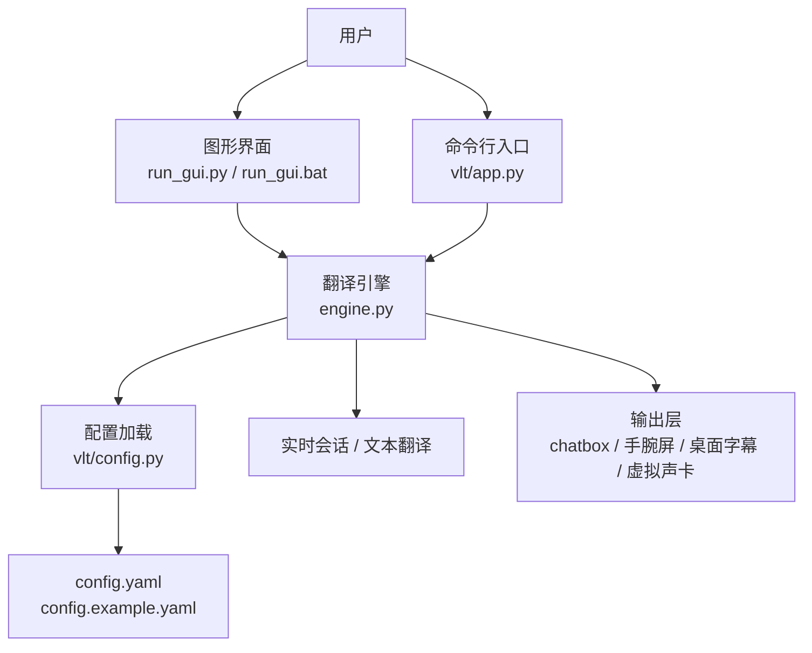
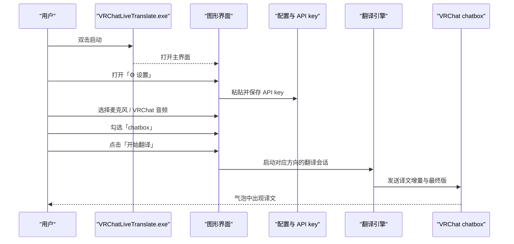
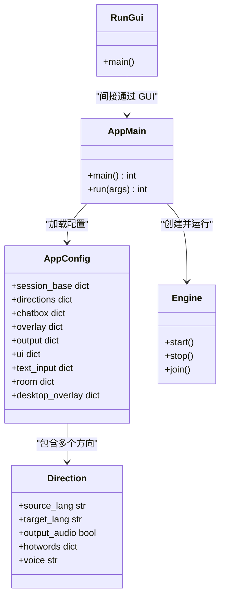
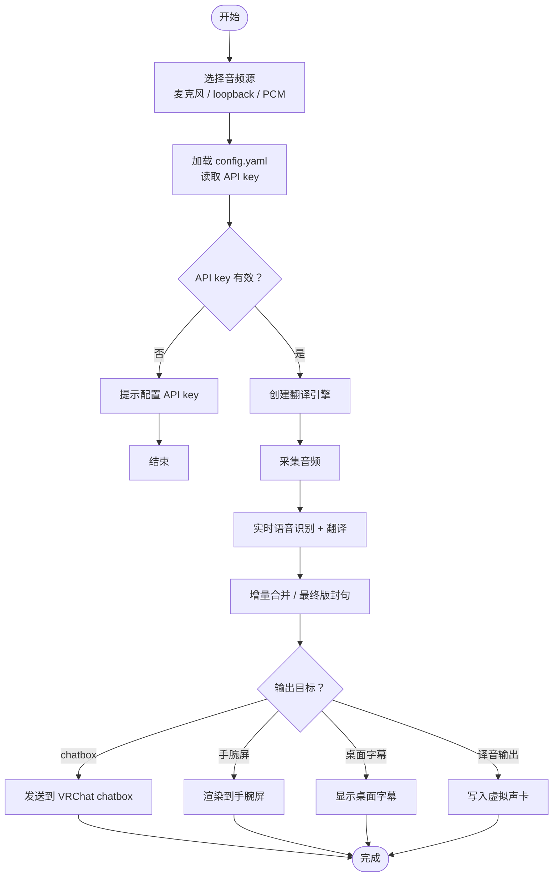

# 快速开始

<cite>
**本文引用的文件**   
- [README.md](file://README.md)
- [GUIDE.md](file://docs/GUIDE.md)
- [config.example.yaml](file://config.example.yaml)
- [setup.bat](file://setup.bat)
- [run_gui.py](file://run_gui.py)
- [app.py](file://vlt/app.py)
- [config.py](file://vlt/config.py)
- [run_chatbox.bat](file://run_chatbox.bat)
</cite>

## 目录
1. [简介](#简介)
2. [项目结构速览](#项目结构速览)
3. [安装：两种方式](#安装两种方式)
4. [首次配置流程](#首次配置流程)
5. [完整使用示例：从启动到第一次翻译成功](#完整使用示例从启动到第一次翻译成功)
6. [架构与数据流总览](#架构与数据流总览)
7. [常见问题与快速排障](#常见问题与快速排障)
8. [平台差异与注意事项](#平台差异与注意事项)
9. [结论](#结论)

## 简介
VRChat 实时同传是一个面向 VRChat 的实时语音翻译工具：它采集你的麦克风或游戏音频，调用千问云实时同传模型，把译文送到 chatbox 气泡、VR 手腕屏，并可选把译音回灌进虚拟麦克风让对方直接听见。Windows 10/11 与 Linux 都支持，两边共用同一份 `config.yaml`，配置语义一致。

对于只想“双击就能用”的用户，仓库提供单文件 exe；想自己改代码或打包的用户，则走源码安装路线。

**章节来源**
- [README.md:11-16](file://README.md#L11-L16)
- [README.md:20-26](file://README.md#L20-L26)

## 项目结构速览
这个仓库的核心运行逻辑集中在 `vlt/` 包中：
- `app.py`：命令行入口，负责解析参数、选择音频源、创建引擎、启动/停止翻译。
- `config.py`：加载 `config.yaml`、处理 API key、合并热词、校验配置。
- `gui.py`：Tkinter 图形界面（exe 和源码都能用）。
- `engine.py`：核心引擎，封装会话、节流、chatbox/overlay/译音输出等能力。
- `config.example.yaml`：模板配置，首次运行会复制成可写的 `config.yaml`。

**图表来源**
- [run_gui.py:1-38](file://run_gui.py#L1-L38)
- [app.py:1-166](file://vlt/app.py#L1-L166)
- [config.py:1-406](file://vlt/config.py#L1-L406)
- [config.example.yaml:1-345](file://config.example.yaml#L1-L345)

**章节来源**
- [GUIDE.md:581-614](file://docs/GUIDE.md#L581-L614)

## 安装：两种方式

### 方式一：Windows 直接下载 exe（推荐新手）
适合不想装 Python、不想碰命令行的用户。

步骤：
1. 打开 Releases 页面，下载 `VRChatLiveTranslate.exe`。
2. 双击运行程序。
3. 在图形界面里完成 API key 配置、设备选择、基础开关。
4. 勾选 `chatbox`，点击「开始翻译」，对着麦克风说一句话，看气泡是否出现译文。

补充说明：
- exe 的配置和日志默认放在 `%APPDATA%\vrchat-livetranslate`。
- 如果想做成绿色版，让配置跟着 exe 走，可在 exe 旁边放一个空的 `portable.txt`。
- 旧版把 `config.yaml` / `logs/` 放在 exe 旁边的话，首次运行会自动迁移到新位置，原文件不会删除。

**章节来源**
- [GUIDE.md:14-23](file://docs/GUIDE.md#L14-L23)

### 方式二：源码安装（开发者或需要自定义的用户）
适合想修改代码、二次打包、或者希望完全掌控依赖环境的用户。

前置条件（Windows）：
- Windows 10 / 11。
- Python 3.11（安装时勾选加入 PATH；只跑 exe 不需要这一步）。
- VRChat：设置里开启 OSC，并把聊天气泡可见性设为 Everyone。
- SteamVR：只有「别人说 → 手腕屏」功能需要。
- 千问云 API key。

安装步骤：
1. 克隆或解压仓库到本地目录。
2. 双击 `setup.bat`，它会创建 `.venv`、升级 pip、安装依赖。
3. 安装完成后按提示配置 API key。
4. 运行自检脚本 `run_selfcheck.bat`，确认模块导入、API key、手腕屏渲染、测试音频链路都正常。
5. 启动图形界面 `run_gui.bat`，或命令行模式 `run_chatbox.bat` / `run_overlay.bat`。

等价手动命令：
- 创建虚拟环境。
- 升级 pip。
- 安装 `requirements-windows.txt`。

**章节来源**
- [GUIDE.md:52-71](file://docs/GUIDE.md#L52-L71)
- [setup.bat:1-46](file://setup.bat#L1-L46)

## 首次配置流程

### 第一步：获取千问云 API key
你需要一个千问云的 API key。国内用户走默认线路；海外用户建议用千问云·海外版。

关键规则：
- 程序读取 API key 的顺序是：界面保存的 key → 环境变量 `DASHSCOPE_API_KEY` → 百炼 CLI 配置。
- API key **不会写进项目文件或 `config.yaml`**。
- 两条线路（国内千问云、海外千问云）各自存一份 key，切换线路不用重填。

常见设置方式：
- 图形界面「⚙ 设置 → API key」粘贴保存。
- 环境变量：`setx DASHSCOPE_API_KEY "你的key"`（新开的命令行窗口才生效）。
- 百炼 CLI：`bl auth login --api-key "你的key"`。

**章节来源**
- [GUIDE.md:73-91](file://docs/GUIDE.md#L73-L91)
- [config.py:68-104](file://vlt/config.py#L68-L104)

### 第二步：选择音频设备
程序需要知道：
- 麦克风设备：采集你自己说话的声音。
- loopback 设备：采集 VRChat 播放输出，用于识别别人说的话。
- 译音输出设备：可选，把译文声音送回虚拟声卡，让对方听到。

推荐做法：
- 打开图形界面「⚙ 设置 → 音频」。
- 分别选择麦克风、VRChat 音频、译音输出。
- 如果下拉为空，先确认设备已在系统声音设置中启用。
- 也可以在 `config.yaml` 的 `capture.mic_device` / `capture.loopback_device` 中填写设备名。

**章节来源**
- [GUIDE.md:252-260](file://docs/GUIDE.md#L252-L260)
- [config.example.yaml:73-95](file://config.example.yaml#L73-L95)

### 第三步：调整基本设置
建议新用户先保持默认，再按需微调：
- 方向：我说 → 英文、别人说 → 中文。
- 输出：新手先勾选 `chatbox`；有头显且装了 SteamVR 再开手腕屏。
- 输入门限：如果你发现远处玩家小声也被翻译，可以在「⚙ 设置 → 输入门限」里调高阈值。
- 音色：实时语音腿的音色由 `session.voice` 控制，默认必须显式指定。

**章节来源**
- [config.example.yaml:13-34](file://config.example.yaml#L13-L34)
- [config.example.yaml:98-112](file://config.example.yaml#L98-L112)
- [GUIDE.md:354-374](file://docs/GUIDE.md#L354-L374)

## 完整使用示例：从启动到第一次翻译成功

下面以「Windows 直接下载 exe」为例，给出从零到第一次翻译成功的完整流程。

**图表来源**
- [GUIDE.md:170-193](file://docs/GUIDE.md#L170-L193)
- [app.py:55-130](file://vlt/app.py#L55-L130)
- [config.py:258-336](file://vlt/config.py#L258-L336)

具体操作顺序：
1. 双击 `VRChatLiveTranslate.exe`。
2. 打开「⚙ 设置」，在 API key 区域粘贴你的千问云 key 并保存。
3. 在「⚙ 设置 → 音频」中选择麦克风。
4. 在主界面勾选 `chatbox`。
5. 点击「开始翻译」。
6. 对着麦克风说一句中文，等待几秒后，VRChat 气泡中应出现英文译文。
7. 如果没反应，先看状态栏和日志，再进入排障部分。

**章节来源**
- [GUIDE.md:145-164](file://docs/GUIDE.md#L145-L164)
- [GUIDE.md:170-193](file://docs/GUIDE.md#L170-L193)

## 架构与数据流总览

### 核心组件关系
- `run_gui.py`：PyInstaller 打包入口，兜住 stdout/stderr，然后调用 `vlt.gui.main`。
- `vlt/app.py`：命令行入口，负责解析参数、选择音频源、构造 `Engine`、启动/停止。
- `vlt/config.py`：负责生成 `config.yaml`、加载配置、读取 API key、合并热词。
- `config.example.yaml`：模板配置，包含 session、capture、directions、chatbox、overlay、output、text_input、room、ui 等段。

**图表来源**
- [run_gui.py:1-38](file://run_gui.py#L1-L38)
- [app.py:133-166](file://vlt/app.py#L133-L166)
- [config.py:121-188](file://vlt/config.py#L121-L188)

### 一次翻译的数据流

**图表来源**
- [app.py:55-130](file://vlt/app.py#L55-L130)
- [config.py:258-406](file://vlt/config.py#L258-L406)
- [config.example.yaml:13-345](file://config.example.yaml#L13-L345)

## 常见问题与快速排障

### 气泡里没有内容
可能原因：
- VRChat 没运行。
- VRChat 没有开启 OSC。
- 聊天气泡可见性不是 Everyone。
- 程序实际已经发送了 OSC，但 VRChat 端没收到。

排查建议：
- 先用 `--dry-run` 或自检脚本确认程序侧是否正常。
- 检查 VRChat 设置中的 OSC 选项。
- 查看日志中是否有 chatbox 发送相关记录。

**章节来源**
- [GUIDE.md:560-564](file://docs/GUIDE.md#L560-L564)

### 麦克风采不到声音
可能原因：
- 设备未启用。
- 远程桌面会话下 WASAPI 端点隔离。
- 选错设备。

排查建议：
- 在「⚙ 设置 → 音频」中刷新设备列表。
- 确认设备在系统声音设置中已启用。
- 日志中出现「所有候选设备都打不开」才是真故障。

**章节来源**
- [GUIDE.md:564-565](file://docs/GUIDE.md#L564-L565)
- [GUIDE.md:256-260](file://docs/GUIDE.md#L256-L260)

### 报错 Voice 'Chelsie' is not supported
原因：
- `session.voice` 没有显式指定。

解决：
- 保持默认音色，例如 `Tina`。
- 或在界面「⚙ 设置 → 音色」中选择可用音色。

**章节来源**
- [GUIDE.md:565-566](file://docs/GUIDE.md#L565-L566)
- [config.example.yaml:24-27](file://config.example.yaml#L24-L27)

### 译文停在半句话上
原因：
- 静默兜底阈值被调小。
- `session.final_silence_s` 必须大于服务端增量间隔，默认 3.0。

解决：
- 恢复默认值或增大 `final_silence_s`。
- 不要为了追求更快封句而把它调到小于 2.3。

**章节来源**
- [GUIDE.md:568-569](file://docs/GUIDE.md#L568-L569)
- [config.example.yaml:35-39](file://config.example.yaml#L35-L39)

### 手腕屏看不见
原因：
- SteamVR 未运行。
- 手腕屏位姿或尺寸不合适。
- 当前环境不支持 overlay。

解决：
- 先确认 SteamVR 在运行。
- 在「⚙ 设置 → 手腕屏」中调整位置、大小、透明度。
- 使用 `--overlay-dry-run` 验证渲染链路。

**章节来源**
- [GUIDE.md:570-572](file://docs/GUIDE.md#L570-L572)

### 译音输出没声音
原因：
- 两个开关都要开：界面勾选「译音输出」，同时方向级 `output_audio` 为 true。
- 只对「我说的话」方向有效。
- 虚拟声卡未安装或未选中。

解决：
- 检查主界面输出勾选。
- 检查 `config.yaml` 中 `directions.mine.output_audio` 和 `output.audio.enabled`。
- 确认虚拟声卡设备存在并可被程序枚举。

**章节来源**
- [GUIDE.md:573](file://docs/GUIDE.md#L573)
- [config.example.yaml:286-301](file://config.example.yaml#L286-L301)

### 界面「开始翻译」点了没反应
原因：
- asyncio 回调异常只在控制台打印 traceback，不一定会显示在状态栏。
- exe 没有控制台窗口，异常会落到日志。

解决：
- 查看 `logs/` 下最新的时间戳日志。
- 使用「⚙ 设置 → 导出日志压缩包」把脱敏日志发给维护者。

**章节来源**
- [GUIDE.md:574-575](file://docs/GUIDE.md#L574-L575)

## 平台差异与注意事项

### Windows
- 支持直接下载 exe。
- 手腕屏依赖 SteamVR overlay。
- 译音输出通常需要自备虚拟声卡，如 VoiceMeeter、VB-Cable。
- 麦克风与 loopback 基于 WASAPI。
- 桌面字幕可以贴在 VRChat 窗口上，适合 PC 桌面模式玩家。

**章节来源**
- [README.md:38-49](file://README.md#L38-L49)
- [GUIDE.md:52-59](file://docs/GUIDE.md#L52-L59)
- [config.example.yaml:286-301](file://config.example.yaml#L286-L301)

### Linux
- 安装与用法见 Linux 专用指南。
- 手腕屏使用自建 OpenXR overlay，不依赖第三方 overlay 管理器。
- 译音输出不需要自备虚拟声卡，程序运行时声明虚拟麦克风节点。
- 桌面字幕在 Wayland 和 X11 上有不同后端行为。

**章节来源**
- [README.md:20-26](file://README.md#L20-L26)
- [README.md:38-49](file://README.md#L38-L49)
- [config.example.yaml:154-160](file://config.example.yaml#L154-L160)
- [config.example.yaml:286-293](file://config.example.yaml#L286-L293)

## 结论
如果你是第一次接触这个项目，最快的路径是：
1. 下载 `VRChatLiveTranslate.exe`。
2. 在图形界面里配置千问云 API key。
3. 选择麦克风设备。
4. 勾选 `chatbox`。
5. 点击「开始翻译」，说一句话，看到气泡译文即代表核心链路成功。

如果你需要更细的控制、调试、或二次开发，再走源码安装，并使用 `run_selfcheck.bat`、`run_chatbox.bat`、`run_overlay.bat` 逐步验证各条腿。遇到问题时，优先看日志和「常见问题与快速排障」部分，大多数问题都能在几分钟内定位。