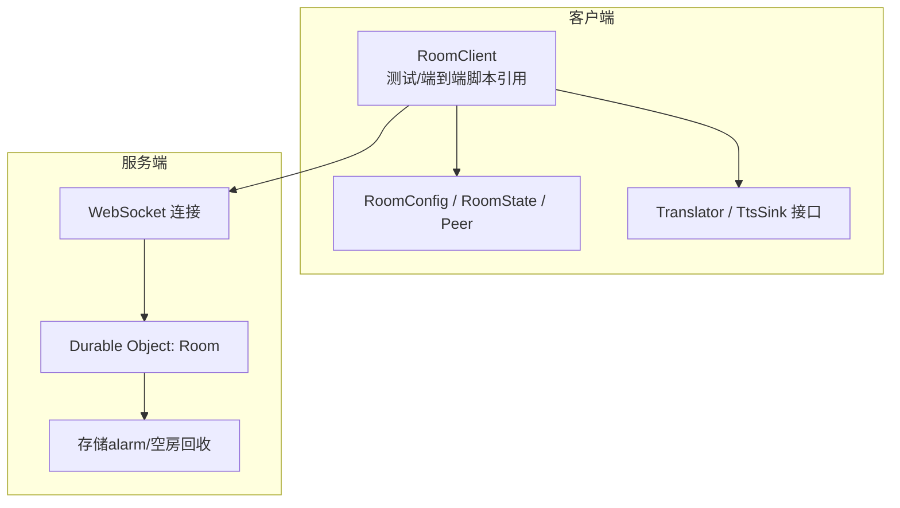
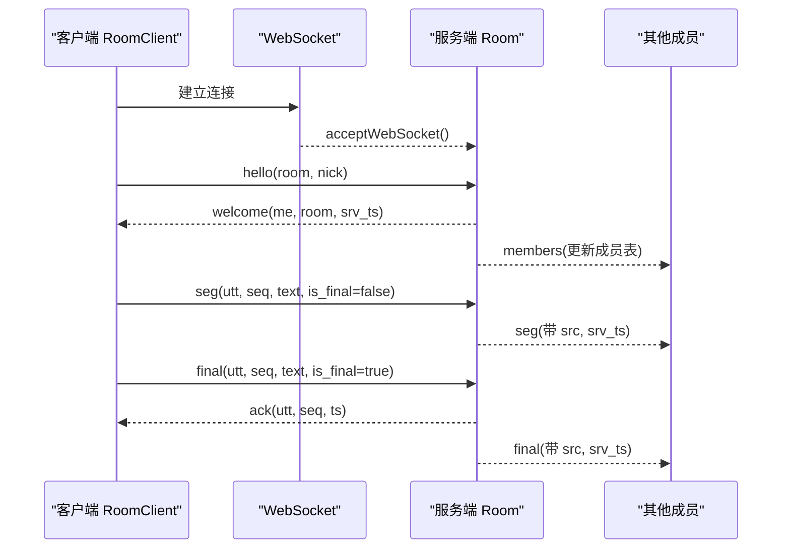
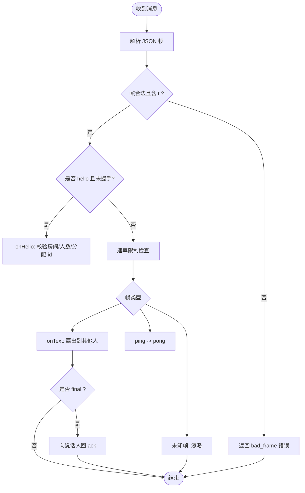
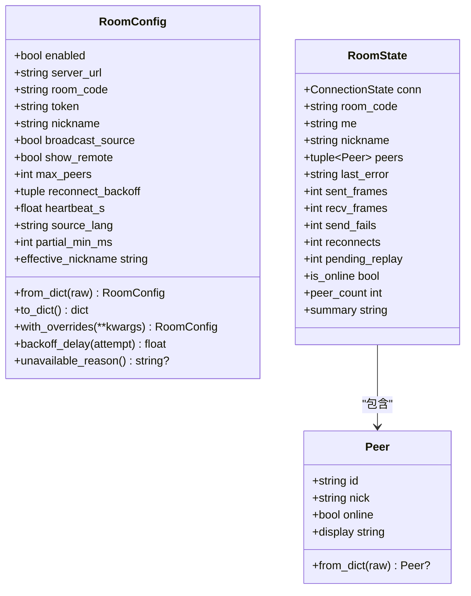
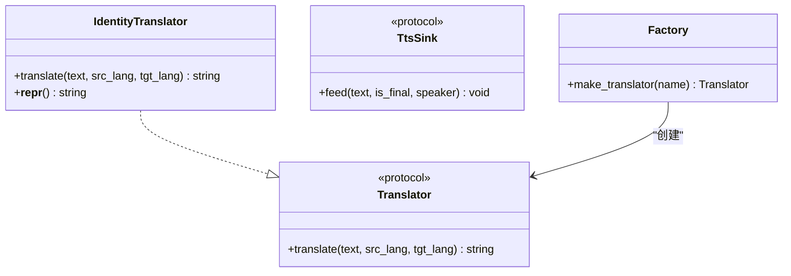
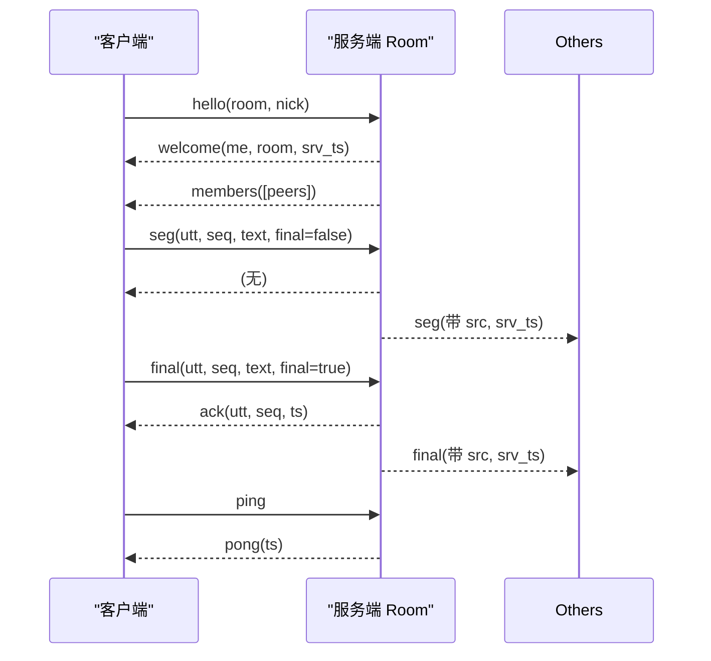
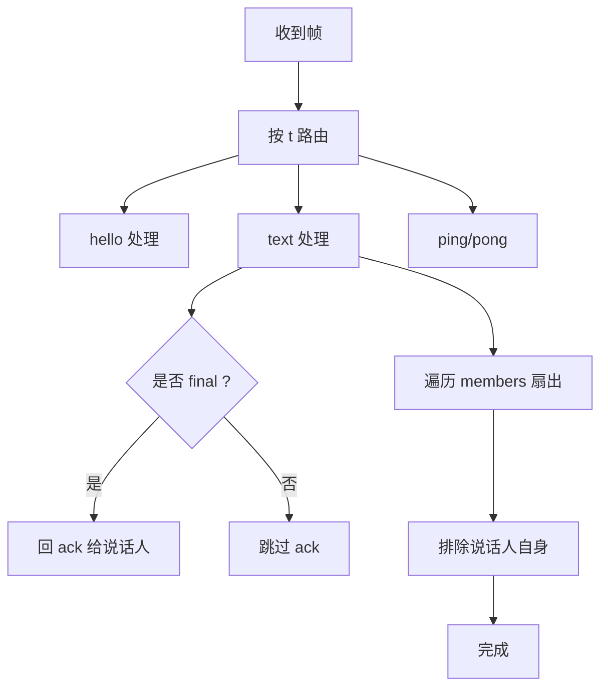
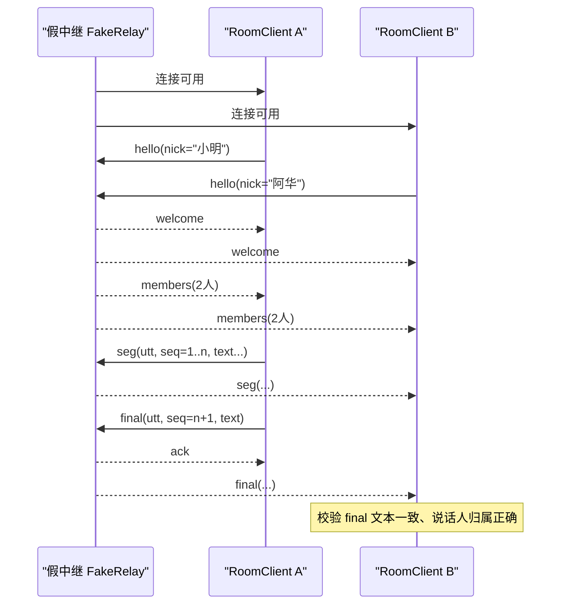
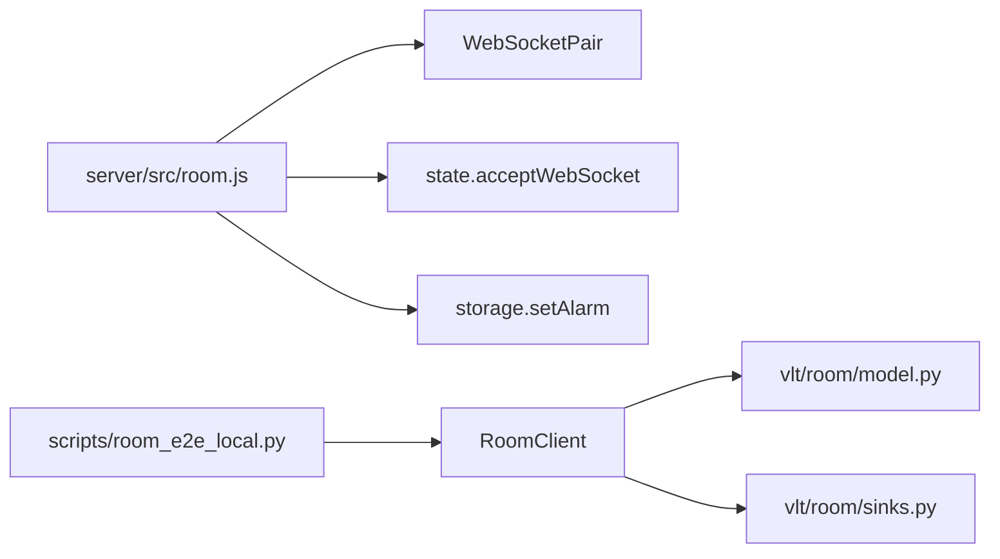

# 房间协作功能

<cite>
**本文引用的文件**   
- [README.md](file://README.md)
- [server/src/room.js](file://server/src/room.js)
- [vlt/room/model.py](file://vlt/room/model.py)
- [vlt/room/sinks.py](file://vlt/room/sinks.py)
- [scripts/room_e2e_local.py](file://scripts/room_e2e_local.py)
- [tests/test_room_client.py](file://tests/test_room_client.py)
- [config.example.yaml](file://config.example.yaml)
</cite>

## 目录
1. [引言](#引言)
2. [项目结构](#项目结构)
3. [核心组件](#核心组件)
4. [架构总览](#架构总览)
5. [详细组件分析](#详细组件分析)
6. [依赖关系分析](#依赖关系分析)
7. [性能考虑](#性能考虑)
8. [故障排查指南](#故障排查指南)
9. [结论](#结论)
10. [附录：配置与使用](#附录配置与使用)

## 引言
本技术文档聚焦“房间协作”能力：多人通过 WebSocket 进入同一房间，互相看到彼此的实时字幕。系统由两部分组成：
- 服务端：基于 Cloudflare Durable Object 的 Room 服务，负责成员管理、消息扇出、连接限速与空房回收。
- 客户端：Python 侧的 RoomClient（在测试与端到端脚本中引用），负责握手、心跳、重连、回放与状态同步。

该能力默认关闭，用户需在同一房间码下各自运行程序，即可在手腕屏或桌面字幕上看到彼此说的话；仅广播自己说出的文本，不转播游戏声音。

**章节来源**
- [README.md:28-46](file://README.md#L28-L46)

## 项目结构
房间协作相关代码主要分布在以下位置：
- 服务端实现：`server/src/room.js`
- 客户端数据模型与扩展点：`vlt/room/model.py`、`vlt/room/sinks.py`
- 端到端验证脚本：`scripts/room_e2e_local.py`
- 单元测试与假中继：`tests/test_room_client.py`
- 示例配置：`config.example.yaml`

**图表来源**
- [server/src/room.js:1-30](file://server/src/room.js#L1-L30)
- [vlt/room/model.py:140-220](file://vlt/room/model.py#L140-L220)
- [vlt/room/sinks.py:20-70](file://vlt/room/sinks.py#L20-L70)
- [scripts/room_e2e_local.py:39-41](file://scripts/room_e2e_local.py#L39-L41)

**章节来源**
- [server/src/room.js:1-30](file://server/src/room.js#L1-L30)
- [vlt/room/model.py:1-8](file://vlt/room/model.py#L1-L8)
- [vlt/room/sinks.py:1-14](file://vlt/room/sinks.py#L1-L14)
- [scripts/room_e2e_local.py:1-28](file://scripts/room_e2e_local.py#L1-L28)

## 核心组件
- 服务端 Room（Durable Object）
  - 成员表维护、即收即转扇出、final 帧 ACK、每连接限速、空房回收。
- 客户端 RoomClient（在测试与端到端脚本中引用）
  - 负责握手、心跳、断线重连、partial/final 回放、状态快照。
- 数据模型
  - RoomConfig：房间链路可配置项（启用开关、服务器地址、房间码、令牌、昵称、最大成员数、退避策略、心跳间隔、源语言、partial 节流等）。
  - RoomState：运行时快照（连接态、成员列表、统计指标、待 ack 句数等）。
  - Peer：房间成员信息（id、nick、online）。
- 扩展点
  - Translator/TtsSink：为未来多语言房间与语音输出预留接口，当前默认直通。

**章节来源**
- [server/src/room.js:1-30](file://server/src/room.js#L1-L30)
- [vlt/room/model.py:97-120](file://vlt/room/model.py#L97-L120)
- [vlt/room/model.py:140-220](file://vlt/room/model.py#L140-L220)
- [vlt/room/model.py:303-368](file://vlt/room/model.py#L303-L368)
- [vlt/room/sinks.py:20-70](file://vlt/room/sinks.py#L20-L70)

## 架构总览
房间协作采用“客户端—WebSocket—服务端 Room”的发布订阅模式：
- 客户端建立 WebSocket 连接后发送 hello 完成握手，获得 me 与房间信息。
- 客户端持续发送 partial（全量快照）与 final（定稿）帧；服务端对 final 回 ACK。
- 服务端将文本扇出给房间内其他成员，不回发给说话人自身。
- 服务端对每个连接进行 FPS 级限速，避免资源滥用。
- 空闲房间在宽限时间后自动清理存储。

**图表来源**
- [server/src/room.js:116-165](file://server/src/room.js#L116-L165)
- [server/src/room.js:167-192](file://server/src/room.js#L167-L192)
- [server/src/room.js:194-223](file://server/src/room.js#L194-L223)
- [scripts/room_e2e_local.py:88-124](file://scripts/room_e2e_local.py#L88-L124)

## 详细组件分析

### 服务端 Room（Durable Object）
职责边界清晰：
- 成员管理：懒恢复成员表，只把已握手的连接视为成员。
- 消息处理：hello 握手、seg/final 文本扇出、ping/pong 心跳、未知帧忽略。
- 限速策略：按连接维度固定 1 秒窗口计数，超限丢帧并返回非致命 err。
- 错误处理：致命错误码直接关闭连接，非致命错误仅提示。
- 生命周期：drop 时广播成员变化；空房 alarm 清理存储。

**图表来源**
- [server/src/room.js:116-165](file://server/src/room.js#L116-L165)
- [server/src/room.js:167-192](file://server/src/room.js#L167-L192)
- [server/src/room.js:194-223](file://server/src/room.js#L194-L223)
- [server/src/room.js:225-254](file://server/src/room.js#L225-L254)

**章节来源**
- [server/src/room.js:1-30](file://server/src/room.js#L1-L30)
- [server/src/room.js:67-114](file://server/src/room.js#L67-L114)
- [server/src/room.js:116-165](file://server/src/room.js#L116-L165)
- [server/src/room.js:167-223](file://server/src/room.js#L167-L223)
- [server/src/room.js:225-299](file://server/src/room.js#L225-L299)

### 客户端数据模型与状态
- RoomConfig
  - 提供健壮的配置解析：脏值留痕并回落默认，支持布尔/字符串/数字/序列等多种输入形态。
  - 关键字段：enabled、server_url、room_code、token、nickname、broadcast_source、show_remote、max_peers、reconnect_backoff、heartbeat_s、source_lang、partial_min_ms。
  - 派生属性：effective_nickname、backoff_delay、unavailable_reason。
- RoomState
  - 连接态枚举：IDLE、CONNECTING、ONLINE、RECONNECTING、STOPPED、ERROR。
  - 成员快照 peers（tuple）、统计 sent_frames/recv_frames/send_fails/reconnects/pending_replay。
  - 便捷方法：is_online、peer_count、summary。
- Peer
  - 成员信息：id、nick、online；from_dict 容错构造；display 显示名。

**图表来源**
- [vlt/room/model.py:140-220](file://vlt/room/model.py#L140-L220)
- [vlt/room/model.py:303-368](file://vlt/room/model.py#L303-L368)
- [vlt/room/model.py:108-138](file://vlt/room/model.py#L108-L138)

**章节来源**
- [vlt/room/model.py:1-8](file://vlt/room/model.py#L1-L8)
- [vlt/room/model.py:97-120](file://vlt/room/model.py#L97-L120)
- [vlt/room/model.py:140-220](file://vlt/room/model.py#L140-L220)
- [vlt/room/model.py:303-368](file://vlt/room/model.py#L303-L368)

### 扩展点：翻译与 TTS
- Translator 协议：定义 translate(text, src_lang, tgt_lang) → str，要求全量快照语义。
- IdentityTranslator：默认直通实现，同语言房间无需额外翻译。
- TtsSink 协议：定义 feed(text, is_final, speaker)，用于将来语音合成输出。
- make_translator：按名称选择实现，未知名称回落直通并留痕，确保房间失败不拖垮主链路。

**图表来源**
- [vlt/room/sinks.py:20-70](file://vlt/room/sinks.py#L20-L70)

**章节来源**
- [vlt/room/sinks.py:1-14](file://vlt/room/sinks.py#L1-L14)
- [vlt/room/sinks.py:20-70](file://vlt/room/sinks.py#L20-L70)

### WebSocket 协议与事件处理
- 帧类型常量：hello、welcome、members、seg、final、ack、ping、pong、err。
- 握手流程：客户端发 hello，服务端校验房间码与人数，分配成员 id，返回 welcome，并向全员广播 members。
- 文本广播：客户端发送 seg/final，服务端带上 src 与 srv_ts 扇出给其他成员；只对 final 回 ack。
- 心跳：客户端 ping，服务端 pong。
- 错误处理：err 帧携带 code/msg；致命错误码会关闭连接。

**图表来源**
- [server/src/room.js:22-33](file://server/src/room.js#L22-L33)
- [server/src/room.js:167-192](file://server/src/room.js#L167-L192)
- [server/src/room.js:194-223](file://server/src/room.js#L194-L223)
- [server/src/room.js:270-299](file://server/src/room.js#L270-L299)

**章节来源**
- [server/src/room.js:22-33](file://server/src/room.js#L22-L33)
- [server/src/room.js:167-223](file://server/src/room.js#L167-L223)
- [server/src/room.js:270-299](file://server/src/room.js#L270-L299)

### 发布订阅模式：路由、过滤与分发
- 路由：服务端根据帧类型分派到 onHello/onText/ping 处理函数。
- 过滤：onText 扇出时排除说话人自身，避免回声消除需求。
- 分发：遍历 members 列表，逐条发送；异常发送被捕获，不影响其他成员。
- 限速：对 seg/final/ping 进行每连接 FPS 限制，超限丢弃并返回 err。

**图表来源**
- [server/src/room.js:116-165](file://server/src/room.js#L116-L165)
- [server/src/room.js:194-223](file://server/src/room.js#L194-L223)
- [server/src/room.js:256-280](file://server/src/room.js#L256-L280)

**章节来源**
- [server/src/room.js:116-165](file://server/src/room.js#L116-L165)
- [server/src/room.js:194-223](file://server/src/room.js#L194-L223)
- [server/src/room.js:256-280](file://server/src/room.js#L256-L280)

### 端到端验证流程
端到端脚本验证整条链路：
- 启动本地假中继（复用测试中的 FakeRelay）。
- 启动两个 RoomClient（A/B），等待双方 ONLINE 且成员数为 2。
- A 发送若干 partial 与一个 final，B 必须收到一致的 final。
- 验证说话人归属、昵称、seq、lang、srv_ts 字段正确。
- 验证 A 不会收到自己的回声。
- 验证 final 被服务端 ack，pending_replay 归零。

**图表来源**
- [scripts/room_e2e_local.py:67-148](file://scripts/room_e2e_local.py#L67-L148)
- [tests/test_room_client.py:1-36](file://tests/test_room_client.py#L1-L36)

**章节来源**
- [scripts/room_e2e_local.py:1-28](file://scripts/room_e2e_local.py#L1-L28)
- [scripts/room_e2e_local.py:67-148](file://scripts/room_e2e_local.py#L67-L148)
- [tests/test_room_client.py:1-36](file://tests/test_room_client.py#L1-L36)

## 依赖关系分析
- 服务端依赖
  - WebSocketPair 与 state.acceptWebSocket：用于 Hibernation 托管连接，避免 CPU 占用与计费。
  - storage.setAlarm：空房回收的唯一允许定时机制。
- 客户端依赖
  - RoomClient（在测试与端到端脚本中引用）：负责连接、心跳、重连、回放与状态。
  - model.py：RoomConfig/RoomState/Peer 提供配置与状态抽象。
  - sinks.py：Translator/TtsSink 接口为未来扩展预留。

**图表来源**
- [server/src/room.js:100-114](file://server/src/room.js#L100-L114)
- [server/src/room.js:249-254](file://server/src/room.js#L249-L254)
- [scripts/room_e2e_local.py:39-41](file://scripts/room_e2e_local.py#L39-L41)
- [vlt/room/model.py:140-220](file://vlt/room/model.py#L140-L220)
- [vlt/room/sinks.py:20-70](file://vlt/room/sinks.py#L20-L70)

**章节来源**
- [server/src/room.js:100-114](file://server/src/room.js#L100-L114)
- [server/src/room.js:249-254](file://server/src/room.js#L249-L254)
- [scripts/room_e2e_local.py:39-41](file://scripts/room_e2e_local.py#L39-L41)
- [vlt/room/model.py:140-220](file://vlt/room/model.py#L140-L220)
- [vlt/room/sinks.py:20-70](file://vlt/room/sinks.py#L20-L70)

## 性能考虑
- 服务端限速
  - 每连接固定 1 秒窗口计数，超过 RATE_LIMIT_FPS 丢帧并返回 err，避免 DO CPU 过载。
- 帧大小限制
  - MAX_FRAME_BYTES 对齐客户端协议上限，防止超大帧影响稳定性。
- 空房回收
  - 使用 setAlarm 而非 setTimeout/setInterval，保证休眠不被阻止，节省成本。
- 客户端回放与心跳
  - pending_replay 跟踪未 ack 的句子，重连后补发；heartbeat_s 控制心跳频率，避免频繁重连。
- 配置弹性
  - reconnect_backoff 支持自定义退避表；partial_min_ms 控制 partial 节流，降低带宽与渲染压力。

[本节为通用性能指导，不直接分析具体文件]

## 故障排查指南
- 致命错误码
  - auth、room_full、bad_room、banned：服务端直接关闭连接，客户端应停止重连。
- 常见错误
  - bad_frame：JSON 非法或缺少 t 字段；检查客户端帧构造。
  - rate：超过每秒帧数限制；减少发送频率或增大 partial_min_ms。
  - 未握手：先发送 hello，再发送 seg/final。
- 连接与状态
  - ConnectionState.ERROR：查看 last_error 与 summary，定位问题。
  - peer_count 与 members 不一致：确认服务端广播 members 是否及时。
- 回放与 ACK
  - pending_replay > 0：确认服务端 final 是否返回 ack；若未 ack，重连后会重复发送。

**章节来源**
- [server/src/room.js:35-36](file://server/src/room.js#L35-L36)
- [server/src/room.js:116-165](file://server/src/room.js#L116-L165)
- [server/src/room.js:270-299](file://server/src/room.js#L270-L299)
- [vlt/room/model.py:328-368](file://vlt/room/model.py#L328-L368)

## 结论
房间协作功能通过清晰的职责划分与稳健的错误处理，实现了多人实时字幕共享：
- 服务端 Room 专注成员管理与消息扇出，具备限速与空房回收能力。
- 客户端通过 RoomClient 管理连接、心跳、重连与回放，配合 model.py 的状态快照与 sinks.py 的扩展点，便于后续扩展翻译与 TTS。
- 端到端脚本验证了从 partial 到 final 的完整链路，确保一致性、归属正确与无回声。

[本节为总结性内容，不直接分析具体文件]

## 附录：配置与使用
- 启用房间功能
  - 在 config.yaml 中添加 room 段，设置 server_url、room_code、token、nickname 等。
  - enabled 默认 False，需显式开启。
- 关键配置项
  - server_url：WebSocket 服务器地址（wss:// 或 ws://）。
  - room_code：8 位 Crockford Base32 房间码，两端必须一致。
  - token：进房令牌（服务端只存哈希）。
  - nickname：显示昵称，留空则取系统用户名。
  - broadcast_source/show_remote：是否广播本机 ASR 源文与显示远端条目。
  - max_peers：最大成员数（默认 8）。
  - reconnect_backoff：重连退避表（秒）。
  - heartbeat_s：心跳间隔（秒，0 表示不发）。
  - source_lang：源语言（本期恒 zh）。
  - partial_min_ms：partial 节流间隔（毫秒，0 不限流）。
- 使用步骤
  - 各参与者各自运行程序，填写相同 room_code。
  - 在界面“⚙ 设置 → 房间”中启用并连接。
  - 说话时，partial 逐步增长，final 定稿后对方可见。

**章节来源**
- [config.example.yaml:13-34](file://config.example.yaml#L13-L34)
- [vlt/room/model.py:140-220](file://vlt/room/model.py#L140-L220)
- [README.md:28-46](file://README.md#L28-L46)