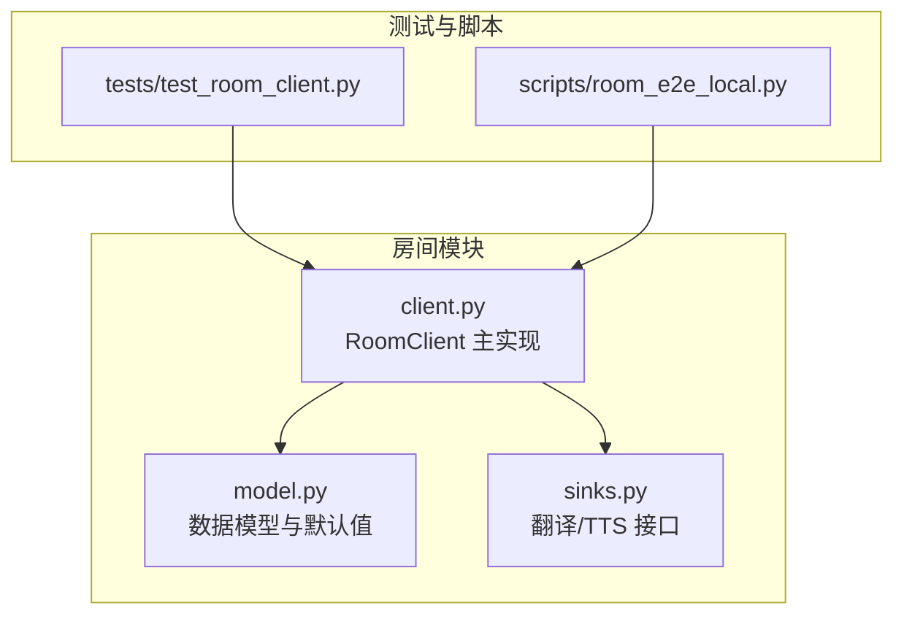
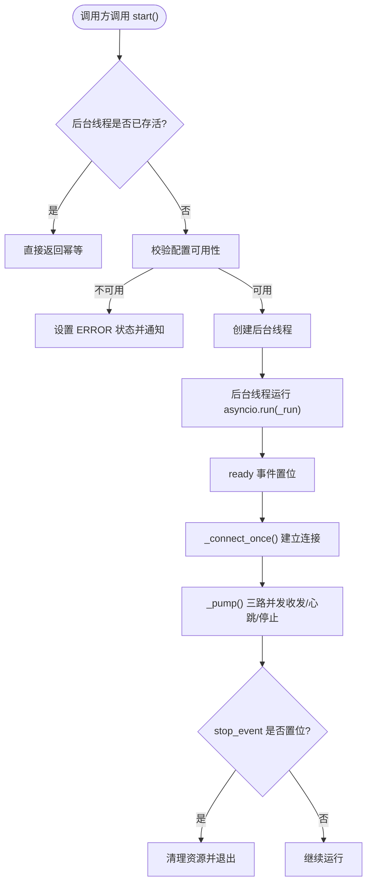
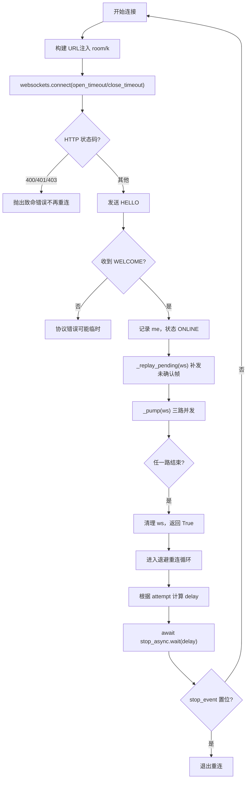
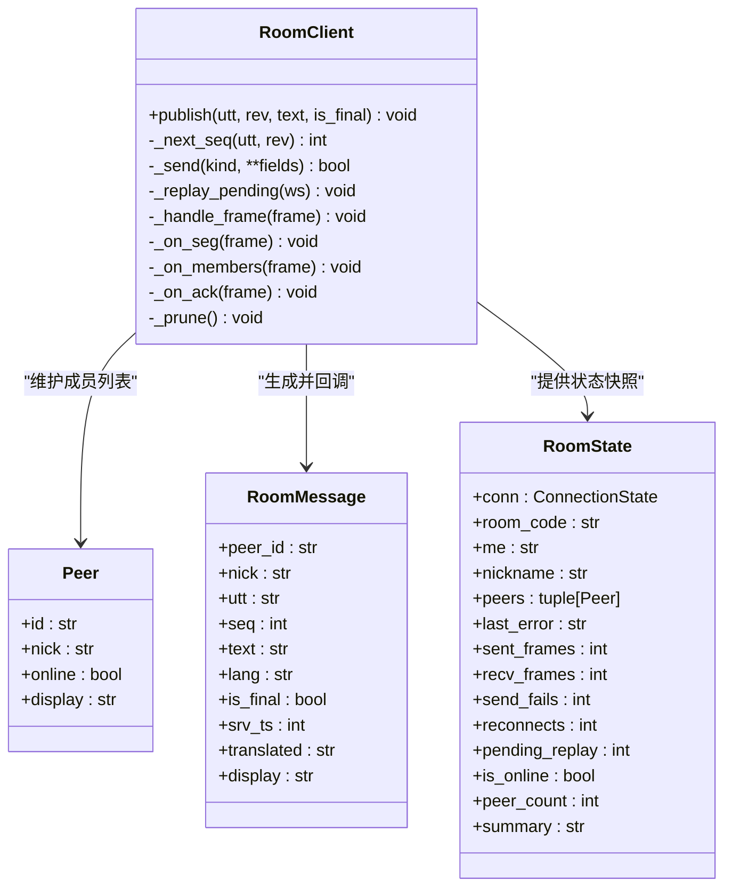
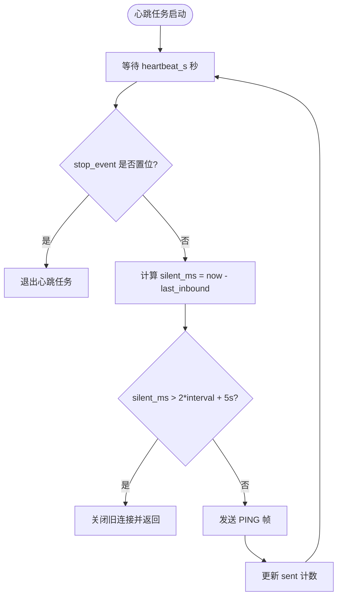
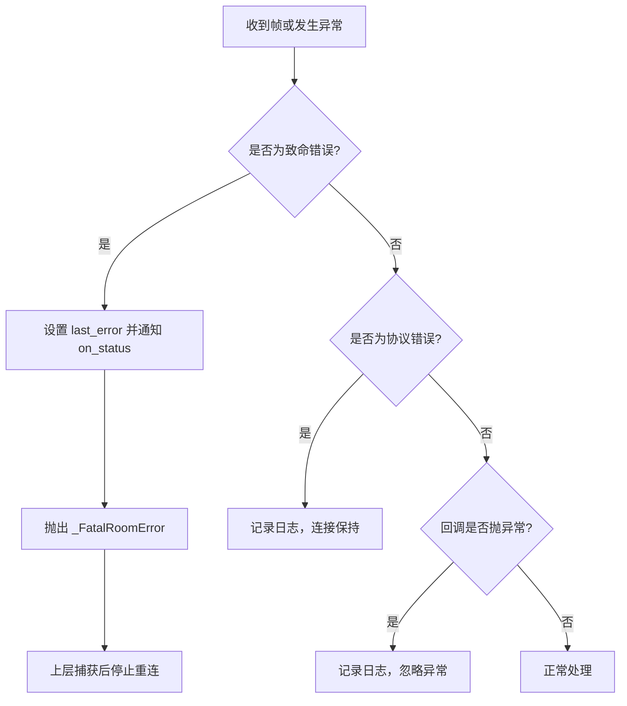
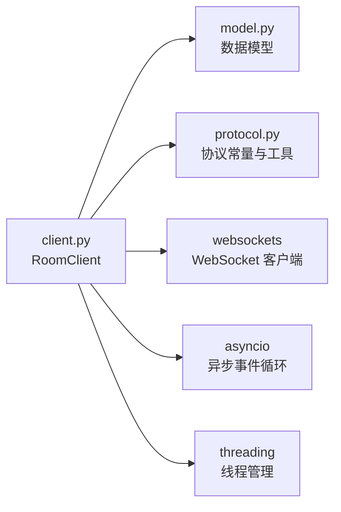

# 房间客户端管理

<cite>
**本文引用的文件**   
- [vlt/room/client.py](file://vlt/room/client.py)
- [vlt/room/model.py](file://vlt/room/model.py)
- [vlt/room/sinks.py](file://vlt/room/sinks.py)
- [tests/test_room_client.py](file://tests/test_room_client.py)
- [scripts/room_e2e_local.py](file://scripts/room_e2e_local.py)
</cite>

## 目录
1. [简介](#简介)
2. [项目结构](#项目结构)
3. [核心组件](#核心组件)
4. [架构总览](#架构总览)
5. [详细组件分析](#详细组件分析)
6. [依赖关系分析](#依赖关系分析)
7. [性能与调优](#性能与调优)
8. [故障排查指南](#故障排查指南)
9. [结论](#结论)

## 简介
本文件面向“房间客户端管理模块”，围绕 `RoomClient` 类给出完整技术文档。重点覆盖：
- 线程模型：后台 `asyncio` 事件循环 + 调用方线程（采集/GUI）
- WebSocket 连接生命周期：建连、握手、欢迎帧、成员列表、断线重连
- 消息发布订阅：文本增量传输、序列号管理、去重机制
- 心跳检测与健康监控
- 配置项说明：超时、退避策略、节流参数
- 错误处理与故障恢复：致命错误、HTTP 拒绝、协议错误、回调异常隔离

## 项目结构
房间相关代码集中在 `vlt/room` 包中，采用“数据模型 + 客户端实现 + 扩展接口”的分层组织：
- `model.py`：房间配置、成员、消息、连接状态等数据模型与默认值
- `client.py`：`RoomClient` 主实现，封装线程、WebSocket、协议编解码、重连、心跳、发布订阅
- `sinks.py`：翻译与 TTS 的扩展接口（本期为直通实现，预留未来接入点）



**图表来源**
- [vlt/room/client.py:1-36](file://vlt/room/client.py#L1-L36)
- [vlt/room/model.py:1-10](file://vlt/room/model.py#L1-L10)
- [vlt/room/sinks.py:1-14](file://vlt/room/sinks.py#L1-L14)
- [tests/test_room_client.py:1-40](file://tests/test_room_client.py#L1-L40)
- [scripts/room_e2e_local.py:1-40](file://scripts/room_e2e_local.py#L1-L40)

**章节来源**
- [vlt/room/client.py:1-36](file://vlt/room/client.py#L1-L36)
- [vlt/room/model.py:1-10](file://vlt/room/model.py#L1-L10)
- [vlt/room/sinks.py:1-14](file://vlt/room/sinks.py#L1-L14)

## 核心组件
- `RoomClient`：房间文本中继客户端，负责线程管理、WebSocket 生命周期、协议帧收发、重连退避、心跳检测、发布订阅与状态快照。
- `RoomConfig`：房间链路可配置项，包含 URL、房间码、令牌、昵称、广播开关、最大成员数、心跳间隔、partial 节流等。
- `Peer` / `RoomMessage` / `RoomState` / `ConnectionState`：运行态数据模型，用于成员、消息与连接状态展示。
- `Translator` / `TtsSink`：扩展接口，当前默认 `IdentityTranslator` 直通，便于后续接入真实翻译与语音合成。

**章节来源**
- [vlt/room/client.py:77-115](file://vlt/room/client.py#L77-L115)
- [vlt/room/model.py:97-159](file://vlt/room/model.py#L97-L159)
- [vlt/room/model.py:303-368](file://vlt/room/model.py#L303-L368)
- [vlt/room/sinks.py:20-47](file://vlt/room/sinks.py#L20-L47)

## 架构总览
`RoomClient` 采用“调用方线程 + 后台 asyncio 线程”的双线程模型：
- 调用方线程：负责 `publish()`、`stop()`、`state()` 等同步 API；不持有 WS 对象，避免重连后引用失效。
- 后台线程：运行一个独立的 `asyncio` 事件循环，执行 `_run()` 主循环，内部维护 `_connect_once()`、`_pump()`、`_recv_loop()`、`_beat()` 等协程。

```mermaid
sequenceDiagram
    participant Caller as "调用方线程"
    participant Client as "RoomClient"
    participant Loop as "后台_asyncio_事件循环"
    participant WS as "WebSocket_连接"
    participant Server as "房间服务端"
    
    Caller->>Client: "start()"
    Client->>Loop: "启动后台线程并创建事件循环"
    Loop->>Loop: "_run()_主循环"
    Loop->>Client: "_connect_once()"
    Client->>WS: "websockets.connect(url,_open_timeout,_close_timeout)"
    WS-->>Client: "连接成功"
    Client->>Server: "发送_HELLO(房间码/令牌/昵称/时间戳)"
    Server-->>Client: "返回_WELCOME(成员ID_me)"
    Client->>Loop: "_replay_pending(ws)"
    Loop->>Client: "_pump(ws)"
    
    par "三路并发"
        Loop->>Client: "_recv_loop(ws)"
        Loop->>Client: "_beat(ws)"
        Loop->>Client: "_stop_async.wait()"
    end
    
    alt "收到停止信号或断线"
        Client->>Loop: "退出_pump，进入退避重连"
    end
```

**图表来源**
- [vlt/room/client.py:126-155](file://vlt/room/client.py#L126-L155)
- [vlt/room/client.py:200-245](file://vlt/room/client.py#L200-L245)
- [vlt/room/client.py:288-350](file://vlt/room/client.py#L288-L350)
- [vlt/room/client.py:361-385](file://vlt/room/client.py#L361-L385)

## 详细组件分析

### 线程模型设计
- 后台线程通过 `threading.Thread` 启动，使用 `asyncio.run(self._run())` 运行独立事件循环。
- 调用方线程通过 `start()` 幂等启动；`stop()` 设置线程安全的 `stop_event`，并通过 `call_soon_threadsafe` 唤醒事件循环，确保快速退出。
- 所有对外回调（`on_message`、`on_status`）在房间线程上触发，要求实现方自行保证线程安全且快速返回。



**图表来源**
- [vlt/room/client.py:126-183](file://vlt/room/client.py#L126-L183)
- [vlt/room/client.py:192-245](file://vlt/room/client.py#L192-L245)

**章节来源**
- [vlt/room/client.py:126-183](file://vlt/room/client.py#L126-L183)
- [vlt/room/client.py:192-245](file://vlt/room/client.py#L192-L245)

### WebSocket 连接生命周期与自动重连
- 连接 URL 构建：将房间码与令牌注入查询串，尊重用户已在 `server_url` 中填写的参数。
- 握手流程：发送 `HELLO`，等待 `WELCOME`；若首帧非 `WELCOME` 或收到 `ERR`，则按致命错误或协议错误处理。
- 连接断开：`_pump()` 三路并发（接收、心跳、停止），任一结束即收摊；断线后进入退避重连循环。
- 重连策略：基于 `RoomConfig.backoff_delay(attempt)`，从退避表取延迟；成功连接后重置尝试计数。



**图表来源**
- [vlt/room/client.py:246-270](file://vlt/room/client.py#L246-L270)
- [vlt/room/client.py:288-350](file://vlt/room/client.py#L288-L350)
- [vlt/room/client.py:361-385](file://vlt/room/client.py#L361-L385)
- [vlt/room/client.py:200-245](file://vlt/room/client.py#L200-L245)

**章节来源**
- [vlt/room/client.py:246-270](file://vlt/room/client.py#L246-L270)
- [vlt/room/client.py:288-350](file://vlt/room/client.py#L288-L350)
- [vlt/room/client.py:361-385](file://vlt/room/client.py#L361-L385)
- [vlt/room/client.py:200-245](file://vlt/room/client.py#L200-L245)

### 消息发布订阅模式
- 发布端：`publish(utt, rev, text, is_final)` 线程安全，支持 partial 节流与 seq 严格递增。
- 存储与回放：未确认帧保存在 `_replay`，重连后仅补发 final 与每个未完成句的最新 partial。
- 接收端：`_handle_frame()` 分派到 `_on_seg()`、`_on_members()`、`_on_ack()` 等处理器。
- 去重机制：`apply_seg()` 与 `_seen_finals` 集合共同实现乱序/重复/迟到帧过滤。



**图表来源**
- [vlt/room/client.py:441-593](file://vlt/room/client.py#L441-L593)
- [vlt/room/model.py:108-138](file://vlt/room/model.py#L108-L138)
- [vlt/room/model.py:303-368](file://vlt/room/model.py#L303-L368)

**章节来源**
- [vlt/room/client.py:441-593](file://vlt/room/client.py#L441-L593)
- [vlt/room/model.py:108-138](file://vlt/room/model.py#L108-L138)
- [vlt/room/model.py:303-368](file://vlt/room/model.py#L303-L368)

### 心跳检测算法与连接健康监控
- 应用层心跳：定时发送 `PING`，若超过两个心跳周期加 5 秒宽限仍未收到任何入站帧，判定连接死锁并主动关闭。
- 健康指标：`_last_inbound` 记录最近一次入站时间，结合 `heartbeat_s` 配置判断超时。
- 失败处理：心跳发送失败会触发重连路径，同时记录日志与状态回调。



**图表来源**
- [vlt/room/client.py:407-438](file://vlt/room/client.py#L407-L438)

**章节来源**
- [vlt/room/client.py:407-438](file://vlt/room/client.py#L407-L438)

### 配置选项说明
- `enabled`：是否启用房间链路（默认 False）。
- `server_url`：WebSocket 服务端地址（必须以 `ws://` 或 `wss://` 开头）。
- `room_code`：8 位 Crockford Base32 房间码。
- `token`：进房令牌（服务端只存哈希）。
- `nickname`：显示昵称（空时取系统用户名）。
- `broadcast_source`：是否广播本机 ASR 源文（默认 True）。
- `show_remote`：是否在手腕屏显示远端条目（默认 True）。
- `max_peers`：最大成员数（默认 8）。
- `reconnect_backoff`：重连退避表（默认 `[2.0, 5.0, 10.0, 30.0]`）。
- `heartbeat_s`：心跳间隔（默认 20.0，0 表示不发心跳）。
- `source_lang`：源语言（默认 "zh"）。
- `partial_min_ms`：partial 节流最小间隔（默认 200ms，0 表示不限流）。

**章节来源**
- [vlt/room/model.py:140-219](file://vlt/room/model.py#L140-L219)
- [vlt/room/model.py:87-95](file://vlt/room/model.py#L87-L95)

### 错误处理策略与故障恢复
- 致命错误：HTTP 400/401/403 或协议中的致命码，直接抛 `_FatalRoomError`，不再重连。
- 协议错误：非致命错误（如未知帧类型、解析失败）仅记录日志，连接保持。
- 回调异常隔离：`on_message` 与 `on_status` 抛异常不会打断房间线程。
- 离线丢帧处理：未连接时 `publish()` 会记录丢弃计数，重连后补发。



**图表来源**
- [vlt/room/client.py:52-63](file://vlt/room/client.py#L52-L63)
- [vlt/room/client.py:352-359](file://vlt/room/client.py#L352-L359)
- [vlt/room/client.py:596-624](file://vlt/room/client.py#L596-L624)
- [vlt/room/client.py:647-655](file://vlt/room/client.py#L647-L655)
- [vlt/room/client.py:719-729](file://vlt/room/client.py#L719-L729)

**章节来源**
- [vlt/room/client.py:52-63](file://vlt/room/client.py#L52-L63)
- [vlt/room/client.py:352-359](file://vlt/room/client.py#L352-L359)
- [vlt/room/client.py:596-624](file://vlt/room/client.py#L596-L624)
- [vlt/room/client.py:647-655](file://vlt/room/client.py#L647-L655)
- [vlt/room/client.py:719-729](file://vlt/room/client.py#L719-L729)

## 依赖关系分析
`RoomClient` 依赖以下模块与外部库：
- 内部依赖：`model.py`（数据模型）、`protocol.py`（协议编解码与常量，虽未在仓库结构中列出，但被 client.py 导入）
- 外部依赖：`websockets`（WebSocket 客户端库）、`asyncio`（异步事件循环）、`threading`（线程管理）



**图表来源**
- [vlt/room/client.py:24-35](file://vlt/room/client.py#L24-L35)
- [vlt/room/model.py:1-18](file://vlt/room/model.py#L1-L18)

**章节来源**
- [vlt/room/client.py:24-35](file://vlt/room/client.py#L24-L35)
- [vlt/room/model.py:1-18](file://vlt/room/model.py#L1-L18)

## 性能与调优
- 连接超时：`CONNECT_TIMEOUT_S=10.0`，`WELCOME_TIMEOUT_S=10.0`，可通过修改常量调整。
- 心跳间隔：`heartbeat_s` 建议设置为 20-60 秒，避免过短造成网络压力或过长导致掉线检测慢。
- Partial 节流：`partial_min_ms` 控制增量文本发送频率，建议 200-500ms，平衡实时性与带宽。
- 重连退避：`reconnect_backoff` 可自定义退避表，避免雪崩式重连。
- 内存上限：`REPLAY_MAX=64`、`SEEN_FINALS_MAX=512`、`STORE_MAX=256` 防止长时间挂机导致内存增长。

**章节来源**
- [vlt/room/client.py:40-44](file://vlt/room/client.py#L40-L44)
- [vlt/room/model.py:87-95](file://vlt/room/model.py#L87-L95)
- [vlt/room/model.py:212-218](file://vlt/room/model.py#L212-L218)
- [vlt/room/client.py:579-593](file://vlt/room/client.py#L579-L593)

## 故障排查指南
- 无法连接：检查 `server_url` 是否以 `ws://` 或 `wss://` 开头，`room_code` 是否为合法 8 位 Base32。
- 鉴权失败：确认 `token` 与服务端 `ROOM_TOKEN_HASH` 一致，或移除 `k=` 参数。
- 心跳超时：检查网络连通性，适当增大 `heartbeat_s` 或降低 `partial_min_ms`。
- 消息丢失：查看 `pending_replay` 计数，确认重连后是否补发成功。
- 回调异常：检查 `on_message` 与 `on_status` 实现，避免阻塞或抛异常。

**章节来源**
- [vlt/room/model.py:254-267](file://vlt/room/model.py#L254-L267)
- [vlt/room/client.py:407-438](file://vlt/room/client.py#L407-L438)
- [vlt/room/client.py:677-686](file://vlt/room/client.py#L677-L686)

## 结论
`RoomClient` 通过清晰的线程模型、健壮的 WebSocket 生命周期管理、智能的重连退避策略、以及完善的错误处理机制，为房间文本中继提供了稳定可靠的实现。其模块化设计便于扩展翻译与 TTS 功能，同时通过配置项提供灵活的调优空间，适用于多种网络环境与业务场景。