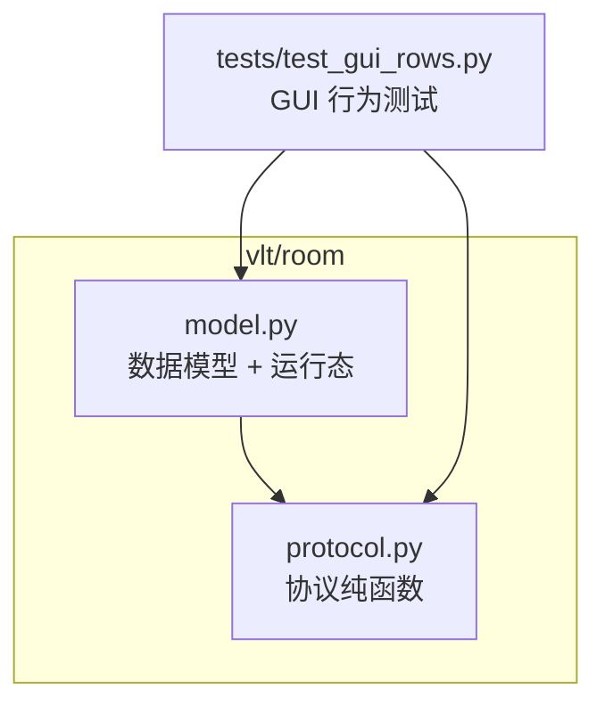
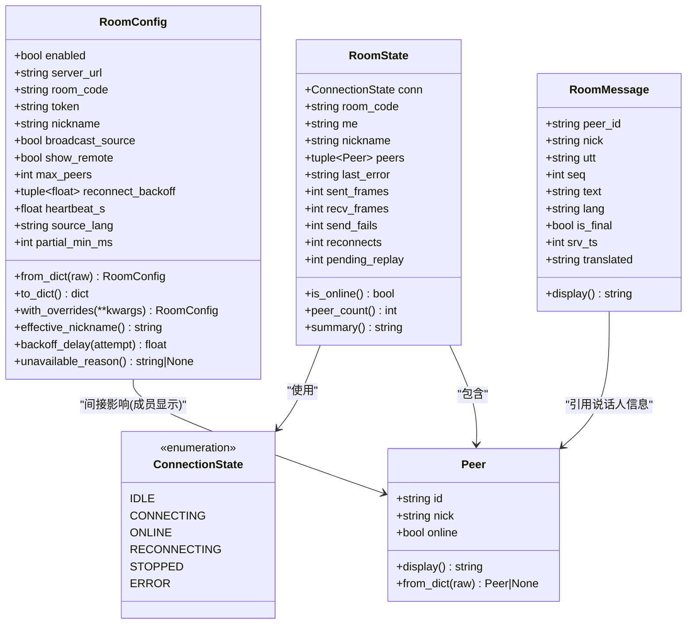
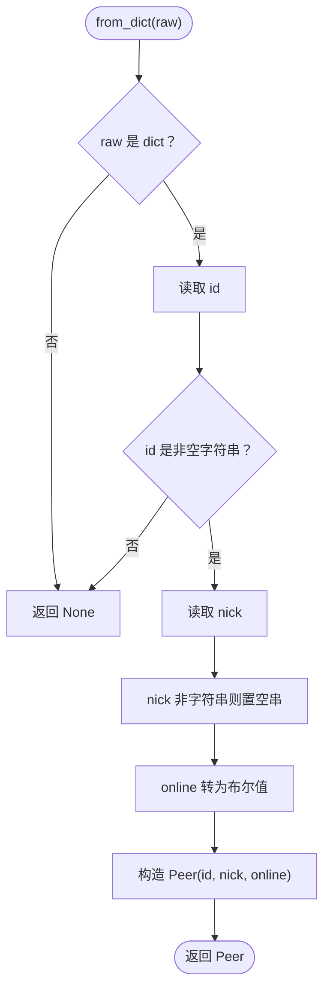
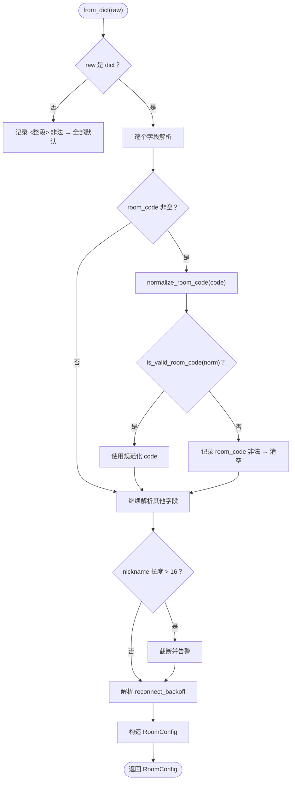
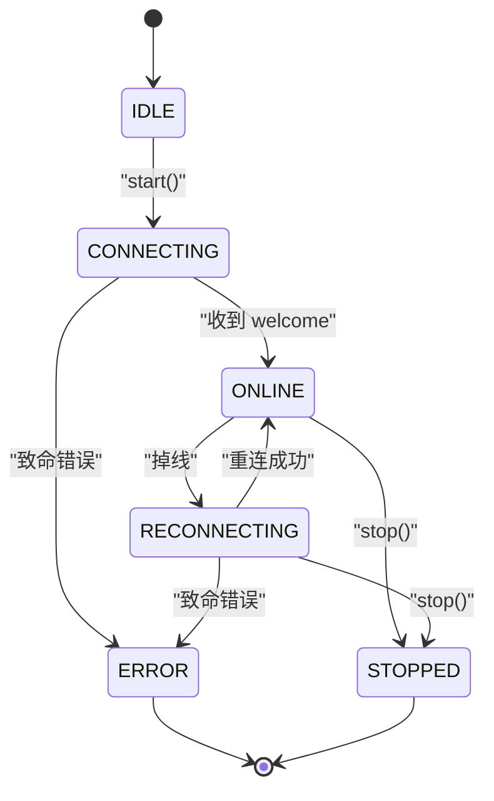
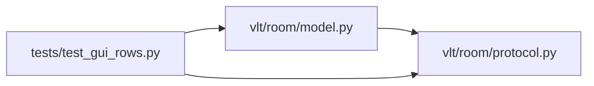

# 房间数据模型

<cite>
**本文引用的文件**   
- [model.py](file://vlt/room/model.py)
- [protocol.py](file://vlt/room/protocol.py)
- [test_gui_rows.py](file://tests/test_gui_rows.py)
</cite>

## 目录
1. [引言](#引言)
2. [项目结构](#项目结构)
3. [核心组件](#核心组件)
4. [架构总览](#架构总览)
5. [详细组件分析](#详细组件分析)
6. [依赖关系分析](#依赖关系分析)
7. [性能与并发考虑](#性能与并发考虑)
8. [故障排查指南](#故障排查指南)
9. [结论](#结论)

## 引言
本技术文档聚焦“房间数据模型模块”，目标是把房间协作中的核心数据结构讲清楚：Peer（对端用户）、RoomConfig（房间配置）、RoomMessage（房间消息）和 ConnectionState（连接状态枚举）。文档不仅解释字段定义、验证规则和业务含义，还说明房间状态管理机制（在线状态、成员列表维护、消息队列语义）、数据模型之间的关联与依赖、序列化与反序列化实现方式，以及数据完整性与并发访问安全方面的设计取舍。

该模块位于 `vlt/room` 包中，其中 `model.py` 承载数据模型与运行态快照，`protocol.py` 提供协议层纯函数（帧编解码、房间码校验、乱序自愈、partial 节流等），测试用例在 `tests/test_gui_rows.py` 中覆盖部分 GUI 交互行为。

## 项目结构
房间数据模型相关代码集中在以下两个文件：
- `vlt/room/model.py`：定义 Peer、RoomConfig、RoomMessage、RoomState、ConnectionState 等数据模型，并提供统一的日志与脏值回落逻辑。
- `vlt/room/protocol.py`：定义房间中继协议的纯函数，包括房间码生成与校验、JSON 帧编解码、乱序自愈、final 幂等去重、partial 合并与节流。

**图表来源**
- [model.py:1-18](file://vlt/room/model.py#L1-L18)
- [protocol.py:1-17](file://vlt/room/protocol.py#L1-L17)
- [test_gui_rows.py:177-209](file://tests/test_gui_rows.py#L177-L209)

**章节来源**
- [model.py:1-18](file://vlt/room/model.py#L1-L18)
- [protocol.py:1-17](file://vlt/room/protocol.py#L1-L17)
- [test_gui_rows.py:177-209](file://tests/test_gui_rows.py#L177-L209)

## 核心组件
本节概述四个核心数据模型及其职责：
- ConnectionState：描述房间连接的有限状态机，用于 UI 状态栏与日志展示。
- Peer：表示房间中的一个成员，包含服务端 id、昵称与在线标志。
- RoomConfig：房间链路的全部可配置项，负责从 YAML 安全构造、校验、回写。
- RoomMessage：远端成员的一句话，作为上层渲染与未来翻译/TTS 的输入。
- RoomState：运行时快照，封装连接状态、成员列表与统计指标，供 GUI 线程只读消费。

这些模型共同构成“配置 → 运行态 → 消息”的数据流：RoomConfig 决定能否连接；连接后产生 ConnectionState 与成员列表；远端语音转文本后以 RoomMessage 形式进入上层。

**章节来源**
- [model.py:97-138](file://vlt/room/model.py#L97-L138)
- [model.py:140-267](file://vlt/room/model.py#L140-L267)
- [model.py:303-367](file://vlt/room/model.py#L303-L367)

## 架构总览
下图展示了房间数据模型与协议层的整体关系：RoomConfig 通过 protocol 提供的房间码工具进行校验；连接建立后，ConnectionState 驱动状态变化；成员列表由 members 帧解析为 Peer；消息流通过 protocol 的 apply_seg / should_accept_final / merge_segment 等函数完成乱序自愈与 final 幂等处理，最终形成 RoomMessage 给上层使用。

**图表来源**
- [model.py:97-138](file://vlt/room/model.py#L97-L138)
- [model.py:140-267](file://vlt/room/model.py#L140-L267)
- [model.py:303-367](file://vlt/room/model.py#L303-L367)

## 详细组件分析

### ConnectionState（连接状态枚举）
ConnectionState 是房间连接的生命周期抽象，继承 str 以便直接用于 GUI 状态栏与日志格式化。其状态包括：
- IDLE：尚未 start()。
- CONNECTING：首次连接中。
- ONLINE：已收到 welcome，能收发。
- RECONNECTING：掉线后退避重连中。
- STOPPED：主动 stop()。
- ERROR：致命错误（鉴权失败/房间满），不再重连。

业务含义：
- 驱动 UI 文案与按钮状态（例如“连接房间/断开连接”）。
- 决定是否允许发送消息或触发重连策略。
- 与 RoomState.summary 配合输出统一的状态行。

**章节来源**
- [model.py:97-106](file://vlt/room/model.py#L97-L106)
- [model.py:356-367](file://vlt/room/model.py#L356-L367)

### Peer（对端用户模型）
Peer 表示房间中的一个成员，字段如下：
- id：服务端分配的 p_xxxxxx 类型标识。
- nick：显示用昵称，空串时退回到 id。
- online：服务端告知的在线标志；掉线成员会保留一段时间，重连后 id 可能变化。

关键方法：
- from_dict：从 members 帧的一项构造；若原始数据非法则返回 None，调用方跳过。
- display：优先显示昵称，否则显示 id，用于手腕屏等窄屏场景。

验证规则：
- id 必须是非空字符串。
- nick 若非字符串则置为空串。
- online 强制转为布尔值，默认 True。

业务含义：
- 成员列表维护的基础单元。
- 与 RoomState.peers 一起计算在线人数。
- 与 RoomMessage.nick 配合显示“谁在说”。

**图表来源**
- [model.py:121-132](file://vlt/room/model.py#L121-L132)

**章节来源**
- [model.py:108-138](file://vlt/room/model.py#L108-L138)

### RoomConfig（房间配置模型）
RoomConfig 对应 config.yaml 的 room 段，字段包括：
- enabled：是否启用房间链路（默认 False）。
- server_url：WebSocket 服务器地址（ws:// 或 wss://）。
- room_code：8 位 Crockford Base32 房间码；空表示未进房。
- token：进房令牌（服务端仅存哈希）。
- nickname：显示昵称；空时取系统用户名。
- broadcast_source：是否广播本机 ASR 源文。
- show_remote：远端条目是否在手腕屏显示。
- max_peers：最大成员数（默认 8）。
- reconnect_backoff：重连退避表（默认 (2.0, 5.0, 10.0, 30.0)）。
- heartbeat_s：心跳间隔（秒），0 表示不发心跳。
- source_lang：源语言（本期恒 zh）。
- partial_min_ms：partial 节流间隔（毫秒），0 表示不限流。

构造与序列化：
- from_dict：从 YAML 解出的 dict 构造，任何脏输入都不抛异常；缺字段用默认，类型错/越界打一行警告并回落默认。
- to_dict：写回 YAML 用的纯 dict（tuple→list）。
- with_overrides：复制并覆盖若干字段，不改原对象。

派生属性与方法：
- effective_nickname：实际使用的昵称；配置留空则取系统用户名，最多截断到 NICK_MAX_CHARS。
- backoff_delay(attempt)：第 attempt 次重连前等待多久；超出退避表停在最后一档。
- unavailable_reason()：不可用原因；None 表示可以连；否则给出人能读懂的原因。

房间码与昵称验证：
- room_code：先 normalize_room_code，再 is_valid_room_code；非法则清空并告警。
- nickname：超过长度限制则截断并告警。

数字与范围校验：
- _as_int/_as_float/_num：严格类型检查与范围夹持；NaN/inf/非整数（对整型）均视为非法。
- reconnect_backoff：只接受非负数字序列；脏项丢弃，全脏回落默认。

**图表来源**
- [model.py:163-219](file://vlt/room/model.py#L163-L219)
- [model.py:270-297](file://vlt/room/model.py#L270-L297)

**章节来源**
- [model.py:87-95](file://vlt/room/model.py#L87-L95)
- [model.py:140-267](file://vlt/room/model.py#L140-L267)
- [model.py:270-297](file://vlt/room/model.py#L270-L297)

### RoomMessage（房间消息模型）
RoomMessage 表示远端成员的一句话，字段如下：
- peer_id：说话人的服务端 id。
- nick：说话人昵称。
- utt：语句标识（与 src 组合用于去重）。
- seq：句内递增序号，用于乱序自愈。
- text：全量快照（覆盖式，不是增量）。
- lang：语言（默认 source_lang）。
- is_final：是否定稿。
- srv_ts：服务端时间戳。
- translated：译文（本期恒为空串，预留接口）。

关键方法：
- display：有译文用译文，否则用原文（本期=原文）。

业务含义：
- 交给上层进入手腕屏或未来的翻译/TTS 管线。
- 与 protocol.apply_seg 的输出结合，保证最终呈现稳定且幂等。

**章节来源**
- [model.py:303-325](file://vlt/room/model.py#L303-L325)

### RoomState（运行态快照）
RoomState 是 RoomClient.state() 返回的快照，字段包括：
- conn：当前 ConnectionState。
- room_code：当前房间码。
- me：本地成员 id。
- nickname：本地昵称。
- peers：成员列表（tuple[Peer,...]）。
- last_error：最近一次错误信息。
- sent_frames/recv_frames/send_fails/reconnects/pending_replay：统计与待补发计数。

派生属性：
- is_online：conn 是否为 ONLINE。
- peer_count：在线人数（含自己）。
- summary：一行状态文案，统一 GUI 状态栏与日志口径。

并发安全要点：
- peers 使用 tuple 而非 list，避免后台线程修改导致 GUI 线程竞态。
- 快照本身是值拷贝，调用方持有不会被后台线程改。

**图表来源**
- [model.py:97-106](file://vlt/room/model.py#L97-L106)
- [model.py:328-367](file://vlt/room/model.py#L328-L367)

**章节来源**
- [model.py:328-367](file://vlt/room/model.py#L328-L367)

## 依赖关系分析
- model.py 依赖 protocol.py 的房间码工具（ROOM_CODE_LEN、is_valid_room_code、normalize_room_code）。
- test_gui_rows.py 依赖 model.py 的 RoomConfig 与 ConnectionState，用于模拟 GUI 行为与状态切换。
- protocol.py 提供纯函数，不依赖网络 IO 与全局状态，便于单测与复用。

**图表来源**
- [model.py:17-17](file://vlt/room/model.py#L17-L17)
- [protocol.py:1-17](file://vlt/room/protocol.py#L1-L17)
- [test_gui_rows.py:177-209](file://tests/test_gui_rows.py#L177-L209)

**章节来源**
- [model.py:17-17](file://vlt/room/model.py#L17-L17)
- [protocol.py:1-17](file://vlt/room/protocol.py#L1-L17)
- [test_gui_rows.py:177-209](file://tests/test_gui_rows.py#L177-L209)

## 性能与并发考虑
- 配置解析的性能：RoomConfig.from_dict 对每个字段做轻量归一化与范围检查，避免在运行时动态解析造成额外开销。
- 成员列表的并发安全：RoomState.peers 使用 tuple，快照交给 GUI 线程只读，避免后台线程修改导致的竞态。
- 消息处理的幂等与乱序自愈：protocol.should_accept_final 保证 final 只生效一次；should_accept 与 merge_segment 确保 partial 只覆盖、不回退。
- partial 节流：should_send_partial 控制发送频率，避免高并发下服务端限速导致 final 被挤掉。

建议优化点：
- 对于高频 partial，可在应用层缓存 prev_text 与 prev_ms，减少重复计算。
- 对 peers 列表的更新采用不可变替换（replace 或新 tuple），进一步降低锁竞争。

**章节来源**
- [model.py:328-367](file://vlt/room/model.py#L328-L367)
- [protocol.py:188-287](file://vlt/room/protocol.py#L188-L287)

## 故障排查指南
常见问题与定位思路：
- 无法连接房间：
  - 检查 RoomConfig.unavailable_reason() 返回的原因，常见为 server_url 缺失或格式不对、room_code 为空或非法。
  - 确认 ConnectionState 是否停留在 CONNECTING 或 ERROR；ERROR 通常意味着致命错误（如鉴权失败/房间满）。
- 成员列表异常：
  - 检查 members 帧解析是否成功；Peer.from_dict 对脏数据返回 None，调用方应跳过。
  - 核对 RoomState.peer_count 是否与 UI 显示一致。
- 消息重复或回退：
  - 确认 protocol.should_accept_final 与 should_accept 是否按预期工作；final 去重与 partial 只接受更高 seq。
  - 检查 RoomMessage.display 是否被 translated 覆盖（本期为空）。

调试建议：
- 使用 model.log 输出的带时间戳日志，定位重连间隔与错误发生时机。
- 在测试中模拟不同 ConnectionState 与 RoomConfig 组合，验证 GUI 行为是否符合预期。

**章节来源**
- [model.py:20-33](file://vlt/room/model.py#L20-L33)
- [model.py:254-267](file://vlt/room/model.py#L254-L267)
- [model.py:121-132](file://vlt/room/model.py#L121-L132)
- [protocol.py:211-223](file://vlt/room/protocol.py#L211-L223)
- [protocol.py:188-195](file://vlt/room/protocol.py#L188-L195)

## 结论
房间数据模型模块通过清晰的数据结构与严格的验证规则，确保了房间协作的稳定性和可维护性。Peer、RoomConfig、RoomMessage 与 ConnectionState 各司其职，RoomState 提供安全的运行态快照。协议层纯函数保证了消息处理的幂等性与乱序自愈能力。整体设计兼顾了性能、并发安全与用户体验，适合在 VRChat 实时同传场景中扩展与演进。