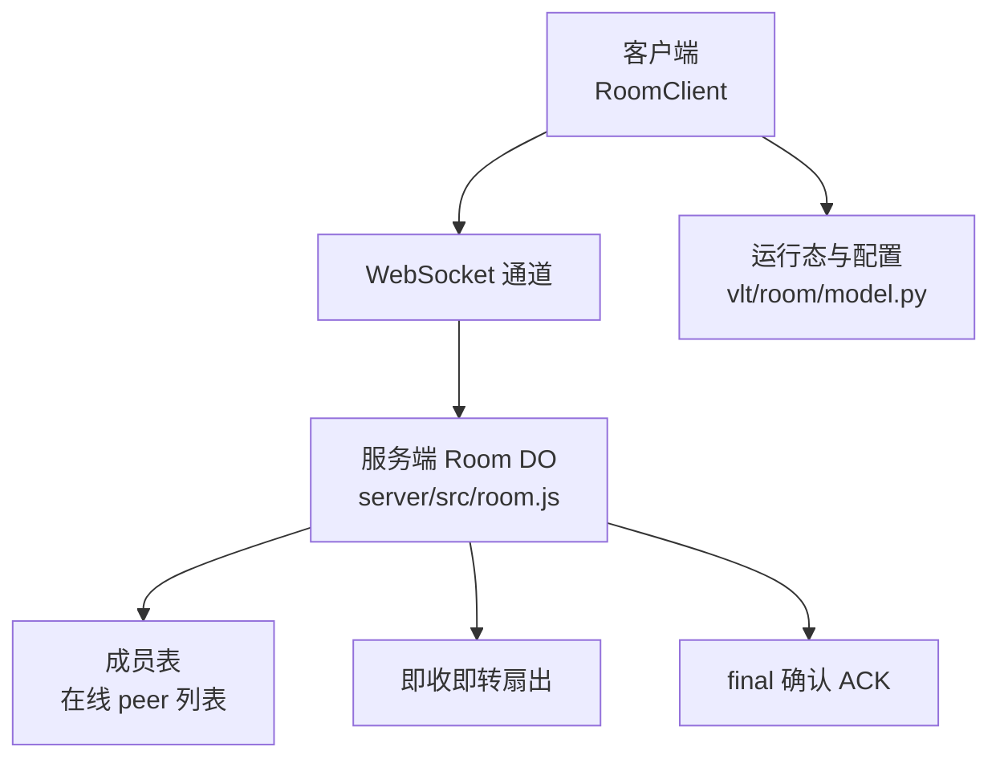
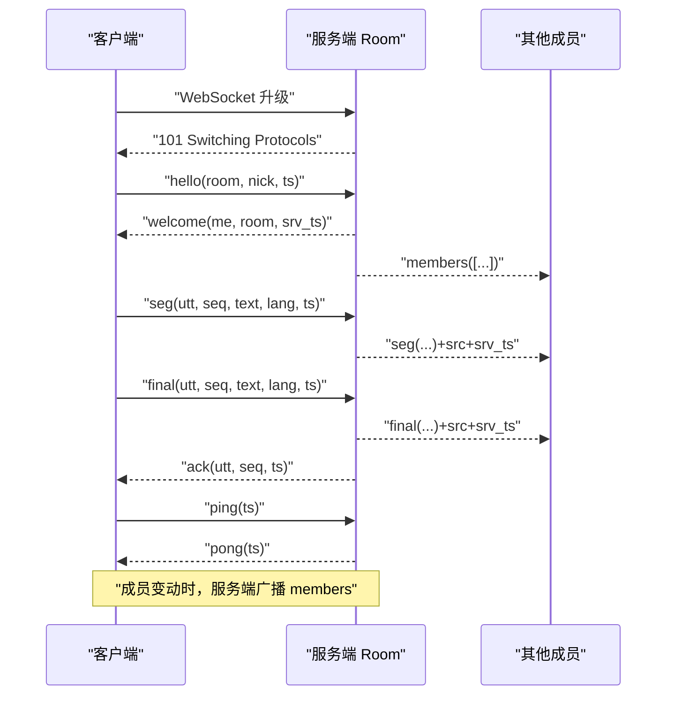
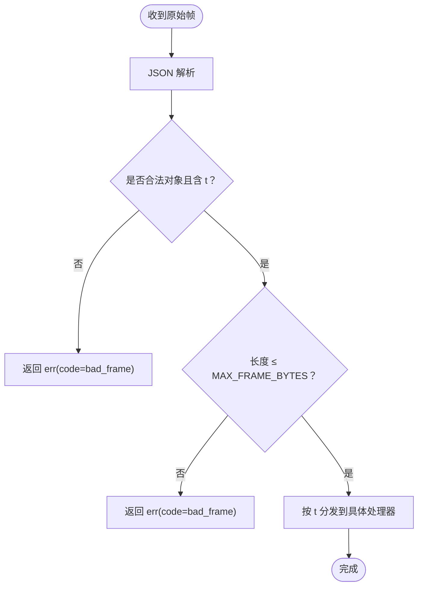
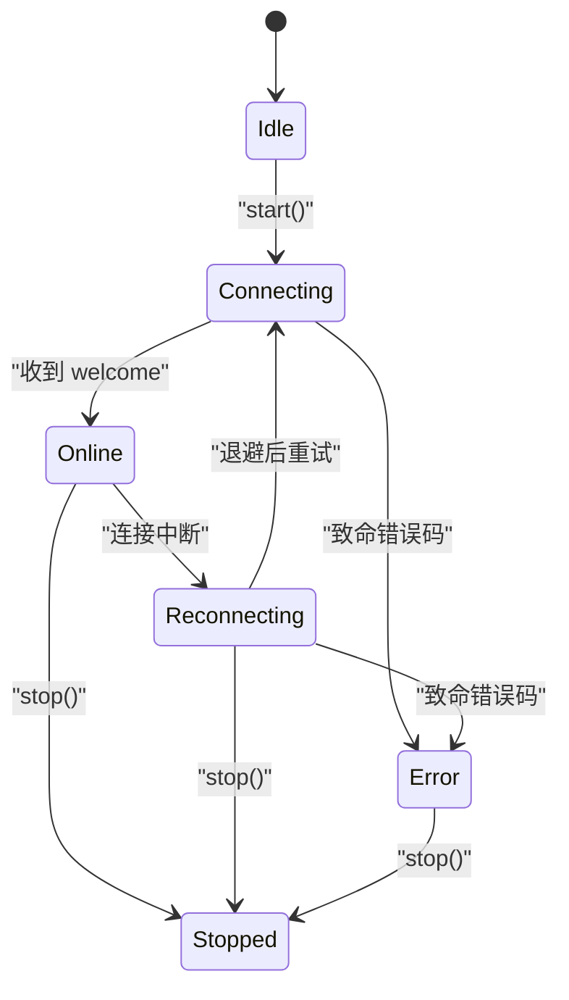
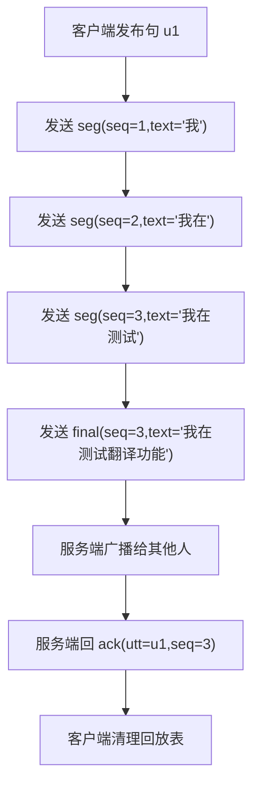
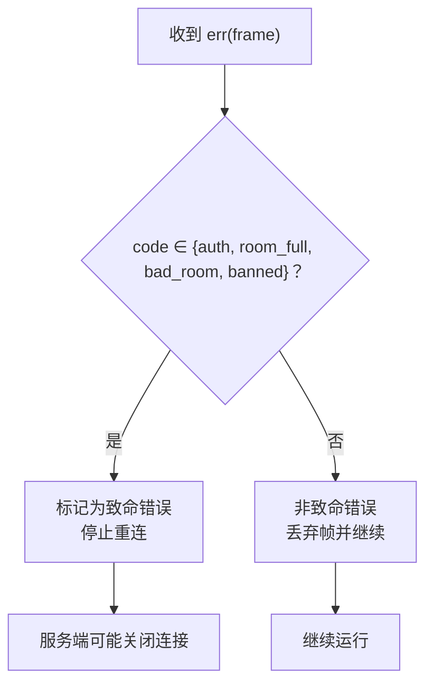
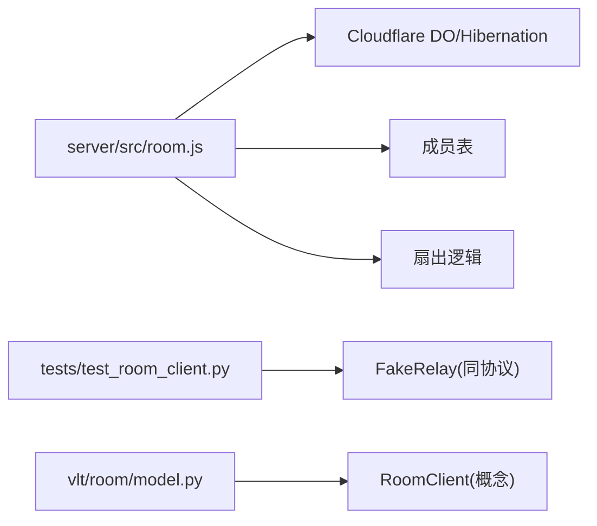

# 房间通信协议

<cite>
**本文引用的文件**   
- [server/src/room.js](file://server/src/room.js)
- [tests/test_room_client.py](file://tests/test_room_client.py)
- [scripts/room_e2e_local.py](file://scripts/room_e2e_local.py)
- [vlt/room/model.py](file://vlt/room/model.py)
</cite>

## 目录
1. [简介](#简介)
2. [项目结构](#项目结构)
3. [核心组件](#核心组件)
4. [架构总览](#架构总览)
5. [详细组件分析](#详细组件分析)
6. [依赖关系分析](#依赖关系分析)
7. [性能与限制](#性能与限制)
8. [故障排查指南](#故障排查指南)
9. [结论](#结论)
10. [附录：帧格式与错误码速查](#附录帧格式与错误码速查)

## 简介
本技术文档围绕“房间通信协议模块”展开，聚焦自定义 WebSocket 协议的帧设计、编码解码机制、状态机流程、消息分片传输、版本兼容与扩展性、以及错误码与错误处理策略。该协议用于实时语音转写文本在房间成员间的低延迟广播，采用“增量文本快照 + 最终定稿确认”的分片模型，并通过心跳保活与优雅关闭保障连接稳定性。

## 项目结构
协议实现由两部分组成：
- 服务端（Cloudflare Durable Object）：负责握手鉴权、成员表维护、即收即转扇出、仅对 final 回 ack、每连接限速、空房回收等。
- 客户端（Python RoomClient）：负责连接管理、重连退避、心跳、回放补发、成员表同步、消息分片组装与回调。

**图示来源**
- [server/src/room.js:17-36](file://server/src/room.js#L17-L36)
- [server/src/room.js:99-114](file://server/src/room.js#L99-L114)
- [server/src/room.js:116-165](file://server/src/room.js#L116-L165)
- [server/src/room.js:167-223](file://server/src/room.js#L167-L223)
- [vlt/room/model.py:97-106](file://vlt/room/model.py#L97-L106)

**章节来源**
- [server/src/room.js:1-21](file://server/src/room.js#L1-L21)
- [vlt/room/model.py:1-7](file://vlt/room/model.py#L1-L7)

## 核心组件
- 帧类型常量：hello、welcome、members、seg、final、ack、ping、pong、err。
- 握手流程：客户端发送 hello，服务端校验房间码与人数上限后返回 welcome，并广播 members。
- 文本分片：客户端以 seg（partial）和 final（定稿）两阶段推送；服务端只对 final 回 ack。
- 心跳保活：ping/pong 双向保活，服务端侧对 ping 计数限速。
- 错误处理：err 帧携带 code/msg；致命错误码会直接关闭连接。
- 成员广播：成员进出时向所有已握手 peer 广播 members。

**章节来源**
- [server/src/room.js:22-36](file://server/src/room.js#L22-L36)
- [server/src/room.js:116-165](file://server/src/room.js#L116-L165)
- [server/src/room.js:167-223](file://server/src/room.js#L167-L223)
- [tests/test_room_client.py:38-44](file://tests/test_room_client.py#L38-L44)

## 架构总览
下图展示一次完整会话的关键交互：连接建立、握手、文本分片传输、ack 确认、心跳保活与成员广播。

**图示来源**
- [server/src/room.js:99-114](file://server/src/room.js#L99-L114)
- [server/src/room.js:167-191](file://server/src/room.js#L167-L191)
- [server/src/room.js:199-223](file://server/src/room.js#L199-L223)
- [server/src/room.js:256-268](file://server/src/room.js#L256-L268)

## 详细组件分析

### 帧格式定义与语义
- hello：客户端首次帧，包含房间码、昵称、时间戳等。
- welcome：服务端握手成功响应，分配成员 id、房间号与服务端时间戳。
- members：成员表广播，包含成员 id、昵称与在线标志。
- seg：增量文本片段（partial），全量快照覆盖式更新。
- final：句子定稿，触发服务端 ack。
- ack：服务端对 final 的确认，包含句 id、序列号与服务端时间戳。
- ping/pong：心跳保活，含时间戳。
- err：错误帧，包含错误码与可读信息。

字段说明要点：
- utt：句 id，用于关联同一句话的多拍 seg/final。
- seq：句内序列号，从 1 递增，接收方按 seq 去重与排序。
- text：全量快照文本（不是 diff）。
- lang：源语言，默认 zh。
- src：说话人成员 id（服务端加盖）。
- ts：客户端时间戳；srv_ts：服务端时间戳（时钟基准）。
- final：布尔标志，指示是否为定稿。

**章节来源**
- [server/src/room.js:199-223](file://server/src/room.js#L199-L223)
- [tests/test_room_client.py:574-610](file://tests/test_room_client.py#L574-L610)
- [scripts/room_e2e_local.py:46-50](file://scripts/room_e2e_local.py#L46-L50)

### 编码与解码机制
- 传输载体：WebSocket 文本帧。
- 编解码：JSON 字符串；服务端统一 JSON.parse 解析，客户端通过 encode_frame/decode_frame 工具函数进行编解码。
- 大小限制：单帧最大字节数与客户端对齐，超限返回 bad_frame。
- 健壮性：非法 JSON 或缺少 t 字段会返回 bad_frame 错误。

**图示来源**
- [server/src/room.js:116-130](file://server/src/room.js#L116-L130)

**章节来源**
- [server/src/room.js:116-130](file://server/src/room.js#L116-L130)
- [tests/test_room_client.py:38-44](file://tests/test_room_client.py#L38-L44)

### 协议状态机设计
客户端连接状态包括：idle、connecting、online、reconnecting、stopped、error。关键流程：
- 连接建立：发起 WebSocket 连接，进入 connecting。
- 握手：发送 hello，收到 welcome 后进入 online，并同步 members。
- 消息传输：发送 seg/final，收到 ack 后清理回放表。
- 心跳保活：定时 ping，收到 pong 维持存活。
- 断线重连：连接中断进入 reconnecting，按退避表重试；成功后重新握手并补发未 ack 的 final 与未完成句的最新 partial。
- 优雅关闭：stop() 后线程退出，资源释放。

**图示来源**
- [vlt/room/model.py:97-106](file://vlt/room/model.py#L97-L106)
- [tests/test_room_client.py:527-547](file://tests/test_room_client.py#L527-L547)
- [tests/test_room_client.py:779-800](file://tests/test_room_client.py#L779-L800)

**章节来源**
- [vlt/room/model.py:97-106](file://vlt/room/model.py#L97-L106)
- [tests/test_room_client.py:527-547](file://tests/test_room_client.py#L527-L547)
- [tests/test_room_client.py:779-800](file://tests/test_room_client.py#L779-L800)

### 消息分片传输机制
- 增量文本更新：客户端先发送若干 seg（partial），最后发送 final。
- 序列号管理：每句 utt 对应自增 seq，接收方按 seq 去重与覆盖更新。
- 乱序处理：服务端不缓冲、不排序；客户端按 seq 与 final 标志重组最终文本。
- 回放补发：重连后只补发未 ack 的 final 与每个未完成句的最新 partial，避免历史重放风暴。

**图示来源**
- [server/src/room.js:199-223](file://server/src/room.js#L199-L223)
- [tests/test_room_client.py:574-610](file://tests/test_room_client.py#L574-L610)
- [scripts/room_e2e_local.py:88-124](file://scripts/room_e2e_local.py#L88-L124)

**章节来源**
- [server/src/room.js:199-223](file://server/src/room.js#L199-L223)
- [tests/test_room_client.py:708-776](file://tests/test_room_client.py#L708-L776)
- [scripts/room_e2e_local.py:88-124](file://scripts/room_e2e_local.py#L88-L124)

### 版本兼容性与扩展性
- 未知帧类型：服务端对未知 t 不做拒绝，向前兼容新增帧。
- 可选字段：如 final 标志可显式设置或隐式判断（t=final 或 final=true）。
- 可扩展字段：lang、ts、srv_ts 等字段允许未来扩展而不破坏旧客户端。
- 客户端容错：decode_frame/encode_frame 提供稳定接口，便于演进。

**章节来源**
- [server/src/room.js:153-164](file://server/src/room.js#L153-L164)
- [server/src/room.js:199-211](file://server/src/room.js#L199-L211)
- [tests/test_room_client.py:38-44](file://tests/test_room_client.py#L38-L44)

### 错误码定义与错误处理策略
- 致命错误码：auth、room_full、bad_room、banned。客户端收到后停止重连。
- 非致命错误：bad_frame、rate 等，客户端继续运行但丢弃当前帧。
- 错误帧结构：err(code, msg, ts)。
- 服务端行为：致命错误码直接关闭连接；非致命错误仅记录并继续。

**图示来源**
- [server/src/room.js:32-36](file://server/src/room.js#L32-L36)
- [server/src/room.js:282-297](file://server/src/room.js#L282-L297)

**章节来源**
- [server/src/room.js:32-36](file://server/src/room.js#L32-L36)
- [server/src/room.js:282-297](file://server/src/room.js#L282-L297)

## 依赖关系分析
- 服务端依赖 Cloudflare Durable Object 的 WebSocket Hibernation 能力，使用 state.acceptWebSocket 而非 ws.accept，确保空闲时不计费。
- 客户端依赖 websockets 库与本地假中继（FakeRelay）进行端到端验证。
- 数据模型集中在 vlt/room/model.py，提供配置、成员、消息与运行态。

**图示来源**
- [server/src/room.js:1-15](file://server/src/room.js#L1-L15)
- [tests/test_room_client.py:110-116](file://tests/test_room_client.py#L110-L116)
- [vlt/room/model.py:140-159](file://vlt/room/model.py#L140-L159)

**章节来源**
- [server/src/room.js:1-15](file://server/src/room.js#L1-L15)
- [tests/test_room_client.py:110-116](file://tests/test_room_client.py#L110-L116)
- [vlt/room/model.py:140-159](file://vlt/room/model.py#L140-L159)

## 性能与限制
- 每连接限速：seg/final/ping 计入速率桶，超过阈值丢帧并返回 rate 错误。
- 帧大小限制：MAX_FRAME_BYTES 与客户端对齐，防止超大帧影响服务。
- 成员上限：MAX_PEERS 控制房间人数，避免手腕屏显示过载。
- 空房回收：最后一个人离开后延时清空存储，降低空闲成本。

**章节来源**
- [server/src/room.js:17-20](file://server/src/room.js#L17-L20)
- [server/src/room.js:137-151](file://server/src/room.js#L137-L151)
- [server/src/room.js:179-182](file://server/src/room.js#L179-L182)
- [server/src/room.js:249-254](file://server/src/room.js#L249-L254)

## 故障排查指南
- 握手失败：检查 hello 帧是否包含正确 room/nick/ts；确认 URL 中房间路由参数与服务端一致。
- 鉴权失败：检查 token 是否正确；服务端返回 auth 致命错误将关闭连接。
- 房间满：达到 MAX_PEERS 后返回 room_full；等待有人离开或更换房间。
- 限速触发：减少 seg/final/ping 频率；检查客户端 partial_min_ms 与心跳间隔。
- 心跳超时：确认 ping/pong 正常往返；检查网络与代理设置。
- 重连风暴：观察 reconnects 计数；确保退避表合理；避免同时大量客户端重连。

**章节来源**
- [tests/test_room_client.py:500-524](file://tests/test_room_client.py#L500-L524)
- [tests/test_room_client.py:527-547](file://tests/test_room_client.py#L527-L547)
- [tests/test_room_client.py:779-800](file://tests/test_room_client.py#L779-L800)

## 结论
房间通信协议以简洁的 JSON-over-WebSocket 帧集为核心，结合增量快照与最终定稿确认，实现了低延迟、高可靠的房间文本广播。通过严格的握手、限速、心跳与错误码体系，协议在服务端与客户端之间建立了稳定的协作边界。未来可在保持向后兼容的前提下扩展字段与帧类型，以满足更多场景需求。

## 附录：帧格式与错误码速查
- hello：{t:"hello", room, nick, ts}
- welcome：{t:"welcome", me, room, srv_ts}
- members：{t:"members", members:[{id,nick,online}], room, srv_ts}
- seg：{t:"seg", utt, seq, text, lang, ts}
- final：{t:"final", utt, seq, text, lang, ts} 或 {t:"seg", ..., final:true}
- ack：{t:"ack", utt, seq, ts}
- ping：{t:"ping", ts}
- pong：{t:"pong", ts}
- err：{t:"err", code, msg, ts}

致命错误码：auth、room_full、bad_room、banned。

**章节来源**
- [server/src/room.js:22-36](file://server/src/room.js#L22-L36)
- [server/src/room.js:167-223](file://server/src/room.js#L167-L223)
- [server/src/room.js:282-297](file://server/src/room.js#L282-L297)