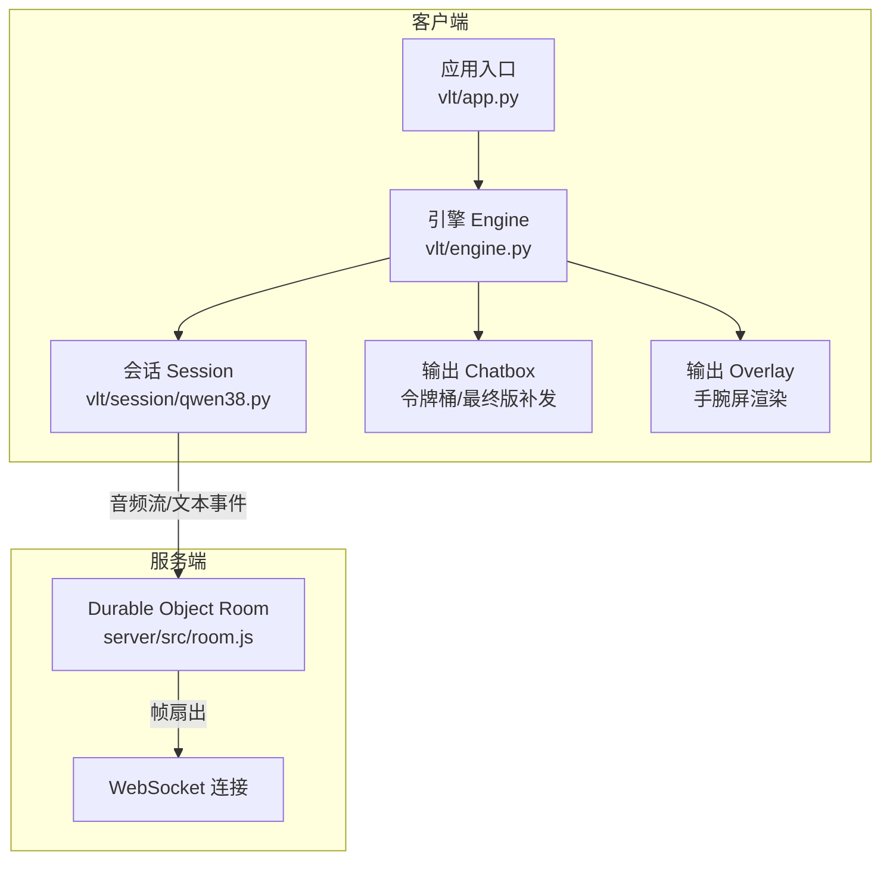
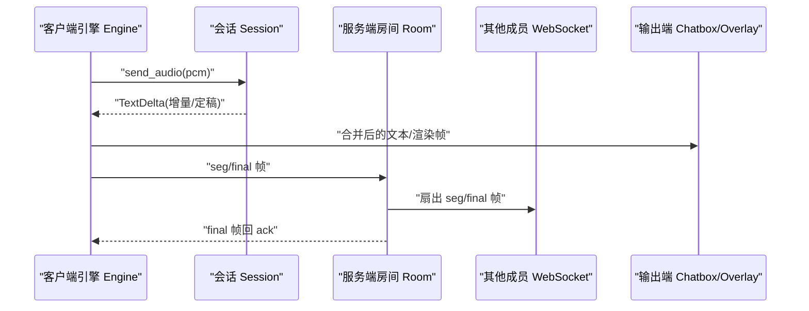
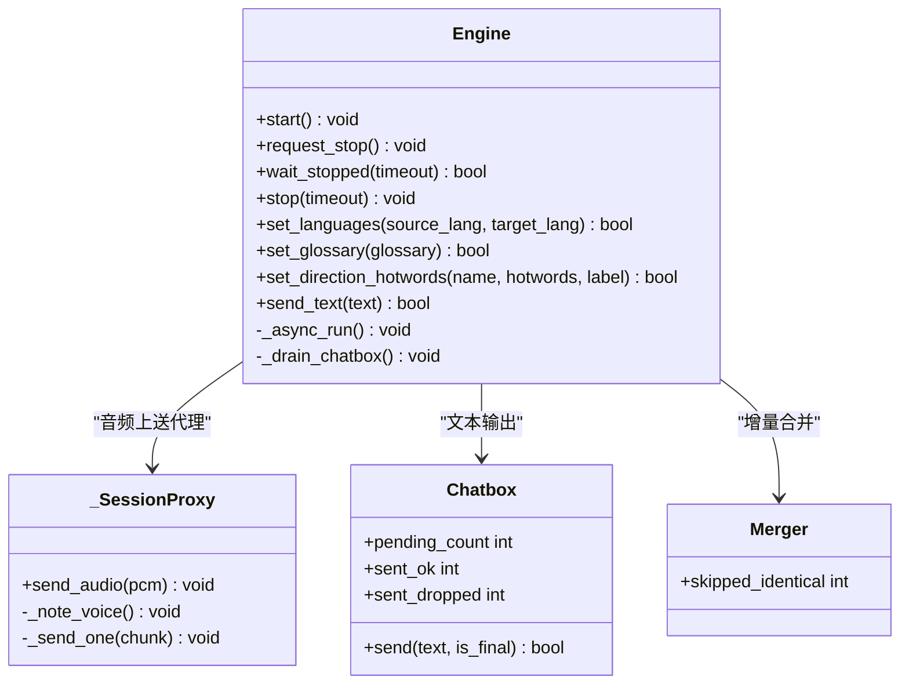
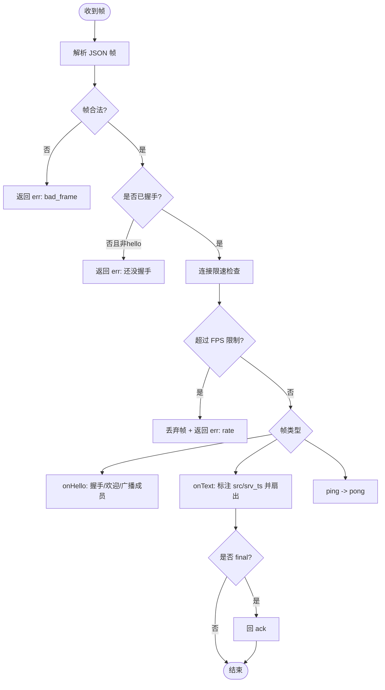
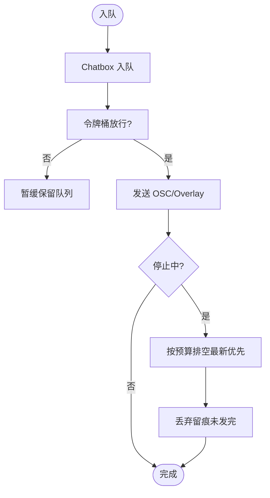
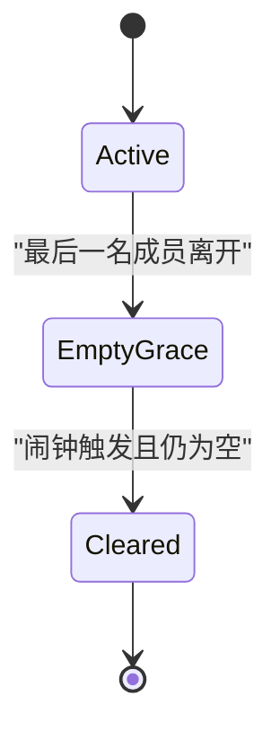
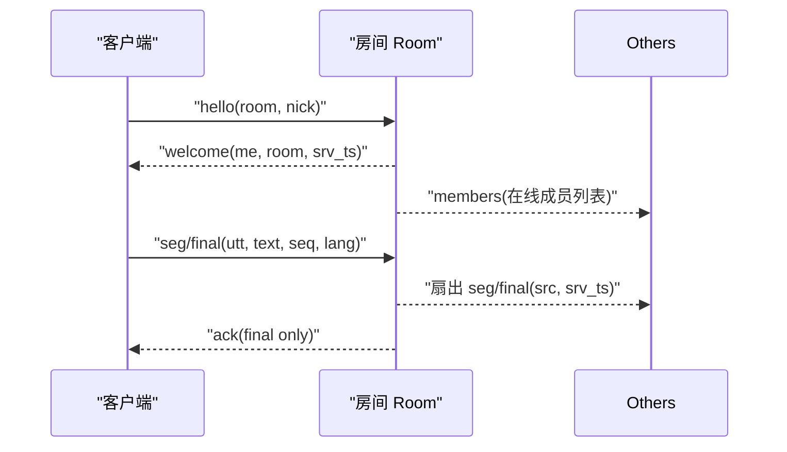
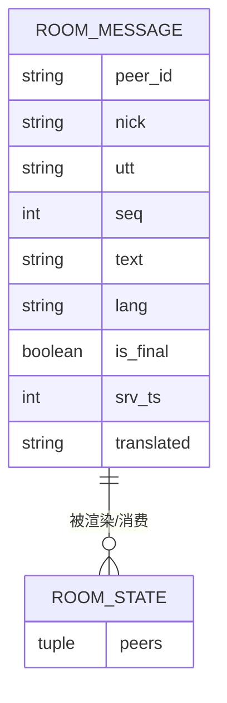
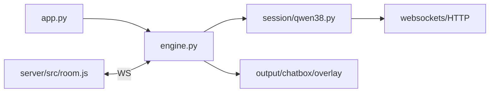

# 消息发布订阅

<cite>
**本文引用的文件**   
- [server/src/room.js](file://server/src/room.js)
- [vlt/engine.py](file://vlt/engine.py)
- [vlt/app.py](file://vlt/app.py)
- [vlt/session/qwen38.py](file://vlt/session/qwen38.py)
- [vlt/room/model.py](file://vlt/room/model.py)
- [tests/test_stop_freeze.py](file://tests/test_stop_freeze.py)
</cite>

## 目录
1. [引言](#引言)
2. [项目结构](#项目结构)
3. [核心组件](#核心组件)
4. [架构总览](#架构总览)
5. [详细组件分析](#详细组件分析)
6. [依赖关系分析](#依赖关系分析)
7. [性能与容量规划](#性能与容量规划)
8. [故障排查指南](#故障排查指南)
9. [结论](#结论)

## 引言
本技术文档围绕“消息发布订阅”主题，结合仓库中的实时同传引擎与服务端房间模型，系统性解释以下方面：
- 发布者（Publisher）与订阅者（Subscriber）的设计模式在系统中的体现
- 消息路由机制：主题管理、消息过滤与分发策略
- 异步消息处理模型：消息队列、背压与流量控制
- 消息持久化机制：离线存储、重放策略与一致性保证
- 订阅管理接口：动态订阅、权限控制与消息过滤规则
- 性能优化策略：批量处理、缓存机制与内存管理

该实现以“服务端房间即广播中心 + 客户端引擎作为发布者/消费者”的方式组织，既满足低延迟的实时同传需求，也兼顾了边缘部署的成本与稳定性。

## 项目结构
从发布订阅视角，系统由两部分组成：
- 服务端：基于 Cloudflare Durable Object 的房间实例，承担成员管理、帧扇出、连接限速与空房回收
- 客户端：Python 引擎负责采集音频、调用会话服务、合并增量文本、投递到 chatbox/overlay 等输出端

图示来源
- [vlt/app.py:55-131](file://vlt/app.py#L55-L131)
- [vlt/engine.py:446-522](file://vlt/engine.py#L446-L522)
- [vlt/session/qwen38.py:1-12](file://vlt/session/qwen38.py#L1-L12)
- [server/src/room.js:1-20](file://server/src/room.js#L1-L20)

章节来源
- [vlt/app.py:55-131](file://vlt/app.py#L55-L131)
- [server/src/room.js:1-20](file://server/src/room.js#L1-L20)

## 核心组件
- 发布者（Publisher）
  - 客户端引擎 Engine：封装采集、会话、节流、合并与输出；对外暴露 start/stop/send_text 等接口
  - 会话 Session：将音频流与文本事件标准化，屏蔽不同后端差异
- 订阅者（Subscriber）
  - 服务端房间 Room：维护成员表，对 final 帧回 ack，对其他成员扇出 seg/final 帧
  - 客户端输出端 Chatbox/Overlay：消费引擎产出的文本或渲染帧
- 路由与分发
  - 房间按“房间码”隔离主题；按帧类型区分 seg/final/ping/ack 等
  - 每连接限速，防止单连接拥塞影响整体
- 异步与背压
  - 引擎使用 asyncio 事件循环；chatbox 使用令牌桶限流；停止时按预算排空队列
- 持久化与一致性
  - 服务端不缓冲历史、不做排序与重放；partial 为全量快照，丢帧后下一拍更完整
  - 空房通过 setAlarm 定时清理存储，避免长期占用

章节来源
- [vlt/engine.py:446-522](file://vlt/engine.py#L446-L522)
- [server/src/room.js:1-20](file://server/src/room.js#L1-L20)

## 架构总览
下图展示一次典型的消息发布订阅流程：客户端发送语音片段 → 服务端识别并返回增量文本 → 引擎合并增量 → 投递到 chatbox/overlay；同时房间把文本帧广播给其他成员。

图示来源
- [vlt/engine.py:356-443](file://vlt/engine.py#L356-L443)
- [server/src/room.js:116-223](file://server/src/room.js#L116-L223)

## 详细组件分析

### 发布者（Engine）设计
- 职责
  - 生命周期管理：start/request_stop/wait_stopped/stop
  - 音频采集与上送：通过 _SessionProxy 转发到当前会话，支持重连
  - 文本合并与输出：Merger 合并增量，Chatbox 做令牌桶限流与最终版补发
  - 本地抑制与门限：重复抑制、输入响度门限、长静音闸门
- 关键行为
  - request_stop 立即返回，后台线程收尾；stop 阻塞等待收尾
  - _drain_chatbox 停止时优先发送最新一条，有界超时，丢弃留痕
  - 词库/热词热更新：受连接预算限制，必要时重建会话

图示来源
- [vlt/engine.py:446-522](file://vlt/engine.py#L446-L522)
- [vlt/engine.py:787-800](file://vlt/engine.py#L787-L800)

章节来源
- [vlt/engine.py:446-522](file://vlt/engine.py#L446-L522)
- [vlt/engine.py:787-800](file://vlt/engine.py#L787-L800)

### 订阅者（Room）设计与消息路由
- 主题管理
  - 每个房间码对应一个 Durable Object 实例，天然隔离主题
- 成员管理与握手
  - hello 握手校验房间码、人数上限，分配 peer id，回 welcome，广播 members
- 消息过滤与分发
  - 只接受 seg/final/ping 等已知帧类型；未知帧忽略
  - 对 final 帧回 ack；对其它成员扇出 seg/final
  - 每连接固定窗口限速，超限丢帧并回 err
- 掉线与回收
  - close/error 摘除成员，广播 members；空房用 setAlarm 定时清理存储

图示来源
- [server/src/room.js:116-223](file://server/src/room.js#L116-L223)

章节来源
- [server/src/room.js:116-223](file://server/src/room.js#L116-L223)

### 异步消息处理模型：队列、背压与流量控制
- 消息队列
  - Chatbox 内部维护待发送队列，支持最终版补发
- 背压与限流
  - Chatbox 使用令牌桶控制发送速率；停止时按预算排空，优先发送最新一条
- 流量控制
  - 服务端每连接限速（FPS），超限丢帧不断线
  - 客户端侧输入门限与长静音闸门减少无效上送

图示来源
- [tests/test_stop_freeze.py:266-346](file://tests/test_stop_freeze.py#L266-L346)
- [server/src/room.js:137-151](file://server/src/room.js#L137-L151)

章节来源
- [tests/test_stop_freeze.py:266-346](file://tests/test_stop_freeze.py#L266-L346)
- [server/src/room.js:137-151](file://server/src/room.js#L137-L151)

### 消息持久化机制：离线存储、重放与一致性
- 服务端不缓冲历史、不排序、不重放 partial；partial 是全量快照，丢帧后下一拍更完整
- 空房回收：最后一个人离开后，设置闹钟清理存储，释放资源
- 一致性保证：只对 final 回 ack；客户端可据此判断服务端已确认

图示来源
- [server/src/room.js:234-254](file://server/src/room.js#L234-L254)

章节来源
- [server/src/room.js:234-254](file://server/src/room.js#L234-L254)

### 订阅管理接口：动态订阅、权限与过滤
- 动态订阅
  - 客户端通过 hello 加入房间，服务端分配 peer id 并广播 members
- 权限控制
  - 握手阶段校验房间码、人数上限；致命错误码直接关闭连接
- 消息过滤规则
  - 帧类型白名单；每连接限速；只接受带 utt 的 seg/final 帧

图示来源
- [server/src/room.js:167-223](file://server/src/room.js#L167-L223)

章节来源
- [server/src/room.js:167-223](file://server/src/room.js#L167-L223)

### 数据模型与事件流
- 房间消息模型
  - RoomMessage：peer_id/nick/utt/seq/text/lang/is_final/srv_ts/translated/display
  - RoomState：状态快照，peers 使用不可变容器避免竞态
- 事件流
  - 服务端返回 final 时客户端可认为该句已定稿；partial 为覆盖式快照

图示来源
- [vlt/room/model.py:300-333](file://vlt/room/model.py#L300-L333)

章节来源
- [vlt/room/model.py:300-333](file://vlt/room/model.py#L300-L333)

## 依赖关系分析
- 模块耦合
  - app.py 仅负责装配 Engine 与事件回调，业务逻辑集中在 engine.py
  - engine.py 依赖 session/base 抽象与 qwen38 具体实现，屏蔽后端差异
  - server/src/room.js 独立于 Python 客户端，通过 WebSocket 协议交互
- 外部依赖
  - 服务端运行在 Cloudflare Workers/Durable Objects 环境，利用 Hibernation 降低空闲成本
  - 客户端依赖 websockets、numpy、platform 相关库进行音频处理与设备枚举

图示来源
- [vlt/app.py:55-131](file://vlt/app.py#L55-L131)
- [vlt/engine.py:446-522](file://vlt/engine.py#L446-L522)
- [server/src/room.js:1-20](file://server/src/room.js#L1-L20)

章节来源
- [vlt/app.py:55-131](file://vlt/app.py#L55-L131)
- [vlt/engine.py:446-522](file://vlt/engine.py#L446-L522)
- [server/src/room.js:1-20](file://server/src/room.js#L1-L20)

## 性能与容量规划
- 批量处理
  - Chatbox 合并增量文本，减少频繁 OSC 调用
- 缓存机制
  - Merger 跳过内容未变的重复输出
- 内存管理
  - 服务端 Hibernation 下内存清空，连接状态通过 attachment 序列化恢复
  - 空房回收存储，避免长期占用
- 背压与限流
  - 服务端每连接 FPS 限制；客户端令牌桶限流；停止时按预算排空
- 容量建议
  - 房间成员上限 MAX_PEERS=8；每连接限速 RATE_LIMIT_FPS=20；最大帧大小 MAX_FRAME_BYTES=8192

章节来源
- [server/src/room.js:17-20](file://server/src/room.js#L17-L20)
- [server/src/room.js:234-254](file://server/src/room.js#L234-L254)
- [tests/test_stop_freeze.py:266-346](file://tests/test_stop_freeze.py#L266-L346)

## 故障排查指南
- 常见问题定位
  - 发送失败：_SessionProxy 记录 send_fails，日志提示“发送音频失败”，看门狗会在短时间内重连
  - 停止卡顿：确保使用 request_stop 并发下发停止信号，stop 仅在 UI 线程等待收尾
  - 积压未发：检查 chatbox pending_count 与停止日志中的“未发完/放弃 X/Y”
  - 服务端断线：qwen38 遇到致命错误会主动断连，触发重连路径
- 诊断指标
  - 黑匣子统计：audio_in_chunks、silent_chunks、text_deltas、audio_chunks
  - 连接预算：max_new_sessions_per_minute 限制会话重建频率

章节来源
- [vlt/engine.py:356-443](file://vlt/engine.py#L356-L443)
- [vlt/engine.py:548-592](file://vlt/engine.py#L548-L592)
- [vlt/session/qwen38.py:355-372](file://vlt/session/qwen38.py#L355-L372)

## 结论
本实现以“服务端房间广播 + 客户端引擎发布/消费”的模式构建消息发布订阅系统：
- 发布者（Engine）负责采集、会话、合并与输出，具备完善的生命周期管理与背压控制
- 订阅者（Room）提供主题隔离、成员管理、限速与一致性回 ack
- 异步模型通过 asyncio 与令牌桶限流保障低延迟与稳定吞吐
- 持久化采用轻量策略：不缓冲历史、partial 快照、空房回收存储
- 订阅管理接口支持动态加入、权限校验与帧级过滤
- 性能优化涵盖批量处理、缓存去重与内存回收，适配边缘部署与免费额度约束