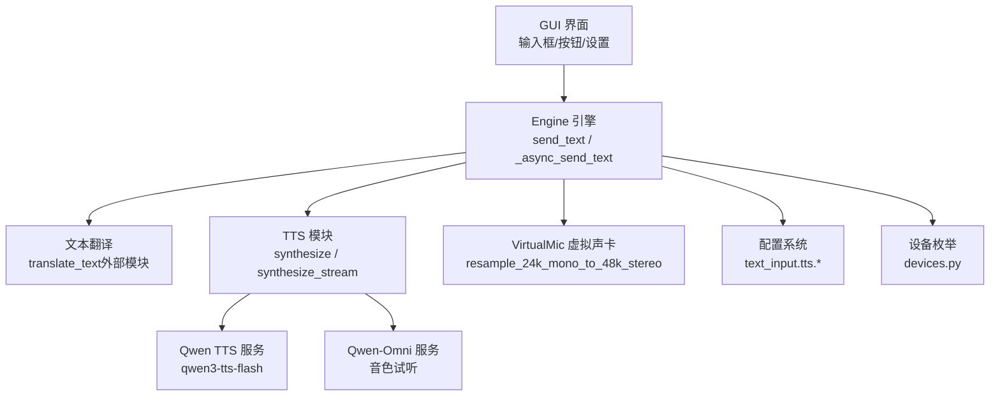
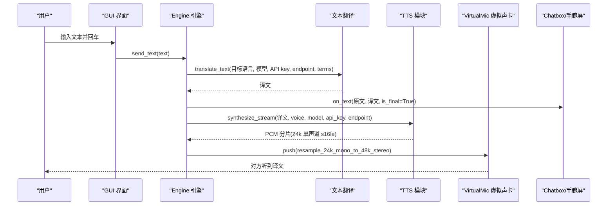
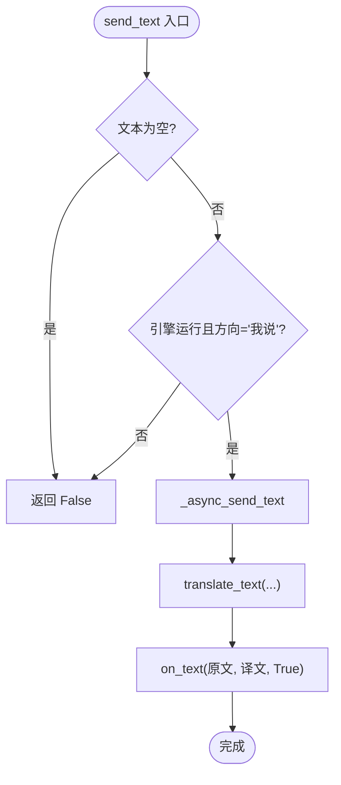
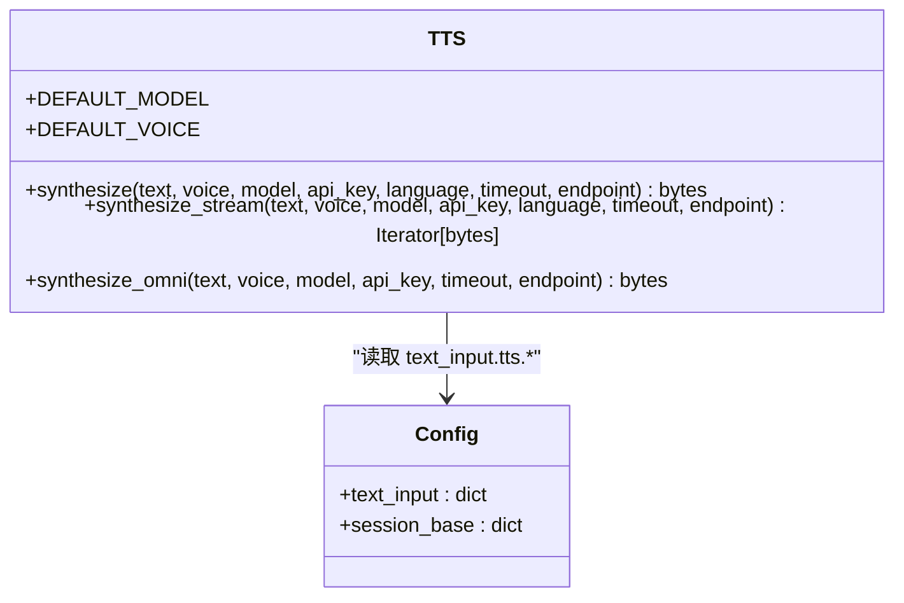
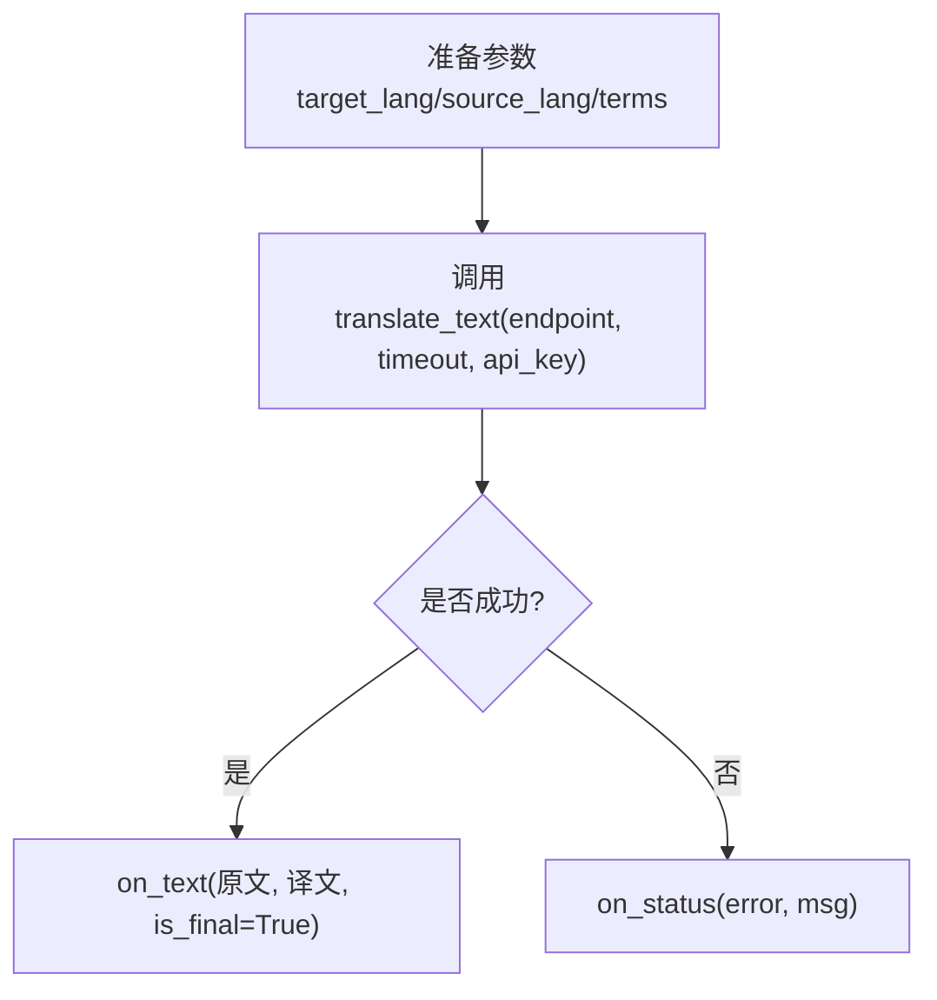
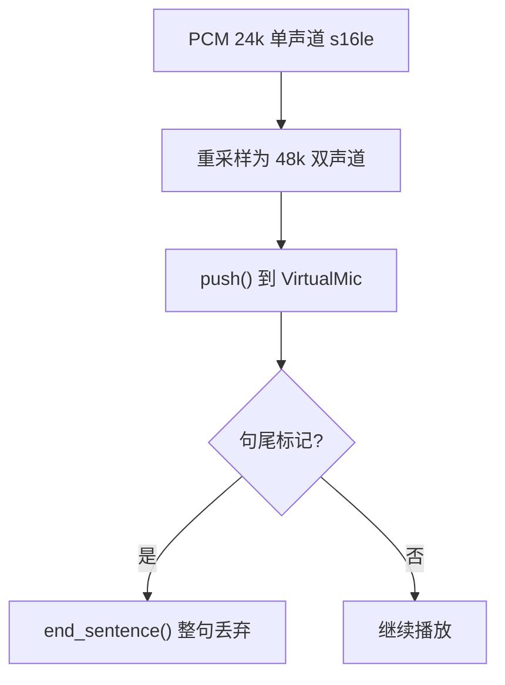
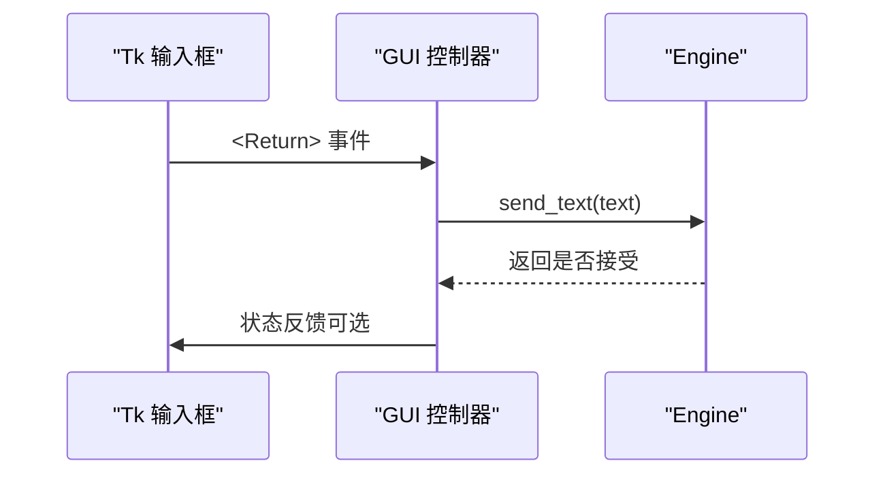
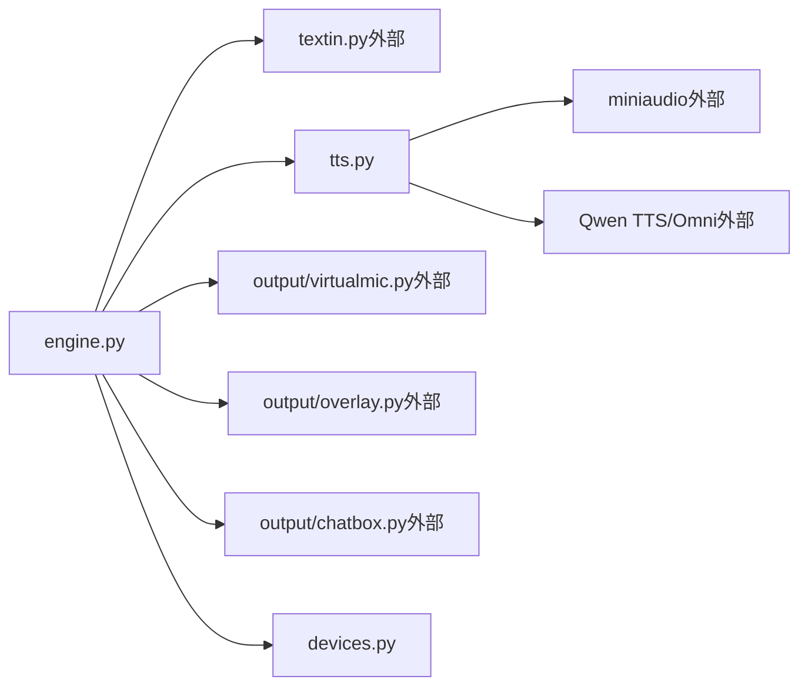

# 文本输入与语音合成

<cite>
**本文引用的文件**   
- [tts.py](file://vlt/tts.py)
- [engine.py](file://vlt/engine.py)
- [gui.py](file://vlt/gui.py)
- [config.py](file://vlt/config.py)
- [devices.py](file://vlt/devices.py)
- [test_textin.py](file://tests/test_textin.py)
</cite>

## 目录
1. [简介](#简介)
2. [项目结构](#项目结构)
3. [核心组件](#核心组件)
4. [架构总览](#架构总览)
5. [详细组件分析](#详细组件分析)
6. [依赖关系分析](#依赖关系分析)
7. [性能与配置优化](#性能与配置优化)
8. [故障排查指南](#故障排查指南)
9. [结论](#结论)

## 简介
本文聚焦“键盘文本输入 + TTS（文本转语音）”两条链路，覆盖以下目标：
- 键盘输入框控件、文本处理与发送机制
- TTS 引擎选择、音色配置与音频输出处理
- 文本翻译预处理、请求与结果处理
- TTS 音频格式转换与虚拟声卡输出机制
- TTS 配置优化与性能调优建议
- 常见问题定位与解决方案

## 项目结构
围绕本主题的关键模块如下：
- vlt/tts.py：TTS 合成（同步/流式）、Omni 音色试听、音频解码与错误封装
- vlt/engine.py：引擎编排、打字输入入口 send_text、虚拟声卡输出、会话回调桥接
- vlt/gui.py：Tk 界面、输入框与事件绑定、设置页中的“打字译音”音色配置
- vlt/config.py：text_input 与 tts 相关配置的加载与默认值
- vlt/devices.py：音频设备枚举与名称解析（用于虚拟声卡设备选择）
- tests/test_textin.py：打字输入端到端验收用例（离线断言）

**图表来源**
- [engine.py:1157-1200](file://vlt/engine.py#L1157-L1200)
- [tts.py:142-200](file://vlt/tts.py#L142-L200)
- [tts.py:201-332](file://vlt/tts.py#L201-L332)
- [config.py:389-404](file://vlt/config.py#L389-L404)
- [devices.py:83-103](file://vlt/devices.py#L83-L103)

**章节来源**
- [engine.py:1157-1200](file://vlt/engine.py#L1157-L1200)
- [tts.py:1-20](file://vlt/tts.py#L1-L20)
- [config.py:389-404](file://vlt/config.py#L389-L404)

## 核心组件
- 文本输入入口
  - 界面触发后调用 Engine.send_text，仅对“我说”方向生效；空文本或引擎未运行直接拒绝。
  - 内部通过 asyncio.run_coroutine_threadsafe 切换到事件循环线程执行异步流程。
- 文本翻译
  - 在后台线程中调用 translate_text，携带目标语言、模型、API key、超时与当前线路的 chat endpoint。
  - 专有词库使用全局+方向级合并口径，保证与实时会话一致。
- TTS 合成
  - 同步接口 synthesize：返回 24kHz 单声道 s16le PCM，优先取 base64 data，否则回退 URL 下载。
  - 流式接口 synthesize_stream：SSE 分片直出 PCM，首包约 0.36~0.42s，整段约 1.6~1.7s；末尾汇总片段需丢弃。
  - Omni 接口 synthesize_omni：用于音色试听（Tina/Cindy 等），必须流式，拼接 base64 后统一解码。
- 虚拟声卡输出
  - 将 24k 单声道 PCM 重采样为 48k 双声道，推入 VirtualMic；按句尾标记整句丢弃，避免句中断。
  - 设备选择支持 Windows 回退链与 Linux PipeWire 运行时声明。

**章节来源**
- [engine.py:1157-1200](file://vlt/engine.py#L1157-L1200)
- [tts.py:142-200](file://vlt/tts.py#L142-L200)
- [tts.py:201-332](file://vlt/tts.py#L201-L332)
- [tts.py:334-424](file://vlt/tts.py#L334-L424)
- [engine.py:897-966](file://vlt/engine.py#L897-L966)

## 架构总览
下图展示从“用户打字”到“对方听到译文”的完整路径，包括翻译、TTS、虚拟声卡与下游消费面（chatbox/手腕屏）。

**图表来源**
- [engine.py:1157-1200](file://vlt/engine.py#L1157-L1200)
- [engine.py:1059-1074](file://vlt/engine.py#L1059-L1074)
- [tts.py:201-332](file://vlt/tts.py#L201-L332)
- [engine.py:1134-1150](file://vlt/engine.py#L1134-L1150)

## 详细组件分析

### 键盘文本输入与发送机制
- 入口与约束
  - Engine.send_text 校验：非空文本、引擎运行中、方向为“我说”。
  - 线程安全：通过 run_coroutine_threadsafe 投递到事件循环线程。
- 翻译流程
  - 使用 Direction.target_lang/source_lang，结合 AppConfig.merged_hotwords 提供术语表。
  - 失败时通过 events.on_status 上报错误，不吞异常。
- 下游一致性
  - 与说话路径一致的 on_text 事件，确保 chatbox/手腕屏/气泡都收到最终译文。

**图表来源**
- [engine.py:1157-1200](file://vlt/engine.py#L1157-L1200)

**章节来源**
- [engine.py:1157-1200](file://vlt/engine.py#L1157-L1200)
- [test_textin.py:1-12](file://tests/test_textin.py#L1-L12)

### TTS 引擎选择与音色配置
- 模型与端点
  - 默认模型 qwen3-tts-flash，端点 ENDPOINT；Omni 音色试听走 OMNI_ENDPOINT。
  - 支持 language_type 映射（zh/en/ja/...），拿不准可不传让服务端自动判断。
- 音色
  - 打字译音默认 Cherry；Omni 音色（Tina/Cindy/Liora/Mira 等）仅用于试听，不走 qwen3-tts-flash。
- 配置项
  - text_input.tts.enabled/model/voice/stream/timeout_s，由 config.load_config 提供默认值与类型校验。

**图表来源**
- [tts.py:29-46](file://vlt/tts.py#L29-L46)
- [tts.py:142-200](file://vlt/tts.py#L142-L200)
- [tts.py:201-332](file://vlt/tts.py#L201-L332)
- [tts.py:334-424](file://vlt/tts.py#L334-L424)
- [config.py:389-404](file://vlt/config.py#L389-L404)

**章节来源**
- [tts.py:29-46](file://vlt/tts.py#L29-L46)
- [tts.py:142-200](file://vlt/tts.py#L142-L200)
- [tts.py:201-332](file://vlt/tts.py#L201-L332)
- [tts.py:334-424](file://vlt/tts.py#L334-L424)
- [config.py:389-404](file://vlt/config.py#L389-L404)

### 文本翻译处理流程
- 预处理
  - 清理空白、组装 target_lang/source_lang、terms_from_mapping 注入术语。
- 请求
  - 使用当前线路的 chat endpoint（启动时从 base_url 派生并缓存）。
- 结果
  - 成功则触发 on_text；失败通过 on_status 上报错误。

**图表来源**
- [engine.py:1172-1194](file://vlt/engine.py#L1172-L1194)

**章节来源**
- [engine.py:1172-1194](file://vlt/engine.py#L1172-L1194)

### TTS 音频格式转换与虚拟声卡输出
- 格式统一
  - 所有 TTS 输出统一为 24kHz 单声道 s16le PCM；Omni 拼接 base64 后也经同一解码路径。
- 重采样与立体声
  - 进入 VirtualMic 前用 resample_24k_mono_to_48k_stereo 转为 48k 双声道。
- 句尾标记
  - 依据终版文本到达或静音间隔触发 end_sentence，确保整句丢弃而非句中断。
- 设备选择
  - Windows：按 device_name 精确匹配或回退链；Linux：运行时声明 PipeWire 节点。

**图表来源**
- [tts.py:93-103](file://vlt/tts.py#L93-L103)
- [tts.py:135-140](file://vlt/tts.py#L135-L140)
- [engine.py:1134-1150](file://vlt/engine.py#L1134-L1150)
- [engine.py:897-966](file://vlt/engine.py#L897-L966)

**章节来源**
- [tts.py:93-103](file://vlt/tts.py#L93-L103)
- [tts.py:135-140](file://vlt/tts.py#L135-L140)
- [engine.py:1134-1150](file://vlt/engine.py#L1134-L1150)
- [engine.py:897-966](file://vlt/engine.py#L897-L966)

### 界面输入框与事件绑定
- 输入框
  - Tk Entry/Text 控件，右键菜单统一挂剪切/复制/粘贴/全选。
- 发送行为
  - 回车触发 send_text；仅在“我说”方向有效。
- 设置页音色
  - “打字译音”音色下拉可编辑，保存至 text_input.tts.voice；支持本地试听（若不支持会友好提示）。

**图表来源**
- [gui.py:456-488](file://vlt/gui.py#L456-L488)
- [gui.py:1712-1763](file://vlt/gui.py#L1712-L1763)
- [engine.py:1157-1170](file://vlt/engine.py#L1157-L1170)

**章节来源**
- [gui.py:456-488](file://vlt/gui.py#L456-L488)
- [gui.py:1712-1763](file://vlt/gui.py#L1712-L1763)
- [engine.py:1157-1170](file://vlt/engine.py#L1157-L1170)

## 依赖关系分析
- 模块耦合
  - engine.py 聚合 textin、tts、virtualmic、overlay、chatbox 等能力，作为编排中枢。
  - tts.py 独立于 engine，提供纯函数式合成接口，便于测试与复用。
  - gui.py 负责 UI 与配置交互，不直接处理音频流。
- 外部依赖
  - Qwen TTS/Omni 服务（HTTP/SSE）
  - miniaudio（音频解码）
  - sounddevice/PipeWire（平台音频设备）

**图表来源**
- [engine.py:21-38](file://vlt/engine.py#L21-L38)
- [tts.py:93-103](file://vlt/tts.py#L93-L103)
- [devices.py:83-103](file://vlt/devices.py#L83-L103)

**章节来源**
- [engine.py:21-38](file://vlt/engine.py#L21-L38)
- [tts.py:93-103](file://vlt/tts.py#L93-L103)
- [devices.py:83-103](file://vlt/devices.py#L83-L103)

## 性能与配置优化
- 流式 TTS 优先
  - 启用 text_input.tts.stream=true，首包 ~0.36~0.42s，显著降低“开口延迟”。
- 超时与重试
  - 合理设置 text_input.tts.timeout_s（默认 30s）；网络抖动时可适当增大。
- 缓冲区与起播阈值
  - output.audio.buffer_ms 控制抖动缓冲（默认 300ms），过小易卡顿，过大增加延迟。
- 音量门限与静音闸门
  - capture.gate_* 与 silence_gate_* 可减少无效上送，节省配额并提升稳定性。
- 设备选择
  - Windows 指定 device_name 以稳定命中虚拟声卡；Linux 保持默认 PipeWire 自动路径。

**章节来源**
- [config.py:389-404](file://vlt/config.py#L389-L404)
- [engine.py:143-167](file://vlt/engine.py#L143-L167)
- [engine.py:204-267](file://vlt/engine.py#L204-L267)
- [engine.py:897-966](file://vlt/engine.py#L897-L966)

## 故障排查指南
- 无声音/听不到译文
  - 检查 output.audio.enabled 与 directions.<X>.output_audio 是否开启。
  - 确认 VirtualMic 打开成功；失败会禁用该腿并留痕。
  - 检查设备名是否正确，Windows 回退链是否命中。
- 只听到半句/句子被切
  - 检查 SENTENCE_GAP_S 与 end_sentence 触发逻辑；确认终版文本到达。
  - 观察 VirtualMic 缓冲溢出策略（应整句丢弃，不句中断）。
- TTS 报错或无音频
  - 检查 API key 是否配置；synthesizes 抛出 TtsError 时会带原因。
  - 流式被拒（400/406/415）会自动回退整段；其他错误直接抛错。
  - 若服务端末尾补发“整段汇总”，会被丢弃以避免重复朗读。
- 音色不可用
  - 说话侧音色（Tina/Cindy 等）走 Omni 试听，不走 qwen3-tts-flash。
  - 打字译音默认 Cherry；如换自定义 voice id，需确认服务端支持。

**章节来源**
- [engine.py:897-966](file://vlt/engine.py#L897-L966)
- [engine.py:1134-1150](file://vlt/engine.py#L1134-L1150)
- [tts.py:59-90](file://vlt/tts.py#L59-L90)
- [tts.py:127-133](file://vlt/tts.py#L127-L133)
- [tts.py:295-332](file://vlt/tts.py#L295-L332)
- [tts.py:334-424](file://vlt/tts.py#L334-L424)

## 结论
本项目将“键盘文本输入”与“TTS 语音输出”解耦为清晰的流水线：
- 文本翻译与 TTS 合成各自独立，但共享统一的 PCM 格式与下游虚拟声卡管线。
- 流式 TTS 显著改善首包延迟，配合抖动缓冲实现“打字即说”。
- 配置层提供细粒度开关与默认值保护，确保开箱即用与可观测性。
- 通过设备抽象与平台差异处理，Windows/Linux 均能稳定输出到虚拟声卡。