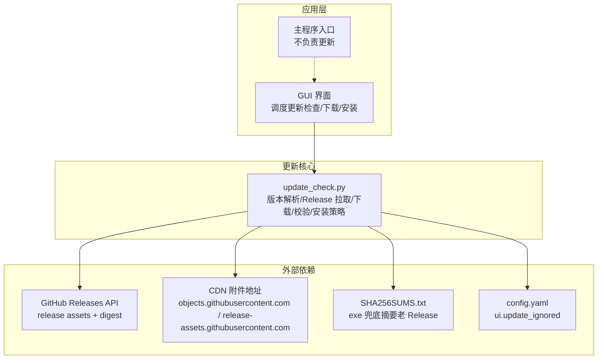
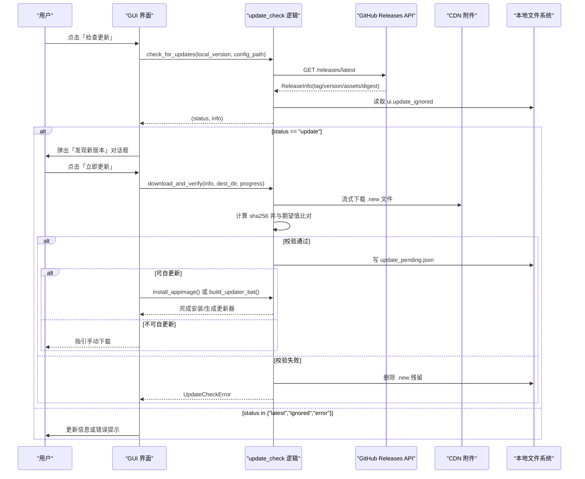
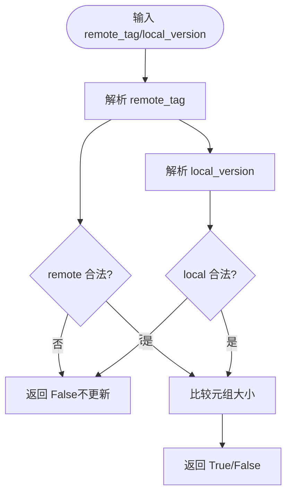
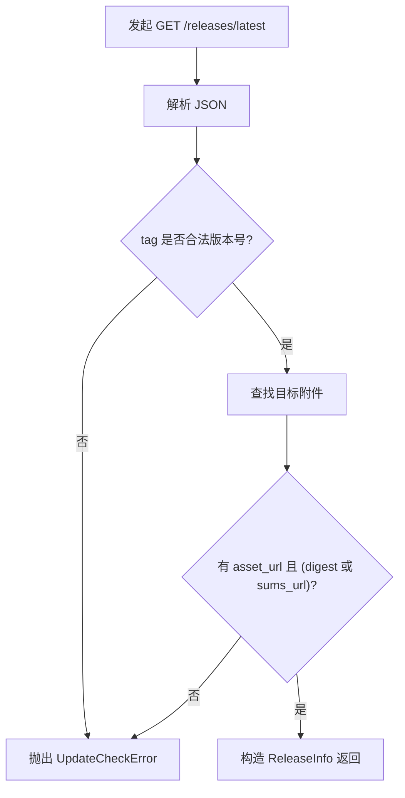
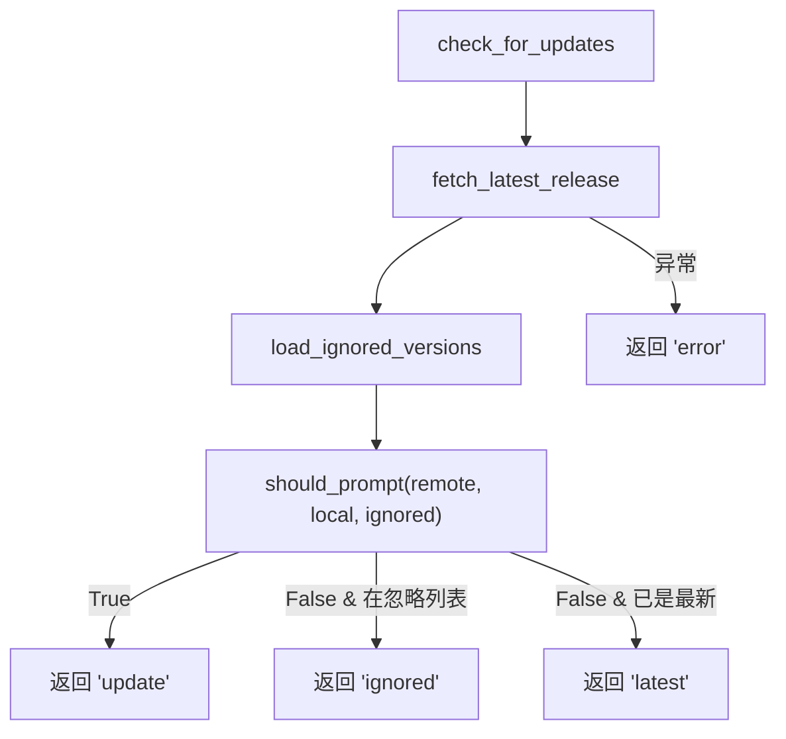
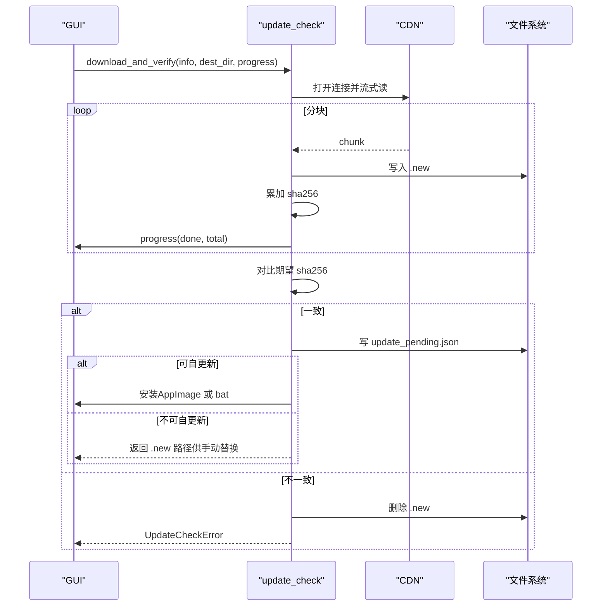
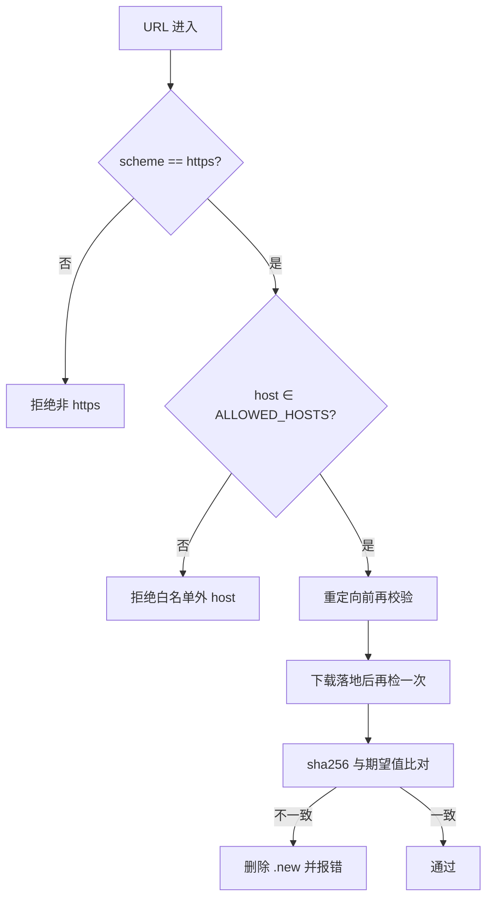
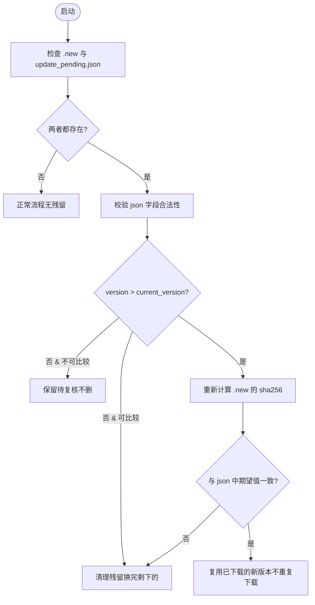
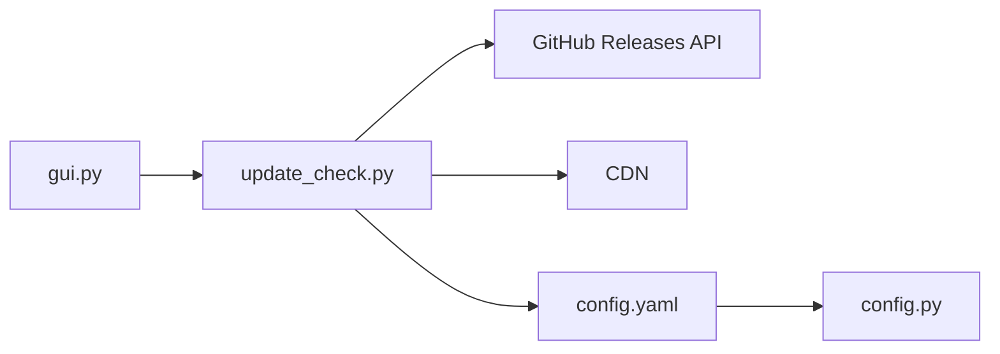

# 更新检查系统

<cite>
**本文引用的文件**   
- [vlt/update_check.py](file://vlt/update_check.py)
- [tests/test_update_check.py](file://tests/test_update_check.py)
- [vlt/gui.py](file://vlt/gui.py)
- [vlt/config.py](file://vlt/config.py)
- [vlt/app.py](file://vlt/app.py)
</cite>

## 目录
1. [引言](#引言)
2. [项目结构](#项目结构)
3. [核心组件](#核心组件)
4. [架构总览](#架构总览)
5. [详细组件分析](#详细组件分析)
6. [依赖关系分析](#依赖关系分析)
7. [性能与体验优化](#性能与体验优化)
8. [故障排查指南](#故障排查指南)
9. [结论](#结论)
10. [附录：配置项与高级用法](#附录配置项与高级用法)

## 引言
本文件面向“更新检查系统”的完整技术文档，覆盖版本检查机制、远程版本获取、本地版本比较、自动更新流程（下载进度、完整性校验、安装）、安全验证（数字签名/摘要与来源可信度）、回滚与失败恢复、配置选项与高级用法，以及网络异常处理与用户体验优化建议。

该系统以纯逻辑模块为核心，GUI 仅负责调度与展示；所有网络访问通过可注入 opener 实现，便于离线测试与代理兼容。

## 项目结构
更新相关代码主要分布在以下位置：
- 更新核心逻辑：`vlt/update_check.py`
- GUI 集成与用户交互：`vlt/gui.py`
- 配置加载与默认路径：`vlt/config.py`
- 主程序入口（非更新主线）：`vlt/app.py`
- 更新模块的离线回归测试：`tests/test_update_check.py`

**图表来源**
- [vlt/update_check.py:32-53](file://vlt/update_check.py#L32-L53)
- [vlt/gui.py:2275-2340](file://vlt/gui.py#L2275-L2340)
- [vlt/config.py:21-23](file://vlt/config.py#L21-L23)

**章节来源**
- [vlt/update_check.py:1-55](file://vlt/update_check.py#L1-L55)
- [vlt/gui.py:2275-2340](file://vlt/gui.py#L2275-L2340)
- [vlt/config.py:21-23](file://vlt/config.py#L21-L23)

## 核心组件
- 版本解析与比较：严格语义化版本 X.Y.Z，拒绝前导零与非标准后缀。
- 远程版本获取：调用 GitHub `/releases/latest`，按运行形态选择 exe 或 AppImage 附件。
- 忽略列表：从 `config.yaml` 的 `ui.update_ignored` 读取与写入，支持就地改写并保留注释。
- 下载与校验：流式 SHA256 校验，优先使用 GitHub 返回的 `assets[].digest`，否则回退到 `SHA256SUMS.txt`。
- 安全白名单：限制 scheme 为 https，host 限定在 GitHub 官方域与两个 CDN 域。
- 运行形态判定：区分 frozen（Windows 单文件 exe）、appimage（Linux AppImage）、source（源码/不可自更新）。
- 安装策略：
  - Windows：生成批处理脚本，等待进程退出后备份、替换、重启，带重试与失败回滚。
  - Linux AppImage：原地 `os.replace` 顶替，允许运行中替换（旧 inode 继续存活）。
- 待更新状态与残留恢复：记录 `.new` 文件与 `update_pending.json`，启动时复核完整性。
- 版本提示状态：记录 `last_seen_version`，避免同一版本重复提示。

**章节来源**
- [vlt/update_check.py:62-83](file://vlt/update_check.py#L62-L83)
- [vlt/update_check.py:88-106](file://vlt/update_check.py#L88-L106)
- [vlt/update_check.py:196-240](file://vlt/update_check.py#L196-L240)
- [vlt/update_check.py:323-350](file://vlt/update_check.py#L323-L350)
- [vlt/update_check.py:353-410](file://vlt/update_check.py#L353-L410)
- [vlt/update_check.py:416-486](file://vlt/update_check.py#L416-L486)
- [vlt/update_check.py:489-507](file://vlt/update_check.py#L489-L507)
- [vlt/update_check.py:512-587](file://vlt/update_check.py#L512-L587)
- [vlt/update_check.py:593-674](file://vlt/update_check.py#L593-L674)
- [vlt/update_check.py:677-695](file://vlt/update_check.py#L677-L695)

## 架构总览
更新检查系统由三层组成：
- 接口层（GUI）：调度后台线程执行检查、下载、安装；提供用户交互（立即更新/下次再说/不再提示）。
- 逻辑层（update_check）：纯逻辑，无 Tk 依赖，负责版本判断、网络请求、校验、平台适配与安装策略。
- 数据与外部服务：GitHub Releases API、CDN 附件、本地 `config.yaml`、状态 JSON。

**图表来源**
- [vlt/gui.py:2275-2340](file://vlt/gui.py#L2275-L2340)
- [vlt/update_check.py:140-187](file://vlt/update_check.py#L140-L187)
- [vlt/update_check.py:376-410](file://vlt/update_check.py#L376-L410)
- [vlt/update_check.py:489-507](file://vlt/update_check.py#L489-L507)
- [vlt/update_check.py:512-587](file://vlt/update_check.py#L512-L587)

## 详细组件分析

### 版本解析与比较
- 版本正则只接受严格三段非负整数，不允许前导零与 `-beta` 等后缀。
- `parse_version` 将形如 `v0.1.2` 转为 `(0,1,2)`；非法返回 `None`。
- `is_newer` 对两边均合法时才比较，任一边非法视为“不更新”，防止误判。

**图表来源**
- [vlt/update_check.py:62-83](file://vlt/update_check.py#L62-L83)

**章节来源**
- [vlt/update_check.py:62-83](file://vlt/update_check.py#L62-L83)

### 远程版本信息获取
- 调用 GitHub `/releases/latest`，要求 `Accept` 与 `User-Agent`。
- 根据运行形态选择附件名：Windows 单文件 exe 或 Linux AppImage。
- 从响应中提取 tag、html_url、asset_url、asset_size、asset_digest、sums_url。
- 若缺少目标附件或没有可用校验凭据（digest 或 sums），直接报错，绝不静默降级。

**图表来源**
- [vlt/update_check.py:140-187](file://vlt/update_check.py#L140-L187)

**章节来源**
- [vlt/update_check.py:140-187](file://vlt/update_check.py#L140-L187)

### 本地版本比较与决策
- `should_prompt`：更高版本且不在忽略列表才提示。
- `check_for_updates`：统一入口，返回 `(status, info)`，状态包括 `update`、`latest`、`ignored`、`error`。
- 每个分支都打印 `[update]` 日志，确保可观测性。

**图表来源**
- [vlt/update_check.py:246-277](file://vlt/update_check.py#L246-L277)

**章节来源**
- [vlt/update_check.py:246-277](file://vlt/update_check.py#L246-L277)

### 自动更新流程：下载进度、完整性验证与安装
- 下载：流式分块写入 `<asset_name>.new`，实时计算 SHA256，回调 `progress(done, total)`。
- 校验：优先用 `assets[].digest`；若无则拉 `SHA256SUMS.txt` 取 exe 行。
- 失败清理：任何异常或删除校验不一致都会删除 `.new` 并抛 `UpdateCheckError`。
- 安装：
  - Windows：生成批处理脚本，等待 PID 退出，备份 `.bak`，重试 `move /y`，失败回滚，可选拉起新版。
  - Linux AppImage：补执行位后 `os.replace` 原地替换，允许运行中替换。

**图表来源**
- [vlt/update_check.py:353-410](file://vlt/update_check.py#L353-L410)
- [vlt/update_check.py:489-507](file://vlt/update_check.py#L489-L507)
- [vlt/update_check.py:512-587](file://vlt/update_check.py#L512-L587)

**章节来源**
- [vlt/update_check.py:353-410](file://vlt/update_check.py#L353-L410)
- [vlt/update_check.py:489-507](file://vlt/update_check.py#L489-L507)
- [vlt/update_check.py:512-587](file://vlt/update_check.py#L512-L587)

### 安全验证机制
- URL 白名单：仅允许 `api.github.com`、`github.com`、`objects.githubusercontent.com`、`release-assets.githubusercontent.com`，且必须 https。
- 重定向守卫：自定义 `HTTPRedirectHandler`，每次跳转前校验新地址。
- 最终落地复检：下载响应与 sums 文件都再次校验最终 URL。
- 摘要校验：优先使用 GitHub 服务端计算的 `assets[].digest`；老 Release 回退到 `SHA256SUMS.txt`。

**图表来源**
- [vlt/update_check.py:283-350](file://vlt/update_check.py#L283-L350)

**章节来源**
- [vlt/update_check.py:283-350](file://vlt/update_check.py#L283-L350)

### 回滚机制与失败恢复
- Windows 更新器批处理：
  - 等待主进程退出（最多约 60 秒）。
  - 备份当前 exe 为 `.bak`。
  - 重试 `move /y`（最多 30 次），失败则从 `.bak` 还原。
  - 失败写 `update_failed.log` 并暂停窗口。
- Linux AppImage：
  - `os.replace` 原子替换，无需 `.bak`；失败则旧文件原样不动。
- 待更新残留恢复：
  - 启动时检测 `<asset>.new` 与 `update_pending.json`。
  - 重新计算 `.new` 的 sha256 与 json 中的期望值比对。
  - 不一致或缺失任一文件则清理残留并留痕。
  - 若当前版本不是严格 X.Y.Z，无法比较新旧时保留待更新文件，避免误删。

**图表来源**
- [vlt/update_check.py:620-674](file://vlt/update_check.py#L620-L674)

**章节来源**
- [vlt/update_check.py:512-587](file://vlt/update_check.py#L512-L587)
- [vlt/update_check.py:620-674](file://vlt/update_check.py#L620-L674)

### 更新配置的自定义选项与高级用法
- 忽略版本列表：`config.yaml` 的 `ui.update_ignored`，用于“不再提示这个版本”。
- 超时参数：
  - 检查更新默认超时：`DEFAULT_TIMEOUT_S = 10.0`。
  - 下载超时：`DOWNLOAD_TIMEOUT_S = 120.0`。
- 代理支持：默认 opener 尊重 `HTTPS_PROXY` 与系统代理。
- 运行形态切换：
  - `update_mode()` 返回 `frozen`、`appimage`、`source`。
  - `can_self_update()` 判断是否能就地替换自己。
  - `asset_name_for()` 决定下载哪个附件。
- 高级函数：
  - `build_updater_bat(pid, current_exe, new_exe, relaunch=True)` 生成 Windows 更新器脚本。
  - `install_appimage(new_path, current_path)` 原地替换 AppImage。
  - `write_pending(dest_dir, version, sha256)` 与 `check_pending_download(asset_path, current_version)` 管理待更新状态。

**章节来源**
- [vlt/update_check.py:196-240](file://vlt/update_check.py#L196-L240)
- [vlt/update_check.py:32-36](file://vlt/update_check.py#L32-L36)
- [vlt/update_check.py:416-486](file://vlt/update_check.py#L416-L486)
- [vlt/update_check.py:512-587](file://vlt/update_check.py#L512-L587)
- [vlt/update_check.py:612-674](file://vlt/update_check.py#L612-L674)

### 网络异常处理与用户体验优化
- 异常映射：
  - HTTP 403/429 → “GitHub 限流（未认证 60 次/小时），稍后再试”。
  - URLError/TimeoutError → “网络不可达：...”。
  - 其他异常统一包装为 `UpdateCheckError`，消息给用户看。
- GUI 行为：
  - 自动检查失败对用户无感（不弹窗），但日志可查。
  - 手动检查失败显示原因，并提供重试入口。
  - 更新对话框非模态，不阻塞翻译主流程。
  - 进度回调通过队列回到主线程，避免跨线程 UI 操作。

**章节来源**
- [vlt/update_check.py:120-138](file://vlt/update_check.py#L120-L138)
- [vlt/gui.py:2275-2340](file://vlt/gui.py#L2275-L2340)

## 依赖关系分析
- GUI 依赖 update_check 提供的纯逻辑函数，不直接操作网络。
- update_check 依赖：
  - GitHub Releases API 与 CDN。
  - 本地 `config.yaml`（忽略列表）。
  - 本地文件系统（`.new`、`update_pending.json`、`update_state.json`）。
- 配置加载由 `vlt/config.py` 提供默认路径与模板。

**图表来源**
- [vlt/gui.py:2275-2340](file://vlt/gui.py#L2275-L2340)
- [vlt/update_check.py:140-187](file://vlt/update_check.py#L140-L187)
- [vlt/config.py:21-23](file://vlt/config.py#L21-L23)

**章节来源**
- [vlt/gui.py:2275-2340](file://vlt/gui.py#L2275-L2340)
- [vlt/update_check.py:140-187](file://vlt/update_check.py#L140-L187)
- [vlt/config.py:21-23](file://vlt/config.py#L21-L23)

## 性能与体验优化
- 流式下载：分块读写，避免大文件一次性载入内存。
- 进度反馈：基于 `Content-Length` 或 `assets[].size` 显示总量，缺省则降级为不确定进度。
- 轻量级校验：优先使用服务端 digest，减少额外网络请求。
- 防连点：GUI 在检查进行中禁用按钮并显示“检查中…”。
- 非阻塞：更新检查与下载在后台线程执行，不阻塞主界面。
- 平台差异优化：
  - Windows 批处理重试替换，解决父进程句柄释放延迟问题。
  - Linux AppImage 利用 `os.replace` 原子替换，无需外部脚本。

[本节为通用指导，不直接分析具体文件]

## 故障排查指南
- 常见错误与定位：
  - “GitHub 限流”：检查是否频繁点击“检查更新”，或考虑使用认证 token（当前实现未启用认证）。
  - “网络不可达”：检查代理设置（`HTTPS_PROXY`）与防火墙。
  - “Release 附件不全”：确认 GitHub Release 包含目标附件与 digest 或 sums。
  - “校验失败已删除”：网络中间人篡改或下载中断，重试即可。
  - “替换 AppImage 失败”：权限不足或目录只读，需提升权限或移动到可写目录。
  - Windows 更新失败：查看 `update_failed.log`，确认批处理是否成功拉起新版。
- 日志位置：
  - 控制台输出 `[update] ...` 行。
  - 日志压缩包可通过 GUI 导出（脱敏后发给维护者）。

**章节来源**
- [vlt/update_check.py:120-138](file://vlt/update_check.py#L120-L138)
- [vlt/update_check.py:398-410](file://vlt/update_check.py#L398-L410)
- [vlt/update_check.py:512-587](file://vlt/update_check.py#L512-L587)
- [vlt/gui.py:2008-2043](file://vlt/gui.py#L2008-L2043)

## 结论
更新检查系统以高内聚、低耦合的设计实现了安全的版本检查、可靠的下载校验与跨平台的安装策略。通过严格的 URL 白名单、服务端摘要校验与本地完整性复核，确保更新包来源可信、内容完整。回滚与残留恢复机制进一步提升了鲁棒性。GUI 层仅提供友好交互，不侵入核心逻辑，便于测试与维护。

[本节为总结性内容，不直接分析具体文件]

## 附录：配置项与高级用法
- `config.yaml` 更新相关：
  - `ui.update_ignored`：忽略的版本列表，用于“不再提示这个版本”。
- 环境变量：
  - `HTTPS_PROXY`：代理设置，影响默认 opener。
  - `APPIMAGE`：Linux AppImage 运行时变量，用于识别运行形态。
- 高级函数：
  - `build_updater_bat(pid, current_exe, new_exe, relaunch=True)`：生成 Windows 更新器脚本。
  - `install_appimage(new_path, current_path)`：原地替换 AppImage。
  - `write_pending(dest_dir, version, sha256)`：写入待更新状态。
  - `check_pending_download(asset_path, current_version)`：启动时复核残留。

**章节来源**
- [vlt/update_check.py:196-240](file://vlt/update_check.py#L196-L240)
- [vlt/update_check.py:416-486](file://vlt/update_check.py#L416-L486)
- [vlt/update_check.py:512-587](file://vlt/update_check.py#L512-L587)
- [vlt/update_check.py:612-674](file://vlt/update_check.py#L612-L674)