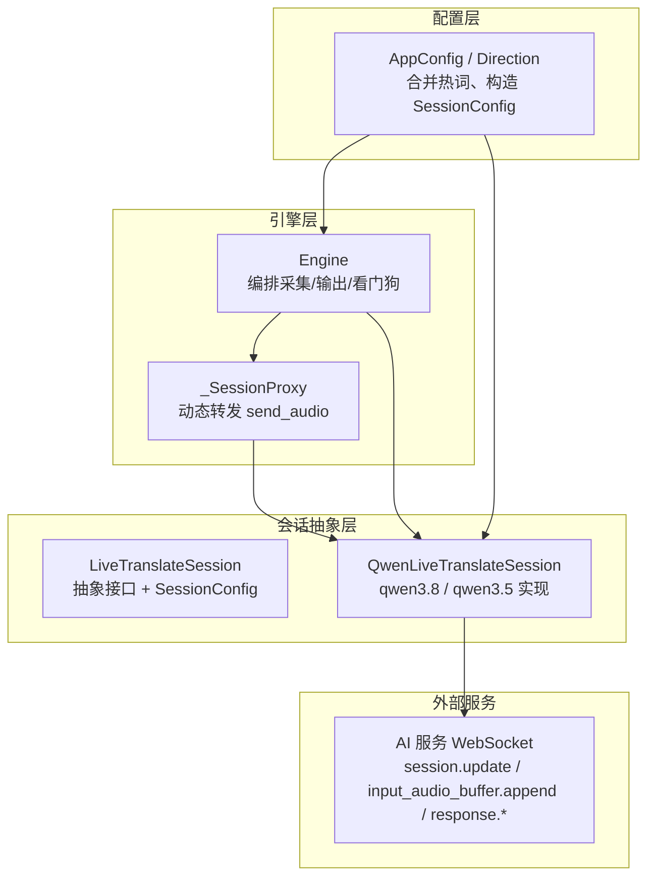
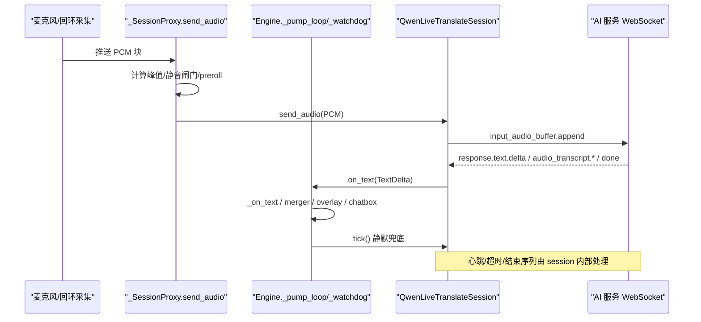
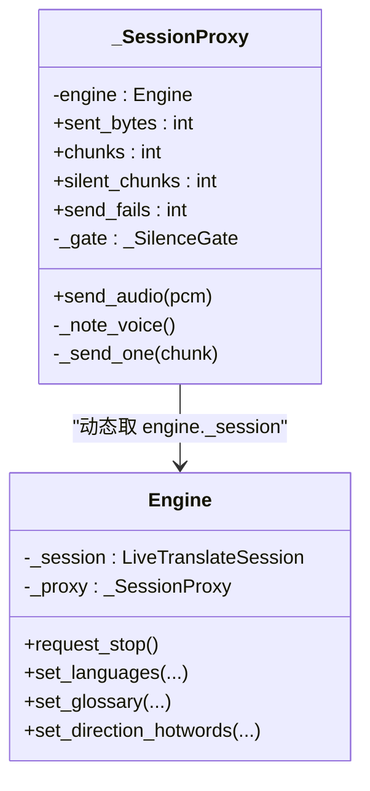
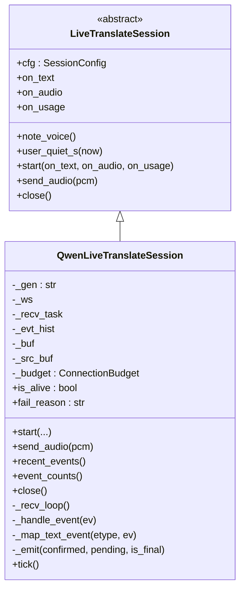
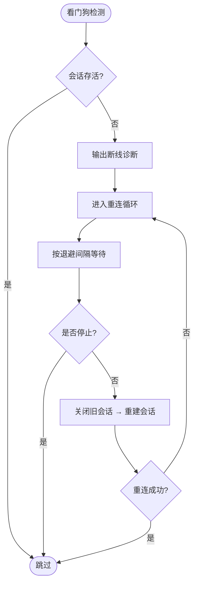
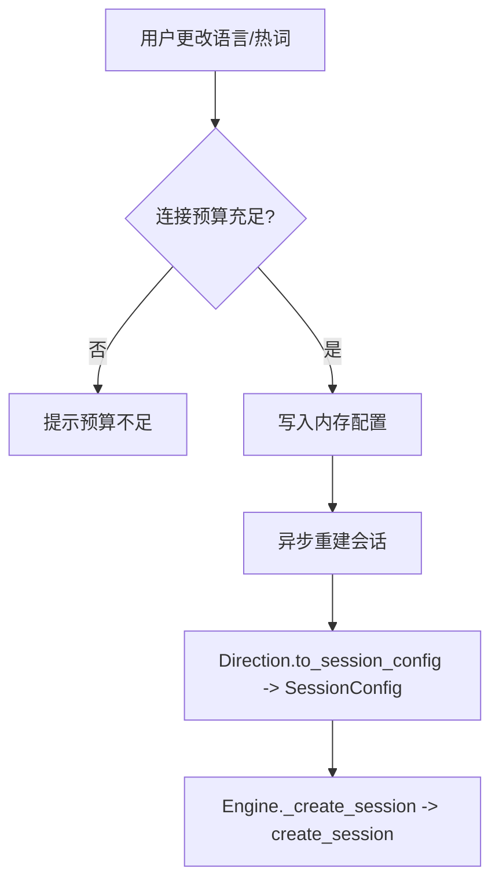
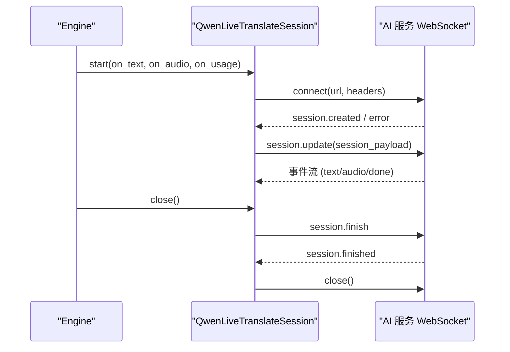
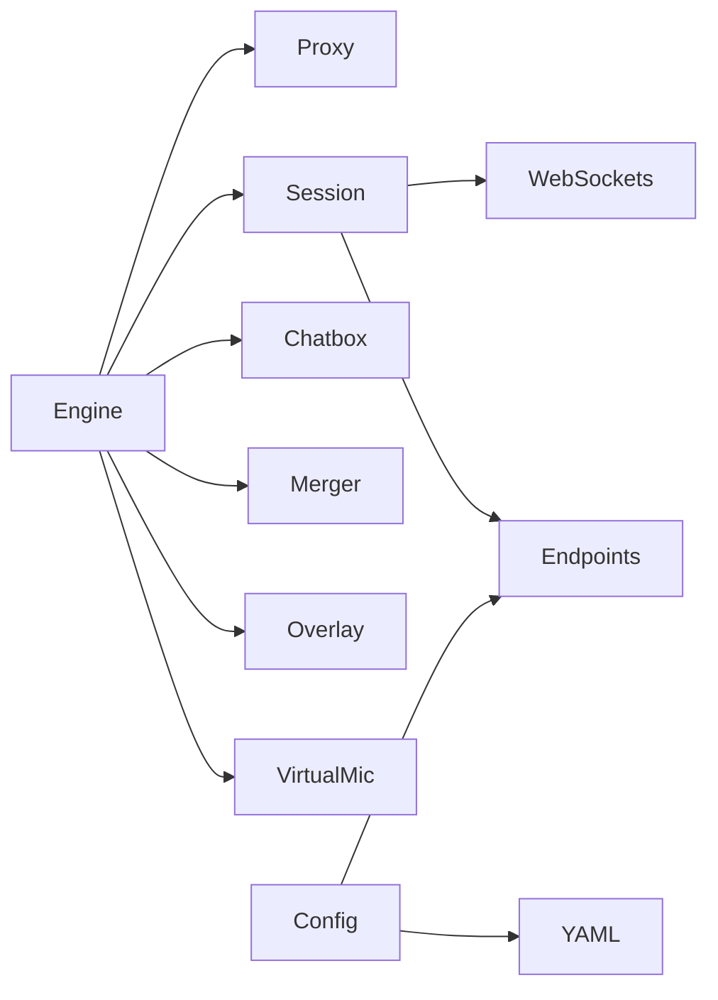

# 会话管理机制

<cite>
**本文引用的文件**   
- [base.py](file://vlt/session/base.py)
- [qwen38.py](file://vlt/session/qwen38.py)
- [engine.py](file://vlt/engine.py)
- [config.py](file://vlt/config.py)
- [test_reconnect.py](file://tests/test_reconnect.py)
- [test_fast_finalize.py](file://tests/test_fast_finalize.py)
- [P0.5-实测结果.md](file://docs/P0.5-实测结果.md)
</cite>

## 目录
1. [引言](#引言)
2. [项目结构](#项目结构)
3. [核心组件](#核心组件)
4. [架构总览](#架构总览)
5. [详细组件分析](#详细组件分析)
6. [依赖关系分析](#依赖关系分析)
7. [性能与优化](#性能与优化)
8. [故障诊断指南](#故障诊断指南)
9. [结论](#结论)

## 引言
本文面向 VRChat 实时同传中的“会话管理”子系统，重点解释以下目标：
- `_SessionProxy` 的设计模式与作用：如何动态代理当前会话对象，使采集线程在自动重连后仍把音频发到新连接。
- 会话重连机制：自动重连策略、连接状态监控、错误恢复流程。
- 会话配置管理：语言设置、热词更新、词库管理的运行时修改。
- 会话生命周期：创建、激活、销毁的完整流程。
- 与 AI 服务的通信协议：WebSocket 连接管理、消息格式、超时处理。
- 并发安全：多线程环境下会话访问的安全保障。
- 性能优化与故障诊断方法。

## 项目结构
本项目的会话相关代码集中在 `vlt/session` 与 `vlt/engine.py`，配置加载在 `vlt/config.py`，测试用例覆盖重连与快封句等关键行为。

**图表来源**
- [engine.py:356-443](file://vlt/engine.py#L356-L443)
- [engine.py:968-1017](file://vlt/engine.py#L968-L1017)
- [base.py:130-181](file://vlt/session/base.py#L130-L181)
- [qwen38.py:82-138](file://vlt/session/qwen38.py#L82-L138)
- [config.py:121-154](file://vlt/config.py#L121-L154)

**章节来源**
- [engine.py:356-443](file://vlt/engine.py#L356-L443)
- [engine.py:968-1017](file://vlt/engine.py#L968-L1017)
- [base.py:130-181](file://vlt/session/base.py#L130-L181)
- [qwen38.py:82-138](file://vlt/session/qwen38.py#L82-L138)
- [config.py:121-154](file://vlt/config.py#L121-L154)

## 核心组件
- **LiveTranslateSession（抽象）**：定义双工实时翻译会话的统一接口，包括 `start`、`send_audio`、`close`，以及文本事件归一化 `TextDelta`、静默兜底判定函数 `should_finalize`。
- **QwenLiveTranslateSession（实现）**：封装与千问云实时接口的 WebSocket 连接、事件分发、断句与最终版兜底、RPM 预算、致命错误主动放弃、优雅关闭序列。
- **_SessionProxy（代理）**：将采集循环的 `send_audio` 转发到“当前会话”，每次调用都从引擎取最新会话引用，从而天然支持自动重连。
- **Engine（编排器）**：负责启动采集、构建会话、周期 tick、看门狗重连、热词/语言切换、TTS 输出、chatbox/overlay 集成。
- **AppConfig / Direction（配置）**：加载 YAML 与环境变量，合并全局专有词库与方向级热词，构造 `SessionConfig`。

**章节来源**
- [base.py:18-181](file://vlt/session/base.py#L18-L181)
- [qwen38.py:62-138](file://vlt/session/qwen38.py#L62-L138)
- [engine.py:356-443](file://vlt/engine.py#L356-L443)
- [engine.py:446-520](file://vlt/engine.py#L446-L520)
- [config.py:121-154](file://vlt/config.py#L121-L154)

## 架构总览
下图展示一次语音输入到译文输出的端到端流程，并标注关键类与方法。

**图表来源**
- [engine.py:1008-1017](file://vlt/engine.py#L1008-L1017)
- [engine.py:1059-1073](file://vlt/engine.py#L1059-L1073)
- [qwen38.py:161-168](file://vlt/session/qwen38.py#L161-L168)
- [qwen38.py:307-405](file://vlt/session/qwen38.py#L307-L405)
- [qwen38.py:407-443](file://vlt/session/qwen38.py#L407-L443)

## 详细组件分析

### _SessionProxy：动态代理当前会话
- 设计动机：采集线程是长跑任务，若直接持有 `session` 引用，自动重连后旧引用会失效；通过代理每次动态读取 `engine._session`，重连后自然落到新连接。
- 关键职责：
  - 按电平判断是否“有人在说话”，调用 `session.note_voice()`，用于快封句逻辑。
  - 长静音闸门 `_SilenceGate`：连续静音超阈值暂停上送，声音恢复时补发 preroll，避免丢句首。
  - 输入响度门限 `_LevelGate`：只作用于 loopback 腿，过滤远处小声玩家。
  - 发送失败不中断采集线程，仅留痕并丢弃该块，等待看门狗重连。

**图表来源**
- [engine.py:356-443](file://vlt/engine.py#L356-L443)

**章节来源**
- [engine.py:356-443](file://vlt/engine.py#L356-L443)
- [test_fast_finalize.py:122-139](file://tests/test_fast_finalize.py#L122-L139)

### 会话抽象与实现：LiveTranslateSession 与 QwenLiveTranslateSession
- 抽象层提供统一接口与数据模型：
  - `TextDelta`：已确认文本、预测文本、是否最终版、源语言识别结果。
  - `SessionConfig`：模型、目标语言、源语言、音色、热词、断句策略、base_url、provider、API key、重连预算、静默阈值等。
  - `create_session(cfg)`：按模型名前缀分派到具体实现（目前支持 qwen3.8/qwen3.5）。
- 实现层负责：
  - WebSocket 连接建立、认证头、握手事件处理。
  - `session.update` 载荷构造（必须整体下发且含 translation）。
  - 事件分发：文本增量、音频增量、源语言转录、响应结束、使用量上报。
  - 静默兜底：`tick()` 根据文字静默时长与上游是否有人说话决定是否发出最终版。
  - 致命错误处理：服务端返回特定 error 时主动放弃会话，触发重连。
  - 优雅关闭：按官方结束序列发 `session.finish`，等待 `session.finished`，再断开 WebSocket。

**图表来源**
- [base.py:18-181](file://vlt/session/base.py#L18-L181)
- [qwen38.py:62-138](file://vlt/session/qwen38.py#L62-L138)
- [qwen38.py:307-492](file://vlt/session/qwen38.py#L307-L492)

**章节来源**
- [base.py:18-181](file://vlt/session/base.py#L18-L181)
- [qwen38.py:62-138](file://vlt/session/qwen38.py#L62-L138)
- [qwen38.py:307-492](file://vlt/session/qwen38.py#L307-L492)

### 会话重连机制：自动重连策略、连接状态监控、错误恢复
- 看门狗 `_watchdog`：每 0.3s 检查会话是否存活；若 `is_alive=False`，则记录诊断信息并启动重连协程。
- 重连循环 `_reconnect_loop`：按配置的退避间隔重试，直到成功或停止。
- RPM 预算：`ConnectionBudget` 限制每分钟新建连接数，防止快速重连撞墙。
- 致命错误：服务端返回特定 error（如重复输出）时，会话主动放弃，标记 `fatal_reason` 与 `_closing`，不再干等 1011，直接走重连路径。
- 优雅关闭：先发 `session.finish`，等待 `session.finished`，再断开 WebSocket；若对端不回 close 帧，有界超时并留痕。

**图表来源**
- [engine.py:1290-1394](file://vlt/engine.py#L1290-L1394)
- [qwen38.py:62-106](file://vlt/session/qwen38.py#L62-L106)
- [qwen38.py:204-243](file://vlt/session/qwen38.py#L204-L243)
- [qwen38.py:281-304](file://vlt/session/qwen38.py#L281-L304)

**章节来源**
- [engine.py:1290-1394](file://vlt/engine.py#L1290-L1394)
- [qwen38.py:62-106](file://vlt/session/qwen38.py#L62-L106)
- [qwen38.py:204-243](file://vlt/session/qwen38.py#L204-L243)
- [qwen38.py:281-304](file://vlt/session/qwen38.py#L281-L304)
- [P0.5-实测结果.md:28-50](file://docs/P0.5-实测结果.md#L28-L50)

### 会话配置管理：语言设置、热词更新、词库管理
- 语言切换：`Engine.set_languages` 更新方向配置，若已有会话且运行中，则异步重建会话；受 RPM 预算限制。
- 热词更新：
  - 全局专有词库：`Engine.set_glossary` 写入 `session_base["glossary"]`，然后重建会话。
  - 方向级热词：`Engine.set_direction_hotwords` 写入方向配置，同样重建会话。
  - 合并口径：`config.merge_hotwords` 是唯一入口，方向级覆盖全局。
- 配置构造：`Direction.to_session_config` 将基础配置与方向配置合并为 `SessionConfig`，包含模型、语言、音色、热词、断句策略、base_url、provider、API key、重连预算、静默阈值等。

**图表来源**
- [engine.py:628-701](file://vlt/engine.py#L628-L701)
- [config.py:107-118](file://vlt/config.py#L107-L118)
- [config.py:121-154](file://vlt/config.py#L121-L154)
- [engine.py:968-1001](file://vlt/engine.py#L968-L1001)

**章节来源**
- [engine.py:628-701](file://vlt/engine.py#L628-L701)
- [config.py:107-118](file://vlt/config.py#L107-L118)
- [config.py:121-154](file://vlt/config.py#L121-L154)
- [engine.py:968-1001](file://vlt/engine.py#L968-L1001)

### 会话生命周期：创建、激活、销毁
- 创建：`Engine._create_session` 检查 RPM 预算，调用 `create_session` 创建会话实例，注册回调，记录连接时间。
- 激活：`Session.start` 建立 WebSocket，接收首个事件，发送 `session.update`，启动接收循环。
- 销毁：`Session.close` 按官方结束序列发 `session.finish`，等待 `session.finished`，再断开 WebSocket；若对端异常，有界超时并留痕。

**图表来源**
- [engine.py:968-993](file://vlt/engine.py#L968-L993)
- [qwen38.py:113-138](file://vlt/session/qwen38.py#L113-L138)
- [qwen38.py:204-243](file://vlt/session/qwen38.py#L204-L243)

**章节来源**
- [engine.py:968-993](file://vlt/engine.py#L968-L993)
- [qwen38.py:113-138](file://vlt/session/qwen38.py#L113-L138)
- [qwen38.py:204-243](file://vlt/session/qwen38.py#L204-L243)

### 与 AI 服务的通信协议：WebSocket、消息格式、超时处理
- 连接参数：open_timeout、close_timeout、ping_interval、ping_timeout、max_size。
- 握手事件：等待 `session.created`，若收到 `error` 则抛出明确错误。
- 会话配置：`session.update` 必须整体下发且含 `translation.language`，否则服务端拒绝。
- 音频输入：`input_audio_buffer.append`，Base64 编码的 PCM。
- 文本事件：
  - qwen3.8：`response.text.delta` / `response.text.done` / `response.audio_transcript.delta` / `response.audio_transcript.done`。
  - qwen3.5：`response.text.text` / `response.text.done` / `response.audio_transcript.text` / `response.audio_transcript.done`。
- 音频增量：`response.audio.delta`，Base64 解码后回调。
- 源语言识别：`conversation.item.input_audio_transcription.*` 事件累积源文本。
- 响应结束：`response.done` 携带 usage，同时发出最终版文本。
- 超时与结束：`session.finish` 后等待 `session.finished`，有界超时；WebSocket close 也有硬上限。

**章节来源**
- [qwen38.py:113-138](file://vlt/session/qwen38.py#L113-L138)
- [qwen38.py:139-159](file://vlt/session/qwen38.py#L139-L159)
- [qwen38.py:161-168](file://vlt/session/qwen38.py#L161-L168)
- [qwen38.py:307-405](file://vlt/session/qwen38.py#L307-L405)
- [qwen38.py:445-472](file://vlt/session/qwen38.py#L445-L472)
- [qwen38.py:204-243](file://vlt/session/qwen38.py#L204-L243)
- [P0.5-实测结果.md:28-50](file://docs/P0.5-实测结果.md#L28-L50)

### 并发安全机制：多线程环境下的会话访问安全
- 采集线程与引擎事件循环线程分离：Engine 在独立线程中运行 asyncio 事件循环，采集循环通过 `_SessionProxy` 间接调用会话。
- 动态代理：`_SessionProxy.send_audio` 每次从 `engine._session` 取最新会话，避免重连后旧引用失效。
- 线程安全停止：`Engine.request_stop` 置位停止事件并调度异步停止，`wait_stopped` 等待线程退出。
- 串行锁：TTS 流式合成使用 `asyncio.Lock` 保证同一时刻只有一路往虚拟声卡写分片，避免分片交错。
- 配置更新：`set_languages`、`set_glossary`、`set_direction_hotwords` 通过 `asyncio.run_coroutine_threadsafe` 切换到事件循环线程执行。

**章节来源**
- [engine.py:446-520](file://vlt/engine.py#L446-L520)
- [engine.py:548-580](file://vlt/engine.py#L548-L580)
- [engine.py:628-701](file://vlt/engine.py#L628-L701)
- [engine.py:1253-1263](file://vlt/engine.py#L1253-L1263)

### 代码示例：会话创建、配置更新、重连过程
以下为概念性步骤说明，具体实现请参考对应源码路径：
- 会话创建：
  - 参考路径：[engine.py:968-993](file://vlt/engine.py#L968-L993)、[qwen38.py:113-138](file://vlt/session/qwen38.py#L113-L138)
- 配置更新（语言/热词）：
  - 参考路径：[engine.py:628-701](file://vlt/engine.py#L628-L701)、[config.py:121-154](file://vlt/config.py#L121-L154)
- 重连过程：
  - 参考路径：[engine.py:1290-1394](file://vlt/engine.py#L1290-L1394)、[qwen38.py:62-106](file://vlt/session/qwen38.py#L62-L106)

**章节来源**
- [engine.py:968-993](file://vlt/engine.py#L968-L993)
- [engine.py:628-701](file://vlt/engine.py#L628-L701)
- [engine.py:1290-1394](file://vlt/engine.py#L1290-L1394)
- [qwen38.py:113-138](file://vlt/session/qwen38.py#L113-L138)
- [qwen38.py:62-106](file://vlt/session/qwen38.py#L62-L106)
- [config.py:121-154](file://vlt/config.py#L121-L154)

## 依赖关系分析
- Engine 依赖：
  - `_SessionProxy`：动态转发音频。
  - `create_session`：按模型名创建会话。
  - `Chatbox`、`Merger`、`Overlay`、`VirtualMic`：输出与显示。
  - `platform`：平台相关设备枚举与音频后端。
- Session 依赖：
  - `websockets`：WebSocket 客户端。
  - `endpoints`：端点派生与描述。
- Config 依赖：
  - `yaml`：配置文件解析。
  - `endpoints`：线路与地址派生。

**图表来源**
- [engine.py:21-38](file://vlt/engine.py#L21-L38)
- [qwen38.py:15-25](file://vlt/session/qwen38.py#L15-L25)
- [config.py:4-18](file://vlt/config.py#L4-L18)

**章节来源**
- [engine.py:21-38](file://vlt/engine.py#L21-L38)
- [qwen38.py:15-25](file://vlt/session/qwen38.py#L15-L25)
- [config.py:4-18](file://vlt/config.py#L4-L18)

## 性能与优化
- 静默兜底与快封句：
  - 慢路径：文字静默 ≥ 3.0s 才封句，避免句子中间抢跑。
  - 快路径：上游已无人在说话 ≥ 0.5s，且文字静默 ≥ 1.1s，可提前封句，节省约 1.8s。
  - 参考路径：[base.py:60-84](file://vlt/session/base.py#L60-L84)、[qwen38.py:407-443](file://vlt/session/qwen38.py#L407-L443)
- 输入门限与静音闸门：
  - 输入门限 `_LevelGate`：过滤低音量块，开闸时补发 preroll，避免丢句首。
  - 静音闸门 `_SilenceGate`：连续静音超阈值暂停上送，防服务端 repeat 掉线。
  - 参考路径：[engine.py:204-347](file://vlt/engine.py#L204-L347)
- RPM 预算：
  - `ConnectionBudget` 限制每分钟新建连接数，防止快速重连撞墙。
  - 参考路径：[qwen38.py:62-80](file://vlt/session/qwen38.py#L62-L80)
- TTS 串行锁：
  - 避免多路分片交错导致听感异常。
  - 参考路径：[engine.py:1253-1263](file://vlt/engine.py#L1253-L1263)

**章节来源**
- [base.py:60-84](file://vlt/session/base.py#L60-L84)
- [qwen38.py:407-443](file://vlt/session/qwen38.py#L407-L443)
- [engine.py:204-347](file://vlt/engine.py#L204-L347)
- [qwen38.py:62-80](file://vlt/session/qwen38.py#L62-L80)
- [engine.py:1253-1263](file://vlt/engine.py#L1253-L1263)

## 故障诊断指南
- 断线诊断：
  - 看门狗触发时输出黑匣子信息，包括会话存活时间、输入音频统计、最近译文本、服务端事件历史。
  - 参考路径：[engine.py:1307-1361](file://vlt/engine.py#L1307-L1361)
- 致命错误处理：
  - 服务端返回特定 error（如重复输出）时，会话主动放弃，不再干等 1011，直接走重连路径。
  - 参考路径：[qwen38.py:42-60](file://vlt/session/qwen38.py#L42-L60)、[qwen38.py:281-304](file://vlt/session/qwen38.py#L281-L304)
- 配置校验：
  - 非法配置值会留痕并回落默认值，避免程序崩溃。
  - 参考路径：[config.py:84-104](file://vlt/config.py#L84-L104)、[config.py:190-214](file://vlt/config.py#L190-L214)
- 测试覆盖：
  - 重连测试验证代理动态转发与会话替换。
  - 快封句测试验证电平信号与静默阈值。
  - 参考路径：[test_reconnect.py:68-126](file://tests/test_reconnect.py#L68-L126)、[test_fast_finalize.py:122-139](file://tests/test_fast_finalize.py#L122-L139)

**章节来源**
- [engine.py:1307-1361](file://vlt/engine.py#L1307-L1361)
- [qwen38.py:42-60](file://vlt/session/qwen38.py#L42-L60)
- [qwen38.py:281-304](file://vlt/session/qwen38.py#L281-L304)
- [config.py:84-104](file://vlt/config.py#L84-L104)
- [config.py:190-214](file://vlt/config.py#L190-L214)
- [test_reconnect.py:68-126](file://tests/test_reconnect.py#L68-L126)
- [test_fast_finalize.py:122-139](file://tests/test_fast_finalize.py#L122-L139)

## 结论
本会话管理机制通过 `_SessionProxy` 的动态代理模式解决了采集线程与自动重连的解耦问题，结合看门狗、RPM 预算、致命错误处理实现了健壮的会话重连。配置管理提供了灵活的运行时语言与热词更新能力，生命周期管理确保了会话的优雅创建与销毁。与 AI 服务的通信协议通过 WebSocket 实现，具备完善的超时与错误处理。并发安全通过线程隔离、动态代理、串行锁等机制得到保障。性能优化体现在静默兜底、快封句、输入门限与静音闸门等方面。故障诊断工具帮助快速定位问题，测试用例覆盖了关键场景。