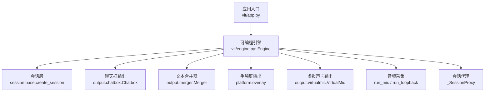
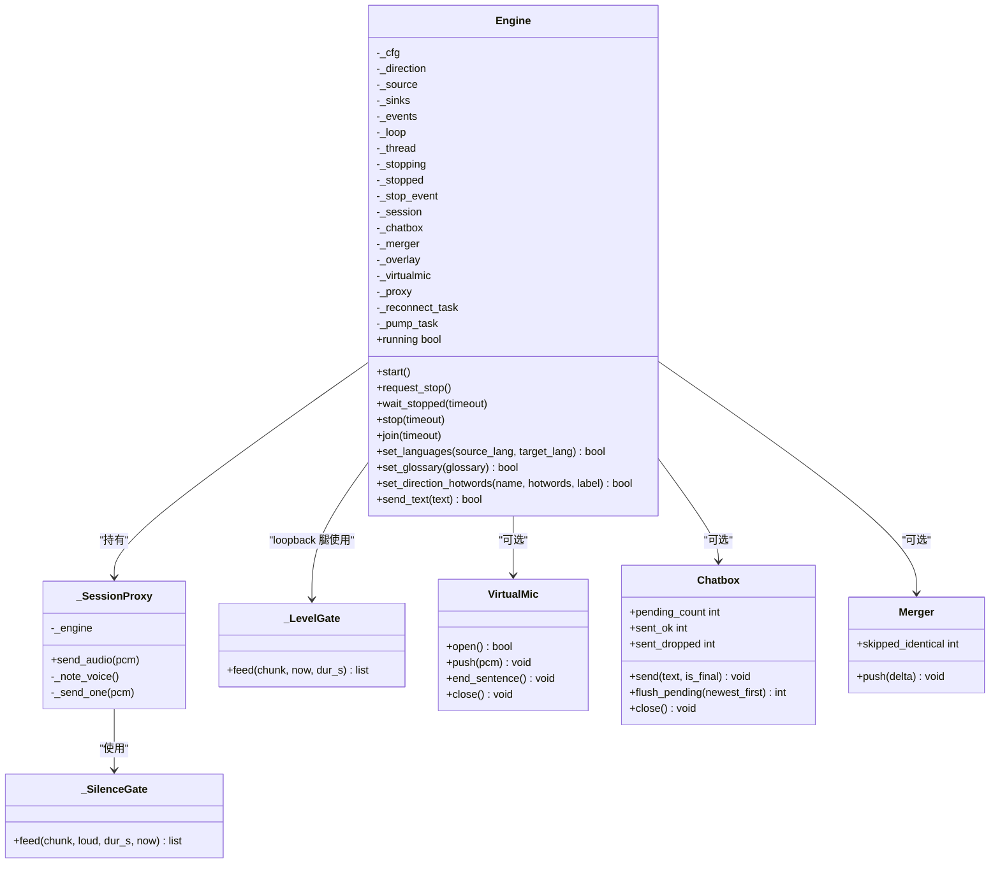
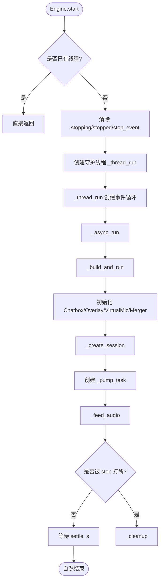
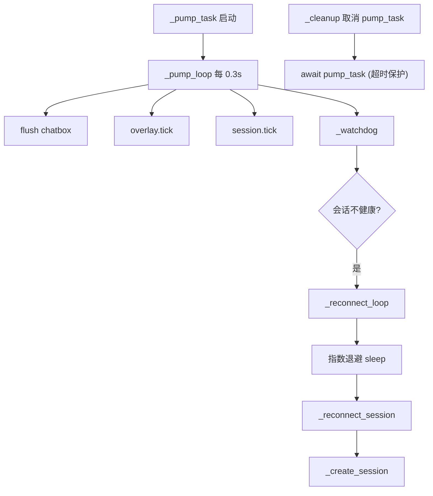
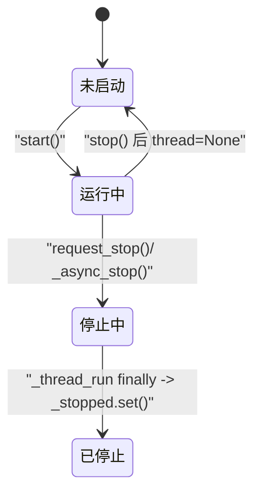
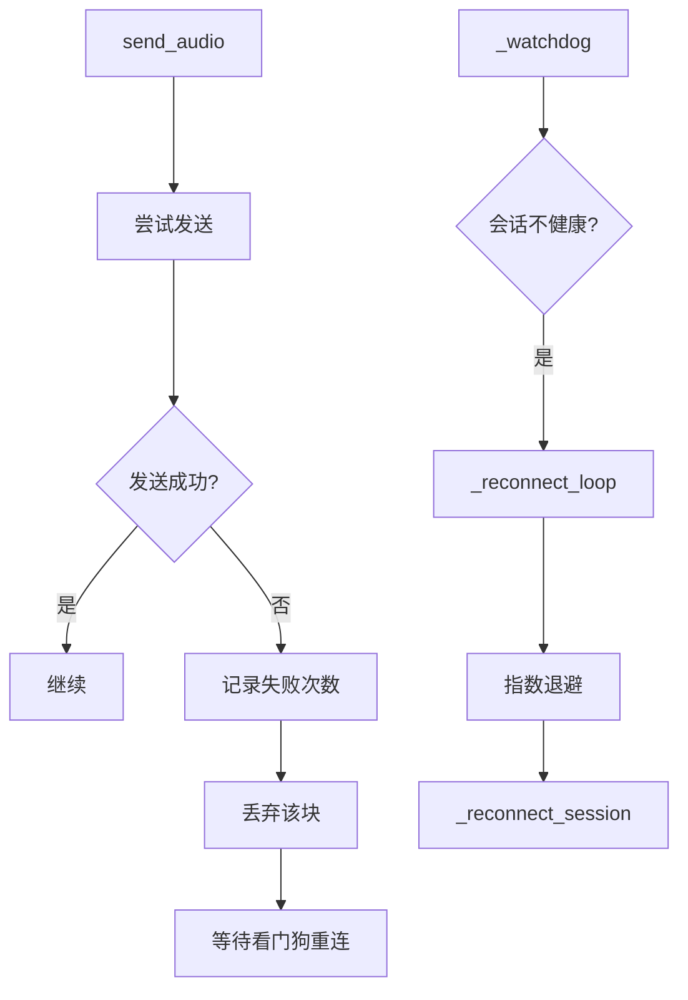
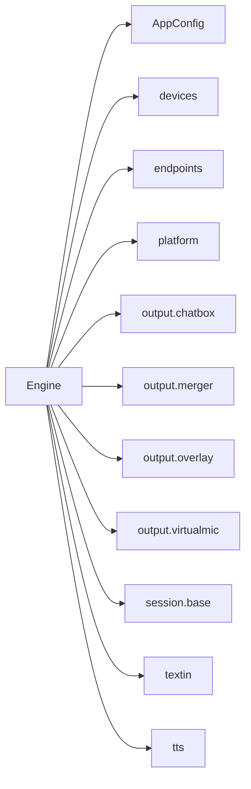

# 引擎生命周期管理

<cite>
**本文引用的文件**   
- [engine.py](file://vlt/engine.py)
- [app.py](file://vlt/app.py)
- [test_engine.py](file://tests/test_engine.py)
- [test_engine_stop.py](file://tests/test_engine_stop.py)
</cite>

## 目录
1. [引言](#引言)
2. [项目结构](#项目结构)
3. [核心组件](#核心组件)
4. [架构总览](#架构总览)
5. [详细组件分析](#详细组件分析)
6. [依赖关系分析](#依赖关系分析)
7. [性能与资源特性](#性能与资源特性)
8. [故障排查指南](#故障排查指南)
9. [结论](#结论)
10. [附录：完整生命周期示例路径](#附录完整生命周期示例路径)

## 引言
本文面向 VRChat 实时同传引擎的生命周期管理，重点解释 `Engine` 类的初始化、启动、运行、停止流程；说明主线程与事件循环线程的协作方式；阐述异步事件循环中协程任务的创建、调度与销毁；梳理引擎状态（running、stopping、stopped）转换；总结音频设备释放、网络连接关闭、内存泄漏防护等清理策略；并给出错误处理、异常恢复、性能监控与调试建议。

## 项目结构
本仓库中与引擎生命周期直接相关的代码集中在以下位置：
- `vlt/engine.py`：实现 `Engine`、采集循环、会话代理、重连看门狗、虚拟声卡输出、输入/静音闸门等全部核心逻辑。
- `vlt/app.py`：CLI 入口，负责加载配置、构造 `Engine`、调用 `start()` / `join()` / `stop()`，是外部使用引擎的典型入口。
- `tests/test_engine.py`：无头测试，覆盖构造、停止幂等、语言切换、PCM dry-run 生命周期。
- `tests/test_engine_stop.py`：回归测试，验证“停止翻译”必须真正终止无限循环采集线程。



**图表来源**
- [app.py:55-130](file://vlt/app.py#L55-L130)
- [engine.py:446-597](file://vlt/engine.py#L446-L597)
- [engine.py:820-888](file://vlt/engine.py#L820-L888)
- [engine.py:1008-1040](file://vlt/engine.py#L1008-L1040)

**章节来源**
- [app.py:55-130](file://vlt/app.py#L55-L130)
- [engine.py:446-597](file://vlt/engine.py#L446-L597)

## 核心组件
本节聚焦 `Engine` 类及其关键内部组件，说明职责边界与交互关系。

- `Engine`：可启停的同传引擎，封装会话、采集、输出、节流、重连、虚拟声卡等能力。对外暴露 `start()`、`request_stop()`、`wait_stopped()`、`stop()`、`join()`、`running` 属性等。
- `_SessionProxy`：把采集循环的 `send_audio` 转发到当前会话，支持自动重连后继续发送到新会话对象。
- `_SilenceGate`：长静音闸门，连续静音超过阈值暂停上送，声音恢复时补发 preroll，避免丢句首。
- `_LevelGate`：输入响度门限，只作用于 loopback 腿，低于门限不上送，开闸带 preroll，hold 期内不断句。
- `VirtualMic`：译音输出目标，接收 TTS 分片并写入系统虚拟声卡。
- `Chatbox` / `Merger` / `Overlay`：文本输出面，分别对应聊天气泡、手腕屏和文本合并去重。
- 采集函数 `run_mic` / `run_loopback` / `_pump_capture` / `_pump_vrchat_capture`：负责从麦克风或系统输出拉 PCM，转成 16kHz 单声道，经门限处理后送入会话。



**图表来源**
- [engine.py:349-354](file://vlt/engine.py#L349-L354)
- [engine.py:356-444](file://vlt/engine.py#L356-L444)
- [engine.py:204-256](file://vlt/engine.py#L204-L256)
- [engine.py:269-347](file://vlt/engine.py#L269-L347)
- [engine.py:446-597](file://vlt/engine.py#L446-L597)
- [engine.py:897-966](file://vlt/engine.py#L897-L966)
- [engine.py:834-883](file://vlt/engine.py#L834-L883)

**章节来源**
- [engine.py:204-347](file://vlt/engine.py#L204-L347)
- [engine.py:349-444](file://vlt/engine.py#L349-L444)
- [engine.py:446-597](file://vlt/engine.py#L446-L597)
- [engine.py:834-966](file://vlt/engine.py#L834-L966)

## 架构总览
引擎采用“主线程 + 事件循环线程”的双线程模型：
- 主线程：由 `app.py` 或 GUI 控制，负责构造 `Engine`、调用 `start()`、`join()`、`stop()`。
- 事件循环线程：`Engine._thread_run` 创建独立 asyncio 事件循环，并在其中运行 `_async_run` → `_build_and_run` → `_feed_audio`。

```mermaid
sequenceDiagram
participant Main as "主线程<br/>app.py"
participant Engine as "Engine<br/>engine.py"
participant Loop as "事件循环线程<br/>_thread_run"
participant Runner as "_async_run/_build_and_run"
participant Capture as "_feed_audio"
participant Session as "会话层"
Main->>Engine : 构造 Engine(...)
Main->>Engine : start()
Engine->>Loop : 启动守护线程
Loop->>Runner : run_until_complete(_async_run)
Runner->>Runner : _build_and_run()
Runner->>Capture : _feed_audio()
Capture->>Session : send_audio(...)
Note over Runner,Capture : 采集循环持续拉流，直到 stop_event 置位
```

**图表来源**
- [app.py:92-114](file://vlt/app.py#L92-L114)
- [engine.py:548-597](file://vlt/engine.py#L548-L597)
- [engine.py:719-748](file://vlt/engine.py#L719-L748)
- [engine.py:820-888](file://vlt/engine.py#L820-L888)
- [engine.py:1019-1040](file://vlt/engine.py#L1019-L1040)

**章节来源**
- [app.py:92-114](file://vlt/app.py#L92-L114)
- [engine.py:719-748](file://vlt/engine.py#L719-L748)
- [engine.py:820-888](file://vlt/engine.py#L820-L888)

## 详细组件分析

### 初始化过程
`Engine.__init__` 完成以下工作：
- 保存配置、方向、源、输出目标、事件回调、dry-run 标志、端点缓存等。
- 初始化线程相关字段：`_loop`、`_thread`、`_stopping`、`_stopped`、`_stop_event`。
- 初始化运行时对象占位：会话、chatbox、merger、overlay、virtualmic。
- 初始化串行锁 `_speak_lock_obj`，用于防止多路 TTS 分片交错。
- 初始化 `_SessionProxy`，内置 `_SilenceGate`。
- 初始化本地 repeat 抑制历史与 `_LevelGate`（仅 loopback 腿）。
- 根据 `session_base.base_url` 派生打字翻译与多模态 TTS 端点，失败则回落默认值并留痕。

关键点：
- 构造阶段不启动任何后台任务，`running` 为 False。
- 所有可能失败的配置解析都“留痕 + 回落默认”，避免构造即崩溃。

**章节来源**
- [engine.py:446-545](file://vlt/engine.py#L446-L545)

### 启动机制
`Engine.start()` 非阻塞启动：
- 若已有线程则直接返回（幂等）。
- 清除 stopping/stopped/stop_event 状态。
- 创建守护线程 `_thread_run` 并启动。

`_thread_run` 创建新的 asyncio 事件循环，运行 `_async_run`，并在 finally 中取消所有 pending task、关闭事件循环、设置 `_stopped`。

`_async_run` 调用 `_build_and_run`，并在 finally 中执行 `_cleanup`。

`_build_and_run` 负责：
- 构建 Chatbox、Overlay、VirtualMic、Merger。
- 创建会话 `_create_session`。
- 启动 `_pump_task`（定时刷新 chatbox、overlay、session tick、watchdog）。
- 启动 `_feed_audio`（根据 source 选择 pcm/mic/loopback）。
- 如果未被 stop 打断，等待 settle 时间让最终译文收尾。



**图表来源**
- [engine.py:548-597](file://vlt/engine.py#L548-L597)
- [engine.py:719-748](file://vlt/engine.py#L719-L748)
- [engine.py:820-895](file://vlt/engine.py#L820-L895)

**章节来源**
- [engine.py:548-597](file://vlt/engine.py#L548-L597)
- [engine.py:719-748](file://vlt/engine.py#L719-L748)
- [engine.py:820-895](file://vlt/engine.py#L820-L895)

### 停止流程
引擎提供两种停止方式：
- `request_stop()`：立即发出停止信号，不等收尾，适合 UI 并发下发。
- `stop(timeout)`：阻塞版，先 `request_stop()`，再 `wait_stopped(timeout)`。

停止信号通过 `_stopping` 和 `_stop_event` 传递：
- `_schedule_stop()` 在事件循环线程中调度 `_async_stop()`。
- `_async_stop()` 置位 `_stopping` 和 `_stop_event`，让采集循环退出。
- `_cleanup()` 按顺序取消 pump task、排空 chatbox、关闭 overlay、virtualmic、session、chatbox。

```mermaid
sequenceDiagram
participant UI as "界面/CLI"
participant Engine as "Engine"
participant Loop as "事件循环线程"
participant Capture as "采集循环"
participant Cleanup as "_cleanup"
UI->>Engine : request_stop()
Engine->>Engine : _stopping = True
Engine->>Engine : _stop_event.set()
Engine->>Loop : call_soon_threadsafe(_schedule_stop)
Loop->>Engine : _async_stop()
Engine->>Engine : _stopping = True
Engine->>Engine : _stop_event.set()
Capture-->>Engine : 检测到 stop_event → 退出
Engine->>Cleanup : _cleanup()
Cleanup->>Cleanup : cancel pump_task
Cleanup->>Cleanup : drain chatbox
Cleanup->>Cleanup : close overlay/virtualmic/session/chatbox
```

**图表来源**
- [engine.py:558-597](file://vlt/engine.py#L558-L597)
- [engine.py:705-748](file://vlt/engine.py#L705-L748)
- [engine.py:750-785](file://vlt/engine.py#L750-L785)

**章节来源**
- [engine.py:558-597](file://vlt/engine.py#L558-L597)
- [engine.py:705-748](file://vlt/engine.py#L705-L748)
- [engine.py:750-785](file://vlt/engine.py#L750-L785)

### 线程模型设计
- 主线程：负责用户交互、命令调用、UI 更新。
- 事件循环线程：运行 asyncio 事件循环，承载所有异步任务。
- 采集循环：`run_mic` / `run_loopback` / `_pump_capture` / `_pump_vrchat_capture` 是长跑协程，通过 `stop_event` 退出。
- 心跳循环：`_pump_task` 每 0.3 秒刷新 chatbox、overlay、session tick，并触发 watchdog。

线程间通信：
- `asyncio.run_coroutine_threadsafe`：从主线程调度协程到事件循环线程。
- `threading.Event`：线程安全的停止信号。
- `asyncio.Lock`：串行化 TTS 合成输出，防止分片交错。

**章节来源**
- [engine.py:548-597](file://vlt/engine.py#L548-L597)
- [engine.py:719-748](file://vlt/engine.py#L719-L748)
- [engine.py:1008-1040](file://vlt/engine.py#L1008-L1040)
- [engine.py:1253-1286](file://vlt/engine.py#L1253-L1286)

### 异步事件循环管理
- 任务创建：`_pump_task`、`_reconnect_task`、打字 TTS 的 `asyncio.to_thread`。
- 任务调度：`_pump_loop` 定时刷新；`_watchdog` 检测会话健康；`_reconnect_loop` 指数退避重连。
- 任务销毁：`_cleanup` 显式 cancel `_pump_task`；`_thread_run` finally 中 cancel 所有 pending tasks。



**图表来源**
- [engine.py:887-895](file://vlt/engine.py#L887-L895)
- [engine.py:1008-1018](file://vlt/engine.py#L1008-L1018)
- [engine.py:1290-1394](file://vlt/engine.py#L1290-L1394)
- [engine.py:750-758](file://vlt/engine.py#L750-L758)

**章节来源**
- [engine.py:887-895](file://vlt/engine.py#L887-L895)
- [engine.py:1008-1018](file://vlt/engine.py#L1008-L1018)
- [engine.py:1290-1394](file://vlt/engine.py#L1290-L1394)
- [engine.py:750-758](file://vlt/engine.py#L750-L758)

### 引擎状态管理
状态字段：
- `_stopping`：标记正在停止。
- `_stopped`：`threading.Event`，表示引擎已完全收尾。
- `_stop_event`：`threading.Event`，通知采集循环退出。
- `running` 属性：`not self._stopping and self._thread is not None and self._thread.is_alive()`。

状态转换：
- 初始：`_stopping=False`，`_stopped.clear()`，`_stop_event.clear()`。
- start：创建线程，`running=True`。
- request_stop：`_stopping=True`，`_stop_event.set()`。
- _async_stop：再次确保 `_stopping=True`，`_stop_event.set()`。
- _thread_run finally：`_stopped.set()`，线程退出。



**图表来源**
- [engine.py:482-487](file://vlt/engine.py#L482-L487)
- [engine.py:548-597](file://vlt/engine.py#L548-L597)
- [engine.py:705-748](file://vlt/engine.py#L705-L748)

**章节来源**
- [engine.py:482-487](file://vlt/engine.py#L482-L487)
- [engine.py:548-597](file://vlt/engine.py#L548-L597)
- [engine.py:705-748](file://vlt/engine.py#L705-L748)

### 资源清理策略
`_cleanup()` 按顺序执行：
1. 取消 `_pump_task`，最多等待 1 秒。
2. 排空 chatbox（优先最新一条，有预算上限）。
3. 关闭 overlay。
4. 关闭 virtualmic。
5. 关闭 session。
6. 关闭 chatbox。

每个步骤都有 try/except 包裹，确保一个资源关闭失败不影响其他资源。

音频设备释放：
- VirtualMic.open/close 管理虚拟声卡。
- 采集后端（PortAudio/pw-record）在 `_pump_capture` / `_pump_vrchat_capture` finally 中 close。

网络连接关闭：
- session.close() 由 `_cleanup` 和 `_reconnect_session` 调用。

内存泄漏防护：
- `_thread_run` finally 中 cancel 所有 pending tasks。
- `_pump_task` 显式 await 取消。
- `_text_hist` 使用 deque(maxlen=...) 限制长度。
- `_final_hist` 同样限制长度。

**章节来源**
- [engine.py:750-785](file://vlt/engine.py#L750-L785)
- [engine.py:787-818](file://vlt/engine.py#L787-L818)
- [engine.py:897-966](file://vlt/engine.py#L897-L966)
- [engine.py:1475-1496](file://vlt/engine.py#L1475-L1496)
- [engine.py:1842-1879](file://vlt/engine.py#L1842-L1879)

### 错误处理与异常恢复
- 采集发送失败：`_SessionProxy._send_one` 捕获异常，记录失败次数，丢弃该块，等待看门狗重连。
- 会话断线：`_watchdog` 检测 `is_alive=False`，触发 `_reconnect_loop`，指数退避重连。
- 本地 repeat 抑制：检测到连续高度雷同译文，主动 abort 会话，走重连路径。
- 打字翻译/TTS 异常：on_status 上报 warn/error，文字输出不受影响。
- 构造期配置非法：统一 `_warn_default` 留痕 + 回落默认。



**图表来源**
- [engine.py:421-444](file://vlt/engine.py#L421-L444)
- [engine.py:1290-1394](file://vlt/engine.py#L1290-L1394)

**章节来源**
- [engine.py:421-444](file://vlt/engine.py#L421-L444)
- [engine.py:1290-1394](file://vlt/engine.py#L1290-L1394)

## 依赖关系分析
`Engine` 依赖以下模块：
- `config.AppConfig`：配置对象。
- `devices`：麦克风设备枚举。
- `endpoints`：端点派生。
- `platform`：平台抽象（音频后端、overlay、loopback）。
- `output.chatbox`：聊天框输出。
- `output.merger`：文本合并。
- `output.overlay`：手腕屏输出。
- `output.virtualmic`：虚拟声卡。
- `session.base`：会话创建与管理。
- `textin`：文本翻译。
- `tts`：语音合成。



**图表来源**
- [engine.py:21-38](file://vlt/engine.py#L21-L38)
- [engine.py:446-545](file://vlt/engine.py#L446-L545)

**章节来源**
- [engine.py:21-38](file://vlt/engine.py#L21-L38)
- [engine.py:446-545](file://vlt/engine.py#L446-L545)

## 性能与资源特性
- 音频块大小：`CHUNK_BYTES = 3200`（100ms @16kHz s16le mono）。
- 句子静默阈值：`SENTENCE_GAP_S = 0.6`。
- Chatbox 排空预算：`CHATBOX_DRAIN_BUDGET_S = 2.0`，轮询间隔 `CHATBOX_DRAIN_TICK_S = 0.05`。
- 输入门限默认：`INPUT_GATE_DEFAULT_DB = -45.0 dBFS`，hold 500ms，preroll 250ms。
- 长静音闸门默认：after 30s，preroll 1s。
- 心跳循环：每 0.3 秒刷新一次。
- 重连退避：默认 `[2, 5, 10, 30]` 秒。
- 连接预算：`max_new_sessions_per_minute` 默认 4，超限等待。

优化点：
- TTS 流式合成减少首包延迟。
- 串行锁避免多路 TTS 分片交错。
- 输入门限减少无效音频上送。
- 长静音闸门防止服务端 repeat 掉线。
- Chatbox 排空优先最新一条，避免用户刚说完的话被挤掉。

**章节来源**
- [engine.py:41-56](file://vlt/engine.py#L41-L56)
- [engine.py:107-167](file://vlt/engine.py#L107-L167)
- [engine.py:1008-1018](file://vlt/engine.py#L1008-L1018)
- [engine.py:1374-1394](file://vlt/engine.py#L1374-L1394)
- [engine.py:1253-1286](file://vlt/engine.py#L1253-L1286)

## 故障排查指南
常见问题与定位方法：
- 停止后采集线程仍在运行：检查 `_stop_event` 是否传给采集函数，参考 `test_engine_stop.py`。
- 会话频繁断线：查看 `_dump_diagnostics` 输出的黑匣子信息，关注静音比例、重复输出、最近事件。
- 虚拟声卡打不开：检查 `_make_audio_out` 的设备选择逻辑，确认 platform 层返回值。
- 打字翻译失败：查看 on_status 中的 error/warn 消息。
- 输入门限无效：确认只作用于 loopback 腿，麦克风腿不走门限。

调试技巧：
- 使用 `dry_run=True` 跳过 OSC 发送，验证链路。
- 使用 PCM 文件测试，避免依赖真实麦克风。
- 启用 `on_stats` 收集 token 用量、连接耗时。
- 查看日志中的 `[engine]`、`[session]`、`[gate]`、`[loopback]`、`[net]` 前缀。

**章节来源**
- [test_engine_stop.py:83-111](file://tests/test_engine_stop.py#L83-L111)
- [engine.py:1307-1361](file://vlt/engine.py#L1307-L1361)
- [engine.py:918-966](file://vlt/engine.py#L918-L966)
- [engine.py:1189-1243](file://vlt/engine.py#L1189-L1243)

## 结论
`Engine` 类通过双线程模型实现了 VRChat 实时同传的完整生命周期管理：构造时准备配置与资源，启动时建立会话与采集循环，运行中维护心跳与重连，停止时有序清理资源。其设计强调健壮性：所有可能失败的路径都有异常捕获、状态留痕、默认回退；所有资源关闭都有 try/except 保护；所有长时间运行的任务都有明确的退出条件。对于开发者而言，理解 `_stop_event`、`_stopping`、`_stopped` 的协作关系，以及 `_cleanup` 的资源释放顺序，是正确使用和扩展引擎的关键。

## 附录：完整生命周期示例路径
以下示例展示从构造到启动、运行、停止的完整路径，供读者对照源码：

- CLI 入口构造与启动：
  - [app.py:92-114](file://vlt/app.py#L92-L114)
- 引擎构造：
  - [engine.py:446-545](file://vlt/engine.py#L446-L545)
- 引擎启动：
  - [engine.py:548-597](file://vlt/engine.py#L548-L597)
- 事件循环线程运行：
  - [engine.py:719-748](file://vlt/engine.py#L719-L748)
- 构建与运行：
  - [engine.py:820-895](file://vlt/engine.py#L820-L895)
- 采集循环：
  - [engine.py:1019-1040](file://vlt/engine.py#L1019-L1040)
- 停止流程：
  - [engine.py:558-597](file://vlt/engine.py#L558-L597)
  - [engine.py:705-748](file://vlt/engine.py#L705-L748)
  - [engine.py:750-785](file://vlt/engine.py#L750-L785)
- 测试用例：
  - [test_engine.py:19-84](file://tests/test_engine.py#L19-L84)
  - [test_engine_stop.py:83-111](file://tests/test_engine_stop.py#L83-L111)