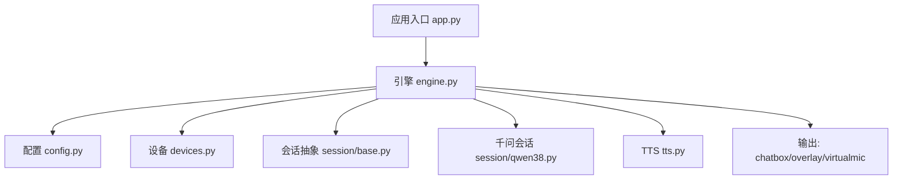
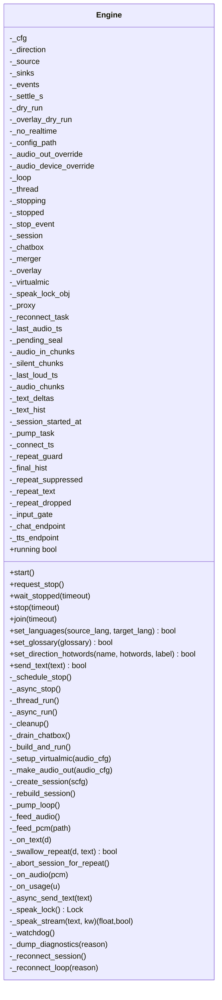
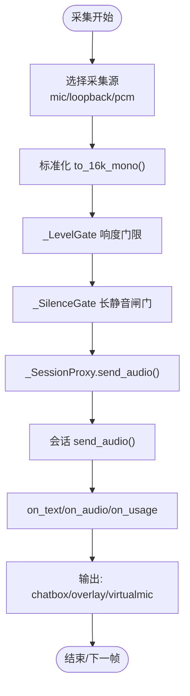
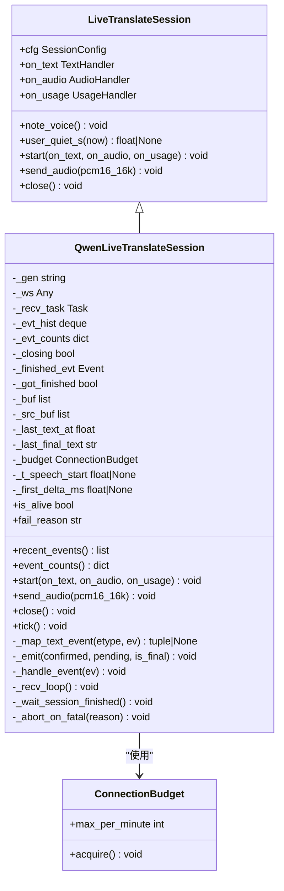
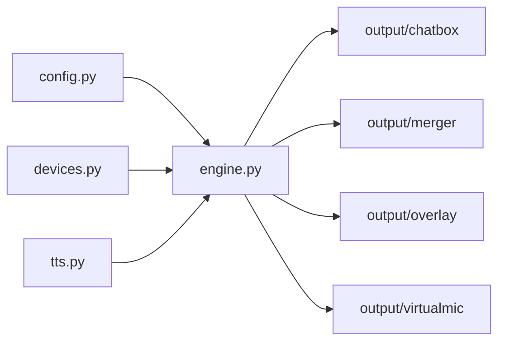
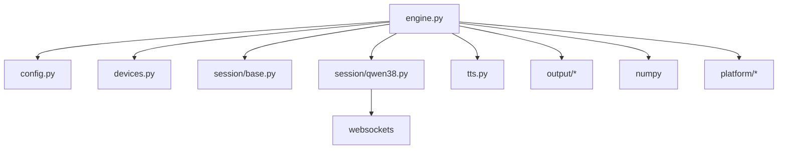
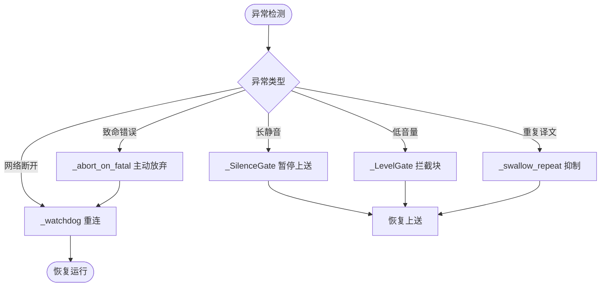

# 核心引擎架构

<cite>
**本文引用的文件**   
- [engine.py](file://vlt/engine.py)
- [app.py](file://vlt/app.py)
- [config.py](file://vlt/config.py)
- [tts.py](file://vlt/tts.py)
- [devices.py](file://vlt/devices.py)
- [session/base.py](file://vlt/session/base.py)
- [session/qwen38.py](file://vlt/session/qwen38.py)
</cite>

## 目录
1. [引言](#引言)
2. [项目结构](#项目结构)
3. [核心组件](#核心组件)
4. [架构总览](#架构总览)
5. [详细组件分析](#详细组件分析)
6. [依赖关系分析](#依赖关系分析)
7. [性能与并发特性](#性能与并发特性)
8. [故障处理与恢复策略](#故障处理与恢复策略)
9. [调试与排障指南](#调试与排障指南)
10. [结论](#结论)

## 引言
本文面向 VRChat 实时同传的核心引擎，系统性解释 Engine 类的设计模式、生命周期管理、音频处理管道、会话管理与错误恢复机制，并说明引擎如何协调音频采集、AI 服务连接与输出分发。文档同时覆盖事件驱动架构、线程安全与并发模型，给出初始化、配置与运行的代码路径指引，以及性能优化建议与调试技巧。

## 项目结构
仓库围绕“可插拔的实时翻译引擎”组织：
- `vlt/engine.py`：引擎主类、音频采集循环、事件调度、重连看门狗、虚拟声卡输出、打字输入译音管线。
- `vlt/app.py`：CLI 入口，负责参数解析、配置加载、Engine 实例化与运行。
- `vlt/config.py`：YAML + 环境变量配置加载、API Key 来源、方向级热词合并、会话配置构造。
- `vlt/tts.py`：文本转语音（整段与流式），为打字输入提供音频输出能力。
- `vlt/devices.py`：设备枚举与名称解析，屏蔽平台差异。
- `vlt/session/base.py`：会话抽象、TextDelta 归一化、静默兜底判定。
- `vlt/session/qwen38.py`：千问实时会话实现，封装 WebSocket 收发、事件映射、RPM 预算与致命错误处理。



图表来源
- [app.py:55-114](file://vlt/app.py#L55-L114)
- [engine.py:446-545](file://vlt/engine.py#L446-L545)
- [config.py:258-405](file://vlt/config.py#L258-L405)
- [session/base.py:130-181](file://vlt/session/base.py#L130-L181)
- [session/qwen38.py:82-138](file://vlt/session/qwen38.py#L82-L138)
- [tts.py:142-331](file://vlt/tts.py#L142-L331)

章节来源
- [app.py:1-166](file://vlt/app.py#L1-L166)
- [engine.py:1-1904](file://vlt/engine.py#L1-L1904)
- [config.py:1-406](file://vlt/config.py#L1-L406)
- [tts.py:1-424](file://vlt/tts.py#L1-L424)
- [devices.py:1-161](file://vlt/devices.py#L1-L161)
- [session/base.py:1-182](file://vlt/session/base.py#L1-L182)
- [session/qwen38.py:1-492](file://vlt/session/qwen38.py#L1-L492)

## 核心组件
- Engine：可编程启停的同传引擎，统一编排采集、会话、输出、TTS、事件回调与重连。
- _SessionProxy：把采集循环的 send_audio 转发到当前会话，支持自动重连后继续上送。
- _SilenceGate / _LevelGate：长静音闸门与输入响度门限，避免长时间静音导致服务端 repeat 掉线，过滤远处小声玩家。
- Chatbox/Merger/Overlay/VirtualMic：输出子系统，分别负责聊天气泡、增量合并、手腕屏叠加、虚拟声卡播放。
- LiveTranslateSession/QwenLiveTranslateSession：会话抽象与具体实现，封装 WebSocket、事件映射、RPM 预算、致命错误处理。
- TTS：文本转语音，支持整段与流式（SSE），为打字输入提供音频输出。
- AppConfig/Direction/SessionConfig：配置数据模型，负责 YAML 解析、API Key 来源、热词合并与会话参数构造。

章节来源
- [engine.py:204-347](file://vlt/engine.py#L204-L347)
- [engine.py:349-545](file://vlt/engine.py#L349-L545)
- [engine.py:820-888](file://vlt/engine.py#L820-L888)
- [session/base.py:18-121](file://vlt/session/base.py#L18-L121)
- [session/qwen38.py:62-138](file://vlt/session/qwen38.py#L62-L138)
- [tts.py:142-331](file://vlt/tts.py#L142-L331)
- [config.py:121-188](file://vlt/config.py#L121-L188)

## 架构总览
Engine 采用“事件驱动 + 异步任务 + 守护线程”的混合架构：
- 启动时创建独立 asyncio 事件循环线程，非阻塞 start()。
- 采集循环（麦克风/环回）是无限循环，通过 stop_event 退出；PCM 源在每个 chunk 之间检查 _stopping。
- 会话层使用 websockets 接收事件，内部有独立的接收协程。
- 输出子系统（chatbox/overlay/virtualmic）由 Merger 与 Engine 回调驱动。
- 重连看门狗每 0.3s 轮询会话健康状态，异常则按退避策略重建会话。

```mermaid
sequenceDiagram
participant CLI as "CLI app.py"
participant Engine as "Engine"
participant Loop as "事件循环线程"
participant Capture as "采集(mic/loopback)"
participant Proxy as "_SessionProxy"
participant Session as "QwenLiveTranslateSession"
participant Output as "输出(chatbox/overlay/virtualmic)"
CLI->>Engine : 构造 Engine(cfg, direction, source, sinks, events)
CLI->>Engine : start()
Engine->>Loop : 启动 asyncio 事件循环
Loop->>Engine : _async_run() → _build_and_run()
Engine->>Capture : run_mic()/run_loopback()
Capture->>Proxy : send_audio(pcm)
Proxy->>Session : send_audio(pcm)
Session-->>Engine : on_text(TextDelta)/on_audio(bytes)/on_usage(dict)
Engine->>Output : 更新 chatbox/overlay/virtualmic
Engine->>Engine : _pump_loop() 每 0.3s tick()
Engine->>Session : tick() 静默兜底封句
Engine->>Engine : _watchdog() 断线重连
```

图表来源
- [app.py:55-114](file://vlt/app.py#L55-L114)
- [engine.py:548-592](file://vlt/engine.py#L548-L592)
- [engine.py:719-748](file://vlt/engine.py#L719-L748)
- [engine.py:820-888](file://vlt/engine.py#L820-L888)
- [engine.py:1008-1055](file://vlt/engine.py#L1008-L1055)
- [session/qwen38.py:113-138](file://vlt/session/qwen38.py#L113-L138)

## 详细组件分析

### Engine 类设计与生命周期
Engine 负责：
- 生命周期：start() 非阻塞启动守护线程；stop()/request_stop()/wait_stopped() 幂等停止；join() 等待线程结束。
- 构建与运行：_build_and_run() 初始化 chatbox/overlay/virtualmic，创建会话，启动 pump_loop 与采集循环。
- 事件桥接：_on_text/_on_audio/_on_usage 将会话事件分发给输出子系统。
- 打字输入：send_text() 调用文本翻译接口，再走 TTS 合成与虚拟声卡输出。
- 重连看门狗：_watchdog() 检测会话 is_alive，失败则触发 _reconnect_loop()。



图表来源
- [engine.py:446-545](file://vlt/engine.py#L446-L545)
- [engine.py:548-748](file://vlt/engine.py#L548-L748)
- [engine.py:787-888](file://vlt/engine.py#L787-L888)
- [engine.py:1008-1055](file://vlt/engine.py#L1008-L1055)
- [engine.py:1059-1286](file://vlt/engine.py#L1059-L1286)
- [engine.py:1290-1394](file://vlt/engine.py#L1290-L1394)

章节来源
- [engine.py:446-545](file://vlt/engine.py#L446-L545)
- [engine.py:548-748](file://vlt/engine.py#L548-L748)
- [engine.py:787-888](file://vlt/engine.py#L787-L888)
- [engine.py:1008-1055](file://vlt/engine.py#L1008-L1055)
- [engine.py:1059-1286](file://vlt/engine.py#L1059-L1286)
- [engine.py:1290-1394](file://vlt/engine.py#L1290-L1394)

### 音频处理管道
- 采集入口：run_mic()/run_loopback() 根据 source 选择麦克风或系统声采集。
- 标准化：to_16k_mono() 将任意采样率/声道转换为 16kHz 单声道 s16le PCM。
- 门限控制：_LevelGate 对 loopback 腿做响度门限，_SilenceGate 防止长静音导致服务端 repeat。
- 发送：_SessionProxy.send_audio() 统计、上报 note_voice()、经 _gate.feed() 放行后调用 session.send_audio()。
- 输出：_on_audio() 将 24kHz 单声道 PCM 重采样为 48kHz 立体声，交给 VirtualMic 播放，并按句尾标记整句丢弃。



图表来源
- [engine.py:1019-1055](file://vlt/engine.py#L1019-L1055)
- [engine.py:1732-1759](file://vlt/engine.py#L1732-L1759)
- [engine.py:269-347](file://vlt/engine.py#L269-L347)
- [engine.py:204-256](file://vlt/engine.py#L204-L256)
- [engine.py:375-443](file://vlt/engine.py#L375-L443)
- [engine.py:1134-1150](file://vlt/engine.py#L1134-L1150)

章节来源
- [engine.py:1019-1055](file://vlt/engine.py#L1019-L1055)
- [engine.py:1732-1759](file://vlt/engine.py#L1732-L1759)
- [engine.py:269-347](file://vlt/engine.py#L269-L347)
- [engine.py:204-256](file://vlt/engine.py#L204-L256)
- [engine.py:375-443](file://vlt/engine.py#L375-L443)
- [engine.py:1134-1150](file://vlt/engine.py#L1134-L1150)

### 会话管理机制
- 抽象层：LiveTranslateSession 定义 start/send_audio/close 接口，TextDelta 归一化译文事件。
- 具体实现：QwenLiveTranslateSession 封装 WebSocket 连接、事件映射、RPM 预算、致命错误处理。
- 静默兜底：tick() 结合 should_finalize() 判断是否封最终版，快路径依赖 note_voice() 电平信号。
- 重连：ConnectionBudget 限制每分钟新建连接数；_recv_loop 异常时唤醒 close() 中等待 session.finished。



图表来源
- [session/base.py:18-121](file://vlt/session/base.py#L18-L121)
- [session/base.py:130-181](file://vlt/session/base.py#L130-L181)
- [session/qwen38.py:62-138](file://vlt/session/qwen38.py#L62-L138)
- [session/qwen38.py:407-492](file://vlt/session/qwen38.py#L407-L492)

章节来源
- [session/base.py:18-121](file://vlt/session/base.py#L18-L121)
- [session/base.py:130-181](file://vlt/session/base.py#L130-L181)
- [session/qwen38.py:62-138](file://vlt/session/qwen38.py#L62-L138)
- [session/qwen38.py:407-492](file://vlt/session/qwen38.py#L407-L492)

### 事件驱动架构与异步处理
- 事件循环：Engine._thread_run() 创建新事件循环，_async_run() 执行 _build_and_run()，finally 清理资源。
- 泵循环：_pump_loop() 每 0.3s 刷新 chatbox、tick overlay、tick session、watchdog。
- 采集循环：run_mic()/run_loopback() 在 while 循环中读取音频块，遇到 stop_event 退出。
- 会话接收：QwenLiveTranslateSession._recv_loop() 异步遍历 ws 事件，分发到 _handle_event()。

```mermaid
sequenceDiagram
participant Thread as "守护线程"
participant Loop as "事件循环"
participant Pump as "_pump_loop()"
participant Session as "QwenLiveTranslateSession"
participant WS as "WebSocket"
Thread->>Loop : run_until_complete(_async_run())
Loop->>Pump : create_task(_pump_loop())
Pump->>Session : tick()
Pump->>Session : _watchdog()
Session->>WS : async for raw in ws
WS-->>Session : event JSON
Session->>Session : _handle_event()
Session-->>Engine : on_text/on_audio/on_usage
```

图表来源
- [engine.py:719-748](file://vlt/engine.py#L719-L748)
- [engine.py:1008-1017](file://vlt/engine.py#L1008-L1017)
- [session/qwen38.py:307-342](file://vlt/session/qwen38.py#L307-L342)

章节来源
- [engine.py:719-748](file://vlt/engine.py#L719-L748)
- [engine.py:1008-1017](file://vlt/engine.py#L1008-L1017)
- [session/qwen38.py:307-342](file://vlt/session/qwen38.py#L307-L342)

### 线程安全与并发机制
- 线程隔离：Engine 在独立线程运行事件循环，GUI/CLI 通过 request_stop()/wait_stopped() 交互。
- 协程跨线程：_schedule_stop() 使用 call_soon_threadsafe() 调度 _async_stop()。
- 串行锁：_speak_lock() 保证流式合成写入 VirtualMic 的顺序，避免分片交错。
- 采集循环保护：_send_one() 捕获发送异常，不中断采集循环，交由看门狗重连。

章节来源
- [engine.py:558-592](file://vlt/engine.py#L558-L592)
- [engine.py:705-740](file://vlt/engine.py#L705-L740)
- [engine.py:1253-1286](file://vlt/engine.py#L1253-L1286)
- [engine.py:421-443](file://vlt/engine.py#L421-L443)

### 与其他组件的集成关系与数据流向
- 配置：AppConfig/Direction/SessionConfig 从 YAML 与环境变量加载，合并热词，构造会话参数。
- 设备：devices.py 枚举麦克风/输出设备，resolve_device_name 解析名称到索引。
- TTS：synthesize/synthesize_stream 提供 24kHz 单声道 PCM，供 VirtualMic 播放。
- 输出：chatbox 通过 TokenBucket 限流，Merger 合并增量，Overlay 更新手腕屏，VirtualMic 播放译音。



图表来源
- [config.py:258-405](file://vlt/config.py#L258-L405)
- [devices.py:39-161](file://vlt/devices.py#L39-L161)
- [tts.py:142-331](file://vlt/tts.py#L142-L331)
- [engine.py:820-888](file://vlt/engine.py#L820-L888)

章节来源
- [config.py:258-405](file://vlt/config.py#L258-L405)
- [devices.py:39-161](file://vlt/devices.py#L39-L161)
- [tts.py:142-331](file://vlt/tts.py#L142-L331)
- [engine.py:820-888](file://vlt/engine.py#L820-L888)

## 依赖关系分析
- Engine 依赖：
  - config.AppConfig/Direction/SessionConfig：配置与热词合并。
  - devices.enumerate_mic_devices/resolve_device_name：设备枚举与名称解析。
  - session.base.LiveTranslateSession：会话抽象。
  - session.qwen38.QwenLiveTranslateSession：千问实时会话实现。
  - tts.synthesize/synthesize_stream：文本转语音。
  - output.chatbox.Merger/Overlay/VirtualMic：输出子系统。
- 外部依赖：
  - websockets：实时会话通信。
  - numpy：音频处理（RMS、降采样、低通滤波）。
  - platform：平台抽象（WASAPI/PipeWire）。



图表来源
- [engine.py:1-39](file://vlt/engine.py#L1-L39)
- [session/qwen38.py:1-25](file://vlt/session/qwen38.py#L1-L25)

章节来源
- [engine.py:1-39](file://vlt/engine.py#L1-L39)
- [session/qwen38.py:1-25](file://vlt/session/qwen38.py#L1-L25)

## 性能与并发特性
- 首包延迟：TTS 流式合成首包约 0.36~0.42s，虚拟声卡抖动缓冲起播，打字腿开口从 ~1.7s 降到 ~0.5s。
- 静默兜底快路径：结合 note_voice() 电平信号与文字静默阈值，省 ~1.8s。
- 节流合并：Merger 与 TokenBucket 控制 chatbox 发送频率，避免刷屏。
- 并发控制：_speak_lock() 串行化流式合成写入，避免分片交错。
- 重连预算：ConnectionBudget 限制每分钟新建连接数，防止快速重连撞掉服务端。

章节来源
- [tts.py:142-331](file://vlt/tts.py#L142-L331)
- [session/base.py:60-84](file://vlt/session/base.py#L60-L84)
- [engine.py:1253-1286](file://vlt/engine.py#L1253-L1286)
- [session/qwen38.py:62-80](file://vlt/session/qwen38.py#L62-L80)

## 故障处理与恢复策略
- 长静音闸门：连续静音超阈值暂停上送，声音恢复时补发 preroll，防丢句首。
- 输入响度门限：低于门限的块不上送，hold/preroll 保证句子不断裂。
- 本地 repeat 抑制：连续高度雷同的最终译文触发抑制，主动重建会话。
- 致命错误处理：服务端 error 包含特定消息时主动放弃会话，看门狗重连。
- 优雅关闭：_cleanup() 依次关闭 pump_task/chatbox/overlay/virtualmic/session，确保资源释放。



图表来源
- [engine.py:204-256](file://vlt/engine.py#L204-L256)
- [engine.py:269-347](file://vlt/engine.py#L269-L347)
- [engine.py:1079-1133](file://vlt/engine.py#L1079-L1133)
- [session/qwen38.py:42-60](file://vlt/session/qwen38.py#L42-L60)
- [engine.py:1290-1394](file://vlt/engine.py#L1290-L1394)

章节来源
- [engine.py:204-256](file://vlt/engine.py#L204-L256)
- [engine.py:269-347](file://vlt/engine.py#L269-L347)
- [engine.py:1079-1133](file://vlt/engine.py#L1079-L1133)
- [session/qwen38.py:42-60](file://vlt/session/qwen38.py#L42-L60)
- [engine.py:1290-1394](file://vlt/engine.py#L1290-L1394)

## 调试与排障指南
- 黑匣子诊断：断线时打印会话存活时间、输入音频统计、静音比例、最近译文与服务端事件序列。
- 设备枚举：list_devices() 列出实际使用的输入/输出设备，显示 PortAudio 索引。
- 日志留痕：所有降级路径均打印警告，禁止静默降级。
- 测试用例：tests/test_engine.py、test_reconnect.py、test_silence_gate.py 等覆盖核心逻辑。

章节来源
- [engine.py:1307-1361](file://vlt/engine.py#L1307-L1361)
- [engine.py:1882-1904](file://vlt/engine.py#L1882-L1904)

## 结论
VRChat 实时同传的核心引擎以 Engine 为中心，采用事件驱动与异步任务架构，协调音频采集、AI 会话与输出分发。通过多级门限、静默兜底、本地 repeat 抑制与重连看门狗，系统在真实场景中具备高鲁棒性。配置层与设备层解耦，TTS 与输出子系统可插拔，便于扩展与维护。建议在部署时关注 RPM 预算、TTS 流式首包延迟与虚拟声卡缓冲参数，并结合黑匣子诊断定位问题。