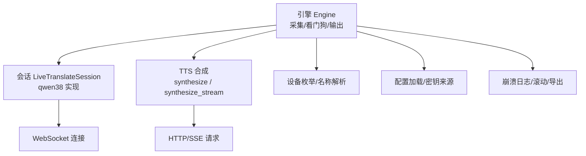
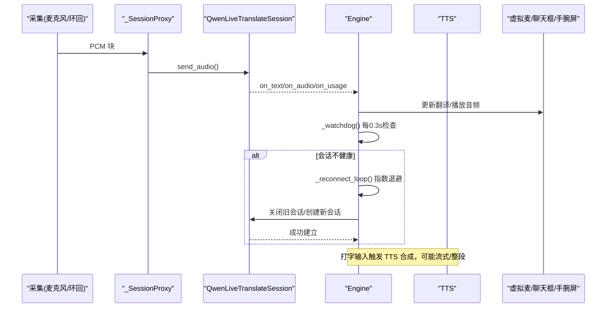
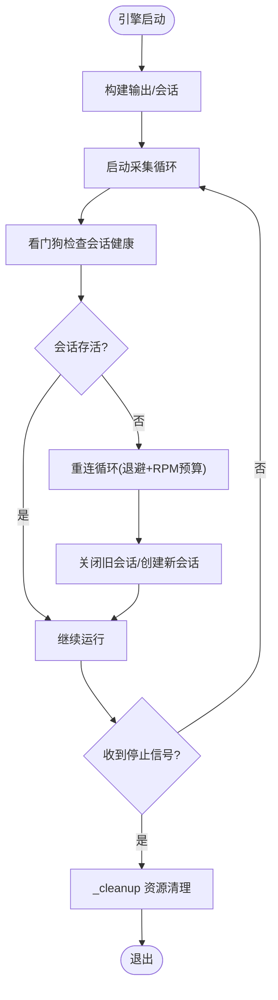
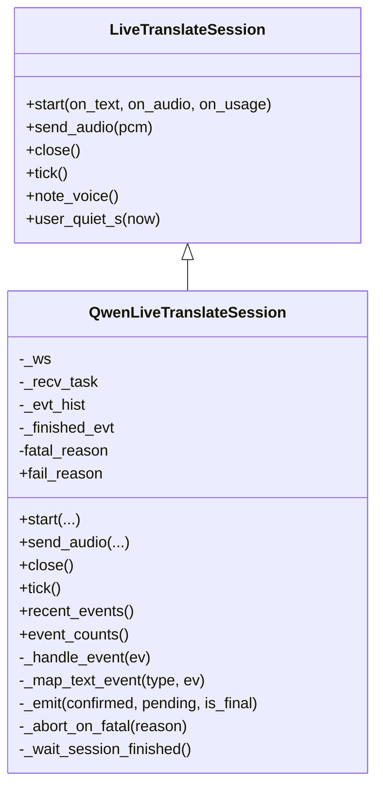
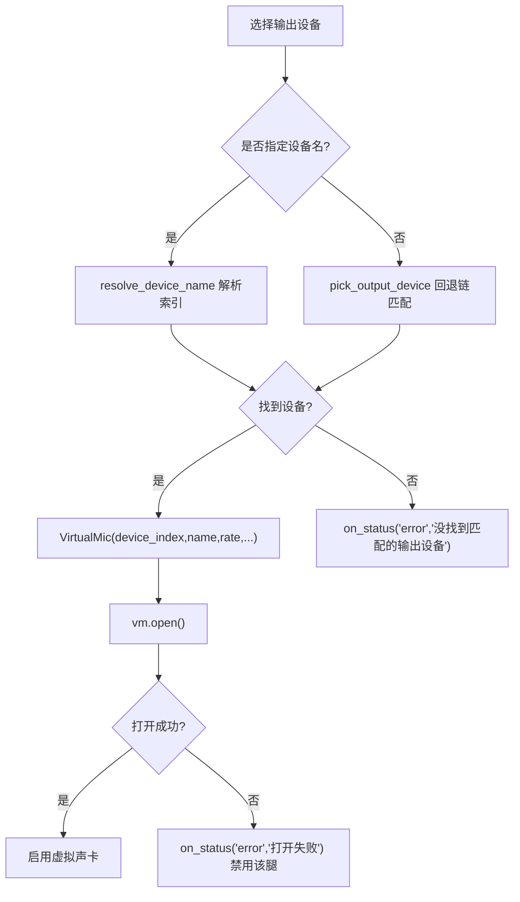
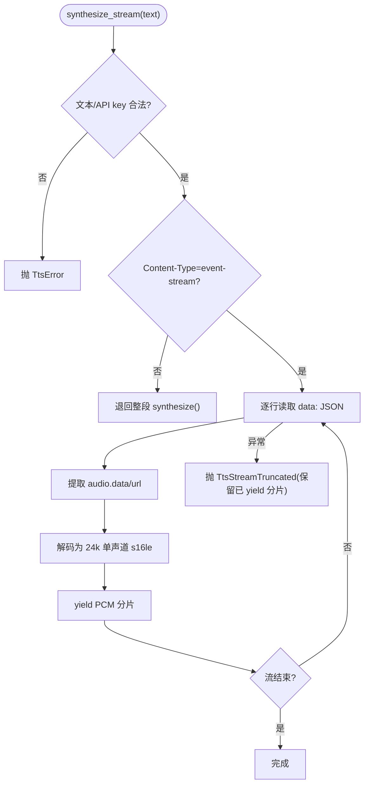
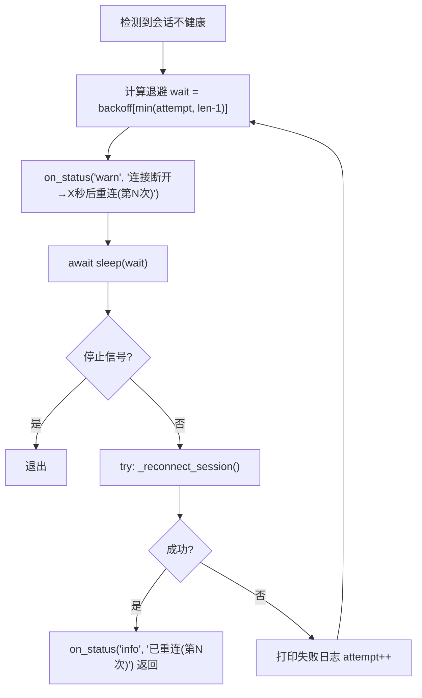
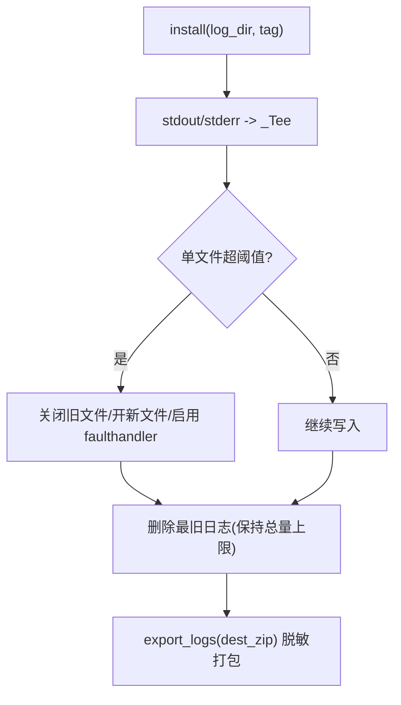
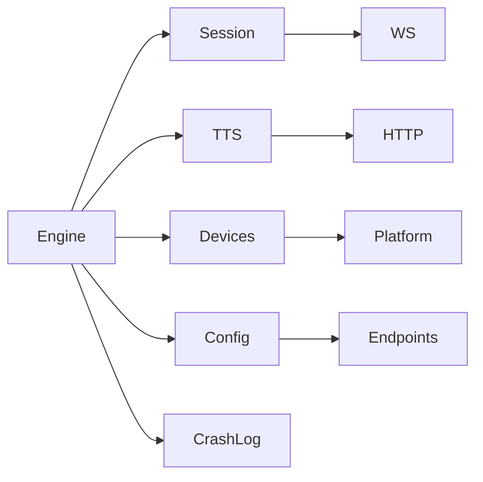

# 错误处理和恢复

<cite>
**本文引用的文件**   
- [engine.py](file://vlt/engine.py)
- [crashlog.py](file://vlt/crashlog.py)
- [config.py](file://vlt/config.py)
- [tts.py](file://vlt/tts.py)
- [devices.py](file://vlt/devices.py)
- [session/base.py](file://vlt/session/base.py)
- [session/qwen38.py](file://vlt/session/qwen38.py)
- [test_reconnect.py](file://tests/test_reconnect.py)
- [test_engine_stop.py](file://tests/test_engine_stop.py)
- [test_repeat_guard.py](file://tests/test_repeat_guard.py)
- [test_virtualmic.py](file://tests/test_virtualmic.py)
- [test_voice_settings.py](file://tests/test_voice_settings.py)
- [config.example.yaml](file://config.example.yaml)
</cite>

## 目录
1. [引言](#引言)
2. [项目结构](#项目结构)
3. [核心组件](#核心组件)
4. [架构总览](#架构总览)
5. [详细组件分析](#详细组件分析)
6. [依赖关系分析](#依赖关系分析)
7. [性能与稳定性考量](#性能与稳定性考量)
8. [故障排查指南](#故障排查指南)
9. [结论](#结论)
10. [附录：配置项速查](#附录配置项速查)

## 引言
本文面向 VRChat 实时同传的错误处理与恢复机制，聚焦以下目标：
- 识别并分类网络错误、音频设备错误、AI 服务错误。
- 说明重试与退避策略、失败统计与预算控制。
- 解释崩溃恢复、状态恢复、数据一致性保障与资源清理。
- 梳理日志记录、诊断信息收集（堆栈、性能指标、状态快照）。
- 给出用户友好的错误提示与恢复建议。
- 通过代码级流程图与时序图展示关键错误场景的处理路径。
- 提供监控告警思路与常见问题解决方案。

## 项目结构
本仓库围绕“引擎 + 会话 + TTS + 设备/平台抽象 + 崩溃日志”组织：
- vlt/engine.py：引擎生命周期、采集循环、看门狗重连、输出合并、虚拟声卡、打字译音、断线诊断。
- vlt/session/base.py 与 vlt/session/qwen38.py：会话抽象与具体实现（WebSocket 事件、致命错误判定、静默兜底）。
- vlt/tts.py：文本转语音（同步/流式），含降级与截断语义。
- vlt/devices.py：设备枚举与名称解析。
- vlt/config.py：配置加载、密钥来源、回退默认值。
- vlt/crashlog.py：崩溃钩子、日志滚动、导出打包。
- tests/*：覆盖重连、停止、重复抑制、虚拟声卡、音色试听等错误路径。

**图示来源**
- [engine.py:446-599](file://vlt/engine.py#L446-L599)
- [session/base.py:130-181](file://vlt/session/base.py#L130-L181)
- [session/qwen38.py:82-138](file://vlt/session/qwen38.py#L82-L138)
- [tts.py:142-331](file://vlt/tts.py#L142-L331)
- [devices.py:39-161](file://vlt/devices.py#L39-L161)
- [config.py:258-406](file://vlt/config.py#L258-L406)
- [crashlog.py:256-318](file://vlt/crashlog.py#L256-L318)

**章节来源**
- [engine.py:446-599](file://vlt/engine.py#L446-L599)
- [session/base.py:130-181](file://vlt/session/base.py#L130-L181)
- [session/qwen38.py:82-138](file://vlt/session/qwen38.py#L82-L138)
- [tts.py:142-331](file://vlt/tts.py#L142-L331)
- [devices.py:39-161](file://vlt/devices.py#L39-L161)
- [config.py:258-406](file://vlt/config.py#L258-L406)
- [crashlog.py:256-318](file://vlt/crashlog.py#L256-L318)

## 核心组件
- 引擎 Engine：负责启动/停止、采集循环、看门狗重连、输出合并、虚拟声卡、打字译音、断线诊断。
- 会话层：抽象接口 LiveTranslateSession，具体实现 QwenLiveTranslateSession（WebSocket 事件、致命错误判定、静默兜底）。
- TTS：支持整段与流式合成，具备协议降级、截断保留、错误分类。
- 设备：麦克风/系统声采集/输出设备枚举与名称解析，带回退链。
- 配置：YAML + 环境变量 + CLI 配置，API key 多来源，非法值留痕回落。
- 崩溃日志：faulthandler、未捕获异常、Tk 回调异常、日志滚动与导出。

**章节来源**
- [engine.py:446-599](file://vlt/engine.py#L446-L599)
- [session/base.py:130-181](file://vlt/session/base.py#L130-L181)
- [session/qwen38.py:82-138](file://vlt/session/qwen38.py#L82-L138)
- [tts.py:59-331](file://vlt/tts.py#L59-L331)
- [devices.py:39-161](file://vlt/devices.py#L39-L161)
- [config.py:258-406](file://vlt/config.py#L258-L406)
- [crashlog.py:256-318](file://vlt/crashlog.py#L256-L318)

## 架构总览
下图展示错误处理的关键流程：采集输入 → 会话发送 → 服务端事件 → 看门狗检测 → 重连；同时 TTS 合成走独立路径，异常时降级或截断保留。

**图示来源**
- [engine.py:1008-1018](file://vlt/engine.py#L1008-L1018)
- [engine.py:1290-1394](file://vlt/engine.py#L1290-L1394)
- [session/qwen38.py:307-359](file://vlt/session/qwen38.py#L307-L359)
- [tts.py:201-331](file://vlt/tts.py#L201-L331)

## 详细组件分析

### 引擎错误处理与恢复
- 线程模型：Engine 在独立线程中运行 asyncio 事件循环；stop()/request_stop() 幂等且快速返回，避免界面卡顿。
- 采集循环：run_mic/run_loopback 使用统一泵 `_pump_capture`，按输入门限放行，失败不断腿。
- 看门狗：每 0.3s 检查会话健康，若 `is_alive=False` 则安排重连，带退避与 RPM 预算。
- 资源清理：_cleanup 取消 pump_task、排空 chatbox、关闭 overlay/virtualmic/session/chatbox，全部 try/except 包裹。
- 断线诊断：_dump_diagnostics 输出黑匣子（静音占比、最近译文、服务端事件序列）。

**图示来源**
- [engine.py:719-748](file://vlt/engine.py#L719-L748)
- [engine.py:750-786](file://vlt/engine.py#L750-L786)
- [engine.py:1008-1018](file://vlt/engine.py#L1008-L1018)
- [engine.py:1290-1394](file://vlt/engine.py#L1290-L1394)

**章节来源**
- [engine.py:719-748](file://vlt/engine.py#L719-L748)
- [engine.py:750-786](file://vlt/engine.py#L750-L786)
- [engine.py:1008-1018](file://vlt/engine.py#L1008-L1018)
- [engine.py:1290-1394](file://vlt/engine.py#L1290-L1394)
- [test_engine_stop.py:99-142](file://tests/test_engine_stop.py#L99-L142)

### 网络与会话错误处理
- 致命错误判定：COMMON_ERROR、repeat output 等直接标记 fatal_reason，主动放弃会话，避免干等 1011。
- 结束序列：先发 session.finish，等待 session.finished（有界超时），再 ws.close（有界超时）。
- 接收循环：异常时唤醒 close 的等待事件，保证停止路径不被阻塞。
- 连接预算：ConnectionBudget 限制每分钟新建连接数，防止快速重连撞掉服务端。

**图示来源**
- [session/base.py:130-181](file://vlt/session/base.py#L130-L181)
- [session/qwen38.py:82-138](file://vlt/session/qwen38.py#L82-L138)
- [session/qwen38.py:204-280](file://vlt/session/qwen38.py#L204-L280)
- [session/qwen38.py:307-359](file://vlt/session/qwen38.py#L307-L359)
- [session/qwen38.py:407-443](file://vlt/session/qwen38.py#L407-L443)

**章节来源**
- [session/qwen38.py:42-59](file://vlt/session/qwen38.py#L42-L59)
- [session/qwen38.py:204-280](file://vlt/session/qwen38.py#L204-L280)
- [session/qwen38.py:307-359](file://vlt/session/qwen38.py#L307-L359)
- [session/qwen38.py:407-443](file://vlt/session/qwen38.py#L407-L443)

### 音频设备错误处理
- 设备枚举：enumerate_mic_devices/enumerate_loopback_devices/enumerate_audio_out_devices 均 try/except 返回空列表，避免崩溃。
- 名称解析：resolve_device_name 支持精确/大小写/子串匹配，解析不到返回 None 由调用方回退。
- 虚拟声卡打开失败：_setup_virtualmic/_make_audio_out 失败仅禁用该腿，不影响其它功能；on_status 上报 error/warn。

**图示来源**
- [engine.py:897-966](file://vlt/engine.py#L897-L966)
- [devices.py:105-161](file://vlt/devices.py#L105-L161)

**章节来源**
- [engine.py:897-966](file://vlt/engine.py#L897-L966)
- [devices.py:39-161](file://vlt/devices.py#L39-L161)
- [test_virtualmic.py:188-209](file://tests/test_virtualmic.py#L188-L209)

### AI 服务错误处理（TTS）
- 错误类型：TtsError（通用）、TtsStreamTruncated（流式中途中断但已 yield 的分片有效）。
- 降级策略：SSE 协议不支持时退回整段合成；中途断流保留已播部分并抛截断异常，调用方提示 warn。
- 参数校验：空文本/缺 API key 直接抛错，避免无效请求。

**图示来源**
- [tts.py:201-331](file://vlt/tts.py#L201-L331)

**章节来源**
- [tts.py:59-96](file://vlt/tts.py#L59-L96)
- [tts.py:142-198](file://vlt/tts.py#L142-L198)
- [tts.py:201-331](file://vlt/tts.py#L201-L331)

### 重试机制与退避策略
- 会话重连：_reconnect_loop 使用配置的 reconnect_backoff 表（默认 [2,5,10,30]），按尝试次数取对应延迟，直至成功或停止。
- 连接预算：ConnectionBudget 滑动窗口限制每分钟新建连接数，避免快速重连被服务端拒绝。
- 失败统计：Engine 内部累计 sent_bytes/silent_chunks/audio_in_chunks/text_deltas/audio_chunks，断线时输出诊断。

**图示来源**
- [engine.py:1374-1394](file://vlt/engine.py#L1374-L1394)
- [session/qwen38.py:62-80](file://vlt/session/qwen38.py#L62-L80)

**章节来源**
- [engine.py:1374-1394](file://vlt/engine.py#L1374-L1394)
- [session/qwen38.py:62-80](file://vlt/session/qwen38.py#L62-L80)
- [test_reconnect.py:90-126](file://tests/test_reconnect.py#L90-L126)

### 崩溃恢复与资源清理
- 崩溃钩子：faulthandler 启用、主线程/子线程未捕获异常、Tk 回调异常均写入日志。
- 日志滚动：单文件超阈值切段，总量超阈值删除最旧文件，当前文件永不删。
- 正常退出：close() 恢复 stdout/stderr、禁用 faulthandler、关闭日志文件。

**图示来源**
- [crashlog.py:131-236](file://vlt/crashlog.py#L131-L236)
- [crashlog.py:256-318](file://vlt/crashlog.py#L256-L318)
- [crashlog.py:70-128](file://vlt/crashlog.py#L70-L128)

**章节来源**
- [crashlog.py:131-236](file://vlt/crashlog.py#L131-L236)
- [crashlog.py:256-318](file://vlt/crashlog.py#L256-L318)
- [crashlog.py:70-128](file://vlt/crashlog.py#L70-L128)

### 用户友好的错误提示与恢复建议
- 设备错误：明确提示“没找到匹配的输出设备（回退链：...）。虚拟声卡装好了吗？其余功能不受影响。”
- TTS 错误：区分“内容空/缺 key/网络不可达/HTTP 错误”，流式截断提示“只念了一半（网络/服务端中断，已保留已出声的 Xs）”。
- 会话错误：致命错误主动重建，非致命错误只打印不断线；重连过程持续 on_status 提示。
- 配置错误：非法值留痕并回落默认值，配置文件损坏备份 .broken 并重建模板。

**章节来源**
- [engine.py:933-966](file://vlt/engine.py#L933-L966)
- [tts.py:142-198](file://vlt/tts.py#L142-L198)
- [tts.py:201-331](file://vlt/tts.py#L201-L331)
- [config.py:258-406](file://vlt/config.py#L258-L406)

## 依赖关系分析
- Engine 依赖 Session、TTS、Devices、Config、CrashLog。
- Session 依赖 WebSocket 库与服务端协议。
- TTS 依赖 HTTP/SSE 客户端与音频解码器。
- Devices 依赖 platform 后端（Windows/Linux 差异封装）。
- Config 依赖 YAML 解析与 endpoints 模块。

**图示来源**
- [engine.py:446-599](file://vlt/engine.py#L446-L599)
- [session/base.py:130-181](file://vlt/session/base.py#L130-L181)
- [tts.py:142-331](file://vlt/tts.py#L142-L331)
- [devices.py:39-161](file://vlt/devices.py#L39-L161)
- [config.py:258-406](file://vlt/config.py#L258-L406)

**章节来源**
- [engine.py:446-599](file://vlt/engine.py#L446-L599)
- [session/base.py:130-181](file://vlt/session/base.py#L130-L181)
- [tts.py:142-331](file://vlt/tts.py#L142-L331)
- [devices.py:39-161](file://vlt/devices.py#L39-L161)
- [config.py:258-406](file://vlt/config.py#L258-L406)

## 性能与稳定性考量
- 采集节流：输入门限与长静音闸门减少无效上送，降低服务端压力与模型 repeat 风险。
- 句尾标记：虚拟麦按句子边界丢弃，避免上一句 TTS 与下一句交错。
- 流式合成：TTS 首包 ~0.4s 起播，显著降低开口延迟。
- 停止路径：_cleanup 对每个资源单独 try/except，确保快速返回且不互相干扰。
- 日志体积：单文件 2MB、总量 5MB，避免磁盘占满。

[本节为通用指导，无需特定文件引用]

## 故障排查指南
- 断线问题：查看 _dump_diagnostics 输出的黑匣子（静音占比、最近译文、服务端事件序列），定位是否模型 repeat 或长期静音。
- 虚拟声卡无法打开：检查设备名/回退链，确认虚拟声卡驱动安装；参考 on_status 的 error 提示。
- TTS 合成失败：区分空文本/缺 key/网络不可达/HTTP 错误；流式截断会保留已播部分并提示 warn。
- 配置错误：检查 config.yaml 语法，若有 .broken 文件说明原配置损坏；按提示重新生成模板。
- 重连频繁：检查 reconnect_backoff 配置与 max_new_sessions_per_minute 预算，避免过快重连。

**章节来源**
- [engine.py:1307-1361](file://vlt/engine.py#L1307-L1361)
- [engine.py:897-966](file://vlt/engine.py#L897-L966)
- [tts.py:142-331](file://vlt/tts.py#L142-L331)
- [config.py:258-406](file://vlt/config.py#L258-L406)
- [engine.py:1374-1394](file://vlt/engine.py#L1374-L1394)

## 结论
本项目的错误处理与恢复机制以“健壮性优先”为核心：
- 所有外部依赖（网络、设备、AI 服务）错误均被捕获并分类，避免进程崩溃。
- 重连机制带退避与预算控制，结合看门狗自动恢复。
- 崩溃日志与断线诊断提供完整证据链，便于事后复盘。
- 用户提示友好，错误路径可观测、可恢复。

[本节为总结，无需特定文件引用]

## 附录：配置项速查
- session.final_silence_s：静默兜底时长（必须大于服务端增量间隔）。
- session.fast_final_silence_s：快封句文字静默阈值（None 关闭快路径）。
- session.fast_final_user_quiet_s：上游安静阈值（基于电平）。
- session.reconnect_backoff：重连退避表（秒）。
- session.max_new_sessions_per_minute：每分钟新建连接预算。
- capture.gate_enabled/gate_db/gate_hold_ms/gate_preroll_ms：输入门限配置。
- output.audio.enabled/device/device_name/sample_rate/buffer_ms/max_buffer_ms：虚拟声卡配置。

**章节来源**
- [config.example.yaml:33-50](file://config.example.yaml#L33-L50)
- [config.py:307-406](file://vlt/config.py#L307-L406)