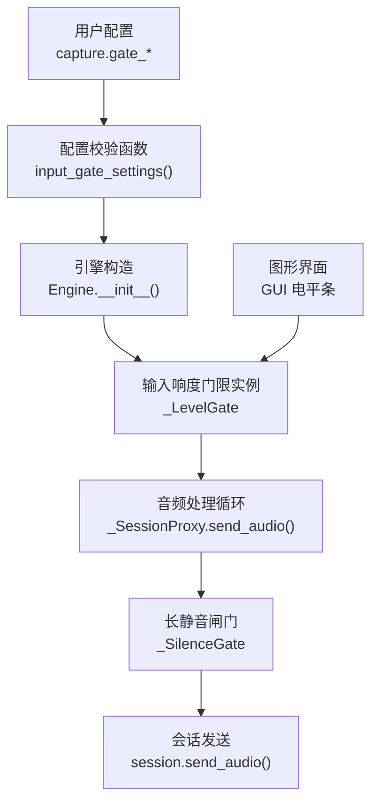
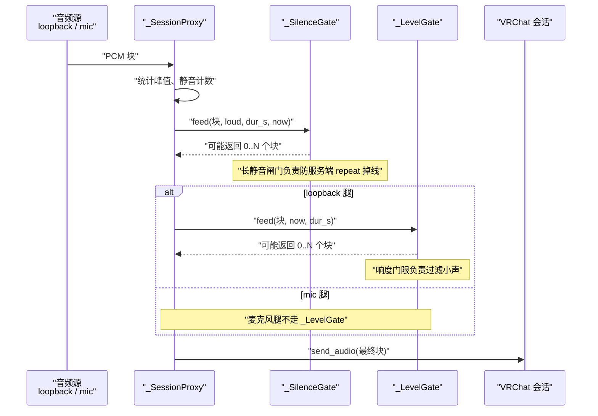
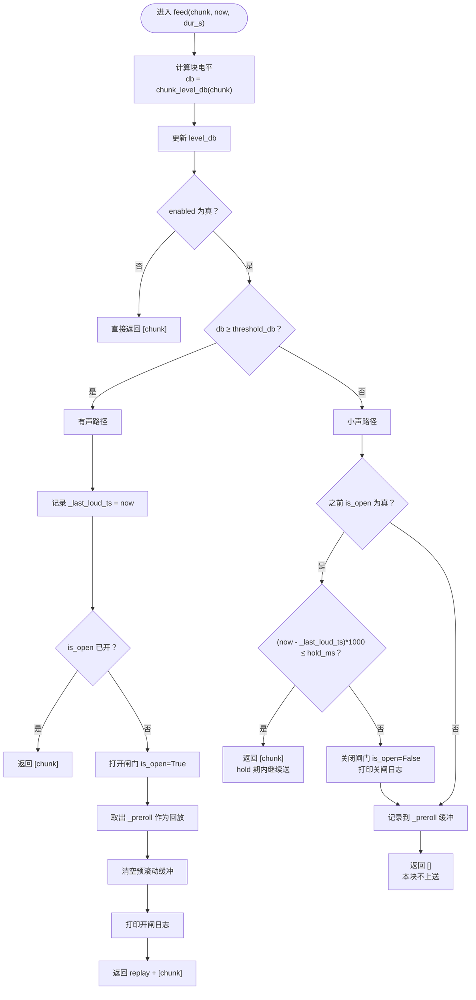
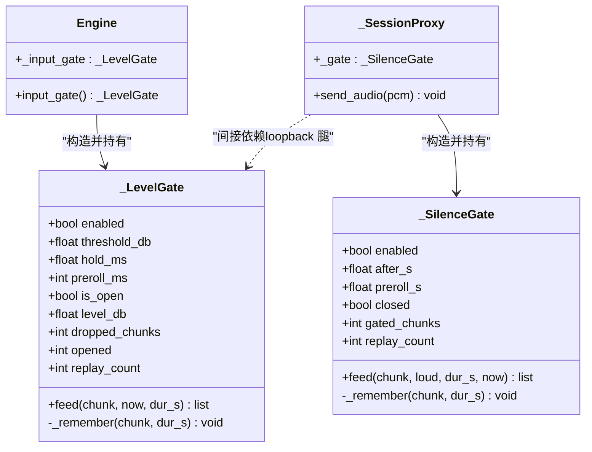

# 输入响度门限

<cite>
**本文引用的文件**   
- [engine.py](file://vlt/engine.py)
- [config.example.yaml](file://config.example.yaml)
- [GUIDE.md](file://docs/GUIDE.md)
- [gui.py](file://vlt/gui.py)
- [test_silence_gate.py](file://tests/test_silence_gate.py)
</cite>

## 目录
1. [引言](#引言)
2. [项目结构定位](#项目结构定位)
3. [核心组件总览](#核心组件总览)
4. [架构与数据流](#架构与数据流)
5. [_LevelGate 详细分析](#_levelgate-详细分析)
6. [_SilenceGate 与 _LevelGate 的区别与协作](#_silencegate-与-_levelgate-的区别与协作)
7. [配置参数说明](#配置参数说明)
8. [性能优化策略](#性能优化策略)
9. [调优建议：近处说话 vs 远处玩家](#调优建议近处说话-vs-远处玩家)
10. [故障排查](#故障排查)
11. [结论](#结论)

## 引言
本文聚焦 VRChat 实时同传中的“输入响度门限”，也就是代码里的 `_LevelGate`。它的作用是在“别人说话”这条音频腿上，按每块 RMS 响度判断是否上送模型：低于门限的块不上送，从而避免把远处小声、听不清的玩家声音白白送给模型翻译。

同时，文档会解释它与长静音闸门 `_SilenceGate` 的关系：两者职责不同、串联工作——前者过滤“小声”，后者防止“长时间真静音导致服务端掉线”。

## 项目结构定位
输入响度门限的核心实现位于引擎模块中，并配合配置文件和图形界面完成参数设置与电平可视化。

**图表来源**
- [engine.py:143-167](file://vlt/engine.py#L143-L167)
- [engine.py:453-527](file://vlt/engine.py#L453-L527)
- [engine.py:375-403](file://vlt/engine.py#L375-L403)
- [gui.py:284-294](file://vlt/gui.py#L284-L294)

**章节来源**
- [engine.py:58-69](file://vlt/engine.py#L58-L69)
- [engine.py:143-167](file://vlt/engine.py#L143-L167)
- [engine.py:453-527](file://vlt/engine.py#L453-L527)
- [gui.py:284-294](file://vlt/gui.py#L284-L294)

## 核心组件总览
本节从系统角度列出与输入响度门限直接相关的组件。

| 组件 | 位置 | 主要职责 |
|---|---|---|
| `chunk_level_db()` | `vlt/engine.py` | 计算一个 100ms PCM 块的 RMS 电平（dBFS） |
| `input_gate_settings()` | `vlt/engine.py` | 读取并校验 `gate_enabled`、`gate_db`、`gate_hold_ms`、`gate_preroll_ms` |
| `_LevelGate` | `vlt/engine.py` | 输入响度门限：音量阈值检测、hold 保持期、preroll 预滚动、开闸状态管理 |
| `_SilenceGate` | `vlt/engine.py` | 长静音闸门：连续静音超过阈值后暂停上送，恢复时补发 preroll |
| `_SessionProxy.send_audio()` | `vlt/engine.py` | 音频上送前的统一入口，先走 `_SilenceGate`，再发给会话 |
| GUI 电平显示 | `vlt/gui.py` | 展示当前电平、门限线和“是否会被翻译”的填充区域 |
| 配置模板 | `config.example.yaml` | 提供 `capture.gate_*` 默认值和使用说明 |

**章节来源**
- [engine.py:124-167](file://vlt/engine.py#L124-L167)
- [engine.py:204-346](file://vlt/engine.py#L204-L346)
- [engine.py:375-403](file://vlt/engine.py#L375-L403)
- [gui.py:284-294](file://vlt/gui.py#L284-L294)
- [config.example.yaml:77-95](file://config.example.yaml#L77-L95)

## 架构与数据流
输入响度门限不是孤立模块，而是嵌入在“采集 → 闸门 → 会话发送”这条链里。

**图表来源**
- [engine.py:375-403](file://vlt/engine.py#L375-L403)
- [engine.py:453-527](file://vlt/engine.py#L453-L527)

**章节来源**
- [engine.py:375-403](file://vlt/engine.py#L375-L403)
- [engine.py:453-527](file://vlt/engine.py#L453-L527)

## _LevelGate 详细分析

### 设计目标
`_LevelGate` 解决的是“VRChat 输出是所有人混好的一路音频，远处玩家声音小、本来就听不清，却照样被送给模型”的问题。它的核心思路是：

1. 把音频切成固定大小的块；
2. 对每个块计算 RMS 电平；
3. 如果低于门限，就不上送；
4. 如果高于或等于门限，就打开闸门；
5. 用 hold 防止句中停顿被切碎；
6. 用 preroll 防止句首辅音丢失。

### 关键数据结构
`_LevelGate` 的状态可以理解为“当前是否在上送 + 最近一次有声时间 + 预滚动缓冲 + 统计计数器”。

| 字段 | 含义 | 复杂度影响 |
|---|---|---|
| `enabled` | 是否启用输入门限 | O(1) 分支判断 |
| `threshold_db` | 响度阈值（dBFS） | 每次比较 O(1) |
| `hold_ms` | 越阈值后继续上送的保持时长 | 时间差比较 O(1) |
| `preroll_ms` | 开闸时补发的之前音频时长 | 控制缓冲长度 |
| `is_open` | 当前是否在上送 | 状态机核心标志 |
| `_last_loud_ts` | 最近一次“越阈值”的时间戳 | hold 判断依据 |
| `_preroll` | 预滚动缓冲区，保存 `(块, 时长)` | 最多保留约 `preroll_ms` 对应的块数 |
| `_preroll_ms` | 当前缓冲累计毫秒数 | 维护 O(1) 追加、O(k) 弹出旧块 |
| `level_db` | 最近一块的电平（供界面显示） | 每块更新一次 |
| `dropped_chunks` | 累计拦截的块数 | 诊断用途 |
| `opened` | 开闸次数 | 诊断用途 |
| `replay_count` | 补发 preroll 的次数 | 诊断用途 |

**章节来源**
- [engine.py:269-300](file://vlt/engine.py#L269-L300)

### 核心方法：`feed()`
`feed()` 是响度检测和处理的主流程。它接收一个 PCM 块，返回本次真正要上送的块序列。

**图表来源**
- [engine.py:302-346](file://vlt/engine.py#L302-L346)

**章节来源**
- [engine.py:302-346](file://vlt/engine.py#L302-L346)

### 预滚动缓冲：`_remember()`
预滚动缓冲用于在开闸时补发“越阈值之前的一小段音频”，目的是不丢句首辅音。

关键点：
- 只保存小于等于 `preroll_ms` 的块；
- 使用双端队列，新块从右进，旧块从左出；
- 用累计毫秒数控制缓冲长度；
- 加入微小容差，避免浮点累加误差导致多切一块。

**章节来源**
- [engine.py:338-346](file://vlt/engine.py#L338-L346)

### 电平计算：`chunk_level_db()`
RMS 电平计算是响度门限的基础。它把一个 16kHz 单声道 s16le PCM 块转成浮点数，计算均方根，再换算成 dBFS。

重要性质：
- 空块返回下限电平；
- 零 RMS 也返回下限电平，避免 log10(0)；
- 使用 RMS 而不是峰值，因为峰值容易被按键、咳嗽、音效的尖刺骗开；
- 正常近处说话大致落在 `-30 ~ -20 dBFS`，远处小声常在 `-50 dBFS` 以下。

**章节来源**
- [engine.py:124-140](file://vlt/engine.py#L124-L140)

## _SilenceGate 与 _LevelGate 的区别与协作

### 区别
| 维度 | `_LevelGate` | `_SilenceGate` |
|---|---|---|
| 主要问题 | 过滤“小声” | 防止“长时间真静音导致服务端 repeat 掉线” |
| 触发条件 | 块 RMS 低于门限 | 连续静音超过 `after_s` |
| 判断依据 | 每块 RMS 电平 | 是否检测到“有声音” |
| 作用范围 | 只接 loopback 采集（别人说话） | 所有上送音频 |
| 典型参数 | `gate_db`、`gate_hold_ms`、`gate_preroll_ms` | `silence_gate_after_s`、`silence_gate_preroll_s` |
| 状态标志 | `is_open` | `closed` |
| 日志前缀 | `[gate]` | `[engine]` |

### 协作关系
两者的协作方式是“串联”：

1. 音频先经过 `_SilenceGate`；
2. 如果 `_SilenceGate` 允许通过，再交给 `_LevelGate`；
3. `_LevelGate` 拦掉的块不会进入 `_SilenceGate`，因此不会干扰长静音计时；
4. 两者都只做“暂停上送”，不改写、不伪造音频，与服务端 turn_detection 的节奏假设一致。

**图表来源**
- [engine.py:204-346](file://vlt/engine.py#L204-L346)
- [engine.py:363-373](file://vlt/engine.py#L363-L373)
- [engine.py:453-527](file://vlt/engine.py#L453-L527)

**章节来源**
- [engine.py:204-266](file://vlt/engine.py#L204-L266)
- [engine.py:269-346](file://vlt/engine.py#L269-L346)
- [engine.py:363-373](file://vlt/engine.py#L363-L373)
- [engine.py:453-527](file://vlt/engine.py#L453-L527)

## 配置参数说明

### 配置来源
输入响度门限的配置位于 `capture` 段，键名为 `gate_enabled`、`gate_db`、`gate_hold_ms`、`gate_preroll_ms`。

**章节来源**
- [config.example.yaml:77-95](file://config.example.yaml#L77-L95)

### 参数定义表

| 参数 | 类型 | 默认值 | 取值范围 | 含义 |
|---|---|---:|---:|---|
| `gate_enabled` | 布尔 | `true` | `true` / `false` | 是否启用输入响度门限 |
| `gate_db` | 浮点数 | `-45.0` | `-70.0 ~ -10.0` dBFS | 响度阈值；越高越严格，越低越宽松 |
| `gate_hold_ms` | 非负数 | `500` | `≥ 0` ms | 越阈值后回落期间仍继续上送的保持时长 |
| `gate_preroll_ms` | 非负整数 | `250` | `≥ 0` ms | 开闸时补发的越阈值之前的音频时长 |

**章节来源**
- [engine.py:63-69](file://vlt/engine.py#L63-L69)
- [engine.py:143-167](file://vlt/engine.py#L143-L167)
- [config.example.yaml:81-95](file://config.example.yaml#L81-L95)
- [GUIDE.md:294-300](file://docs/GUIDE.md#L294-L300)

### 配置校验行为
`input_gate_settings()` 会对非法值进行留痕并回落默认值：

- `gate_db` 必须是数值且在 `-70.0 ~ -10.0` 之间；
- `gate_hold_ms` 必须是非负数；
- `gate_preroll_ms` 必须是非负整数；
- 类型错误、越界、负数都会打印警告并回退到默认值；
- 缺省字段视为合法，使用默认值。

**章节来源**
- [engine.py:143-167](file://vlt/engine.py#L143-L167)

## 性能优化策略

### 电平计算优化
`chunk_level_db()` 的设计目标是“快、稳定、可离线测试”：

1. 使用 NumPy 将 PCM 字节缓冲转为整型数组；
2. 归一化为浮点数；
3. 计算平方均值后再开方得到 RMS；
4. 转换为 dBFS；
5. 对空块、零 RMS 做保护，返回下限电平。

这种实现避免了逐采样 Python 循环，适合实时音频流。

**章节来源**
- [engine.py:124-140](file://vlt/engine.py#L124-L140)

### 缓冲区管理
`_LevelGate` 的预滚动缓冲使用双端队列，只保留最近一段音频：

- 新块追加到队尾；
- 当累计时长超过 `preroll_ms` 时，从队头丢弃旧块；
- 使用毫秒级累计值减少重复计算；
- 加入微小容差避免浮点累加误差；
- 开闸时一次性取出回放列表并清空缓冲。

这保证了：
- 内存占用与 `preroll_ms` 成正比；
- 开闸回放是 O(k)，k 为缓冲块数；
- 日常 feed 是 O(1)。

**章节来源**
- [engine.py:338-346](file://vlt/engine.py#L338-L346)

### 界面电平显示优化
GUI 的电平显示做了节流和峰值保持：

- 每 50~100ms 刷新一次，避免 Tk 重绘太频繁；
- 使用 `_gate_level_hold` 做峰值保持，每帧衰减 1.5dB，让读数更稳定；
- 只在设置窗可见、勾选启用、且没有引擎运行时才启动独立电平探针；
- 正在翻译时直接使用引擎那条腿的电平，不重复占用设备。

**章节来源**
- [gui.py:284-294](file://vlt/gui.py#L284-L294)
- [gui.py:4495-4537](file://vlt/gui.py#L4495-L4537)

## 调优建议：近处说话 vs 远处玩家

### 基本参考
根据仓库注释和用户指南：

- 近处正常说话大致落在 `-30 ~ -20 dBFS`；
- 远处小声常在 `-50 dBFS` 以下；
- 默认 `gate_db = -45.0` 是一个折中值；
- 默认 `gate_hold_ms = 500` 能覆盖常见句中停顿；
- 默认 `gate_preroll_ms = 250` 能覆盖句首低能量部分。

**章节来源**
- [engine.py:58-69](file://vlt/engine.py#L58-L69)
- [config.example.yaml:81-95](file://config.example.yaml#L81-L95)
- [GUIDE.md:354-373](file://docs/GUIDE.md#L354-L373)

### 场景化建议

| 场景 | 推荐方向 | 原因 |
|---|---|---|
| 近处说话为主，环境较安静 | 保持默认或略提高门限 | 避免误把背景噪声翻进去 |
| 远处玩家经常漏翻 | 降低 `gate_db`，例如接近 `-50` 或更低 | 让远处小声也能过门限 |
| 背景噪音大、BGM 吵 | 提高 `gate_db`，例如 `-35 ~ -40` | 过滤持续背景响度 |
| 句子经常被切碎 | 增大 `gate_hold_ms`，例如 600~800ms | 给句中停顿更多空间 |
| 句首经常掉字 | 增大 `gate_preroll_ms`，例如 300~400ms | 补发更多句首起音 |
| 按键声、爆音频繁误开 | 提高 `gate_db` | 虽然 RMS 抗峰值，但高频爆音仍可能抬高块响度 |

### 调参步骤
1. 打开“设置 → 输入门限”；
2. 让远处玩家说话，观察电平条；
3. 把门限线拖到“门外”，使远处声音不填充；
4. 让近处玩家说话，确认填充能过线；
5. 如果句子中间断掉，调大 `gate_hold_ms`；
6. 如果句首掉字，调大 `gate_preroll_ms`；
7. 改完立刻生效，落盘延迟约 300ms。

**章节来源**
- [GUIDE.md:354-373](file://docs/GUIDE.md#L354-L373)
- [gui.py:1695-1708](file://vlt/gui.py#L1695-L1708)

## 故障排查

### 常见问题
| 现象 | 可能原因 | 处理方式 |
|---|---|---|
| 远处玩家完全不被翻译 | `gate_db` 太高 | 降低门限 |
| 近处耳语也被过滤 | 门限高于耳语音量 | 降低 `gate_db` |
| 句子中间被切碎 | `gate_hold_ms` 太小 | 增大保持时长 |
| 句首掉字 | `gate_preroll_ms` 太小 | 增大预滚动时长 |
| 背景噪音被翻译 | 环境响度长期高于门限 | 提高 `gate_db` 或改善录音环境 |
| 开关门限日志刷屏 | 阈值正好卡在噪声边缘 | 微调 `gate_db`，避开临界值 |
| 界面电平无读数 | 未启用门限或未打开设置窗 | 勾选启用并打开设置窗 |

### 日志线索
- 输入门限开闸日志以 `[gate]` 开头；
- 输入门限关闸日志会显示当前电平和累计拦截块数；
- 长静音闸门日志以 `[engine]` 开头；
- 配置非法会打印 `[config] ⚠️` 并回落默认值。

**章节来源**
- [engine.py:317-333](file://vlt/engine.py#L317-L333)
- [engine.py:143-167](file://vlt/engine.py#L143-L167)
- [test_silence_gate.py:137-150](file://tests/test_silence_gate.py#L137-L150)

## 结论
输入响度门限 `_LevelGate` 是 VRChat 实时同传中针对“别人说话”这条腿的重要前置过滤器。它通过 RMS 电平检测、阈值判断、hold 保持期和 preroll 预滚动机制，在保证句子完整性的前提下，过滤掉远处小声、听不清的音频块，从而减少无效翻译、节省资源并降低乱翻风险。

它与 `_SilenceGate` 分工明确：前者管“小声”，后者管“长时间真静音”。两者串联工作，互不抵消，共同提升实时同传的稳定性与可用性。

实际调优时，应结合具体场景调整 `gate_db`、`gate_hold_ms`、`gate_preroll_ms`，并以 GUI 中的实时电平条作为主要反馈工具。对于嘈杂环境，优先提高门限；对于远处玩家漏翻，优先降低门限；对于句子完整性，优先调整 hold 和 preroll。