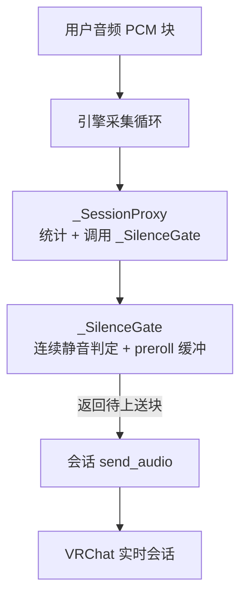
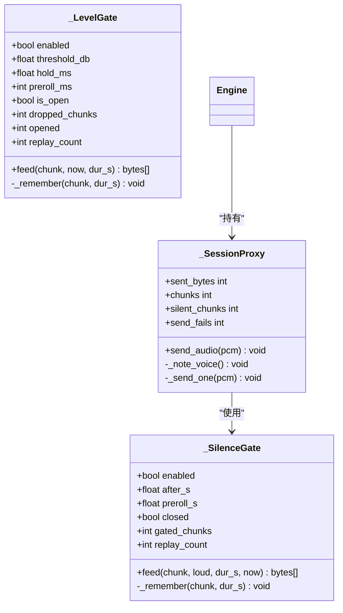
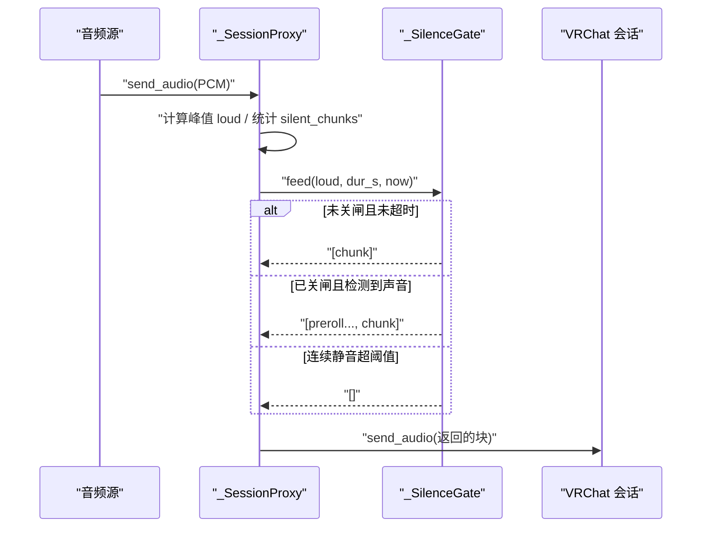
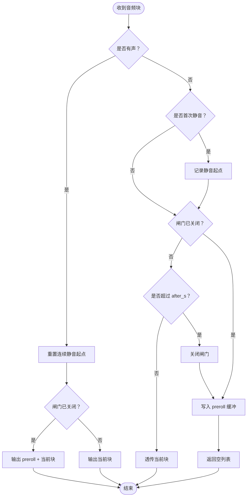

# 静音检测闸门

<cite>
**本文引用的文件**   
- [engine.py](file://vlt/engine.py)
- [config.example.yaml](file://config.example.yaml)
- [test_silence_gate.py](file://tests/test_silence_gate.py)
</cite>

## 目录
1. [引言](#引言)
2. [项目结构定位](#项目结构定位)
3. [核心组件总览](#核心组件总览)
4. [架构与数据流](#架构与数据流)
5. [_SilenceGate 详细分析](#_silencegate-详细分析)
6. [配置参数说明](#配置参数说明)
7. [与输入响度门限的区别与协作](#与输入响度门限的区别与协作)
8. [完整处理流程示例](#完整处理流程示例)
9. [性能与内存优化](#性能与内存优化)
10. [调优建议](#调优建议)
11. [故障排查指南](#故障排查指南)
12. [结论](#结论)

## 引言

本文件面向 VRChat 实时同传中的“长静音闸门”，也就是 `_SilenceGate`。它解决的核心问题是：在长时间连续静音时，如果仍然把静音音频块不断上送给服务端，模型可能进入重复输出状态，最终触发服务端错误并断开连接。

静音闸门的工作方式很克制：它不改写音频、不伪造语音事件，只在连续静音超过阈值后暂停上送；当声音恢复时，先补发闸住期间保留的最近一段 preroll 音频，再发送当前有声块，从而保证句首低能量部分不被丢弃。

该机制与“输入响度门限”是两条独立但可协作的路径：前者针对“长时间真静音”，后者针对“小声或远处玩家的声音”。

## 项目结构定位

静音闸门实现位于引擎模块中，并由测试用例覆盖其纯逻辑和代理集成行为。配置文件模板则提供默认开关、阈值和 preroll 时长。

**图示来源**
- [engine.py:356-443](file://vlt/engine.py#L356-L443)
- [engine.py:204-266](file://vlt/engine.py#L204-L266)

**章节来源**
- [engine.py:1-800](file://vlt/engine.py#L1-L800)
- [config.example.yaml:55-63](file://config.example.yaml#L55-L63)

## 核心组件总览

| 组件 | 职责 | 关键状态 | 主要方法 |
|---|---|---|---|
| `_SilenceGate` | 长静音闸门：连续静音超阈值后暂停上送，声音恢复时补发 preroll | `enabled`、`after_s`、`preroll_s`、`closed`、`_silent_since`、`_preroll`、`gated_chunks`、`replay_count` | `feed(chunk, loud, dur_s, now)` |
| `silence_gate_settings` | 读取并校验静音闸门配置，非法值留痕并回落默认值 | 无实例状态 | 返回 `(enabled, after_s, preroll_s)` |
| `_LevelGate` | 输入响度门限：按 RMS 判断音量是否达到门限 | `is_open`、`threshold_db`、`hold_ms`、`preroll_ms`、`_preroll` | `feed(chunk, now, dur_s)` |
| `_SessionProxy` | 把采集到的 PCM 块交给静音闸门，再转发到当前会话 | 统计计数、内部 `_gate` | `send_audio(pcm)` |

**章节来源**
- [engine.py:107-121](file://vlt/engine.py#L107-L121)
- [engine.py:204-266](file://vlt/engine.py#L204-L266)
- [engine.py:269-346](file://vlt/engine.py#L269-L346)
- [engine.py:356-443](file://vlt/engine.py#L356-L443)

## 架构与数据流

### 整体关系图

**图示来源**
- [engine.py:204-266](file://vlt/engine.py#L204-L266)
- [engine.py:269-346](file://vlt/engine.py#L269-L346)
- [engine.py:356-443](file://vlt/engine.py#L356-L443)

### 音频上送主流程

**图示来源**
- [engine.py:375-403](file://vlt/engine.py#L375-L403)
- [engine.py:227-256](file://vlt/engine.py#L227-L256)

## _SilenceGate 详细分析

### 设计目标

`_SilenceGate` 的目标不是做语音活动检测，也不是替代服务端的回合检测。它的目标是防止“模型被静音喂久了进入 repeat 状态”，从而避免服务端报错并断开连接。

它只做三件事：

1. 对每个音频块判断是否为静音。
2. 累计连续静音时间，超过 `after_s` 后关闭闸门。
3. 声音恢复时，先补发 preroll 缓冲中的最后若干块，再发送当前块。

### 状态字段

| 字段 | 含义 | 初始值 | 变化时机 |
|---|---|---:|---|
| `enabled` | 是否启用静音闸门 | 由配置决定 | 构造时确定 |
| `after_s` | 连续静音阈值（秒） | 默认 30.0 | 构造时确定 |
| `preroll_s` | 开闸时补发的 preroll 时长（秒） | 默认 1.0 | 构造时确定 |
| `closed` | 闸门是否已关闭 | `False` | 连续静音超阈值后设为 `True` |
| `_silent_since` | 连续静音起点时间 | `None` | 首次遇到静音块时记录；遇到有声块时重置为 `None` |
| `_preroll` | 闸住期间缓存的 `(chunk, dur_s)` 队列 | 空双端队列 | 每次静音块进入 `_remember` |
| `_preroll_dur` | 当前 preroll 缓冲总时长 | `0.0` | 入队加、出队减 |
| `gated_chunks` | 本次闸住拦截的块数 | `0` | 关闸时清零，每拦一块加一 |
| `replay_count` | 累计补发 preroll 的次数 | `0` | 每次从关闸恢复到开闸时加一 |

### feed 方法逻辑

`feed` 是静音闸门的核心入口。它接收一个 PCM 块、是否有声标志、块时长和当前时间，返回本次真正要上送的块列表。

#### 有声块分支

当 `loud=True` 时：

1. 重置 `_silent_since`，表示不再处于连续静音。
2. 如果闸门已经关闭：
   - 取出 preroll 缓冲中的所有块。
   - 清空缓冲。
   - 打开闸门。
   - 增加 `replay_count`。
   - 打印开闸日志。
   - 返回 `preroll + [当前块]`。
3. 如果闸门未关闭：直接返回 `[当前块]`。

#### 静音块分支

当 `loud=False` 时：

1. 如果是第一次进入静音阶段，记录 `_silent_since = now`。
2. 如果闸门尚未关闭：
   - 如果禁用或未超过阈值，直接透传该块。
   - 否则关闭闸门，清零 `gated_chunks`，打印关闸日志。
3. 增加 `gated_chunks`。
4. 调用 `_remember` 把静音块加入 preroll 缓冲。
5. 返回空列表，表示不上送。

### preroll 缓冲管理

`_remember` 负责维护 preroll 缓冲的时间预算：

- 如果 `preroll_s <= 0`，直接返回，不做缓存。
- 将 `(chunk, dur_s)` 追加到 `_preroll`。
- 累加 `_preroll_dur`。
- 如果总时长超过 `preroll_s + 1e-6`，从队头弹出旧块，直到满足预算。

这里使用 `+1e-6` 容差，是为了避免浮点累加误差导致多丢一块。例如多个 0.1 秒相加可能出现微小精度偏差，没有容差时会误判为超出预算。

### 复杂度分析

| 操作 | 时间复杂度 | 空间复杂度 | 说明 |
|---|---:|---:|---|
| `feed` | O(1) | O(1) | 主要工作是状态判断和可能的日志输出 |
| 开闸回补 | O(k) | O(k) | k 是 preroll 缓冲中的块数 |
| `_remember` | O(1) 均摊 | O(n) | n 是 preroll 缓冲长度，受 `preroll_s` 限制 |
| 缓冲清理 | O(m) | O(1) | m 是被弹出的旧块数量，通常很小 |

preroll 缓冲的最大长度由 `preroll_s` 和块时长共同决定。对于 100ms 块，1 秒 preroll 最多约 10 个块，内存占用非常有限。

**章节来源**
- [engine.py:204-266](file://vlt/engine.py#L204-L266)

## 配置参数说明

静音闸门相关配置位于 `session` 段，由 `silence_gate_settings` 解析。

| 配置键 | 类型 | 默认值 | 取值范围 | 作用 |
|---|---|---:|---|---|
| `silence_gate_enabled` | 布尔 | `true` | `true` / `false` | 是否启用长静音闸门 |
| `silence_gate_after_s` | 正浮点数 | `30.0` | `> 0` | 连续静音超过该秒数后关闭闸门 |
| `silence_gate_preroll_s` | 正浮点数 | `1.0` | `> 0` | 开闸时补发的 preroll 时长 |

### 参数校验规则

1. `silence_gate_enabled` 必须是布尔值；非布尔值会留痕并回落默认值。
2. `silence_gate_after_s` 必须是正数；负数、零或非数字会留痕并回落默认值。
3. `silence_gate_preroll_s` 必须是正数；非法值同样留痕并回落默认值。
4. 如果 `preroll_s > after_s`，说明 preroll 比闸门阈值还长，这没有实际意义：闸门还没关，缓冲就可能先满了。此时会把 preroll 回落到 `min(1.0, after_s)`，并打印警告。

### 配置示例位置

配置模板中明确说明：

- 连续静音超过 `silence_gate_after_s` 就暂停上送音频。
- 闸住期间只保留最后 `silence_gate_preroll_s` 秒。
- 声音恢复时先补发这段 preroll，句首不丢。

**章节来源**
- [engine.py:107-121](file://vlt/engine.py#L107-L121)
- [config.example.yaml:55-63](file://config.example.yaml#L55-L63)

## 与输入响度门限的区别与协作

### 区别

| 维度 | `_SilenceGate` 长静音闸门 | `_LevelGate` 输入响度门限 |
|---|---|---|
| 主要问题 | 长时间真静音导致服务端 repeat 掉线 | 远处玩家小声、环境噪声被翻译成乱话 |
| 判断依据 | 是否连续静音超过 `after_s` | 每块 RMS 是否低于 `threshold_db` |
| 典型场景 | 说话停顿、思考、等待 | 别人离麦克风远、背景噪音 |
| 是否影响统计 | 闸住的块不计入 `sent_bytes`，但有 `gated_chunks` | 有 `dropped_chunks` 统计 |
| 是否改音频 | 不改写、不伪造 | 不改写、不伪造 |
| 默认阈值 | `after_s=30s` | `gate_db=-45dBFS` |
| 默认 preroll | `preroll_s=1.0s` | `preroll_ms=250ms` |

### 协作关系

两者串联工作，但不是互相竞争：

1. 输入响度门限先过滤低于门限的小声块。
2. 通过响度门限的块才会进入 `_SilenceGate`。
3. `_SilenceGate` 再根据连续静音时长决定是否暂停上送。
4. 因此，`_LevelGate` 拦掉的块不会进入 `_SilenceGate`，也不会被算进它的静音计时。

这种设计避免了“两个闸门互相抵消”的问题：小声被响度门限拦住，不会让长静音闸门提前结束；长静音闸门也不关心块有多响，只关心是否连续静音。

**章节来源**
- [engine.py:269-346](file://vlt/engine.py#L269-L346)
- [engine.py:375-403](file://vlt/engine.py#L375-L403)

## 完整处理流程示例

以下示例基于测试用例的行为，描述一次完整的静音检测流程。

### 场景设定

- 块时长：0.1 秒。
- 闸门开启。
- `after_s = 1.0` 秒。
- `preroll_s = 0.25` 秒。

### 步骤

1. **前 1.0 秒静音**  
   连续 10 个静音块全部透传，闸门保持打开。

2. **第 1.0 秒**  
   连续静音达到阈值，闸门关闭。该静音块开始被拦截。

3. **闸住期间**  
   后续静音块全部拦截，不入网；同时写入 preroll 缓冲，但只保留最后约 0.25 秒的数据。

4. **声音恢复**  
   收到第一个有声块。闸门打开，先补发 preroll 中的最近两块，再发送当前有声块。

5. **恢复后**  
   后续块立即上送，不再等待。

**图示来源**
- [engine.py:227-256](file://vlt/engine.py#L227-L256)

**章节来源**
- [test_silence_gate.py:66-92](file://tests/test_silence_gate.py#L66-L92)
- [test_silence_gate.py:124-134](file://tests/test_silence_gate.py#L124-L134)

## 性能与内存优化

### 内存控制

- preroll 使用 `deque`，支持高效地从两端添加和删除。
- 每次新增块后检查总时长，超出预算就从队头弹出旧块。
- 使用 `+1e-6` 容差避免浮点误差导致误删。
- 开闸后清空 preroll 缓冲，释放内存。

### 时间开销

- 正常透传路径只有常数时间操作。
- 开闸回补需要遍历 preroll 缓冲，但缓冲长度受 `preroll_s` 限制，通常很小。
- 日志输出仅在状态切换时发生，不会每块都打。

### 统计隔离

- 静音闸门拦截的块不计入 `_SessionProxy.sent_bytes`，因为根本没发出去。
- 静音闸门有自己的 `gated_chunks` 和 `replay_count`。
- 黑匣子统计的 `_silent_chunks` 仍按原始 loud 标志更新，不受闸门是否上送影响。

**章节来源**
- [engine.py:258-266](file://vlt/engine.py#L258-L266)
- [engine.py:375-403](file://vlt/engine.py#L375-L403)

## 调优建议

### 何时调整 `silence_gate_after_s`

- 如果服务端频繁报 `model repeat output happened` 并断线，可适当调小该值。
- 如果正常说话中的长停顿（想词、等人）被误关闸，应适当调大该值。
- 默认 30 秒适合大多数场景，因为真人说话很少连续静默这么久。

### 何时调整 `silence_gate_preroll_s`

- 如果开闸后句首辅音丢失，可适当增大 preroll。
- 如果开闸后补发了过多旧静音，可适当减小 preroll。
- 注意：preroll 不能大于 `after_s`，否则会被强制回落。

### 推荐组合

| 场景 | `silence_gate_after_s` | `silence_gate_preroll_s` | 说明 |
|---|---:|---:|---|
| 默认稳定运行 | 30.0 | 1.0 | 防服务端 repeat 掉线 |
| 服务端较敏感 | 10.0 ~ 20.0 | 0.5 ~ 1.0 | 更早保护模型 |
| 说话节奏慢、常停顿 | 30.0 ~ 60.0 | 1.0 ~ 2.0 | 减少误关闸 |
| 句首识别敏感 | 30.0 | 1.0 ~ 2.0 | 增大 preroll 保句首 |

### 与输入响度门限的配合

- 如果环境中远处玩家声音太小，优先调 `_LevelGate` 的 `gate_db`，而不是盲目缩小 `silence_gate_after_s`。
- 如果环境噪声长期偏高，可能导致“上游安静”条件不成立，快封句逻辑会退化为保守路径。

**章节来源**
- [config.example.yaml:55-63](file://config.example.yaml#L55-L63)
- [config.example.yaml:81-95](file://config.example.yaml#L81-L95)

## 故障排查指南

### 症状：服务端 repeat output 掉线

**可能原因：**

- 静音块占比过高，模型被静音喂久。
- `silence_gate_enabled` 被设为 `false`。
- `silence_gate_after_s` 设置过大。
- 网络抖动导致大量静音块堆积。

**排查步骤：**

1. 检查 `session.silence_gate_enabled` 是否为 `true`。
2. 查看日志中是否出现“静音闸门关闭”。
3. 确认 `silence_gate_after_s` 是否合理。
4. 观察开闸日志中补发的 preroll 块数和时长。
5. 检查 `_SessionProxy.send_fails` 是否异常升高。

**章节来源**
- [engine.py:204-214](file://vlt/engine.py#L204-L214)
- [engine.py:375-443](file://vlt/engine.py#L375-L443)

### 症状：句首丢字

**可能原因：**

- `silence_gate_preroll_s` 过小。
- 声音刚恢复时，低能量部分还没达到响度门限。
- 输入响度门限的 `gate_preroll_ms` 过小。

**排查步骤：**

1. 增大 `silence_gate_preroll_s`。
2. 检查开闸日志中 preroll 块数是否偏少。
3. 同时检查 `_LevelGate` 的 `gate_preroll_ms`。
4. 确认声音恢复后的第一块确实被上送。

**章节来源**
- [engine.py:227-241](file://vlt/engine.py#L227-L241)
- [engine.py:302-322](file://vlt/engine.py#L302-L322)

### 症状：正常说话中途被关闸

**可能原因：**

- `silence_gate_after_s` 太小。
- 说话人习惯较长停顿。
- 环境中有周期性静音片段。

**排查步骤：**

1. 增大 `silence_gate_after_s`。
2. 观察是否在有声块之后才重新打开闸门。
3. 确认有声块能重置 `_silent_since`。

**章节来源**
- [engine.py:227-256](file://vlt/engine.py#L227-L256)
- [test_silence_gate.py:95-110](file://tests/test_silence_gate.py#L95-L110)

### 症状：配置修改无效

**可能原因：**

- 配置键拼写错误。
- 类型不正确，例如把布尔写成字符串。
- `preroll_s > after_s`，被强制回落。

**排查步骤：**

1. 检查控制台是否输出 `[config] ⚠️ ...` 警告。
2. 确认 `silence_gate_enabled` 是布尔值。
3. 确认 `silence_gate_after_s` 和 `silence_gate_preroll_s` 都是正数。
4. 确保 `preroll_s` 不大于 `after_s`。

**章节来源**
- [engine.py:107-121](file://vlt/engine.py#L107-L121)
- [test_silence_gate.py:155-182](file://tests/test_silence_gate.py#L155-L182)

### 症状：服务端 1011 掉线后采集线程退出

**根本原因：**

采集循环是长跑任务，如果 `send_audio` 抛出连接异常，异常一路冒到外层，会导致该腿“运行错误”结束，看门狗来不及重连。

**解决方案：**

代码已在 `_send_one` 中捕获发送异常，只留痕并丢弃该块，然后继续运行。依赖会话接收循环的健康检查和看门狗在 0.3 秒内发起重连。

**章节来源**
- [engine.py:421-443](file://vlt/engine.py#L421-L443)

## 结论

`_SilenceGate` 是一个轻量、克制且针对性很强的静音检测闸门。它不替代语音活动检测，也不改写音频，而是通过“连续静音阈值 + preroll 缓冲 + 状态转换”的组合，防止服务端因长时间静音而进入 repeat 状态。

在实际使用中，建议：

- 保持默认 `silence_gate_after_s=30s`，除非服务端明显更敏感。
- 根据句首识别效果调整 `silence_gate_preroll_s`。
- 与 `_LevelGate` 配合：小声用响度门限，长静音用静音闸门。
- 关注日志中的“静音闸门关闭”和“静音闸门打开”，这是判断闸门是否生效的关键线索。
- 若出现服务端掉线，优先检查静音闸门是否启用、阈值是否合理，以及发送失败次数是否异常升高。