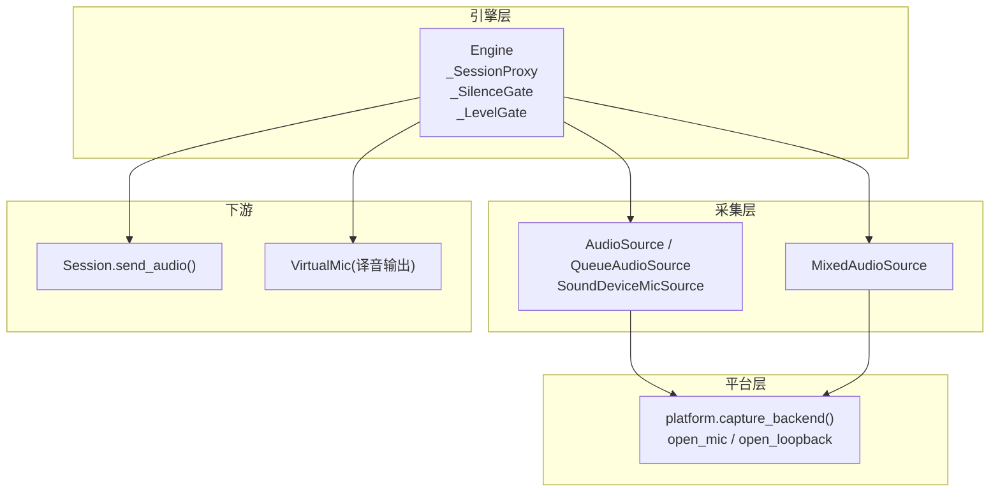
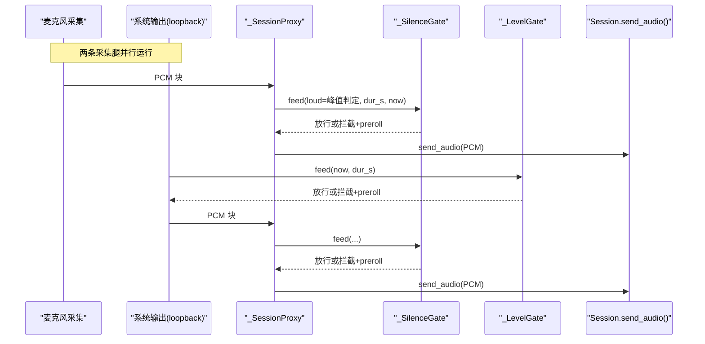
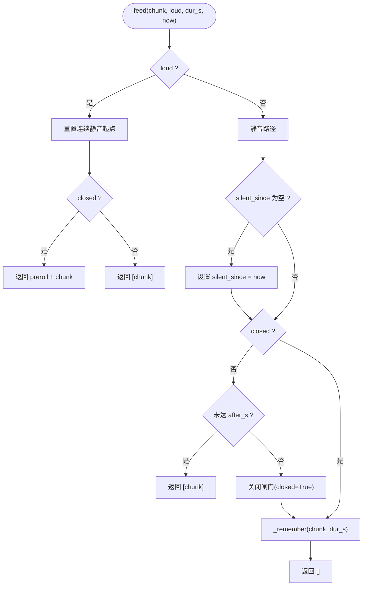
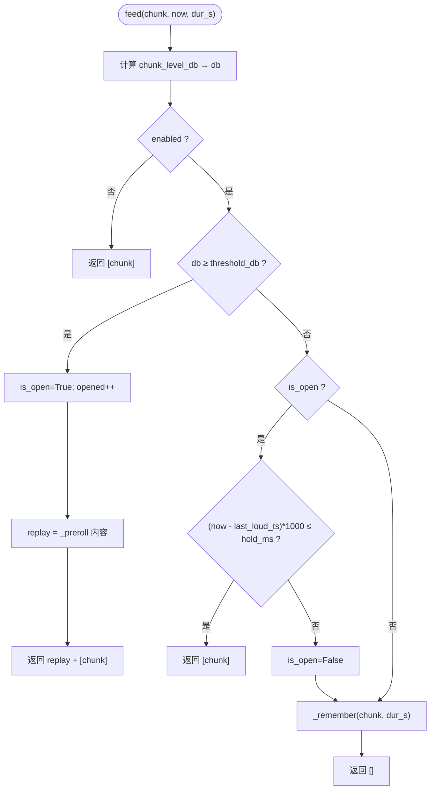
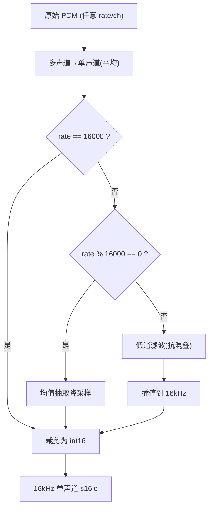
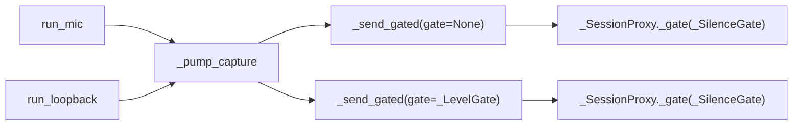
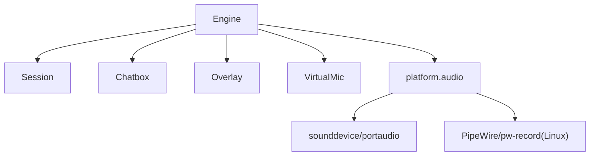

# 音频处理管道

<cite>
**本文引用的文件**   
- [vlt/engine.py](file://vlt/engine.py)
- [vlt/platform/audio.py](file://vlt/platform/audio.py)
- [tests/test_silence_gate.py](file://tests/test_silence_gate.py)
- [tests/test_level_probe.py](file://tests/test_level_probe.py)
- [config.example.yaml](file://config.example.yaml)
</cite>

## 目录
1. [引言](#引言)
2. [项目结构](#项目结构)
3. [核心组件](#核心组件)
4. [架构总览](#架构总览)
5. [详细组件分析](#详细组件分析)
6. [依赖关系分析](#依赖关系分析)
7. [性能与内存优化](#性能与内存优化)
8. [音频质量调优建议](#音频质量调优建议)
9. [故障排查指南](#故障排查指南)
10. [结论](#结论)

## 引言
本文件面向 VRChat 实时同传的音频处理管道，聚焦以下目标：
- 解释音频采集、预处理（重采样/混音）、分发到会话的完整流程。
- 深入说明静音检测与长静音闸门 `_SilenceGate` 的工作原理与配置。
- 阐述输入响度门限 `_LevelGate` 的阈值检测、hold/preroll 机制。
- 说明 PCM 块处理、RMS 电平计算、电平检测的实现细节。
- 区分麦克风输入与系统音频输出两条腿的处理差异。
- 给出代码级流程图与时序图，帮助理解各阶段数据流。
- 提供性能优化策略、音频质量调优建议与排障方法。

## 项目结构
本项目中音频相关逻辑主要分布在：
- `vlt/engine.py`：引擎、静音闸门、输入门限、采集泵、设备选择、虚拟声卡等。
- `vlt/platform/audio.py`：跨平台音频采集抽象、队列化采集源、多路混音。
- `tests/test_silence_gate.py`：静音闸门行为与集成测试。
- `tests/test_level_probe.py`：电平探测与 RMS/dBFS 口径一致性验证。
- `config.example.yaml`：静音闸门相关配置示例。

图表来源
- [vlt/engine.py:204-347](file://vlt/engine.py#L204-L347)
- [vlt/platform/audio.py:30-119](file://vlt/platform/audio.py#L30-L119)
- [vlt/platform/audio.py:204-247](file://vlt/platform/audio.py#L204-L247)

章节来源
- [vlt/engine.py:1-80](file://vlt/engine.py#L1-L80)
- [vlt/platform/audio.py:1-20](file://vlt/platform/audio.py#L1-L20)

## 核心组件
- 引擎 Engine：统一调度采集、会话、字幕、手腕屏、虚拟声卡；维护重复抑制、断线自愈、统计诊断。
- _SessionProxy：封装 send_audio，注入静音闸门与“有人说话”上报。
- _SilenceGate：长静音闸门，连续静音超阈值后暂停上送，恢复时补发 preroll。
- _LevelGate：输入响度门限，按块 RMS 判 dBFS，低于阈值拦截，开闸带 preroll，回落用 hold。
- QueueAudioSource/SoundDeviceMicSource：后台线程拉取 PCM，异步队列供事件循环消费。
- MixedAudioSource：多路采集相加限幅成一路，用于 Linux 下 VRChat 多播放流场景。
- to_16k_mono/chunk_level_db：统一重采样至 16kHz 单声道 s16le，RMS 转 dBFS。

章节来源
- [vlt/engine.py:204-347](file://vlt/engine.py#L204-L347)
- [vlt/engine.py:356-444](file://vlt/engine.py#L356-L444)
- [vlt/platform/audio.py:30-119](file://vlt/platform/audio.py#L30-L119)
- [vlt/platform/audio.py:1732-1759](file://vlt/platform/audio.py#L1732-L1759)

## 架构总览
下图展示从采集到会话的端到端路径，以及两条腿的差异：
- “我说”（麦克风）：直接经代理进入会话，不经过输入响度门限。
- “别人说”（系统输出/loopback）：先经输入响度门限，再进会话。
- 两条腿都受长静音闸门保护（通过 _SessionProxy）。

图表来源
- [vlt/engine.py:1019-1040](file://vlt/engine.py#L1019-L1040)
- [vlt/engine.py:375-403](file://vlt/engine.py#L375-L403)
- [vlt/engine.py:1443-1464](file://vlt/engine.py#L1443-L1464)

## 详细组件分析

### 静音检测与长静音闸门 _SilenceGate
职责
- 防止服务端因长时间喂静音而进入 repeat 状态并断开连接。
- 在连续静音超过 after_s 秒后暂停上送，仅保留最后 preroll_s 秒的静音块。
- 声音恢复时，先按原序补发 preroll，再发送当前有声块，确保句首不丢。

关键实现要点
- 使用 loud 标志（基于峰值阈值）判断是否“有声音”，重置连续静音计时。
- closed 标记表示已关闸；关闸期间累计 gated_chunks。
- _remember 维护 preroll 缓冲，严格按时长截断（含浮点容差）。
- 开闸日志包含拦截块数与补发时长，便于诊断。

图表来源
- [vlt/engine.py:204-267](file://vlt/engine.py#L204-L267)

章节来源
- [vlt/engine.py:204-267](file://vlt/engine.py#L204-L267)
- [tests/test_silence_gate.py:54-150](file://tests/test_silence_gate.py#L54-L150)
- [tests/test_silence_gate.py:206-244](file://tests/test_silence_gate.py#L206-L244)

### 输入响度门限 _LevelGate
职责
- 针对 loopback 腿（VRChat 输出），按块 RMS 计算 dBFS，低于阈值则拦截。
- 开闸时补发 preroll（防丢句首辅音/起音）。
- 回落时用 hold_ms 保持开闸一段时间，避免句中停顿被切碎。

关键实现要点
- chunk_level_db 使用 RMS 而非峰值，单位 dBFS，下限 LEVEL_FLOOR_DB 防 log10(0)。
- is_open 控制当前是否在上送；_last_loud_ts 记录越阈值时刻以计算 hold。
- _remember 维护 preroll 缓冲，按毫秒累计并截断。
- 统计 dropped_chunks/opened/replay_count/level_db，便于界面显示与诊断。

图表来源
- [vlt/engine.py:124-167](file://vlt/engine.py#L124-L167)
- [vlt/engine.py:269-347](file://vlt/engine.py#L269-L347)

章节来源
- [vlt/engine.py:124-167](file://vlt/engine.py#L124-L167)
- [vlt/engine.py:269-347](file://vlt/engine.py#L269-L347)
- [tests/test_level_probe.py:86-99](file://tests/test_level_probe.py#L86-L99)

### 音频块处理流程：PCM、RMS、电平检测
- 采集原始 PCM（可能为任意采样率/声道），统一转换为 16kHz 单声道 s16le。
- 转换过程：
  - 多声道平均为单声道。
  - 整数倍降采样采用均值抽取。
  - 非整数倍先低通滤波抗混叠，再插值到目标采样率。
- 电平检测：对 s16le 数组归一化后计算 RMS，再转为 dBFS。

图表来源
- [vlt/platform/audio.py:1715-1759](file://vlt/platform/audio.py#L1715-L1759)

章节来源
- [vlt/platform/audio.py:1715-1759](file://vlt/platform/audio.py#L1715-L1759)
- [vlt/engine.py:124-141](file://vlt/engine.py#L124-L141)

### 音频流方向性处理：麦克风 vs 系统输出
- 麦克风（mine）：
  - 走 run_mic → _pump_capture → _send_gated（无 gate，直通）。
  - 通过 _SessionProxy 进入 _SilenceGate，长静音闸门仍生效。
- 系统输出（theirs/loopback）：
  - Windows：WASAPI loopback，pick_loopback_target 选择端点。
  - Linux：等待 VRChat 输出流出现，pw-record 多路采集，MixedAudioSource 混音。
  - 均经过 _LevelGate 后再进入 _SilenceGate。

图表来源
- [vlt/engine.py:1404-1418](file://vlt/engine.py#L1404-L1418)
- [vlt/engine.py:1762-1802](file://vlt/engine.py#L1762-L1802)
- [vlt/engine.py:1443-1464](file://vlt/engine.py#L1443-L1464)
- [vlt/engine.py:375-403](file://vlt/engine.py#L375-L403)

章节来源
- [vlt/engine.py:1404-1418](file://vlt/engine.py#L1404-L1418)
- [vlt/engine.py:1762-1802](file://vlt/engine.py#L1762-L1802)
- [vlt/engine.py:1443-1464](file://vlt/engine.py#L1443-L1464)
- [vlt/engine.py:375-403](file://vlt/engine.py#L375-L403)

### 代码级示例（以路径引用代替具体代码）
- 静音闸门核心逻辑与用例：
  - [vlt/engine.py:204-267](file://vlt/engine.py#L204-L267)
  - [tests/test_silence_gate.py:66-134](file://tests/test_silence_gate.py#L66-L134)
- 输入门限与电平函数：
  - [vlt/engine.py:124-167](file://vlt/engine.py#L124-L167)
  - [vlt/engine.py:269-347](file://vlt/engine.py#L269-L347)
- 采集泵与门限共用入口：
  - [vlt/engine.py:1443-1464](file://vlt/engine.py#L1443-L1464)
  - [vlt/engine.py:1475-1496](file://vlt/engine.py#L1475-L1496)
- 重采样与电平计算：
  - [vlt/platform/audio.py:1715-1759](file://vlt/platform/audio.py#L1715-L1759)
  - [vlt/engine.py:124-141](file://vlt/engine.py#L124-L141)

## 依赖关系分析
- Engine 依赖：
  - config/config_io：解析 session_base/capture/output 等配置。
  - platform.audio：统一采集抽象与混音。
  - output/chatbox/overlay/virtualmic：字幕、手腕屏、译音输出。
  - session.base：会话创建、收发、心跳与重连。
- 采集层依赖：
  - sounddevice/portaudio（Windows）与 pw-record（Linux）由平台后端封装。
- 门限与闸门：
  - _LevelGate 仅作用于 loopback 腿；_SilenceGate 通过 _SessionProxy 作用于所有输入。

图表来源
- [vlt/engine.py:446-527](file://vlt/engine.py#L446-L527)
- [vlt/platform/audio.py:121-179](file://vlt/platform/audio.py#L121-L179)

章节来源
- [vlt/engine.py:446-527](file://vlt/engine.py#L446-L527)
- [vlt/platform/audio.py:121-179](file://vlt/platform/audio.py#L121-L179)

## 性能与内存优化
- 缓冲区管理
  - QueueAudioSource 使用 asyncio.Queue，满时丢弃最旧块，避免阻塞采集线程。
  - MixedAudioSource 并发读取多路，仅在全部超时才返回 None，减少空转。
- 内存使用
  - 使用 array 与 numpy 向量化计算 RMS/重采样，避免 Python 层逐样本开销。
  - preroll 缓冲按时间长度截断，避免无限增长。
- I/O 与线程
  - 采集线程与事件循环解耦，异常不会冒泡到主线程。
  - 虚拟声卡串行锁避免多路 TTS 分片交错导致听感问题。
- 网络与重连
  - 看门狗自动重连，带退避与 RPM 预算，避免频繁重建会话。

章节来源
- [vlt/platform/audio.py:30-119](file://vlt/platform/audio.py#L30-L119)
- [vlt/platform/audio.py:204-247](file://vlt/platform/audio.py#L204-L247)
- [vlt/engine.py:1253-1286](file://vlt/engine.py#L1253-L1286)
- [vlt/engine.py:1290-1394](file://vlt/engine.py#L1290-L1394)

## 音频质量调优建议
- 输入响度门限（capture.gate_*）
  - gate_db：默认 -45dBFS，范围 -70~-10dBFS。数值越高过滤越狠，适合嘈杂环境；越低更宽松，能翻远处小声。
  - gate_hold_ms：默认 500ms，避免句中停顿被切碎。
  - gate_preroll_ms：默认 250ms，补回句首辅音，提升识别准确率。
- 长静音闸门（session.silence_gate_*）
  - silence_gate_after_s：默认 30s，连续静音超此值即暂停上送，防服务端 repeat。
  - silence_gate_preroll_s：默认 1.0s，声音恢复时补发最近静音片段，保证句首不丢。
  - silence_gate_enabled：可彻底关闭该行为。
- 重采样与降噪
  - 优先使用接近 16kHz 的设备以减少重采样失真；若必须重采样，确保低通滤波开启。
- 虚拟声卡（译音输出）
  - buffer_ms 与 max_buffer_ms 需平衡延迟与爆音风险；过大增加延迟，过小易断音。

章节来源
- [vlt/engine.py:58-70](file://vlt/engine.py#L58-L70)
- [vlt/engine.py:107-121](file://vlt/engine.py#L107-L121)
- [vlt/engine.py:143-167](file://vlt/engine.py#L143-L167)
- [config.example.yaml:57-63](file://config.example.yaml#L57-L63)

## 故障排查指南
- 服务端 1011 断线与模型 repeat
  - 现象：长时间静音导致服务端报 COMMON_ERROR 后掐线。
  - 解决：启用 _SilenceGate，合理设置 after_s 与 preroll_s；观察诊断日志中的静音比例与闸门状态。
- 远端玩家声音小被误滤
  - 现象：loopback 腿几乎不上送。
  - 解决：降低 gate_db（如 -50dBFS），增大 hold_ms，确认 preroll_ms 不为 0。
- 句首丢字
  - 现象：识别掉字，尤其辅音/起音。
  - 解决：提高 gate_preroll_ms；检查 _LevelGate 是否正常工作。
- 虚拟声卡无声或爆音
  - 现象：对方听不到译音或反复重念。
  - 解决：检查 VirtualMic 打开失败日志；调整 buffer_ms/max_buffer_ms；确保串行锁生效。
- 设备选择错误
  - 现象：loopback 抓错设备或麦克风选错。
  - 解决：使用 pick_loopback_target 与 resolve_device_name 明确指定；查看枚举日志与回退链命中情况。

章节来源
- [vlt/engine.py:1307-1361](file://vlt/engine.py#L1307-L1361)
- [vlt/engine.py:1586-1650](file://vlt/engine.py#L1586-L1650)
- [vlt/engine.py:1653-1690](file://vlt/engine.py#L1653-L1690)

## 结论
本音频管道通过两层闸门（输入响度门限与长静音闸门）与统一的 PCM 处理链路，兼顾了识别质量与稳定性：
- _LevelGate 过滤“小声”，保障只在有效音量区间上送；
- _SilenceGate 防止“长静音”引发服务端 repeat 断线；
- 统一的重采样与 RMS 计算保证不同设备/平台的口径一致；
- 两条腿的方向性处理确保“我说的话”不被误滤，“别人说的话”被合理过滤；
- 完善的诊断与重试机制提升了鲁棒性与可维护性。