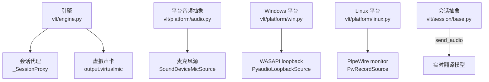
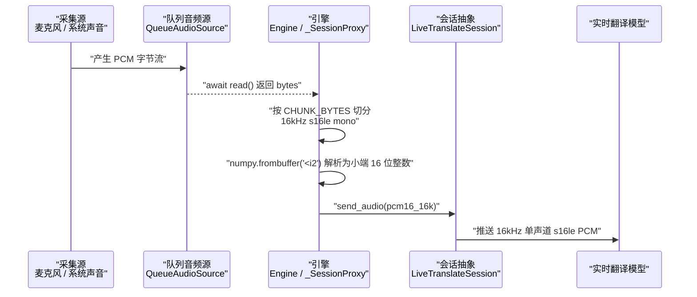
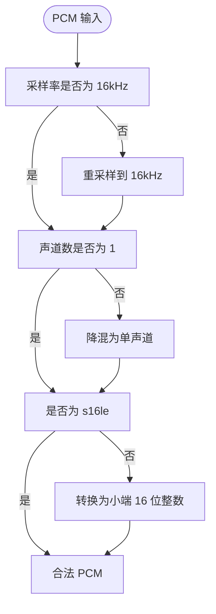
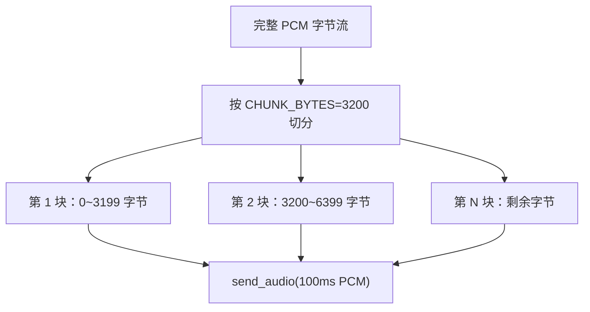
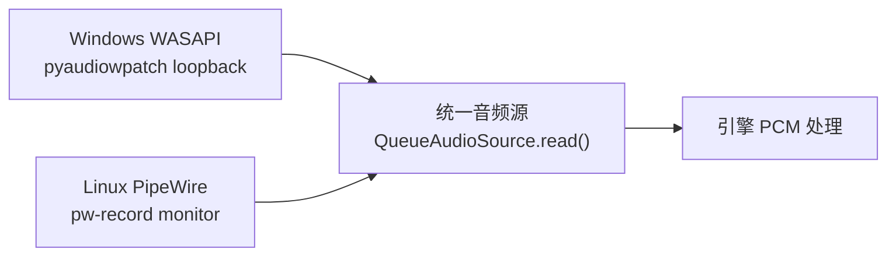
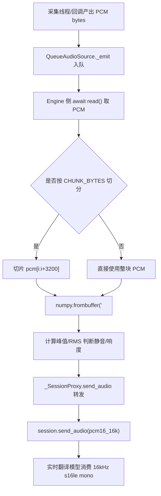
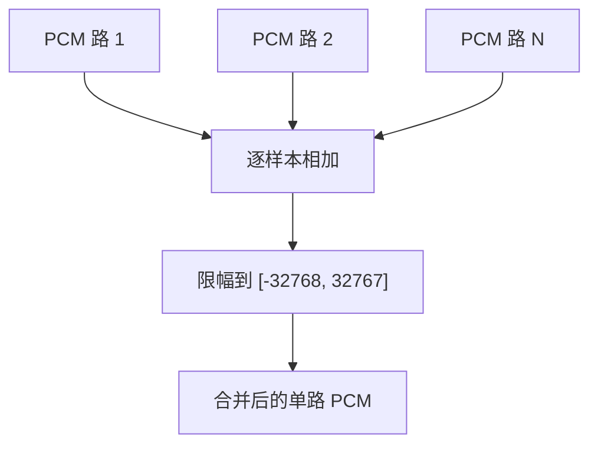
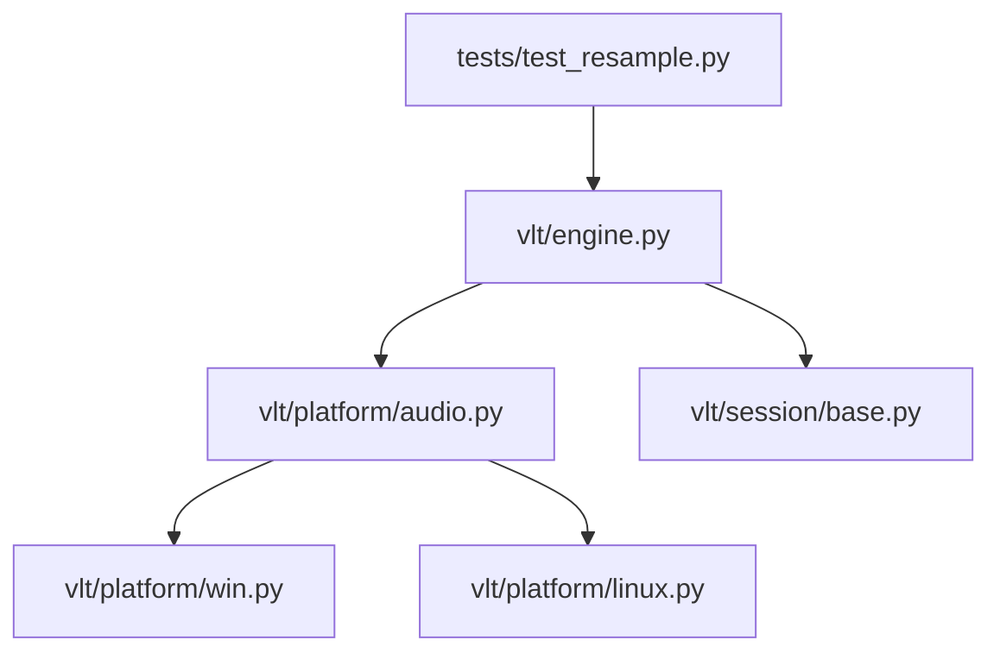

# PCM 数据格式处理

<cite>
**本文引用的文件**   
- [engine.py](file://vlt/engine.py)
- [audio.py](file://vlt/platform/audio.py)
- [base.py](file://vlt/session/base.py)
- [win.py](file://vlt/platform/win.py)
- [linux.py](file://vlt/platform/linux.py)
- [test_resample.py](file://tests/test_resample.py)
- [README.md](file://README.md)
</cite>

## 目录
1. [引言](#引言)
2. [项目结构](#项目结构)
3. [核心组件](#核心组件)
4. [架构总览](#架构总览)
5. [详细组件分析](#详细组件分析)
6. [依赖关系分析](#依赖关系分析)
7. [性能与实时性](#性能与实时性)
8. [故障排查](#故障排查)
9. [结论](#结论)
10. [附录：PCM 规范与代码路径速查](#附录pcm-规范与代码路径速查)

## 引言
本文件面向 VRChat 实时同传中的 **PCM 音频数据格式处理**，重点解释以下问题：
- 目标 PCM 格式：**16kHz、s16le（小端序 16 位有符号整数）、单声道**。
- 字节序转换原理：小端序在 `numpy.frombuffer` 中的体现。
- 音频块大小计算：为什么使用 `CHUNK_BYTES = 3200`，即 **100ms @16kHz s16le mono**。
- 平台差异：Windows WASAPI 与 Linux PipeWire 的采集/输出差异，以及如何在统一接口下兼容。
- 实际流程：从采集到上送会话的 PCM 读取、转换、处理路径。
- 格式验证与错误处理：如何保证输入是合法的 s16le PCM，并在异常时不中断主流程。

该项目的整体目标是把麦克风或游戏声音采集进来，交给千问云实时翻译模型，再把译文显示到 chatbox 气泡和 VR 手腕屏；可选地把译音回灌进虚拟麦克风让对方直接听到。PCM 处理贯穿“采集 → 重采样/降混 → 会话发送 → 可选 TTS 输出”这条链路。

**章节来源**
- [README.md:11-35](file://README.md#L11-L35)

## 项目结构
围绕 PCM 处理，关键代码分布在以下几层：
- 引擎层：定义 PCM 块大小、静音门限、电平检测、会话代理、TTS 音频处理。
- 平台抽象层：统一的音频采集基类、麦克风实现、多路混音。
- 平台实现层：Windows 用 WASAPI/pyaudiowpatch，Linux 用 PipeWire/pw-record。
- 会话层：对外暴露 `send_audio(pcm16_16k)` 的抽象接口，约定 16kHz 单声道 s16le。

**图示来源**
- [engine.py:41-52](file://vlt/engine.py#L41-L52)
- [engine.py:356-443](file://vlt/engine.py#L356-L443)
- [audio.py:30-119](file://vlt/platform/audio.py#L30-L119)
- [audio.py:121-180](file://vlt/platform/audio.py#L121-L180)
- [audio.py:182-247](file://vlt/platform/audio.py#L182-L247)
- [win.py:214-294](file://vlt/platform/win.py#L214-L294)
- [linux.py:750-800](file://vlt/platform/linux.py#L750-L800)
- [base.py:130-181](file://vlt/session/base.py#L130-L181)

**章节来源**
- [engine.py:1-52](file://vlt/engine.py#L1-L52)
- [audio.py:1-20](file://vlt/platform/audio.py#L1-L20)
- [base.py:1-5](file://vlt/session/base.py#L1-L5)

## 核心组件
本节聚焦与 PCM 直接相关的核心对象和常量：
- `CHUNK_BYTES = 3200`：表示每次向会话发送一段 100ms 的 PCM。
- `chunk_level_db(chunk)`：对一块 PCM 做 RMS 电平检测，用于静音/响度门限。
- `_SessionProxy.send_audio(pcm)`：把原始 PCM 转为 numpy 数组并判断是否“有人说话”，再交给会话。
- `LiveTranslateSession.send_audio(pcm16_16k)`：会话抽象接口，明确约定 16kHz 单声道 s16le。
- `MixedAudioSource`：把多路 16k 单声道 s16le PCM 相加限幅成一路。
- Windows WASAPI loopback 与 Linux PipeWire monitor：分别负责系统声音采集，最终都进入统一 PCM 流。

**章节来源**
- [engine.py:41-52](file://vlt/engine.py#L41-L52)
- [engine.py:124-140](file://vlt/engine.py#L124-L140)
- [engine.py:375-443](file://vlt/engine.py#L375-L443)
- [base.py:166-168](file://vlt/session/base.py#L166-L168)
- [audio.py:182-247](file://vlt/platform/audio.py#L182-L247)

## 架构总览
下图展示 PCM 从采集到会话发送的整体流程，并标注关键格式约束。

**图示来源**
- [engine.py:41-52](file://vlt/engine.py#L41-L52)
- [engine.py:124-140](file://vlt/engine.py#L124-L140)
- [engine.py:375-443](file://vlt/engine.py#L375-L443)
- [base.py:166-168](file://vlt/session/base.py#L166-L168)

## 详细组件分析

### 1. PCM 格式规范：16kHz、s16le、单声道
项目对实时同传的输入 PCM 有明确约定：
- **采样率**：16kHz。
- **位深度**：16 位有符号整数。
- **字节序**：小端序（little-endian）。
- **声道数**：单声道。

这个约定体现在会话抽象接口中：`send_audio` 的参数名是 `pcm16_16k`，注释写明“推送一段 16kHz 单声道 s16le PCM”。引擎侧也通过 `CHUNK_BYTES = 3200` 表达“100ms @16kHz s16le mono”。

**图示来源**
- [base.py:166-168](file://vlt/session/base.py#L166-L168)
- [engine.py:41-52](file://vlt/engine.py#L41-L52)

**章节来源**
- [base.py:166-168](file://vlt/session/base.py#L166-L168)
- [engine.py:41-52](file://vlt/engine.py#L41-L52)

### 2. 字节序转换与小端序处理
PCM 在 Python 中以 `bytes` 形式传输，底层是连续的字节序列。为了进行音量、峰值、RMS 等数值计算，需要把这些字节解析成数字数组。

项目中多处使用 `numpy.frombuffer`，并通过 dtype `<i2` 表示：
- `<`：小端序。
- `i2`：2 字节有符号整数（即 16 位有符号整数）。

例如：
- `chunk_level_db` 中用 `np.frombuffer(chunk, dtype="<i2")` 把 PCM 字节转成样本数组。
- `_SessionProxy.send_audio` 中也用 `np.frombuffer(pcm, dtype="<i2")` 计算峰值，判断是否“有人在说话”。

这意味着：
- 如果 PCM 不是小端序，解析出来的样本值会错位，导致电平检测、静音判断、甚至后续重采样出错。
- 如果 PCM 不是 16 位，dtype 必须调整，否则会报长度或类型错误。
- 如果 PCM 不是单声道，需要先降混，否则峰值/RMS 语义会受多声道影响。

**章节来源**
- [engine.py:124-140](file://vlt/engine.py#L124-L140)
- [engine.py:375-443](file://vlt/engine.py#L375-L443)

### 3. 音频块大小计算：CHUNK_BYTES = 3200
`CHUNK_BYTES = 3200` 的含义是：
- 采样率：16kHz = 每秒 16000 个样本。
- 每个样本：16 位 = 2 字节。
- 单声道：每 1 个样本占 2 字节。
- 100ms 时长：16000 × 0.1 = 1600 个样本。
- 字节数：1600 × 2 = 3200 字节。

因此，`CHUNK_BYTES = 3200` 对应的是 **100ms 的 16kHz s16le 单声道 PCM**。

引擎在把 PCM 发给会话时，会按 `CHUNK_BYTES` 切分：
- 遍历整个 PCM 字节流。
- 每次取 `pcm[i:i + CHUNK_BYTES]`。
- 调用 `session.send_audio(...)`。

这保证了发送给模型的每一段都是固定时长、固定格式的 PCM 片段，便于服务端按帧处理。

**图示来源**
- [engine.py:41-52](file://vlt/engine.py#L41-L52)
- [engine.py:1048-1051](file://vlt/engine.py#L1048-L1051)

**章节来源**
- [engine.py:41-52](file://vlt/engine.py#L41-L52)
- [engine.py:1048-1051](file://vlt/engine.py#L1048-L1051)

### 4. 平台差异：Windows WASAPI 与 Linux PipeWire
#### Windows：WASAPI loopback
Windows 上使用 pyaudiowpatch 打开 WASAPI loopback，采集系统输出。关键点：
- 设备枚举收敛到 WASAPI host API，避免 MME/DirectSound/WDM-KS 重复项。
- loopback 采集按设备原生声道数打开，不能强行压成 2 声道，否则会报通道数错误。
- 读线程使用非阻塞轮询 `get_read_available()`，因为 WASAPI loopback 在无音频时 `read()` 可能永久阻塞。
- 收尾顺序严格遵循：先停止喂数据线程，再关闭底层资源，避免访问违规。

#### Linux：PipeWire monitor
Linux 上使用 PipeWire 原生工具 `pw-record`，通过 monitor 语义抓取系统输出：
- 不依赖 PulseAudio 兼容层，直接用 `pw-dump` / `pw-record` / `pw-cat`。
- 对 VRChat（Wine/Proton）的输出，需要匹配 `Stream/Output/Audio` 节点，而不是普通 `Audio/Sink`。
- 采集参数强制使用 `--raw`，否则 stdout 可能是容器格式而非裸 PCM。
- 子进程以固定块大小读取 stdout，保持约 100ms 一帧。

两者虽然底层不同，但都通过 `QueueAudioSource` 统一成异步 `read()` 接口，上层引擎只关心“拿到一块 PCM 字节”。

**图示来源**
- [win.py:214-294](file://vlt/platform/win.py#L214-L294)
- [linux.py:750-800](file://vlt/platform/linux.py#L750-L800)
- [audio.py:30-119](file://vlt/platform/audio.py#L30-L119)

**章节来源**
- [win.py:23-85](file://vlt/platform/win.py#L23-L85)
- [win.py:214-294](file://vlt/platform/win.py#L214-L294)
- [linux.py:1-33](file://vlt/platform/linux.py#L1-L33)
- [linux.py:184-211](file://vlt/platform/linux.py#L184-L211)
- [linux.py:750-800](file://vlt/platform/linux.py#L750-L800)
- [audio.py:30-119](file://vlt/platform/audio.py#L30-L119)

### 5. PCM 读取、转换与处理流程
下面用一个更贴近实现的流程图说明 PCM 的处理路径：

**图示来源**
- [audio.py:70-98](file://vlt/platform/audio.py#L70-L98)
- [engine.py:124-140](file://vlt/engine.py#L124-L140)
- [engine.py:375-443](file://vlt/engine.py#L375-L443)
- [base.py:166-168](file://vlt/session/base.py#L166-L168)

**章节来源**
- [audio.py:70-98](file://vlt/platform/audio.py#L70-L98)
- [engine.py:124-140](file://vlt/engine.py#L124-L140)
- [engine.py:375-443](file://vlt/engine.py#L375-L443)
- [base.py:166-168](file://vlt/session/base.py#L166-L168)

### 6. 多路 PCM 混音与限幅
Linux 上 VRChat 可能同时打开多个播放流，程序会把多路 PCM 相加后限幅成一路。混音逻辑：
- 各路 PCM 都是 16k 单声道 s16le。
- 逐样本相加。
- 结果钳制到 -32768 ~ 32767，防止爆音。
- 输出长度取最长那路的样本数。

**图示来源**
- [audio.py:182-201](file://vlt/platform/audio.py#L182-L201)
- [audio.py:204-247](file://vlt/platform/audio.py#L204-L247)

**章节来源**
- [audio.py:182-201](file://vlt/platform/audio.py#L182-L201)
- [audio.py:204-247](file://vlt/platform/audio.py#L204-L247)

### 7. 重采样与降混：从系统采样率到 16kHz
Windows 和 Linux 的采集设备不一定都是 16kHz。例如：
- Windows 测试用例强调“按设备原生采样率打开”，然后由下游 `to_16k_mono` 转 16kHz。
- Linux 的 `pw-record` 可以指定 `--rate=16000`，但采集链路上仍可能遇到不同采样率设备。

因此，工程上通常有两步：
1. 按设备原生采样率打开采集，避免 WASAPI 共享模式拒绝 16kHz。
2. 在引擎侧统一重采样到 16kHz，并降混为单声道。

测试文件 `test_resample.py` 专门针对 `to_16k_mono` 做回归测试，确保非整数倍采样率不会把语音压成极低频包络。

**章节来源**
- [win.py:361-411](file://vlt/platform/win.py#L361-L411)
- [linux.py:750-800](file://vlt/platform/linux.py#L750-L800)
- [test_resample.py:1-10](file://tests/test_resample.py#L1-L10)

### 8. 虚拟声卡与 TTS 音频格式
除了输入 PCM，项目还涉及 TTS 输出的 PCM：
- TTS 合成输出通常是 24kHz 单声道 s16le。
- 虚拟声卡可能需要 48kHz 立体声，因此存在重采样和声道扩展逻辑。
- 引擎中 `_on_audio` 会调用 `resample_24k_mono_to_48k_stereo`，把 TTS 音频转成虚拟声卡需要的格式。

这说明：**“16kHz s16le mono”是实时翻译模型输入的约定，而 TTS 输出和虚拟声卡输出可能有不同格式要求。**

**章节来源**
- [engine.py:1134-1142](file://vlt/engine.py#L1134-L1142)

## 依赖关系分析
PCM 相关模块之间的依赖如下：

**图示来源**
- [engine.py:1-52](file://vlt/engine.py#L1-L52)
- [audio.py:1-20](file://vlt/platform/audio.py#L1-L20)
- [base.py:1-5](file://vlt/session/base.py#L1-L5)
- [test_resample.py:1-10](file://tests/test_resample.py#L1-L10)

**章节来源**
- [engine.py:1-52](file://vlt/engine.py#L1-L52)
- [audio.py:1-20](file://vlt/platform/audio.py#L1-L20)
- [base.py:1-5](file://vlt/session/base.py#L1-L5)
- [test_resample.py:1-10](file://tests/test_resample.py#L1-L10)

## 性能与实时性
- **块大小**：100ms 是一个兼顾延迟与稳定性的选择。太短会增加网络/模型调用开销，太长会增加首字延迟。
- **numpy 解析**：`numpy.frombuffer` 是零拷贝视图，适合高频调用；但在极端情况下应捕获异常，避免一次坏块拖垮采集循环。
- **混音复杂度**：`_mix_pcm16` 使用纯 Python + array，刻意避免引入 numpy，因为每 100ms 只有少量样本，纯 Python 足够快且减少依赖。
- **平台采集稳定性**：Windows WASAPI loopback 使用非阻塞轮询，Linux PipeWire 使用子进程管道，两者都通过队列缓冲，避免阻塞事件循环。

[本节为通用性能讨论，不直接分析具体代码行，故无“章节来源”]

## 故障排查
以下是 PCM 处理中常见问题及定位思路：

| 现象 | 可能原因 | 排查建议 |
|---|---|---|
| 模型收不到音频或识别乱码 | PCM 不是 16kHz s16le mono | 检查设备采样率、声道数、字节序；确认 `numpy.frombuffer("<i2")` 能正常解析 |
| 一直判静音 | 峰值/RMS 门限设置不当，或 PCM 被错误重采样 | 查看 `chunk_level_db` 返回值；检查 `SILENCE_PEAK` 和输入门限配置 |
| Windows 麦克风无声 | WASAPI 共享模式拒绝 16kHz | 确认按设备原生采样率打开，再由下游转 16kHz |
| Linux 系统声音采集失败 | `pw-record` 未加 `--raw` 或 target 不对 | 检查 argv 是否包含 `--raw`，target 是否为 sink 或 VRChat 输出流 serial |
| 多路声音丢一半 | Linux VRChat 多流只抓了一个 | 使用 `find_vrchat_output_streams` 找到全部流，并用 `MixedAudioSource` 混音 |
| 停止翻译闪退 | 采集线程与底层资源关闭竞争 | 确认 `QueueAudioSource.close()` 顺序：stop → join → teardown |

**章节来源**
- [engine.py:124-140](file://vlt/engine.py#L124-L140)
- [engine.py:375-443](file://vlt/engine.py#L375-L443)
- [win.py:361-411](file://vlt/platform/win.py#L361-L411)
- [linux.py:750-800](file://vlt/platform/linux.py#L750-L800)
- [audio.py:100-119](file://vlt/platform/audio.py#L100-L119)

## 结论
VRChat 实时同传的 PCM 处理以 **16kHz、s16le、单声道** 为核心约定，并通过以下机制保证可靠性：
- 用 `CHUNK_BYTES = 3200` 固定 100ms 音频块。
- 用 `numpy.frombuffer("<i2")` 正确解析小端 16 位整数。
- 用 `QueueAudioSource` 统一 Windows WASAPI 与 Linux PipeWire 的采集差异。
- 用静音门限、响度门限、重采样、降混、混音限幅等机制提升鲁棒性。
- 用会话抽象接口隔离模型实现，使 PCM 格式契约清晰稳定。

对于开发者来说，最关键的规则是：**所有送给 `session.send_audio` 的 PCM 必须是 16kHz 单声道 s16le；任何平台差异应在采集层解决，不要污染上层 PCM 契约。**

[本节为总结性内容，不直接分析具体代码行，故无“章节来源”]

## 附录：PCM 规范与代码路径速查

### PCM 格式速查表
| 字段 | 值 | 说明 |
|---|---|---|
| 采样率 | 16kHz | 实时翻译模型输入约定 |
| 位深度 | 16 位 | 有符号整数 |
| 字节序 | 小端序 | numpy dtype `<i2` |
| 声道数 | 单声道 | 多声道需降混 |
| 块时长 | 100ms | CHUNK_BYTES=3200 |
| 块字节数 | 3200 | 16000×0.1×2 |

### 关键代码路径
- 块大小定义：`vlt/engine.py`
- 电平检测与 numpy 解析：`vlt/engine.py`
- 会话 PCM 接口约定：`vlt/session/base.py`
- 统一音频采集抽象：`vlt/platform/audio.py`
- Windows WASAPI loopback：`vlt/platform/win.py`
- Linux PipeWire monitor：`vlt/platform/linux.py`
- 重采样回归测试：`tests/test_resample.py`

**章节来源**
- [engine.py:41-52](file://vlt/engine.py#L41-L52)
- [engine.py:124-140](file://vlt/engine.py#L124-L140)
- [base.py:166-168](file://vlt/session/base.py#L166-L168)
- [audio.py:30-119](file://vlt/platform/audio.py#L30-L119)
- [win.py:214-294](file://vlt/platform/win.py#L214-L294)
- [linux.py:750-800](file://vlt/platform/linux.py#L750-L800)
- [test_resample.py:1-10](file://tests/test_resample.py#L1-L10)