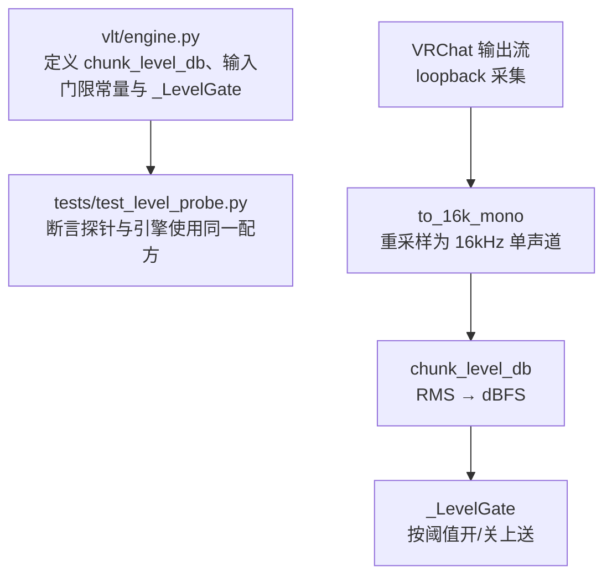
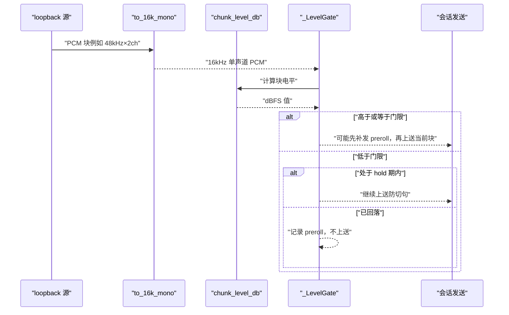
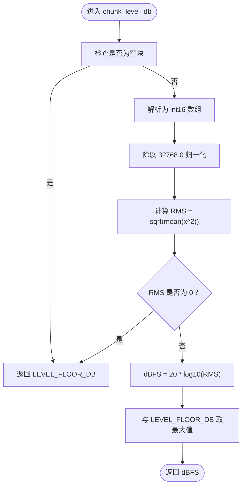
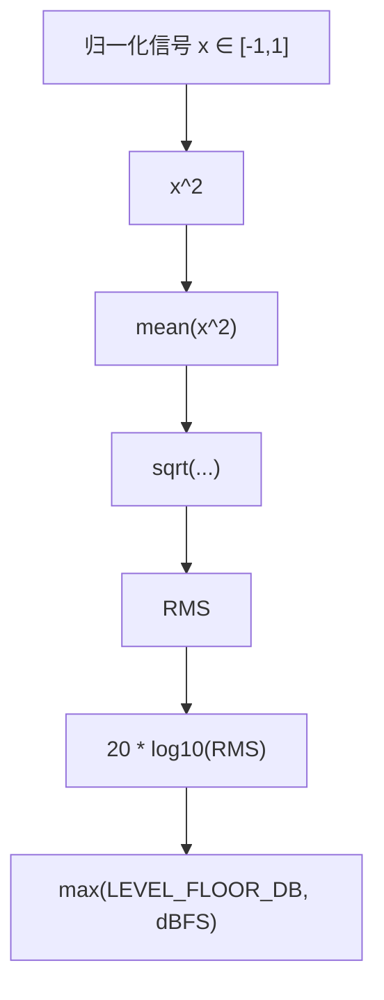
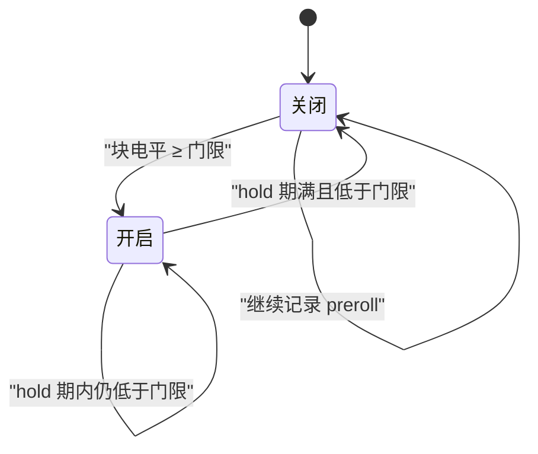
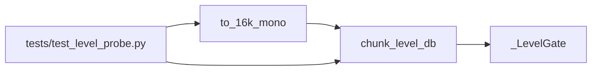

# RMS 电平计算

<cite>
**本文引用的文件**   
- [engine.py](file://vlt/engine.py)
- [test_level_probe.py](file://tests/test_level_probe.py)
</cite>

## 目录
1. [引言](#引言)
2. [项目结构定位](#项目结构定位)
3. [核心组件](#核心组件)
4. [架构总览](#架构总览)
5. [详细组件分析](#详细组件分析)
6. [依赖关系分析](#依赖关系分析)
7. [性能与数值特性](#性能与数值特性)
8. [调参与排错指南](#调参与排错指南)
9. [结论](#结论)

## 引言
本文聚焦 VRChat 实时同传中的音频响度检测链路，重点解释 `chunk_level_db` 函数的实现原理：从 int16 PCM 块到 dBFS 的完整流程、RMS 与峰值的区别、静音门限配置范围，以及为什么选择 RMS 作为响度指标。文档同时给出可复现的参数调优建议，帮助你在不同房间混音环境下稳定过滤远处玩家声音，同时保留近处说话者的句首和句尾细节。

## 项目结构定位
RMS 电平计算的核心代码位于引擎模块中，相关测试用例在独立测试文件中验证了“探针读数与引擎口径一致”的关键契约。

**图示来源**
- [engine.py:124-140](file://vlt/engine.py#L124-L140)
- [engine.py:269-346](file://vlt/engine.py#L269-L346)
- [test_level_probe.py:189-220](file://tests/test_level_probe.py#L189-L220)

**章节来源**
- [engine.py:41-70](file://vlt/engine.py#L41-L70)
- [engine.py:124-167](file://vlt/engine.py#L124-L167)
- [test_level_probe.py:189-220](file://tests/test_level_probe.py#L189-L220)

## 核心组件
- `chunk_level_db(chunk)`：纯函数，接收一个 PCM 字节块，返回该块的 dBFS 电平。
- `LEVEL_FLOOR_DB`：电平下限，用于避免对零值取对数，也代表“数字静音”。
- `INPUT_GATE_MIN_DB` / `INPUT_GATE_MAX_DB`：输入门限 dBFS 合法区间。
- `_LevelGate`：基于 `chunk_level_db` 的输入响度闸门，负责开闸、保持期 hold、补发 preroll。

**章节来源**
- [engine.py:67-70](file://vlt/engine.py#L67-L70)
- [engine.py:124-140](file://vlt/engine.py#L124-L140)
- [engine.py:269-346](file://vlt/engine.py#L269-L346)

## 架构总览
下图展示从原始 loopback 音频到最终是否上送的完整链路：

**图示来源**
- [engine.py:124-140](file://vlt/engine.py#L124-L140)
- [engine.py:302-346](file://vlt/engine.py#L302-L346)
- [test_level_probe.py:189-220](file://tests/test_level_probe.py#L189-L220)

## 详细组件分析

### `chunk_level_db`：RMS 与 dBFS 计算
`chunk_level_db` 的实现遵循以下关键步骤：

1. **空块保护**  
   如果传入字节为空，直接返回 `LEVEL_FLOOR_DB`，表示没有有效数据。

2. **int16 解析**  
   将 PCM 字节块解析为小端 int16 数组，对应 16-bit signed audio。

3. **归一化到浮点满量程**  
   将 int16 转为 float64，并除以 32768.0，得到 [-1, 1] 范围内的归一化信号。  
   这里 32768 是 int16 满量程的一半绝对值；除以它后，最大幅度 32767 约等于 -0.00003 相对满量程，工程上视为接近 0 dBFS。

4. **RMS 计算**  
   对归一化信号求均方根：先平方、求均值、再开平方。RMS 反映的是能量意义上的平均响度，而不是单个尖峰。

5. **静音保护**  
   如果 RMS 为零或极小，返回 `LEVEL_FLOOR_DB`，避免 `log10(0)` 导致负无穷。

6. **dBFS 转换**  
   使用 `20 * log10(rms)` 转换为分贝。因为 dBFS 以满量程为 0 dB，所以越接近 0 dBFS 表示越响。

7. **下限钳制**  
   最终结果与 `LEVEL_FLOOR_DB` 取较大值，保证输出不会低于地板值。

**图示来源**
- [engine.py:124-140](file://vlt/engine.py#L124-L140)

**章节来源**
- [engine.py:124-140](file://vlt/engine.py#L124-L140)

### 音频信号归一化处理
- **输入格式**：PCM 字节块，通常来自 loopback 采集，可能是 48kHz 立体声。
- **重采样路径**：在实际引擎中，loopback 音频会先经过 `to_16k_mono`，统一成 16kHz 单声道，再交给 `chunk_level_db`。
- **归一化方式**：`x = arr.astype(np.float64) / 32768.0`，把 int16 映射到浮点域，并以 32768 作为满量程参考。
- **设计意义**：这样无论原始采样率或声道数如何，只要最终进入 `chunk_level_db` 的是等幅 PCM，RMS 与 dBFS 就具有可比性。

测试中通过构造恒定幅度 PCM 块，验证了“48kHz 立体声与 16kHz 单声道算出相同 dBFS”的契约。

**章节来源**
- [engine.py:124-140](file://vlt/engine.py#L124-L140)
- [test_level_probe.py:86-99](file://tests/test_level_probe.py#L86-L99)
- [test_level_probe.py:189-220](file://tests/test_level_probe.py#L189-L220)

### dBFS 计算的数学原理
- **RMS 与响度**：RMS 是对信号能量的统计量，比瞬时峰值更能代表一段语音的整体响度。
- **dBFS 定义**：dBFS 是以数字满量程为 0 dB 的对数单位。对于归一化后的 RMS，公式为 `20 * log10(rms)`。
- **下限处理**：当 RMS 为 0 时，对数为负无穷，因此用 `LEVEL_FLOOR_DB` 作为最小值。工程中常用 -120 dBFS 表示“数字静音”。

**图示来源**
- [engine.py:124-140](file://vlt/engine.py#L124-L140)

**章节来源**
- [engine.py:67-70](file://vlt/engine.py#L67-L70)
- [engine.py:124-140](file://vlt/engine.py#L124-L140)

### 静音检测与输入门限
输入侧针对 VRChat 输出的“别人说话”混音路设置了响度门限，目的是过滤远处玩家的小声片段，减少无效上送。

- **默认行为**：输入门限默认启用，默认阈值为 `-45.0 dBFS`。
- **合法范围**：`INPUT_GATE_MIN_DB = -70.0`，`INPUT_GATE_MAX_DB = -10.0`。
- **Hold 时间**：超过阈值后，允许一段时间内即使回落到门限以下也继续上送，防止句子被切碎。
- **Preroll**：开闸时补发阈值之前的一小段音频，避免丢失句首辅音。

**图示来源**
- [engine.py:143-167](file://vlt/engine.py#L143-L167)
- [engine.py:269-346](file://vlt/engine.py#L269-L346)

**章节来源**
- [engine.py:58-69](file://vlt/engine.py#L58-L69)
- [engine.py:143-167](file://vlt/engine.py#L143-L167)
- [engine.py:269-346](file://vlt/engine.py#L269-L346)

### RMS 与峰值检测的区别
- **峰值检测**：只关心块内最大绝对值。按键、咳嗽、音效的一个尖刺就能让峰值很高，但并不代表整句话很响。
- **RMS 检测**：考虑整个块的能量分布，更适合判断“这句话整体有多响”。
- **工程取舍**：对于 VRChat 多人混音，远处玩家小声说话时可能出现偶发高脉冲，但 RMS 仍较低；这正是需要拦截的对象。

**章节来源**
- [engine.py:124-140](file://vlt/engine.py#L124-L140)

### 参数调优建议
- **调节目标**：在“过滤远处小声”和“保留近处说话”之间平衡。
- **推荐起点**：从默认 `-45.0 dBFS` 开始。
- **更严格**：提高阈值（更接近 0 dB），例如 `-35.0 dBFS`，只保留更靠近耳边的声音。
- **更宽松**：降低阈值（更接近 -70.0 dB），例如 `-55.0 dBFS`，允许更远或更轻的声音。
- **Hold 时间**：如果句子经常被切成两段，可适当增大 hold 时间。
- **Preroll**：如果识别经常丢字，尤其是句首辅音，可适当增大 preroll。

**章节来源**
- [engine.py:58-69](file://vlt/engine.py#L58-L69)
- [engine.py:143-167](file://vlt/engine.py#L143-L167)
- [engine.py:269-346](file://vlt/engine.py#L269-L346)

## 依赖关系分析
`chunk_level_db` 本身是纯函数，不依赖外部状态；但它与以下组件形成紧密协作：

- `to_16k_mono`：统一采样率和声道，确保电平口径一致。
- `_LevelGate`：消费 `chunk_level_db` 的输出，决定哪些块上送。
- 测试模块：断言“探针与引擎使用同一配方”，保证用户看到的电平与实际引擎使用的电平一致。

**图示来源**
- [engine.py:124-140](file://vlt/engine.py#L124-L140)
- [engine.py:269-346](file://vlt/engine.py#L269-L346)
- [test_level_probe.py:189-220](file://tests/test_level_probe.py#L189-L220)

**章节来源**
- [engine.py:124-167](file://vlt/engine.py#L124-L167)
- [test_level_probe.py:189-220](file://tests/test_level_probe.py#L189-L220)

## 性能与数值特性
- **时间复杂度**：`chunk_level_db` 对每个样本做平方、求均值、开平方，时间复杂度为 O(N)，N 为块内样本数。
- **空间复杂度**：主要消耗在 numpy 数组上，属于一次性中间计算，内存占用与块大小线性相关。
- **数值稳定性**：通过 `LEVEL_FLOOR_DB` 避免对零取对数；对 RMS 非正的情况直接返回地板值。
- **一致性保证**：测试验证了不同采样形状下 dBFS 一致，说明归一化和 RMS 口径稳定。

[本节为通用性能讨论，不直接分析具体代码行]

## 调参与排错指南

### 常见问题
- **电平一直显示地板值**  
  可能原因：没有读到有效 PCM 块、设备未打开、或 read 超时。此时应检查音频源和采集配置。
- **电平读数异常偏高**  
  可能原因：输入增益过高、系统输出音量过大、或使用了峰值而非 RMS 的旧逻辑。
- **句子被切碎**  
  可能原因：hold 时间太短，句尾渐弱部分被误判为静音。
- **句首丢字**  
  可能原因：preroll 太小，开闸前的一小段没有被补发。

### 排查步骤
1. 确认 `chunk_level_db` 的输入确实是有效的 PCM 字节块。
2. 确认实际链路中音频先经过 `to_16k_mono`，再进入电平计算。
3. 检查输入门限是否在 `[INPUT_GATE_MIN_DB, INPUT_GATE_MAX_DB]` 范围内。
4. 观察 `_LevelGate` 的开闸、hold、preroll 日志，判断是否因阈值过严或 hold 过短导致问题。
5. 使用测试中的恒定幅度 PCM 思路，构造已知 dBFS 的信号进行回归验证。

**章节来源**
- [engine.py:67-70](file://vlt/engine.py#L67-L70)
- [engine.py:124-167](file://vlt/engine.py#L124-L167)
- [engine.py:269-346](file://vlt/engine.py#L269-L346)
- [test_level_probe.py:189-220](file://tests/test_level_probe.py#L189-L220)

## 结论
`chunk_level_db` 是 VRChat 实时同传中音频响度检测的基础：它将 int16 PCM 块归一化为浮点信号，计算 RMS，再转换为 dBFS，并用 `LEVEL_FLOOR_DB` 保证数值安全。配合 `_LevelGate` 的阈值、hold 和 preroll，系统可以在多人混音环境中有效过滤远处小声，同时尽量保留自然说话的句首和句尾。测试用例进一步保证了“界面探针与引擎使用同一电平口径”，让用户在设置窗中调门限时，看到的就是真实生效的电平。