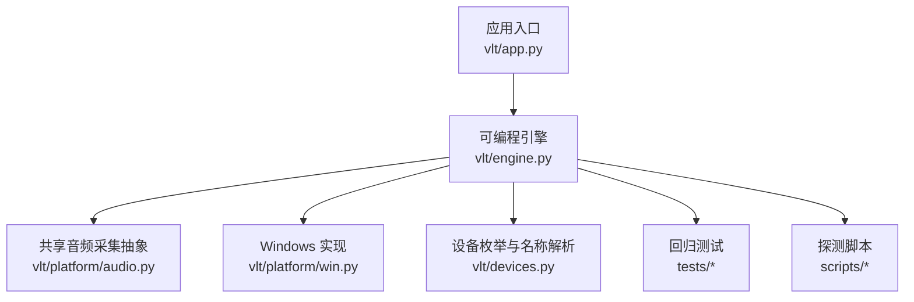
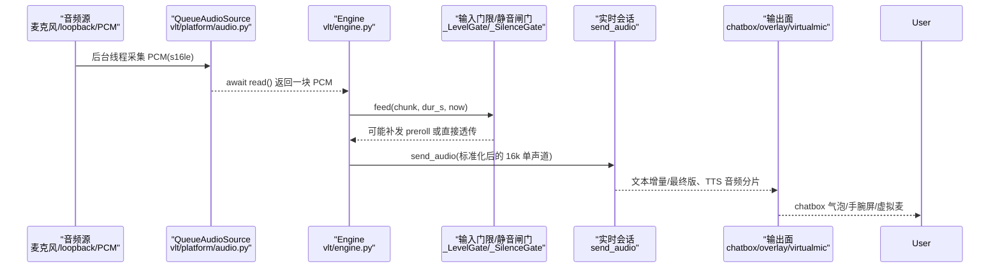
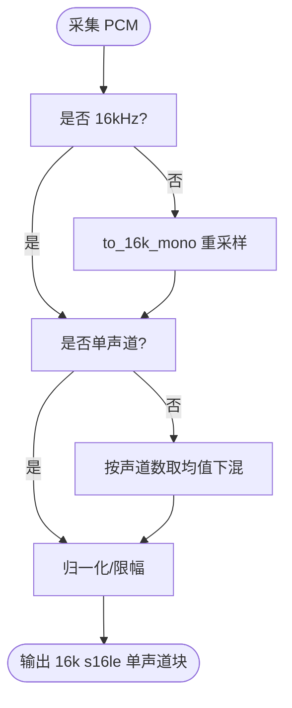
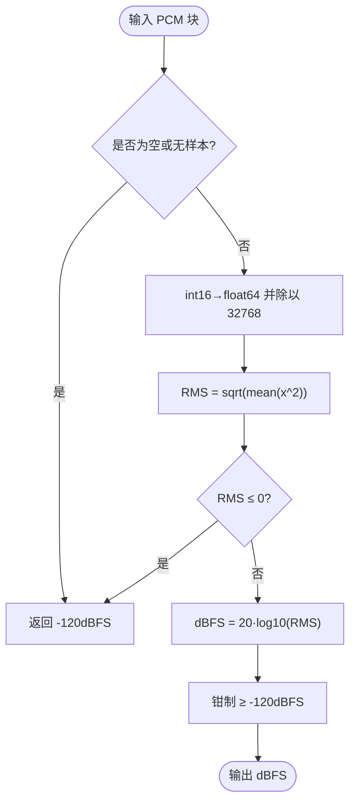
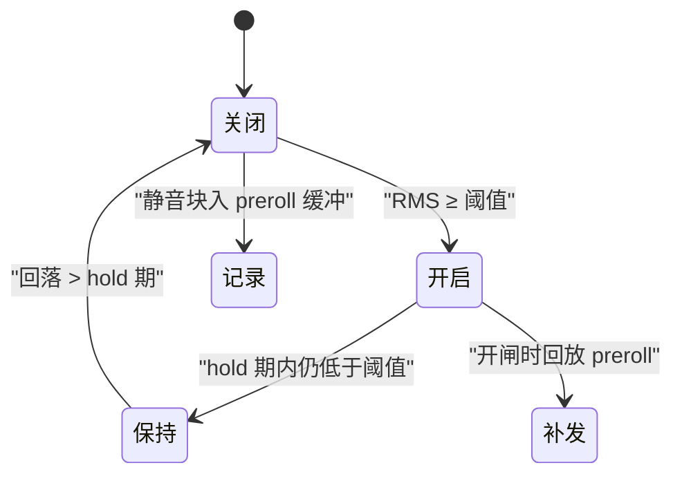
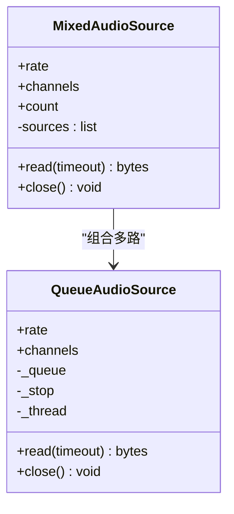
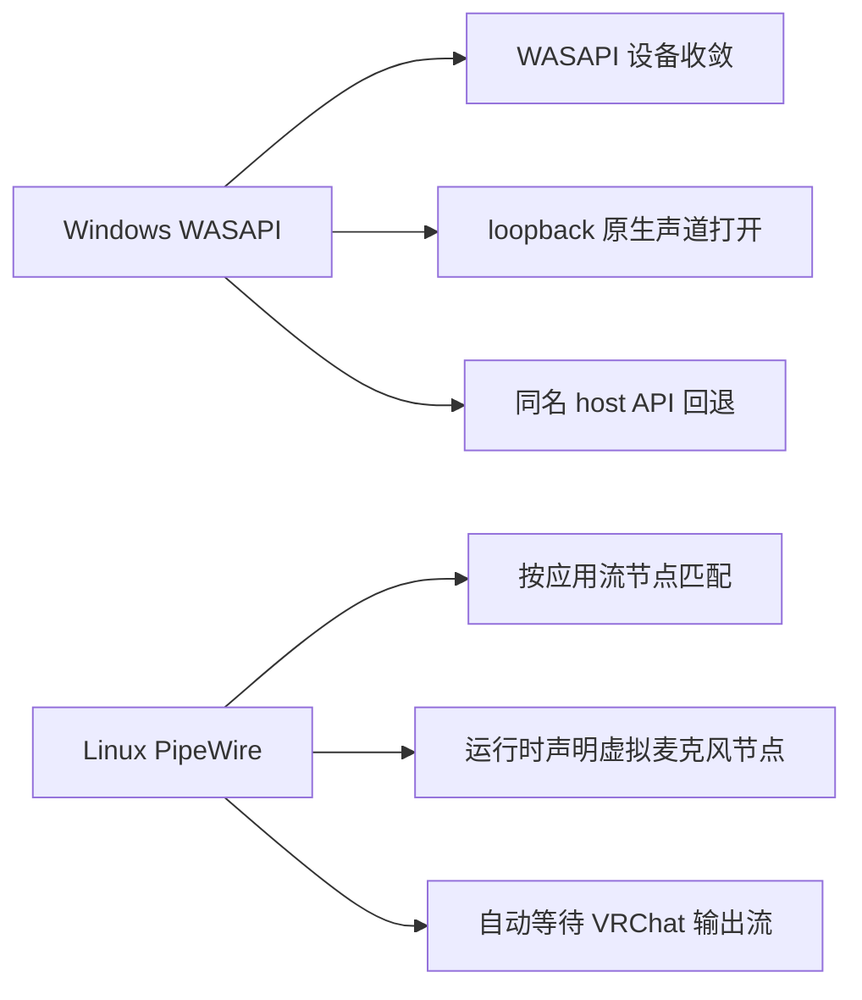
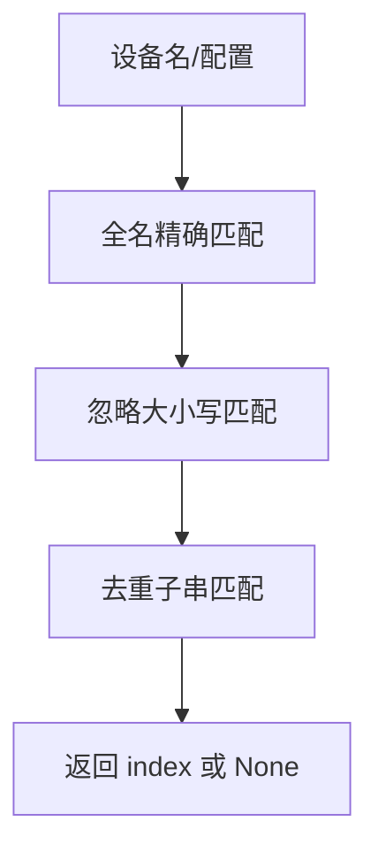
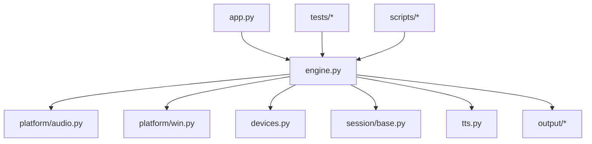

# 音频格式处理

<cite>
**本文引用的文件**   
- [README.md](file://README.md)
- [app.py](file://vlt/app.py)
- [engine.py](file://vlt/engine.py)
- [audio.py](file://vlt/platform/audio.py)
- [win.py](file://vlt/platform/win.py)
- [devices.py](file://vlt/devices.py)
- [test_resample.py](file://tests/test_resample.py)
- [test_level_probe.py](file://tests/test_level_probe.py)
- [probe_realtime.py](file://scripts/probe_realtime.py)
</cite>

## 目录
1. [引言](#引言)
2. [项目结构](#项目结构)
3. [核心组件](#核心组件)
4. [架构总览](#架构总览)
5. [详细组件分析](#详细组件分析)
6. [依赖关系分析](#依赖关系分析)
7. [性能与质量优化](#性能与质量优化)
8. [故障排查指南](#故障排查指南)
9. [结论](#结论)
10. [附录：代码示例路径](#附录代码示例路径)

## 引言
本文面向 VRChat 实时同传的音频格式处理子系统，聚焦以下目标：
- 解释 PCM 数据从采集到上送的完整流程，包括采样率转换、声道数处理与字节序。
- 深入说明 chunk_level_db 的实现原理（RMS、dBFS 单位与数值范围）。
- 明确音频块格式规范：16kHz、s16le、单声道。
- 阐述 MixedAudioSource 在多路音频混合、设备枚举与流管理中的作用。
- 对比 Windows WASAPI 与 Linux PipeWire 的差异与特殊处理。
- 提供可落地的质量优化建议与常见问题排查方法。

## 项目结构
本项目采用“引擎 + 平台抽象”的分层组织方式：
- vlt/app.py：命令行入口，负责参数解析、配置加载与 Engine 生命周期管理。
- vlt/engine.py：核心引擎，统一调度采集、会话、节流合并、输出（chatbox/overlay/virtualmic）以及输入门限与静音闸门。
- vlt/platform/*：平台无关的音频采集抽象与具体平台实现（Windows WASAPI、Linux PipeWire）。
- tests/*：覆盖重采样、电平计算、静音闸门等关键路径的回归测试。
- scripts/*：用于端到端探测与调试的工具脚本。

**图表来源**
- [app.py:1-166](file://vlt/app.py#L1-L166)
- [engine.py:1-120](file://vlt/engine.py#L1-L120)
- [audio.py:1-60](file://vlt/platform/audio.py#L1-L60)
- [win.py:1-20](file://vlt/platform/win.py#L1-L20)
- [devices.py:1-22](file://vlt/devices.py#L1-L22)

**章节来源**
- [README.md:1-50](file://README.md#L1-L50)
- [app.py:1-166](file://vlt/app.py#L1-L166)

## 核心组件
- Engine：编排音频源、会话、节流器、输出面；维护输入响度门限与长静音闸门；驱动虚拟声卡译音输出。
- QueueAudioSource / SoundDeviceMicSource：统一的异步拉式采集底座，屏蔽 PortAudio/sounddevice 回调差异。
- PyaudioLoopbackSource：Windows WASAPI loopback 采集，非阻塞轮询 + 原生声道打开 + 下游降混。
- MixedAudioSource：多路 s16le PCM 相加并限幅，对外暴露统一 read/close 接口。
- chunk_level_db：基于 RMS 的 dBFS 电平计算，供输入门限与 UI 显示使用。
- devices.py：跨平台设备枚举与名称解析，保证同名设备在不同 host API 下稳定选择。

**章节来源**
- [engine.py:120-170](file://vlt/engine.py#L120-L170)
- [audio.py:30-120](file://vlt/platform/audio.py#L30-L120)
- [win.py:214-294](file://vlt/platform/win.py#L214-L294)
- [audio.py:182-247](file://vlt/platform/audio.py#L182-L247)
- [devices.py:1-22](file://vlt/devices.py#L1-L22)

## 架构总览
下图展示从音频源到输出的主路径，以及关键处理节点：

**图表来源**
- [audio.py:30-120](file://vlt/platform/audio.py#L30-L120)
- [engine.py:1008-1056](file://vlt/engine.py#L1008-L1056)
- [engine.py:269-347](file://vlt/engine.py#L269-L347)
- [engine.py:204-267](file://vlt/engine.py#L204-L267)

## 详细组件分析

### PCM 音频格式与处理流程
- 输入块规格：16kHz、s16le、单声道，每块约 100ms（CHUNK_BYTES = 3200）。
- 采样率转换：采集侧按设备原生采样率打开，由 engine._pump_capture 中的 to_16k_mono 统一转换为 16kHz。
- 声道处理：WASAPI loopback 按端点原生声道数打开，再由 to_16k_mono 按声道数取均值下混为单声道。
- 字节序：s16le（小端），numpy 以 "<i2" 解析。

**图表来源**
- [engine.py:41-52](file://vlt/engine.py#L41-L52)
- [win.py:230-243](file://vlt/platform/win.py#L230-L243)
- [test_resample.py:1-111](file://tests/test_resample.py#L1-L111)

**章节来源**
- [engine.py:41-52](file://vlt/engine.py#L41-L52)
- [win.py:230-243](file://vlt/platform/win.py#L230-L243)
- [test_resample.py:1-111](file://tests/test_resample.py#L1-L111)

### chunk_level_db：RMS 与 dBFS 计算
- 输入：s16le PCM 块。
- 步骤：
  - 空块或零样本 → 返回 LEVEL_FLOOR_DB（-120dBFS）。
  - 将 int16 归一化为 [-1, 1] 浮点。
  - 计算 RMS = sqrt(mean(x^2))。
  - 若 RMS ≤ 0 → 返回 LEVEL_FLOOR_DB。
  - 否则 dBFS = 20·log10(RMS)，并以 LEVEL_FLOOR_DB 作为下限。
- 用途：输入门限判断、UI 实时电平显示。

**图表来源**
- [engine.py:124-141](file://vlt/engine.py#L124-L141)

**章节来源**
- [engine.py:124-141](file://vlt/engine.py#L124-L141)
- [test_level_probe.py:84-99](file://tests/test_level_probe.py#L84-L99)

### 输入门限与静音闸门
- _LevelGate（输入响度门限）：
  - 低于阈值时暂停上送；超过阈值后 hold_ms 内继续上送，避免句中断裂。
  - 开闸时补发 preroll 内的历史块，防止丢句首辅音。
- _SilenceGate（长静音闸门）：
  - 连续静音超过 after_s 秒则暂停上送，仅保留 preroll_s 秒的最近音频。
  - 声音恢复时先补发 preroll，再正常上送当前块。

**图表来源**
- [engine.py:269-347](file://vlt/engine.py#L269-L347)
- [engine.py:204-267](file://vlt/engine.py#L204-L267)

**章节来源**
- [engine.py:269-347](file://vlt/engine.py#L269-L347)
- [engine.py:204-267](file://vlt/engine.py#L204-L267)

### MixedAudioSource：多路音频混合与流管理
- 作用：聚合多个采集源（如 Linux 上 VRChat 的多条播放流），并发读取并在样本级相加限幅，输出一路 PCM。
- 混合算法：逐样本累加后限幅至 s16 范围，长度取最长路。
- 流管理：并发 gather 各路 read；任一失败不拖垮其它路；close 逐一关闭。

**图表来源**
- [audio.py:182-247](file://vlt/platform/audio.py#L182-L247)

**章节来源**
- [audio.py:182-247](file://vlt/platform/audio.py#L182-L247)

### 平台差异：Windows WASAPI vs Linux PipeWire
- Windows WASAPI：
  - 设备枚举收敛到 WASAPI host API，过滤 MME/DirectSound/WDM-KS 重复项与幽灵端点。
  - loopback 按端点原生声道数打开，禁止压成固定声道数；由下游 to_16k_mono 下混。
  - 非阻塞轮询 get_read_available，避免阻塞读导致收尾崩溃。
  - 同名设备回退链：WASAPI 失败时尝试其它 host API（MME/DirectSound）。
- Linux PipeWire：
  - 通过 pw-record/pw-cat 与 PipeWire 图交互；VRChat 输出按应用流节点精确匹配。
  - 运行时声明虚拟麦克风流节点，无需用户自备虚拟声卡。
  - 自动等待 VRChat 音频输出流，忽略配置中的 loopback_device。

**图表来源**
- [win.py:23-85](file://vlt/platform/win.py#L23-L85)
- [win.py:214-294](file://vlt/platform/win.py#L214-L294)
- [win.py:320-348](file://vlt/platform/win.py#L320-L348)
- [engine.py:1027-1040](file://vlt/engine.py#L1027-L1040)

**章节来源**
- [win.py:23-85](file://vlt/platform/win.py#L23-L85)
- [win.py:214-294](file://vlt/platform/win.py#L214-L294)
- [win.py:320-348](file://vlt/platform/win.py#L320-L348)
- [engine.py:1027-1040](file://vlt/engine.py#L1027-L1040)

### 设备枚举与名称解析
- 三类设备：麦克风（input）、VRChat 音频（loopback）、译音输出（output）。
- 名称解析顺序：全名精确匹配 → 忽略大小写 → 去重子串匹配。
- 索引口径：Windows 优先 pa_index（PortAudio 真实索引），Linux 走列表下标。

**图表来源**
- [devices.py:132-153](file://vlt/devices.py#L132-L153)

**章节来源**
- [devices.py:1-22](file://vlt/devices.py#L1-L22)
- [devices.py:132-153](file://vlt/devices.py#L132-L153)

## 依赖关系分析
- app.py 依赖 Engine 与配置模块，负责 CLI 参数到 Engine 构造参数的映射。
- Engine 依赖 platform.audio（采集抽象）、platform.win（WASAPI 实现）、devices（设备解析）、session（实时会话）、tts（译音合成）、output.*（chatbox/overlay/virtualmic）。
- 测试与脚本复用 engine.to_16k_mono、chunk_level_db 等纯函数进行离线验证。

**图表来源**
- [app.py:1-166](file://vlt/app.py#L1-L166)
- [engine.py:1-40](file://vlt/engine.py#L1-L40)
- [audio.py:1-20](file://vlt/platform/audio.py#L1-L20)
- [win.py:1-20](file://vlt/platform/win.py#L1-L20)
- [devices.py:1-22](file://vlt/devices.py#L1-L22)

**章节来源**
- [app.py:1-166](file://vlt/app.py#L1-L166)
- [engine.py:1-40](file://vlt/engine.py#L1-L40)

## 性能与质量优化
- 采样率与块大小：
  - 采集侧按设备原生采样率打开，避免 WASAPI 共享模式拒绝 16kHz 的错误。
  - blocksize 随采样率调整，保持约 100ms 一块，降低延迟与抖动。
- 下混与限幅：
  - 多声道按声道数均值下混，避免偏置；混合相加后限幅至 s16 范围，防爆音。
- 电平门限与静音闸门：
  - 合理设置 gate_db（默认 -45dBFS）、hold_ms（默认 500ms）、preroll_ms（默认 250ms），平衡灵敏度与句首完整性。
  - 长静音闸门 after_s/preroll_s 防止服务端 repeat 掉线，同时保留句首低能量片段。
- 虚拟声卡输出：
  - 译音输出 24k 单声道经 resample_24k_mono_to_48k_stereo 转 48k 立体声，配合 buffer_ms/max_buffer_ms 控制抖动缓冲。
- 日志与诊断：
  - 所有降级与回退均留痕，禁静默降级；统计 dropped_chunks、replay_count、gated_chunks 便于定位问题。

[本节为通用指导，不直接分析具体文件]

## 故障排查指南
- 麦克风无声或打不开：
  - 检查设备名解析是否命中正确索引；确认 WASAPI 已启用且采样率匹配。
  - 查看同名 host API 回退链日志，确认是否回落到 MME/DirectSound。
- loopback 无声音：
  - Windows：确认按端点原生声道数打开；检查 get_read_available 轮询是否正常。
  - Linux：确认 PipeWire 图中 VRChat 输出流存在；程序会自动等待并检测节点消失。
- 译文重复或模型 repeat：
  - 观察本地 repeat 抑制日志；必要时重建会话或调整 repeat_guard 参数。
- 电平异常或误判静音：
  - 核对 chunk_level_db 读数与 UI 电平条；调整 gate_db/hold_ms/preroll_ms。
- 虚拟声卡无输出：
  - 检查 output.audio.enabled 与 device_name/device 回退链；Linux 需确认运行时声明的 PipeWire 节点可用。

**章节来源**
- [win.py:320-348](file://vlt/platform/win.py#L320-L348)
- [engine.py:1079-1133](file://vlt/engine.py#L1079-L1133)
- [engine.py:1134-1151](file://vlt/engine.py#L1134-L1151)

## 结论
本系统通过“平台无关采集抽象 + 平台特定实现”的方式，统一了 Windows WASAPI 与 Linux PipeWire 的音频采集差异；在引擎层完成 16kHz 单声道标准化、RMS 电平计算、输入门限与静音闸门控制，并将结果送入实时会话与多种输出面。MixedAudioSource 解决了多路音频流的聚合问题，确保 VRChat 多播放流场景下的声音完整性。整体设计强调可观测性、健壮性与可移植性，适合在 VRChat 实时同传的高要求场景中稳定运行。

[本节为总结性内容，不直接分析具体文件]

## 附录：代码示例路径
- 16kHz 单声道 s16le PCM 文件测试：
  - [README.md:28-47](file://README.md#L28-L47)
  - [docs/GUIDE.md:225-246](file://docs/GUIDE.md#L225-L246)
- 实时推送 PCM 分片（脚本）：
  - [probe_realtime.py:70-106](file://scripts/probe_realtime.py#L70-L106)
  - [probe_realtime.py:134-134](file://scripts/probe_realtime.py#L134-L134)
- 重采样 with 回归测试：
  - [test_resample.py:1-111](file://tests/test_resample.py#L1-L111)
- 电平计算与闭环校验：
  - [test_level_probe.py:84-99](file://tests/test_level_probe.py#L84-L99)
  - [engine.py:124-141](file://vlt/engine.py#L124-L141)