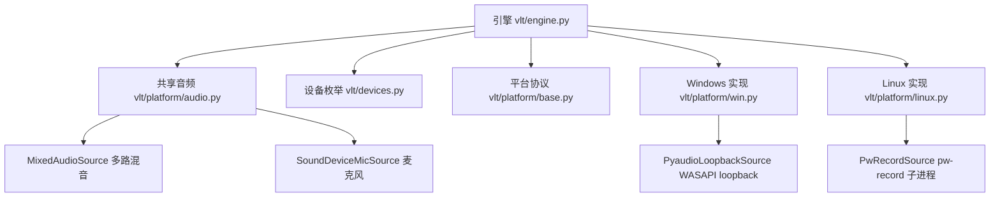
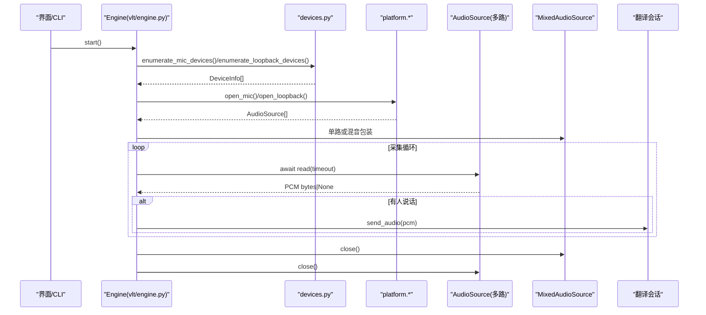
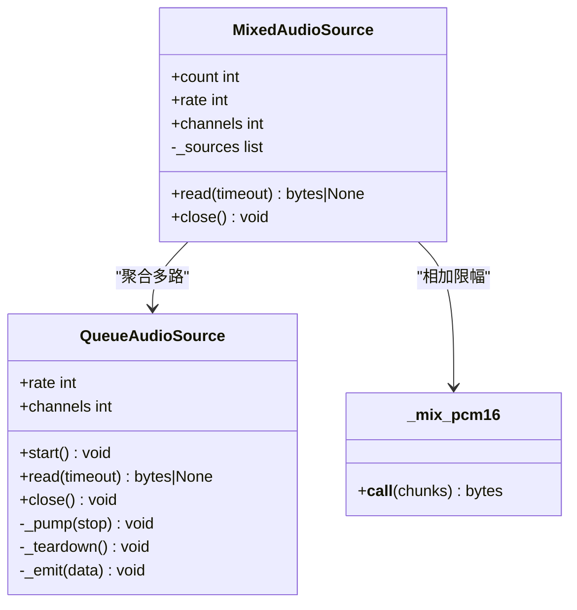
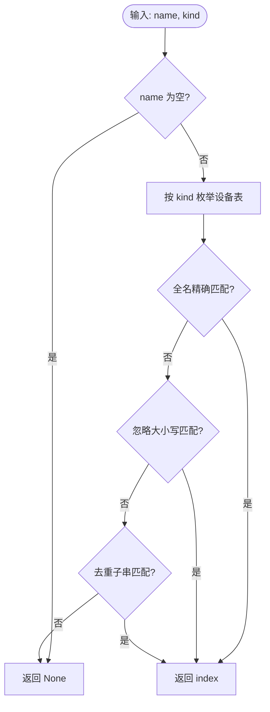
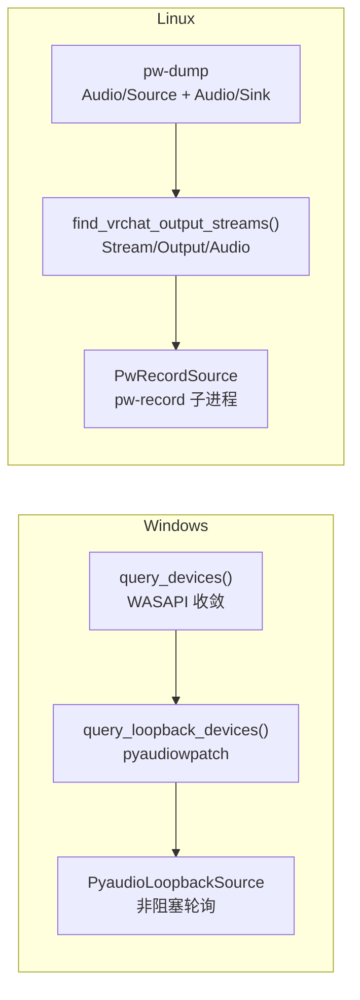
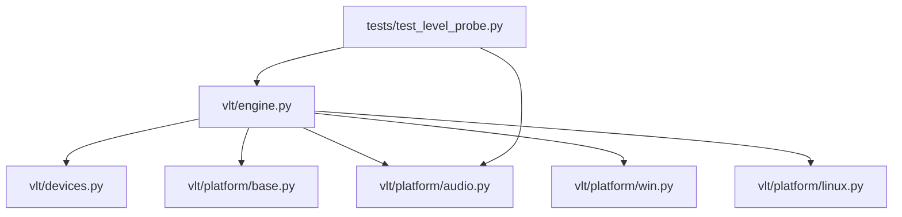

# 音频源管理

<cite>
**本文引用的文件**   
- [README.md](file://README.md)
- [vlt/platform/audio.py](file://vlt/platform/audio.py)
- [vlt/devices.py](file://vlt/devices.py)
- [vlt/engine.py](file://vlt/engine.py)
- [vlt/platform/base.py](file://vlt/platform/base.py)
- [vlt/platform/win.py](file://vlt/platform/win.py)
- [vlt/platform/linux.py](file://vlt/platform/linux.py)
- [tests/test_level_probe.py](file://tests/test_level_probe.py)
</cite>

## 目录
1. [引言](#引言)
2. [项目结构](#项目结构)
3. [核心组件](#核心组件)
4. [架构总览](#架构总览)
5. [详细组件分析](#详细组件分析)
6. [依赖关系分析](#依赖关系分析)
7. [性能与延迟特性](#性能与延迟特性)
8. [故障诊断指南](#故障诊断指南)
9. [结论](#结论)

## 引言
本文件面向 VRChat 实时同传中的“音频源管理系统”，重点解释 MixedAudioSource 的设计、多路音频混合、设备枚举与选择机制，以及 Windows WASAPI loopback 与 Linux PipeWire 两条路径的差异。文档同时覆盖音频流的启动、停止和资源清理流程，说明采样率、缓冲区大小和延迟等质量参数的配置口径，并给出基于源码路径的创建、配置和使用示例，最后提供常见问题的诊断方法。

## 项目结构
本项目把“平台无关的音频抽象”与“平台相关实现”解耦：
- 共享层：`vlt/platform/audio.py` 定义采集源的通用基类与混音器；`vlt/devices.py` 负责设备枚举与名称解析；`vlt/platform/base.py` 定义协议（AudioSource/AudioSink/LoopbackTarget）。
- 引擎层：`vlt/engine.py` 组装采集、静音门限、会话发送、虚拟声卡输出等能力。
- 平台层：Windows 用 `vlt/platform/win.py`（WASAPI + pyaudiowpatch），Linux 用 `vlt/platform/linux.py`（PipeWire 原生工具）。



**图表来源**
- [vlt/engine.py:1-40](file://vlt/engine.py#L1-L40)
- [vlt/platform/audio.py:1-20](file://vlt/platform/audio.py#L1-L20)
- [vlt/platform/base.py:1-41](file://vlt/platform/base.py#L1-L41)
- [vlt/platform/win.py:1-19](file://vlt/platform/win.py#L1-L19)
- [vlt/platform/linux.py:1-33](file://vlt/platform/linux.py#L1-L33)

**章节来源**
- [README.md:11-49](file://README.md#L11-L49)

## 核心组件
- QueueAudioSource：统一后台线程喂数据到 asyncio 队列，对外暴露 `read()` 协程；保证关闭顺序为“置停止位 → join 线程 → 关底层资源”。
- SoundDeviceMicSource：跨平台的麦克风采集实现，Windows 走 WASAPI，Linux 走 ALSA/PipeWire，差异仅在设备指定方式。
- MixedAudioSource：将多路 AudioSource 并发读取，逐样本相加并限幅成一路 PCM，供引擎统一上送。
- PyaudioLoopbackSource（Windows）：基于 pyaudiowpatch 的 WASAPI loopback 采集，非阻塞轮询可用帧数，避免阻塞读导致收尾崩溃。
- PwRecordSource（Linux）：通过 `pw-record` 子进程抓取 sink monitor，按固定块大小从 stdout 拉取 PCM。
- devices.DeviceInfo 与 resolve_device_name：对 sounddevice/pyaudiowpatch/pw-dump 返回的原始 dict 做标准化，并提供“全名精确 → 忽略大小写 → 去重子串”的名称解析。

**章节来源**
- [vlt/platform/audio.py:30-119](file://vlt/platform/audio.py#L30-L119)
- [vlt/platform/audio.py:121-180](file://vlt/platform/audio.py#L121-L180)
- [vlt/platform/audio.py:182-247](file://vlt/platform/audio.py#L182-L247)
- [vlt/platform/win.py:214-294](file://vlt/platform/win.py#L214-L294)
- [vlt/platform/linux.py:750-800](file://vlt/platform/linux.py#L750-L800)
- [vlt/devices.py:30-161](file://vlt/devices.py#L30-L161)

## 架构总览
VRChat 实时同传的音频采集分为两条腿：
- “我说”：麦克风 → 引擎 → 翻译会话。
- “别人说”：系统声采集（loopback）→ 引擎 → 翻译会话。

在 Linux 上，“别人说”需要精确匹配 VRChat 的输出流节点，而不是抓默认 sink；在 Windows 上则使用 WASAPI loopback 设备。



**图表来源**
- [vlt/engine.py:1842-1879](file://vlt/engine.py#L1842-L1879)
- [vlt/devices.py:39-102](file://vlt/devices.py#L39-L102)
- [vlt/platform/audio.py:204-247](file://vlt/platform/audio.py#L204-L247)

## 详细组件分析

### MixedAudioSource：多路音频混合
MixedAudioSource 用于把 VRChat 的多路播放输出合并成一路 PCM，再交给引擎统一处理。其关键设计点：
- 并发读取：使用 `asyncio.gather` 同时读各路，任何一路有数据就参与混音。
- 逐样本相加限幅：纯 Python + array 实现，避免引入 numpy 依赖；长度取最长路，值域钳制到 s16 范围。
- 单路优化：若只有一路，直接返回该路 PCM，不经过混音。
- 容错关闭：一路 close 失败不影响其它路。



**图表来源**
- [vlt/platform/audio.py:30-119](file://vlt/platform/audio.py#L30-L119)
- [vlt/platform/audio.py:182-247](file://vlt/platform/audio.py#L182-L247)

**章节来源**
- [vlt/platform/audio.py:182-247](file://vlt/platform/audio.py#L182-L247)

### 设备发现与选择机制
设备枚举由 `vlt/devices.py` 完成，它调用平台后端返回的原始 dict，再转换为 `DeviceInfo`：
- 麦克风：`enumerate_mic_devices` 筛选 `max_input_channels > 0`。
- 系统声（loopback）：`enumerate_loopback_devices` 封装 Windows WASAPI loopback 或 Linux PipeWire sink。
- 译音输出：`enumerate_audio_out_devices` 筛选 `max_output_channels > 0`。

名称解析 `resolve_device_name` 支持三种 kind（input/output/loopback），匹配顺序为：
1. 全名精确匹配
2. 忽略大小写匹配
3. 去重后的子串匹配



**图表来源**
- [vlt/devices.py:105-153](file://vlt/devices.py#L105-L153)

**章节来源**
- [vlt/devices.py:39-102](file://vlt/devices.py#L39-L102)
- [vlt/devices.py:105-161](file://vlt/devices.py#L105-L161)

### 平台差异：Windows WASAPI loopback vs Linux PipeWire
- Windows：
  - 设备表收敛到 WASAPI host API，隐藏 MME/DirectSound/WDM-KS 重复项与未启用端点。
  - loopback 使用 pyaudiowpatch 的 `get_loopback_device_info_generator()`。
  - 采集使用 `PyaudioLoopbackSource`，非阻塞轮询 `get_read_available()`，避免阻塞读导致的访问违规。
  - 麦克风打开优先使用 PortAudio 索引，并按设备原生采样率打开，失败时回落到同名设备的其它 host API。

- Linux：
  - 设备表来自 `pw-dump`，只取 `Audio/Source` 与 `Audio/Sink`，避免 JACK 后端暴露应用流噪音。
  - VRChat 输出是 `Stream/Output/Audio` 节点，不是 `Audio/Sink`；因此 `find_vrchat_output_streams` 专门扫描 VRChat 的应用流，并用 `object.serial` 精确传给 `pw-record --target=`。
  - 系统声采集使用 `PwRecordSource`，通过 `pw-record` 子进程抓取 sink monitor，以固定块大小从 stdout 拉 PCM。
  - 虚拟声卡运行时声明一对 PipeWire 节点（可写入端 + 虚拟麦），并通过 `pw-cat` 写入，确保不抢占用户默认输出。



**图表来源**
- [vlt/platform/win.py:23-85](file://vlt/platform/win.py#L23-L85)
- [vlt/platform/win.py:88-99](file://vlt/platform/win.py#L88-L99)
- [vlt/platform/win.py:214-294](file://vlt/platform/win.py#L214-L294)
- [vlt/platform/linux.py:154-181](file://vlt/platform/linux.py#L154-L181)
- [vlt/platform/linux.py:229-289](file://vlt/platform/linux.py#L229-L289)
- [vlt/platform/linux.py:750-800](file://vlt/platform/linux.py#L750-L800)

**章节来源**
- [vlt/platform/win.py:23-85](file://vlt/platform/win.py#L23-L85)
- [vlt/platform/win.py:214-294](file://vlt/platform/win.py#L214-L294)
- [vlt/platform/linux.py:154-181](file://vlt/platform/linux.py#L154-L181)
- [vlt/platform/linux.py:229-289](file://vlt/platform/linux.py#L229-L289)
- [vlt/platform/linux.py:750-800](file://vlt/platform/linux.py#L750-L800)

### 音频流的生命周期：启动、停止与清理
- 启动：
  - 引擎构造后 `start()` 拉起后台事件循环线程。
  - 采集侧通过 `platform.capture_backend().open_mic/open_loopback` 创建 AudioSource，并调用 `src.start()`。
  - 采集循环 `await source.read(timeout)` 拉 PCM，经静音门限与电平门限处理后送入会话。

- 停止：
  - 引擎 `request_stop()` 设置停止事件，异步调度 `_async_stop()`。
  - 采集源 `close()` 严格遵循“置停止位 → join 线程 → teardown 底层资源”的顺序，避免 Windows 访问违规。
  - 引擎 `_cleanup()` 依次关闭 overlay、virtualmic、session、chatbox 等。

```mermaid
sequenceDiagram
participant UI as "界面"
participant Eng as "Engine"
participant Src as "AudioSource"
participant Base as "QueueAudioSource"
UI->>Eng : request_stop()
Eng->>Eng : _stopping=True; _stop_event.set()
Eng->>Src : close()
Src->>Base : close()
Base->>Base : _stop.set()
Base->>Base : join(thread, timeout=2s)
Base->>Src : _teardown()
Eng->>Eng : _cleanup()
```

**图表来源**
- [vlt/engine.py:558-592](file://vlt/engine.py#L558-L592)
- [vlt/engine.py:709-785](file://vlt/engine.py#L709-L785)
- [vlt/platform/audio.py:100-119](file://vlt/platform/audio.py#L100-L119)

**章节来源**
- [vlt/engine.py:548-592](file://vlt/engine.py#L548-L592)
- [vlt/engine.py:709-785](file://vlt/engine.py#L709-L785)
- [vlt/platform/audio.py:100-119](file://vlt/platform/audio.py#L100-L119)

### 音频质量参数：采样率、缓冲区与延迟
- 采样率：
  - 麦克风：Windows 优先使用设备原生采样率打开，下游统一转 16kHz 单声道；Linux 同样通过 sounddevice 按名打开，引擎侧统一重采样。
  - loopback：Windows 按端点原生声道数打开，下游降混；Linux 通过 `pw-record` 指定 `--rate`。
- 缓冲区大小：
  - 麦克风：blocksize 随采样率调整，保持约 100ms 一块。
  - loopback：Windows 使用 `frames_per_buffer=int(rate*0.1)`；Linux 使用固定块大小 `_block = max(2, int(rate*0.1))*2*channels`。
- 延迟控制：
  - Linux `pw-record` 支持 `--latency=...ms`，用于控制子进程采集延迟。
  - 虚拟声卡输出（译音）在 Linux 上通过 `buffer_ms` / `max_buffer_ms` 控制抖动缓冲。

**章节来源**
- [vlt/platform/win.py:361-411](file://vlt/platform/win.py#L361-L411)
- [vlt/platform/win.py:230-270](file://vlt/platform/win.py#L230-L270)
- [vlt/platform/linux.py:750-800](file://vlt/platform/linux.py#L750-L800)
- [vlt/platform/linux.py:706-728](file://vlt/platform/linux.py#L706-L728)

### 代码示例：创建、配置与使用模式
以下示例以“源码路径”形式给出，便于读者定位实现细节：
- 创建麦克风源（Windows/Linux 共用）：
  - [vlt/platform/win.py:361-411](file://vlt/platform/win.py#L361-L411)
  - [vlt/platform/audio.py:121-180](file://vlt/platform/audio.py#L121-L180)
- 创建 loopback 源（Windows）：
  - [vlt/platform/win.py:414-422](file://vlt/platform/win.py#L414-L422)
  - [vlt/platform/win.py:214-294](file://vlt/platform/win.py#L214-L294)
- 创建 loopback 源（Linux）：
  - [vlt/platform/linux.py:750-800](file://vlt/platform/linux.py#L750-L800)
- 多路混音：
  - [vlt/platform/audio.py:204-247](file://vlt/platform/audio.py#L204-L247)
  - [vlt/engine.py:1842-1879](file://vlt/engine.py#L1842-L1879)
- 设备枚举与名称解析：
  - [vlt/devices.py:39-102](file://vlt/devices.py#L39-L102)
  - [vlt/devices.py:105-161](file://vlt/devices.py#L105-L161)

**章节来源**
- [vlt/platform/win.py:361-422](file://vlt/platform/win.py#L361-L422)
- [vlt/platform/linux.py:750-800](file://vlt/platform/linux.py#L750-L800)
- [vlt/platform/audio.py:121-247](file://vlt/platform/audio.py#L121-L247)
- [vlt/engine.py:1842-1879](file://vlt/engine.py#L1842-L1879)
- [vlt/devices.py:39-161](file://vlt/devices.py#L39-L161)

## 依赖关系分析
- 引擎依赖：
  - 设备枚举：`vlt/devices.py`
  - 平台抽象：`vlt/platform/base.py`
  - 平台实现：`vlt/platform/win.py` / `vlt/platform/linux.py`
  - 共享音频：`vlt/platform/audio.py`
- 平台实现依赖：
  - Windows：sounddevice、pyaudiowpatch、Win32 API
  - Linux：pw-dump、pw-record、pw-cat、subprocess
- 测试依赖：
  - `tests/test_level_probe.py` 验证多路混音与单路直通行为。



**图表来源**
- [vlt/engine.py:1-40](file://vlt/engine.py#L1-L40)
- [tests/test_level_probe.py:471-501](file://tests/test_level_probe.py#L471-L501)

**章节来源**
- [vlt/engine.py:1-40](file://vlt/engine.py#L1-L40)
- [tests/test_level_probe.py:471-501](file://tests/test_level_probe.py#L471-L501)

## 性能与延迟特性
- 混音开销：纯 Python + array 实现，每 100ms 千余样本，实测远低于 1ms。
- 采集线程安全：后台线程异常被捕获并记录，不会抛到主线程；队列满时丢弃最旧数据，避免阻塞采集。
- 关闭时序：强制先 stop 再 join 再 teardown，防止 Windows 访问违规。
- 延迟控制：Linux `pw-record` 支持 latency 参数；虚拟声卡 buffer 参数影响听感延迟。

[本节为通用性能讨论，不直接分析具体文件]

## 故障诊断指南
常见问题与排查要点：
- 麦克风无声音：
  - 检查设备名解析是否命中正确端口；Windows 可能因 WASAPI 共享模式拒绝 16kHz，需按原生采样率打开。
  - 参考路径：[vlt/platform/win.py:361-411](file://vlt/platform/win.py#L361-L411)、[vlt/devices.py:105-161](file://vlt/devices.py#L105-L161)
- loopback 无声音或爆音：
  - Windows：确认按端点原生声道数打开，否则会被 PortAudio 拒绝；必要时回落到立体声。
  - Linux：确认抓的是 VRChat 应用流节点而非默认 sink；多路输出需混音。
  - 参考路径：[vlt/platform/win.py:214-294](file://vlt/platform/win.py#L214-L294)、[vlt/platform/linux.py:229-289](file://vlt/platform/linux.py#L229-L289)、[vlt/platform/audio.py:182-247](file://vlt/platform/audio.py#L182-L247)
- 停止翻译闪退：
  - 采集线程未退出就销毁底层资源会导致访问违规；确保 close 顺序正确。
  - 参考路径：[vlt/platform/audio.py:100-119](file://vlt/platform/audio.py#L100-L119)
- 虚拟声卡不可用：
  - Linux 需运行 `pw-loopback` 并校验可写入端类不参与默认输出选举。
  - 参考路径：[vlt/platform/linux.py:577-728](file://vlt/platform/linux.py#L577-L728)

**章节来源**
- [vlt/platform/win.py:214-294](file://vlt/platform/win.py#L214-L294)
- [vlt/platform/linux.py:229-289](file://vlt/platform/linux.py#L229-L289)
- [vlt/platform/audio.py:100-119](file://vlt/platform/audio.py#L100-L119)
- [vlt/platform/linux.py:577-728](file://vlt/platform/linux.py#L577-L728)

## 结论
MixedAudioSource 在本项目中承担“多路系统声采集 → 一路 PCM”的关键职责，配合 QueueAudioSource 的统一异步拉模型，使引擎无需感知 Windows WASAPI 与 Linux PipeWire 的差异。设备枚举与名称解析集中在 `devices.py`，平台实现分别位于 `win.py` 与 `linux.py`，并通过 `base.py` 的协议约束保持一致性。音频流的启动、停止与清理遵循严格的时序，确保稳定性与可恢复性。对于音频质量问题，应优先检查采样率、缓冲区与延迟参数，并结合平台特定的采集机制进行定位。

[本节为总结性内容，不直接分析具体文件]