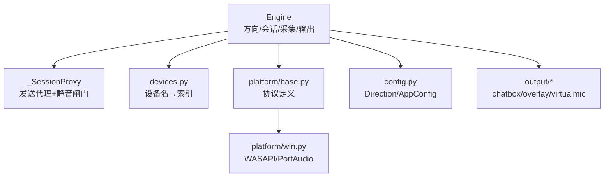
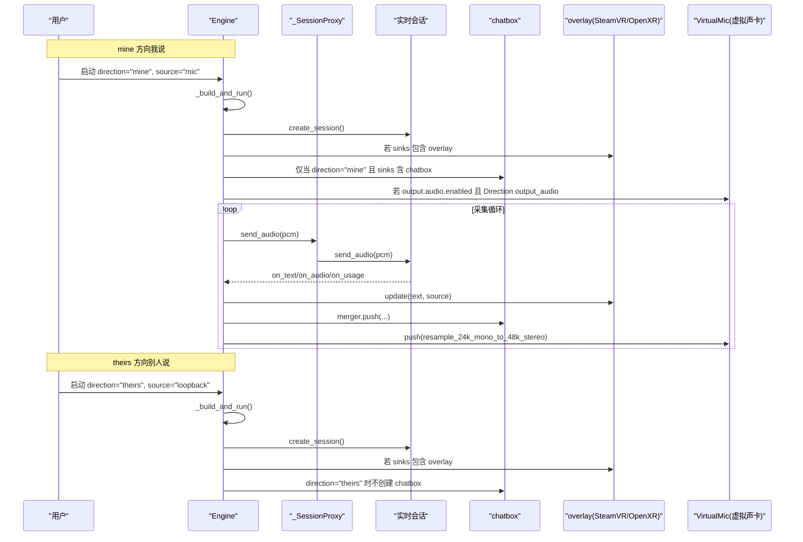
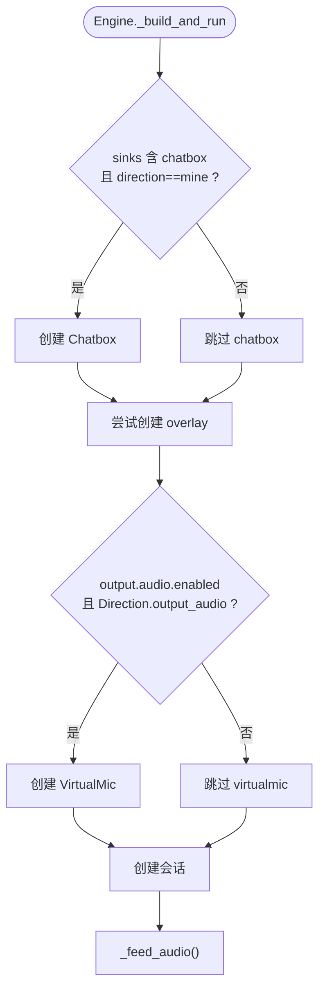
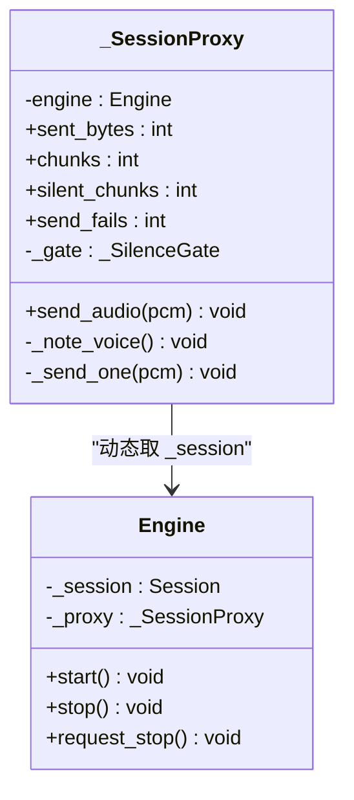
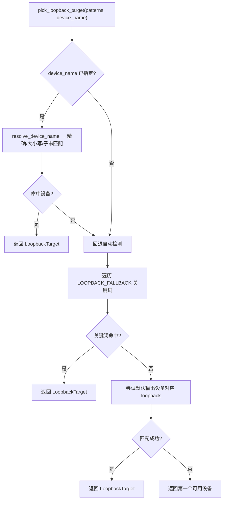
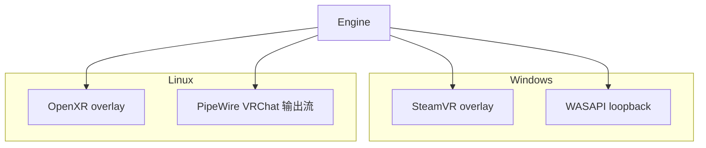
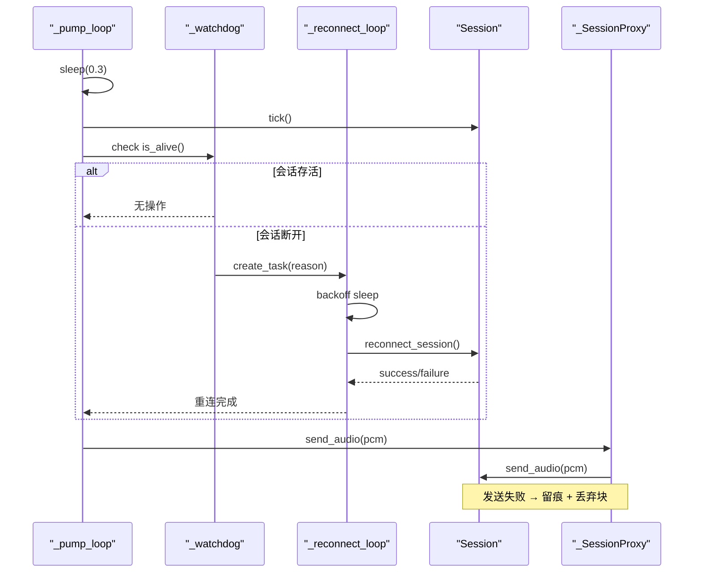
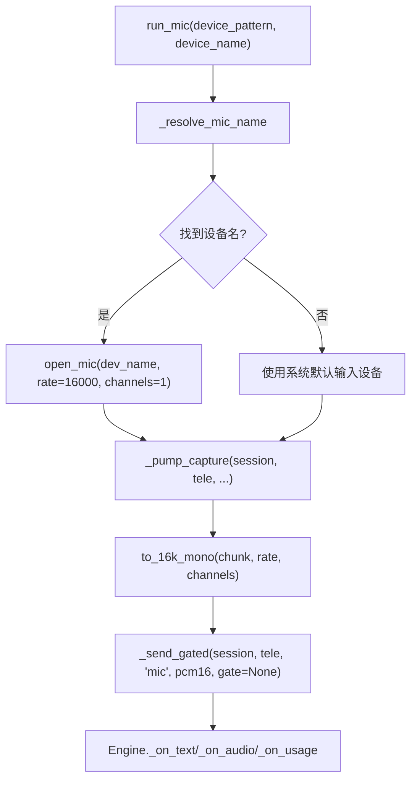
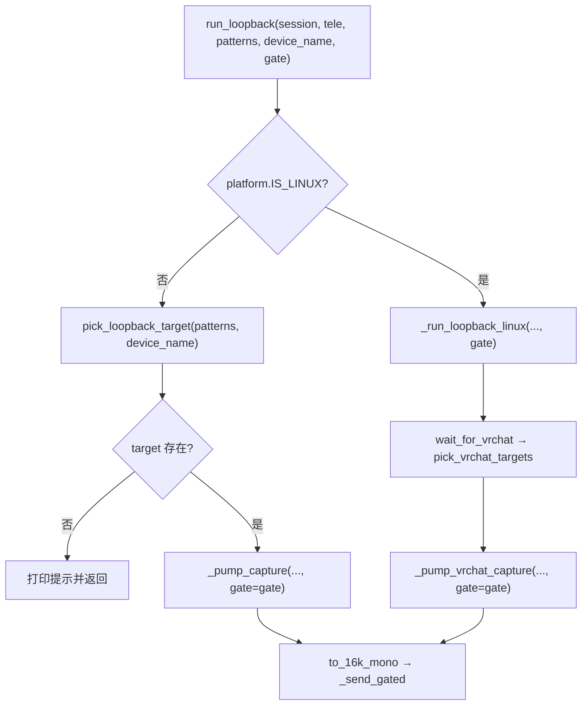
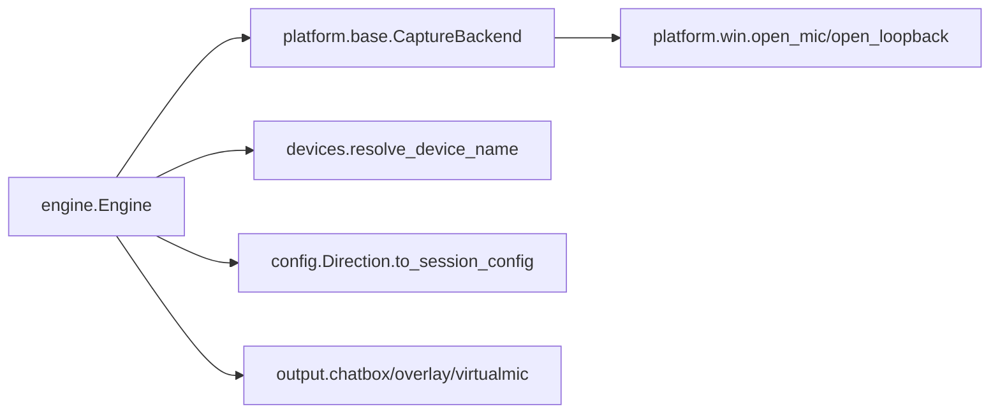

# 音频流方向处理

<cite>
**本文引用的文件**   
- [engine.py](file://vlt/engine.py)
- [devices.py](file://vlt/devices.py)
- [config.py](file://vlt/config.py)
- [base.py](file://vlt/platform/base.py)
- [win.py](file://vlt/platform/win.py)
- [README.md](file://README.md)
- [run_overlay.bat](file://run_overlay.bat)
- [app.py](file://vlt/app.py)
- [test_chatbox_direction.py](file://tests/test_chatbox_direction.py)
</cite>

## 目录
1. [引言](#引言)
2. [项目结构](#项目结构)
3. [核心组件](#核心组件)
4. [架构总览](#架构总览)
5. [详细组件分析](#详细组件分析)
6. [依赖关系分析](#依赖关系分析)
7. [性能与稳定性考虑](#性能与稳定性考虑)
8. [故障排查指南](#故障排查指南)
9. [结论](#结论)
10. [附录：配置与示例](#附录配置与示例)

## 引言
本文聚焦 VRChat 实时同传中的“音频流方向处理”，重点解释双向翻译模式下两条腿的差异：
- **mine（我说）**：麦克风输入 → 端到端语音翻译 → chatbox 气泡 / 手腕屏，可选把模型直出译音回灌进虚拟声卡。
- **theirs（别人说）**：VRChat 播放输出（系统声采集）→ 翻译 → 手腕屏或聊天区；默认不进气泡，也不走虚拟声卡。

文档同时说明 `_SessionProxy`、`LOOPBACK_FALLBACK`、SteamVR/OpenXR 集成、Linux 上 VRChat 音频流检测、采集循环的异步事件处理、错误恢复和资源管理，并给出可操作的音频路由配置和连接问题排查方法。

## 项目结构
从代码组织看，本项目围绕“引擎 + 平台抽象 + 设备解析 + 配置”展开：
- `vlt/engine.py`：引擎主逻辑、双向方向控制、采集循环、重连看门狗、统计诊断。
- `vlt/devices.py`：设备枚举与名称解析，屏蔽 sounddevice / PipeWire 差异。
- `vlt/platform/base.py`：平台协议定义（AudioSource/AudioSink/LoopbackTarget/CaptureBackend）。
- `vlt/platform/win.py`：Windows 下麦克风与 WASAPI loopback 的具体实现。
- `vlt/config.py`：YAML + 环境变量加载、Direction/AppConfig 构建、词库合并。
- `README.md`、`run_overlay.bat`、`vlt/app.py`：面向用户的入口与运行方式。



**图表来源**
- [engine.py:446-527](file://vlt/engine.py#L446-L527)
- [engine.py:356-444](file://vlt/engine.py#L356-L444)
- [devices.py:30-153](file://vlt/devices.py#L30-L153)
- [base.py:62-134](file://vlt/platform/base.py#L62-L134)
- [config.py:121-187](file://vlt/config.py#L121-L187)

**章节来源**
- [engine.py:1-40](file://vlt/engine.py#L1-L40)
- [devices.py:1-22](file://vlt/devices.py#L1-L22)
- [base.py:1-41](file://vlt/platform/base.py#L1-L41)
- [config.py:1-24](file://vlt/config.py#L1-L24)

## 核心组件
本节聚焦与“音频流方向”直接相关的核心对象与流程：

- **Engine**：按 direction/mine/theirs 组装会话、采集源、输出面（chatbox/overlay/virtualmic），负责生命周期、重连、统计。
- **_SessionProxy**：采集循环通过它转发 `send_audio`，动态取当前 session，自动适配重连后的新会话；同时收集发送字节、静音块、失败次数，并驱动长静音闸门。
- **LOOPBACK_FALLBACK**：Windows 上用于匹配系统声采集目标（WASAPI loopback）的回退关键词链。
- **设备解析 devices.py**：把用户配置的设备名解析为底层索引，支持精确匹配、大小写不敏感、子串匹配。
- **平台协议 base.py**：统一 AudioSource/AudioSink/LoopbackTarget/CaptureBackend，让 engine 不感知 Windows/Linux 差异。
- **配置 config.py**：Direction 决定 source/target 语言、是否输出音频、热词覆盖；AppConfig 汇总 session_base/output/capture 等段。

**章节来源**
- [engine.py:356-444](file://vlt/engine.py#L356-L444)
- [engine.py:446-527](file://vlt/engine.py#L446-L527)
- [engine.py:71-78](file://vlt/engine.py#L71-L78)
- [devices.py:30-153](file://vlt/devices.py#L30-L153)
- [base.py:62-134](file://vlt/platform/base.py#L62-L134)
- [config.py:121-187](file://vlt/config.py#L121-L187)

## 架构总览
下图展示“双向翻译模式”的整体数据流：mine 方向走麦克风，theirs 方向走 VRChat 播放输出；两者都进入同一个 Engine，但 sink 行为不同。



**图表来源**
- [engine.py:820-888](file://vlt/engine.py#L820-L888)
- [engine.py:1019-1040](file://vlt/engine.py#L1019-L1040)
- [engine.py:1059-1074](file://vlt/engine.py#L1059-L1074)
- [engine.py:1134-1151](file://vlt/engine.py#L1134-L1151)

## 详细组件分析

### 1. 双向方向与输入源选择
Engine 在构造时记录 direction/source/sinks，并在 `_build_and_run()` 中根据 direction 决定是否启用 chatbox、overlay、virtualmic。

- **mine 方向**：source 通常为 mic；chatbox 只在 sinks 包含 chatbox 且 direction == "mine" 时才创建。
- **theirs 方向**：source 通常为 loopback；chatbox 不会创建，译文只走 overlay 或下游事件。



**图表来源**
- [engine.py:820-888](file://vlt/engine.py#L820-L888)
- [engine.py:897-966](file://vlt/engine.py#L897-L966)
- [engine.py:968-994](file://vlt/engine.py#L968-L994)

**章节来源**
- [engine.py:446-527](file://vlt/engine.py#L446-L527)
- [engine.py:820-888](file://vlt/engine.py#L820-L888)
- [engine.py:624-627](file://vlt/engine.py#L624-L627)

### 2. _SessionProxy：音频发送代理、重连保护与统计
_SessionProxy 的核心职责有三点：
1. **动态转发 send_audio**：每次调用都从 Engine 取当前 session，避免采集循环持有旧 session 引用导致重连后继续发到死连接。
2. **静音与音量统计**：计算峰值判断 loud，累计 sent_bytes/chunks/silent_chunks/send_fails，并把“有人说话”上报给会话，帮助服务端 turn_detection 更快封句。
3. **长静音闸门**：连续静音超过阈值暂停上送，声音恢复时补发 preroll，防止丢句首。



**图表来源**
- [engine.py:356-444](file://vlt/engine.py#L356-L444)

**章节来源**
- [engine.py:356-444](file://vlt/engine.py#L356-L444)

### 3. LOOPBACK_FALLBACK：Windows 系统声采集目标选择策略
LOOPBACK_FALLBACK 是 Windows 上的关键词回退链，用于在用户未明确指定 loopback_device 时，从 WASAPI loopback 列表中挑选 VRChat 相关设备。

优先级顺序由 `pick_loopback_target` 决定：
1. 用户按名指定（resolve_device_name）。
2. LOOPBACK_FALLBACK 关键词命中。
3. 默认输出设备对应的那份 loopback。
4. 第一个可用设备（带留痕）。



**图表来源**
- [engine.py:71-78](file://vlt/engine.py#L71-L78)
- [engine.py:1586-1650](file://vlt/engine.py#L1586-L1650)
- [devices.py:105-153](file://vlt/devices.py#L105-L153)

**章节来源**
- [engine.py:71-78](file://vlt/engine.py#L71-L78)
- [engine.py:1586-1650](file://vlt/engine.py#L1586-L1650)
- [devices.py:105-153](file://vlt/devices.py#L105-L153)

### 4. VRChat 音频流的特殊处理：SteamVR、OpenXR 与跨平台
- **SteamVR overlay（Windows）**：Engine 通过 platform.create_wrist_overlay 创建 overlay；初始化失败不会拖垮翻译，只会禁用 overlay 并留痕。
- **OpenXR overlay（Linux）**：Linux 自建 OpenXR overlay（Monado/WiVRn），共享代码不出现后端名字。
- **VRChat 音频输出（Linux）**：不是抓默认 sink，而是定位 VRChat 的应用流节点；VRChat 退出则等待，重新启动后自动续采。



**图表来源**
- [engine.py:850-868](file://vlt/engine.py#L850-L868)
- [engine.py:1653-1690](file://vlt/engine.py#L1653-L1690)
- [base.py:1-41](file://vlt/platform/base.py#L1-L41)

**章节来源**
- [engine.py:850-868](file://vlt/engine.py#L850-L868)
- [engine.py:1653-1690](file://vlt/engine.py#L1653-L1690)
- [base.py:1-41](file://vlt/platform/base.py#L1-L41)

### 5. 音频流采集循环：异步事件、错误恢复与资源管理
Engine 的采集循环由 `_pump_loop` 驱动，每 0.3s 刷新 chatbox/overlay/session tick，并通过 `_watchdog` 自动重连。

- **mine 方向**：`run_mic` → `_pump_capture` → 平台层 open_mic。
- **theirs 方向**：`run_loopback` → `_pump_capture`（Windows）或 `_run_loopback_linux`（Linux）→ 多路混音 + 定期回查 VRChat 流。
- **错误恢复**：
  - 发送失败被 `_SessionProxy._send_one` 捕获，不计入静音统计，仅留痕并丢弃该块，靠看门狗重连。
  - 会话断开由 `_watchdog` → `_reconnect_loop` 触发带退避的重连。
  - 采集循环通过 stop_event 优雅退出，finally 中关闭 AudioSource。



**图表来源**
- [engine.py:1008-1018](file://vlt/engine.py#L1008-L1018)
- [engine.py:1290-1394](file://vlt/engine.py#L1290-L1394)
- [engine.py:1475-1496](file://vlt/engine.py#L1475-L1496)

**章节来源**
- [engine.py:1008-1018](file://vlt/engine.py#L1008-L1018)
- [engine.py:1290-1394](file://vlt/engine.py#L1290-L1394)
- [engine.py:1475-1496](file://vlt/engine.py#L1475-L1496)

### 6. 具体方向的处理流程示例

#### mine 方向（麦克风输入）
- 入口：`run_mic`。
- 设备解析：优先用配置的 mic_device，否则回退到系统默认输入设备。
- 采集格式：16kHz 单声道 s16le。
- 输出：chatbox（仅 mine）、overlay、可选 virtualmic（若 Direction.output_audio 且 output.audio.enabled）。



**图表来源**
- [engine.py:1404-1440](file://vlt/engine.py#L1404-L1440)
- [engine.py:1443-1496](file://vlt/engine.py#L1443-L1496)
- [engine.py:1059-1074](file://vlt/engine.py#L1059-L1074)

**章节来源**
- [engine.py:1404-1440](file://vlt/engine.py#L1404-L1440)
- [engine.py:1443-1496](file://vlt/engine.py#L1443-L1496)
- [engine.py:1059-1074](file://vlt/engine.py#L1059-L1074)

#### theirs 方向（系统音频输出）
- 入口：`run_loopback`。
- Windows：WASAPI loopback，目标由 `pick_loopback_target` 决定（用户指定 → LOOPBACK_FALLBACK → 默认输出 → 第一个）。
- Linux：等待 VRChat 输出流出现，逐路 pw-record 采集并混音。
- 输入门限：只对 theirs 方向生效，过滤远处小声玩家。



**图表来源**
- [engine.py:1762-1803](file://vlt/engine.py#L1762-L1803)
- [engine.py:1805-1879](file://vlt/engine.py#L1805-L1879)
- [engine.py:1586-1650](file://vlt/engine.py#L1586-L1650)

**章节来源**
- [engine.py:1762-1803](file://vlt/engine.py#L1762-L1803)
- [engine.py:1805-1879](file://vlt/engine.py#L1805-L1879)
- [engine.py:1586-1650](file://vlt/engine.py#L1586-L1650)

## 依赖关系分析
Engine 与平台层、设备层、配置层的耦合如下：



**图表来源**
- [engine.py:21-38](file://vlt/engine.py#L21-L38)
- [engine.py:446-527](file://vlt/engine.py#L446-L527)
- [base.py:116-134](file://vlt/platform/base.py#L116-L134)
- [win.py:389-422](file://vlt/platform/win.py#L389-L422)

**章节来源**
- [engine.py:21-38](file://vlt/engine.py#L21-L38)
- [engine.py:446-527](file://vlt/engine.py#L446-L527)
- [base.py:116-134](file://vlt/platform/base.py#L116-L134)
- [win.py:389-422](file://vlt/platform/win.py#L389-L422)

## 性能与稳定性考虑
- **静音闸门与输入门限**：
  - 长静音闸门（_SilenceGate）防止长时间静音喂模型导致 repeat 掉线。
  - 输入门限（_LevelGate）只对 theirs 方向生效，按 RMS 判响度，低于门限不上送，开闸时带回 preroll 防丢句首。
- **重复抑制**：本地检测连续最终译文高度雷同，抑制输出并主动重建会话。
- **重连看门狗**：会话断开后按退避序列重连，避免永久死锁。
- **虚拟声卡串行锁**：TTS 流式合成写入虚拟声卡时使用 asyncio.Lock，避免分片交错导致听感异常。

**章节来源**
- [engine.py:204-347](file://vlt/engine.py#L204-L347)
- [engine.py:1079-1133](file://vlt/engine.py#L1079-L1133)
- [engine.py:1253-1286](file://vlt/engine.py#L1253-L1286)
- [engine.py:1290-1394](file://vlt/engine.py#L1290-L1394)

## 故障排查指南
常见连接与音频问题可按以下路径排查：

1. **theirs 方向没有声音**
   - 检查 loopback 设备是否被正确选择：日志中应出现 `[loopback] 采集端点...`。
   - 若 Windows 未命中用户指定设备，会回退到 LOOPBACK_FALLBACK 或默认输出设备。
   - Linux 上会显示“等待 VRChat 音频输出”，需确保 VRChat 已启动。

2. **chatbox 没有输出**
   - 确认 direction 是否为 "mine"，且 sinks 包含 "chatbox"。
   - theirs 方向即使 sinks 包含 chatbox，也不会创建 chatbox。

3. **虚拟声卡没有声音**
   - 确认 output.audio.enabled 为 True，且 Direction.output_audio 为 True。
   - Windows 需要安装虚拟声卡（VoiceMeeter/VB-Cable），Linux 程序会自动声明虚拟麦克风。

4. **会话频繁断线**
   - 查看断线诊断输出：包括发送音频时长、静音比例、最近译文本、服务端事件。
   - 检查是否因长静音或噪声导致模型 repeat，必要时调整 silence_gate_* 参数。

**章节来源**
- [engine.py:1586-1650](file://vlt/engine.py#L1586-L1650)
- [engine.py:1693-1712](file://vlt/engine.py#L1693-L1712)
- [engine.py:827-833](file://vlt/engine.py#L827-L833)
- [engine.py:1307-1361](file://vlt/engine.py#L1307-L1361)

## 结论
VRChat 实时同传的音频流方向处理以 Engine 为核心，通过 direction 区分 mine/theirs 两条腿：
- mine 方向走麦克风，支持 chatbox、overlay、虚拟声卡。
- theirs 方向走 VRChat 播放输出，支持 overlay，默认不走 chatbox，也不走虚拟声卡。
_SessionProxy 提供重连安全与统计，LOOPBACK_FALLBACK 提供 Windows 设备回退，平台抽象屏蔽 SteamVR/OpenXR 与 WASAPI/PipeWire 差异。采集循环通过异步事件、静音闸门、输入门限、重复抑制和看门狗重连，保证稳定运行。

## 附录：配置与示例

### 音频路由配置要点
- **capture.mic_device**：麦克风设备名，空字符串表示自动检测。
- **capture.loopback_device**：theirs 方向采集端点，Windows 上为 WASAPI loopback 设备名，Linux 上为 VRChat 输出 sink（实际由程序自动等待）。
- **capture.gate_enabled/gate_db/gate_hold_ms/gate_preroll_ms**：输入门限参数，只对 theirs 方向生效。
- **output.audio.enabled**：是否开启译音输出。
- **directions.<name>.output_audio**：某条方向是否允许输出音频到虚拟声卡。

**章节来源**
- [config.py:348-377](file://vlt/config.py#L348-L377)
- [engine.py:870-966](file://vlt/engine.py#L870-L966)

### 运行示例
- **theirs 方向 + overlay**：
  ```bat
  .venv\Scripts\python.exe -m vlt.app --direction theirs --loopback --sink overlay
  ```
- **mine 方向 + chatbox**：
  ```bat
  .venv\Scripts\python.exe -m vlt.app --direction mine --mic --sink chatbox
  ```

**章节来源**
- [run_overlay.bat:1-14](file://run_overlay.bat#L1-L14)
- [app.py:134-149](file://vlt/app.py#L134-L149)