# 测试框架

<cite>
**本文引用的文件**   
- [ci.yml](file://.github/workflows/ci.yml)
- [test_engine.py](file://tests/test_engine.py)
- [test_config_save.py](file://tests/test_config_save.py)
- [test_devices.py](file://tests/test_devices.py)
- [test_i18n.py](file://tests/test_i18n.py)
- [test_update_check.py](file://tests/test_update_check.py)
- [test_wrap.py](file://tests/test_wrap.py)
- [test_virtualmic.py](file://tests/test_virtualmic.py)
- [test_reconnect.py](file://tests/test_reconnect.py)
- [config_io.py](file://vlt/config_io.py)
- [update_check.py](file://vlt/update_check.py)
</cite>

## 目录
1. [简介](#简介)
2. [项目结构](#项目结构)
3. [核心组件](#核心组件)
4. [架构总览](#架构总览)
5. [详细组件分析](#详细组件分析)
6. [依赖关系分析](#依赖关系分析)
7. [性能与稳定性考量](#性能与稳定性考量)
8. [故障排查指南](#故障排查指南)
9. [结论](#结论)
10. [附录：编写高质量测试用例的规范](#附录编写高质量测试用例的规范)

## 简介
本仓库采用“离线优先”的测试策略：所有 CI 可运行的测试不得依赖真实 API Key、麦克风、VRChat/SteamVR 或网络。对外部依赖通过假对象、桩函数、环境变量隔离和临时配置来模拟；对异步流程使用 asyncio 驱动；对状态验证通过事件回调、内部属性断言以及输出产物校验完成。覆盖率由 coverage 在 CI 中累积并输出摘要，作为非阻断质量门禁。

## 项目结构
测试代码集中在 tests 目录，按功能域组织为独立脚本，每个脚本通常包含一组相关用例和一个可选的 main 入口，便于直接运行或交由 pytest/unittest 发现。关键测试文件与其职责如下：

- test_engine.py：Engine 生命周期、语言切换与 PCM dry-run（无头）测试
- test_config_save.py：GUI 保存配置时注释与键顺序保护、坏配置恢复
- test_devices.py：设备枚举与名称解析（注入假设备列表）
- test_i18n.py：词表完整性、格式化/回落、系统语言探测委派、英文界面无汉字守卫
- test_update_check.py：更新检查全链路离线测试（HTTP 层用假 opener）
- test_wrap.py：文本换行与渲染回归（整词保护、CJK 逐字断行）
- test_virtualmic.py：虚拟声卡纯逻辑测试（双平台打桩纪律）
- test_reconnect.py：断线自愈与重连、黑匣子诊断

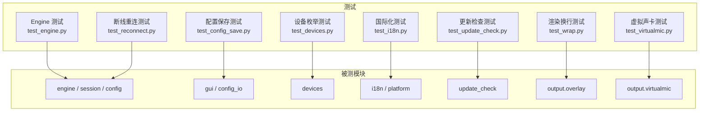

图表来源
- [test_engine.py:1-95](file://tests/test_engine.py#L1-L95)
- [test_config_save.py:1-249](file://tests/test_config_save.py#L1-L249)
- [test_devices.py:1-180](file://tests/test_devices.py#L1-L180)
- [test_i18n.py:1-656](file://tests/test_i18n.py#L1-L656)
- [test_update_check.py:1-876](file://tests/test_update_check.py#L1-L876)
- [test_wrap.py:1-133](file://tests/test_wrap.py#L1-L133)
- [test_virtualmic.py:1-501](file://tests/test_virtualmic.py#L1-L501)
- [test_reconnect.py:1-374](file://tests/test_reconnect.py#L1-L374)

章节来源
- [test_engine.py:1-95](file://tests/test_engine.py#L1-L95)
- [test_config_save.py:1-249](file://tests/test_config_save.py#L1-L249)
- [test_devices.py:1-180](file://tests/test_devices.py#L1-L180)
- [test_i18n.py:1-656](file://tests/test_i18n.py#L1-L656)
- [test_update_check.py:1-876](file://tests/test_update_check.py#L1-L876)
- [test_wrap.py:1-133](file://tests/test_wrap.py#L1-L133)
- [test_virtualmic.py:1-501](file://tests/test_virtualmic.py#L1-L501)
- [test_reconnect.py:1-374](file://tests/test_reconnect.py#L1-L374)

## 核心组件
- 单元测试架构设计
  - 以功能域划分测试文件，避免跨域耦合；每个用例聚焦单一行为或边界条件。
  - 通过 sys.path.insert 将仓库根加入导入路径，保证测试可在任意工作目录下运行。
  - 多数用例可直接 python 执行，提供 main 聚合入口，便于本地快速回归。
- 命名规范
  - 测试文件以 test_ 前缀命名，类名以 Test 开头，方法以 test_ 开头，遵循 unittest 约定。
  - 辅助函数以下划线前缀命名，如 _make_cfg、_stub_audio_out、_temp_config 等。
- 模拟与桩
  - HTTP 层：FakeResp/FakeOpener/MapOpener 替换 urllib 调用，完全离线。
  - 音频/平台：同时桩 Windows 侧 pick_output_device/VirtualMic 与 Linux 侧 platform.open_audio_out，防止真机创建虚拟声卡。
  - GUI/i18n：临时 config.yaml + 钉死 detect_system_language，避免系统语言影响。
- 异步测试
  - 使用 asyncio.run 驱动协程；对看门狗、会话代理、事件处理进行断言。
- 状态验证
  - 通过 EngineEvents 回调收集 on_text/on_status；通过内部属性（如 virtualmic.is_opened、session.is_alive）断言；通过输出文件/日志留痕断言。

章节来源
- [test_engine.py:1-95](file://tests/test_engine.py#L1-L95)
- [test_virtualmic.py:1-501](file://tests/test_virtualmic.py#L1-L501)
- [test_i18n.py:1-656](file://tests/test_i18n.py#L1-L656)
- [test_update_check.py:1-876](file://tests/test_update_check.py#L1-L876)
- [test_reconnect.py:1-374](file://tests/test_reconnect.py#L1-L374)

## 架构总览
CI 流水线负责语法检查、静态检查、凭据扫描、全部离线测试（含覆盖率摘要），并在 Windows/Linux 两端分别执行。Linux 端使用 xvfb 运行 Tk 界面测试，安装中日韩字体以满足离线渲染需求。覆盖率数据在一次 run 中累积，不设置阈值但始终打印缺失行以便定位。

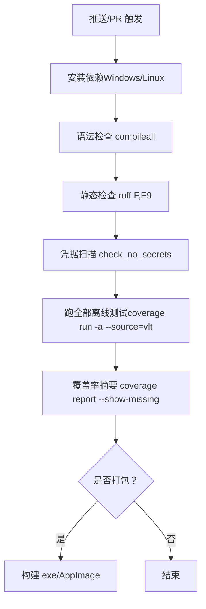

图表来源
- [ci.yml:22-91](file://.github/workflows/ci.yml#L22-L91)
- [ci.yml:147-241](file://.github/workflows/ci.yml#L147-L241)

章节来源
- [ci.yml:22-91](file://.github/workflows/ci.yml#L22-L91)
- [ci.yml:147-241](file://.github/workflows/ci.yml#L147-L241)

## 详细组件分析

### Engine 与 Session 测试（生命周期、语言切换、dry-run）
- 目标：验证 Engine 构造、stop 幂等、set_languages 在无会话时的行为，以及 PCM dry-run 完整生命周期。
- 关键点：
  - 通过 EngineEvents 回调捕获 on_text/on_status，验证输出。
  - 使用 pcm 输入源进行 dry-run，无需真实采集。
  - 预算检查仅在需要重建会话时生效，无会话时只改配置。

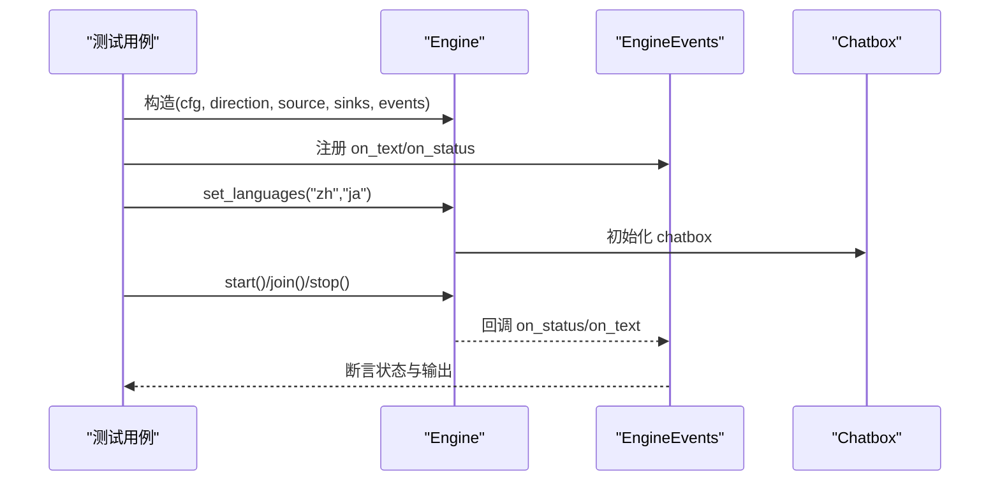

图表来源
- [test_engine.py:19-84](file://tests/test_engine.py#L19-L84)

章节来源
- [test_engine.py:1-95](file://tests/test_engine.py#L1-L95)

### 配置保存与 YAML 就地写入（注释与键顺序保护）
- 目标：确保 GUI 保存配置不会破坏 config.yaml 的注释与键顺序；非法 YAML 被拒绝；坏配置自动备份并重建。
- 关键点：
  - 使用 _yaml_set_in_text/_yaml_set_or_create/_write_config_text 实现就地修改与写前校验。
  - 通过 n_comments/top_keys 断言注释行数与顶层键顺序不变。
  - 覆盖块序列值替换、深层缩进注释保留、非法 YAML 拦截、坏配置恢复。

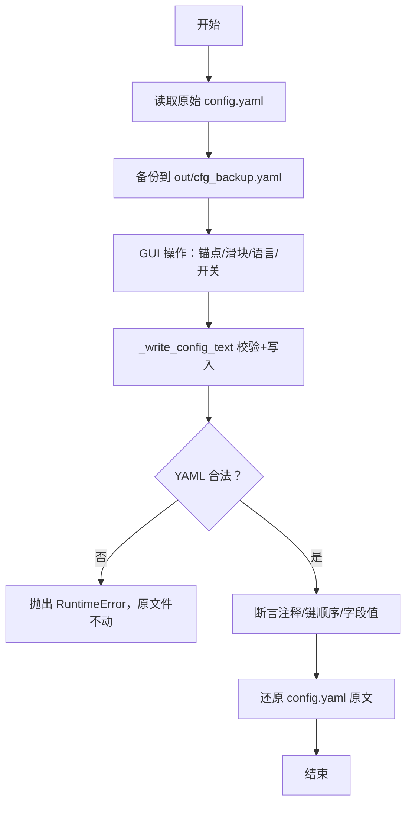

图表来源
- [test_config_save.py:43-147](file://tests/test_config_save.py#L43-L147)
- [config_io.py:273-283](file://vlt/config_io.py#L273-L283)

章节来源
- [test_config_save.py:1-249](file://tests/test_config_save.py#L1-L249)
- [config_io.py:273-301](file://vlt/config_io.py#L273-L301)

### 设备枚举与名称解析（注入假设备）
- 目标：验证 resolve_device_name/format_device_display/枚举函数在不同匹配模式下的行为。
- 关键点：
  - 使用 FAKE_SD_DEVICES/FAKE_LOOPBACK_DEVICES 注入假设备列表，无需真实硬件。
  - 覆盖大小写不敏感、子串匹配、特殊字符、空输入、loopback 匹配等场景。

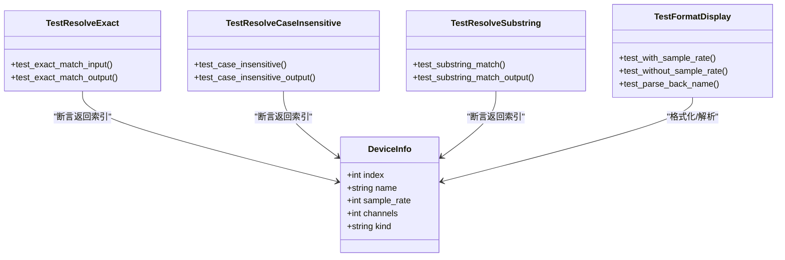

图表来源
- [test_devices.py:37-141](file://tests/test_devices.py#L37-L141)

章节来源
- [test_devices.py:1-180](file://tests/test_devices.py#L1-L180)

### 国际化（i18n）：词表完整性、格式化/回落、系统语言委派、英文界面无汉字
- 目标：机械守卫扫描 t("字面量")，确保每套词表齐全；格式化失败不抛异常；未知 key 回落中文；系统语言探测委派给 platform.detect_ui_language；英文界面下无汉字。
- 关键点：
  - AST 扫描 vlt/**/*.py 中的 t() 调用，对比 en/ja/ko/ru 词表 STRINGS。
  - normalize_language 容错；available_languages 固定顺序与母语写法。
  - 使用临时 config.yaml 起真窗口，递归遍历控件 text/title，断言书写系统。
  - 方向下拉的语言名必须翻译且可反查语言码。

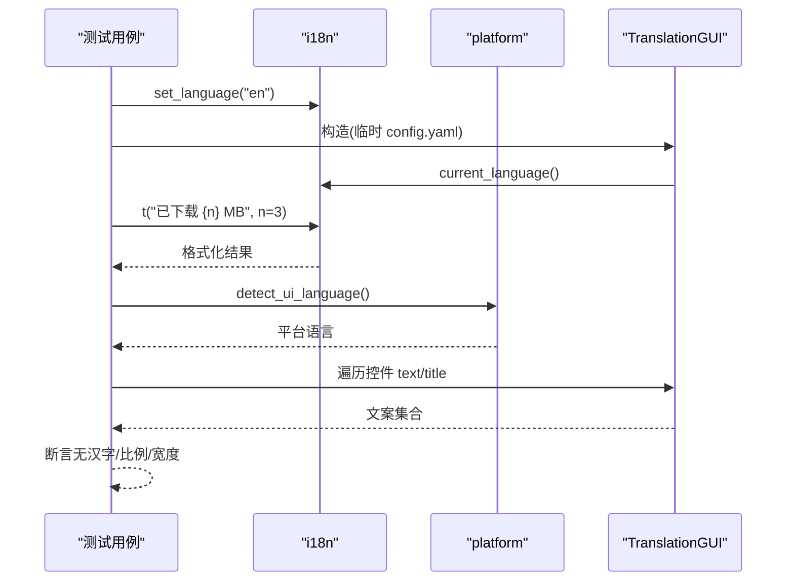

图表来源
- [test_i18n.py:119-173](file://tests/test_i18n.py#L119-L173)
- [test_i18n.py:178-241](file://tests/test_i18n.py#L178-L241)
- [test_i18n.py:302-461](file://tests/test_i18n.py#L302-L461)
- [test_i18n.py:467-566](file://tests/test_i18n.py#L467-L566)

章节来源
- [test_i18n.py:1-656](file://tests/test_i18n.py#L1-L656)

### 更新检查（update_check）：离线测试全链路
- 目标：版本解析、拉取 Release、忽略列表读写、决策入口、下载+SHA256+白名单、运行形态判定、AppImage 安装、bat 生成、pending 残留清理。
- 关键点：
  - FakeResp/FakeOpener/MapOpener 替换 _opener，全程离线。
  - 断言 User-Agent、限流/断网错误提示、digest/sums 兜底。
  - update_mode/can_self_update/asset_name_for/update_target_path 多形态判定。
  - install_appimage 在 POSIX/Windows 的行为差异与权限检查。
  - build_updater_bat 生成带重试与清理变量的 bat 脚本。

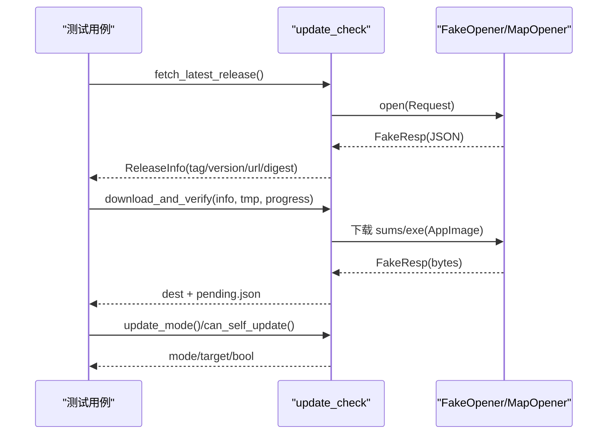

图表来源
- [test_update_check.py:42-91](file://tests/test_update_check.py#L42-L91)
- [test_update_check.py:147-235](file://tests/test_update_check.py#L147-L235)
- [test_update_check.py:342-453](file://tests/test_update_check.py#L342-L453)
- [test_update_check.py:484-564](file://tests/test_update_check.py#L484-L564)
- [test_update_check.py:567-633](file://tests/test_update_check.py#L567-L633)
- [test_update_check.py:639-692](file://tests/test_update_check.py#L639-L692)

章节来源
- [test_update_check.py:1-876](file://tests/test_update_check.py#L1-L876)
- [update_check.py:443-479](file://vlt/update_check.py#L443-L479)

### 渲染换行（wrap）：整词保护与 CJK 逐字断行
- 目标：拉丁/西里尔/希腊/韩文整词保护；中文避头尾；CJK 逐字断行；超长单词硬切；渲染尺寸正确。
- 关键点：
  - 独立于被测实现的 _is_cjk_char/_words_of 抽词，避免实现退化导致测试失效。
  - 断言每行长度不超过 MAX_W；render_panel 尺寸与 OverlayConfig.size_px 一致。

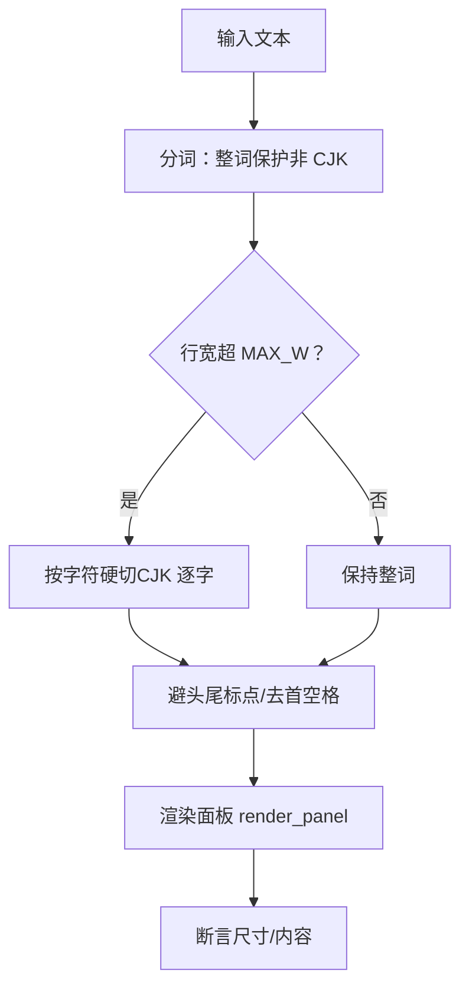

图表来源
- [test_wrap.py:24-46](file://tests/test_wrap.py#L24-L46)
- [test_wrap.py:70-128](file://tests/test_wrap.py#L70-L128)

章节来源
- [test_wrap.py:1-133](file://tests/test_wrap.py#L1-L133)

### 虚拟声卡（VirtualMic）：纯逻辑与双平台打桩
- 目标：采样率转换、设备选择、缓冲溢出策略、短译音兜底、打开成功/失败分支、引擎句尾标记。
- 关键点：
  - _stub_audio_out 同时桩 Windows 与 Linux 侧，防止真机创建虚拟声卡。
  - 使用真实类的子类仅替换 open()，暴露属性名写错等回归。
  - 断言 push/end_sentence/close 行为与缓冲上限、正在播放句子不被丢弃。

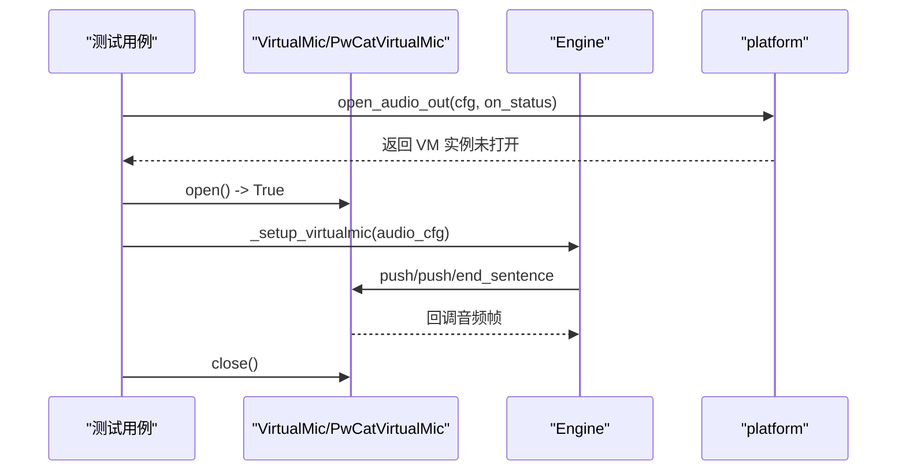

图表来源
- [test_virtualmic.py:34-57](file://tests/test_virtualmic.py#L34-L57)
- [test_virtualmic.py:244-319](file://tests/test_virtualmic.py#L244-L319)
- [test_virtualmic.py:413-480](file://tests/test_virtualmic.py#L413-L480)

章节来源
- [test_virtualmic.py:1-501](file://tests/test_virtualmic.py#L1-L501)

### 断线重连（reconnect）：看门狗与会话代理
- 目标：会话不健康自动重连；代理转发到当前会话；发送失败不死循环；断线黑匣子；致命 error 主动放弃。
- 关键点：
  - _FakeSession 可控 alive/fail_reason/received/closed。
  - _watchdog 安排重连任务；_proxy.send_audio 吞掉单次失败并计数。
  - is_fatal_server_error 分类矩阵；_abort_on_fatal 幂等与事件循环外安全。

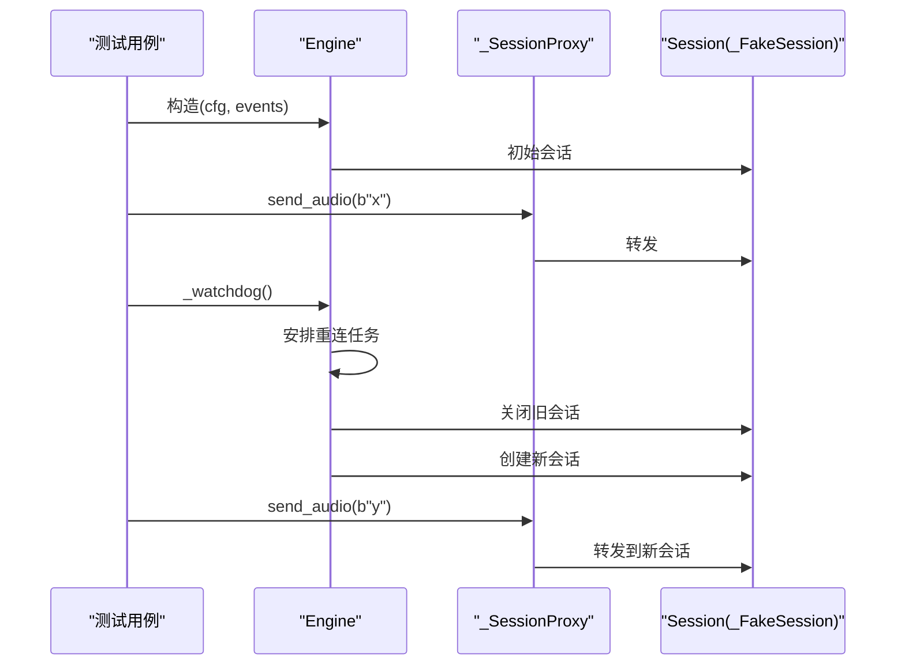

图表来源
- [test_reconnect.py:68-87](file://tests/test_reconnect.py#L68-L87)
- [test_reconnect.py:90-126](file://tests/test_reconnect.py#L90-L126)
- [test_reconnect.py:201-251](file://tests/test_reconnect.py#L201-L251)
- [test_reconnect.py:257-328](file://tests/test_reconnect.py#L257-L328)

章节来源
- [test_reconnect.py:1-374](file://tests/test_reconnect.py#L1-L374)

## 依赖关系分析
- 测试与模块耦合
  - Engine 测试依赖 config/engine/session；虚拟声卡测试依赖 output.virtualmic 与 platform；更新检查测试依赖 update_check；国际化测试依赖 i18n/platform/gui。
- 外部依赖模拟
  - HTTP：FakeResp/FakeOpener/MapOpener 替代 urllib.request。
  - 音频：Windows 桩 pick_output_device/VirtualMic；Linux 桩 platform.open_audio_out。
  - GUI：临时 config.yaml + 钉死 detect_system_language。
- 潜在循环依赖
  - 测试通过 sys.path.insert 引入 vlt，避免相对导入导致的循环；模块间通过明确接口（EngineEvents、ReleaseInfo、DeviceInfo）解耦。

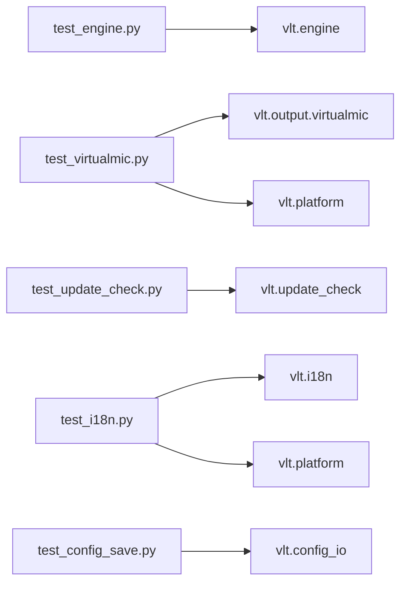

图表来源
- [test_engine.py:1-95](file://tests/test_engine.py#L1-L95)
- [test_virtualmic.py:1-501](file://tests/test_virtualmic.py#L1-L501)
- [test_update_check.py:1-876](file://tests/test_update_check.py#L1-L876)
- [test_i18n.py:1-656](file://tests/test_i18n.py#L1-L656)
- [test_config_save.py:1-249](file://tests/test_config_save.py#L1-L249)

章节来源
- [test_engine.py:1-95](file://tests/test_engine.py#L1-L95)
- [test_virtualmic.py:1-501](file://tests/test_virtualmic.py#L1-L501)
- [test_update_check.py:1-876](file://tests/test_update_check.py#L1-L876)
- [test_i18n.py:1-656](file://tests/test_i18n.py#L1-L656)
- [test_config_save.py:1-249](file://tests/test_config_save.py#L1-L249)

## 性能与稳定性考量
- 测试执行效率
  - CI 中一次性 coverage run -a 累积覆盖率，避免重复跑测。
  - 跳过需要真实 API Key 的用例（如 test_engine.py 在 CI 中被显式跳过），减少不稳定因素。
- 稳定性保障
  - 静态检查（ruff F,E9）阻断 NameError 等静默降级问题。
  - 凭据扫描防止 key 进入历史。
  - 平台隔离断言（Windows 产物不含 Linux 独占实现）。

章节来源
- [ci.yml:45-91](file://.github/workflows/ci.yml#L45-L91)
- [ci.yml:177-241](file://.github/workflows/ci.yml#L177-L241)

## 故障排查指南
- 常见问题与定位
  - 配置保存后注释丢失/键顺序变化：检查 _yaml_set_in_text/_yaml_set_or_create 是否误删深层注释；确认 _write_config_text 校验通过。
  - 英文界面出现汉字：检查 t() 调用是否遗漏词条；确认 UI 控件 text/title 未被排除路径漏扫。
  - 虚拟声卡未打开：确认双平台桩均生效；查看 on_status(error) 消息；检查设备匹配回退链。
  - 更新检查失败：检查 FakeOpener 脚本顺序；确认 digest/sums 存在其一；检查白名单与重定向守卫。
  - 断线未重连：查看 _watchdog 是否安排重连；确认 _proxy.send_fails 计数；检查 fatal_reason/fail_reason。
- 建议
  - 新增外部依赖时，优先提供桩/替身；对异步流程使用 asyncio.run 驱动；对状态变更通过回调/内部属性断言。

章节来源
- [test_config_save.py:150-244](file://tests/test_config_save.py#L150-L244)
- [test_i18n.py:119-173](file://tests/test_i18n.py#L119-L173)
- [test_virtualmic.py:163-205](file://tests/test_virtualmic.py#L163-L205)
- [test_update_check.py:147-235](file://tests/test_update_check.py#L147-L235)
- [test_reconnect.py:201-251](file://tests/test_reconnect.py#L201-L251)

## 结论
该测试框架以“离线优先、严格桩化、状态可观测”为核心原则，覆盖了引擎生命周期、配置持久化、设备枚举、国际化、更新检查、渲染换行、虚拟声卡与断线重连等关键路径。CI 通过语法/静态检查、凭据扫描与覆盖率摘要形成多层质量门禁，确保在无人值守环境下仍能稳定回归。

## 附录：编写高质量测试用例的规范
- 组织结构
  - 按功能域拆分测试文件；每个用例聚焦单一行为；必要时提供 main 聚合入口。
- 命名规范
  - 测试文件 test_xxx.py；类 TestXxx；方法 test_xxx；辅助函数 _xxx。
- 模拟与桩
  - 外部依赖一律替换为假对象/桩函数；对平台相关逻辑需同时桩 Windows/Linux 两侧。
- 异步测试
  - 使用 asyncio.run 驱动；对看门狗/代理/事件处理进行断言；避免阻塞。
- 状态验证
  - 通过回调收集状态；断言内部属性；校验输出文件/日志留痕。
- 数据管理
  - 使用临时目录/临时配置文件；测试前后恢复环境；避免污染用户配置。
- 覆盖率与质量保证
  - 在 CI 中累积覆盖率并输出摘要；结合静态检查与凭据扫描形成门禁。
- 持续集成
  - 在 Windows/Linux 两端分别执行；Linux 使用 xvfb 运行 Tk；安装必要字体与运行时。