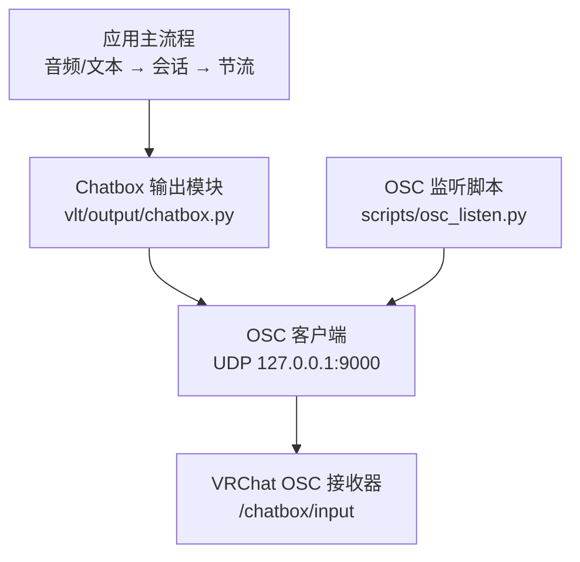
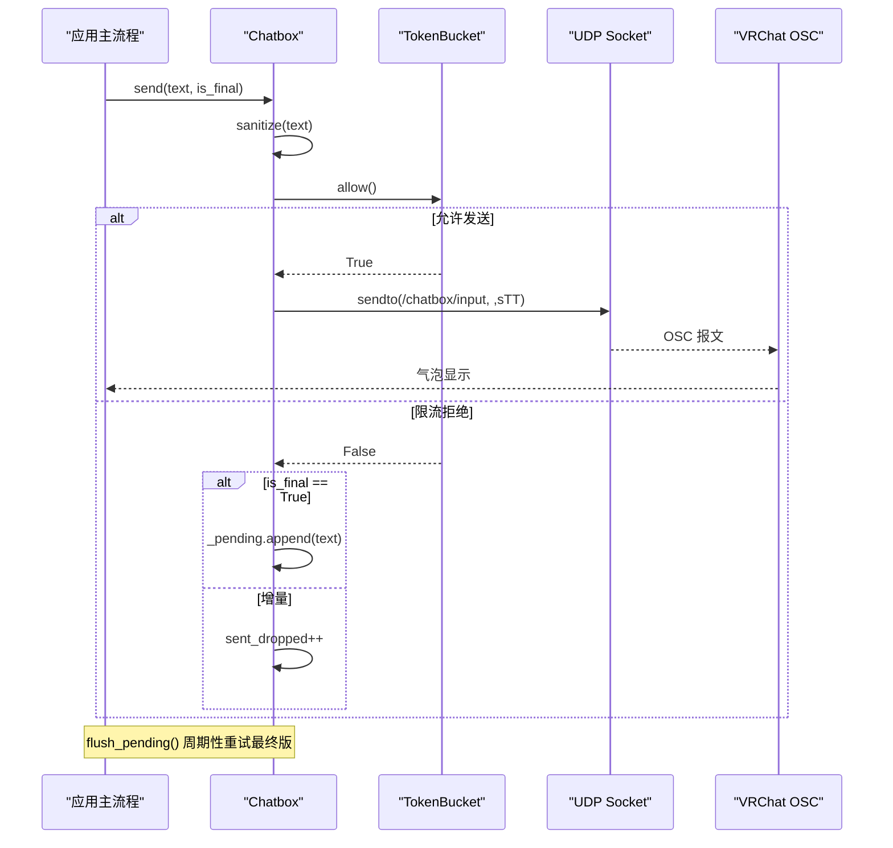
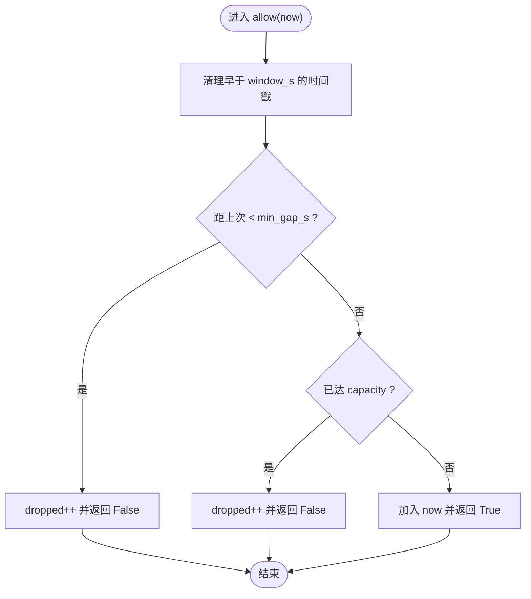
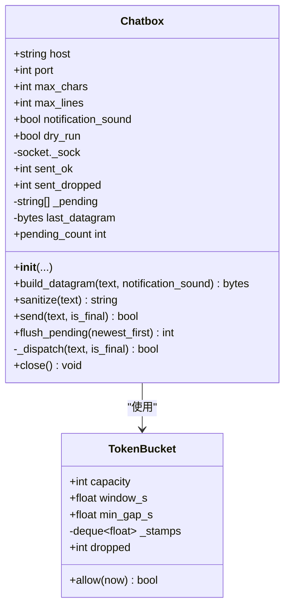
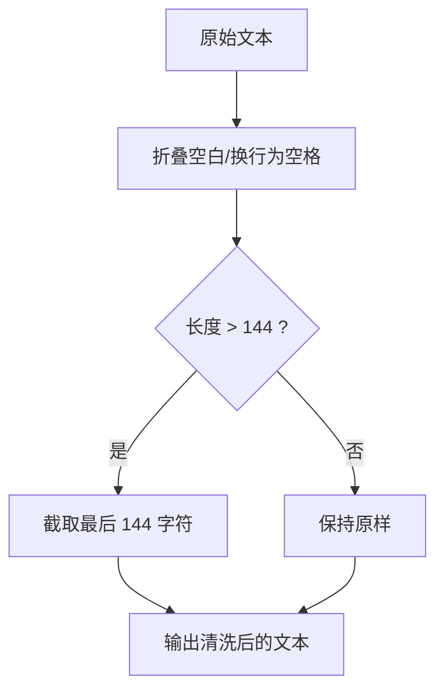
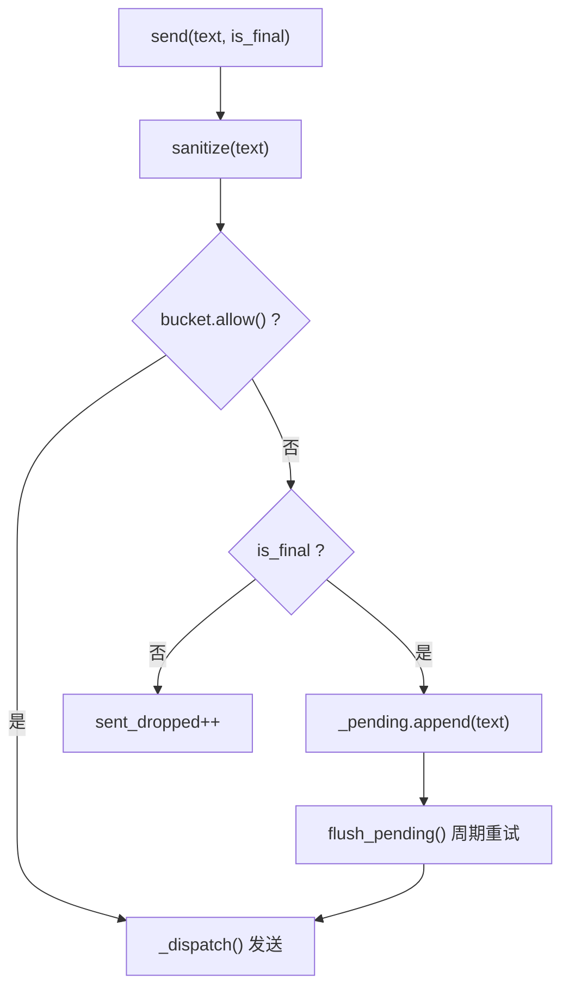
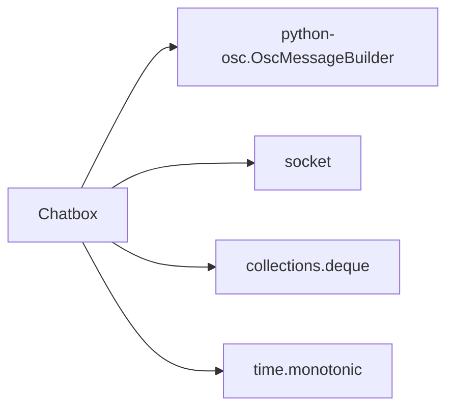

# Chatbox 气泡输出

<cite>
**本文引用的文件**   
- [vlt/output/chatbox.py](file://vlt/output/chatbox.py)
- [scripts/osc_listen.py](file://scripts/osc_listen.py)
- [config.example.yaml](file://config.example.yaml)
- [README.md](file://README.md)
- [docs/P1-实测结果.md](file://docs/P1-实测结果.md)
</cite>

## 目录
1. [引言](#引言)
2. [项目结构](#项目结构)
3. [核心组件](#核心组件)
4. [架构总览](#架构总览)
5. [详细组件分析](#详细组件分析)
6. [依赖关系分析](#依赖关系分析)
7. [性能与限流特性](#性能与限流特性)
8. [故障排查指南](#故障排查指南)
9. [结论](#结论)
10. [附录：配置项速查](#附录配置项速查)

## 引言
本文件聚焦 VRChat 实时同传项目中“我说 → chatbox 气泡”这条链路，系统性说明以下要点：
- VRChat OSC 协议通信机制，尤其是 `/chatbox/input` 端点的消息格式、参数类型与传输协议。
- TokenBucket 限流算法的实现原理：窗口控制 + 最小间隔 + 漏桶语义。
- 文本处理流程：字符限制（144）、行数限制（9）、空白折叠。
- 增量文本与最终版本的处理策略：待发送队列管理与优先级控制。
- 配置选项：主机地址、端口、通知声音开关等。
- 使用方式、错误处理与性能优化建议。

该能力在 README 中被明确列为默认开启的“我说 → chatbox 气泡”路径，首条增量立即上屏，之后按节奏刷新快照，句末必发最终版。

**章节来源**
- [README.md:28-36](file://README.md#L28-L36)

## 项目结构
与 chatbox 气泡输出直接相关的代码位于 `vlt/output/chatbox.py`；OSC 报文验证脚本位于 `scripts/osc_listen.py`；相关配置集中在 `config.example.yaml` 的 `chatbox:` 段。

**图表来源**
- [vlt/output/chatbox.py:1-137](file://vlt/output/chatbox.py#L1-L137)
- [scripts/osc_listen.py:1-82](file://scripts/osc_listen.py#L1-L82)
- [config.example.yaml:139-148](file://config.example.yaml#L139-L148)

**章节来源**
- [vlt/output/chatbox.py:1-137](file://vlt/output/chatbox.py#L1-L137)
- [scripts/osc_listen.py:1-82](file://scripts/osc_listen.py#L1-L82)
- [config.example.yaml:139-148](file://config.example.yaml#L139-L148)

## 核心组件
- `TokenBucket`：实现窗口容量 + 最小间隔的限流器。
- `Chatbox`：封装 OSC 报文构造、文本清洗、限流判断、发送与最终版补发队列。
- `osc_listen.py`：本地 UDP 监听器，用于离线验证 OSC 报文格式是否为 `,sTT`。

关键职责划分：
- `TokenBucket.allow()` 决定某次发送是否被允许。
- `Chatbox.sanitize()` 负责空白折叠与长度截断。
- `Chatbox.send()` 统一入口，区分增量与最终版的丢弃/入队策略。
- `Chatbox.flush_pending()` 由上层泵循环调用，优先保证最终版送达。

**章节来源**
- [vlt/output/chatbox.py:20-137](file://vlt/output/chatbox.py#L20-L137)
- [scripts/osc_listen.py:17-44](file://scripts/osc_listen.py#L17-L44)

## 架构总览
从输入到气泡的整体数据流如下：

**图表来源**
- [vlt/output/chatbox.py:20-137](file://vlt/output/chatbox.py#L20-L137)

## 详细组件分析

### TokenBucket 限流算法
TokenBucket 在本项目中以“窗口 + 最小间隔”的方式实现：
- 窗口控制：维护一个时间戳双端队列 `_stamps`，每次检查时清理掉超过 `window_s` 秒的记录。
- 容量限制：若当前窗口内记录数达到 `capacity`，则拒绝本次发送。
- 最小间隔：若距离上一次发送不足 `min_gap_s`，也拒绝，避免连发。
- 统计：`dropped` 累计被拒绝次数。

复杂度分析：
- 时间复杂度：每次 `allow()` 均摊 O(1)，因为只弹头尾元素。
- 空间复杂度：O(capacity)，最多保存窗口内的时间戳数量。

**图表来源**
- [vlt/output/chatbox.py:20-41](file://vlt/output/chatbox.py#L20-L41)

**章节来源**
- [vlt/output/chatbox.py:20-41](file://vlt/output/chatbox.py#L20-L41)

### Chatbox 类与 OSC 报文
`Chatbox` 负责：
- 初始化连接参数（host/port）、文本上限（max_chars/max_lines）、通知音开关、dry-run 模式。
- 构建 OSC 报文：目标地址为 `/chatbox/input`，typetags 必须为 `,sTT`，即字符串 + 两个布尔值。
- 文本清洗：折叠空白、截断至 144 字符。
- 发送逻辑：通过 UDP socket 发送到 `127.0.0.1:9000`。
- 最终版保障：被限流拒绝的最终版不丢弃，而是进入 `_pending` 队列，等待窗口释放后补发。

**图表来源**
- [vlt/output/chatbox.py:20-137](file://vlt/output/chatbox.py#L20-L137)

**章节来源**
- [vlt/output/chatbox.py:44-137](file://vlt/output/chatbox.py#L44-L137)

### VRChat OSC 协议通信机制
- 目标地址：`/chatbox/input`。
- 传输协议：UDP，默认目标 `127.0.0.1:9000`。
- 报文格式：
  - typetags 必须为 `,sTT`。
  - 第一个参数为字符串（气泡文本）。
  - 第二个参数为布尔值 `True`（sendImmediately）。
  - 第三个参数为布尔值（是否播放通知音效）。
- 重要约束：
  - 布尔参数必须走 OSC 类型标签 `T`/`F`，不能以 int32 payload 形式发送，否则 VRChat 会弹出输入框。
  - 单条消息上限为 144 字符，最多 9 行。
  - 限流为“漏桶 5 条 / 5 秒”，超发静默丢弃，无回告。

这些约束在代码注释与监听脚本中均有体现，并通过离线断言与真实抓包双重确认。

**章节来源**
- [vlt/output/chatbox.py:1-8](file://vlt/output/chatbox.py#L1-L8)
- [vlt/output/chatbox.py:64-72](file://vlt/output/chatbox.py#L64-L72)
- [scripts/osc_listen.py:17-44](file://scripts/osc_listen.py#L17-L44)
- [docs/P1-实测结果.md:29-42](file://docs/P1-实测结果.md#L29-L42)

### 文本处理流程
- 空白折叠：将所有空白和换行折叠为单个空格。
- 字符限制：超过 144 字符时截断尾部，确保不超过官方上限。
- 行数限制：由于已折叠空白，文本天然满足 9 行上限。

**图表来源**
- [vlt/output/chatbox.py:74-79](file://vlt/output/chatbox.py#L74-L79)

**章节来源**
- [vlt/output/chatbox.py:74-79](file://vlt/output/chatbox.py#L74-L79)

### 增量文本与最终版本处理策略
- 增量文本：若被限流拒绝，直接丢弃并计数 `sent_dropped`。
- 最终版本：若被限流拒绝，不丢弃，而是加入 `_pending` 队列，由上层泵循环调用 `flush_pending()` 重试发送。
- 优先级控制：`flush_pending(newest_first=True)` 支持“最新优先”，用于收尾阶段避免旧句子挤掉用户刚说完的句子。

**图表来源**
- [vlt/output/chatbox.py:81-110](file://vlt/output/chatbox.py#L81-L110)

**章节来源**
- [vlt/output/chatbox.py:81-110](file://vlt/output/chatbox.py#L81-L110)

### 实际使用示例（步骤式）
以下为使用 `Chatbox` 类发送消息的步骤说明（不包含具体代码内容）：
1. 实例化 `Chatbox`，传入主机地址、端口、字符上限、行数上限、通知音开关等。
2. 对增量文本调用 `send(text, is_final=False)`。
3. 对最终版本调用 `send(text, is_final=True)`。
4. 在上层泵循环中定期调用 `flush_pending(newest_first=True)`，确保最终版在限流窗口释放后补发。
5. 程序退出前调用 `close()` 关闭底层 socket。

可参考测试与文档中的端到端流程，结合 `--dry-run` 模式进行离线验证。

**章节来源**
- [vlt/output/chatbox.py:44-137](file://vlt/output/chatbox.py#L44-L137)
- [docs/P1-实测结果.md:74-87](file://docs/P1-实测结果.md#L74-L87)

## 依赖关系分析
- `python-osc`：用于构建 OSC 报文（`OscMessageBuilder`）。
- `socket`：用于 UDP 发送。
- `collections.deque`：用于 `TokenBucket` 的时间戳队列。
- `time.monotonic()`：用于稳定时间源。

**图表来源**
- [vlt/output/chatbox.py:11-15](file://vlt/output/chatbox.py#L11-L15)

**章节来源**
- [vlt/output/chatbox.py:11-15](file://vlt/output/chatbox.py#L11-L15)

## 性能与限流特性
- 限流策略：窗口容量 + 最小间隔，避免突发与连发。
- 丢包语义：增量可丢弃，最终版不可丢弃，采用队列重试。
- 网络开销：每条 OSC 报文包含字符串与两个布尔值，体积较小。
- 监控指标：`sent_ok`、`sent_dropped`、`bucket.dropped`、`pending_count`。

优化建议：
- 合理设置 `interval_s`、`bucket_capacity`、`bucket_window_s`、`min_gap_s`，使增量刷新节奏与模型输出匹配。
- 在收尾阶段使用 `newest_first=True` 提升用户体验。
- 使用 `--dry-run` 模式进行离线验证，减少不必要的网络请求。

**章节来源**
- [vlt/output/chatbox.py:20-137](file://vlt/output/chatbox.py#L20-L137)
- [docs/P1-实测结果.md:44-64](file://docs/P1-实测结果.md#L44-L64)

## 故障排查指南
常见问题与定位方法：
- 气泡不显示：
  - 检查 VRChat 是否运行且 OSC 已开启。
  - 使用 `scripts/osc_listen.py` 监听 127.0.0.1:9000，确认是否收到 `,sTT` 报文。
- 报文字符串异常或弹出输入框：
  - 确认布尔参数走类型标签 `T`/`F`，而非 int32 payload。
- 最终版未送达：
  - 检查 `_pending` 队列是否为空，确认 `flush_pending()` 被周期性调用。
- 限流频繁丢弃：
  - 调整 `bucket_capacity`、`bucket_window_s`、`min_gap_s`，或降低增量刷新频率。

**章节来源**
- [scripts/osc_listen.py:47-77](file://scripts/osc_listen.py#L47-L77)
- [docs/P1-实测结果.md:54-72](file://docs/P1-实测结果.md#L54-L72)

## 结论
Chatbox 气泡输出模块以简洁可靠的 OSC 报文格式与稳健的限流策略，实现了 VRChat 实时同传的“我说 → 气泡”链路。其核心优势包括：
- 严格遵循 VRChat OSC 协议约束（`,sTT`、布尔类型标签）。
- 明确的文本清洗规则（144 字符、9 行、空白折叠）。
- 完善的限流与最终版保障机制（窗口容量 + 最小间隔 + 待发送队列）。
- 易于扩展的配置项与清晰的错误处理。

在实际使用中，建议结合 `--dry-run` 与 `osc_listen.py` 进行离线验证，并根据场景调优限流参数，以获得更流畅的气泡体验。

## 附录：配置项速查
- `chatbox.host`：OSC 目标主机地址，默认 `127.0.0.1`。
- `chatbox.port`：VRChat OSC 接收端口，默认 `9000`。
- `chatbox.max_chars`：单条消息最大字符数，默认 `144`。
- `chatbox.max_lines`：最大行数，默认 `9`。
- `chatbox.interval_s`：增量刷新节奏，默认 `2.0`。
- `chatbox.bucket_capacity`：令牌桶容量，默认 `5`。
- `chatbox.bucket_window_s`：令牌桶窗口大小，默认 `5.0`。
- `chatbox.min_gap_s`：最小发送间隔，默认 `0.4`。
- `chatbox.notification_sound`：是否播放通知音效，默认 `true`。

**章节来源**
- [config.example.yaml:139-148](file://config.example.yaml#L139-L148)