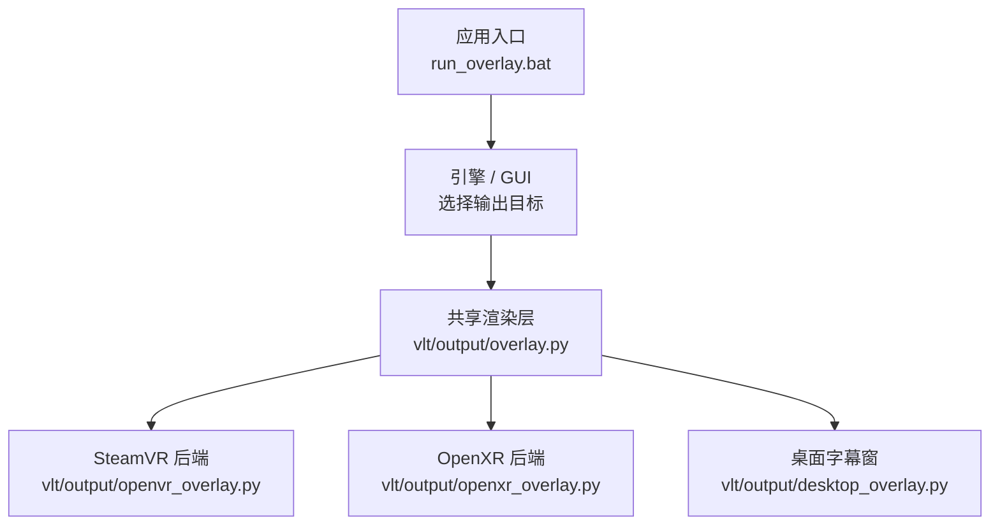
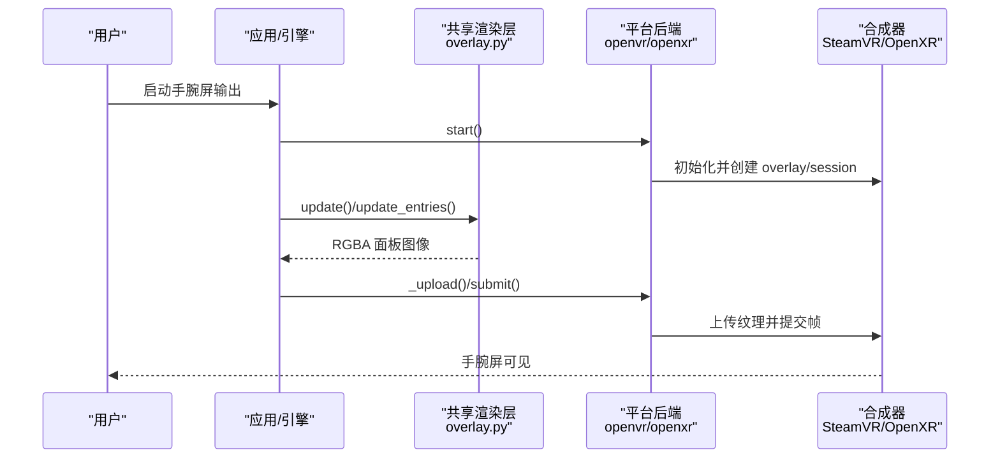
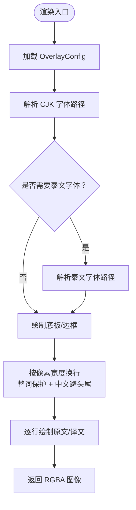
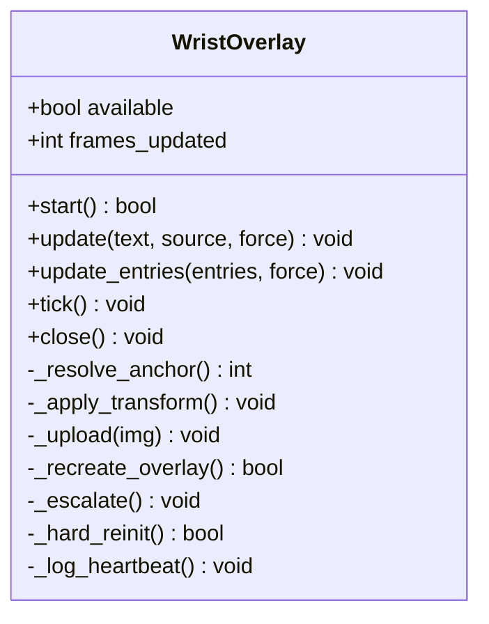
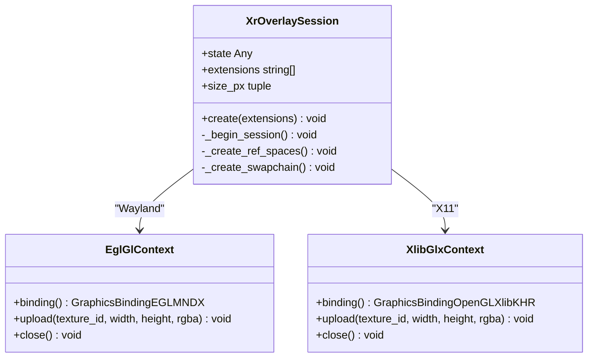
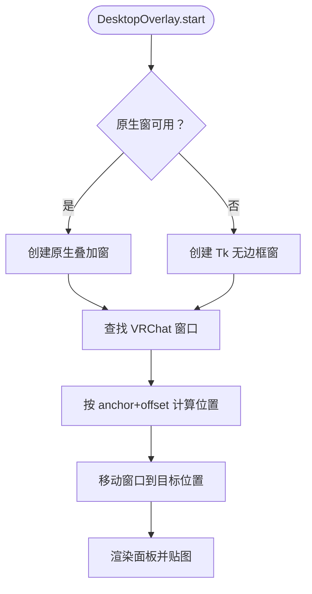
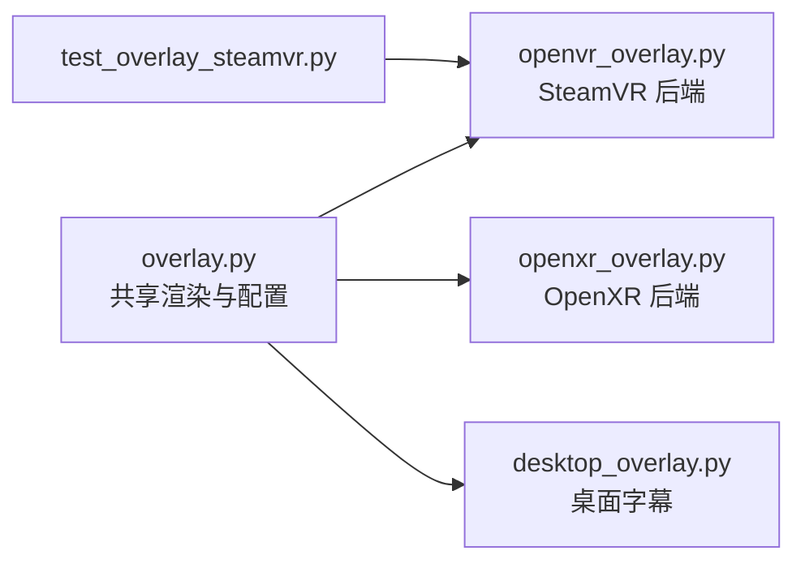

# VR 叠加显示

<cite>
**本文引用的文件**   
- [README.md](file://README.md)
- [config.example.yaml](file://config.example.yaml)
- [vlt/config.py](file://vlt/config.py)
- [vlt/output/overlay.py](file://vlt/output/overlay.py)
- [vlt/output/openvr_overlay.py](file://vlt/output/openvr_overlay.py)
- [vlt/output/openxr_overlay.py](file://vlt/output/openxr_overlay.py)
- [vlt/output/desktop_overlay.py](file://vlt/output/desktop_overlay.py)
- [tests/test_overlay_steamvr.py](file://tests/test_overlay_steamvr.py)
- [scripts/verify/verify_desktop_overlay.py](file://scripts/verify/verify_desktop_overlay.py)
- [run_overlay.bat](file://run_overlay.bat)
</cite>

## 目录
1. [简介](#简介)
2. [项目结构](#项目结构)
3. [核心组件](#核心组件)
4. [架构总览](#架构总览)
5. [详细组件分析](#详细组件分析)
6. [依赖关系分析](#依赖关系分析)
7. [性能与优化](#性能与优化)
8. [配置说明](#配置说明)
9. [使用示例](#使用示例)
10. [故障排查](#故障排查)
11. [结论](#结论)

## 简介
本仓库提供 VRChat 实时同传能力，其中“VR 手腕屏”是面向头显用户的叠加显示方案：把别人说的话翻译为中文后渲染成贴图，再贴到 SteamVR overlay（Windows）或 OpenXR overlay session（Linux）。它不依赖 Unity、XSOverlay 或 OVR Toolkit，而是纯 Python + Pillow 渲染，再通过平台后端把 RGBA 帧提交给合成器。

该功能同时支持：
- Windows：SteamVR overlay（`openvr.IVROverlay`）。
- Linux：自建 OpenXR overlay session（`XR_EXTX_overlay`），可连 Monado / WiVRn。
- 桌面模式：非头显用户也可用“桌面字幕窗”贴在 VRChat 窗口上。

**章节来源**
- [README.md:28-46](file://README.md#L28-L46)

## 项目结构
与 VR 叠加显示直接相关的代码集中在 `vlt/output/`：
- `overlay.py`：共享配置结构与文本渲染逻辑（字体解析、换行、配色、对话视图）。
- `openvr_overlay.py`：Windows 端 SteamVR 手腕屏后端。
- `openxr_overlay.py`：Linux 端 OpenXR 手腕屏后端。
- `desktop_overlay.py`：桌面字幕叠加窗（可选，用于 PC 玩家）。



**图表来源**
- [run_overlay.bat:1-14](file://run_overlay.bat#L1-L14)
- [vlt/output/overlay.py:1-16](file://vlt/output/overlay.py#L1-L16)
- [vlt/output/openvr_overlay.py:1-16](file://vlt/output/openvr_overlay.py#L1-L16)
- [vlt/output/openxr_overlay.py:1-35](file://vlt/output/openxr_overlay.py#L1-L35)
- [vlt/output/desktop_overlay.py:1-27](file://vlt/output/desktop_overlay.py#L1-L27)

**章节来源**
- [vlt/output/overlay.py:1-16](file://vlt/output/overlay.py#L1-L16)
- [vlt/output/openvr_overlay.py:1-16](file://vlt/output/openvr_overlay.py#L1-L16)
- [vlt/output/openxr_overlay.py:1-35](file://vlt/output/openxr_overlay.py#L1-L35)
- [vlt/output/desktop_overlay.py:1-27](file://vlt/output/desktop_overlay.py#L1-L27)

## 核心组件
- **共享渲染与配置**：`OverlayConfig`、`resolve_font_path`、`render_panel`、`render_conversation`。
- **SteamVR 手腕屏**：`WristOverlay`，负责 openvr 初始化、overlay 创建、位姿变换、贴图上传、自愈重建、心跳诊断。
- **OpenXR 手腕屏**：`XrOverlaySession` 及 GL 后端（Wayland-EGL / X11-GLX），负责实例/系统/overlay session、swapchain、动作与空间、每帧提交。
- **桌面字幕窗**：`DesktopOverlay`，负责原生窗/Tk 回退、跟随游戏窗口、锚点定位、鼠标穿透、热重载。

**章节来源**
- [vlt/output/overlay.py:125-193](file://vlt/output/overlay.py#L125-L193)
- [vlt/output/openvr_overlay.py:98-199](file://vlt/output/openvr_overlay.py#L98-L199)
- [vlt/output/openxr_overlay.py:724-780](file://vlt/output/openxr_overlay.py#L724-L780)
- [vlt/output/desktop_overlay.py:325-437](file://vlt/output/desktop_overlay.py#L325-L437)

## 架构总览
VR 叠加显示的整体流程如下：



**图表来源**
- [vlt/output/openvr_overlay.py:132-199](file://vlt/output/openvr_overlay.py#L132-L199)
- [vlt/output/openxr_overlay.py:766-780](file://vlt/output/openxr_overlay.py#L766-L780)
- [vlt/output/overlay.py:381-441](file://vlt/output/overlay.py#L381-L441)

## 详细组件分析

### 共享渲染与配置：`overlay.py`
这是两个 VR 后端和桌面字幕共同使用的渲染层。它不负责连接 SteamVR 或 OpenXR，只负责：
- 解析字体路径（CJK 与泰文分开探测）。
- 按书写系统切 run，避免混排时字体错误导致豆腐块。
- 整词保护与中文避头尾标点换行。
- 渲染单句面板 `render_panel` 与多人对话面板 `render_conversation`。
- 定义 `OverlayConfig`，包括位置、旋转、宽度、弯曲度、透明度、字号、配色、分隔线、最大行数、是否显示原文、淡出时间等。

关键点：
- 字体优先使用配置中存在的绝对路径；否则走平台探测（Windows 雅黑、Linux fontconfig）。
- 泰文有独立字体探测，因为 CJK 字体不含泰文字形。
- 对话视图会按 peer_id 稳定哈希选色，保证同一个人颜色不变。
- 渲染结果始终是 RGBA 图像，由后端负责上传到合成器。



**图表来源**
- [vlt/output/overlay.py:33-52](file://vlt/output/overlay.py#L33-L52)
- [vlt/output/overlay.py:74-93](file://vlt/output/overlay.py#L74-L93)
- [vlt/output/overlay.py:337-378](file://vlt/output/overlay.py#L337-L378)
- [vlt/output/overlay.py:381-441](file://vlt/output/overlay.py#L381-L441)

**章节来源**
- [vlt/output/overlay.py:28-52](file://vlt/output/overlay.py#L28-L52)
- [vlt/output/overlay.py:74-93](file://vlt/output/overlay.py#L74-L93)
- [vlt/output/overlay.py:125-193](file://vlt/output/overlay.py#L125-L193)
- [vlt/output/overlay.py:337-441](file://vlt/output/overlay.py#L337-L441)
- [vlt/output/overlay.py:494-591](file://vlt/output/overlay.py#L494-L591)

### SteamVR 手腕屏后端：`openvr_overlay.py`
Windows 独占模块，核心类是 `WristOverlay`。它实现：
- `start()`：初始化 openvr、创建 IVROverlay、创建 overlay handle、解析锚点设备、应用位姿变换、显示 overlay。
- `_resolve_anchor()`：根据配置中的 `anchor` 选择左手控制器、右手控制器、HMD 或 tracker。
- `_apply_transform()`：设置相对追踪设备的变换矩阵、面板宽度、透明度、弯曲度。
- `update()` / `update_entries()`：生成面板图像并上传；相同内容去重。
- `_upload()`：调用 `setOverlayRaw` 上传 RGBA 数据；失败时记录连续失败次数。
- `_recreate_overlay()` / `_hard_reinit()`：自愈机制——先重建 overlay handle，仍失败则 shutdown+init 整个 openvr 上下文。
- `tick()`：热重载配置、心跳诊断、自动淡出。



**图表来源**
- [vlt/output/openvr_overlay.py:98-199](file://vlt/output/openvr_overlay.py#L98-L199)
- [vlt/output/openvr_overlay.py:201-235](file://vlt/output/openvr_overlay.py#L201-L235)
- [vlt/output/openvr_overlay.py:237-320](file://vlt/output/openvr_overlay.py#L237-L320)
- [vlt/output/openvr_overlay.py:322-430](file://vlt/output/openvr_overlay.py#L322-L430)
- [vlt/output/openvr_overlay.py:483-586](file://vlt/output/openvr_overlay.py#L483-L586)

**章节来源**
- [vlt/output/openvr_overlay.py:1-16](file://vlt/output/openvr_overlay.py#L1-L16)
- [vlt/output/openvr_overlay.py:98-199](file://vlt/output/openvr_overlay.py#L98-L199)
- [vlt/output/openvr_overlay.py:201-235](file://vlt/output/openvr_overlay.py#L201-L235)
- [vlt/output/openvr_overlay.py:237-320](file://vlt/output/openvr_overlay.py#L237-L320)
- [vlt/output/openvr_overlay.py:322-430](file://vlt/output/openvr_overlay.py#L322-L430)
- [vlt/output/openvr_overlay.py:483-586](file://vlt/output/openvr_overlay.py#L483-L586)

### OpenXR 手腕屏后端：`openxr_overlay.py`
Linux 独占模块，核心思路是作为 overlay session 直接连 Monado/WiVRn 的合成器，不需要第三方 overlay 管理器。主要职责：
- 选择 GL 后端：Wayland+EGL 或 X11+GLX。
- 创建 OpenXR instance/system/overlay session，并推进到运行状态。
- 创建 swapchain、纹理、参考空间、动作集。
- 每帧获取 pose、计算层几何（平面或柱面）、上传纹理并提交帧。
- 处理扩展可用性：没有柱面扩展就退回平面层。
- 提供 `should_rebuild(old, new)` 判断热重载时是否需要重新渲染。



**图表来源**
- [vlt/output/openxr_overlay.py:283-354](file://vlt/output/openxr_overlay.py#L283-L354)
- [vlt/output/openxr_overlay.py:356-457](file://vlt/output/openxr_overlay.py#L356-L457)
- [vlt/output/openxr_overlay.py:463-652](file://vlt/output/openxr_overlay.py#L463-L652)
- [vlt/output/openxr_overlay.py:724-780](file://vlt/output/openxr_overlay.py#L724-L780)

**章节来源**
- [vlt/output/openxr_overlay.py:1-35](file://vlt/output/openxr_overlay.py#L1-L35)
- [vlt/output/openxr_overlay.py:63-90](file://vlt/output/openxr_overlay.py#L63-L90)
- [vlt/output/openxr_overlay.py:93-107](file://vlt/output/openxr_overlay.py#L93-L107)
- [vlt/output/openxr_overlay.py:177-224](file://vlt/output/openxr_overlay.py#L177-L224)
- [vlt/output/openxr_overlay.py:227-256](file://vlt/output/openxr_overlay.py#L227-L256)
- [vlt/output/openxr_overlay.py:283-354](file://vlt/output/openxr_overlay.py#L283-L354)
- [vlt/output/openxr_overlay.py:724-780](file://vlt/output/openxr_overlay.py#L724-L780)

### 桌面字幕窗：`desktop_overlay.py`
桌面模式不是 VR 手腕屏，但复用同一套渲染逻辑。它负责：
- 选择原生窗（Wayland layer-shell / X11 ARGB）或 Tk 回退。
- 寻找 VRChat 窗口并按锚点贴附。
- 支持鼠标穿透、置顶、无边框、透明度。
- 支持拖动落点反算为“锚点 + 偏移”，便于持久化配置。
- 热重载视觉参数（字号、配色、透明度等）。



**图表来源**
- [vlt/output/desktop_overlay.py:375-437](file://vlt/output/desktop_overlay.py#L375-L437)
- [vlt/output/desktop_overlay.py:439-500](file://vlt/output/desktop_overlay.py#L439-L500)
- [vlt/output/desktop_overlay.py:568-622](file://vlt/output/desktop_overlay.py#L568-L622)
- [vlt/output/desktop_overlay.py:707-739](file://vlt/output/desktop_overlay.py#L707-L739)

**章节来源**
- [vlt/output/desktop_overlay.py:1-27](file://vlt/output/desktop_overlay.py#L1-L27)
- [vlt/output/desktop_overlay.py:90-194](file://vlt/output/desktop_overlay.py#L90-L194)
- [vlt/output/desktop_overlay.py:325-437](file://vlt/output/desktop_overlay.py#L325-L437)
- [vlt/output/desktop_overlay.py:568-622](file://vlt/output/desktop_overlay.py#L568-L622)
- [vlt/output/desktop_overlay.py:707-739](file://vlt/output/desktop_overlay.py#L707-L739)

## 依赖关系分析
- `openvr_overlay.py` 依赖 `overlay.py` 的 `OverlayConfig`、`render_panel`、`render_conversation`。
- `openxr_overlay.py` 同样依赖 `overlay.py` 的共享渲染与配置。
- `desktop_overlay.py` 也复用 `overlay.py` 的渲染函数，但拥有独立的 `DesktopOverlayConfig`。
- 测试 `test_overlay_steamvr.py` 通过假 `openvr` 验证 `WristOverlay.start()` 的调用序列，确保不会误写 `self._vr.overlay`。



**图表来源**
- [vlt/output/openvr_overlay.py:24-27](file://vlt/output/openvr_overlay.py#L24-L27)
- [vlt/output/openxr_overlay.py:47-47](file://vlt/output/openxr_overlay.py#L47-L47)
- [vlt/output/desktop_overlay.py:35-40](file://vlt/output/desktop_overlay.py#L35-L40)
- [tests/test_overlay_steamvr.py:1-21](file://tests/test_overlay_steamvr.py#L1-L21)

**章节来源**
- [vlt/output/openvr_overlay.py:24-27](file://vlt/output/openvr_overlay.py#L24-L27)
- [vlt/output/openxr_overlay.py:47-47](file://vlt/output/openxr_overlay.py#L47-L47)
- [vlt/output/desktop_overlay.py:35-40](file://vlt/output/desktop_overlay.py#L35-L40)
- [tests/test_overlay_steamvr.py:1-21](file://tests/test_overlay_steamvr.py#L1-L21)

## 性能与优化
- **文本缓存**：字体路径解析结果被缓存，避免每次渲染都重复探测字体。
- **内容去重**：`update()` 与 `update_entries()` 对输入签名做记忆，相同内容不重复上传。
- **批量渲染**：对话视图一次渲染多行，而不是逐条刷新。
- **上传失败降噪**：SteamVR 上传失败时，只在第一次和每 50 次失败时打印日志，避免刷屏。
- **心跳诊断**：定期输出 overlay 存活状态，帮助定位“隔一阵手腕屏消失”的问题。
- **OpenXR alpha LUT**：整层 alpha 乘子使用 256 项 LUT 一次性计算，减少每帧开销。
- **GL 纹理上传优化**：OpenXR 后端使用 `glTexSubImage2D` 更新 swapchain 纹理，避免 `glTexImage2D` 导致的无效操作。

**章节来源**
- [vlt/output/overlay.py:28-52](file://vlt/output/overlay.py#L28-L52)
- [vlt/output/openvr_overlay.py:237-257](file://vlt/output/openvr_overlay.py#L237-L257)
- [vlt/output/openvr_overlay.py:287-320](file://vlt/output/openvr_overlay.py#L287-L320)
- [vlt/output/openvr_overlay.py:483-486](file://vlt/output/openvr_overlay.py#L483-L486)
- [vlt/output/openxr_overlay.py:139-156](file://vlt/output/openxr_overlay.py#L139-L156)
- [vlt/output/openxr_overlay.py:330-350](file://vlt/output/openxr_overlay.py#L330-L350)

## 配置说明
叠加显示相关配置主要来自 `config.yaml` 的 `overlay:` 段，以及桌面模式的 `desktop_overlay:` 段。

### 手腕屏配置键（`overlay:`）
- `enabled`：是否启用手腕屏。
- `anchor`：锚点类型，可选 `left_hand`、`right_hand`、`tracker`、`hmd`。
- `tracker_index`：当 `anchor=tracker` 时，选择第几个 tracker。
- `offset.pos` / `offset.rot`：相对锚点的位移（米）和欧拉角（度）。
- `offsets.<anchor>.pos` / `offsets.<anchor>.rot`：每个锚点单独保存的位姿。
- `width_m`：面板物理宽度（米）。
- `curvature`：弯曲度，0 表示平面，1 表示闭合圆柱。
- `alpha`：整层透明度。
- `size_px`：面板像素尺寸。
- `font`：字体路径；空表示按平台自动探测。
- `font_size` / `source_font_size`：译文字号与原文小字号。
- `color_translation` / `color_source` / `color_border` / `color_bg` / `color_mine` / `color_theirs`：配色。
- `bg_alpha` / `border_alpha` / `source_alpha`：底板、边框、原文透明度。
- `separator`：是否显示原文与译文之间的细分隔线。
- `max_lines`：对话视图最多显示的行数。
- `show_source`：是否显示原文。
- `fade_after_s`：最后一条文本显示若干秒后淡出。
- `overlay_key`：SteamVR overlay key，避免多个进程冲突。
- `backend`：手腕屏后端，仅支持 `auto` 或 `null`。

这些字段由 `OverlayConfig.from_dict` 解析，并在 `openvr_overlay.WristOverlay.tick()` 与 `openxr_overlay.should_rebuild()` 中参与热重载判断。

**章节来源**
- [vlt/output/overlay.py:125-193](file://vlt/output/overlay.py#L125-L193)
- [vlt/output/openvr_overlay.py:500-566](file://vlt/output/openvr_overlay.py#L500-L566)
- [vlt/output/openxr_overlay.py:227-256](file://vlt/output/openxr_overlay.py#L227-L256)

### 桌面字幕配置键（`desktop_overlay:`）
- `enabled`：是否启用桌面字幕。
- `mode`：`conversation`（镜像聊天区）或 `latest`（歌词式最新一句）。
- `backend`：`auto`、`native`、`tk`、`wayland`、`x11`。
- `attach_to_game`：是否贴到 VRChat 窗口。
- `anchor`：九宫格锚点或 `free`。
- `offset`：相对锚点的像素偏移。
- `pos`：自由模式下的屏幕坐标。
- `size_px`：面板像素尺寸。
- `alpha`：整窗透明度。
- `click_through`：鼠标穿透。
- `follow`：跟随游戏窗口移动。
- `game_title`：目标窗口标题匹配。
- `font` / `font_size` / `source_font_size` / `max_lines` / `show_source`：视觉参数。
- `visual`：独立于 `overlay:` 段的配色与透明度配置。

**章节来源**
- [vlt/output/desktop_overlay.py:90-194](file://vlt/output/desktop_overlay.py#L90-L194)
- [vlt/output/desktop_overlay.py:235-321](file://vlt/output/desktop_overlay.py#L235-L321)

### 全局配置入口
`vlt/config.py` 负责加载 `config.yaml`，并把 `overlay` 与 `desktop_overlay` 段原样带出，供上层 UI 与后端使用。它还负责 API key、会话线路、方向、热词等主业务配置。

**章节来源**
- [vlt/config.py:157-173](file://vlt/config.py#L157-L173)
- [vlt/config.py:258-405](file://vlt/config.py#L258-L405)

## 使用示例

### 启动手腕屏输出
Windows 下可通过批处理脚本启动“别人说话 → 中文显示在手腕屏”的模式：

```bat
python -m vlt.app --direction theirs --loopback --sink overlay
```

该脚本会采集 VRChat 播放输出，翻译后交给 overlay 输出。

**章节来源**
- [run_overlay.bat:1-14](file://run_overlay.bat#L1-L14)

### 初始化叠加层
以 SteamVR 为例，典型初始化流程是：
1. 构造 `OverlayConfig`。
2. 创建 `WristOverlay(cfg, config_path)`。
3. 调用 `start()`。
4. 在主循环中调用 `tick()`。
5. 结束时调用 `close()`。

对于 OpenXR，则是：
1. 构造 `OverlayConfig`。
2. 创建 OpenXR overlay session。
3. 每帧提交纹理。
4. 退出时销毁 session。

**章节来源**
- [vlt/output/openvr_overlay.py:132-199](file://vlt/output/openvr_overlay.py#L132-L199)
- [vlt/output/openxr_overlay.py:766-780](file://vlt/output/openxr_overlay.py#L766-L780)

### 更新文本内容
- 单句模式：调用 `update(text, source, force=False)`。
- 对话模式：调用 `update_entries(entries, force=False)`，entries 可以是 3 元组或 4 元组。
- 桌面字幕：同样支持 `update()` 与 `update_entries()`，行为与手腕屏一致。

**章节来源**
- [vlt/output/openvr_overlay.py:237-285](file://vlt/output/openvr_overlay.py#L237-L285)
- [vlt/output/desktop_overlay.py:568-600](file://vlt/output/desktop_overlay.py#L568-L600)

### 处理用户交互
- 手腕屏本身不直接处理手柄交互，而是根据 `anchor` 绑定到控制器/HMD/tracker。
- 桌面字幕支持拖动落点，内部会反算为“锚点 + 偏移”，界面可据此写回配置。

**章节来源**
- [vlt/output/openvr_overlay.py:201-225](file://vlt/output/openvr_overlay.py#L201-L225)
- [vlt/output/desktop_overlay.py:285-321](file://vlt/output/desktop_overlay.py#L285-L321)

## 故障排查

### SteamVR overlay 不可用
常见原因包括：
- SteamVR 未启动。
- 头显未连接或连接中断。
- SteamVR 正在启动或退出。
- 安装不完整或 vrclient 缺失。
- 用户配置目录不可写。
- SteamVR 服务端口或命名管道异常。

`WristOverlay.start()` 会把 openvr 异常类名映射为中文提示，并给出排查建议。

**章节来源**
- [vlt/output/openvr_overlay.py:51-94](file://vlt/output/openvr_overlay.py#L51-L94)
- [vlt/output/openvr_overlay.py:141-158](file://vlt/output/openvr_overlay.py#L141-L158)

### overlay key 冲突
如果另一个进程已经占用同一个 `overlay_key`，`createOverlay` 可能抛出 KeyInUse。后端会尝试清理残留 overlay 后重建。

**章节来源**
- [vlt/output/openvr_overlay.py:165-184](file://vlt/output/openvr_overlay.py#L165-L184)

### 贴图上传连续失败
现象：`setOverlayRaw` 反复失败，手腕屏停在最后一帧。  
处理：
- 先重建 overlay handle。
- 仍失败则硬重启 openvr 连接。
- 心跳日志会记录最后成功上传时间、frame 数、overlay 是否存在、是否可见、HMD 是否在线、重建与硬重启次数。

**章节来源**
- [vlt/output/openvr_overlay.py:287-320](file://vlt/output/openvr_overlay.py#L287-L320)
- [vlt/output/openvr_overlay.py:322-430](file://vlt/output/openvr_overlay.py#L322-L430)
- [vlt/output/openvr_overlay.py:469-486](file://vlt/output/openvr_overlay.py#L469-L486)

### 面板存在但不可见
SteamVR 可能在切换界面时把 overlay 藏起来。心跳检测到可见性为“否”时会重新调用 `showOverlay`，而不必重建 overlay。

**章节来源**
- [vlt/output/openvr_overlay.py:461-467](file://vlt/output/openvr_overlay.py#L461-L467)
- [vlt/output/openvr_overlay.py:483-498](file://vlt/output/openvr_overlay.py#L483-L498)

### OpenXR 后端建不起来
可能原因：
- Wayland 下 EGL 后端无法连接 display。
- X11 下 GLX 后端无法创建 pbuffer context。
- 运行时缺少 `XR_EXTX_overlay` 或柱面扩展。
- 测试进程被拒绝建立 OpenXR session。

**章节来源**
- [vlt/output/openxr_overlay.py:356-403](file://vlt/output/openxr_overlay.py#L356-L403)
- [vlt/output/openxr_overlay.py:463-556](file://vlt/output/openxr_overlay.py#L463-L556)
- [vlt/output/openxr_overlay.py:657-693](file://vlt/output/openxr_overlay.py#L657-L693)
- [vlt/output/openxr_overlay.py:699-717](file://vlt/output/openxr_overlay.py#L699-L717)

### 桌面字幕不跟随游戏窗口
可能原因：
- 找不到目标窗口。
- 工作区信息取不到。
- 原生窗能力不足，回落到 Tk。
- 鼠标穿透没设上。

**章节来源**
- [vlt/output/desktop_overlay.py:740-760](file://vlt/output/desktop_overlay.py#L740-L760)
- [vlt/output/desktop_overlay.py:762-780](file://vlt/output/desktop_overlay.py#L762-L780)
- [vlt/output/desktop_overlay.py:514-536](file://vlt/output/desktop_overlay.py#L514-L536)

## 结论
VR 叠加显示在本项目中是一个“共享渲染 + 平台后端”的分层设计：
- 共享层负责字体、排版、配色、对话视图，保证 Windows 与 Linux 行为一致。
- SteamVR 后端负责 openvr 生命周期、overlay handle、位姿变换与自愈重建。
- OpenXR 后端负责 overlay session、swapchain、GL 后端选择与帧提交。
- 桌面字幕复用渲染逻辑，提供非头显用户的替代体验。

这套设计的关键优势是：
- 不依赖 Unity 或第三方 overlay 管理器。
- 配置语义两端一致，支持热重载。
- 对 SteamVR 与 OpenXR 的异常都有明确降级与日志。
- 通过测试覆盖关键回归点，例如 SteamVR overlay 接口形状、上传失败恢复、心跳诊断。