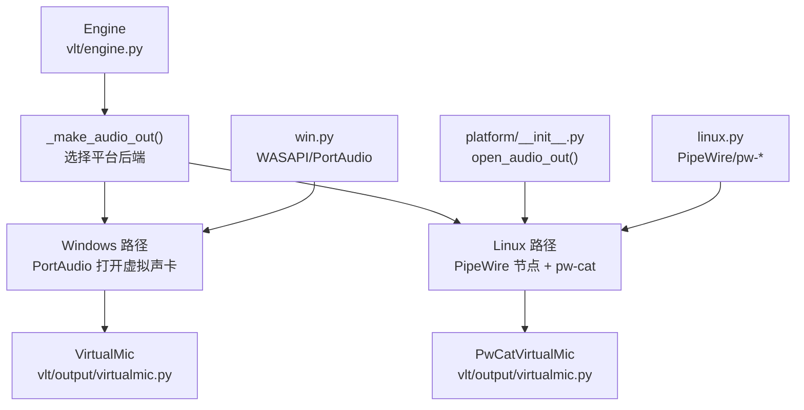
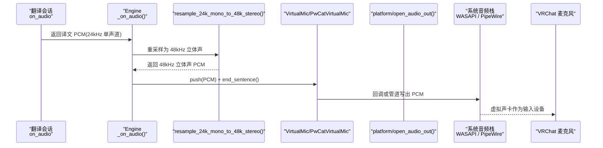
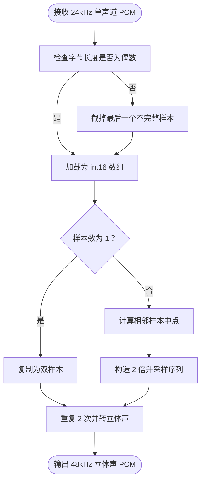
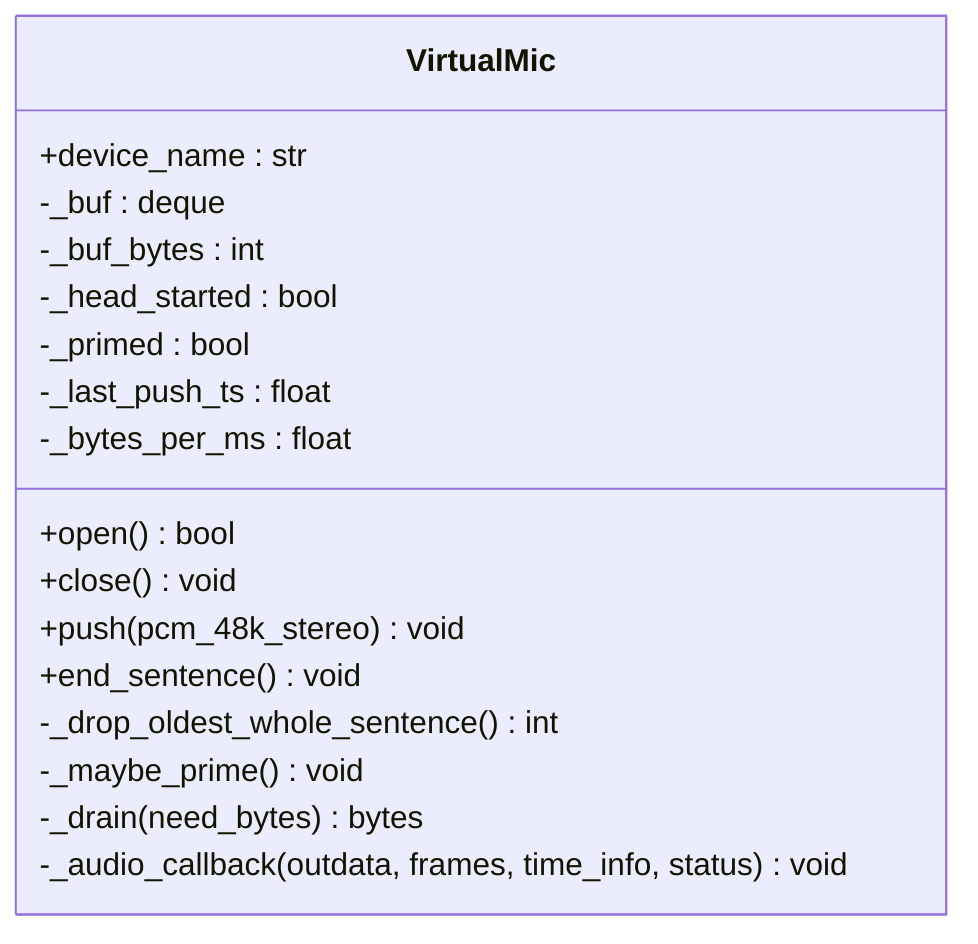
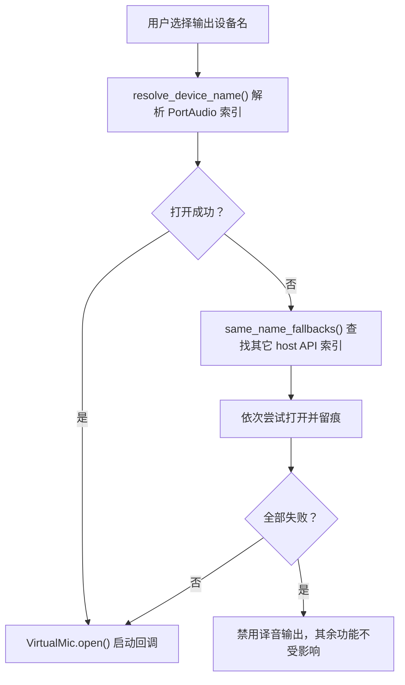
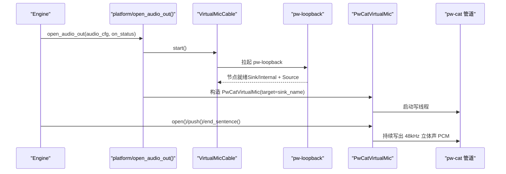
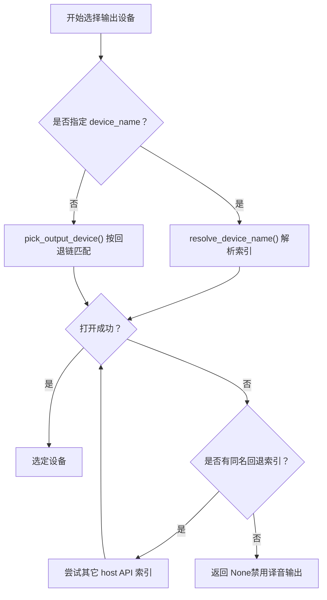
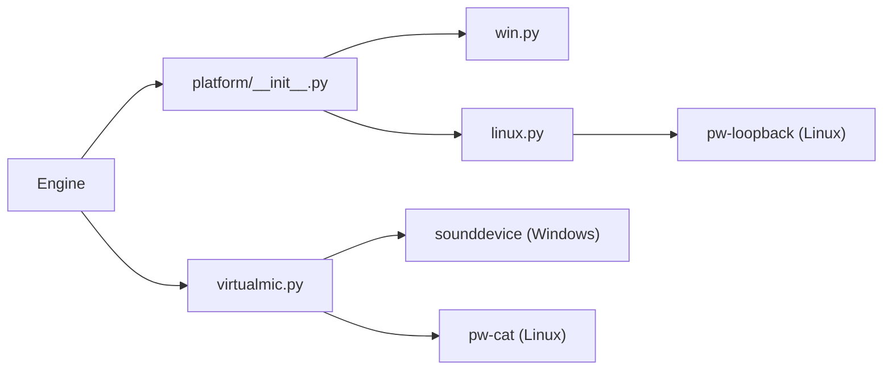
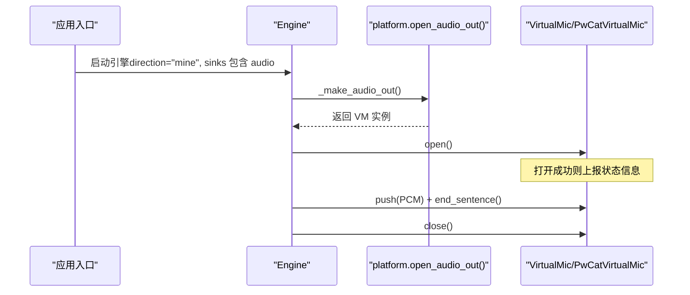

# 虚拟麦克风

<cite>
**本文引用的文件**   
- [README.md](file://README.md)
- [app.py](file://vlt/app.py)
- [engine.py](file://vlt/engine.py)
- [virtualmic.py](file://vlt/output/virtualmic.py)
- [platform/__init__.py](file://vlt/platform/__init__.py)
- [platform/win.py](file://vlt/platform/win.py)
- [platform/linux.py](file://vlt/platform/linux.py)
- [test_virtualmic.py](file://tests/test_virtualmic.py)
</cite>

## 目录
1. [简介](#简介)
2. [项目结构](#项目结构)
3. [核心组件](#核心组件)
4. [架构总览](#架构总览)
5. [详细组件分析](#详细组件分析)
6. [依赖关系分析](#依赖关系分析)
7. [性能与延迟特性](#性能与延迟特性)
8. [配置选项说明](#配置选项说明)
9. [使用示例与事件处理](#使用示例与事件处理)
10. [平台兼容性与故障排除](#平台兼容性与故障排除)
11. [结论](#结论)

## 简介
本文件聚焦“虚拟麦克风输出”这条能力：把模型输出的译文音频（24kHz 单声道 PCM）重采样为 48kHz 立体声，再写入系统虚拟声卡，让 VRChat 的麦克风拾取到译音。该路径在 Windows 上通过已安装的虚拟声卡设备（如 VoiceMeeter、VB-Cable）由 PortAudio 打开；在 Linux 上程序运行时声明一对 PipeWire 节点，并通过 `pw-cat` 把 PCM 写进可写入端。

- 功能定位：我说 → 译音进对方耳朵（默认关闭）。
- 平台差异：Windows 需自备虚拟声卡；Linux 自动声明虚拟麦克风和可写入端。
- 实时性：抖动缓冲 + 欠载补静音 + 整句丢弃策略，避免句子被切断。

**章节来源**
- [README.md:28-47](file://README.md#L28-L47)

## 项目结构
围绕虚拟麦克风的关键代码分布在以下模块：
- 引擎编排：`vlt/engine.py`
- 虚拟麦克风实现：`vlt/output/virtualmic.py`
- 平台抽象层：`vlt/platform/__init__.py`
- Windows 平台实现：`vlt/platform/win.py`
- Linux 平台实现：`vlt/platform/linux.py`
- 命令行入口参数：`vlt/app.py`
- 测试用例：`tests/test_virtualmic.py`

**图表来源**
- [engine.py:897-966](file://vlt/engine.py#L897-L966)
- [virtualmic.py:75-409](file://vlt/output/virtualmic.py#L75-L409)
- [platform/__init__.py:137-146](file://vlt/platform/__init__.py#L137-L146)
- [platform/win.py:23-85](file://vlt/platform/win.py#L23-L85)
- [platform/linux.py:445-728](file://vlt/platform/linux.py#L445-L728)

**章节来源**
- [engine.py:897-966](file://vlt/engine.py#L897-L966)
- [virtualmic.py:75-409](file://vlt/output/virtualmic.py#L75-L409)
- [platform/__init__.py:137-146](file://vlt/platform/__init__.py#L137-L146)
- [platform/win.py:23-85](file://vlt/platform/win.py#L23-L85)
- [platform/linux.py:445-728](file://vlt/platform/linux.py#L445-L728)

## 核心组件
- 引擎侧虚拟麦克风装配：`Engine._setup_virtualmic()` / `_make_audio_out()`
- 虚拟麦克风类：`VirtualMic`（Windows 回调驱动）、`PwCatVirtualMic`（Linux 管道驱动）
- 平台抽象：`platform.open_audio_out()`
- Windows 设备收敛与回退：`query_devices()`、`same_name_fallbacks()`
- Linux 虚拟声卡声明与写入：`VirtualMicCable`、`LinuxAudioOut`、`open_audio_out()`

关键职责划分：
- 引擎负责“何时启用、如何创建、何时关闭”。
- `VirtualMic` 负责“抖动缓冲、起播条件、欠载静音、整句丢弃”。
- 平台层负责“设备枚举、设备打开、运行时节点声明、子进程管理”。

**章节来源**
- [engine.py:897-966](file://vlt/engine.py#L897-L966)
- [virtualmic.py:75-283](file://vlt/output/virtualmic.py#L75-L283)
- [platform/__init__.py:137-146](file://vlt/platform/__init__.py#L137-L146)
- [platform/win.py:320-348](file://vlt/platform/win.py#L320-L348)
- [platform/linux.py:577-728](file://vlt/platform/linux.py#L577-L728)

## 架构总览
虚拟麦克风从“模型译音回调”到“VRChat 麦克风拾取”的完整链路如下：

**图表来源**
- [engine.py:1134-1150](file://vlt/engine.py#L1134-L1150)
- [virtualmic.py:22-48](file://vlt/output/virtualmic.py#L22-L48)
- [virtualmic.py:168-283](file://vlt/output/virtualmic.py#L168-L283)
- [platform/__init__.py:137-146](file://vlt/platform/__init__.py#L137-L146)

## 详细组件分析

### 音频格式转换机制
- 输入：模型直出译文音频，通常为 24kHz 单声道 s16le。
- 目标：48kHz 立体声 s16le，匹配常见虚拟声卡与 VRChat 麦克风期望。
- 算法：2 倍线性插值升采样 + 单声道复制到双声道，使用 numpy 向量化。

复杂度与性能要点：
- 时间复杂度近似 O(n)，n 为样本数。
- 实测对 8.56 秒音频约 2ms，避免纯 Python 循环的高开销。

**图表来源**
- [virtualmic.py:22-48](file://vlt/output/virtualmic.py#L22-L48)

**章节来源**
- [virtualmic.py:22-48](file://vlt/output/virtualmic.py#L22-L48)

### 实时音频流处理与缓冲区管理
`VirtualMic` 的核心是“常开音频流 + 抖动缓冲 + 欠载补静音 + 整句丢弃”：
- 推入数据：`push()` 将 48kHz 立体声 PCM 加入队列，维护 `_buf_bytes`。
- 句尾标记：`end_sentence()` 给最新 chunk 打标记，用于整句丢弃和短文本兜底起播。
- 起播条件：
  - 攒够 `buffer_ms`；
  - 或超过 `PRIME_TIMEOUT_S` 仍无新数据，防止短句永远不出声。
- 欠载处理：回调或写线程取不到数据时补静音。
- 超限保护：优先丢最旧的一整句；若没有完整句且超过硬上限，才退化丢最旧 chunk 并记录警告。

**图表来源**
- [virtualmic.py:75-283](file://vlt/output/virtualmic.py#L75-L283)

**章节来源**
- [virtualmic.py:75-283](file://vlt/output/virtualmic.py#L75-L283)

### 平台特定集成

#### Windows：WASAPI 与 PortAudio
- 设备表收敛：只保留 WASAPI host API 的设备，避免 MME/DirectSound/WDM-KS 重复项导致同名设备采样率不一致。
- 设备打开：通过 sounddevice/PortAudio 打开虚拟声卡；首选失败时按同名回退链尝试其它 host API。
- loopback 采集：使用 pyaudiowpatch 获取系统输出录音副本。

关键点：
- `query_devices()` 过滤为 WASAPI 已启用端点。
- `same_name_fallbacks()` 提供同名设备在其他 host API 下的索引。
- `default_output_index()` 帮助识别默认输出对应的 loopback。

**图表来源**
- [engine.py:918-966](file://vlt/engine.py#L918-L966)
- [platform/win.py:23-85](file://vlt/platform/win.py#L23-L85)
- [platform/win.py:320-348](file://vlt/platform/win.py#L320-L348)

**章节来源**
- [platform/win.py:23-85](file://vlt/platform/win.py#L23-L85)
- [platform/win.py:320-348](file://vlt/platform/win.py#L320-L348)
- [engine.py:918-966](file://vlt/engine.py#L918-L966)

#### Linux：PipeWire 与 pw-cat
- 运行时声明：`VirtualMicCable` 拉起 `pw-loopback`，创建可写入端（Sink/Internal）与虚拟麦（Source）。
- 安全约束：可写入端类必须不在默认输出候选类里，避免抢走用户默认扬声器。
- 数据写出：`PwCatVirtualMic` 用 `pw-cat --playback --raw --target=<sink>` 持续写入 PCM。
- 生命周期：先停写线程，再关进程，最后清理缓冲。

**图表来源**
- [platform/linux.py:577-728](file://vlt/platform/linux.py#L577-L728)
- [virtualmic.py:285-409](file://vlt/output/virtualmic.py#L285-L409)

**章节来源**
- [platform/linux.py:445-728](file://vlt/platform/linux.py#L445-L728)
- [virtualmic.py:285-409](file://vlt/output/virtualmic.py#L285-L409)

### 设备选择与回退链
- Windows：
  - 优先按配置中的 `device_name` 解析 PortAudio 索引。
  - 失败则使用 `pick_output_device()` 按名称回退链匹配（如 voicemeeter input、cable input、vb-audio）。
  - 同名设备在不同 host API 下可回退尝试。
- Linux：
  - 不依赖 PortAudio 打开设备，而是运行时声明 PipeWire 节点，再通过 `pw-cat` 写入。

**图表来源**
- [engine.py:918-966](file://vlt/engine.py#L918-L966)
- [virtualmic.py:51-72](file://vlt/output/virtualmic.py#L51-L72)
- [platform/win.py:320-348](file://vlt/platform/win.py#L320-L348)

**章节来源**
- [engine.py:918-966](file://vlt/engine.py#L918-L966)
- [virtualmic.py:51-72](file://vlt/output/virtualmic.py#L51-L72)
- [platform/win.py:320-348](file://vlt/platform/win.py#L320-L348)

## 依赖关系分析
- `Engine` 依赖 `platform.open_audio_out()` 以统一 Windows/Linux 的译音输出创建。
- `VirtualMic` 依赖 sounddevice（Windows）进行音频流回调。
- `PwCatVirtualMic` 依赖 `pw-cat` 子进程进行 Linux 音频写出。
- `VirtualMicCable` 依赖 `pw-loopback` 子进程进行 Linux 虚拟声卡声明。
- 平台模块通过惰性导入避免跨平台打包污染。

**图表来源**
- [engine.py:897-966](file://vlt/engine.py#L897-L966)
- [platform/__init__.py:1-146](file://vlt/platform/__init__.py#L1-L146)
- [virtualmic.py:1-409](file://vlt/output/virtualmic.py#L1-L409)
- [platform/linux.py:577-728](file://vlt/platform/linux.py#L577-L728)

**章节来源**
- [engine.py:897-966](file://vlt/engine.py#L897-L966)
- [platform/__init__.py:1-146](file://vlt/platform/__init__.py#L1-L146)
- [virtualmic.py:1-409](file://vlt/output/virtualmic.py#L1-L409)
- [platform/linux.py:577-728](file://vlt/platform/linux.py#L577-L728)

## 性能与延迟特性
- 重采样：numpy 向量化实现，低 CPU 占用。
- 缓冲区：
  - `buffer_ms`：起播阈值，默认 300ms。
  - `max_buffer_ms`：正常上限，默认 2000ms。
  - 硬上限：`max_buffer_ms * 4`，极端情况下退化丢 chunk。
- 欠载：回调或写线程取不到数据时补静音，保证播放连续性。
- 整句丢弃：优先丢最旧完整句，避免句子中间切断。
- 起播兜底：`PRIME_TIMEOUT_S = 0.35s`，防止短句永远卡在缓冲。

建议调优方向：
- 降低 `buffer_ms` 可减少首包延迟，但可能增加开头断续风险。
- 提高 `max_buffer_ms` 可提升抗抖动能力，但会增大端到端延迟。
- 确保模型输出节奏稳定，减少长时间静默导致的缓冲饥饿。

[本节为通用性能讨论，不直接分析具体文件]

## 配置选项说明
与虚拟麦克风相关的配置主要位于 `output.audio` 段，以及命令行参数：

- `output.audio.enabled`：是否启用译音输出。
- `output.audio.device_name`：Windows 指定虚拟声卡名称。
- `output.audio.device`：Windows 名称回退链（列表），未指定时使用默认回退链。
- `output.audio.sample_rate`：输出采样率，默认 48000。
- `output.audio.buffer_ms`：起播缓冲时长，默认 300。
- `output.audio.max_buffer_ms`：最大缓冲时长，默认 2000。
- 命令行：
  - `--audio-device`：覆盖 `config.yaml` 中的 `output.audio.device`。
  - `--audio-out`：强制开启或关闭译音输出。

注意：
- Windows 下 `device_name` 解析失败时会退回回退链。
- Linux 下 `device_name` 不生效，因为虚拟声卡由程序运行时声明。

**章节来源**
- [engine.py:897-966](file://vlt/engine.py#L897-L966)
- [app.py:149-152](file://vlt/app.py#L149-L152)

## 使用示例与事件处理

### 创建虚拟麦克风（概念流程）
1. 引擎判断是否启用译音输出。
2. 调用 `_make_audio_out()` 创建平台后端对象。
3. 调用 `open()` 打开音频流。
4. 收到模型译音后调用 `push()` 和 `end_sentence()`。
5. 停止时调用 `close()`。

**图表来源**
- [engine.py:897-966](file://vlt/engine.py#L897-L966)
- [virtualmic.py:117-166](file://vlt/output/virtualmic.py#L117-L166)

### 注入音频数据与处理设备事件
- 注入：`VirtualMic.push(bytes)` 推入 48kHz 立体声 PCM。
- 句尾：`VirtualMic.end_sentence()` 标记一句结束。
- 事件：通过 `on_status(level, msg)` 上报 info/warn/error。
- 关闭：`VirtualMic.close()` 幂等关闭流并清空缓冲。

测试中验证了：
- 设备匹配不到返回 None。
- 无句尾标记时按硬上限兜底，绝不无限增长。
- 打开成功分支不抛异常，并能正确调用 push/end_sentence/close。

**章节来源**
- [virtualmic.py:168-283](file://vlt/output/virtualmic.py#L168-L283)
- [test_virtualmic.py:105-135](file://tests/test_virtualmic.py#L105-L135)
- [test_virtualmic.py:298-319](file://tests/test_virtualmic.py#L298-L319)

## 平台兼容性与故障排除

### Windows
常见问题：
- WASAPI 共享模式只接受端点原生采样率，不能随意降采样。
- 个别虚拟声卡（如 Voicemeeter）在 WASAPI 下 KS 属性查询失败，需要回退到 MME/DirectSound。
- 设备表收敛到 WASAPI 后，同名设备在不同 host API 下采样率不同，需按 pa_index 打开。

排查步骤：
- 确认已安装虚拟声卡（VoiceMeeter、VB-Cable）。
- 检查 `output.audio.device_name` 是否正确。
- 查看日志中的回退尝试与错误信息。
- 若所有候选失败，译音输出会被禁用，但不影响其他功能。

**章节来源**
- [platform/win.py:23-85](file://vlt/platform/win.py#L23-L85)
- [platform/win.py:320-348](file://vlt/platform/win.py#L320-L348)
- [engine.py:918-966](file://vlt/engine.py#L918-L966)

### Linux
常见问题：
- PipeWire 工具缺失（pw-dump、pw-record、pw-cat）。
- 运行时声明虚拟声卡失败（权限、沙盒、测试进程保护）。
- `pw-cat` 管道断开或进程退出。

排查步骤：
- 安装 PipeWire 原生工具。
- 检查 `output.audio.sample_rate`、`buffer_ms`、`max_buffer_ms`。
- 查看 `stderr_tail()` 获取 pw-cat 错误信息。
- 确认虚拟声卡未被误设为默认输出（程序已做防护）。

**章节来源**
- [platform/linux.py:445-728](file://vlt/platform/linux.py#L445-L728)
- [virtualmic.py:285-409](file://vlt/output/virtualmic.py#L285-L409)

## 结论
虚拟麦克风输出是一条高实时性、强鲁棒性的音频回灌路径：
- 通过 24kHz→48kHz 重采样与单声道→立体声映射，适配系统音频栈。
- 通过抖动缓冲、欠载静音、整句丢弃，保证听感连续且不切句。
- 通过平台抽象层统一 Windows/Linux 的实现差异。
- 通过设备回退链与运行时节点声明，提升可用性。

实际部署时，请根据平台选择合适的虚拟声卡方案，并根据延迟与音质需求调整缓冲参数。若遇到问题，优先检查设备枚举、回退链、子进程状态与日志信息。

[本节为总结性内容，不直接分析具体文件]