# 输出分发系统

<cite>
**本文引用的文件**   
- [README.md](file://README.md)
- [vlt/output/__init__.py](file://vlt/output/__init__.py)
- [vlt/output/merger.py](file://vlt/output/merger.py)
- [vlt/output/chatbox.py](file://vlt/output/chatbox.py)
- [vlt/output/desktop_overlay.py](file://vlt/output/desktop_overlay.py)
- [vlt/output/overlay.py](file://vlt/output/overlay.py)
- [vlt/output/openvr_overlay.py](file://vlt/output/openvr_overlay.py)
- [vlt/output/openxr_overlay.py](file://vlt/output/openxr_overlay.py)
- [vlt/output/virtualmic.py](file://vlt/output/virtualmic.py)
</cite>

## 目录
1. [引言](#引言)
2. [项目结构与输出管道总览](#项目结构与输出管道总览)
3. [核心组件](#核心组件)
4. [架构总览](#架构总览)
5. [详细组件分析](#详细组件分析)
6. [依赖关系分析](#依赖关系分析)
7. [性能与限流特性](#性能与限流特性)
8. [配置选项与自定义方法](#配置选项与自定义方法)
9. [常见问题与排障指南](#常见问题与排障指南)
10. [结论](#结论)

## 引言
本文件聚焦“输出分发系统”，即把翻译结果从上游会话/引擎层分发到三类输出渠道：
- Chatbox 气泡（VRChat 聊天框）
- VR 叠加显示（手腕屏，Windows 走 SteamVR/OpenVR，Linux 走 OpenXR）
- 虚拟麦克风（把模型直出的译音重采样后灌进虚拟声卡）

文档同时解释输出管道的关键设计：文本合并器、限流控制、格式转换、增量文本处理、最终版本同步机制，以及各输出渠道的协议与集成细节。

**章节来源**
- [README.md:11-46](file://README.md#L11-L46)

## 项目结构与输出管道总览
输出相关代码集中在 `vlt/output` 包中，采用“共享渲染 + 平台后端”的分层结构：
- `overlay.py`：共享配置与渲染逻辑（Pillow 画图、字体解析、对话视图）。
- `openvr_overlay.py`：Windows 端 SteamVR/OpenVR 手腕屏后端。
- `openxr_overlay.py`：Linux 端 OpenXR 手腕屏后端（Wayland/EGL 或 X11/GLX）。
- `chatbox.py`：OSC 协议发送 Chatbox 气泡。
- `virtualmic.py`：虚拟声卡音频输出（Windows 用 PortAudio，Linux 用 PipeWire `pw-cat`）。
- `desktop_overlay.py`：桌面模式字幕叠加窗（不戴头显时的 PC 字幕）。
- `merger.py`：节流合并器，负责增量文本压缩和最终版必达。
- `__init__.py`：对外暴露 `Merger`、`Chatbox`、`TokenBucket`。

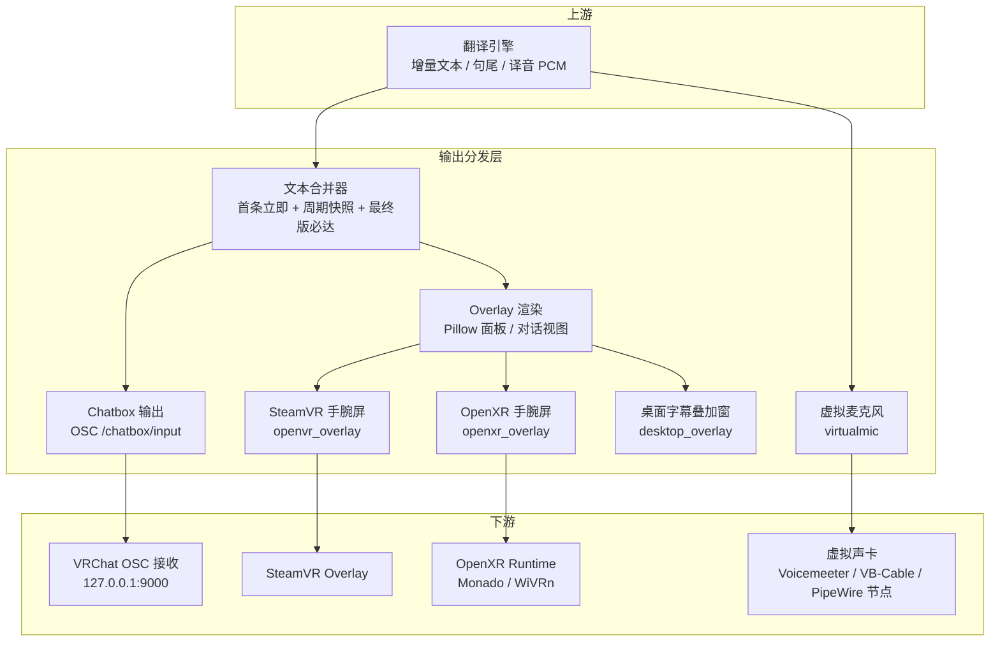

**图表来源**
- [vlt/output/merger.py:1-82](file://vlt/output/merger.py#L1-L82)
- [vlt/output/chatbox.py:1-137](file://vlt/output/chatbox.py#L1-L137)
- [vlt/output/overlay.py:1-618](file://vlt/output/overlay.py#L1-L618)
- [vlt/output/openvr_overlay.py:1-603](file://vlt/output/openvr_overlay.py#L1-L603)
- [vlt/output/openxr_overlay.py:1-800](file://vlt/output/openxr_overlay.py#L1-L800)
- [vlt/output/desktop_overlay.py:1-800](file://vlt/output/desktop_overlay.py#L1-L800)
- [vlt/output/virtualmic.py:1-409](file://vlt/output/virtualmic.py#L1-L409)

**章节来源**
- [vlt/output/__init__.py:1-3](file://vlt/output/__init__.py#L1-L3)
- [vlt/output/overlay.py:1-16](file://vlt/output/overlay.py#L1-L16)

## 核心组件
本节按职责划分，说明每个组件在输出管道中的角色、输入输出、关键状态和行为约束。

### 文本合并器（Merger）
- 作用：把高频增量文本压成稳定的“当前最完整译文快照”。
- 策略：
  - 首个增量立即发出；
  - 之后按固定间隔（默认 2 秒）发一次快照；
  - 遇到 `is_final=True` 的最终版必须发出；
  - 非终版若内容未变化则跳过，避免浪费限流配额；
  - 支持 carry_over 前缀拼接与最大字符数截断。
- 关键接口：
  - `start_utterance()`：新响应开始；
  - `push(delta)`：推入增量；
  - `_emit(text, is_final, now)`：内部发射；
  - `_compose(text, is_final)`：拼接前缀、折叠空白、超长截断；
  - `reset()`：重置状态。

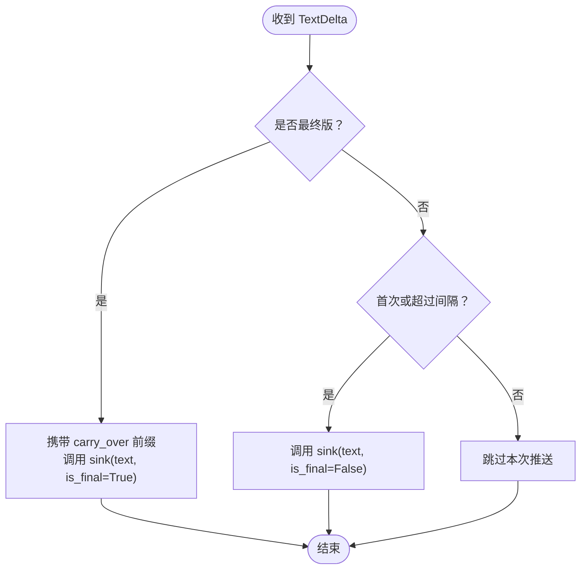

**图表来源**
- [vlt/output/merger.py:16-82](file://vlt/output/merger.py#L16-L82)

**章节来源**
- [vlt/output/merger.py:1-82](file://vlt/output/merger.py#L1-L82)

### Chatbox 输出（OSC 气泡）
- 作用：通过 OSC `/chatbox/input` 把译文发送到 VRChat。
- 硬约束：
  - bool 参数必须使用 OSC 类型标签 `T`/`F`；
  - 单条最多 144 字符、最多 9 行；
  - 限流为漏桶 5 条/5 秒，超发静默丢弃；
  - 目标地址 `127.0.0.1:9000`。
- 关键类与方法：
  - `TokenBucket`：窗口内计数 + 最小间隔防连发；
  - `Chatbox.build_datagram()`：构造 OSC 报文；
  - `Chatbox.sanitize()`：折叠空白、截断长度；
  - `Chatbox.send()`：限流判断、最终版入队补发；
  - `Chatbox.flush_pending()`：停止收尾时优先补发最新最终版；
  - `Chatbox._dispatch()`：UDP 发送或 dry-run 打印。

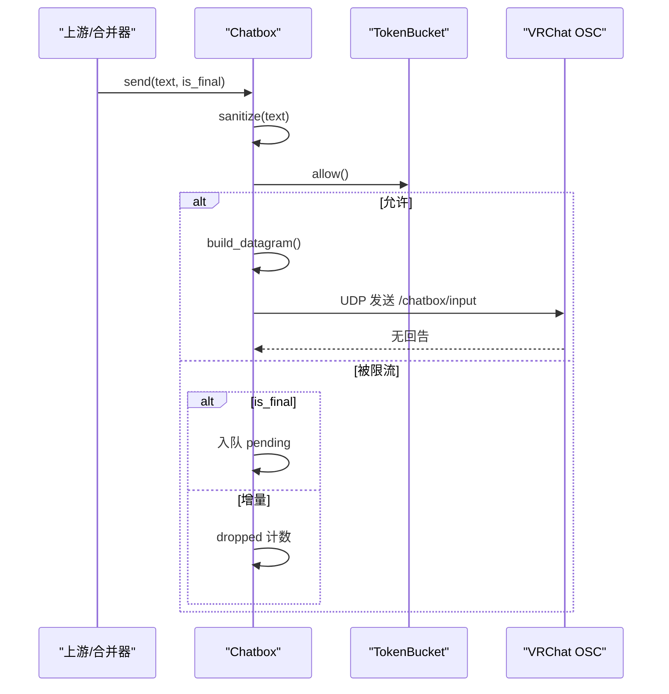

**图表来源**
- [vlt/output/chatbox.py:20-137](file://vlt/output/chatbox.py#L20-L137)

**章节来源**
- [vlt/output/chatbox.py:1-137](file://vlt/output/chatbox.py#L1-L137)

### VR 叠加显示（手腕屏）
手腕屏由共享渲染模块 `overlay.py` 生成 RGBA 面板，再由平台后端上传到 VR 合成器。

#### Windows：SteamVR/OpenVR 后端
- 初始化：
  - 尝试 `openvr.init(VRApplication_Background)`；
  - 创建 overlay handle，清理残留 key；
  - 应用锚点、宽度、透明度、弯曲度；
  - show overlay。
- 更新：
  - `update()`：单条面板；
  - `update_entries()`：对话视图；
  - `_upload()`：RGBA 数据通过 `setOverlayRaw` 上传；
  - 自愈：连续失败 → 重建 overlay → 硬重启 openvr 连接。
- 热重载：
  - 监听 `config.yaml` 的 `overlay:` 段；
  - 区分几何/锚点变更与渲染参数变更；
  - 心跳日志记录面板存活状态。

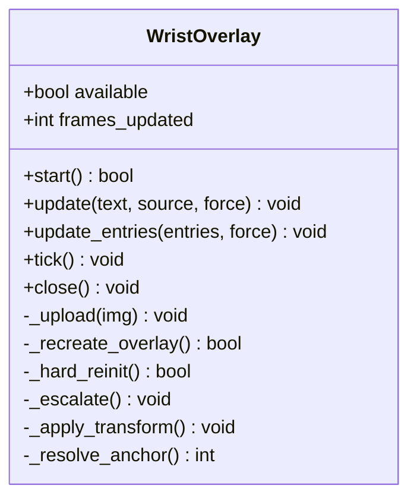

**图表来源**
- [vlt/output/openvr_overlay.py:98-603](file://vlt/output/openvr_overlay.py#L98-L603)

**章节来源**
- [vlt/output/openvr_overlay.py:1-603](file://vlt/output/openvr_overlay.py#L1-L603)

#### Linux：OpenXR 后端
- GL 后端选择：
  - Wayland + EGL surfaceless；
  - X11 + GLX pbuffer；
  - 通过环境变量 `VLT_OVERLAY_GL=wayland|x11` 强制指定。
- 会话建立：
  - instance → system → overlay session；
  - 图形绑定链：`SessionCreateInfo → GraphicsBindingEGLMNDX/GlX → SessionCreateInfoOverlayEXTX`；
  - 泵事件到 READY 再 begin session。
- 帧提交：
  - swapchain 选 `GL_RGBA8`；
  - 必须 wait swapchain image；
  - 图层 alpha flag 必须设置 BLEND_TEXTURE_SOURCE_ALPHA_BIT 与 UNPREMULTIPLIED_ALPHA_BIT；
  - 柱面层支持（可选扩展），否则降级平面。
- 锚点与姿态：
  - left_hand/right_hand/tracker/hmd；
  - tracker 路径基于 role；
  - 欧拉角转四元数，保持与 Windows 侧矩阵一致。

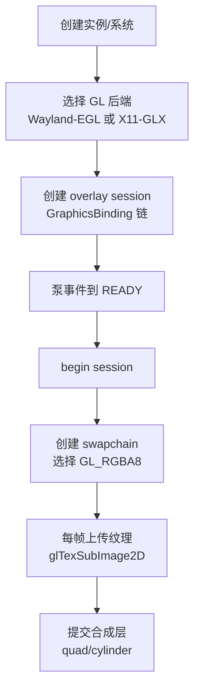

**图表来源**
- [vlt/output/openxr_overlay.py:259-800](file://vlt/output/openxr_overlay.py#L259-L800)

**章节来源**
- [vlt/output/openxr_overlay.py:1-800](file://vlt/output/openxr_overlay.py#L1-L800)

### 桌面字幕叠加窗
- 作用：不戴头显时，在桌面以无边框置顶窗口显示译文。
- 后端选择：
  - 原生窗：Linux Wayland layer-shell / X11 ARGB 覆盖窗；
  - Tk 回落：Windows 色键透明 / Linux 形状蒙版抠底。
- 功能：
  - 跟随游戏窗口、锚点定位、偏移、绝对坐标；
  - 鼠标穿透、置顶、不抢焦点；
  - 对话视图与歌词式最新一句两种模式；
  - 配置热重载、dry-run 出图 PNG。

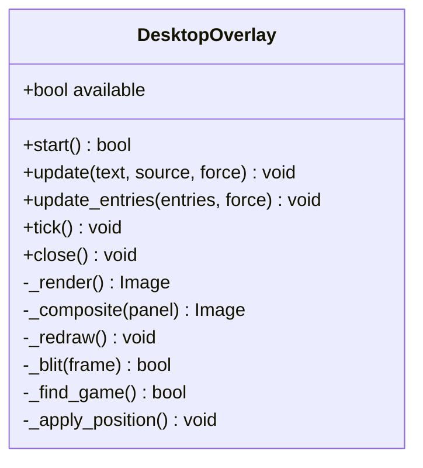

**图表来源**
- [vlt/output/desktop_overlay.py:325-800](file://vlt/output/desktop_overlay.py#L325-L800)

**章节来源**
- [vlt/output/desktop_overlay.py:1-800](file://vlt/output/desktop_overlay.py#L1-L800)

### 虚拟麦克风（译音输出）
- 作用：把模型直出的 24kHz 单声道 PCM 重采样为 48kHz 立体声 s16le，写入虚拟声卡。
- 重采样：
  - 线性插值升采样 + 单声道复制到双声道；
  - numpy 向量化实现。
- 设备选择：
  - Windows：PortAudio 回调驱动，按名称回退链查找 Voicemeeter/VB-Cable 等；
  - Linux：PipeWire `pw-cat --playback --target=<节点名>` 写管道。
- 缓冲与起播：
  - 抖动缓冲 + 欠载补静音；
  - 起播条件：攒够 buffer_ms 或停更超时 PRIME_TIMEOUT_S；
  - 整句丢弃保护：缓冲超限只丢完整句，不切半句。

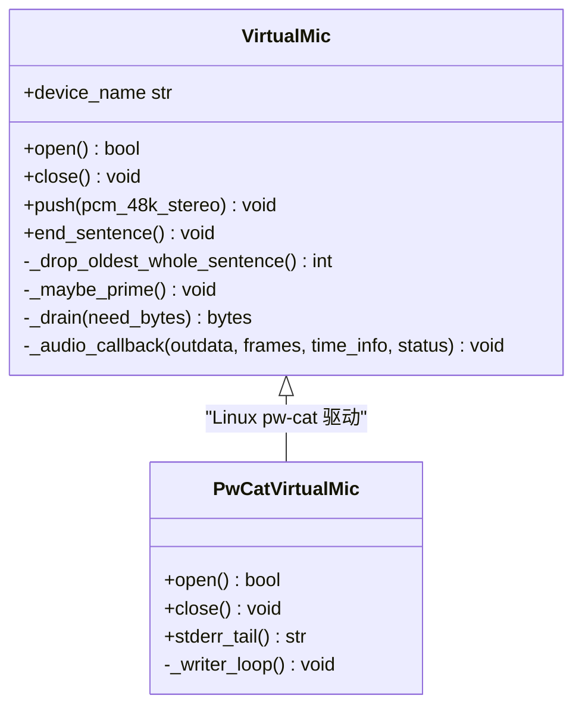

**图表来源**
- [vlt/output/virtualmic.py:75-409](file://vlt/output/virtualmic.py#L75-L409)

**章节来源**
- [vlt/output/virtualmic.py:1-409](file://vlt/output/virtualmic.py#L1-L409)

## 架构总览
输出管道整体流程如下：

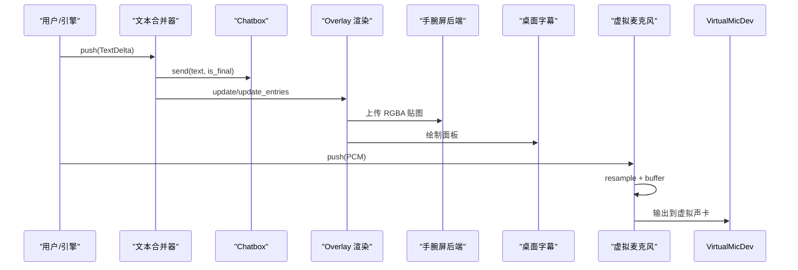

**图表来源**
- [vlt/output/merger.py:16-82](file://vlt/output/merger.py#L16-L82)
- [vlt/output/chatbox.py:81-137](file://vlt/output/chatbox.py#L81-L137)
- [vlt/output/overlay.py:381-591](file://vlt/output/overlay.py#L381-L591)
- [vlt/output/openvr_overlay.py:237-320](file://vlt/output/openvr_overlay.py#L237-L320)
- [vlt/output/openxr_overlay.py:330-350](file://vlt/output/openxr_overlay.py#L330-L350)
- [vlt/output/virtualmic.py:22-49](file://vlt/output/virtualmic.py#L22-L49)

## 详细组件分析

### 增量文本处理与最终版本同步
- 增量文本来自会话层的 `TextDelta`，包含 `display` 文本与 `is_final` 标志。
- 合并器对增量做节流：
  - 首个 delta 立即发；
  - 后续按 interval_s 节流；
  - 最终版必达，即使与上次相同也发；
  - 非终版内容不变则跳过。
- Chatbox 对最终版有额外保护：
  - 被限流时不入队 pending，等待窗口释放后补发；
  - flush_pending 支持 newest_first，停止收尾时优先补最新句。

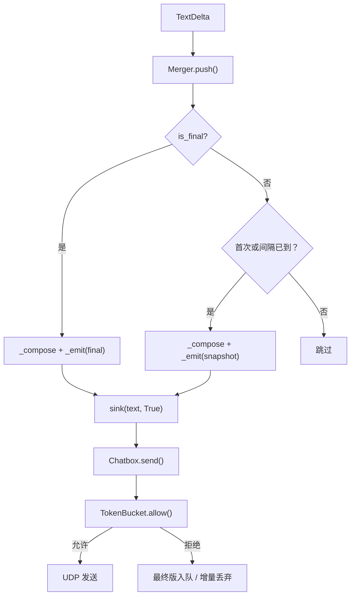

**图表来源**
- [vlt/output/merger.py:36-76](file://vlt/output/merger.py#L36-L76)
- [vlt/output/chatbox.py:81-110](file://vlt/output/chatbox.py#L81-L110)

**章节来源**
- [vlt/output/merger.py:16-82](file://vlt/output/merger.py#L16-L82)
- [vlt/output/chatbox.py:81-137](file://vlt/output/chatbox.py#L81-L137)

### 格式转换与渲染管线
- 共享渲染模块负责：
  - 字体解析（CJK/泰语分 run）；
  - 折行算法（整词保护、禁则标点）；
  - 面板渲染（原文+译文）；
  - 对话视图渲染（mine/theirs/peer 颜色）。
- 平台后端负责：
  - Windows：openvr overlay 贴图上传；
  - Linux：OpenGL 纹理上传 + OpenXR 合成层提交。

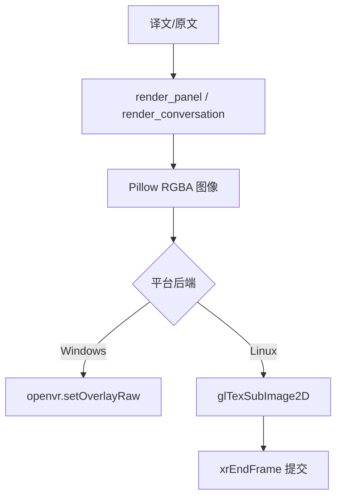

**图表来源**
- [vlt/output/overlay.py:381-591](file://vlt/output/overlay.py#L381-L591)
- [vlt/output/openvr_overlay.py:287-320](file://vlt/output/openvr_overlay.py#L287-L320)
- [vlt/output/openxr_overlay.py:330-350](file://vlt/output/openxr_overlay.py#L330-L350)

**章节来源**
- [vlt/output/overlay.py:1-618](file://vlt/output/overlay.py#L1-L618)
- [vlt/output/openvr_overlay.py:237-320](file://vlt/output/openvr_overlay.py#L237-L320)
- [vlt/output/openxr_overlay.py:330-350](file://vlt/output/openxr_overlay.py#L330-L350)

### OSC 协议通信细节
- 目标地址：`127.0.0.1:9000`
- 地址：`/chatbox/input`
- 参数：
  - text：字符串；
  - sendImmediately：布尔（True）；
  - play notification SFX：布尔（可配）。
- 类型标签：必须是 `,sTT`，bool 不能传 int32 payload。

**章节来源**
- [vlt/output/chatbox.py:1-8](file://vlt/output/chatbox.py#L1-L8)
- [vlt/output/chatbox.py:64-73](file://vlt/output/chatbox.py#L64-L73)

### SteamVR/OpenXR 集成要点
- SteamVR：
  - 后台应用模式；
  - overlay key 冲突清理；
  - 连续失败自愈（重建 handle → 硬重启 openvr）。
- OpenXR：
  - Wayland/EGL 与 X11/GLX 双后端；
  - 图形绑定链顺序严格；
  - 必须泵事件到 READY；
  - swapchain 格式选择与 alpha flag；
  - 柱面层扩展检测与降级。

**章节来源**
- [vlt/output/openvr_overlay.py:132-199](file://vlt/output/openvr_overlay.py#L132-L199)
- [vlt/output/openvr_overlay.py:287-430](file://vlt/output/openvr_overlay.py#L287-L430)
- [vlt/output/openxr_overlay.py:766-800](file://vlt/output/openxr_overlay.py#L766-L800)
- [vlt/output/openxr_overlay.py:330-350](file://vlt/output/openxr_overlay.py#L330-L350)

### 虚拟声卡实现差异
- Windows：
  - PortAudio RawOutputStream；
  - 设备回退链（同名设备不同 host API）；
  - 回调驱动，欠载补静音。
- Linux：
  - PipeWire `pw-cat` 子进程；
  - 写线程驱动，语义对齐 PortAudio；
  - 自动关闭子进程与管道。

**章节来源**
- [vlt/output/virtualmic.py:117-152](file://vlt/output/virtualmic.py#L117-L152)
- [vlt/output/virtualmic.py:285-409](file://vlt/output/virtualmic.py#L285-L409)

## 依赖关系分析
输出模块之间的依赖关系如下：

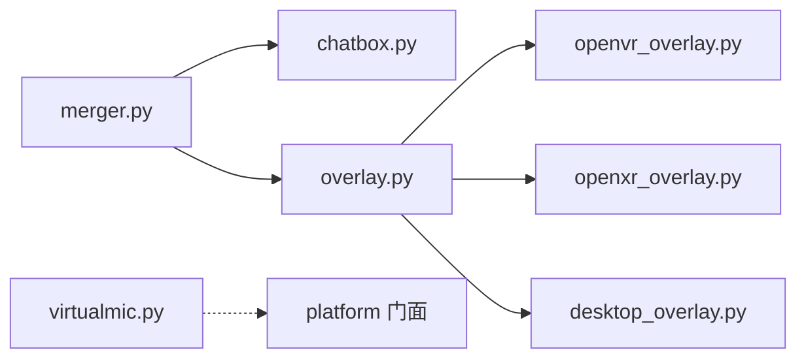

**图表来源**
- [vlt/output/__init__.py:1-3](file://vlt/output/__init__.py#L1-L3)
- [vlt/output/merger.py:11-13](file://vlt/output/merger.py#L11-L13)
- [vlt/output/chatbox.py:15-17](file://vlt/output/chatbox.py#L15-L17)
- [vlt/output/overlay.py:23-26](file://vlt/output/overlay.py#L23-L26)
- [vlt/output/openvr_overlay.py:24-27](file://vlt/output/openvr_overlay.py#L24-L27)
- [vlt/output/openxr_overlay.py:47-49](file://vlt/output/openxr_overlay.py#L47-L49)
- [vlt/output/desktop_overlay.py:35-40](file://vlt/output/desktop_overlay.py#L35-L40)
- [vlt/output/virtualmic.py:11-13](file://vlt/output/virtualmic.py#L11-L13)

**章节来源**
- [vlt/output/__init__.py:1-3](file://vlt/output/__init__.py#L1-L3)
- [vlt/output/merger.py:1-13](file://vlt/output/merger.py#L1-L13)
- [vlt/output/chatbox.py:1-17](file://vlt/output/chatbox.py#L1-L17)
- [vlt/output/overlay.py:1-26](file://vlt/output/overlay.py#L1-L26)
- [vlt/output/openvr_overlay.py:1-27](file://vlt/output/openvr_overlay.py#L1-L27)
- [vlt/output/openxr_overlay.py:1-49](file://vlt/output/openxr_overlay.py#L1-L49)
- [vlt/output/desktop_overlay.py:1-40](file://vlt/output/desktop_overlay.py#L1-L40)
- [vlt/output/virtualmic.py:1-13](file://vlt/output/virtualmic.py#L1-L13)

## 性能与限流特性
- Chatbox 限流：
  - TokenBucket 限制 5 条/5 秒，最小间隔 0.4 秒；
  - 增量被限流直接丢弃，最终版入队等待补发；
  - flush_pending 支持 newest_first，避免收尾时旧句挤掉新句。
- 合并器节流：
  - 首条立即发，之后每 2 秒快照；
  - 非终版内容不变跳过；
  - 最终版必达。
- 手腕屏上传：
  - SteamVR：连续失败 86 次触发自愈；
  - OpenXR：alpha flag 必须设置，否则半透明失效。
- 虚拟麦克风：
  - 缓冲超限只丢整句，不切半句；
  - 起播兜时 PRIME_TIMEOUT_S=0.35 秒，防止短译音永远不出声。

**章节来源**
- [vlt/output/chatbox.py:20-41](file://vlt/output/chatbox.py#L20-L41)
- [vlt/output/chatbox.py:81-110](file://vlt/output/chatbox.py#L81-L110)
- [vlt/output/merger.py:36-76](file://vlt/output/merger.py#L36-L76)
- [vlt/output/openvr_overlay.py:287-320](file://vlt/output/openvr_overlay.py#L287-L320)
- [vlt/output/openxr_overlay.py:121-136](file://vlt/output/openxr_overlay.py#L121-L136)
- [vlt/output/virtualmic.py:168-249](file://vlt/output/virtualmic.py#L168-L249)

## 配置选项与自定义方法
### 手腕屏配置（overlay 段）
- 位置/旋转/宽度/透明度/弯曲度；
- 锚点（left_hand/right_hand/tracker/hmd）；
- 字体/字号/行数/是否显示原文；
- 配色（底板/边框/原文/译文/分隔线）；
- fade_after_s 淡出阈值；
- backend auto/null。

**章节来源**
- [vlt/output/overlay.py:125-193](file://vlt/output/overlay.py#L125-L193)

### 桌面字幕配置（desktop_overlay 段）
- enabled/mode/backend/anchor/offset/pos/size_px/alpha/click_through/follow/game_title；
- font/font_size/source_font_size/max_lines/show_source；
- visual 配色字段独立于 overlay 段。

**章节来源**
- [vlt/output/desktop_overlay.py:90-194](file://vlt/output/desktop_overlay.py#L90-L194)

### Chatbox 配置
- host/port；
- max_chars/max_lines；
- notification_sound；
- dry_run。

**章节来源**
- [vlt/output/chatbox.py:44-57](file://vlt/output/chatbox.py#L44-L57)

### 虚拟麦克风配置
- device_index/device_name/sample_rate/buffer_ms/max_buffer_ms；
- device_fallbacks（Windows 回退候选）；
- Linux target（PipeWire 节点名）。

**章节来源**
- [vlt/output/virtualmic.py:75-112](file://vlt/output/virtualmic.py#L75-L112)
- [vlt/output/virtualmic.py:285-313](file://vlt/output/virtualmic.py#L285-L313)

## 常见问题与排障指南
### Chatbox 气泡无输出
- 检查 OSC 端口是否为 9000；
- 确认 VRChat 正在运行且能接收 OSC；
- 查看 Chatbox 日志中的 dropped 计数与 pending 队列。

**章节来源**
- [vlt/output/chatbox.py:1-8](file://vlt/output/chatbox.py#L1-L8)
- [vlt/output/chatbox.py:81-137](file://vlt/output/chatbox.py#L81-L137)

### 手腕屏消失或卡顿
- SteamVR：
  - 检查 SteamVR 是否启动；
  - 查看 overlay 日志中的连续失败次数；
  - 尝试重建 overlay 或硬重启 openvr。
- OpenXR：
  - 检查 Wayland/X11 环境；
  - 确认 GL 后端可用；
  - 查看 alpha flag 是否正确设置。

**章节来源**
- [vlt/output/openvr_overlay.py:132-199](file://vlt/output/openvr_overlay.py#L132-L199)
- [vlt/output/openvr_overlay.py:287-430](file://vlt/output/openvr_overlay.py#L287-L430)
- [vlt/output/openxr_overlay.py:657-693](file://vlt/output/openxr_overlay.py#L657-L693)
- [vlt/output/openxr_overlay.py:121-136](file://vlt/output/openxr_overlay.py#L121-L136)

### 桌面字幕不显示或位置异常
- 检查 backend 选择（native/tk/wayland/x11）；
- 确认目标窗口找到；
- 查看 anchor/offset/pos 配置。

**章节来源**
- [vlt/output/desktop_overlay.py:375-437](file://vlt/output/desktop_overlay.py#L375-L437)
- [vlt/output/desktop_overlay.py:762-800](file://vlt/output/desktop_overlay.py#L762-L800)

### 虚拟麦克风无声
- Windows：
  - 检查 Voicemeeter/VB-Cable 是否安装；
  - 查看设备回退日志；
  - 确认 PortAudio 回调正常。
- Linux：
  - 检查 PipeWire 节点是否存在；
  - 查看 pw-cat stderr；
  - 确认 find-defined-target 指向正确节点。

**章节来源**
- [vlt/output/virtualmic.py:117-152](file://vlt/output/virtualmic.py#L117-L152)
- [vlt/output/virtualmic.py:321-409](file://vlt/output/virtualmic.py#L321-L409)

## 结论
输出分发系统通过“文本合并器 + 限流控制 + 格式转换 + 多后端渲染”的架构，实现了从翻译引擎到 Chatbox、VR 手腕屏、桌面字幕和虚拟麦克风的稳定分发。其关键优势包括：
- 增量文本节流与最终版必达；
- 平台无关的共享渲染逻辑；
- 稳健的自愈与回退机制；
- 详细的日志与诊断信息。

对于扩展新的输出渠道，建议遵循现有分层：新增一个后端模块，复用 `overlay.py` 的渲染能力，并在 `__init__.py` 中暴露必要接口。