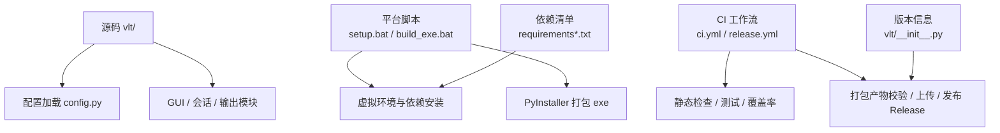
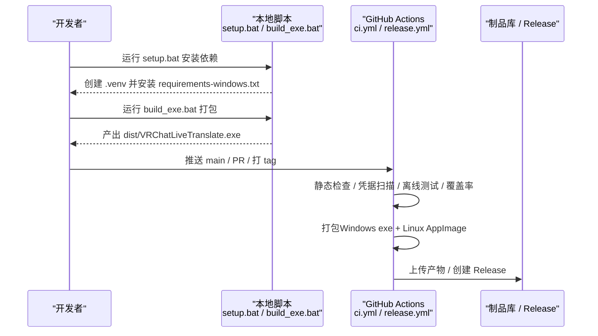
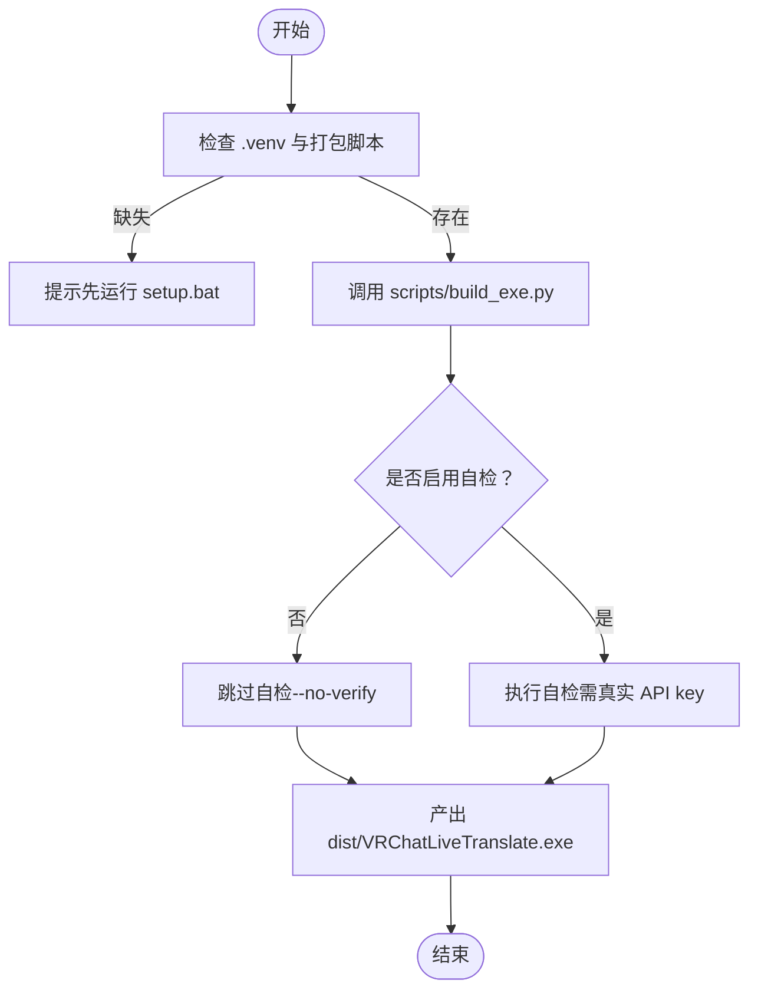
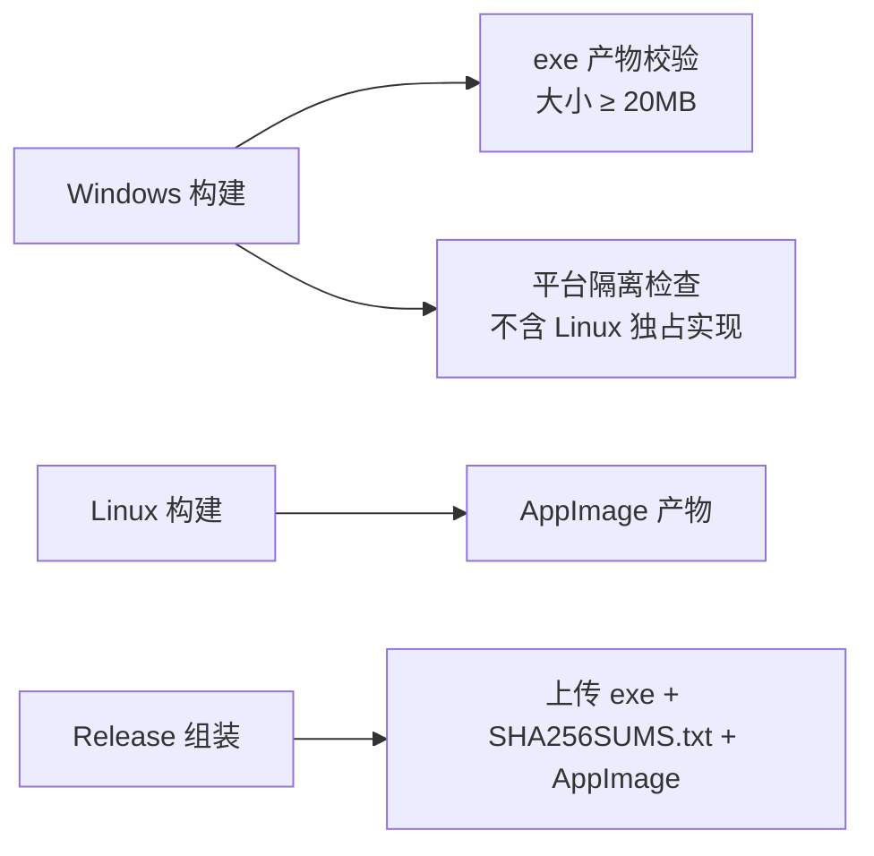
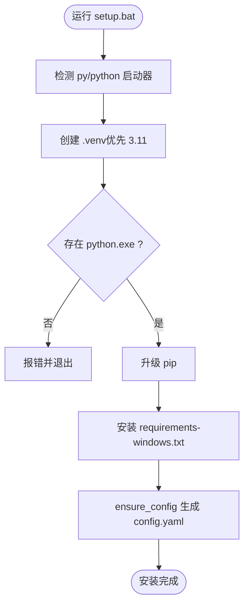
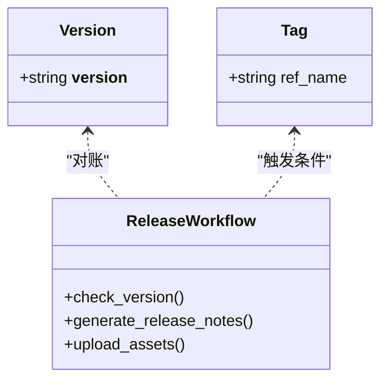
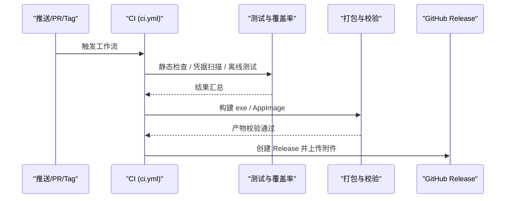
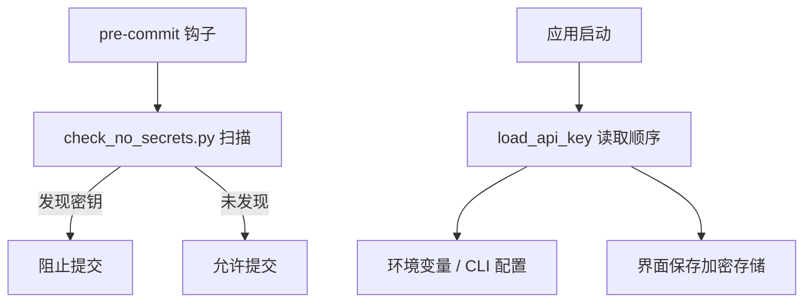
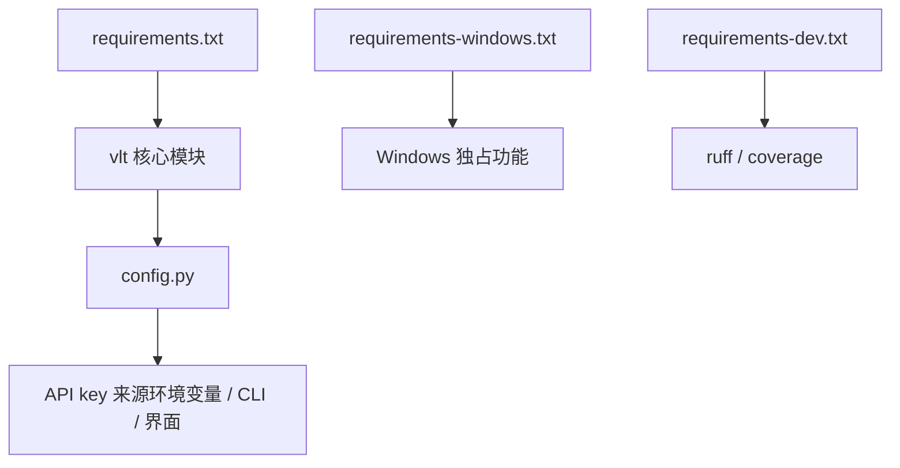

# 部署与发布

<cite>
**本文引用的文件**   
- [README.md](file://README.md)
- [ci.yml](file://.github/workflows/ci.yml)
- [release.yml](file://.github/workflows/release.yml)
- [setup.bat](file://setup.bat)
- [build_exe.bat](file://build_exe.bat)
- [install_secret_guard.bat](file://install_secret_guard.bat)
- [requirements.txt](file://requirements.txt)
- [requirements-windows.txt](file://requirements-windows.txt)
- [requirements-dev.txt](file://requirements-dev.txt)
- [config.py](file://vlt/config.py)
- [__init__.py](file://vlt/__init__.py)
</cite>

## 目录
1. [简介](#简介)
2. [项目结构](#项目结构)
3. [核心组件](#核心组件)
4. [架构总览](#架构总览)
5. [详细组件分析](#详细组件分析)
6. [依赖关系分析](#依赖关系分析)
7. [性能考虑](#性能考虑)
8. [故障排除指南](#故障排除指南)
9. [结论](#结论)
10. [附录](#附录)

## 简介
本文件面向“VRChat 实时同传”项目的部署与发布，覆盖打包与分发、安装脚本、版本管理、自动化构建与测试、发布渠道、最佳实践、安全与权限等主题。目标是让读者既能理解整体流程，也能按步骤完成本地或 CI 环境的构建与发布。

## 项目结构
仓库围绕“源码 + 平台脚本 + CI 工作流 + 依赖清单 + 配置模板”组织：
- 源码核心在 vlt/，包含配置加载、会话、输出、GUI 等模块。
- 平台相关脚本位于根目录（如 setup.bat、build_exe.bat）。
- CI 与发布流水线在 .github/workflows/ 下。
- 依赖通过 requirements*.txt 分层管理（公共、Windows 独占、开发期）。
- 配置模板与示例在 config.example.yaml（随程序分发）与用户可写的 config.yaml。

图示来源
- [ci.yml:1-253](file://.github/workflows/ci.yml#L1-L253)
- [release.yml:1-158](file://.github/workflows/release.yml#L1-L158)
- [setup.bat:1-46](file://setup.bat#L1-L46)
- [build_exe.bat:1-39](file://build_exe.bat#L1-L39)
- [requirements.txt:1-20](file://requirements.txt#L1-L20)
- [requirements-windows.txt:1-17](file://requirements-windows.txt#L1-L17)
- [__init__.py:1-8](file://vlt/__init__.py#L1-L8)

章节来源
- [README.md:1-114](file://README.md#L1-L114)

## 核心组件
- 依赖管理
  - 公共依赖：requirements.txt（跨平台通用）。
  - Windows 独占依赖：requirements-windows.txt（WASAPI loopback、SteamVR overlay）。
  - 开发期依赖：requirements-dev.txt（ruff、coverage，不进入产品包）。
- 安装与环境初始化
  - setup.bat：创建 Python 3.11 虚拟环境、升级 pip、安装 Windows 依赖清单。
- 打包与分发
  - build_exe.bat：调用 scripts/build_exe.py 生成单文件 exe（无控制台窗口），支持 --no-verify 跳过自检。
  - CI 的 package job 与 release.yml 的 build job 负责验证产物体积、平台隔离与附件完整性。
- 配置与密钥
  - vlt/config.py：从 YAML + 环境变量 + CLI 配置读取 API key；确保配置文件存在并回退到模板；提供方向级热词合并与默认值保护。
- 版本管理
  - vlt/__init__.py 中的 __version__ 是发布对账依据；release.yml 强制 tag 与代码内版本一致。

章节来源
- [requirements.txt:1-20](file://requirements.txt#L1-L20)
- [requirements-windows.txt:1-17](file://requirements-windows.txt#L1-L17)
- [requirements-dev.txt:1-14](file://requirements-dev.txt#L1-L14)
- [setup.bat:1-46](file://setup.bat#L1-L46)
- [build_exe.bat:1-39](file://build_exe.bat#L1-L39)
- [config.py:1-406](file://vlt/config.py#L1-L406)
- [__init__.py:1-8](file://vlt/__init__.py#L1-L8)

## 架构总览
下图展示从源码到最终发布的端到端流程，包括本地脚本与 GitHub Actions 的协作。

图示来源
- [ci.yml:22-134](file://.github/workflows/ci.yml#L22-L134)
- [release.yml:19-158](file://.github/workflows/release.yml#L19-L158)
- [setup.bat:1-46](file://setup.bat#L1-L46)
- [build_exe.bat:1-39](file://build_exe.bat#L1-L39)

## 详细组件分析

### 依赖打包与可执行文件生成
- 依赖分层
  - 公共依赖：requirements.txt 定义跨平台基础库。
  - Windows 独占依赖：requirements-windows.txt 引入 PyAudioWPatch（WASAPI loopback）与 openvr（SteamVR overlay）。
  - 开发期依赖：requirements-dev.txt 仅用于静态检查与覆盖率统计。
- 本地打包
  - build_exe.bat 会先检查 .venv 与 scripts/build_exe.py 是否存在，再调用打包脚本；支持传入 --no-verify 以跳过需要真实 API key 的自检。
- CI 打包与校验
  - ci.yml 的 package job 安装 PyInstaller，断言 Windows 独占依赖可导入，调用 scripts/build_exe.py --no-verify，随后校验产物大小与平台隔离（不含 Linux 独占实现）。
  - release.yml 的 build job 同样执行打包，并下载 Linux AppImage 作为 Release 附件，同时生成 SHA256SUMS.txt 供老客户端更新检查使用。

图示来源
- [build_exe.bat:1-39](file://build_exe.bat#L1-L39)
- [ci.yml:93-134](file://.github/workflows/ci.yml#L93-L134)
- [release.yml:59-73](file://.github/workflows/release.yml#L59-L73)

章节来源
- [requirements.txt:1-20](file://requirements.txt#L1-L20)
- [requirements-windows.txt:1-17](file://requirements-windows.txt#L1-L17)
- [requirements-dev.txt:1-14](file://requirements-dev.txt#L1-L14)
- [build_exe.bat:1-39](file://build_exe.bat#L1-L39)
- [ci.yml:93-134](file://.github/workflows/ci.yml#L93-L134)
- [release.yml:59-73](file://.github/workflows/release.yml#L59-L73)

### 安装包制作与平台隔离
- Windows 单文件 exe
  - 由 scripts/build_exe.py 生成，CI 中校验体积不小于 20MB，避免不完整打包。
- Linux AppImage
  - 通过独立 workflow（appimage.yml，被 CI 与 release 复用）构建，并在 release.yml 中作为附件一并上传。
- 平台隔离断言
  - CI 在 Windows 产物上执行平台纯度检查，禁止出现 Linux 独占实现（PipeWire、OpenXR 自建后端等）。

图示来源
- [ci.yml:119-134](file://.github/workflows/ci.yml#L119-L134)
- [release.yml:74-109](file://.github/workflows/release.yml#L74-L109)

章节来源
- [ci.yml:119-134](file://.github/workflows/ci.yml#L119-L134)
- [release.yml:74-109](file://.github/workflows/release.yml#L74-L109)

### 安装脚本制作：预检查、依赖安装与配置初始化
- 预检查
  - setup.bat 检测 py/python 启动器，优先尝试 Python 3.11，失败则回退到 python。
  - 若 .venv\Scripts\python.exe 不存在，直接报错并提示安装 Python 3.11。
- 依赖安装
  - 升级 pip 后安装 requirements-windows.txt（已包含公共依赖与 Windows 独占依赖）。
- 配置初始化
  - vlt/config.py 的 ensure_config 会在首次运行时从 config.example.yaml 复制一份 config.yaml，保证开箱即用且用户配置不被纳入版本库。

图示来源
- [setup.bat:1-46](file://setup.bat#L1-L46)
- [config.py:51-65](file://vlt/config.py#L51-L65)

章节来源
- [setup.bat:1-46](file://setup.bat#L1-L46)
- [config.py:51-65](file://vlt/config.py#L51-L65)

### 版本管理策略
- 版本号规范
  - 版本号定义于 vlt/__init__.py 的 __version__。
  - 发布时通过 git tag（如 v0.9.0）触发 release.yml。
- 变更日志维护
  - release.yml 中明确关闭自动生成变更摘要，要求手动编写“这版有什么”，以保证内容准确可控。
- 向后兼容性保证
  - 配置加载层对旧字段进行迁移与回退（例如 provider/base_url 的兼容处理），避免老配置导致启动失败。
  - 老客户端更新检查仍依赖 SHA256SUMS.txt，因此发布流程持续产出该文件。

图示来源
- [__init__.py:1-8](file://vlt/__init__.py#L1-L8)
- [release.yml:46-57](file://.github/workflows/release.yml#L46-L57)
- [release.yml:120-158](file://.github/workflows/release.yml#L120-L158)
- [config.py:291-306](file://vlt/config.py#L291-L306)

章节来源
- [__init__.py:1-8](file://vlt/__init__.py#L1-L8)
- [release.yml:46-57](file://.github/workflows/release.yml#L46-L57)
- [release.yml:120-158](file://.github/workflows/release.yml#L120-L158)
- [config.py:291-306](file://vlt/config.py#L291-L306)

### 发布流程：自动化构建、测试验证与发布渠道管理
- 自动化构建
  - CI 在 push main 与 PR 时运行语法检查、静态检查、凭据扫描、离线测试与覆盖率摘要。
  - 打包 job 在测试通过后执行 PyInstaller 打包，并进行产物校验与平台隔离检查。
- 测试验证
  - Windows 与 Linux 分别运行同一批离线测试；Linux 侧使用 xvfb 运行界面相关测试，并安装必要系统依赖（字体、Tk、音频运行时等）。
- 发布渠道管理
  - 打 tag 触发 release.yml，构建 Windows exe 与 Linux AppImage，生成 SHA256SUMS.txt，并通过 softprops/action-gh-release 创建 Release 并上传附件。
  - 关闭自动附加变更摘要，要求手写“这版有什么”。

图示来源
- [ci.yml:1-253](file://.github/workflows/ci.yml#L1-L253)
- [release.yml:1-158](file://.github/workflows/release.yml#L1-L158)

章节来源
- [ci.yml:1-253](file://.github/workflows/ci.yml#L1-L253)
- [release.yml:1-158](file://.github/workflows/release.yml#L1-L158)

### 安全考虑与权限管理
- 凭据扫描
  - CI 与本地钩子均使用 scripts/check_no_secrets.py 防止密钥提交到仓库。
  - install_secret_guard.bat 安装 pre-commit 钩子，在提交前拦截含凭据的变更。
- 密钥读取顺序
  - vlt/config.py 的 load_api_key 按“显式参数 → 界面保存 → 环境变量 → bl CLI 配置”的顺序读取，避免明文落盘。
- CI 权限最小化
  - CI 仅授予 contents: read；release.yml 在创建 Release 时才需要 contents: write。

图示来源
- [install_secret_guard.bat:1-16](file://install_secret_guard.bat#L1-L16)
- [ci.yml:56-57](file://.github/workflows/ci.yml#L56-L57)
- [config.py:68-104](file://vlt/config.py#L68-L104)

章节来源
- [install_secret_guard.bat:1-16](file://install_secret_guard.bat#L1-L16)
- [ci.yml:56-57](file://.github/workflows/ci.yml#L56-L57)
- [config.py:68-104](file://vlt/config.py#L68-L104)

## 依赖关系分析
- 耦合与内聚
  - 配置加载模块（config.py）集中处理 YAML、环境变量与 CLI 配置，降低业务模块对密钥与线路地址的耦合。
  - 依赖清单分层清晰，公共依赖与平台独占依赖分离，减少跨平台解析失败风险。
- 外部依赖与集成点
  - Windows 独占：PyAudioWPatch（WASAPI loopback）、openvr（SteamVR overlay）。
  - Linux 侧：AppImage 构建依赖系统库（xvfb、fonts-noto-cjk、tk、libportaudio2 等）。
- 潜在循环依赖
  - config.py 注释明确指出不与 engine 互相 import，避免环依赖。

图示来源
- [requirements.txt:1-20](file://requirements.txt#L1-L20)
- [requirements-windows.txt:1-17](file://requirements-windows.txt#L1-L17)
- [requirements-dev.txt:1-14](file://requirements-dev.txt#L1-L14)
- [config.py:1-406](file://vlt/config.py#L1-L406)

章节来源
- [requirements.txt:1-20](file://requirements.txt#L1-L20)
- [requirements-windows.txt:1-17](file://requirements-windows.txt#L1-L17)
- [requirements-dev.txt:1-14](file://requirements-dev.txt#L1-L14)
- [config.py:1-406](file://vlt/config.py#L1-L406)

## 性能考虑
- 打包体积
  - CI 对 exe 设置最低体积阈值（≥20MB），对 AppImage（≥40MB）也做体积校验，避免不完整打包影响运行性能与功能。
- 测试与覆盖率
  - CI 使用 coverage 累积覆盖率但不设阻断阈值，便于观察未覆盖区域而不阻塞发布。
- 资源占用
  - 依赖选择偏向轻量与稳定（如 Pillow、numpy、sounddevice），避免引入重型运行时。

[本节为通用指导，无需特定文件引用]

## 故障排除指南
- 无法创建虚拟环境
  - 现象：setup.bat 提示找不到 .venv\Scripts\python.exe。
  - 排查：确认已安装 Python 3.11 并加入 PATH；重新运行 setup.bat。
- 打包产物异常
  - 现象：CI 报告产物体积过小或缺失。
  - 排查：检查 scripts/build_exe.py 是否成功执行；确认 Windows 独占依赖已安装；查看 CI 日志中的平台隔离检查结果。
- 缺少 Linux 附件
  - 现象：release.yml 报未找到 AppImage。
  - 排查：确认 appimage job 成功；检查 download-artifact 的 major 版本与 upload-artifact 一致；确认 dist 目录下确实存在 AppImage。
- 配置文件损坏
  - 现象：程序启动时报配置解析错误。
  - 排查：config.py 会自动备份损坏配置并重建默认配置；检查生成的 .broken 文件定位问题字段。
- 密钥未生效
  - 现象：启动时报找不到 API key。
  - 排查：按 load_api_key 顺序检查环境变量、bl CLI 配置与界面保存的密钥；注意不同线路的密钥槽位。

章节来源
- [setup.bat:1-46](file://setup.bat#L1-L46)
- [ci.yml:119-134](file://.github/workflows/ci.yml#L119-L134)
- [release.yml:86-109](file://.github/workflows/release.yml#L86-L109)
- [config.py:261-283](file://vlt/config.py#L261-L283)
- [config.py:68-104](file://vlt/config.py#L68-L104)

## 结论
本项目通过分层依赖管理、严格的 CI 门禁、平台隔离断言与严谨的版本对账机制，实现了可靠的打包与发布流程。本地脚本简化了开发与安装体验，而 GitHub Actions 确保了每次变更的可复现性与安全性。遵循本文档的流程与最佳实践，可在 Windows 与 Linux 平台上稳定地构建、测试并发布 VRChat 实时同传应用。

[本节为总结性内容，无需特定文件引用]

## 附录
- 快速上手
  - 本地安装：运行 setup.bat，然后按提示设置 API key 并运行 run_selfcheck.bat。
  - 本地打包：运行 build_exe.bat，产物位于 dist/VRChatLiveTranslate.exe。
- 参考文档
  - README 提供了多语言使用说明与平台差异说明，可作为部署前的补充阅读。

章节来源
- [README.md:55-61](file://README.md#L55-L61)
- [setup.bat:38-45](file://setup.bat#L38-L45)
- [build_exe.bat:1-39](file://build_exe.bat#L1-L39)