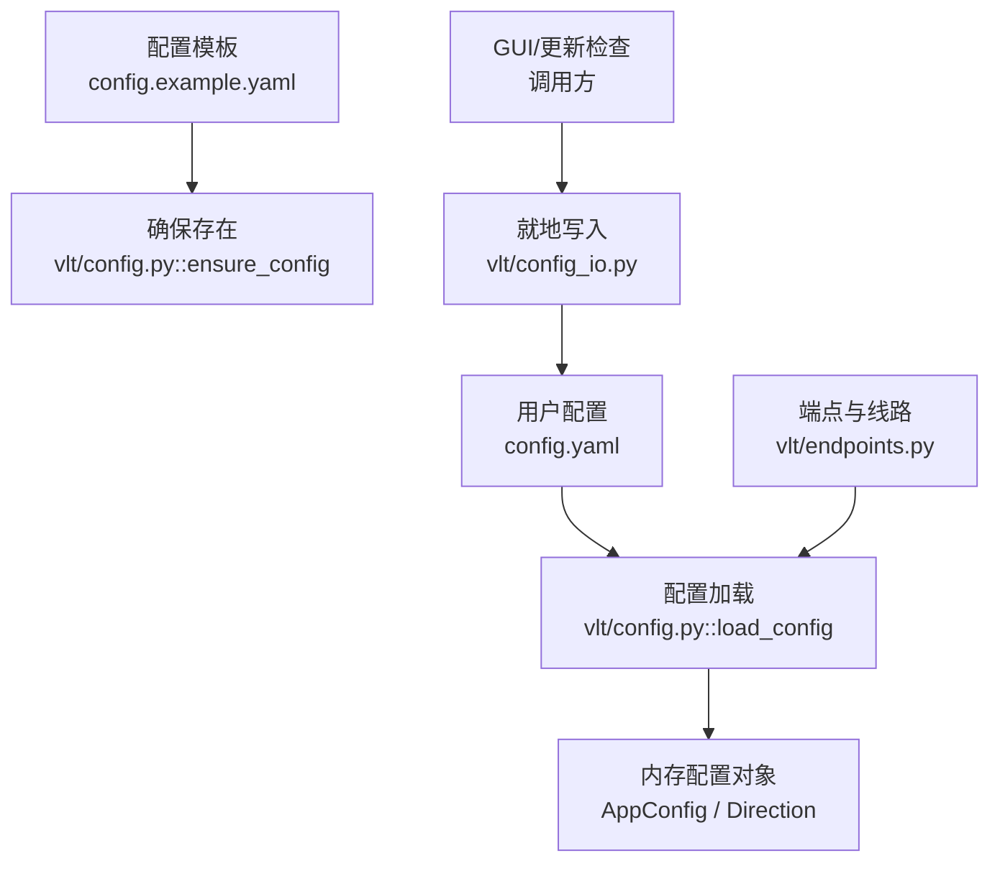
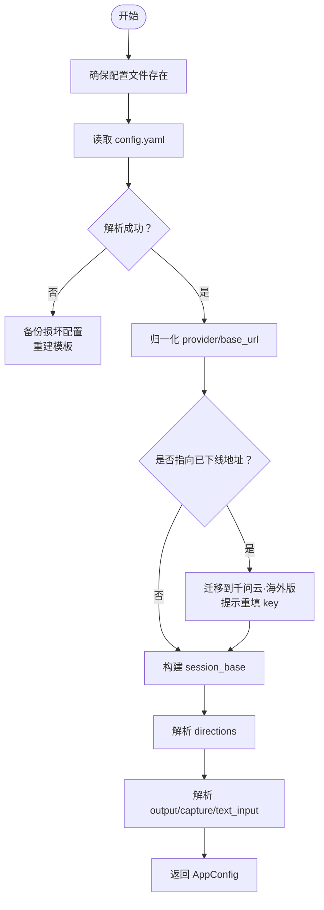
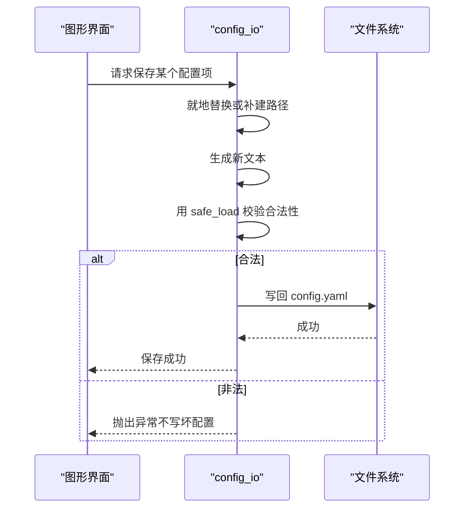
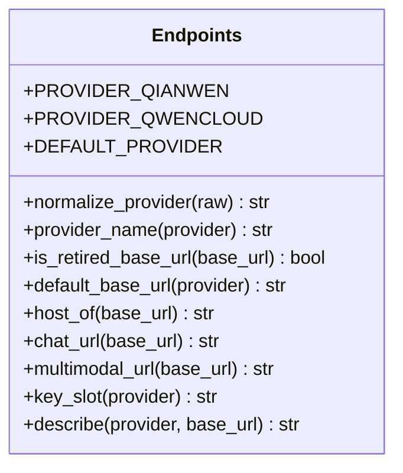
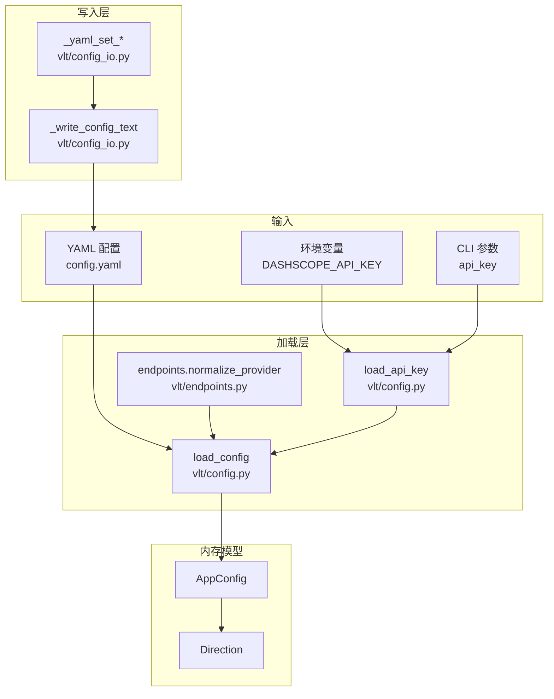
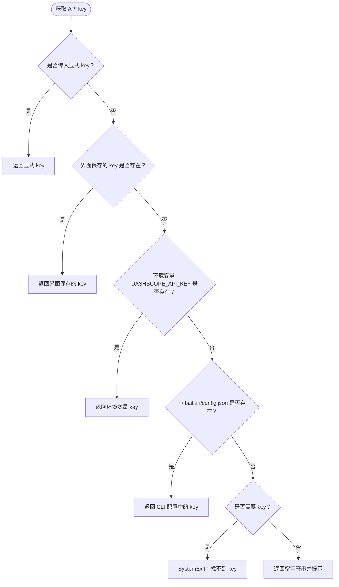
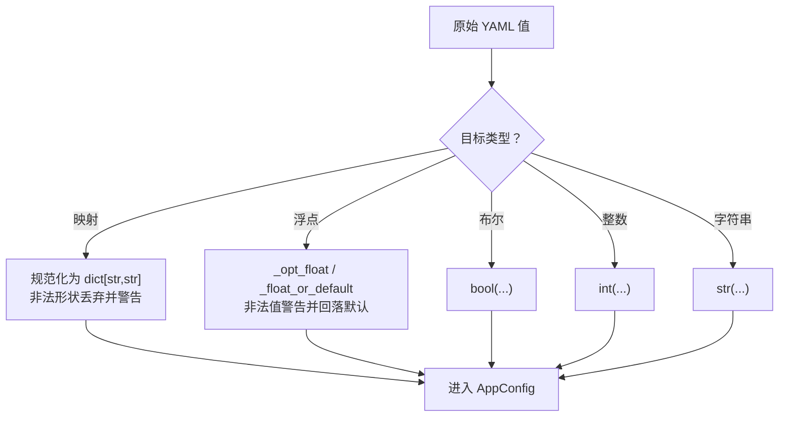
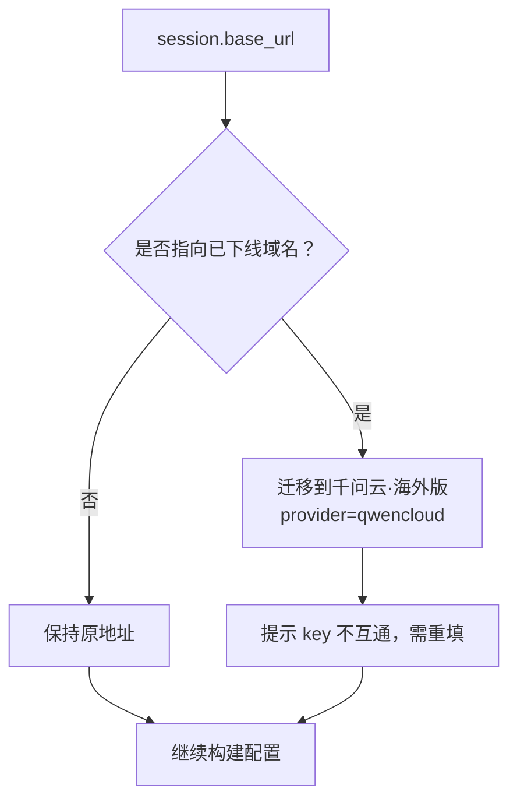
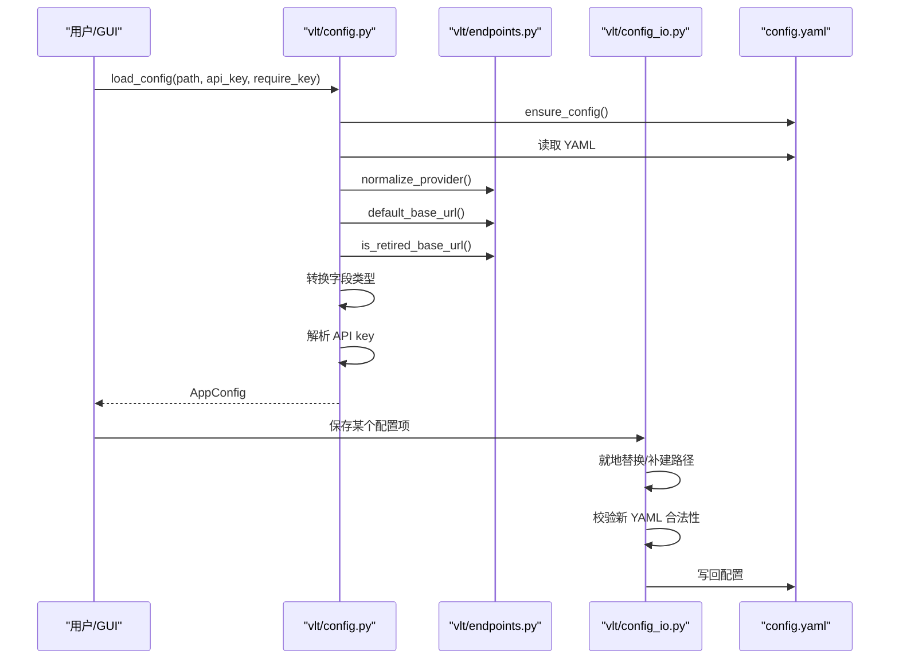
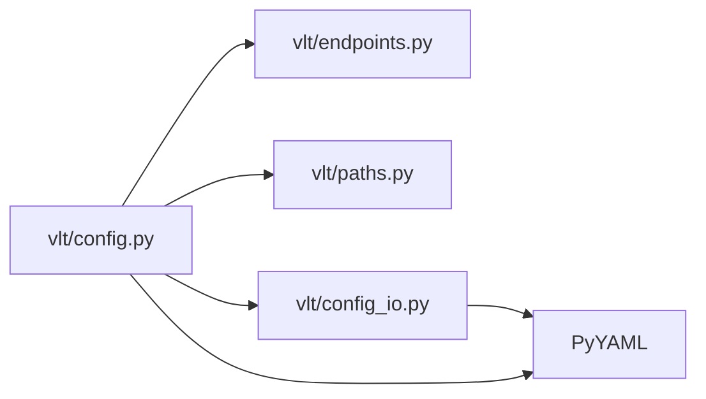

# 配置管理系统

<cite>
**本文引用的文件**   
- [config.example.yaml](file://config.example.yaml)
- [vlt/config.py](file://vlt/config.py)
- [vlt/config_io.py](file://vlt/config_io.py)
- [vlt/endpoints.py](file://vlt/endpoints.py)
- [README.md](file://README.md)
</cite>

## 目录
1. [引言](#引言)
2. [项目结构](#项目结构)
3. [核心组件](#核心组件)
4. [架构总览](#架构总览)
5. [详细组件分析](#详细组件分析)
6. [依赖关系分析](#依赖关系分析)
7. [性能与稳定性考量](#性能与稳定性考量)
8. [故障排查指南](#故障排查指南)
9. [结论](#结论)
10. [附录：YAML 配置项速查](#附录yaml-配置项速查)

## 引言
本文件系统性地说明 VRChat 实时同传项目的“配置管理系统”，覆盖以下目标：
- YAML 配置文件结构与全部选项含义、默认值、使用场景。
- 环境变量机制与优先级规则，特别是 API key 的加载顺序。
- 动态配置更新（热重载）的实现原理与使用方法。
- 配置验证机制、数据类型转换与容错策略。
- 完整的配置示例与最佳实践建议。
- 配置文件的加载、解析、验证与保存流程。
- 配置迁移与版本兼容性处理。
- 常见配置问题的排查方法与解决方案。

该项目在 Windows 与 Linux 上共用同一份 `config.yaml`，语义一致；图形界面会就地修改该文件，保留注释、空行与键顺序，避免破坏可读性。

**章节来源**
- [README.md:11-14](file://README.md#L11-L14)

## 项目结构
配置相关代码集中在两个模块：
- `vlt/config.py`：负责确保模板存在、加载 YAML、合并方向配置、归一化线路、解析 API key、构建内存中的 `AppConfig`。
- `vlt/config_io.py`：负责把用户通过界面改动的设置“就地”写回 `config.yaml`，并保证输出仍是合法 YAML。
- `vlt/endpoints.py`：作为出网端点的单一真相源，提供两条服务线路的地址派生、provider 归一化、已下线地址识别等能力。
- `config.example.yaml`：随程序分发的模板，首次运行缺失时会被复制为 `config.yaml`。

**图表来源**
- [vlt/config.py:21-23](file://vlt/config.py#L21-L23)
- [vlt/config.py:51-65](file://vlt/config.py#L51-L65)
- [vlt/config.py:258-405](file://vlt/config.py#L258-L405)
- [vlt/config_io.py:16-88](file://vlt/config_io.py#L16-L88)
- [vlt/config_io.py:91-186](file://vlt/config_io.py#L91-L186)
- [vlt/endpoints.py:107-128](file://vlt/endpoints.py#L107-L128)

**章节来源**
- [vlt/config.py:21-23](file://vlt/config.py#L21-L23)
- [vlt/config_io.py:1-6](file://vlt/config_io.py#L1-L6)
- [vlt/endpoints.py:1-48](file://vlt/endpoints.py#L1-L48)
- [config.example.yaml:1-11](file://config.example.yaml#L1-L11)

## 核心组件
### 配置加载入口
`load_config` 是配置系统的核心入口，完成以下工作：
1. 确保配置文件存在：若不存在则从模板复制。
2. 读取并解析 YAML。
3. 对损坏的配置进行备份并重建默认配置。
4. 归一化 provider 与 base_url，处理已下线线路迁移。
5. 校验并转换数值字段，非法值留痕后回落默认值。
6. 按线路槽位解析 API key。
7. 构造 `AppConfig` 与 `Direction` 对象供上层使用。

**图表来源**
- [vlt/config.py:51-65](file://vlt/config.py#L51-L65)
- [vlt/config.py:258-336](file://vlt/config.py#L258-L336)
- [vlt/config.py:337-405](file://vlt/config.py#L337-L405)

**章节来源**
- [vlt/config.py:51-65](file://vlt/config.py#L51-L65)
- [vlt/config.py:258-405](file://vlt/config.py#L258-L405)

### 配置写入与热更新
`config_io.py` 提供“就地改写”能力，不整文件重写，从而保留注释、空行和键顺序。关键函数包括：
- `_yaml_set_in_text`：就地修改叶子值。
- `_yaml_set_or_create`：父级缺失时补建路径链。
- `_yaml_set_mapping`：整段写入映射表（如专有词库）。
- `_write_config_text`：写前校验 YAML 合法性，失败则拒绝写入。

**图表来源**
- [vlt/config_io.py:16-88](file://vlt/config_io.py#L16-L88)
- [vlt/config_io.py:91-186](file://vlt/config_io.py#L91-L186)
- [vlt/config_io.py:198-270](file://vlt/config_io.py#L198-L270)
- [vlt/config_io.py:273-283](file://vlt/config_io.py#L273-L283)

**章节来源**
- [vlt/config_io.py:1-6](file://vlt/config_io.py#L1-L6)
- [vlt/config_io.py:16-88](file://vlt/config_io.py#L16-L88)
- [vlt/config_io.py:91-186](file://vlt/config_io.py#L91-L186)
- [vlt/config_io.py:198-270](file://vlt/config_io.py#L198-L270)
- [vlt/config_io.py:273-283](file://vlt/config_io.py#L273-L283)

### 端点与线路管理
`endpoints.py` 是出网端点的单一真相源，定义两条互斥线路：
- 千问云（国内）：默认 provider。
- 千问云·海外版：面向海外用户。

它还提供：
- provider 归一化与已下线线路别名。
- 已下线 base_url 识别与迁移。
- 从 base_url 派生 chat/TTS 端点。
- 密钥槽名映射。

**图表来源**
- [vlt/endpoints.py:53-104](file://vlt/endpoints.py#L53-L104)
- [vlt/endpoints.py:107-128](file://vlt/endpoints.py#L107-L128)
- [vlt/endpoints.py:141-156](file://vlt/endpoints.py#L141-L156)
- [vlt/endpoints.py:162-223](file://vlt/endpoints.py#L162-L223)

**章节来源**
- [vlt/endpoints.py:1-48](file://vlt/endpoints.py#L1-L48)
- [vlt/endpoints.py:107-128](file://vlt/endpoints.py#L107-L128)
- [vlt/endpoints.py:141-156](file://vlt/endpoints.py#L141-L156)
- [vlt/endpoints.py:162-223](file://vlt/endpoints.py#L162-L223)

## 架构总览
配置系统由“加载层”和“写入层”组成，中间以内存对象连接，外部通过 GUI 或命令行触发。

**图表来源**
- [vlt/config.py:68-104](file://vlt/config.py#L68-L104)
- [vlt/config.py:258-336](file://vlt/config.py#L258-L336)
- [vlt/config_io.py:273-283](file://vlt/config_io.py#L273-L283)
- [vlt/endpoints.py:107-128](file://vlt/endpoints.py#L107-L128)

## 详细组件分析

### YAML 配置结构与选项说明
`config.example.yaml` 是完整模板，包含以下主要段落：

| 段落 | 作用 | 关键字段 | 默认行为 |
|---|---|---|---|
| `session` | 实时会话基础配置 | model、provider、base_url、voice、turn_detection、final_silence_s、fast_final_silence_s、fast_final_user_quiet_s、max_new_sessions_per_minute、reconnect_backoff、silence_gate_enabled、silence_gate_after_s、silence_gate_preroll_s、repeat_guard_enabled、repeat_guard_hits、repeat_guard_ratio | 默认使用千问云国内线路、Tina 音色、静默兜底约 3 秒、快封句阈值约 1.1 秒 |
| `capture` | 音频采集与输入门限 | mic_device、loopback_device、gate_enabled、gate_db、gate_hold_ms、gate_preroll_ms | 设备为空表示自动检测；输入门限默认开启，过滤低响度块 |
| `directions` | 翻译方向 | mine/theirs 下的 source_lang、target_lang、output_audio、hotwords | 未配置时默认 mine=zh→en |
| `glossary` | 全局专有词库 | 原文→译名映射 | 空映射 |
| `chatbox` | OSC 聊天框输出 | host、port、max_chars、max_lines、interval_s、bucket_capacity、bucket_window_s、min_gap_s、notification_sound | 默认 127.0.0.1:9000 |
| `merger` | 增量合并节奏 | interval_s、carry_over | 默认每 2 秒快照一次 |
| `overlay` | VR 手腕屏显示 | enabled、backend、interval_s、anchor、tracker_index、offsets、offset、size_px、font、font_size、source_font_size、max_lines、show_source、fade_after_s、配色相关字段 | 默认启用、右手腕锚点 |
| `desktop_overlay` | PC 桌面字幕 | enabled、mode、backend、attach_to_game、game_title、anchor、offset、pos、size_px、alpha、字体与透明度字段 | 默认关闭 |
| `output.audio` | 译音输出 | enabled、device、device_name、sample_rate、buffer_ms、max_buffer_ms | 默认关闭，Windows 虚拟声卡回退链 |
| `text_input` | 打字输入与 TTS | enabled、model、timeout_s、tts.enabled/model/voice/stream/timeout_s | 默认启用，TTS 默认流式合成 |
| `room` | 多人房间中继 | enabled、server_url、room_code、nickname、token、broadcast_source、show_remote、max_peers、reconnect_backoff、heartbeat_s | 默认关闭 |
| `ui` | 界面状态 | direction、chatbox、overlay、desktop_overlay | 启动时恢复上次选择 |

这些字段的类型、默认值和约束在 `load_config` 中统一转换；非法值通常打印警告并回落默认值，而不是让程序崩溃。

**章节来源**
- [config.example.yaml:13-71](file://config.example.yaml#L13-L71)
- [config.example.yaml:73-95](file://config.example.yaml#L73-L95)
- [config.example.yaml:97-137](file://config.example.yaml#L97-L137)
- [config.example.yaml:139-152](file://config.example.yaml#L139-L152)
- [config.example.yaml:154-235](file://config.example.yaml#L154-L235)
- [config.example.yaml:237-284](file://config.example.yaml#L237-L284)
- [config.example.yaml:286-301](file://config.example.yaml#L286-L301)
- [config.example.yaml:303-321](file://config.example.yaml#L303-L321)
- [config.example.yaml:323-337](file://config.example.yaml#L323-L337)
- [config.example.yaml:339-345](file://config.example.yaml#L339-L345)
- [vlt/config.py:307-405](file://vlt/config.py#L307-L405)

### 环境变量与 API key 优先级
API key 的加载顺序如下：
1. 显式传入的 `api_key` 参数。
2. 界面保存的 key（按线路槽位区分）。
3. 环境变量 `DASHSCOPE_API_KEY`。
4. `~/.bailian/config.json` 中的 api_key/apiKey/DASHSCOPE_API_KEY。

如果以上都找不到且需要 key，则直接退出；如果不需要强制 key（例如界面启动阶段），则返回空串并给出提示。

**图表来源**
- [vlt/config.py:68-104](file://vlt/config.py#L68-L104)
- [vlt/config.py:217-234](file://vlt/config.py#L217-L234)

**章节来源**
- [vlt/config.py:68-104](file://vlt/config.py#L68-L104)
- [vlt/config.py:217-234](file://vlt/config.py#L217-L234)

### 动态配置更新机制
动态配置更新的核心是“就地写入 + 写前校验”：
- GUI 或更新检查逻辑调用 `config_io.py` 中的写入函数。
- 写入函数根据路径定位目标键，就地替换值或删除旧的多行块。
- 如果父级键缺失，则补建路径链。
- 写之前用 `yaml.safe_load` 校验生成的新文本是否为合法 YAML。
- 只有合法时才真正写回磁盘。

这种设计保证：
- 用户的注释、空行、键顺序尽量不被破坏。
- 不会因为一个滑块改动就毁掉整个配置文件。
- 老配置缺少新字段时也能补建。

**章节来源**
- [vlt/config_io.py:16-88](file://vlt/config_io.py#L16-L88)
- [vlt/config_io.py:91-186](file://vlt/config_io.py#L91-L186)
- [vlt/config_io.py:198-270](file://vlt/config_io.py#L198-L270)
- [vlt/config_io.py:273-283](file://vlt/config_io.py#L273-L283)

### 配置验证与数据类型转换
配置验证采用“宽松解析 + 明确留痕 + 安全回落”的策略：
- 映射类字段（如 glossary、hotwords）会被规范化为 `dict[str, str]`，非法形状被忽略并打印警告。
- 浮点字段使用 `_opt_float` 或 `_float_or_default` 转换：非法值打印警告并回落默认值；`null` 可明确表示关闭某功能。
- 布尔字段通过 `bool(...)` 转换。
- 整数字段通过 `int(...)` 转换。
- 字符串字段通过 `str(...)` 转换。
- provider 通过 `endpoints.normalize_provider` 归一化，非法值留痕后回落默认。
- base_url 通过 `endpoints.default_base_url` 推导默认值，并识别已下线地址进行迁移。

**图表来源**
- [vlt/config.py:26-48](file://vlt/config.py#L26-L48)
- [vlt/config.py:190-214](file://vlt/config.py#L190-L214)
- [vlt/config.py:307-405](file://vlt/config.py#L307-L405)
- [vlt/endpoints.py:107-128](file://vlt/endpoints.py#L107-L128)

**章节来源**
- [vlt/config.py:26-48](file://vlt/config.py#L26-L48)
- [vlt/config.py:190-214](file://vlt/config.py#L190-L214)
- [vlt/config.py:307-405](file://vlt/config.py#L307-L405)
- [vlt/endpoints.py:107-128](file://vlt/endpoints.py#L107-L128)

### 配置迁移与版本兼容性
配置迁移主要体现在两个方面：
1. **已下线线路迁移**：如果 `base_url` 指向已下线的阿里云百炼·国际版域名，系统会将其迁移到千问云·海外版，并提示用户重新填写对应线路的 key。
2. **provider 别名兼容**：`bailian_intl`、`bailian`、`dashscope_intl` 等旧 provider 会被归一化为现行线路。

此外，`ensure_config` 保证首次运行能从模板生成 `config.yaml`，避免新用户因缺少配置而无法启动。

**图表来源**
- [vlt/config.py:291-306](file://vlt/config.py#L291-L306)
- [vlt/endpoints.py:141-156](file://vlt/endpoints.py#L141-L156)
- [vlt/endpoints.py:162-171](file://vlt/endpoints.py#L162-L171)

**章节来源**
- [vlt/config.py:291-306](file://vlt/config.py#L291-L306)
- [vlt/endpoints.py:141-156](file://vlt/endpoints.py#L141-L156)
- [vlt/endpoints.py:162-171](file://vlt/endpoints.py#L162-L171)

### 配置加载、解析、验证与保存流程
整体流程如下：

**图表来源**
- [vlt/config.py:51-65](file://vlt/config.py#L51-L65)
- [vlt/config.py:258-336](file://vlt/config.py#L258-L336)
- [vlt/config.py:337-405](file://vlt/config.py#L337-L405)
- [vlt/config_io.py:16-88](file://vlt/config_io.py#L16-L88)
- [vlt/config_io.py:273-283](file://vlt/config_io.py#L273-L283)

**章节来源**
- [vlt/config.py:51-65](file://vlt/config.py#L51-L65)
- [vlt/config.py:258-405](file://vlt/config.py#L258-L405)
- [vlt/config_io.py:16-88](file://vlt/config_io.py#L16-L88)
- [vlt/config_io.py:273-283](file://vlt/config_io.py#L273-L283)

## 依赖关系分析
配置系统内部依赖清晰：
- `config.py` 依赖 `endpoints.py` 做线路归一化和地址派生。
- `config.py` 依赖 `paths.py` 确定 APP_DIR 与 BUNDLE_DIR。
- `config_io.py` 是纯文本操作模块，只依赖 `re`、`yaml`、`pathlib`，便于 GUI 和更新检查复用。
- `config.py` 不直接 import GUI，避免循环依赖。

**图表来源**
- [vlt/config.py:1-18](file://vlt/config.py#L1-L18)
- [vlt/config_io.py:1-13](file://vlt/config_io.py#L1-L13)

**章节来源**
- [vlt/config.py:1-18](file://vlt/config.py#L1-L18)
- [vlt/config_io.py:1-13](file://vlt/config_io.py#L1-L13)

## 性能与稳定性考量
- **配置解析失败保护**：YAML 解析失败时会备份损坏文件并重建默认配置，避免下次启动也失败。
- **写入前校验**：所有就地写入都会先校验新文本是否为合法 YAML，失败则拒绝写入。
- **非法值不静默**：provider、浮点字段、映射字段等非法值会打印警告，但不会让程序崩溃。
- **API key 不写入配置文件**：key 只从环境变量、界面保存位置或 CLI 配置读取，降低泄露风险。
- **线路地址单一真相源**：base_url 是唯一地址真相源，其他 HTTP 端点从 host 派生，减少漂移。

[本节为通用指导，不直接分析具体文件]

## 故障排查指南
### 常见问题与解决思路
| 问题 | 可能原因 | 排查方法 | 解决方案 |
|---|---|---|---|
| 启动时报找不到 API key | 未设置环境变量、未保存 key、CLI 配置缺失 | 检查日志中 key 来源提示 | 在界面设置中保存 key，或设置 `DASHSCOPE_API_KEY`，或执行 `bl auth login --api-key` |
| 切换线路后仍连国内地址 | 手动改了 provider 但没改 base_url | 查看日志中 provider 与 base_url 是否匹配 | 在界面“常规”中切换线路，让 base_url 同步更新 |
| 配置保存后下次启动报错 | 就地写入留下孤立多行块或非法 YAML | 检查 `config.yaml.broken` | 删除损坏配置后重启，让模板重新生成 |
| 热词不生效 | glossary/hotwords 不是映射表，或键/值为空 | 检查 YAML 中映射形状 | 写成 `"原文": "译名"`，确保键值非空 |
| 快封句提前封句 | fast_final_silence_s 过小 | 调整该值 | 增大快封句阈值，或写 null 关闭快路径 |
| 别人说话被误判为静音 | gate_db 过高或环境噪声大 | 观察输入门限效果 | 调低 gate_db，或调整 hold/preroll |
| 手腕屏位姿异常 | anchor 选错或左右手镜像错误 | 检查 overlay.offsets | 按平台文档调整 tracker_index 或镜像 left_hand |

**章节来源**
- [vlt/config.py:68-104](file://vlt/config.py#L68-L104)
- [vlt/config.py:237-256](file://vlt/config.py#L237-L256)
- [vlt/config.py:265-282](file://vlt/config.py#L265-L282)
- [vlt/config.py:26-48](file://vlt/config.py#L26-L48)
- [vlt/config.py:190-214](file://vlt/config.py#L190-L214)
- [vlt/config_io.py:273-283](file://vlt/config_io.py#L273-L283)

## 结论
VRChat 实时同传的配置管理系统以“YAML 模板 + 用户配置 + 就地写入 + 严格校验”为核心设计：
- 模板保证开箱即用。
- 加载层负责归一化、迁移、类型转换和 key 解析。
- 写入层保证注释可读性和配置合法性。
- 端点模块保证线路与地址一致性。
- 整体策略偏向“健壮、可诊断、不静默失败”。

对于用户而言，最安全的做法是：
- 优先通过界面修改配置。
- 如需手写 YAML，参考模板注释。
- 遇到异常先看日志中的 `[config]` 或 `[endpoints]` 提示。
- 不要直接把 API key 提交到仓库。

[本节为总结性内容，不直接分析具体文件]

## 附录：YAML 配置项速查
以下为常用配置项的快速索引，完整语义请参考模板与加载逻辑：

| 配置路径 | 类型 | 默认值 | 说明 |
|---|---|---|---|
| `session.model` | 字符串 | `qwen3.8-livetranslate-flash-realtime` | 实时模型名称 |
| `session.provider` | 字符串 | `qianwen` | 服务线路 |
| `session.base_url` | 字符串 | 由 provider 派生 | 唯一地址真相源 |
| `session.voice` | 字符串 | `Tina` | 实时译音音色 |
| `session.turn_detection` | 字符串或 null | null | 断句策略 |
| `session.final_silence_s` | 浮点数 | 来自会话默认 | 静默兜底时长 |
| `session.fast_final_silence_s` | 浮点数或 null | 来自会话默认 | 快封句文字静默阈值 |
| `session.fast_final_user_quiet_s` | 浮点数 | 来自会话默认 | 上游安静判定阈值 |
| `session.max_new_sessions_per_minute` | 整数 | 4 | 每分钟新建会话上限 |
| `session.reconnect_backoff` | 列表 | `[2,5,10,30]` | 重连退避间隔 |
| `session.silence_gate_enabled` | 布尔 | true | 长静音闸门开关 |
| `session.silence_gate_after_s` | 浮点数 | 30 | 连续静音超过该值暂停上送 |
| `session.silence_gate_preroll_s` | 浮点数 | 1.0 | 恢复时补发 preroll |
| `session.repeat_guard_enabled` | 布尔 | true | 本地重复抑制开关 |
| `session.repeat_guard_hits` | 整数 | 3 | 连续重复条数阈值 |
| `session.repeat_guard_ratio` | 浮点数 | 0.9 | 相似度阈值 |
| `capture.mic_device` | 字符串 | 空 | 麦克风设备名 |
| `capture.loopback_device` | 字符串 | 空 | loopback 设备名 |
| `capture.gate_enabled` | 布尔 | true | 输入门限开关 |
| `capture.gate_db` | 浮点数 | -45.0 | 输入门限 dB |
| `capture.gate_hold_ms` | 整数 | 500 | 门限保持时间 |
| `capture.gate_preroll_ms` | 整数 | 250 | 开闸前补发时长 |
| `directions.<name>.source_lang` | 字符串或 null | null | 源语言 |
| `directions.<name>.target_lang` | 字符串 | en | 目标语言 |
| `directions.<name>.output_audio` | 布尔 | false | 是否输出译音 |
| `directions.<name>.hotwords` | 映射 | {} | 方向级热词 |
| `glossary` | 映射 | {} | 全局专有词库 |
| `chatbox.port` | 整数 | 9000 | VRChat OSC 端口 |
| `overlay.backend` | 字符串 | auto | 手腕屏后端 |
| `overlay.anchor` | 字符串 | right_hand | 锚点 |
| `output.audio.enabled` | 布尔 | false | 译音输出开关 |
| `text_input.enabled` | 布尔 | true | 打字输入开关 |
| `text_input.tts.stream` | 布尔 | true | TTS 流式合成 |
| `room.enabled` | 布尔 | false | 房间中继开关 |
| `ui.direction` | 字符串 | mine | 界面默认方向 |

**章节来源**
- [config.example.yaml:13-345](file://config.example.yaml#L13-L345)
- [vlt/config.py:307-405](file://vlt/config.py#L307-L405)