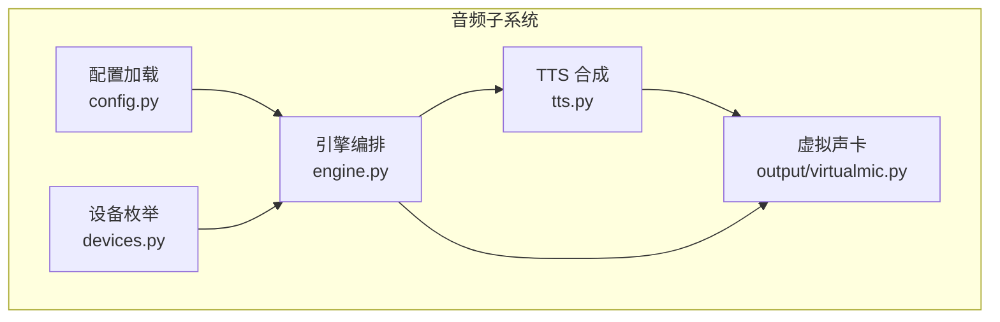
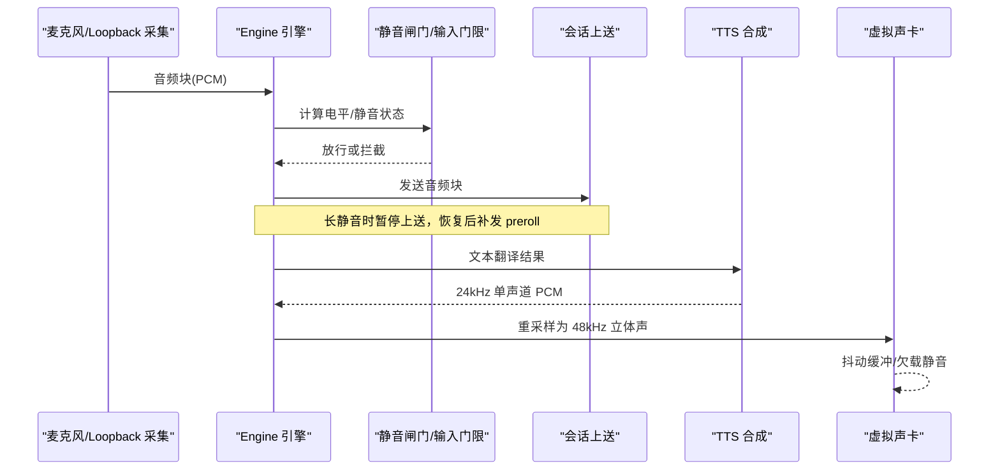
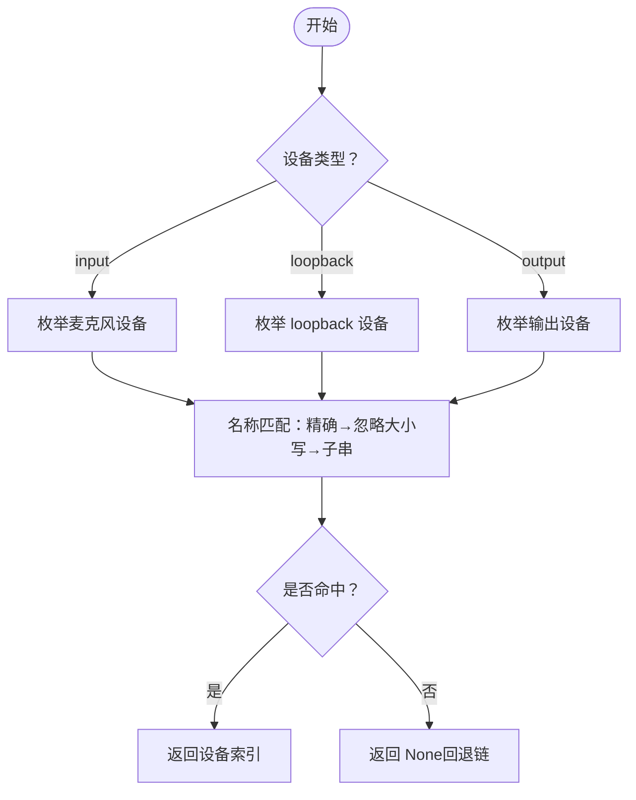
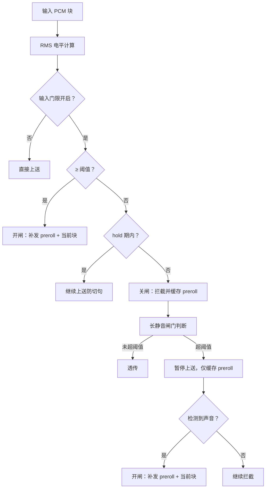
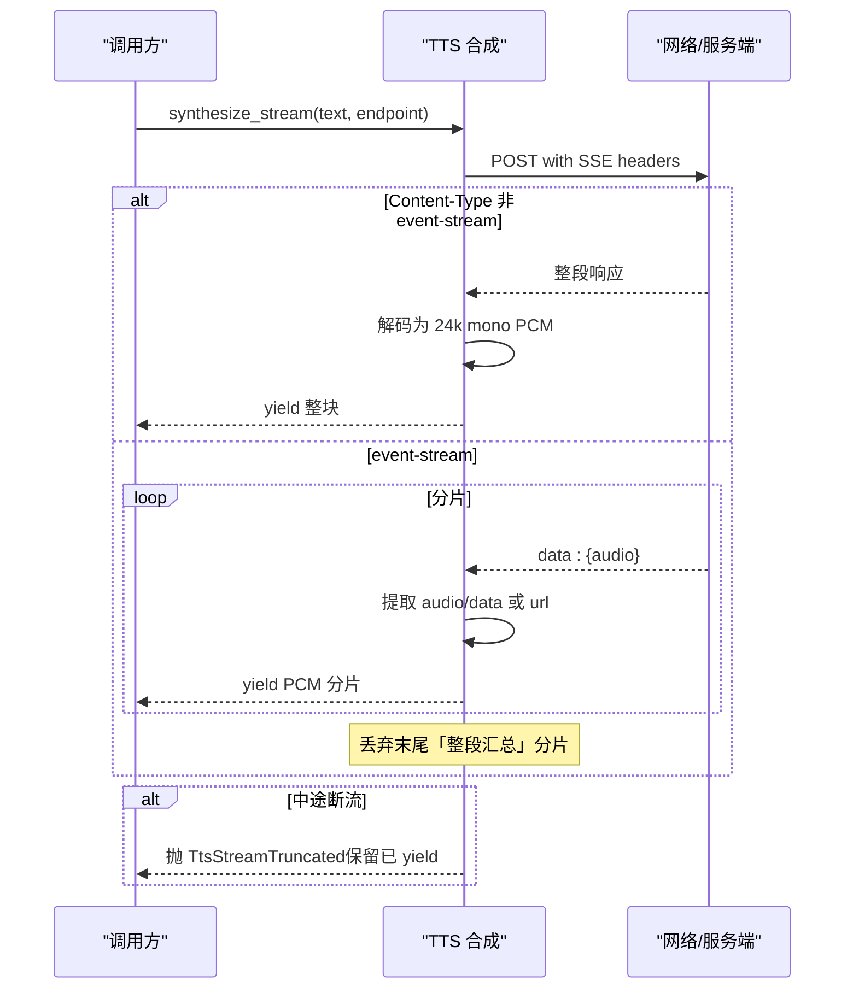
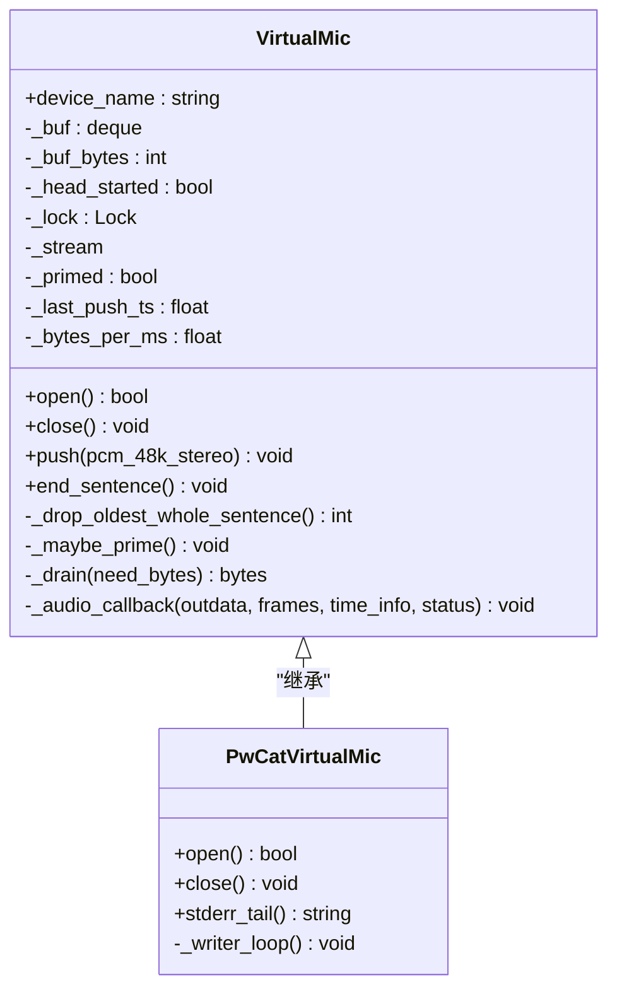
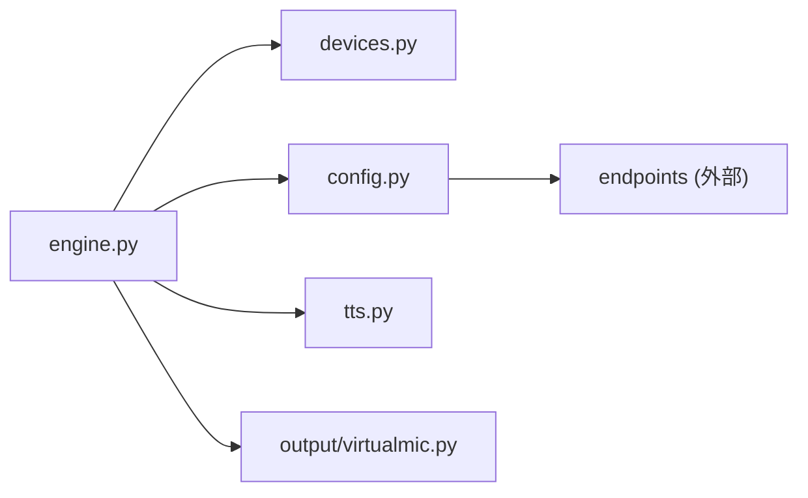

# 音频处理系统

<cite>
**本文引用的文件**   
- [devices.py](file://vlt/devices.py)
- [engine.py](file://vlt/engine.py)
- [config.py](file://vlt/config.py)
- [tts.py](file://vlt/tts.py)
- [virtualmic.py](file://vlt/output/virtualmic.py)
</cite>

## 目录
1. [简介](#简介)
2. [项目结构](#项目结构)
3. [核心组件](#核心组件)
4. [架构总览](#架构总览)
5. [详细组件分析](#详细组件分析)
6. [依赖关系分析](#依赖关系分析)
7. [性能与调优](#性能与调优)
8. [故障排除与调试](#故障排除与调试)
9. [结论](#结论)

## 简介
本技术文档围绕仓库中的“音频处理系统”展开，重点覆盖以下目标：
- 音频设备管理：麦克风、系统音频捕获（loopback）、译音输出设备的枚举、名称解析与选择。
- 音频流处理管道：采样率转换、格式转换、静音检测、音量门限控制。
- 音频预处理算法：降噪思路、增益控制、音频质量优化策略。
- 跨平台差异与适配机制：Windows 与 Linux 在采集/输出路径上的不同实现。
- 配置最佳实践与性能调优建议。
- 故障排除与调试方法。

该系统以“引擎”为核心编排器，把输入采集、会话上送、TTS 合成、虚拟声卡输出等模块串联起来，并通过配置层提供可观测、可回退、可测试的健壮行为。

## 项目结构
从音频视角看，关键代码集中在以下模块：
- `vlt/devices.py`：设备枚举与名称解析，屏蔽底层平台差异。
- `vlt/engine.py`：引擎编排，负责采集循环、静音闸门、输入响度门限、重复抑制、TTS 播放调度。
- `vlt/config.py`：YAML + 环境变量加载，统一校验并回落默认值。
- `vlt/tts.py`：文本到语音合成（含流式 SSE），输出 24kHz 单声道 s16le PCM。
- `vlt/output/virtualmic.py`：虚拟声卡输出，包含重采样、抖动缓冲、欠载静音、Linux PipeWire 适配。

**图表来源**
- [devices.py:1-161](file://vlt/devices.py#L1-L161)
- [engine.py:446-740](file://vlt/engine.py#L446-L740)
- [config.py:258-406](file://vlt/config.py#L258-L406)
- [tts.py:142-331](file://vlt/tts.py#L142-L331)
- [virtualmic.py:22-49](file://vlt/output/virtualmic.py#L22-L49)

**章节来源**
- [devices.py:1-161](file://vlt/devices.py#L1-L161)
- [engine.py:446-740](file://vlt/engine.py#L446-L740)
- [config.py:258-406](file://vlt/config.py#L258-L406)
- [tts.py:142-331](file://vlt/tts.py#L142-L331)
- [virtualmic.py:22-49](file://vlt/output/virtualmic.py#L22-L49)

## 核心组件
- 设备抽象与名称解析：通过 `DeviceInfo` 和三类枚举函数，将平台原始设备表转换为统一结构，并提供按名称解析索引的能力。
- 引擎编排：封装线程/事件循环生命周期、采集循环、静音闸门、输入门限、重复抑制、TTS 播放、虚拟声卡驱动。
- 配置层：YAML 模板生成、字段校验、非法值留痕并回落默认值；API key 多来源读取。
- TTS 合成：同步与流式两种模式，统一输出 24kHz 单声道 s16le PCM，支持降级与断流保留。
- 虚拟声卡：24k 单声道 → 48k 立体声重采样，抖动缓冲、整句丢弃、欠载静音，Linux 走 `pw-cat` 管道。

**章节来源**
- [devices.py:30-161](file://vlt/devices.py#L30-L161)
- [engine.py:204-347](file://vlt/engine.py#L204-L347)
- [config.py:51-118](file://vlt/config.py#L51-L118)
- [tts.py:93-139](file://vlt/tts.py#L93-L139)
- [virtualmic.py:75-283](file://vlt/output/virtualmic.py#L75-L283)

## 架构总览
下图展示音频数据从采集到输出的主要流程，以及关键处理节点：

**图表来源**
- [engine.py:1019-1150](file://vlt/engine.py#L1019-L1150)
- [engine.py:204-347](file://vlt/engine.py#L204-L347)
- [tts.py:201-331](file://vlt/tts.py#L201-L331)
- [virtualmic.py:22-49](file://vlt/output/virtualmic.py#L22-L49)

## 详细组件分析

### 设备管理与名称解析
- 设备类型：
  - 麦克风（输入）：通过后端查询设备列表，筛选有输入通道的设备。
  - VRChat 音频（loopback）：Windows 使用 WASAPI loopback，Linux 使用 PipeWire 的 Audio/Sink。
  - 译音输出（输出）：筛选有输出通道的设备。
- 名称解析顺序：全名精确匹配 → 不区分大小写 → 去重子串匹配 → 返回 None（表示用默认/回退链）。
- 索引口径：优先 `pa_index`，没有则回落到列表下标，避免 Windows host API 过滤后索引错位。

**图表来源**
- [devices.py:39-102](file://vlt/devices.py#L39-L102)
- [devices.py:105-153](file://vlt/devices.py#L105-L153)

**章节来源**
- [devices.py:30-161](file://vlt/devices.py#L30-L161)

### 音频流处理管道
- 输入侧：
  - 每块约 100ms，16kHz s16le mono（用于输入门限与静音检测）。
  - 输入响度门限：基于 RMS 的 dBFS 阈值，带 hold 与 preroll，防止句子被切碎。
  - 长静音闸门：连续静音超过阈值后暂停上送，声音恢复时先补发 preroll，避免丢句首。
- 输出侧：
  - TTS 输出 24kHz 单声道 s16le PCM。
  - 重采样为 48kHz 立体声 s16le，写入虚拟声卡。
  - 虚拟声卡维护抖动缓冲，欠载时补静音，超限丢弃整句。

**图表来源**
- [engine.py:124-167](file://vlt/engine.py#L124-L167)
- [engine.py:204-347](file://vlt/engine.py#L204-L347)

**章节来源**
- [engine.py:124-167](file://vlt/engine.py#L124-L167)
- [engine.py:204-347](file://vlt/engine.py#L204-L347)

### TTS 合成与流式处理
- 同步合成：请求模型返回 base64 或 URL，解码为 24kHz 单声道 s16le PCM。
- 流式合成（SSE）：边生成边 yield PCM 分片，首包延迟显著降低；末尾汇总片段需丢弃以避免重复播放。
- 降级策略：
  - 服务端不支持 SSE → 退回整段合成。
  - 协议性错误码（如 400/406/415）→ 退回整段。
  - 中途断流 → 保留已 yield 的分片，抛出截断异常供调用方提示。

**图表来源**
- [tts.py:201-331](file://vlt/tts.py#L201-L331)

**章节来源**
- [tts.py:93-139](file://vlt/tts.py#L93-L139)
- [tts.py:142-331](file://vlt/tts.py#L142-L331)

### 虚拟声卡与重采样
- 重采样：24kHz 单声道 → 48kHz 立体声，采用线性插值 + 双声道复制，向量化实现提升性能。
- 输出驱动：
  - Windows：PortAudio RawOutputStream，回调驱动，blocksize 对齐 20ms。
  - Linux：`pw-cat --playback --raw --target=<节点>`，写线程驱动，语义与 PortAudio 一致。
- 缓冲策略：
  - 起播条件：攒够 buffer_ms 或停更超时 PRIME_TIMEOUT_S。
  - 超限策略：丢弃最旧完整一句，绝不切句；极端情况下退化丢 chunk 并告警。
  - 欠载：不足时补静音，保证下游不断流。

**图表来源**
- [virtualmic.py:75-283](file://vlt/output/virtualmic.py#L75-L283)
- [virtualmic.py:285-409](file://vlt/output/virtualmic.py#L285-L409)

**章节来源**
- [virtualmic.py:22-49](file://vlt/output/virtualmic.py#L22-L49)
- [virtualmic.py:75-283](file://vlt/output/virtualmic.py#L75-L283)
- [virtualmic.py:285-409](file://vlt/output/virtualmic.py#L285-L409)

### 跨平台差异与适配机制
- 设备枚举：
  - Windows：WASAPI loopback 作为 VRChat 音频源；sounddevice/pyaudiowpatch 提供设备列表。
  - Linux：PipeWire 的 Audio/Sink 作为 VRChat 音频源；输出走 `pw-cat` 而非 PortAudio。
- 输出路径：
  - Windows：PortAudio 回调驱动虚拟声卡。
  - Linux：`pw-cat` 进程管道驱动，复用父类缓冲与整句丢弃逻辑。
- 名称解析与回退链：
  - 设备名匹配不依赖索引，避免插拔/重启导致索引变化。
  - 输出设备选择按关键词回退链（如 voicemeeter input、cable input 等）。

**章节来源**
- [devices.py:1-22](file://vlt/devices.py#L1-L22)
- [virtualmic.py:285-409](file://vlt/output/virtualmic.py#L285-L409)

## 依赖关系分析
- 引擎依赖：
  - 设备枚举：`devices.enumerate_mic_devices`、`resolve_device_name`。
  - 平台抽象：`platform.device_backend()`、`platform.open_audio_out`。
  - TTS：`synthesize`、`synthesize_stream`。
  - 虚拟声卡：`VirtualMic`、`resample_24k_mono_to_48k_stereo`。
- 配置依赖：
  - YAML 模板生成、字段校验、API key 多来源读取。
  - 方向级热词与全局词库合并口径唯一。

**图表来源**
- [engine.py:21-38](file://vlt/engine.py#L21-L38)
- [config.py:14-18](file://vlt/config.py#L14-L18)

**章节来源**
- [engine.py:21-38](file://vlt/engine.py#L21-L38)
- [config.py:14-18](file://vlt/config.py#L14-L18)

## 性能与调优
- 重采样性能：使用 numpy 向量化实现 24k→48k 升采样与双声道复制，实测 8.56s 音频仅需 2ms。
- 流式 TTS：SSE 首包 0.36~0.42s，显著降低开口延迟；整段合成需等待 1.6~1.9s。
- 缓冲策略：
  - 虚拟声卡 buffer_ms 默认 300ms，max_buffer_ms 默认 2000ms；短于 buffer_ms 的译音通过 PRIME_TIMEOUT_S 兜底起播。
  - 超限丢弃整句，避免句中断；极端情况退化丢 chunk 并记录警告。
- 输入门限与静音闸门：
  - 输入门限基于 RMS，避免峰值噪声误触发；hold 期防切句，preroll 防丢句首。
  - 长静音闸门在连续静音超阈值后暂停上送，节省资源并避免服务端 repeat 掉线。

**章节来源**
- [virtualmic.py:22-49](file://vlt/output/virtualmic.py#L22-L49)
- [tts.py:201-331](file://vlt/tts.py#L201-L331)
- [engine.py:124-167](file://vlt/engine.py#L124-L167)
- [engine.py:204-347](file://vlt/engine.py#L204-L347)

## 故障排除与调试
- 设备问题：
  - 设备名解析失败：检查配置中的设备名是否与枚举结果匹配；注意大小写与子串匹配规则。
  - 输出设备打不开：查看虚拟声卡日志，确认是否回落到其他 host API 条目。
- TTS 问题：
  - 流式断流：关注 `TtsStreamTruncated` 异常，已 yield 部分保留；界面应显示“少半句”提示。
  - 协议不支持 SSE：自动退回整段合成，检查服务端响应头。
- 引擎问题：
  - 长静音闸门关闭：检查 `silence_gate_after_s` 与 `silence_gate_preroll_s` 配置是否合理。
  - 输入门限拦截过多：调整 `gate_db`、`gate_hold_ms`、`gate_preroll_ms`。
- 配置问题：
  - YAML 损坏：程序会备份 `.broken` 文件并重建默认配置；检查日志中的 `[config] ❌` 提示。
  - API key 缺失：根据日志指引填写 key，或使用环境变量 `DASHSCOPE_API_KEY`。

**章节来源**
- [devices.py:105-153](file://vlt/devices.py#L105-L153)
- [virtualmic.py:117-152](file://vlt/output/virtualmic.py#L117-L152)
- [tts.py:295-331](file://vlt/tts.py#L295-L331)
- [engine.py:204-347](file://vlt/engine.py#L204-L347)
- [config.py:258-305](file://vlt/config.py#L258-L305)

## 结论
该音频处理系统通过清晰的模块划分与健壮的错误处理机制，实现了跨平台的音频设备管理、流处理管道与 TTS 输出。其设计强调：
- 可测试性：设备枚举与名称解析完全离线可测。
- 可回退性：配置非法值留痕并回落默认，设备打开失败自动回退。
- 可观测性：大量日志与状态回调，便于定位问题。
- 高性能：向量化重采样、流式 TTS、智能缓冲策略。

在实际部署中，建议根据环境调整输入门限与静音闸门参数，选择合适的输出设备回退链，并利用日志与测试用例快速定位问题。