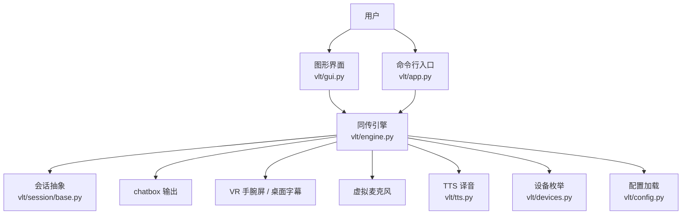
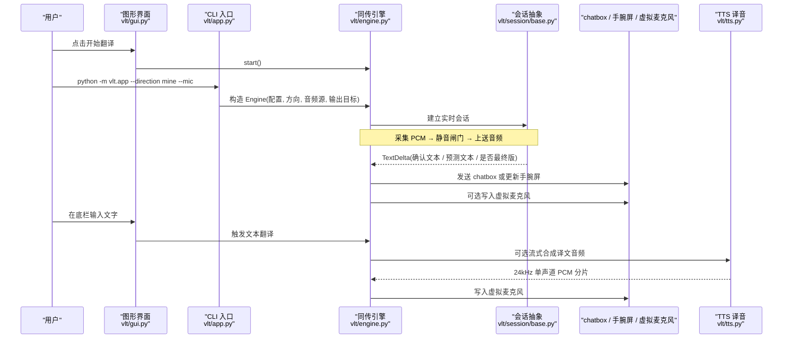
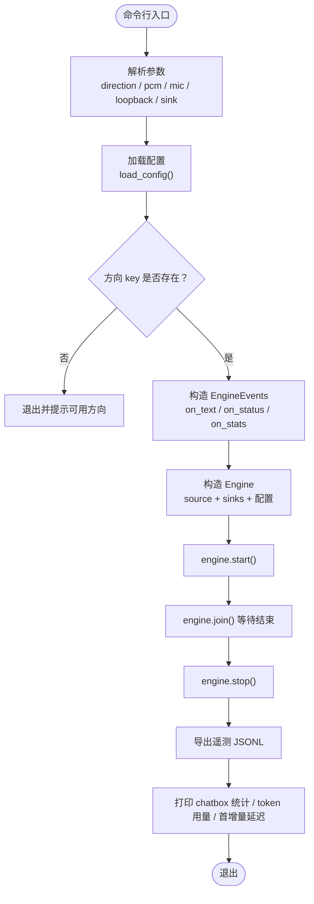
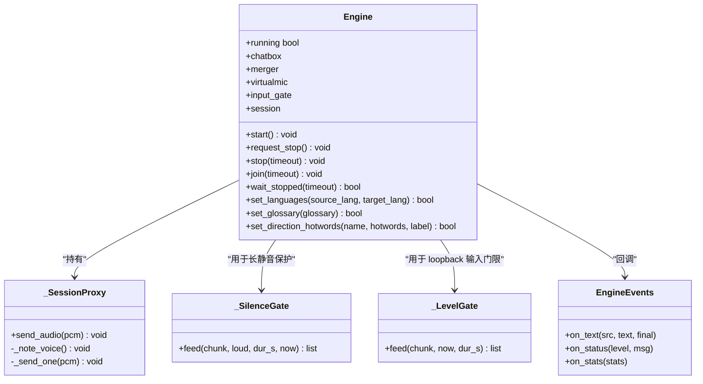
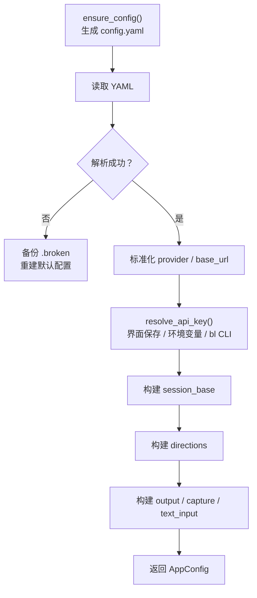
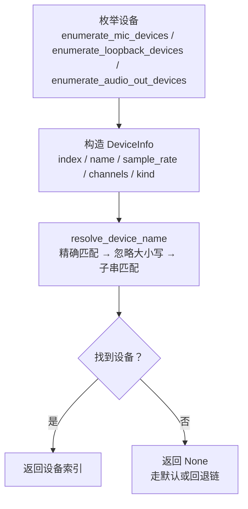
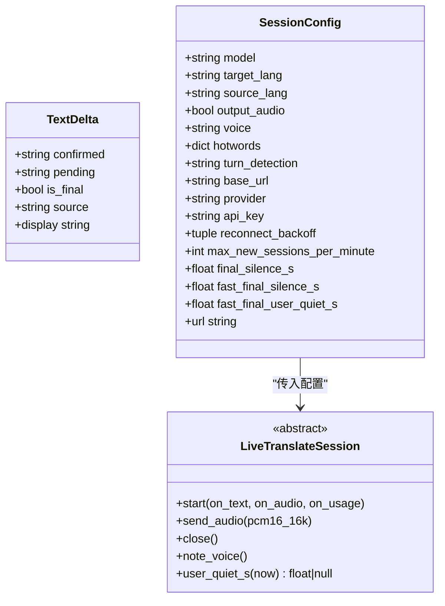
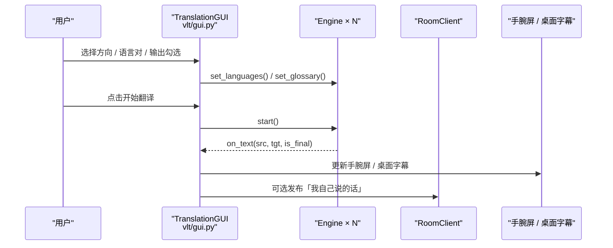
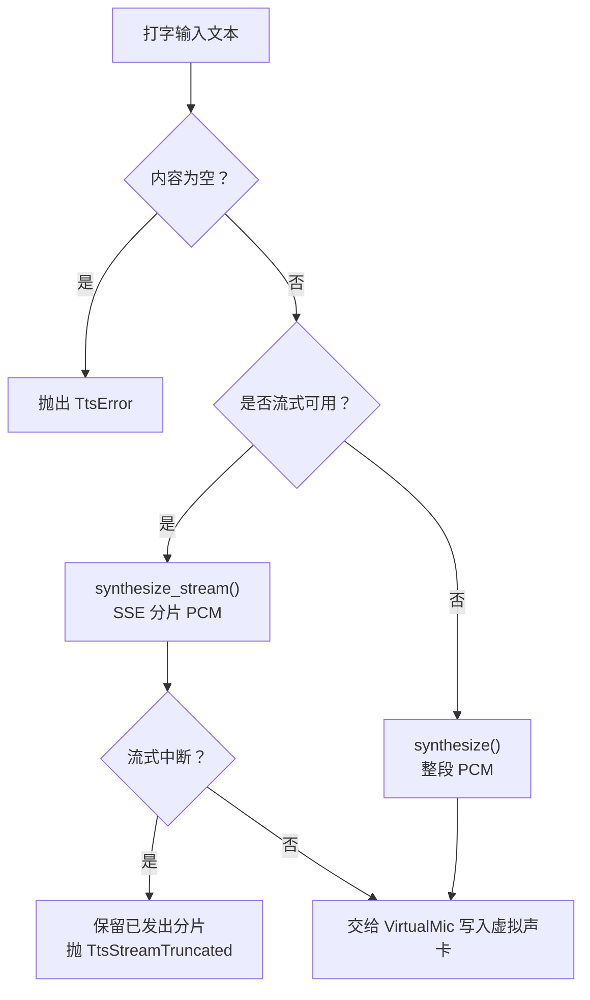
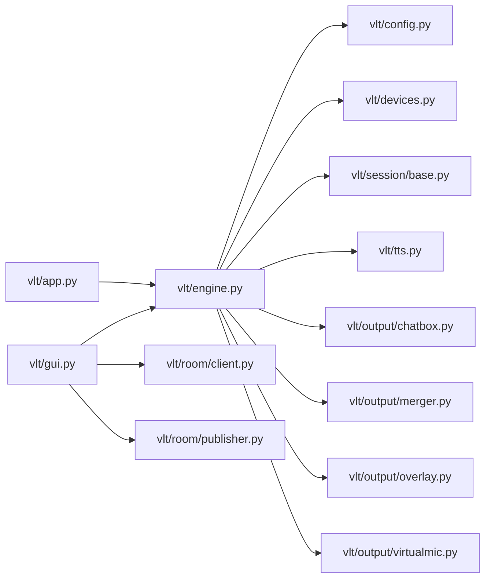

# 项目概述

<cite>
**本文引用的文件**   
- [README.md](file://README.md)
- [app.py](file://vlt/app.py)
- [engine.py](file://vlt/engine.py)
- [config.py](file://vlt/config.py)
- [devices.py](file://vlt/devices.py)
- [gui.py](file://vlt/gui.py)
- [tts.py](file://vlt/tts.py)
- [base.py](file://vlt/session/base.py)
</cite>

## 目录
1. [引言](#引言)
2. [项目结构](#项目结构)
3. [核心组件](#核心组件)
4. [架构总览](#架构总览)
5. [详细组件分析](#详细组件分析)
6. [依赖关系分析](#依赖关系分析)
7. [性能与实时性](#性能与实时性)
8. [故障排查指南](#故障排查指南)
9. [结论](#结论)
10. [附录：使用场景示例](#附录使用场景示例)

## 引言
VRChat 实时同传是一个面向 VRChat 的实时同声传译工具，目标是让不同语言的玩家在同一房间中更顺畅地交流。它的工作流程可以概括为：采集麦克风或游戏音频 → 调用千问云实时同传模型 → 把译文输出到 chatbox 气泡、VR 手腕屏，并可选把译音回灌进虚拟麦克风让对方直接听到。

项目支持 Windows 和 Linux 双平台，两端共用同一份 `config.yaml`，配置语义一致。面向初学者，它提供图形界面；面向开发者，它暴露可复用的 Engine 类、会话抽象、设备枚举、TTS 合成等模块。

**章节来源**
- [README.md:11-14](file://README.md#L11-L14)
- [README.md:28-47](file://README.md#L28-L47)

## 项目结构
仓库采用“应用入口 + 引擎层 + 配置/设备/会话/TTS + 图形界面”的分层组织方式：

- 顶层脚本负责打包、安装、启动 GUI 或 CLI。
- `vlt/` 是核心代码包：
  - `app.py`：CLI 主程序，解析参数、构造 Engine、统计遥测。
  - `engine.py`：可编程启停的同传引擎，串联音频源、会话、节流合并器、chatbox、overlay、虚拟麦克风。
  - `config.py`：YAML 配置加载、API key 读取、热词合并、方向配置。
  - `devices.py`：麦克风、loopback、输出设备的枚举与名称解析。
  - `session/base.py`：会话抽象、TextDelta、SessionConfig、快慢封句策略。
  - `tts.py`：打字输入的译音合成（SSE 流式优先）。
  - `gui.py`：Tkinter 图形界面，聚合两个方向的 Engine、手腕屏、桌面字幕、房间中继。
- `scripts/`、`tests/`、`docs/`、`assets/` 分别存放辅助脚本、测试、文档和资源。

**图表来源**
- [app.py:55-105](file://vlt/app.py#L55-L105)
- [engine.py:446-500](file://vlt/engine.py#L446-L500)
- [gui.py:194-215](file://vlt/gui.py#L194-L215)
- [config.py:157-187](file://vlt/config.py#L157-L187)
- [devices.py:30-37](file://vlt/devices.py#L30-L37)
- [tts.py:142-198](file://vlt/tts.py#L142-L198)
- [base.py:130-181](file://vlt/session/base.py#L130-L181)

**章节来源**
- [README.md:1-16](file://README.md#L1-L16)
- [app.py:1-14](file://vlt/app.py#L1-L14)
- [engine.py:1-4](file://vlt/engine.py#L1-L4)
- [config.py:1-24](file://vlt/config.py#L1-L24)
- [devices.py:1-22](file://vlt/devices.py#L1-L22)
- [gui.py:1-8](file://vlt/gui.py#L1-L8)

## 核心组件
本项目围绕五个核心能力展开：

| 功能 | 说明 | 主要实现位置 |
|---|---|---|
| chatbox 气泡翻译 | “我说”方向：语音转文本后发送到 VRChat chatbox，首个增量立即发，之后周期性刷新快照，句末必发最终版 | `vlt/output/chatbox.py`（由 engine 引用） |
| VR 手腕屏显示 | “别人说”方向：采集 VRChat 播放输出，翻译后渲染到 SteamVR overlay 或 OpenXR overlay | `vlt/output/overlay.py`（由 engine 引用） |
| 虚拟麦克风输出 | 把模型直出的译音重采样后写入虚拟声卡，让对方直接听见外语语音 | `vlt/output/virtualmic.py`（由 engine 引用）、`vlt/tts.py` |
| 键盘文本输入替代说话 | 界面底栏输入框回车即发，走与语音相同的下游路径；开启译音时再用 TTS 合成音频送入虚拟声卡 | `vlt/textin.py`（由 engine 引用）、`vlt/tts.py` |
| 多人房间字幕共享 | 多个客户端各自运行本程序，填写同一个房间码，互相在手腕屏或桌面字幕上看到彼此说的话 | `vlt/room/client.py`、`vlt/room/publisher.py`（由 gui 引用） |

这些能力统一由 Engine 编排：Engine 负责生命周期管理、事件回调、静音闸门、重复抑制、输入门限、chatbox 排空、虚拟麦克风串行写锁等。

**章节来源**
- [README.md:28-47](file://README.md#L28-L47)
- [engine.py:446-500](file://vlt/engine.py#L446-L500)
- [engine.py:515-527](file://vlt/engine.py#L515-L527)
- [engine.py:787-800](file://vlt/engine.py#L787-L800)
- [gui.py:546-591](file://vlt/gui.py#L546-L591)

## 架构总览
从数据流角度看，系统分为三条主线：

1. **语音输入线**：麦克风或 loopback 采集 PCM → 静音闸门 / 输入门限 → 实时会话 → 文本增量 → chatbox / 手腕屏。
2. **译音输出线**：实时模型返回音频 → 重采样 → 虚拟麦克风 → VRChat 拾取。
3. **文本输入线**：界面输入框 → 文本翻译接口 → 可选 TTS → 虚拟麦克风。

**图表来源**
- [app.py:55-105](file://vlt/app.py#L55-L105)
- [engine.py:446-500](file://vlt/engine.py#L446-L500)
- [engine.py:719-748](file://vlt/engine.py#L719-L748)
- [base.py:130-181](file://vlt/session/base.py#L130-L181)
- [tts.py:201-331](file://vlt/tts.py#L201-L331)
- [gui.py:546-591](file://vlt/gui.py#L546-L591)

## 详细组件分析

### 应用入口与命令行为
`vlt/app.py` 是 P1 主程序，负责：

- 解析命令行参数，例如 `--direction`、`--pcm`、`--mic`、`--loopback`、`--sink`、`--audio-out`、`--audio-device`。
- 加载配置，校验方向 key。
- 构造 `EngineEvents`，收集文本、状态、用量统计。
- 创建 `Engine`，启动、等待、停止，并输出 chatbox 发送统计、token 用量、首条增量延迟等。

**图表来源**
- [app.py:55-130](file://vlt/app.py#L55-L130)
- [app.py:133-161](file://vlt/app.py#L133-L161)

**章节来源**
- [app.py:1-14](file://vlt/app.py#L1-L14)
- [app.py:55-130](file://vlt/app.py#L55-L130)
- [app.py:133-161](file://vlt/app.py#L133-L161)

### 同传引擎
`vlt/engine.py` 是整个项目的调度中枢。它把以下职责封装成可启停对象：

- 生命周期：`start()`、`request_stop()`、`stop()`、`join()`、`wait_stopped()`。
- 音频采集循环：麦克风、PCM 文件、loopback。
- 静音闸门 `_SilenceGate`：长时间静音暂停上送，声音恢复时补发 preroll，防止服务端 repeat 掉线。
- 输入门限 `_LevelGate`：只作用于 loopback，按块 RMS 判断响度，低于阈值不上送。
- 本地重复抑制：检测连续高度雷同的最终译文，避免刷屏并重建会话。
- 会话代理 `_SessionProxy`：动态转发 `send_audio`，重连后自动落到新会话。
- 输出编排：chatbox、Merger、Overlay、VirtualMic。
- 词库热更新：全局 glossary 与方向级 hotwords 合并口径唯一。

**图表来源**
- [engine.py:204-267](file://vlt/engine.py#L204-L267)
- [engine.py:269-347](file://vlt/engine.py#L269-L347)
- [engine.py:349-353](file://vlt/engine.py#L349-L353)
- [engine.py:356-444](file://vlt/engine.py#L356-L444)
- [engine.py:446-500](file://vlt/engine.py#L446-L500)

**章节来源**
- [engine.py:41-78](file://vlt/engine.py#L41-L78)
- [engine.py:107-182](file://vlt/engine.py#L107-L182)
- [engine.py:204-347](file://vlt/engine.py#L204-L347)
- [engine.py:356-500](file://vlt/engine.py#L356-L500)
- [engine.py:548-597](file://vlt/engine.py#L548-L597)
- [engine.py:719-748](file://vlt/engine.py#L719-L748)
- [engine.py:787-800](file://vlt/engine.py#L787-L800)

### 配置与密钥管理
`vlt/config.py` 负责：

- 确保 `config.yaml` 存在，不存在则从模板复制。
- 加载 YAML 配置，处理损坏配置时备份 `.broken` 并重建默认配置。
- 读取 API key：显式参数 → 界面保存 → 环境变量 `DASHSCOPE_API_KEY` → `~/.bailian/config.json`。
- 合并全局专有词库与方向级热词，保证两条腿使用同一口径。
- 构建 `AppConfig`，包含 session_base、directions、chatbox、merger、overlay、output、ui、text_input、room、desktop_overlay。

**图表来源**
- [config.py:51-65](file://vlt/config.py#L51-L65)
- [config.py:68-104](file://vlt/config.py#L68-L104)
- [config.py:107-118](file://vlt/config.py#L107-L118)
- [config.py:258-336](file://vlt/config.py#L258-L336)
- [config.py:337-405](file://vlt/config.py#L337-L405)

**章节来源**
- [config.py:1-24](file://vlt/config.py#L1-L24)
- [config.py:51-65](file://vlt/config.py#L51-L65)
- [config.py:68-104](file://vlt/config.py#L68-L104)
- [config.py:107-118](file://vlt/config.py#L107-L118)
- [config.py:157-187](file://vlt/config.py#L157-L187)
- [config.py:258-405](file://vlt/config.py#L258-L405)

### 设备枚举与名称解析
`vlt/devices.py` 不直接操作底层音频库，而是通过 `platform.device_backend()` 获取原始设备列表，再转换为 `DeviceInfo`，并提供名称解析：

- 三类设备：麦克风（input）、VRChat 音频（loopback）、译音输出（output）。
- 名称解析顺序：全名精确匹配 → 不区分大小写 → 去重子串匹配 → 返回 None 表示走默认或回退链。
- 索引优先取 `pa_index`，没有时回落列表下标。
- 所有逻辑可通过注入假设备列表离线测试。

**图表来源**
- [devices.py:30-37](file://vlt/devices.py#L30-L37)
- [devices.py:39-102](file://vlt/devices.py#L39-L102)
- [devices.py:105-153](file://vlt/devices.py#L105-L153)

**章节来源**
- [devices.py:1-22](file://vlt/devices.py#L1-L22)
- [devices.py:30-37](file://vlt/devices.py#L30-L37)
- [devices.py:39-102](file://vlt/devices.py#L39-L102)
- [devices.py:105-153](file://vlt/devices.py#L105-L153)
- [devices.py:156-161](file://vlt/devices.py#L156-L161)

### 会话抽象与封句策略
`vlt/session/base.py` 定义实时会话的统一抽象：

- `TextDelta`：归一化后的译文事件，包含确认文本、预测文本、是否最终版、源语言。
- `SessionConfig`：模型、目标语言、源语言、是否输出音频、音色、热词、turn_detection、base_url、provider、api_key、连接预算、静默兜底、快封句参数。
- `LiveTranslateSession`：抽象出 `start`、`send_audio`、`close`、`note_voice`、`user_quiet_s`。
- `should_finalize`：纯函数决定何时封最终版，支持慢路径（文字静默 ≥ 默认值）和快路径（上游也静了 + 文字静默较短）。

**图表来源**
- [base.py:18-37](file://vlt/session/base.py#L18-L37)
- [base.py:86-121](file://vlt/session/base.py#L86-L121)
- [base.py:130-181](file://vlt/session/base.py#L130-L181)

**章节来源**
- [base.py:1-5](file://vlt/session/base.py#L1-L5)
- [base.py:18-37](file://vlt/session/base.py#L18-L37)
- [base.py:39-83](file://vlt/session/base.py#L39-L83)
- [base.py:86-121](file://vlt/session/base.py#L86-L121)
- [base.py:130-181](file://vlt/session/base.py#L130-L181)

### 图形界面与多引擎协作
`vlt/gui.py` 是 Tkinter 主界面，承担：

- 维护多个 Engine 实例，对应“我说”“别人说”“双向同时”。
- 管理手腕屏和桌面字幕输出。
- 管理房间中继：RoomClient、SourcePublisher。
- 管理设备扫描、输入门限电平探针、API key 状态、主题、字体、窗口尺寸自适应。
- 将引擎文本事件同步到聊天区，并可选上行到房间。

**图表来源**
- [gui.py:194-215](file://vlt/gui.py#L194-L215)
- [gui.py:546-591](file://vlt/gui.py#L546-L591)
- [gui.py:602-700](file://vlt/gui.py#L602-L700)
- [gui.py:771-800](file://vlt/gui.py#L771-L800)

**章节来源**
- [gui.py:1-8](file://vlt/gui.py#L1-L8)
- [gui.py:194-215](file://vlt/gui.py#L194-L215)
- [gui.py:546-591](file://vlt/gui.py#L546-L591)
- [gui.py:602-700](file://vlt/gui.py#L602-L700)
- [gui.py:771-800](file://vlt/gui.py#L771-L800)

### 打字译音与 TTS
`vlt/tts.py` 解决“打字输入”这条腿的音频问题：

- 文本翻译接口只返回文本，不返回音频。
- 因此需要单独调用 TTS 模型，把译文合成 24kHz 单声道 s16le PCM。
- 优先 SSE 流式合成，首包约 0.36~0.42 秒即可起播，显著降低开口延迟。
- 如果服务端不支持流式或中途断开，有明确的降级策略和错误类型。

**图表来源**
- [tts.py:1-20](file://vlt/tts.py#L1-L20)
- [tts.py:142-198](file://vlt/tts.py#L142-L198)
- [tts.py:201-331](file://vlt/tts.py#L201-L331)

**章节来源**
- [tts.py:1-20](file://vlt/tts.py#L1-L20)
- [tts.py:59-90](file://vlt/tts.py#L59-L90)
- [tts.py:142-198](file://vlt/tts.py#L142-L198)
- [tts.py:201-331](file://vlt/tts.py#L201-L331)
- [tts.py:334-424](file://vlt/tts.py#L334-L424)

## 依赖关系分析
从模块耦合角度，Engine 是中心节点，其他模块围绕它组织：

**图表来源**
- [app.py:23-27](file://vlt/app.py#L23-L27)
- [engine.py:21-38](file://vlt/engine.py#L21-L38)
- [gui.py:28-59](file://vlt/gui.py#L28-L59)

**章节来源**
- [app.py:23-27](file://vlt/app.py#L23-L27)
- [engine.py:21-38](file://vlt/engine.py#L21-L38)
- [gui.py:28-59](file://vlt/gui.py#L28-L59)

## 性能与实时性
项目在多处做了针对实时性的优化：

- 音频块大小固定为 100ms @16kHz s16le mono，便于稳定计时和节流。
- 使用 RMS 计算 dBFS，避免峰值被按键、音效、远处小声说话干扰。
- 静音闸门防止长时间静音导致服务端 repeat 掉线。
- 输入门限过滤 VRChat 混音中的低音量远端玩家。
- 快封句利用“上游有人说话”信号缩短句尾等待时间。
- TTS 优先 SSE 流式，首包快速起播，降低打字译音开口延迟。
- chatbox 收尾排空采用“最新一条优先 + 墙钟有界”，避免停止时积压最旧条目挤掉最新一句。

**章节来源**
- [engine.py:41-78](file://vlt/engine.py#L41-L78)
- [engine.py:124-140](file://vlt/engine.py#L124-L140)
- [engine.py:204-267](file://vlt/engine.py#L204-L267)
- [engine.py:269-347](file://vlt/engine.py#L269-L347)
- [base.py:39-83](file://vlt/session/base.py#L39-L83)
- [tts.py:1-20](file://vlt/tts.py#L1-L20)
- [engine.py:787-800](file://vlt/engine.py#L787-L800)

## 故障排查指南
常见问题与定位思路：

| 现象 | 可能原因 | 排查建议 |
|---|---|---|
| 找不到 API key | 未设置环境变量、未登录 bl CLI、界面未保存 key | 检查 `DASHSCOPE_API_KEY`、`~/.bailian/config.json`、界面右上角 key 入口 |
| 配置文件解析失败 | YAML 被手写破坏 | 查看生成的 `.broken` 文件，重新编辑 `config.yaml` |
| 别人说话听不清但一直翻 | VRChat 输出混音里远端音量低 | 调整 `capture.gate_db`，启用输入门限 |
| 长时间静音后断线 | 服务端 repeat 掉线 | 检查 `silence_gate_enabled`、`silence_gate_after_s`、`silence_gate_preroll_s` |
| 打字能翻译但对方听不到 | 未开启译音输出或未选虚拟声卡 | 勾选“译音输出”，检查 `output.audio.enabled` 和设备回退链 |
| 手腕屏不显示 | 未勾选手腕屏、SteamVR/OpenXR 未就绪 | 检查界面输出行勾选、overlay dry-run 输出帧目录 |
| 房间字幕不共享 | 未填房间码、房间未连接、方向是 loopback | 在“设置 → 房间”填房间码，点击“连接房间”，注意 loopback 方向不会广播 |

**章节来源**
- [config.py:68-104](file://vlt/config.py#L68-L104)
- [config.py:258-282](file://vlt/config.py#L258-L282)
- [engine.py:143-167](file://vlt/engine.py#L143-L167)
- [engine.py:204-267](file://vlt/engine.py#L204-L267)
- [gui.py:602-700](file://vlt/gui.py#L602-L700)
- [gui.py:771-800](file://vlt/gui.py#L771-L800)

## 结论
VRChat 实时同传项目以 Engine 为核心，把音频采集、实时会话、节流合并、chatbox、手腕屏、虚拟麦克风、TTS、房间中继等能力整合在一起。它既适合普通用户在 Windows 或 Linux 上使用图形界面完成跨语言交流，也适合开发者复用其模块化设计扩展新的输出渠道或接入新的模型代次。

项目强调“不静默失败”：配置非法会留痕并回落默认值，网络异常会区分可重试与不可重试，流式 TTS 中断会保留已发出的部分，chatbox 收尾会优先发送最新一句。这些设计让它在真实 VRChat 环境中更稳健。

[无章节来源：本节为总结性内容]

## 附录：使用场景示例

### 场景一：我在 VRChat 里用中文说话，对方看到英文 chatbox 气泡
- 方向：我说。
- 音频源：麦克风。
- 输出：chatbox。
- 适用人群：不想开麦时也可用键盘输入，效果与麦克风相同。

**章节来源**
- [README.md:28-36](file://README.md#L28-L36)
- [app.py:133-152](file://vlt/app.py#L133-L152)
- [gui.py:546-591](file://vlt/gui.py#L546-L591)

### 场景二：别人在 VRChat 里说话，我手腕屏看到中文
- 方向：别人说。
- 音频源：loopback（WASAPI 或 PipeWire）。
- 输出：手腕屏。
- 适用人群：头显用户希望实时看对方语言的中文翻译。

**章节来源**
- [README.md:32-33](file://README.md#L32-L33)
- [engine.py:54-78](file://vlt/engine.py#L54-L78)
- [engine.py:143-167](file://vlt/engine.py#L143-L167)

### 场景三：我想让对方直接听到我的英文译音
- 方向：我说。
- 输出：虚拟麦克风。
- 前置条件：Windows 需自备 VoiceMeeter / VB-Cable 等虚拟声卡；Linux 程序运行时可声明虚拟麦克风。
- 可选：打字输入时开启 TTS，同样会把译文念出来。

**章节来源**
- [README.md:34-36](file://README.md#L34-L36)
- [engine.py:493-499](file://vlt/engine.py#L493-L499)
- [tts.py:1-20](file://vlt/tts.py#L1-L20)

### 场景四：几个朋友各自跑程序，互相看字幕
- 方向：各自独立运行。
- 配置：填写同一个房间码。
- 输出：手腕屏或桌面字幕。
- 限制：只广播你自己说的话，不转播游戏声音。

**章节来源**
- [README.md:36-37](file://README.md#L36-L37)
- [gui.py:602-700](file://vlt/gui.py#L602-L700)
- [gui.py:771-800](file://vlt/gui.py#L771-L800)