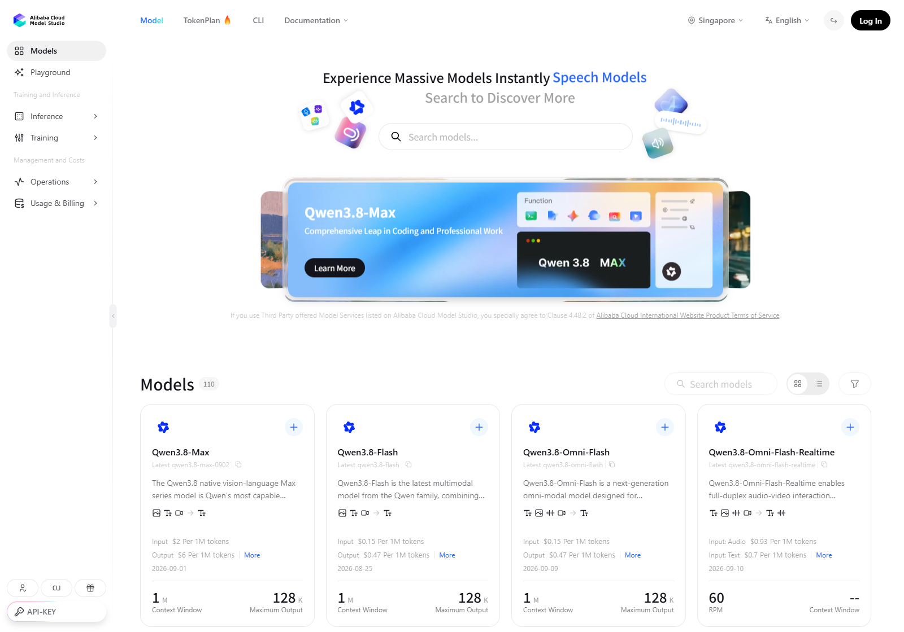
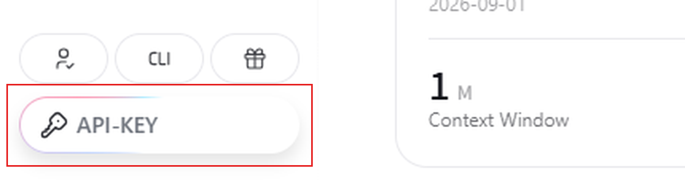
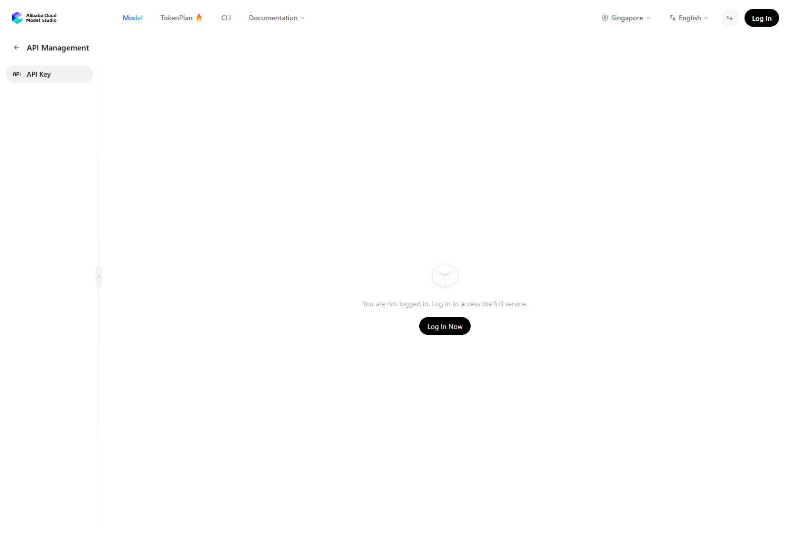

# vrchat-livetranslate · Guide

> [中文](GUIDE.md) | **English** | [日本語](GUIDE.ja.md) | [한국어](GUIDE.ko.md) | [Русский](GUIDE.ru.md)

> 🪟 **This is the Windows guide.**
> On **Linux**, see **[GUIDE.linux.md](GUIDE.linux.md)** — installation (`./setup.sh`), virtual
> sound card, wrist display and troubleshooting are all Linux-specific; the Windows details below
> (exe / `.bat` / VB-Cable / WASAPI) do not apply.
> Both platforms share the same `config.yaml` with identical semantics.

[← Back to README](README.en.md)

---

## 0. Fastest start: download the ready-made exe

Grab **`VRChatLiveTranslate.exe`** from
**[Releases](https://github.com/nixi-agent/vrchat-livetranslate/releases/latest)**
(**single file, no install, no console window**) and double-click it.

- You still need your own **Qwen Cloud API key**: paste and save it in "⚙ Settings"
- Config and logs live in `%APPDATA%\vrchat-livetranslate` (works even if the exe sits in a read-only folder)
- Want a portable build (config travels with the exe) → put an **empty `portable.txt`** next to the exe
- If an older version left `config.yaml` / `logs/` next to the exe, the first run **migrates them automatically** to the new location; the original files are not deleted

### Does it auto-update?

It **checks automatically**, but **never installs on its own** — whether and when to upgrade is always your call:

- On every launch it quietly checks once in the background; if the check fails (e.g. no network) it doesn't bother you, just logs it
- When a new version is found you get a dialog with three choices:
  - **Update now** → downloads automatically (about a minute or two); when done, click "Restart and update now" to switch immediately;
    or click "Update later" and it swaps in when you next close the app — the next launch is the new version
  - **Next time** → no more popups this run; it checks again on the next launch
  - **Skip this version** → ignores this version; you'll be told about the next one
- Download failed → you can retry, or click "Open the download page" in the window and grab it from Releases yourself
- Want to check when there's no popup → "⚙ Settings → Software update → Check for updates"
- Updating **never touches your config or API key**; after a successful update the next launch tells you so

**Running from source**: none of the above applies — just `git pull` in the repo (clicking "Update now" in a source run tells you the same thing).

Want to read the source / build it yourself / hack on it → start from section 1 below.

---

## 1. Prerequisites (Windows)

1. **Windows 10 / 11** (uses WASAPI and SteamVR)
2. **Python 3.11** (3.12 untested; make sure to tick *Add python.exe to PATH* during install) — *ignore this if you only use the exe*
   <https://www.python.org/downloads/release/python-3119/>
3. **VRChat**: enable OSC in settings (`OSC enabled: True`) and set chat bubble visibility to **Everyone**
4. **SteamVR** — only needed for the "others speak → wrist display" feature
5. **Qwen Cloud API key** (individual real-name verification is enough)

## 2. Install (from source)

Double-click **`setup.bat`** (creates `.venv` + installs dependencies, about 1–2 minutes).

Manual equivalent:

```bat
python -m venv .venv
.venv\Scripts\python.exe -m pip install --upgrade pip
.venv\Scripts\python.exe -m pip install -r requirements-windows.txt
```

## 3. Configure the API key

> 🔑 No Qwen Cloud account yet? **[Sign up for Qwen Cloud ▸](https://www.qianwenai.com/)**

Sources are tried in the order below — **the first hit wins**:

| Priority | Source | How to set |
|---|---|---|
| 1 | Key saved in the GUI | Paste and save in "⚙ Settings → API key" (stored in `%USERPROFILE%\.vrchat-livetranslate\api_key.txt`) |
| 2 | Environment variable | `setx DASHSCOPE_API_KEY "sk-your-key"` (**takes effect only in a newly opened terminal**) |
| 3 | Bailian CLI config | `bl auth login --api-key "sk-your-key"` (requires `npm install -g bailian-cli`), read from `%USERPROFILE%\.bailian\config.json` |

**The key is only read from these three places — never written into project files or `config.yaml`.**

> 🔒 **Commit-safety**: the repo ships with credential scanning. Run `install_secret_guard.bat` once to install the
> pre-commit hook, and any commit containing `sk-...` / `gho_...` / `AKIA...` / `Bearer ...` / hardcoded secrets
> is blocked outright (script: `scripts/check_no_secrets.py`).
> Manual full scan: `python scripts/check_no_secrets.py --once`
> Why: once a key lands in git history, deleting the file doesn't remove it — you'd have to rewrite history.
> Better to stop it before commit.

### For users outside mainland China: Alibaba Cloud Model Studio (International)

**Why two lines**: the default "Qwen Cloud" line only serves mainland China — from abroad you cannot
even open an account, and a direct connection is unreliable. Outside mainland China use
**Alibaba Cloud Model Studio (International)** instead: the same models, the same realtime API — only
the entry address and the account system differ. The two lines are **mutually exclusive**: exactly one
of them is working at any moment, whichever you select in the app.

**Three steps to sign up** (all inside the [Model Studio console · Model Market](https://modelstudio.console.alibabacloud.com/ap-southeast-1/model/market)):



1. Create a workspace (or just use the default one) and open it
2. On its "Workspace Details" page, copy the **API Host prefix** — that leading part *is* the
   **workspace ID**, e.g. `llm-xxxx`
   (the full host looks like `llm-xxxx.ap-southeast-1.maas.aliyuncs.com`; take only the leading `llm-xxxx`)
3. Create an API key (`sk-...`) **inside that same workspace** — the entry is `API-KEY` at the **bottom-left** of the console:





**Four steps in the app**:

1. `⚙ Settings → General → Service Line` → select "Alibaba Cloud Model Studio (International)"
2. Enter `llm-xxxx` in "Workspace ID" (on the Qwen Cloud line this box is greyed out — nothing to fill in)
3. Leave "Region" at the default **Singapore (`ap-southeast-1`)** — it is the only choice since this version (see below)
4. Click "Save Line Settings", then paste your key into the "API key" box above and save it

> 🔑 **The two keys are stored separately**: each line keeps its own key file
> (`api_key.txt` / `api_key_bailian_intl.txt`), so switching back and forth **never** asks you to
> re-enter a key. The status line "Current (line): source sk-****6789" follows the active line.
> You must **start translation again** for a line change to take effect (if it is already running,
> the app asks you to stop it first).

**Region: only Singapore works** (and it is the only choice in the UI since this version)

| Region id | City | This app |
|---|---|---|
| `ap-southeast-1` | Singapore (default) | ✅ everything |
| `ap-northeast-1` | Japan (Tokyo) | ❌ no speech models |
| `us-east-1` | US (Virginia) | ❌ no speech models |
| `eu-central-1` | Germany (Frankfurt) | ❌ no speech models |
| `cn-hongkong` | China (Hong Kong) | ❌ no speech models |

> ⚠️ **Why Singapore only**: on Model Studio (International) **each region has its own endpoint,
> API key and model list, and they cannot be used across regions** (official wording: *"Each region
> has its own endpoint, API Key, and model list. These cannot be used across regions."*). The speech
> chain this app needs — live interpretation `qwen3.8-livetranslate-flash-realtime`, voice preview /
> typed speech `qwen3-tts-flash`, Omni voices `qwen3.5-omni-flash` — is deployed on the international
> site **only in Singapore**. Tokyo, Virginia, Frankfurt and Hong Kong have no speech models at all
> (Tokyo does not even have `qwen-mt-flash`, which typed translation uses). So the UI offers
> **Singapore only**; if your config still holds an old region, pressing "Start translation" will
> **stop you and tell you to change it** (it is never silently rewritten — the region goes into the
> Host, so rewriting it would send your requests to the wrong domain).

> ⚠️ **The key must belong to Singapore too**: a key only works in the region of the workspace it was
> created in. A key from another region (say a workspace in Japan) fails to connect or returns
> `Model not exist` — check in the console that both the workspace and the key are in Singapore.

**The four corresponding `config.yaml` keys** (written in place when you click "Save Line Settings";
no manual editing needed):

```yaml
session:
  provider: qianwen          # line id: qianwen (Qwen Cloud) / bailian_intl (Model Studio International)
  region: ap-southeast-1     # only meaningful for Model Studio (International)
  workspace_id: ""           # workspace ID (llm-xxxx); leave empty on Qwen Cloud
  base_url: wss://maas.qianwenaiapi.com/api-ws/v1/realtime
```

After switching to Model Studio (International), `base_url` becomes the following (`{workspace_id}` is a
**literal placeholder**, replaced only at connect time — so changing the workspace ID later does *not*
mean editing this line):

```yaml
  base_url: wss://{workspace_id}.ap-southeast-1.maas.aliyuncs.com/api-ws/v1/realtime
```

**`base_url` is the only source of truth for where it actually connects**; `provider` only decides the
UI defaults, which key file is used, and the validation rules (Model Studio (International) **must**
have a workspace ID — without one, saving is refused in red and "Start translation" is blocked and
takes you to the settings page).

> 🔍 **Troubleshooting**: in the log, `[net] 线路=… host=…` is the address actually in use (the workspace ID is masked),
> and `[gui] 服务线路已保存：…` is what the UI wrote to disk. If the two disagree, you changed the line
> but have not restarted translation yet.

## 4. Self-check

**Exe users**: launch it and confirm three things —

1. In "⚙ Settings", none of the three device dropdowns is empty (`Microphone` / `VRChat audio` / `Audio output`)
2. The API key status shows **configured** (otherwise clicking it takes you to the sign-up page)
3. Tick `chatbox`, click "Start translation", say one sentence into the mic → the translation appears in the bubble

**Source installs**: double-click **`run_selfcheck.bat`**. It does four things in order; the first 3 need neither a microphone nor VRChat:

1. Module import check (engine / session / overlay / chatbox / merger)
2. Reads the API key once and prints it masked (confirms the priority order)
3. Renders one wrist-display frame offline (does not take over SteamVR)
4. Runs the bundled test audio through the full pipeline (Chinese → English, into the chatbox)

If VRChat is running, the bubble should show:

```
Hello, I'm Nixi. Today, we're going to test out the real-time simultaneous interpretation feature in VRChat.
```

**Run the self-check before filing a bug.**

---

## 5. Usage

### GUI (recommended)

**Double-click the exe**, or on a source install double-click **`run_gui.bat`** — same window either way
(Tkinter, standard library only, zero extra dependencies, opens instantly).

| Area | Contents |
|---|---|
| Top row | `Start translation` / `Stop translation`, direction radio (`I speak` / `Others speak` / `Both at once`), language-pair dropdown (source → target), `☕ Sponsor` and `⚙ Settings` on the right |
| Second row | `Output:` checkboxes for `chatbox` / `wrist display` / `audio output`, plus the `Fine-tune ▸` button; on the far right the API key status (plain text `API key configured` when set, **otherwise a clickable "⚠ No API key · sign up for Qwen Cloud ▸"**) |
| Chat area | Blue bubbles on the right = what I said, gray bubbles on the left = what others said; two lines per bubble — **original in small text on top, translation in large text below**; scrollable history (cap 500 entries) |
| Status bar | Left: colored dot + latest status message; right: stats (`Running` / `N translated` / `first delta Xms`); the two never overlap |
| Bottom bar | **Typing input**: `Type:` box + `Send`, **Enter sends** (`Esc` clears). Enabled only when the direction includes "I speak", greyed out otherwise |
| `☕ Sponsor` popup | Ko-fi link button + WeChat / Alipay QR codes (scaled proportionally to 240 px, directly scannable) |

- **Streaming display**: non-final deltas **redraw the same bubble in place** instead of appending a new one per delta
- **Both at once**: two translation directions in one window (microphone → right side, game audio → left side); the second **starts with a 300 ms stagger** to avoid fighting over the audio device; if either side fails, the other keeps working
- **Language mirroring**: one pair covers both directions — pick "Chinese → English" and the others-speak direction automatically becomes "English → Chinese".
  Source language can be `Auto-detect` / Chinese / English / Japanese / Korean / French / German / Spanish / Russian / Thai (the target list is the same minus "Auto-detect");
  with `Auto-detect` as source, the other direction's target falls back to Chinese and the status bar says so. Changes **take effect immediately**, are written back to config, and persist across launches
- **Settings dialog** (`⚙ Settings`): API key entry / clearing, three audio device dropdowns + `Refresh`, log area (`Export log bundle…`)
- **Fine-tune panel** (`Fine-tune ▸`): wrist-display anchor + 14 sliders, **drag to hot-reload, no restart needed** (see "6. Configuration")
- **Typing input**: use the keyboard instead of the microphone when you don't want to talk — type in the bottom bar, **Enter sends**. The translation goes through the **exact same** downstream as speech (chat bubbles / wrist display / chatbox); with "Audio output" ticked **it also speaks**: the translation is synthesized via TTS and written into the virtual sound card so the other person hears it (see `text_input.tts` in "6. Configuration"). It replaces the **microphone**, so it's only available when the direction includes "I speak" (the box is greyed out otherwise)

#### Automated acceptance (headless, no window)

```bat
:: source install
.venv\Scripts\python.exe -m vlt.gui --self-test
.venv\Scripts\python.exe -m vlt.gui --self-test-dual

:: exe (no console window; results go to the log — this is exactly how the build script self-checks)
VRChatLiveTranslate.exe --self-test
```

Prints `GUI_SELFTEST_OK` / `GUI_SELFTEST_DUAL_OK mine=N theirs=N` on success, `..._FAIL: ...` to stderr and a non-zero exit code on failure. Requires a real API key.

> 🪵 **Crash logs**: on every launch the GUI writes a `gui_<timestamp>.log` under `logs/`,
> containing **version info** (git HEAD), the Python environment, and all stdout/stderr (**every line prefixed with an `HH:MM:SS.mmm` timestamp**).
> Four kinds of capture are wired in: native crashes (`faulthandler`), main-thread exceptions, child-thread exceptions, and Tk callback exceptions.
> On a crash, **sending this file to the maintainer is enough to pinpoint the issue** — without it, nothing survives the window closing.
> A single file is rotated at 2 MB; when total logs exceed 5 MB the oldest are deleted. "Settings" can export everything as a single **sanitized** zip.

### Command line (source installs only)

The exe is a single-file GUI with no console window; beyond the `--self-test` above it has no command-line usage. The CLI only makes sense for source installs.

```bat
:: I speak → chatbox (actually sent to VRChat)
.venv\Scripts\python.exe -m vlt.app --direction mine --mic --sink chatbox

:: Others speak → wrist display (requires SteamVR running)
.venv\Scripts\python.exe -m vlt.app --direction theirs --loopback --sink overlay

:: Verify the pipeline without VRChat: run the bundled test audio through
.venv\Scripts\python.exe -m vlt.app --direction mine --pcm testdata\zh_test_16k.pcm --dry-run
```

To translate both directions at once → **open two command-line windows** (or use the GUI's "Both at once", which runs two sessions in one window).
Each direction gets its own WebSocket session; they don't interfere (rate limit RPM 10, plenty).

If the commands feel long, use the ready-made bats: **`run_chatbox.bat`** (I speak → bubble; lists devices first, then starts)
and **`run_overlay.bat`** (others speak → wrist display).

#### All parameters

| Parameter | Effect |
|---|---|
| `--direction mine/theirs` | Which direction in `config.yaml` to use |
| `--mic` / `--loopback` / `--pcm <file>` | Audio source: microphone / VRChat playback output / offline PCM (pick one; priority `--pcm` > `--mic` > `--loopback`) |
| `--sink chatbox/overlay/both` | Output destination (default `chatbox`) |
| `--list-devices` | List audio input/output devices and exit |
| `--dry-run` | Don't actually send OSC; only print and dump the packets |
| `--overlay-dry-run` | Overlay doesn't take over SteamVR; renders each frame to PNG in `out/overlay_frames/` |
| `--audio-out` | Enable translated-voice output (overrides `output.audio.enabled` in `config.yaml`) |
| `--audio-device <name...>` | Virtual sound card name fallback chain (overrides the default in `config.yaml`) |
| `--no-realtime` | Feed PCM as fast as possible (no real-time throttling; only meaningful with `--pcm`) |
| `--settle-s <seconds>` | Seconds to wait for responses after audio ends (default 8) |
| `--config <path>` | Use a different config file |

> Microphone capture runs **continuously**: until `Ctrl+C` (there is no duration parameter).
>
> 📌 **No flag needed to pick audio devices**: choose in the GUI under "⚙ Settings" (the first dropdown entry, "Auto-detect", walks the fallback chain),
> or edit `capture.mic_device` / `capture.loopback_device` in `config.yaml` directly.
> What's stored is the **device name string**, not an index — indices shift wholesale with hot-plugs and session switches.
>
> ⚠️ **Only enabled devices are listed, and each sound card appears once**: the app lists just the
> **WASAPI** endpoints — i.e. the ones **enabled** in Windows Sound settings (disabled endpoints are
> not shown; enable them under "Sound → More sound settings" first). So you will no longer see the
> same microphone two or three times with different sample rates, and the rate in parentheses **is
> the rate that will actually be used** (usually 48000). Names saved in older configs still resolve
> — they land on the same-named WASAPI endpoint.

---

## 6. Configuration (`config.yaml`)

> 📄 **On first run, `config.yaml` is generated automatically from `config.example.yaml`.**
> `config.yaml` is **your own config** (device choices, language preferences, etc.) — it's gitignored and
> **never enters version control**, because things like device names differ per machine and would only pollute each other.
> To restore defaults: delete it and start again.
>
> Where it lives:
> - **Exe**: `%APPDATA%\vrchat-livetranslate\config.yaml` (portable builds with `portable.txt` keep it next to the exe)
> - **Source install**: `config.yaml` in the repo root
>
> 🛟 **A broken config can't stop you from launching**: if YAML parsing fails, the file is automatically backed up as
> `config.yaml.broken`, a fresh copy is regenerated from the template with a clear explanation printed, and startup continues.

Anything you change in the GUI (direction, output checkboxes, languages, devices, wrist-display fine-tuning) is **written back in place** to this file —
only that one line changes; **comments, blank lines, and key order are all preserved** (the generated YAML is validated before writing; invalid output is rejected).

### Key keys

```yaml
session:
  model: qwen3.8-livetranslate-flash-realtime   # also works with qwen3.5-* (event names are dispatched per generation)
  base_url: wss://dashscope.aliyuncs.com/api-ws/v1/realtime
  voice: Tina                 # ⚠️ must be given explicitly — leaving it unset raises Voice 'Chelsie' is not supported
  turn_detection: null        # empty = server default
  final_silence_s: 3.0        # ⚠️ must be > the server's delta interval (measured max 2.3 s); a smaller value makes the final version jump the gun mid-sentence
  max_new_sessions_per_minute: 4   # RPM 10 budget: every WS connection counts as one request
  reconnect_backoff: [2, 5, 10, 30]

capture:                      # empty string = auto-detect
  mic_device: ""
  loopback_device: ""

directions:
  mine:   { source_lang: zh,   target_lang: en, output_audio: false }   # I speak → bubble
  theirs: { source_lang: null, target_lang: zh, output_audio: false }   # others speak → wrist overlay (null = auto-detect)

chatbox:
  interval_s: 2.0             # first delta sent immediately, then a snapshot every 2 s, final version always flushed at end of sentence
  max_chars: 144              # official limit (characters, not bytes)

text_input:                   # typing input (bottom-bar box, Enter sends)
  enabled: true               # false = the input row isn't shown in the UI
  model: qwen-mt-flash        # typing goes through the **text** translation model; qwen-mt-plus also works
                              # ⚠️ don't use qwen3-livetranslate-flash here: measured, its text endpoint just echoes the input back
  timeout_s: 20               # per-translation timeout (seconds)
  tts:                        # typed input speaks too (translation → TTS → virtual sound card → the other person hears it)
    enabled: true             # requires "Voice Output" ticked and a direction including "Me"; with voice output off this step is skipped and only text comes out
    model: qwen3-tts-flash    # qwen3-tts-instruct-flash also works
    voice: Cherry             # multilingual voice (measured working for Chinese / English / Japanese)
    timeout_s: 30

merger:
  interval_s: 2.0             # first delta sent immediately, then a snapshot every 2 s, final version always flushed at end of sentence
  carry_over: false           # true = keep the previous final translation as a prefix (gives a continuous-subtitle feel)

overlay:
  interval_s: 0               # 0 = push to screen as soon as there's an update (local display isn't bound by the chatbox rate limit)
  anchor: right_hand          # left_hand | right_hand | tracker | hmd
  offsets:                    # ★ each anchor keeps its own pose (switching anchors loads it; they never overwrite each other)
    right_hand: {pos: [0.0, 0.06, 0.02], rot: [-47, -16, 0]}
    left_hand:  {pos: [0.0, 0.06, 0.02], rot: [-47, 16, 0]}   # left hand = mirror of the right
  offset:                     # fallback: used when an anchor has no pose of its own (panel properties live here too)
    width_m: 0.23
  size_px: [1024, 320]
  font_size: 42               # translation font size
  source_font_size: 30        # source font size
  show_source: true           # two-line display (3.8 returns the recognized source text anyway, at no extra cost)

output:
  audio:
    enabled: false            # master switch for voice output: ANDed with directions.<X>.output_audio
    device_name: ""           # manually picked virtual sound card name (when non-empty it wins over the fallback chain)
```

### Wrist-display fine-tune panel (14 sliders, live while dragging)

| Slider | Range / step | Slider | Range / step |
|---|---|---|---|
| Position X / Y / Z | −0.30 ~ 0.30 m, 0.005 | Size | 0.05 ~ 0.80 m, 0.01 |
| Pitch / Yaw / Roll | −180 ~ 180°, 1 | Curvature | 0.0 ~ 0.50, 0.01 (fraction of a full circle; 0.5 = 180°) |
| Opacity | 0.10 ~ 1.00, 0.05 | Translation font size | 20 ~ 64, 1 |
| Source font size | 14 ~ 48, 1 | Panel height | 240 ~ 560 px, 10 |
| Plate opacity | 0 ~ 255, 5 | Source opacity | 0 ~ 255, 5 |

Plus an **anchor** dropdown (right hand / left hand / external tracker / fixed in front of the HMD) and a **tracker index** (0–7).
**Each anchor keeps its own offset** (`overlay.offsets.<anchor>`): switching the dropdown loads that anchor's
pose, so tuning one never overwrites another. `overlay.offset` is only the fallback for anchors you haven't
stored yet. Left and right hand grip frames are mirrored along X, so the left-hand pose is *not* a copy of
the right-hand one (`rx` unchanged, `ry`/`rz` negated, and the same for the position's `x`).
Changes are written to disk with 200 ms debounce; **translation font size / source font size / panel height /
plate opacity / source opacity** trigger a one-frame texture re-render, the rest only re-apply the transform.
**Plate opacity** is the translucent backdrop (lower = you see more of the scene; 255 = fully opaque);
**source opacity** affects only the source line — set it to 255 for "translucent panel, solid text".
The top-level **opacity** is a whole-layer multiplier (fades plate and text together), the same semantics
as SteamVR's `setOverlayAlpha` on Windows.

> Measured reference: 42/30 font sizes + a 320 px panel fits **2 rounds** of dialogue; 36/24 + 420 px fits **3 rounds, 6 lines**.

---

### Desktop subtitle (a caption window pinned to VRChat — no headset needed)

**For PC desktop-mode players** (issue #11): tick "Desktop subtitle" in the output row and a
**borderless, always-on-top, click-through** caption window appears, showing the latest chat lines
(others on the left, you on the right).

* **Pinning**: by default it sits at the **bottom centre of the VRChat window** and follows it
  (moves and resolution changes included). If the VRChat window isn't found it falls back to fixed
  coordinates and logs one line.
* **Position**: `Fine-tune ▸` → the "Desktop subtitle" row → "Unlock drag" → drag it where you want →
  "Lock position" (the drop point is converted back to "which anchor + offset against the game
  window" and written to `config.yaml`, so the caption keeps hugging the same edge when VRChat moves).
  Click-through is on by default (so it never blocks clicks into VRChat); dragging requires unlocking.
* **Opacity**: the slider in the same row, 0.20–1.00, applied live and persisted on release.
* **Config**: the `desktop_overlay:` section of `config.yaml` (`mode: latest` turns it into a
  lyric-style single line). Visual parameters (font / size / colours / lines / show-source)
  **inherit from `overlay:`** by default; override any of them in `desktop_overlay:`.
* **Linux**: on a **Wayland session** (niri / sway / Hyprland / KDE — compositors implementing
  layer-shell) the caption runs as a **native overlay window**: per-pixel transparency (real
  rounded corners, translucent plate), topmost, follows the game window, protocol-level
  click-through, drag persistence — the same as Windows. X11 sessions (including GNOME/Weston with
  XWayland) run a **native ARGB overlay window**: per-pixel alpha + X Shape click-through;
  blending needs a compositor (picom etc.) — without one it automatically degrades to a 1-bit
  shape mask that trims the transparent area (no black frame; corners become jagged, the plate
  is opaque) and says so in the log. `desktop_overlay.backend` forces a specific path (handy when debugging
  rendering) — see the "Desktop subtitle" section of [GUIDE.linux.md](GUIDE.linux.md) for boundaries.

> ⚠️ VRChat must be in **windowed / borderless** mode (Unity `Fullscreen mode = 3`, the VRChat default).
> In exclusive fullscreen any third-party topmost window gets covered — that's not a bug of this app.
> Preview the rendering offline: `python -m vlt.output.desktop_overlay --demo --out out/desktop_frames`.

### Multiplayer room (a few people watching each other's subtitles)

**For when a group plays together but the voice channel is taken over by the players around you
speaking their own language**: several people **each** run their own copy of this app and enter the
**same room code** to join the same room, and then see **what the others are saying** on their own
wrist overlay / desktop subtitles.

* **How to turn it on**: `⚙ Settings → Room` → enter the **room code** (8 characters, both ends must
  match; if you can't be bothered coming up with one, click "Generate" and read the code out to the
  other person) and a **nickname** (leave it empty to use the system user name) → close Settings →
  click **"Join Room"** on the third row of the main window. Once connected the button turns into a
  **reddish-brown "Disconnect"**, with `Status: Connected · N online` shown on the right.
* **To be heard you have to click "Start" first**: what travels through the room is the **recognized
  source text of what you say** (no translation), and that source text comes from the microphone leg —
  if you aren't translating you only receive the others' text and send nothing yourself. The direction
  has to include "Me".
* **Room code**: 8 characters of Crockford Base32, with the **easily misread `I / L / O / U` taken out**.
  Typing is forgiving: `I` and `L` are read as `1`, `O` as `0`, and hyphens and spaces are ignored.
  To get into the same room, everyone has to have the **same code**.
* **Only your own speech is broadcast**: the leg that captures game audio (loopback) is explicitly
  excluded — what the others say is never relayed on by you, so no loop can form.
* **Wrist overlay colour-coded per person + nickname shown**: with several people talking at once you
  can still tell who is speaking; the chat area and the desktop subtitles show the same.
* **Changes take effect immediately**: the room code / nickname are written to `config.yaml` right away;
  if you are already connected it **reconnects** with the new settings.
* **Config**: the `room:` section of `config.yaml` (the UI only exposes the room code and the nickname,
  the rest you can edit by hand)

  ```yaml
  room:
    enabled: true                      # set to true once you have clicked "Join Room"; remembered next launch
    server_url: "wss://vlt-room.kcm-nixi.cn/ws"
    room_code: "TESTTEST"              # 8 characters, both ends must match
    nickname: ""                       # empty = use the system user name
    broadcast_source: true             # send what "I" say into the room
    show_remote: true                  # show what others say on the wrist overlay / in the chat area
  ```
* **Server**: the Cloudflare Worker in `server/` (one Durable Object per room) — **text only**: it
  doesn't translate, doesn't store anything, and reclaims the room once it's empty. To host your own,
  deploy it as described in [server/README.md](../server/README.md) and point `server_url` at your
  own address.
* **This version moves text only, no audio**: the interface for feeding TTS back is already reserved,
  but not opened up in this version.

> ⚠️ Known limitation: the **member number of each person in the room is generated randomly by the server
> on every connection**, so "the same person keeps the same colour after reconnecting" **does not hold** —
> when someone disconnects and rejoins, they come back in a different colour on your screen.
> In practice, just identify people by **nickname** (nicknames are stable).

---

## 7. Troubleshooting

| Symptom | Cause / fix |
|---|---|
| Nothing in the bubble | VRChat not running / OSC off / chat bubble visibility is Off. If `--dry-run` shows send logs, the program side is fine |
| `[loopback] ❌ no loopback device found` | VRChat isn't playing any sound; or you're **running inside a Remote Desktop session** (WASAPI endpoints are per-session isolated — you must be on the physical machine's current session) |
| Microphone captures nothing | Same as above; first check which device is selected in the dropdown under "⚙ Settings" (when enumeration is empty the status bar notes that empty enumeration is normal in a remote session) |
| `Voice 'Chelsie' is not supported` | `session.voice` is unset. Keep it at `Tina` |
| `Invalid translation parameter` | `session.update` is missing the `translation` field (guaranteed in code; watch out if you modify it) |
| `1007 Requests rate limit exceeded` | Hit RPM 10. Wait 1 minute; don't restart frequently (**every WS connection counts as one request**) |
| Translation stuck at half a sentence | The silence-fallback threshold was lowered. `session.final_silence_s` must be > 2.3 s; default 3.0 |
| `[overlay] ⚠️ SteamVR not running or unavailable` | Normal degradation: only the wrist display won't show; chatbox is unaffected |
| Wrist display invisible | First confirm SteamVR is running; then adjust position / size in "Fine-tune"; if `--overlay-dry-run` produces PNGs, rendering is fine |
| Wrist display disappears after a while | Two-level self-healing is built in (3 consecutive failures → rebuild the overlay → 3 more → hard-restart the openvr connection → retry once every 50 attempts after that). The log has an `[overlay][diag] heartbeat: …` line every 30 s showing "how long since last successful upload / rebuild count" |
| No sound from audio output | ① both switches must be on (output checkbox + direction-level); ② only works for the "I speak" direction; ③ is a virtual sound card installed? the status bar / log states the reason plainly; ④ **everything else is unaffected** |
| Clicking "Start translation" in the GUI does nothing | Check the terminal output first — exceptions in asyncio callbacks only print a one-line traceback to the console, not the status bar (with the exe, look at the newest `.log` in `logs/`) |
| An error you can't make sense of | **"⚙ Settings → Export log bundle"** — automatically sanitized; send the zip to the maintainer |

---

## 8. Project structure

```
vlt/
├── app.py                CLI entry point (audio source → session → throttling → output)
├── engine.py             Programmable engine: session + watchdog reconnect + throttling + start/stop of chatbox/overlay/voice output
├── gui.py                Tkinter GUI (includes the headless --self-test acceptance run)
├── config.py             Config loading; credential resolution order; self-healing after a bad write
├── textin.py             Typing input: text translation (the realtime model takes no text entry, hence compatible-mode)
├── tts.py                Spoken typing: the translation is synthesized by qwen3-tts and fed to the virtual-sound-card leg
├── credentials.py        Save / clear / mask the API key
├── devices.py            Audio device enumeration and "resolve a name back to an index"
├── paths.py              Writable-directory decision (source / exe / portable) + migration of old files
├── crashlog.py           Crash capture + log rotation/cleanup + redacted export
├── platform/             Platform abstraction layer (win / linux / audio; shared code goes through the facade only)
├── room/                 Multiplayer room text relay: protocol / model / client / uplink publisher / reserved hooks
├── session/
│   ├── base.py           TextDelta / SessionConfig / create_session (dispatched by model generation)
│   └── qwen38.py         3.8 and 3.5 event dispatch + connection budget + silence fallback + event instrumentation
└── output/
    ├── merger.py         First delta sent immediately → 2 s snapshot → flush at end of sentence
    ├── chatbox.py        OSC ,sTT + token bucket + resend queue for the final version
    ├── overlay.py        **Shared rendering** for both subtitle legs (the wrist overlay and the desktop subtitles both use it)
    ├── openvr_overlay.py Windows: SteamVR wrist-overlay backend (anchor / hot-reload / two-level self-healing)
    ├── openxr_overlay.py Linux: built-in OpenXR wrist-overlay backend
    ├── desktop_overlay.py Desktop subtitle window (pinned to the VRChat window; draggable, adjustable opacity)
    └── virtualmic.py     Voice feed-back: 24k→48k resampling + jitter buffer (whole utterances dropped, never cut mid-sentence)

server/                   The multiplayer room server (Cloudflare Worker + Durable Object, deployed separately)
scripts/                  Probes and debug tools (probe_* / osc_listen / verify_release / room_e2e_local)
tests/                    58 files, 467 test functions (all run offline; CI runs them file by
                          file, and does not include tests/test_engine.py, which needs a real API key)
docs/                     The three P0.5 / P1 / P2 measured results (protocol, latency, wrist overlay)
testdata/                 Bundled test audio (Chinese 8.56 s, English 7.92 s, 16 kHz mono PCM)
assets/                   Icon, UI screenshots and the sponsor QR codes
```

---

## 9. Development

### Running tests

**No pytest** (it's not a dependency): every test file is a standalone executable script, identical to what CI runs:

```bat
:: all (file by file, identical to CI; paste directly in cmd — in a .bat file change %t to %%t)
for %t in (tests\test_*.py) do @.venv\Scripts\python.exe %t

:: single file
.venv\Scripts\python.exe tests\test_virtualmic.py
```

The tests **all run offline** (no microphone / VRChat / SteamVR / network needed), covering device resolution, path decisions,
reconnect, log rotation and sanitization, the sponsor popup, wrist-display self-healing, translated-audio buffer invariants, in-place config writes preserving comments, and more.

The only exception is `tests/test_engine.py`: it opens one real session and **requires a configured API key on the machine**;
CI skips it explicitly (the workflow prints a `::notice::` explaining why — no silent skip).

### Packaging

```bat
build_exe.bat                                              :: build + self-check afterwards
.venv\Scripts\python.exe scripts\build_exe.py --no-verify  :: build only
```

Output `dist\VRChatLiveTranslate.exe`: PyInstaller **single file, no console window**,
bundles `config.example.yaml` / `testdata` / `assets`, about 37 MB.
By default the build then really runs `exe --self-test` once; only finding `GUI_SELFTEST_OK` in the log counts as a pass.

### CI / Release

- **CI** (`.github/workflows/ci.yml`, on push to main / PR / manual):
  syntax check → credential scan → all offline tests file by file → then a separate **packaging-pipeline** check (artifact exists and is ≥ 20 MB)
- **Release** (`.github/workflows/release.yml`, triggered by pushing a `v*` tag):
  first reconciles the tag against `__version__` in `vlt/__init__.py` (mismatch = hard fail) → packages the **exe and the Linux AppImage** →
  creates the Release with the **exe**, **`VRChatLiveTranslate-x86_64.AppImage`** and `SHA256SUMS.txt` attached (GitHub shows a `sha256:…` digest next to every asset; the checksum file is a transition aid for clients up to v0.2.0, which only look for it)
- **Want to verify a download yourself**: `scripts/verify_release.py` pulls the Release assets and reconciles them
  (SHA256, actually runs `--self-test`, version line, searches bytecode for new-feature strings, icon pixel comparison):

  ```bat
  .venv\Scripts\python.exe scripts\verify_release.py v0.7.3 "pa_index,region_supported,已回落"
  ```

---

## 10. Known limitations

> These are **Windows**-side limitations. For Linux, see
> [GUIDE.linux.md](GUIDE.linux.md) section 8.

- The wrist display requires **SteamVR as the active compositor**; with a vendor-native OpenXR runtime, third-party PC-side overlays don't show
- The input side **only gets one stereo channel of the game's mixed audio**: no per-speaker channels exist, so when several people talk over each other in the mix, speaker attribution is inherently unreliable
- The WebSocket path has **no echo cancellation or noise suppression** → **wearing headphones is a hard requirement** (on speakers the other person's voice gets captured too and the same sentence gets recognized twice)
- Translating both directions at once = two WebSocket sessions, and the budget is charged for both
- **Typing with voice is two requests: "translate + TTS"** — the text appears almost immediately, but the audio has to wait for TTS synthesis (measured end-to-end ≈ 2.6 s),
  so the other person hears it a second or two after you see it in the bubble; the voice is a TTS voice (default `Cherry`), **not the same** as the realtime-model voice of the speech path.
  Same conditions as the third leg: "Audio output" ticked and a virtual sound card available, otherwise it's skipped automatically and only text is produced
- **Typing replaces the microphone**: so it's only available when the direction includes "I speak", and only after you've clicked "Start translation"
- **What the room carries is the recognized source text of what *you* say, not the translation**, and it
  only goes out after you click "Start"; the people in the room see your source text (a different
  interface language on their side doesn't translate it automatically)
- **A room member's colour changes when they reconnect**: the member number is generated randomly by
  the server on every connection, so "same colour after reconnecting" doesn't hold — identify people
  by nickname instead
- **The chatbox only carries translations of what *I* say**: translations of what others say don't go into the chatbox bubble — watch the wrist display or the GUI chat area instead

---

[← Back to README](README.en.md)
